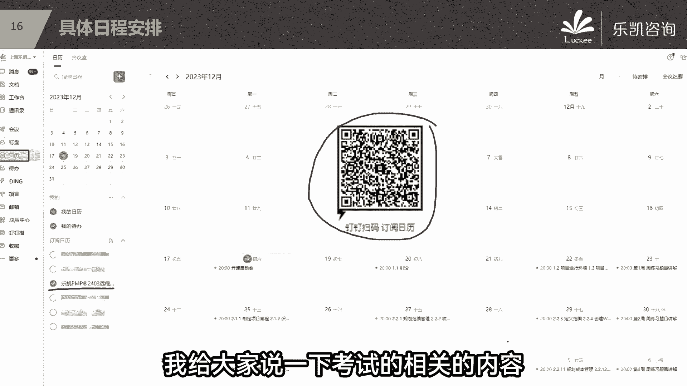
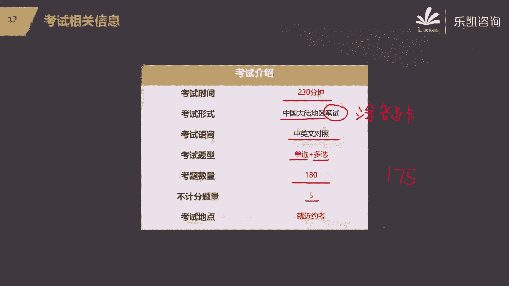

# 【PMP考试零障碍】2024年度精品课程免费观看，全面掌握项目管理技能！ - P4：04.乐凯PMP学习安排及PMP考试相关介绍 - 乐凯PMP项目管理 - BV1pi4y167Fj

针对PMP我们应该用什么样的计划去学习，给大家说一下我们接下来的学习计划好吧，我们从这周开始，今天是星期一正式的考试，星期375，我们每周呢一般有三天的正式的课，周一周三周五周六我们会讲题好吧。

第一组就是这一周我们会把第一部分讲掉，接下来第二部分项目管理过程，它的内容特别的多，我们会放在第二周到第六周把它剪掉好吧，敏捷的知识点呢它其实不多了，那么我们会在第七周把它剪掉，明白吧，很多同学会说。

为什么敏捷就这么一点点啊，你要知道啊，我们专门的敏捷的培训，你们可以去了解一下，比如说我们刚刚讲到敏捷的实践，或者我们偏偏VIP pm也有一个认证叫CP，你们可以去了解一下，像这些认证单独的讲敏捷的。

你知道他培训是培训多长时间吗，敏捷单纯的敏捷培训也就是培训个两天时间，特别像RAME这种两天，明白吗，所以敏捷它的试点它并不多，他的题目很多明白吧，所以敏捷的内容它不多的，第七周我们会讲敏捷。

七周讲完了之后呢，年前的任务就结束了，年后就是后面的第四部分，以及我们的冲刺模拟好吧，我们正式的课程的安排，从星期三开始，大家要习惯，我们一般是19。45到20点，这个时间我们会放音乐。

那么放音乐的目的是什么，是让大家能够调试设备，比如说有没有声音啊，怎么怎么看不到PPT啊等等，这些在八点钟之前要把它解决掉好吧，接下来正式的上课，我们每次上课就一个半小时，一个半小时好吧，八点到09：

30染完课结束之后，如果有什么疑问的，听不懂的，那么我会留半个小时的时间答疑，大家可以在旁边打字问好吧，课程讲完了之后，第二天会有配套的每日一练八道题，那么每周会有周练习40道题。

那么周练习我们在周六的晚上八点钟，我们会去讲解的好吧，我在2月3号讲到这个位置，大家开始准备，过年年后我们会讲剩下来的第四部分，以及我们的冲刺模拟，那么冲刺模拟。

我们会帮大家把第二部分和第三部分进行复习，接下来还有几套模拟，包括解题思路，一直到3月，一般你们3月份的考试啊，应该是在3月的下旬，3月的下旬，经过这几次模拟之后，那么你们在3月的下旬。

就可以顺利的去参加偏僻的考试了，一般来说你按照这个节奏往下走的话，考试是不会有什么问题的，好吧，至于具体的什么时候上什么课，那么我建议大家，如果现在有时间，你就现在把手机拿出来，用钉钉去扫这个二维码。

你用钉钉去扫这个二维码之后，那么你就会订阅到我们24年3月份，班的真表的日历，那么接下来在钉钉的日历里面，就会显示所有的课程安排，而且在上课之前，今天会提示你的好吧，那么就不用大家去找班主任。

要那么PDF文档去看课表，没有那么简单，现在社会已经发展到这个地步了啊，直接用钉钉去扫就可以了好吧，如果说我们有同学今天没有听课，明天是听这个录播的，你也可以去扫一扫这个东西好吧。

有同学在问考试的这个问题，比如说考试是什么形式，多久可以拿证等等等等，好，接下来我给大家说一下考试的相关的内容好吧。

那么我们偏僻的考试，最终是230分钟的时间，那么具体3月份是几号考试呢，现在还没有公布，不管怎么说，他应该是一般周六考试，230分钟，在我们中国的大陆地区，注意不是机考，不是机考试，笔试也就是要干什么。

要涂答题卡，要涂答题卡，如果不是在大陆地区，比如说在港澳台，在国外的我们的一些学员，那么他们是机考的，但在我们中国大陆地区，对于我们现在的大部分同学来说，要注意，你要到考场要涂答题卡的好吧。

考试的语言它是中英文对照，有英文明白吧，中英文对照考试的题型都是选择题，都是选择题，当然它分为单选题和多选题，一共有180道题，明白吧，有180道题啊，不要你写字的都是选择题好吧，那么这180道题里面。

按照考纲里面的描述呢，五道题不计分，那么也就是说只有175道题是记分的，有五道题不计分，不计分是什么意思呢，你做对了也不拿分，做错了呢也不扣分。

这五道题是干什么的，一般我们认为这五道题是用来扩充题库的好吧，整个考试什么地方考，他会让你去约考的，月考呢，在我们全国的很多城市都有考点，你就就近月考，比如说我是成都的，成都考，你是苏州的。

就是苏州考上海的，就是上海考一个省里面很多城市都有考场，而且不止一个考场，现在基本上考位是充足的，不会有什么太大的问题的好吧，至于月考到时候听我们的通知，那么到时间了，该约考就去约考好吧。

接下来我们着重要说考试它是怎么评判的，怎么样决定你通过还是不通过，好吧好，175道题，有人说有五道题不计分，知不知道哪五道题不计分，不知道他没有特殊的标记，那么怎么样去保证通过呢。

好我们以175道题来算，按照以往的规律来说，我们通过的标准是正确率要达到60%，也就是105要做对105的，但是这里面有一个问题啊，如果你真的做到105道，做对了。

有没有可能这里面有的题目对的是不计分的呢，是有可能的，所以为了保险再加上五道，我希望大家不管是什么时候，110分以上。

