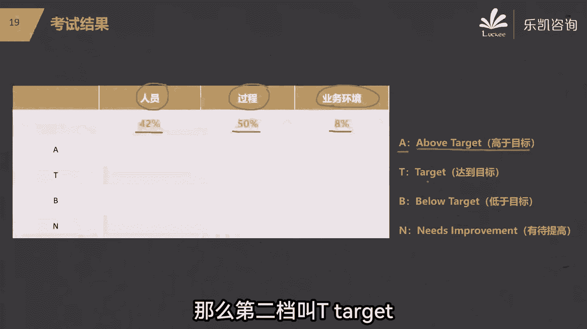
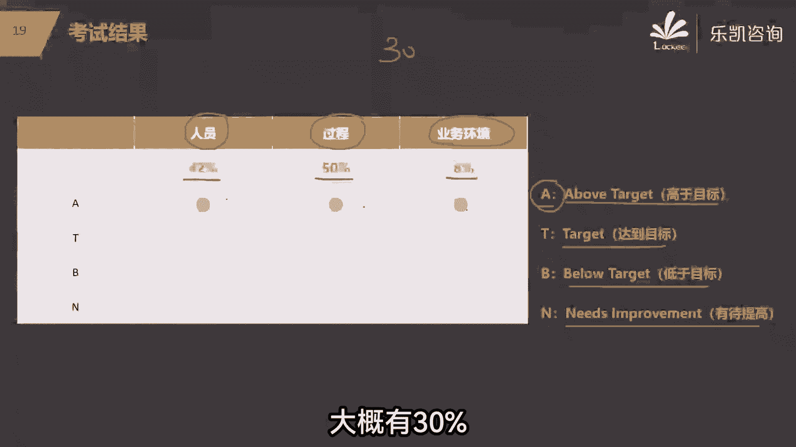
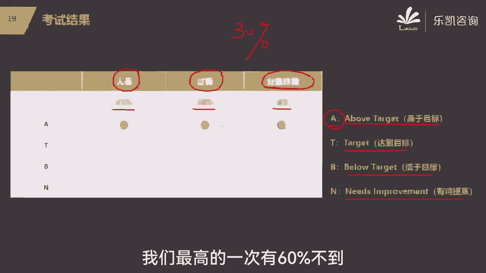

# 【PMP考试零障碍】2024年度精品课程免费观看，全面掌握项目管理技能！ - P5：05.PMP考题样例，PMP是如何评判你的成绩的，PMP成绩单和证书是什么样子的 - 乐凯PMP项目管理 - BV1pi4y167Fj

给大家看一下，有人说那么多选和单选有没有区别，好给大家看一个例子，大家就明白了，每一道题目它是中英文对照的，那么多选和单选它有没有区别，有区别，你看左边的是单选，上面是英文，下面是中文。

那么对于我们大部分同学来说，直接看中文就得了，就看中文比较舒服一点，说实话，英文呢我觉得没有什么必要说一定要去看英文，右边的是多选，注意p mp考试的多选有特点，第一你会明确知道这道题是多选。

因为一般选项会超过四个，第二他会明确告诉你这道多选题请你选几个，这个他是告诉你的，明白吗，在题目上他会告诉你，这是一道多选题，而且请你选四个还是选三个，还是选两个，明白吗，他叫你选几个，你就选几个。

你说我就是头铁，我就他娘的不选四个，我选三个行不行，这很明显不行吗，是不是说人家都已经说到这份上了是吧，所以从这个角度来说，他多选的难度就降低了，那么我们的郑珊珊同学呢，不放心问多选有多少道题啊。

好一般来说多选点基本上在五道题左右，一开始考纲改版的时候，多选很多，大概有十几道题，但是从去年的年底的考试，一直到今今年的这几次考试，他多选题的题量降低了，大概是五六道题不多了好吧，那么大部分都是单选。

所以说光从考试的形式来说，它的难度不大的好吧，接下来有同学说我听说有3A啊，什么2A啊，这个又是什么意思呢，好关于这个问题我再说一下好吧，这180道题啊，它把它分为三大类，有一类呢是跟人员有关的题目。

那么这一类题目占180道题的，42%，有一位呢跟过程有关的占50%，也就是90道题，还有一类呢是跟业务环境有关的，占8%，它把它分成了三类好吧，那么这三类你取得不同的分数，他会给你不同的等级。

等级一共有四个，那么第一个等级叫A，也就是A8，他给你做的很牛逼，超越了大部分人高于目标，那么就是A，那么第二档叫target。

你达到了目标还不错，第三档呢below target，你做的不咋地，低于目标，那么最后一档呢就是做的很差，有待提高，比如说我们现在有一个同学做完180道题，我发现这三类题目好，人员做的很好。

过程做的也很好，业务环境做的也很好，三块都拿到了A这个等级，那么它就是所谓的3A明白吧，那同学说我们每一次3A的占比是多少呢，有高有低，我们一般低的时候会有多少同学拿到3A呢，大概有30%。

30%，高的时候有多少同学拿到3A呢，我们最高的一次有60%不到。

大概是53%还是57的，我忘记了好吧，那可以说这就不是5A吗，对的，之前他是把它分成了五大过程组来划分题目，所以呢他有5A，现在呢是按照这三块来划分题目的，所以现在最好的成绩是3A明白。

但是呢我希望大家不要沉迷于这个等级，因为你的成绩究竟是3A还是3T啊，这只是一个等级，他其实没有实际的意义，比如说我们注意看这个同学，他最终考了一T1BEN好，还有一个同学也是考的一T1BEN。

你会发现绿色的这个同学我们把它称之为小绿，小绿同学通过了考试，小红同学呢挂了，知道为什么吗，成绩单掏出来都是1T1D一赢，为什么小绿通过了考试，有证书，小红没有通过考试，马上有同学发现了。

小红同学虽然也是一个T，但是他T在什么地方，他T在业务环境，业务环境本身题目就少，虽然你这一块做得好，但是你做正确的题目不多，他只有8%嘛，而题目多的，你看这一块他做的是B这一块做的也不好，这块做什么。

这块做的也不好，是不是不是，但是小绿同学呢，他T在什么地方，他T在过程说明他做对的题目比较多，所以同样的等级会有不同的结果，也就是说我强调一下啊，最终决定你通过还是不通过的，还是看什么呢。

还是看你的正确率，而不是看等级，所以等级呢其实意义不是很大，好吧，在考完了之后，大家要注意，在考试结束之后的6~8周会出结果，pi会给你发邮件，明白吗，那么发邮件会发你两个东西，一个叫成绩单。

一个就是你通过的就有证书，好吧好，有人说证书上会有成绩吗，你看这个证书上有成绩吗，没有成绩，只要你通过了，你就有证书，明白吧，那么另外的成绩单这里面它会有，你有没有通过，接下来你具体的成绩是多少。

那么这里面会显示你究竟是几个A，3A还是2A还是什么情况，也就是说证书和成绩单单是分开的，明白吧，那么我想说的是什么，我觉得大家呢不要沉迷于等级，也不要沉迷于证书。

