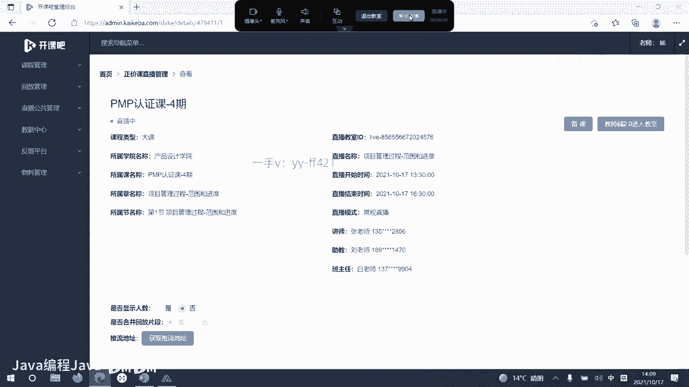
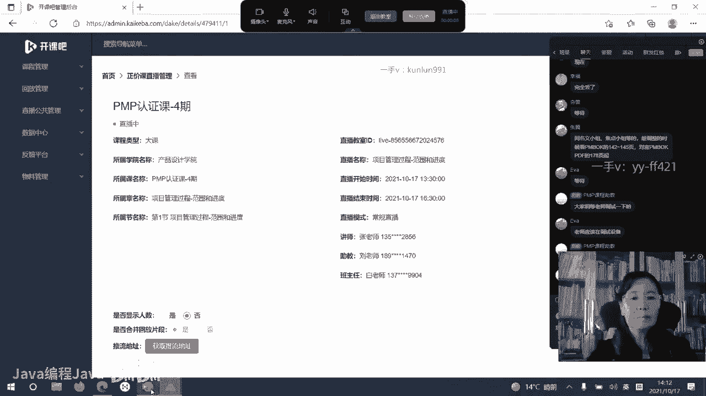
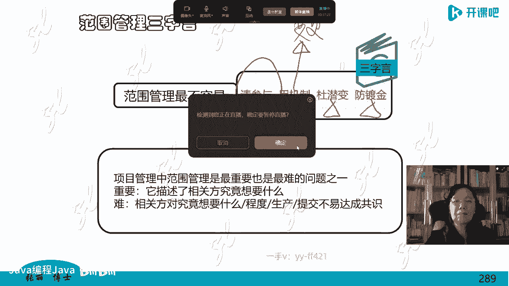

# -PMP认证4期 - P11：16-项目管理过程-范围和进度【itjc8.com】 - OA工作流 - BV1yY4y127aU

好学员们下午好啊，我们今天下午呢要学习范围管理呃，进度管理，这是项目管理中两个比较重要的模块，也就是预测型生命周期的项目，他是从范围开始啊，然后这个规划出进度成本，是这样来进行管理的啊。

那在课程开始之前还有大概两分多钟的时间啊，那么大家还是同样检查一下自己的状况呃，设备情况，音频视频网络情况，如果都没有问题的话，刷一个一啊，也就是做一个这个打卡吧啊，这样大家也精神精神啊。

把这个做笔记啊，什么这些准备工作都做好了啊，然后来刷个一，我也看到有很多学员的比较早就来了啊，已经也没有顾得上午休啊，因为学习确实是一个比较辛苦的事情啊，但是也很开心很快乐啊，好大家说一下。

我也看一看都有哪些学员啊，已经到了，那咱们刷一个一开始下午的这个学习好，下午好啊，所有的学员都下午好，下午呢确实上课就比上午更辛苦啊，嗯还有一分多钟啊，大家在做好准备，我们稍微再等一下啊，稍微等一下嗯。

还没有进入直播间的学员，现在肯定是陆陆续续的，已经有同学进入了啊，新进入的同学都一样啊，按照惯例，咱们把自己的这个学习状况准备好，然后在这个屏幕上啊，直播间的屏幕上刷一个一字啊。

老师就知道都都都有多少学员到了，有多少学员已经做好了准备，如果网络有问题的话，自己调整一下啊，好陆陆续续续啊，已经有些进入了，那么大家的学习热情还是蛮高的啊，下午学习确实比较辛苦，但是咱们要坚持。

还有不到一分钟的时间了啊，我们准时一点半准时开课，新进入加入的学员啊，已经做好准备的啊，就等待开始哈，新进入的学员，如果你的状态一个学习状态的话啊，就刷一个一字，好大部分学员都到了上课的时间。

到了我们就开始上课了，那么今天下午呢，我们要学习范围管理和进度管理啊，那我们还是按照我们的讲课的这个标准化的方，式，也分四个标题概念这个过程的目的，过程的指南和概要啊，把这个范围管理做一个小的总结。

什么叫范围呢，范围就是你项目管理的涉及到的具体的内容嗯，那范围管理就是要把这个边界划清了以后啊，管理就是要做到做且只做，要让这个项目成功所做的那个工作，有个原则叫百分百原则，不能多也不能少。

正好最合适就做我之前规划好了，画一个边界要做什么内容，将来我在做项目时候就做这些内容，不能超出这个边界，多做了也不好，少做了也不行啊，叫百分百原则，范围管理也是项目管理中比较难做的一件事，难管的一件事。

如果有项目经验的学员，都知道这个边界呀特别不好划分啊，将来做了以后或者做的过程中，经常会关于这个范围有一些争议，他认为包括这个，他认为不包括这个啊，几乎可以说所有的项目，都会在这个地方有一些争议啊。

扯皮啊，有些不清楚的地方嗯，甲方呢也是因为刚开始不太明白，做着做着清楚了，不断的加东西，乙方呢刚开始也觉得是，好像站在我们这个角度是这样想的，结果没想到甲方又是那样想的啊，所以这是关于范围管理。

它是比较难的，最难的问题也是特别重要的，因为你不知道干什么内容，最终你怎么交差呢，呃干哪些东西是可以验收了呢，所以这个是传统的，或者叫预测型生命周期的项目，首先要搞清楚的问题，叫做范围或者是边界。

给咱们做这个项目画一个圈儿，嗯咱们做这个圈儿里边儿的工作啊，范围管理在这个体系中涉及到两个方面，一个是对于这个项目所产生的产品的范围，进行管理，什么是产品范围呢，就是这个产品要达到的功能特性。

技术指标啊，也就是针对这个项目的结果，进行了范围管理，另外还涉及到项目的范围，什么叫项目范围啊，就是项目管理要做哪些事情，这个也就是针对项目的管理的过程，所涉及到的那些事儿，那些内容。

那些范围进行的管理啊，这是这个知识领域里边涉及这两个方面内容，那么这在这个咱的书里又给了一个，如果是敏捷适应型啊，这种生命周期的话，应该怎么进行范围管理呢，一般都是以一个迭代。

一个迭代来确定项目要做的那些事儿的边界，但是在敏捷或者适应型生命周期中，就不是我们书上所表达的什么批准的范围了，都不这么叫真正的预测型项目呢，它叫范围，叫范围管理，适应型或者敏捷生命周期的项目。

不叫范围，它叫什么呀，待办事项就是你在这一段里，在这个迭代，这个时间里该做哪些事，代办的这些事儿啊，像，就是你积压的该做的这个事情，它叫法都不一样，结果我们的这个书里不分青红皂白，也给它揉在一起了。

所以我在这说一下啊，好的这个知识领域一共有五个过程，其中四个过程属于在做规划，两个过程做的是监控的那些事儿啊，然后我们展开看一下，第一个过程叫规划，范围管理，顾名思义，这是在做策划呢。

策划得出的结果是什么，把这个这个词划掉，规划划掉，后边填一个计划，规划出的是范围管理计划，需求管理计划这个过程产生了，或者说我们规划策划出了两份项目管理子计划，12个子计划之一之二，做了两份。

一个叫做范围管理计划，一个叫做需求管理计划，之前我们已经学过了，这些管理计划都是管理规定，对什么的规定呢，对这个知识领域里边后边工作的一些规定，规定如何收集需求啊，如何定义范围啊。

怎么样的创建wb s啊，怎么去确认范围，怎么去控制范围，那这两个子计划就是管这些事了，管后面这些过程如何做，如何做，如何做，第一个过程是产生这两个子计划的，所以它没法规定这个过程怎么做。

它是规定后面这几个过程怎么做的啊，这是第一个得到了一个范围管理计划，一个需求管理计划啊，这样的计划，第二个过程收集需求，顾名思义，你收集完了以后，就要形成一份清单，需求的清单，在咱们学习中。

它有个专业的名字叫需求文件，然后这个需求文件怎么画呢，呃怎么写呢，呃这个需求文件就是个列表啊，比如这个序号啊，1234，然后你需求就往里登记，那么这是这个过程的输出规划出一个需求文件。

就是需求的这个列表，第三个定义范围，这个过程用文字描述项目的内容，你可以长篇大论的去描述啊，定这个项目的边界，刚才我们前面也讲过了，范围管理这一章呢，既要管理这个产品，又要管理这个项目。

所以你描述的范围呢是这些都要包括的，注意这个规划描述的叫详细描述，不是大概齐的，不是粗略的，不是随便就光一个提纲，一个题目，不是你要很详细的把每一项要做的事情，描述出来，所以预测型生命周期的项目管理。

是一个精细化的啊，以结果导向的项目管理，它精细到了就有详细的描述，用文字表示的，然后接下来再把这个用文字描述的东西，叫什么呢，叫做范围说明书，把这份范围说明书嗯，当成这个项目要做的那个边界。

再进一步的通过分解技术，把它做成图或者表所表示的工作，分解结构，就是把那范围说明书的内容啊画成图和表了，不是在用文字描述的了，嗯那他也同样表明的是项目的范围，也就是项目应该做哪些事，用图和表。

然后不仅用图和表啊，还分解了，把一个大的啊，一大团复杂的这个事情分解成一个小，一个一个小的模块，按什么分解呢，按照可交付成果，按照交付成果做分解，5。4，这个过程非常重要，得到了范围基准。

范围基准就是这个过程重要的输出嗯，第五个过程就到监控了，就对项目的范围做监控那些事儿，但是5。5这个过程特别特殊，他做监控的同时还在干嘛，注意正式验收交付可交付成果嗯，那之前有些人说哎。

交付可交付成果在监控在哪啊，就在5。5过程，5。5过程属属于监控过程组，他在这个过程中正式验收可交付成果，交付可交付成果，他可能不一定是最终成果，阶段末过程中的成果也是用这个步骤，所以这是5。5啊，5。

6过程对项目的范围做控制那些事儿，跟踪啊，测量啊，对比啊，偏差分析啊，决定怎么做，怎么来变更啊，呃这是第六个过程要做的工作，我们首先先把每一个过程先搞清楚啊，心里有数。

然后这个作用我之前都前面也说过了啊，这就不再讲了，然后我们一个一个的过一遍啊，把指南给大家展示出来，就展开，把这个过程展开，输入输出加进去，工具技术加进去，这个过程规划出的两个输出，一范围管理计划。

二需求管理计划，他们都管什么呢，范围管理计划管如何收集需求，如何如何，你看他如何就是什么，how，嗯如何进行后面的管理，什么规定，那么这个需求管理计划都包括哪些内容呢，它除了包括如何管理后面那几个过程。

在需求方面怎么进行管理以外，还包括一些其他的内容，什么内容呢，比如说阶段和阶段之间的关系，那么它是跟需求有关的，如果客户的需求是进度特别着急，很紧张，那你一定要搭接的阶段和阶段之间的关系。

你在顺序的按部就班走，那可能就不能满足需求啊，讲的就是这个意思，另外需求怎么样的规划，怎么跟踪，怎么汇报呢，需求的优先级怎么排呢，嗯还有需求也有配置，活动，配置管理跟我们之前讲的那个配置，道理是一样的。

还有这个需求怎么测量呢，这些测量指标怎么决定呢，最后还有一个需求怎么跟踪啊，跟踪的结构是什么，都要在这个需求管理计划中做规定，怎么规定就怎么执行，就执行就好了啊，这是两个子计划，两个子计划啊。

这样进行的，那么这个地方还需要说明一下，一说到这儿需求管理计划，大家就认为就以为还没有项目的时候，做的需求管理不是，这是两个概念，大家要知道，在我开始做规划，项目已经立项了，已经有项目了。

项目的大的需求，高层次的需求已经明确了，要做什么事已经明确了，比如说做个12306网站已经都明确了，我们是围绕着这个已经明确的项目的立项，项目的主题，目的和目标再来进行需求管理，不是还没有项目的时候。

之前的那个需求管理两回事，把这个药给明确一下啊，好多学员以为这是怎么又回到跑到前面，不是是项目已经立项了，都定好了对吧，我大概要做的就是一个12306网站，卖票的网站，那我围绕着这个网站都有哪些相关方。

有哪些需求，然后再进行需求管理，而不是我先到市场上去找啊，找哪些有哪些需求去立项，不是这样的，嗯那么这个有学员在这说了啊，嗯项目经理和产品经理有很多工作是重合的，嗯这个大家都看到了啊。

所以呢也有很多产品经理来学项目管理，也有很多项目经理呢去认证产品经理呃，因为他这个角色不是小葱拌豆腐，一清二白的，是希望这两个角色呢合作配合，把事情做成的，那你要不了解人家的工作，你怎么配合呢。

嗯这是两个子计划啊，然后我们看，那么这两个子计划是怎么规划出来的呢，围绕着章程和项目管理，计划中的其他的组成部分，其他的有什么组成部分呢，12+6吗对吧，除了我这两个以外，其他的那个组成部分。

原则上其实都是可以做输入的嗯，那工具技术专家判断，开会可以说是49个管理过程，通用的工具技术，还用了一些分析方法，都是你看全是这些，你不需要特别死记硬背，你才能把它记住啊，理解就可以记住啊。

这是规划范围管理得到的两个子计划，第二个过程收集需求，得到了需求文件，就是那个需求清单，还有第二个输出叫做需求跟踪矩阵，一会儿我们给大家往后放啊，大家就可以看到什么是需求文件，刚才咱们就给大家画了。

做了一个列表啊，就这样做的一个列表，123把需求都列出来嗯，那么这个需求跟踪矩阵又是一个什么东西呢，西方人特别是美国人啊，他认为这个需求文件特别特别重要重要，到了他比那个甚至比你产出那个产品还要重要。

因为你把这个需求搞不清，你就不知道你要干什么，你要拿出个什么东西来啊，所以他说记录一架飞机的需求的文件，甚至比这个需求呃，比这个飞机的本身更有价值，因为你都不知道那个具体的内容，那飞机也是造不出来的。

但是这个需求的管理和需求文件，我要把它列出来，非常的困难，这个难点就在于人们对这个需求啊，缺乏一致性的定义和认识，在不同的岗位，不同的层次的人员，他的认识也不一样，这张图大家应该多数学员都已经见到过了。

嗯这个图呢是一个美国人写的书，叫做信息系统，这么一个书在这个书上展示的，但是人家那本书里啊是没有颜色的，嗯中国人把这个图塌下来，又涂上颜色，更加清楚地说明了这个大家对需求不一致的。

这个认识差别程度有多大，嗯诉求是他他想要的嗯，想要的叫需要，一般诉求呢是指到那个需要那个地方，需要和需求不一样，需求是他想要还要得起，想要要不起，那不叫需求，想要才能要得起才行啊。

因为有些人问这个问题了，我就跟大家说一个举一个例子啊，比如说张老师啊，异想天开，我想啊，今天晚上我也做那个那个那个神舟13号，神州13号走了，坐14号吧，嗯也去追王亚萍，他们去，我也上天撞1000人去。

这不行，为什么，现在的科学技术在中国还不支撑普通人能上天，你知道宇航员或者说航天员，经过非常艰苦的训练才行呢，因为我们的身体是支撑不了这个的，所以这个只能是你一个可以说是一个诉求，一个需要。

但是它不是需求，我们的项目是基于需求的，不是基于诉求和需要的，你需要这第一哈，第二你第一你身体条件不行啊，第二你上得起吗，你花多少钱，花了几个亿，你张老师有吗，你上不起呀，所以那只是你一个想法而已。

或者是一个目前为止还是一个幻想都不可能的，所以他不是需求，需求是我也要，我也要得起，我还能做，那假如张老师说诶，我今天我想买一辆车去啊，也不是特别贵的，10万块钱以下的诶，那我买得起，这叫什么需求。

我有这个想法，我想要有诉求，我又要得起才叫需求嗯，所以要把这个分开啊，那么这张图特别有意思，这个图是一个美国的一个一个作家，他在写信息系统的时候画的这个图，你看西方人他不会说啊，需求啊。

这个大家认识都不一样，说到这儿还没有感觉，一图抵千金，画一个图就明白了嗯，客户说我想要这个这个这个这个这个啊，那我就一想这是什么呢，给它描绘出来啊，客户最想要的是蓝天白云底下啊，绿茵茵的草地上。

大树下面啊，有这么搭一个这个板，项目经理说这不行啊，你把这个板都搭到一个树枝上多沉呐，然后那个树枝一边一个对吧，一边搭一个，一边搭一个，三个板都晃不动了，剪成一个了，那么分析开发设计人员啊。

开始做这个设计，不行啊，你把这搁这儿就换不了了，换不了了怎么办，得把这个大树给他拉了，留个缝，这个板才能画，这一拉了以后不呆不住了吗，一边弄个大棍子撑上，你看这不同的人站在不同的角度。

不同的专业就是这么认识的，开发人员真是无所适从，这怎么拉呀，拉完有怎么搭板啊，想的挺好的，对不对，销售人员怎么形容这档子事儿啊，嗯蓝天白云之下，绿茵茵的草地上，木板变成沙发了，这还不够。

后背还什么佛光万丈，金光闪闪，这销售人员怎么说的，大家一看这个图不用写文字，是不是就特别好啊，就我们中国的学员也要学会用图形，用小漫画来表示，这个就是中国，特别是我们向我们传统教育过来的，那不行。

不会因为美术美术你要差了，没敢差了，这你都弄不出来，所以要跨界呀，你画不出这种图来，嗯就是这样，那么这个写文档的时候真不知道怎么写，这东西到底按谁说的写啊，嗯安装的时候掉一根绳儿，后边不知道怎么办了。

甲方客户气死了，说我出的钱啊，造个大桥都造完了，你这搞个系统还没弄完呢，就不同的方啊，欲为的人，咱们学院有搞运维的吗，更生气了，这是个这算怎么怎么地呢，你们前面搞了一大堆乱七八糟的。

我这这这个整了一个大树墩子，不知道怎么干，但是实际上人家客户是想要这些东西吗，想要的是什么呀，也许人家在三亚啊，海南那种环境之下，要做一个海洋性气候的一个实验，比如做一些视片，他掉在这个汽车轱辘。

一个汽车轱辘管用了，不是人要在这作，不是让你给搞一个沙发，那到底真正的需求是什么呢，也许这个就足够了，你们搞那些东西根本就没用，所以你看这个需求他都搞不清，搞不搞不明白。

那么怎么样变成项目的边界和范围呢，到底怎么做呢，所以大家是不是认识就不一样了，站在不同的角度认识就不一样了，嗯这是对需求管理需求文件之前，我们先把这段说一下，然后我们再看需求跟踪结构啊。

跟踪矩阵有一个需求文件，又来了一个需求跟踪结构，这是怎么回事呢，啊我们把它说一下啊，那么实际上什么叫需求文件，概念上，专业的概念上，从这儿拉一条线，左半边儿，这个就是需求文件序号啊。

有这个需求的描述到这就是需求列表，需求文件就做完了，但是在每一个现实操作的管理人员，项目管理人员那里，那肯定不能就到这儿，后边我还会接着啊，把这个需求怎么跟踪的，一些跟他有关联的信息放到这个图表里来。

比如说这第一条需求跟项目的目的，目标有什么关系呢，嗯跟这个业务的目标啊，业务的需求跟项目目标有什么关系，跟w bs有什么关系，可能这个时候没有w b s的这两人，我空着到我w b s做完了，我再填回来。

跟产品设计在产品设计的哪个图纸，哪个章节在哪个地方呢，把编号写在这跟产品的研发啊，或者测试用例，或者用力测试在哪呢，或者变更这个表格并没有穷尽，你可以往后加呀，可以加很多，既然是跟踪吗。

我想让这个需求跟踪哪些像我后边就加哪些项，把这个右边的内容都补充全，全部都放一起，这个叫需求跟踪矩阵嗯，只列表那个就是需求文件，但是很少有公司有人啊，只把需求文件做出来就到这儿了。

那需求跟踪矩阵呢是跟他放在一起的，所以说我们看嗯，这两个输出是为了考试跟你说明，有两个这个内容，你不光列个清单啊，你还要把跟踪项都写进去，但是在现实中实践工作中，它就是一张表格，可以在一张表中。

表达这两个信息两个内容嗯，刚才我们后面看到的这个就是跟踪矩阵，它是包括着这个需求文件的，如果你没有需求文件，没有左半边光画，这个跟踪跟踪谁啊，你把那个需求也得写上啊，所以这是输出啊。

回头我们再回到这个呃过程来输入，我没有过多的可以强调的讲的，我们看一下工具技术，这里面的工具技术很多，需要详细的展开讲一下，那么主要的有专家判断这里没写，开会也有，为什么，你看这里面有名义小组技术。

有观察是吧，有一些办法，还有人际技能，这些我们之前讲过的，在这儿就不讲了，但这里有一些我们没讲过的技术，我们就要在这里边再详细的展开讲一下啊，那在需求管理，在收集需求这个里边有哪些一些主要的工具呢。

第一个访谈嗯，访谈包括一对一，一对多，这是美国人这么写的啊，但在我们的中国嗯，这个一对多不叫访谈，叫座谈，多个人在一起嗯，一对一是只跟一个人谈，这不一样，因为一对一的时候，你那个采访对象或者你收集需求。

那个对象他会很放松，什么都可以说，一对多，在这个会议里边，别人就会顾及别人的想法，说话发言的时候就会有所顾及，肯定不会直接对你说的那么那么直接，或者那么充分，甚至有的人呢在我们收集需求的人。

有的人就不说，根本不提，在这个座谈会上啊，他就不提这些内容嗯，访谈可以收集需求，但是在管理学中，访谈一般针对一个人啊，限制在两个小时，两个小时之内，那么他的这个收集需求的效率，相对来说是比较低的。

你想啊，我们每天上班是八个小时，不吃不喝，咱也不上厕所也不休息，那你才能访谈四个人呃，所以他就比较慢啊，这是第一个，他特点是这样，但是呢你收集的那个信息呢，是针对这个被访谈的对象，它是比较直接的。

第二个问卷调查相对第一个来说，它的效率会高会快一点，你涉及一个问卷啊，一秒钟你可以发发遍全国各地，全世界各地啊，然后在规定的时间里把这个收回来，但是问卷调查呢也有它的特点，什么特点啊，他虽然效率高了。

可是他是不是真实啊，因为别人填这些内容，你并不知道，你也没法监督啊，这是一个还有一个呢这个设计问卷非常的困难，不要认为这个问卷调查我们很多人都做过啊，都觉得很容易，你可以亲自设计一个更费劲的啊。

而且你要设计的不好的话，你想收集的信息都上不来，不想收集信息，弄了一大堆没有用，然后你最后还要统计分析这些数据嗯，这是第二个第三个工具，观察这个我最后再说，我现在不说，一会儿大家都知道为什么了。

第四个圆形法，那么软件工程软件里面就会常收到嗯，demo就这个原型，你做一个片段，找这个客户去征求意见，一个子网络，一个子片段，因为这个客户信息不对称，他不懂得信息技术，你要让他说需求。

他说不出那个专业用语，他也说不出都有什么需求，那好你说不出来哈，我给你个东西，你看你是要这样的吗，他就会说哎对对对，要这个诶，对对对，这不要这个把这个给我改一改，把那个给我改一改，用圆形法来收集需求。

我们说的这个是在软件工程中方案草稿啊，那么在生产制造型企业中呢，他不用这个词，不叫原形，那是什么模型法，比如说我要盖一个楼，我做一个楼的沙盘，一个缩比剑，一个缩比的模型来去找客户收集意见。

你看你是要这样的吗，对样品对的叫模型啊，你建一个，假如这个大楼，比如说就这么高，做一个小玩具似的，你是不是要这样的，哪个地方朝阳的有几间，哪个地方是马路，哪个地方是公园啊，哪个地方是做写字楼。

你可以拿这种模型法之前做好这个啊，这样去收集需求，就是给客户一点感性的认识，不然光让他说，光让他想，有的时候对，还有人学员管这个叫手板，样品叫子网络或子片段demo都都可以啊，就是这种类似的东西。

第五个标杆对照什么呢，我这个我那些我也弄不出来，但是我想找一个标准，比如说我要做的这个东西啊，按照国家标准，按照国际标准，或者按照联想他们家就那样的，我就要华为那种的，或者我要ibm做的这种的。

那他们就是标杆，这叫标杆对照啊，按照标杆来做这个东西，这是第五个，第六个，中间这两个我先跨过去后说啊，第六个引导式研讨会跟第七个，我们把这两个联合起来一起学，这个引导式研讨会叫做跨部门，跨职能的。

在软件开发中，这个也叫联合开发，就找多个不同职能领域的一起来开，这个会跟这个焦点小组正好对应了，焦点小组叫主题聚焦的，主题集中，主题聚焦的，不要跨职能，跨部门的啊，这是这种情况，那我给大家举个例子。

比如说我觉得今天后背很不舒服，我也看不见是吧，那后背在后面吗，看不见我就到医院去看病去了，看病我挂哪个科呀，我觉得这外边疼，我就挂一个皮肤科嗯，结果皮肤科专家给你一看，没什么事儿啊，后边挺好的，也没破。

也没轻，没红没肿的，看不出来对吧，然后他就把皮肤科其他的专家都叫来帮你看，这个叫做焦点小组，主题聚焦的，找主题专家，也就是大家都是皮肤科医生来给你看啊，看这个来给你诊断看这个毛病。

但是有的时候你后背疼不是皮肤上的问题，不是皮肤展示的问题，他可能是心脏，冠心病，还有可能是呃消化系统的疾病，还有可能是呃内科，比如说肝脏啊等等这些病，我后来还看到有一个资料，人后背疼还是肺癌的前兆。

就是你要得肺癌了，就先表现在后背疼，所以呢我就得请血液科医生，消化科医生，这个这个这个呼吸道医生，我去找这些，还有骨骼的医生，颈椎的医生，把他们都找来，这叫什么呀，引导式研讨会一起来做诊断。

我用一个例子告诉你这个意思啊，主题一致的人员可以跨部门，对，主题一致人员可以跨部门啊，我们这个跨部门指的是这个职能，主要是这个职能专业是跨了部门的，这人员你从哪儿请来都行，对那个叫会诊。

那叫大家七分开这两个会，但是焦点小组呢也可以不开会，比如说你通过互联网上征求意见，大家把意见拿了，也不一定是以会议的形式啊，所以就叫焦点小组，不写焦点小组，会议也一样啊，那这七个我们就说完了。

我们再看这两个八，看这两个工具啊，这个八这个工具叫群体创新技术，顾名思义，它是一帮人在一起啊进行工作的一个技术，一帮人在一起干嘛呀，创新嗯，这是一个抽象的说法，群体创新技术。

群体创新技术有很多具体的做法，比如说用这个框拉出来的头脑风暴法，教大家集思广益，头脑风暴是什么意思呢，就是主持的这个人不许发表意见，不许阻碍大家的发言，所有参与头脑风暴的人员什么意见都可以说。

那么这个主持人就引导你，把这些想法都说说出来，比如说给你，我们要搞一个这个项目，需要什么需求，大家记住他认为是这个，他认为是那个他谁都可以说啊，大家把这个都说出来，这个主持人就记录，把他全记下来嗯。

这叫头脑风暴，有的时候呢我们对对天马行空，就是这个意思啊，那么这个头脑风暴目的是为了创新呀，用的是创新技术啊，所以不能有人限制他们的思维，谁说完了哎呀，你这更不对，你那个根本不对，不许这么说嗯。

是要让他们把这个意见都充分表达出来，发挥出来，然后这个主持人他只做记录就行了，不能限制大家这个发言嗯这是第一个技术好，那我们通过头脑风暴，头脑风暴出6000多个主意，按谁的主意办呀，怎么做呢。

就下面这个名义小组技术，那我们在座的，或者我们再请外面呢，我们投一下票，这6000多个主意，我们一投票把优先级高的排在前面诶，那我们就先做前面的啊，后面那些呢它都是一个不有一句话吗，叫敢想敢干嘛。

你想都不敢想，那更不敢干了，那敢想现在想出来呀，所以你想的那些东西可能目前为止不切合实际，那我就投票找这个优先级高，现在可以进行的这个方案来做，这叫名义小组技术嗯，有的同学在这儿说这个。

因为在我这个直播间里我可以看到啊，他是在动的，可能是有一些延迟嗯，不同步了啊，到这个这个那个信息系统呢，他就有的时候会是这样的或是慢的，就这种不同步了，现在卡住了是吗，没有啊，我这边很好的啊。

大家觉得都卡了是吗，那么稍微再等一下啊，再等一下啊，我看了一下网络状况，我这个地方是很好的啊，大家觉得卡住了是吗，声音正常，视频卡顿啊，他这个可能就是跟这个技术啊也是有关的啊，我现在这个地方。

我这还是好的啊，但是视频可能摄像头卡住了嗯，没关系啊，那咱们重进一下，重新进一下，重新进入这个系统再看一下啊，有的时候他可能就会好一些啊，看看重新进入会不会好一些啊，好的那我们就既然这个声音好的啊。

我们就先不管这个视频了，他a，嗯确实是啊，我这个地方也是这地方有点卡啊，视频卡了啊，那么我们先听声音吧，不影响上课啊，先听这个这个画面上的这个视频啊，先看这个画面上的这个视频啊，啊那我们就先看。

因为我担心啊，这个视频卡，大家也翻不过去这个东西啊，那咱们可能不能做一下啊，他这个系统在卡顿，因为系统卡顿的话，我还真不能接着讲，因为待会儿这个画面大家也翻不过去了啊，重新进了还是卡啊。

主要是鼠标讲到哪儿了啊，那我们再回去看一下啊，回去咱们先把这个处理一下啊，确实啊我这个系统都有点点不动啊，这个系统有点点不动，我先看一下啊，我先把这个视频啊，嗯先把这个系统先暂停一下。

你看我摁都摁不动啊，这个系统都摁不动，别重启了，还是。

嗯还是先把它暂停一下。

好的好的，嗯嗯行行，好的好的，下次见啊。

好的啊，我刚才把这个电脑重启了一下，他是因为这个就是这个系统啊，不知道怎么死机了，就系统动不了了，就咱们这个直播系统啊，系统一动不了了的话啊，那我们这个，他不光是说有声音，我们可以走啊。

但是你将来待会儿这个这个画面就翻不过去了，翻不过去大家就没法学习了啊，我就把它重启了一下，重新进了一下啊，刚才我们说到群体创新技术呃，说到群体创新技术，大家也有些疑问，名义小组，焦点小组等。

趁机会啊看一下这个书，你看有学员会抓紧时间啊，看这个东西老师没有太明白呃，多标准决策技术分类归类什么在创新技术啊，这个就是大家对于管理工具的一个认知问题，一个认识问题，管理工具啊，它是属性物。

不是特定物，它不是特定定义的，所以学管理学这个管理工具啊，它不是特定物啊，也就是它干什么用就叫什么，你可以把名义小组技术放到这个框里来，没问题啊，你也可以把这个名义小组技术啊，你看这个，不行啊。

这个写字又出问题了，名义小组技术和焦点小组两回事儿啊，根本不一样啊，所以大家别弄到一起，那么现在这个这个版面啊，这个画面又死机了，又翻不动了，所以这个还是需要再处理一下啊。

可能这个我不知道为什么这个今天这个系统，但是刚才做了检测，好的我再重新调整了一下啊，这样才好了，因为这个现在不知道是出于什么原因，这个卡在这里，我刚才检测了一下，这网络也都没有问题啊。

那么现在大家对这几个会议还是搞不清楚，还是搞不明白啊，焦点小组他是主题专家在一起开的会，名义小组不是专家，我们这几个小组，我们小组成员在头脑风暴风暴完了以后，我们就自己要给他一个决定。

我们要自己给他一个投票，这完全不是一回事儿啊是吧，那名义小组就是咱们自己工作的一个小组，在做的这个事儿就可以对吧，焦点小组呢你到医院看病，你找那个医生，你要求助那些主题专家来进行啊，来做的。

这个在这个有说法的啊，所以这个好像感觉这个还是不行啊，哎呀还是不行，这怎么翻不动呢，对吧，这个就一上来一讲啊，他就是会卡啊，好的呃，因为这个设备咱们就重启了几次啊，因为这个呃今天呢可能是这个电脑呢。

他开的时间有点过长了，中午我应该把它关掉啊，没关，所以他开着呢可能是不是这个有什么问题啊，咱们重新给他整理了一下，现在应该没问题了啊，都可以翻得动了，我们就对大家也重新刷新进入一下啊。

稍微等大家那么几秒钟啊，重新刷新进入一下，好了吧啊大多数同学都好了啊，咱们再开始解释这几种，很多学员没听明白啊，焦点小组它是由主题专家，因为主题聚焦，我们找这个主题专家，这是专门的啊。

找主题专家来讨论问题，比如说你这皮肤你去看，把皮肤专家，皮肤科专家都找来讨论的，名义小组呢，就是我们工作的那个小组里边可能有专家，也有可能都不是专家，那我们对一个事情进行一个判断。

大多数用那个投票的方式来进行，那叫名义小组跨职能的研讨会，就是会诊不同的专家，不同领域的职能专家呃，来参与这个讨论，当然这里也提到了跨部门，因为那个部门是职能型的，那部门里的那个专家。

一般来说呢都不是同一类的啊，都是不同职能部门的这样的专家，不同职能的专家来参与参与这个判断，所以这几个会议是有区别的啊，这是名义小组技术，另外呢刚才咱们说到了，这个管理工具叫做属性物，不是特定物。

不是说给这个人起个名字，他一辈子到哪都叫这个名字，不是而是它干什么用就叫什么，所以它叫属性物啊，比如说螺丝刀，螺丝刀呢家里都有啊，改锥家里面都会备一些，比如说你碰到什么这个不好了，有问题了对吧。

你哪个地方干嘛，你用这个工具来处理一下问题，但这螺丝刀只能用来拧螺钉吗，它也可以翘起某些东西对吧，可以当一个什么枝的东西，肢体差在哪儿，对不对，所以螺丝刀它有很多用途，当这个螺丝刀又一杀人的时候。

他就不叫螺丝刀，他是杀人工具，所以他根据他的名这个属性干什么用，叫什么工具，所以管理工具不是死的，也就是说群体决策技术，这里面也可以用头脑风暴法，也可以用名义小组技术，但是如果作为决策的话。

头脑风暴不能决策，刚才咱们说过了，集思广益，弄出一大堆主意来，决策不了，没有人给决策的，用名义小组技术加进去就可以决策了，所以头脑风暴加名义小组技术，既是群体创新技术，也是群体决策技术，它不是死板的。

不是固定的一对应的啊，它干什么用就叫什么都可以用啊，这我们就已经说到这儿了啊，好下面再说思维导图，思维导图，思维导图又叫横向思维，它是画一个这个结构图啊，有一款软件啊。

就x卖过去叫mind manage啊，有个mind manage这本书叫思维导图导图，是英国一对兄弟叫做博赞，翻译过来啊，不赞，我见过这本书，这个小册子呢也不厚，挺薄的，不在兄弟俩搞出来的。

搞出这个研究的，这个博赞家的哥哥是一个脑神经外科医生，所以他用脑神经外科的这个脑神经的这个图像，脑干图也管这个叫脑图啊，然后来描述人的这种思维啊，所以管这个叫思维导图。

博赞家的弟弟专门研究长期怎么记住一个事儿，记忆短期怎么记一个事儿，所以这个哥俩一起研究呢，就搞出了这么一个思维导图嗯，还有的同学说用的是my my master啊，也有用这个的啊。

我用的是这个啊x卖的这个软件啊，这里边我这个电脑里面就有啊，那么这个用这个图也真的很好用啊，可以把那个结构大纲就把它梳理出来，所以它也是一种创新思维，横向思维啊，它可以发散但发散性思维。

那么这是我们说的思维导图，下一个叫亲河图清河，你听这个词是日本人搞的啊，叫亲河图，说起来挺高大上，但实际上他的意思是这个要素，这个要素，这个要素他们花的钱都被称为预防成本，所以思维导图嗯是一个创新技术。

新河图也是一个创新技术，它们是什么分类的，分类图或者叫分组图，你把一些要素分组合并在一起，你看这个内容跟这个内容，这个内容都是预防成本，他们亲合在一起不就变成一组了吗，就这么个意思叫亲河图嗯，同样道理。

什么评价成本失败成本都是这个意思，实际上就是分类图，分组图，分好了组，把它们放在一类的，这个就叫亲河图，它也可以用于创新，那么大家想想自己家里有那个小朋友的啊，去上读学那个奥数，那对那个小朋友。

是不是就进行这种分类的培训啊，给他一堆东西放在这儿，哪些属于动物，哪些属于水果啊，哪些属于这个人类是吧，哪些属于什么植物诶，它让你小孩就分类的，这就是亲河图，用它来分组的，下一个叫多标准决策分析。

多标准决策分析听起来那么高大上，其实就是一个打分表，打分的表格，假如我们在收集需求的时候，形成了三种意见，三种方案，那这三个方案我们怎么选呢，给他立一些标准，定一些标准，比如说成本时间资源不确定，风险。

技术难度等等啊，这些就是标准，然后给它赋予一定的权重，我们就在一定的人群中去打分，打出分来以后，我们再对这个事情进行决策，选择进行决策，我们到底选方案一，方案二，方案三呢，看这个分。

我们决定啊分高的选还是选分低的，这叫多标准决策分析啊，回到这个图了，那么这个群体创新技术主要有这么一些，或者说我们考试里边涉及到这些嗯，右边的这个叫做刚才这是八是吧，这个是九群体决策技术就要做决定了。

但这个决定不是一个人决定，是群体，一帮人决定群体决策啊，那么在这个技术里边有一些常用的工具，比如第一个叫做一致同意，怎么一致同意呢，你看要是联合国安理会对这个国家地区的。

世界上啊重大安全事件作出决定的话，就叫一致同意，有五个常任理事国，有一个弃权都不行，必须大家都同意才能通过这个决议，要不然就不行，全部都得同意，这个叫一致同意技术嗯，一致同意的决策技术。

一帮人在一起决策呀，这其中有一个经常会考试中出现的，叫做德尔菲技术，德尔菲技术也被认为是一种一致同意技术啊，德尔菲技术是个什么技术呢，我们看一下啊，操作一下，那么一个主持人把这个方案给到不同的专家。

所以这个德尔菲技术又叫专家，背对背技术，专家背对背，专家背对背的方案，背对背的技术嗯，也就是专家背着彼此做的决策，怎么呢，这个主持人把要决定的方案发给不同的专家，专家之间并不知道谁是谁呃，并不知道。

并不是他们只有编号，比如1号22345号，但我并不知道另外一个专家是谁，然后呢他们去做一些决定，做的决定肯定有不一致的地方对吧，那么第一轮发给大家了，然后收回来以后把一致的地方放到一边。

不一致的地方不是不记名投票啊，这两码事啊，不是不记名投票，第二轮所有的这个专家，再把那个不一致的地方再整理一遍，然后慢慢趋于一致，一次一次一轮一轮的趋于一致，最终得到一个结果就是大家都认可的。

所以它也是一致同一技术，那么德尔菲技术效率特别低，可慢了，因为他要一轮一轮一轮的弄，估计大家还没听懂，所以我给大家举个例子啊，比如说咱们要做的模拟题的研发，那就是这个技术的结果怎么呢，我之前说过没有嗯。

这是pmi它的这个考试不向全世界公布题目嗯，所以连题目都不知道，所以就没有所谓的正确答案，那正确答案哪来的呢，找专家，找咱们这个国内找咱们机构的几个专家啊，然后比如说这个咱们班班班主任老师。

咱们的助教老师把这个题目发给几个专家，专家彼此之间并不知道谁是谁啊，把这题目发给我们了呃，你老张老师，你给我做一下，做200个题啊，然后这个周末你教给我按这个要求，第一轮我们做完了都交给主持人了。

主持人一对嗯，有70%大家答案都一致，那这个就都按这个做，我们就认为这个成为答案的可能性，概率会比较高，盛夏有30%大家都不一致，怎么办呢，他就把这个不一致的摘出来再发给我们，专家跟我们说，张老师。

你是2号啊，你看看1号选a啊，3号选b，4号呢也选b，你呢怎么选d呀，你选的是d对吧，那你看看你这个怎么样，那我就要重新思考一下诶，我思考的结果可能是我背叛我自己了，我觉得选b对是吧。

那我就改成二了选项了，如果我觉得不对，那我就跟他说，我坚持我自己的观点，我还选4d，这个时候我不能知道别的专家是谁，如果我知道说这个是david from，它是全世界项目管理第一人，我跟他较什么劲啊。

他说选这个，那我就选这个吧，那你这样就不是客观独立地做出判断来了，就这么做的了啊，所以这个就是彼此专家都不知道啊，一轮一轮一轮的区域一致，最终还有那些达不成一致意见的题目怎么办，不拿出来给大家做。

因为专家都形不成一致意见，只有一致同意的这个东西拿出来，就是多数人都认为这个就是答案是这么来的，这叫德尔菲技术嗯，是专家被互相背靠着背来得到的一个判断，不是吴继明投票，你投票完了都不一样怎么办。

他还要再去一样啊，一致在区一样，所以这个德尔菲技术操作起来特别麻烦啊，呃他的那个特点是可以回避，就别人的干扰，自己独立做出一个决定，不受别人的干扰，但它的缺点是特别的麻烦，德尔菲技术经常出现在考试题里。

所以应该掌握，应该了解，那坚持几轮呢，几轮都行，达到越多轮越好，越多轮就是趋于一致为止，须臾不了一致了，永远也不一致了，那你总得有个结果呀，所以就把那个不一致的干脆就甩掉就完了，对匿名是一个重大特点。

背靠背是一个重大特点啊，那么这是德尔菲技术，还有一个群体决策技术，叫大多数原则，美国开这个国会啊，议会这个开会都有什么原则啊，又多数人出席是吧，比如说2/3的代表出席他才有效，这个就叫大多数原则。

2/3吗，出席嗯，下一个叫相对多数原则，一投票68比67票，68就胜出，就叫做少数服从多数相对多数原则啊，不是贬义词，比如说质量管理测试一个软件片段量，测量一个产品，你能大家投票吗，不行。

只有那个测试人员，检验人员，他有权决定，因为他是持证上岗的，他有证书，他是这个检验的岗位，他在这个岗位上，他说这个质量合格就合格，说别人投票，别人的商量不带商量的，因为他是专业人士，也不许投票。

老板来压，他说哎呀，这个你就给一个合格吧，那不行，人家检验员有自己的原则嗯，不明白大多数和相对多数是吧，2/3的人同意，这叫大多数原则，68比67，这不是2/3，68比67多一个。

赢了就按那多一个2/3，它是画一个多数的，比如说100个人啊，要参加投票，必须2/3就60多个人，66个人同意才行，嗯就这个意思有一个大多数啊和相对多数，这些都是可能我们离的管理有点远啊。

可能这个都没经历过，那你在单位要选举，选这个马上不是选民就要选举了吗，大多数是有一个指标的，相对多数就是少数服从多数就行了，对的啊，这个解释是对的嗯好那我们已经都说完了啊，大多数相对多数不一样啊。

这个概念啊还要好好琢磨一下啊，好的，那我们这些都讲完了，我这第三个，当时我给他甩下了，还没给大家讲呢，现在咱们再捡回来，什么是观察，这个观察呀不是指的软技能的，你看一看啊，专门有一个观察技术。

100多年前啊，在泰勒制那个时代标准化年代，工业工程师在工厂里面拿个小板凳，拿个尺子，拿个笔，拿个本儿啊，拿一个这个什么小秤啊，在在这记记什么体力劳动者的劳动，他们的劳动，他们的动作进行动作研究。

研究了的结果，要把这个步骤流程标准化，这叫观察，所以他拿个小凳子在那坐，看他们的表现呢，这是观察啊，而不是我们软技能，这里边见微知著看一看，就不是这样的，专门有这么一个技术，那现在现在谁还用这种办法呀。

高倍的摄像机往那一架，不用人坐那个小板凳坐那儿了对吧，然后那个他动作的分析，每一个都数据就直接就出来了，你比如说在足球运动场上，都有那些监督与监控仪是吧，哪个球是怎么回事，有多少次自动就记录了。

不用工业工程师在那记，所以这记得是体力劳动者的劳动啊，在收集需求的时候可以用这样的一个办法，这个办法就很多年前了啊，来造成的，所以我要最后给大家讲这个东西啊，还有一个学员说有个中间值超过中间值。

就是大多数不是，那是你理解的，大多数要有这个会议定规则，人家定的是2/3，就是2/3，不是中间那个数，不要自己给想那个啊，是定的指标嗯，比如说你要在国企里待过，我们国企开职代会。

职代会的代表1000个啊，必须900个人参加你这个会议才有效，如果你到了会就800个人，这会就不会不要开了啊，他有一个指标定的不是超过一半就叫大多数啊，那大多数是要定的，定这个规矩的，定规则的。

可能大家对这个政治啊还是了解的太少了，如果这个人员人民代表到不了这么多人，这次代表大会就流产了，不能开了啊，这叫大多数，可是相对多数不一样，投票的时候啊，多一票就是那一票就胜出了嗯在联合国。

在美国也一样，你开会都要定这些规矩的，所以这个叫群体决策技术啊，这记一下规矩就行了啊，开村民代表，因为我不大了解村民代表是怎么定的，2/3同意，美国的这个决策技术，所以就要用群体决策技术啊。

这个学员这个不是说了吗，村民代表是2/3的同人同意，一般就是有这么2/3这个数，但是不是每个地方都这样啊，不是在每一个用处的地方都用2/3啊，2/3可以代表大多数，这是一个数字，但是也有一个地方。

比如说二八呢，80%呢也有可能的呃，所以咱们不用就是计计较这个数据到底是多少，你用的时候要规定就可以了啊，那么这个我觉得这应该是一个很简单的东西啊，如果这个我们都要花很多的功夫。

那今天我们的那个难题难题难点还没出现呢，啊这个要学会自己去理解了啊，好的还有一个工具叫做系统交互图，搞软件开发的学员都应该熟悉这一类型的图，假如你看这个书上给的例子，要做一个人力资源的人才管理系统。

那我之前就要梳理这个东西呃，把系统系统里边有哪些因素，这些因素有哪些啊，这个团队来进行引导，我也没明白引导是什么意思啊，什么叫引导啊，嗯投票的引导那是两回事儿啊，那是你又说走题了啊。

产品范围可视化描绘啊，对的有一个学员说这叫产品范围的可视化描绘，你也可以这么理解，那么在这个专业的术语里，这个叫系统交互图啊，那么这个收集需求我们就说完了，接下来到了定义范围，定义范围我之前讲过了。

这个过程，得到一个长篇大论的范围说明书，这里边就写这个项目都做什么内容，项目的边界嗯，内容的边界都做什么，当然包括两个方面，一个是对结果的，一个是对项目管理的都要做哪些事，嗯用了专家判断呀，等等啊。

其他的还有一些工具，那我们接着把它展开向下看一看啊，定义范围最终得到的范围说明书很重要，非常重要，范围说明书是每次的考点，每一次都考，升级以后改新题以后，我还看到大量的关于范围说明书的内容。

会考这个内容，范围说明书有什么呢，第一产品范围描述，嗯第二产品的验收标准，第三项目的可交付成果一定要注意，还有一个什么除外责任，我哪些事不能做，不给你做不做的内容，更能够清楚地划分清楚边界啊。

这是关于范围说明书啊，有些人神经妈说啊，问了一下观察法现在是不是很少用，不是用处也挺多的，但是现在用的观察法不是最传统最原始的，拿笔记他会借助一些高科技的技术啊，智能工具来进行，他也可以去做观察。

用还是用的挺多的，不是在用传统的笔和纸这么去记了啊，好的，接着这个范围说明书我们就说完了啊，然后我们再看这个过程里使用的一些工具，把产品进行分解，因为我们不是定义范围的时候，还要管产品范围吗。

所以在这个项目管理的这个过程里，唉，除外责任只是在一些可能引起歧义的地方吗，不仅是这个，因为我们在做项目的时候发生一些范围争议，为什么是因为你没有说清楚哪个我不给你干啊，在合同合约里面。

范围里面专门写出这个这个这个不在范围之列，以后的争议就会小得多呃不是因为我不会做，而是你给的钱我只能做这么多，刚才有一个学员在上面，不是说嘛，这个客户啊都想花很少的钱做更多的事儿，那不行。

那我还想那样呢对吧，所以你花的这个钱我只能做123456，做不了，我在这跟你说一下，如果你再给我多少钱，456，我再给你加上，这叫关于除外责任，不是引起歧义，我才这么定啊，有的是大家的意义很明白。

但是要说清楚到底哪个在这个边界里，哪个不在这个边界里啊，好我们继续看产品分解系统分析啊，还有这个系统工程都是在进行产品分析的时候，一系列的动作我们不做更多的解释，我们重点说一下价值工程和价值分析。

价值工程价值分析都用一个模型，什么模型呢啊一个数学公式v y6 ，价值等于，function功能产品的功能啊除以成本，做这个产品开发这个产品所花的成本嗯，这是用这样一个分析的公式啊。

价值工程是在项目还没有进行可行性分析，的时候用的比较多的，所以概念也比较大，我先分析一下啊，这个产品的功能是什么，要花的成本是什么，它价值几何这样来做的，但这个价值分析它是在产品已经造出来了。

生产出来了，大多数情况之下，在给产品定价用的，我这产品卖多少钱呀，用它分析一下呃，产品的功能价值多少，除以它已经花掉的成本，算出它的价值，我的价格跟价值是要一致的，所以这个叫产品定价的时候。

他那个范围啊，就是比起这个价值工程来说，他那个概念更具体更小一些呃，这叫价值分析，那么这个工具也可以用来进行呃，也可以用来进行成本管理呃，成本工程，当两个产品功能相似，类似功能都差不多的时候。

成本越低的那个产品价值越大啊，那价值越大，他卖的钱也越高，这就是成本工程，所以大家就尽量要压低成本，压低成本，把这个成本降低啊，这是关于价值分析，价值工程，再说一个需求分析，q f d什么意思，质量。

功能，展开质量功能展开啊，这个质量功能展开是指的客户他要说需求的话，他说的都是不是专业语言，非专业语言，因为他要专业，要你干嘛呀是吧，所以信息不对称，他只会说一些非专业性的语言，那我们要使用一个工具。

把客户的非专业性语言变成专业语言，就是我们这个项目到底应该怎么描述它，你比如说客户他想要一个信息系统，他就说这个信息系统得好用，什么叫好用啊，那你要用呃，信息系统的一些指标来给他介绍好用。

比如速度什么样啊，他的这个能处理的数据什么样呃，占的内存什么样啊等等，多长时间能处理多少，功能什么呀，你得有具体的这个数字嗯，变成钱来量化，对，变成钱来量化，就这意思啊，都用钱来做。

把功能变成钱来量化嗯，就是这么做的，所以这叫质量功能展开，我们通过这样的工具呢去定义这个范围，下面我们再看啊，这个人际技能决策，我们之前讲过了，不说了啊，再看这个备选方案分析。

你看头脑风暴法也是备选方案分析法，也是群体创新技术，也是群体决策技术，也是备选方案分析技术啊，之前都已经提到过，但是头脑风暴法一般不单独使用，因为他做不了决策，做不了决定嗯，他只是进行多个方案进行分析。

要做决定的时候，要跟上名义小组技术做一个投票，横向思维就是刚才咱们说的那个发散性思维，就是那思维导图，那我们在这里重点说一下这个工具配对比较法，因为我在美国学习，我发现美国的那些教授们特别爱用这个办法。

配对比较法嗯，在我们的考试中，很早时候只考过一次，后来就没涉及到，他说我给大家看一看啊，配对比较法怎么操作，以后你到你的工作中学会这些工具，也可以去操作，这是一个行业。

我现在就不说这个行业叫什么行业了啊，这个行业30多年前，一个真实的行业成功要素分析的配对，比较法的一个表格，当然今天已经不管用了，30多年前的嘛，拿这个我们只是介绍这个工具怎么用啊。

那么这个行业要成功都有哪些要素呢，那么这些要素哪些是关键的呀，我怎么找啊，我又找不到一些特别合理的数据，没有一些数据支撑，所以我就用这种定性的办法去进行配对比较，我把这个行业成功的要素全部都列出来。

一个一个写在横坐标一模一样，在抄在纵坐标上，顺序都一样，写在纵坐标上，然后我就可以配对比较了，技术跟技术比较他们是同样的东西，我给他打零分，这个分值是自己定义的，你定义多少就打多少。

那么定义的原则是统计方便，一般我们都会定义五分制，因为五分呢打分方便啊，将来统计也方便，技术跟销售比谁重要呢，因为这个不太好提问啊，我就说了，那么可能一般认为销售重要，你技术那么强。

卖不出去没有市场对吧，那技术跟销售比，那它就相对不重要，就给这个技术-五分，技术跟市场推广比，我觉得还是市场推广重要，技术跟品牌比，我也觉得市场推广重要，一般我们讲课的时候，上到这儿，好多学员就笑了。

我们这搞技术的闹了半天，我们这都不是关键成功要素对吧，但是技术跟物流比诶，技术重要啊，技术跟售后服务比，假如说啊我认为这个重要，你就这样打下去，那么这一列这一些好像都是零，因为这个都是相同的东西嘛。

交叉的地方啊，这都是零，然后你把这个打完了以后，你统计加总汇总一个分值，你看看相对来说特别准，比较准确啊，这个工具应用于不太好用，数据收集数据来排优先级排名次的，所以他们都会用这些比较简单的。

编一个简单的小软件，就这样进行，用一个比较简单的工具啊，对定权重的时候可以用这个也比较多，也用过这样的工具啊，这个叫配对比较法，它也可以帮我们定义范围啊，这儿我们就说完了，收到了啊。

下一个过程创建w p s这个过程很重要，我之前说过用的工具专家判断和分解技术嗯，得到的一个样子，一个表格啊，或者一个图形叫做w p s，用w p s为核心表示基准，那我们看基准的构成有这三个内容。

一个内容是上一个过程的文字表述的范围，说明书，一个是以这个为核心为主的，为核心的什么呢，工作分解结构w bs嗯，他长的模样也是这样的，另外w p s里面的内容组件啊，我们管它叫组成部分组件。

每一个组件对应的都有，还有w bs词典，就是解释这个组件是干什么的，嗯这是范围基准的内容范围基准有这样几个啊，但是基准呢只有到这儿才可以，定分数是主观的啊，为什么技术比销售权重低，那是我自己给的。

我定义的，你愿意给高就给高吗，跟你那个行业不一样，跟你当时的这个情况不一样啊，我把他这个何苦要上青天，这个学员，他提的你不用比他低，你比他高也行啊，那是我自己给打的分啊，一组织打的份儿好的。

这个是范围基准啊，那么我们接下来就要看一看分解技术了，怎么进行w bs的分解呢，这是项目管理中四个重要技术之一，我们只学了生命周期，现在在学w b s这个分解技术呢啊。

那么要注意这个w p s一定是一个面向产品，面向可交付成果的一个表格，而不是面向活动的，不是面向活动的，要注意这一点啊，那我在后面给大家讲解，大家就知道了啊。

那么这个是一个这是david from画的一个图，他也解释了说，因为我不懂信息技术，所以我这里做的只是一个数数据啊，就是一个一个表示的啊，不是一个一个具体的真正的东西，只是给你做个样子啊。

假如要开发一个数据库管理系统，那我就分成一点啊，一点下1。一点啊，1。0一点，下面1。1。11。1。2，就有这些内容是这么来做的啊，那么在这个工作分解结构的最底层，最下面这一层有一个名字叫做工作包。

工作包不是最底层的，上面这些层叫什么呢，我们的书里说叫组件，中国人搞项目管理也管这个叫单元啊，一个单元呃，但是在这个国际的这个项目中都管这个，一律管这个叫组建，组建就是组成部分的意思。

组成工作分解结构的部分的意思，最后一层的工作分解结构，最后一层被称为工作包呃，这是关于这个呃图形，那么这个图形还可以被画成表格，这是一个画成表的画表的这个一也可以分成，比如1。1，1。2，1。3，2。

1等等啊，都是可以再把这个数据分出来的啊，产品和活动有点儿模糊，一会儿我就让你清楚，你不会模糊的啊，一定会搞清楚啊，嗯那待会儿咱们举例子会说这个事儿的啊，好这是任务型的w b s。

这张图叫做w b s的层级结构图，这里的概念比较多啊，层级结构图，我用层级结构图来分解w p s，这是第一层，这是第二层啊，接下来呢这是第三层啊，然后再往下这两个，这是第四层嗯，这个w bs分了四层。

是用层级结构图的形式表现的，最底下这层第四层叫工作包，上边所有层组成部分叫组件，就这么安排的啊，这叫wbs，它表现的是这个有学员没搞明白什么叫做产品，什么叫做活动，搞不清了啊，那我给大家举个例子。

我举个例子呢，就不用这些图形说的不太清楚啊，说不明白，我给大家举一个例子，今天晚上我家里要来客人，这是一个案例啊，不是真实的啊，所以我要给大家做一个晚餐嗯，我今天晚上要在家做一顿晚餐。

为什么家里要来客人啊，但是具体可以按什么原则啊，可以按什么原则来分，原则，都是行业里定的w b s的原则由行业来制定，那么原则就是你要分到成果啊，接着我就说这个原则了，还没说完呢，你不要心急，别着急啊。

我今天要做一个晚餐，晚餐是不是一个成果呀，是不是一个产品啊，就一顿饭嘛，一顿餐呀，它是一个名词，这个工作工作分解结构的组成部分是名词嗯，这晚餐是个名词啊，然后我这个晚餐，准备四类食物嗯，这个是热菜。

我要炒热菜，我要拌几个凉菜，我要做个汤品，然后要做主食点心，这是我的这个，你看热菜凉菜汤主食是不是都是名词啊，都是成果呀，都是成果，后边我不分了啊，专门分这个热菜，热菜我准备还做四个菜嗯，还做四个菜。

一个呢我要烧一个鱼，做一个红烧鱼，一个呢我要做一个红烧牛肉啊，还有一个呢我要做一个炒青菜，青菜啊，还有一个我做一个人人都会做的番茄炒鸡蛋，咱们班一学员叫这个名字啊，就是番茄嗯，炒鸡蛋炒蛋。

我要做这么个菜，那我现在分到这青菜，番茄炒蛋，牛肉鱼，是不是名词啊，这就是产品啊，你都是一盘能端上来的成果呀，按照成果来划分啊，原则到这里工作分解结构就分完了，因为你再向下分分不出工作来了。

你比如说西红柿炒蛋，你再分解，那都半成品了，就不能用了，那就不是一盘菜了，嗯不能再做了，那我接着把这个从刚一开始到现在，我分解到这这个上面叫wbs，然后我需要把这个最底层的工作包，继续向下分到活动啊。

比如说西红柿炒蛋分成活动，那活动，就是动词为了得到这个产品这个成果，我做的那些努力，那些动作，比如说为了做出西红柿炒蛋，我是不是先要去买西红柿啊，这是不是动作呀，然后我要去买鸡蛋对吧，买回来我要洗呀。

然后我要切菜呀啊还有一个动作我要炒啊，放到锅里去炒啊，这都是动词，那么实际上这些动词活动在这个概念上，原理上不属于wb，先要明白啊，它属于活动的范畴，属于活动，为什么还要分呢，必须要分。

我一会给你讲这个意义啊，那所有的连分段活动在一起了，这个图形叫什么，p b s叫项目分解结构，必须要分到活动，比如说买西红柿，买鸡蛋还可以再分吗，可以嗯，你家住楼房，你是不是要下楼啊。

你是走楼梯还是下电梯呀，啊然后你出门的时候先穿衣服，先穿鞋呀，这不也是动作吗，你还可以分，还可以更细，我先穿鞋鞋，我是不是借这个系这个系带啊，啊系这个鞋带啊，啊西红柿炒鸡蛋，大家都击击中他的笑点了啊。

就这么做，因为大家这不就都会了，对，要分到这么细的程度吗，这就回到这个问题了，看原则呀，你公司的原则要不要分的这么细呀，你分的这么细有没有必要啊，那就是你公司来定的啊，但是为什么要分到活动。

到这个做菜这个地方能不能就停止啊，不行一定要分到活动，为什么我们分解w bs，我们做出w bs分解它不是目的，目的是我要给每一个工作，包括每一个组件配资源配成本嗯，那我配资源的时候，我不能给工作配资源。

我只能给活动配资源，比如说西红柿炒鸡蛋，这是一个产品啊，是一个工作，我们把这个产品和工作放在一起啊，它实际上这儿的工作的意思就是产品的意思，西红柿炒鸡蛋是一盘产品，如果我给这个产品配资源的话。

会出现什么问题啊，比如说西红柿炒鸡蛋，我找谁来做呀，做饭的水平可能比较弱，我只能做到这，然后我去请啊，请一个一级大厨，一级炸厨前几年多少钱呢，一个小时7000元，每小时7000元一一级大厨啊好。

您这一盘西红柿炒鸡蛋炒，找一个一级大厨，让这个一级大厨给你买菜去，买完了回来洗切，然后下锅炒合算吗，不可算法，我找一级大厨，我只让他干这个事儿就行了，下锅炒就行了，然后我切菜洗菜。

我就找一些便宜的人力资源，一个小时小时工六块钱，七块钱就行了，你看看在这个后厨里切菜洗菜配菜的人，那就便宜多了，洗盘子的人，是不是都是比较低成本的人力资源呀，就这个意思啊，工作包不是活动。

说到这还工作包活动，工作包是w b s对的是产品，不是活动，不是买西红柿，买鸡蛋，工作包不是活动啊，你说工作方是活动机，那就说明你没搞懂啊，活动是继续向下分到了嗯对的，pvs包括w bs，周公说的对啊。

p s嗯是整个的这个项目分解结构，但我们现在学的是工作分解结构，是只分到工作的，可是为了给项目准确的配资源，配成本一定要分解到和活动，只是活动分到多细，由公司来决定，原则要不要下楼的时候先记左边鞋带。

再系右边鞋带，还是先穿上衣啊，你这些要不要，那你公司自己定，公司如果决定直到买西红柿，买鸡蛋切行者哎，我觉得就可以了，那就分到这，因为你分解的层级越细，管理的代价越高越麻烦，但是你如果分得粗就管不住。

要拿捏好这个度，所以工作分解结构的原则，由公司或者行业来确定，有一些行业有些行业标准活动不可能交付的，对的啊，活动不可能交付，工作是最小的单元，所以放在最底层啊，客户要的是名词，不是动词，太对了。

非常棒啊，我觉得这样可能大家就容易理解了，要不一考试全错了，搞一起去了，活动工作都搞不清，最后你选那个选项全是乱七八糟，先把它分开啊，我就找一个西红柿炒鸡蛋，这个谁都明白明白这个道理啊，我就知道了。

我跟你说一些专业的，可能大家还得还动脑子去转化，不用啊，那么到底要不要分得更细，那你自己来决定，公司来决定，可是你不能把一个啊，一个项目只分到wb s就结束，还要向下分到活动啊，这个我们就已经说完了啊。

说清楚了，大家就明白工作包还属于w bs的范畴，所以它不是活动，它都是名词，都是工作，最终客户要的是名词，不是活动，那个行动呢是我工作的时候要的，所以必须我也要分下来啊，这是wb分解的步骤，第一个步骤。

先识别你要交付的东西和相关工作，就想这顿晚餐啊，我晚上要交付什么呢，我要出什么东西呢，成果啊，先识别它，然后再确定w b s的结构和编排方法，什么意思呢，我是用图呢还是用表呢，我用什么形式啊，把它确定。

确定完了以后，从上向下，就像我刚才分解这顿晚餐一样，我怎么分呢，从上往下分的呀，从上向下逐层给他细化，然后给每一个w bs的组件要配一个标志，标志码啊，叫做编码，这个编码就是1。41。1。2。1。

这就叫编码，你给他配一个编码啊，到这儿为止，w bs就编完了，所以w p s我们给他拟人化一点，把他当成一个人的话，这个这个人啊他特别单纯嗯，单纯的只有两个要素，哪两个要素啊，一个要素就是组件的名称。

它叫什么名字，一个就是编号，只有这两个东西，从理论上讲，专业上讲啊，那个什么搁进去多少成本，谁干都没有，这就是专业的wb，至于这个组件放多少人，放多少钱放，那不是，那都属于p p s叫项目分解结构。

属于那个范畴，我们的wb只坐在这，我又给他拉了一个空，写了一句话，到底这个w bs分解到多详细的程度恰当呢，要核实按什么核实，按照公司的规定，比如有些公司就规定wps分五层，有些公司规定分六层啊。

还有些公司啊就有固定的这个模板，所以我们就明白了，这是wb的分解的步骤啊，我们就分完了啊，好的，接下来确认范围，确认范围就是这个项目做完了，产品也做出来了，你看叫核实的可交付成果，不仅做出来了。

还核实过谁核实的公司中的检验员，或者跟这个名字类似的人啊，检验员，总之这是内部的人，检验员检查完了，核实了合格，然后拿出来啊，去确认范围，谁来确认呢，客户，和发起人，用什么工具啊检查。

如果有一些检查指标不是特别容易确定的，可能还会用评审会投票这个方式，那么看一下这个东西是不是合适呃，我们自己内部的检验员都测完了，检质检员啊都干好了，都测好了，然后拿出来有什么外部的人。

至少是项目外的人，和公司外的人来做验收和检查，检查的结果合格了，就叫做验收的，可交付成果由发起人和客户啊，或者货或者和啊干嘛正式签字，正式签名才算数，你光看一看，说挺好的，不行啊，就是写的一个字。

我就认这个字落在笔头上，正式签字签名，那么这个过程主要就是做这个事儿了啊，下一个过程对项目的这个范围做控制那些事儿，输入的是各种各样的工作绩效数据，经过跟踪测量，对比偏差计算。

那一堆得到的是工作绩效信息，如果有偏差有问题，进行偏差分析，进行变更请求嗯，那么这个范围里边要有两个啊，一个是对产品范围这个地方写不出来啊，我别跟他较劲了，一会又出毛病了啊，进行范围的控制。

一个是对项目嗯范围进行控制，拿什么拿我刚开始定的那个w b s范围基准，看看该做的工作是不是都做完了，有没有多余的，有没有超过的啊，这是这个内容，这里为什么没有输出章程和组织过程，资产章程是粗略的。

他已经被细化为项目管理计划了，因为在这个计划里还有基准，我只要按这个基准做就行了，我不用按那个章程了，章程太粗了，这已经细化了，这是第一个啊，为什么没有组织过程资产，组织过程资产啊，这个地方有啊。

组织过程资产啊，没有事业环境因素啊，那没有，你可以给它加上，都是有的，每个过程都有，我之前不是说了吗，就重点不强调这个，但是你加上也没有错误，组织过程，资产和事业环境因素是所有过程的输入都有。

他们俩你不想要都不行啊，这是控制范围，我们得到的控制范围要实现什么呢，防止范围蔓延，顾名思义，范围别延伸啊，别长啊，别多了啊，要正好百分百原则那么多了，有两种情况，一种情况。

由于我们自己在得不到回报的前提之下，不断的给人家客户加功能，谁爱这么做呀，专业技术人员总想把自己的方案做得特别好，就还怪老板，你看那老板多投点钱就行了，他不给，那是管理啊，那不是随便要加钱的。

如果你自己不断的在得不到回报的前提之下，老给客户加功能，这个就叫项目镀金，是项目失败的表现，不允许这么做，要按照范围的边界来进行工作，这是一个方向，还有一个方向，由于客户方不断地提出的微小的范围扩张。

哎呀就差这一点，你就帮我弄了，就那么一点点也花不了多少精力呢，你就给我弄吧，你给弄了，下回又一点点，下回又一点点，等这个项目都做完，这个浅变，什么叫浅变，慢慢慢慢慢慢的变，变得大到了，因为你多做的工作。

多花的这个就没有成本可以支撑，如果你用了公司的钱，用了公司的成本，那么就稀释了这个项目的利润，也就等于在这个项目的盈利的管理上，那你就这个，你最终你就不知道你到底盈不盈利了，因为我们之前已经策划好了。

能赢多少力，结果你不断的加这些变化，加这些东西就赢不了力了啊，所以要注意范围管理，就是遏制住范围蔓延，两个方向的范围蔓延都不允许好继续，那么想要进行范围的控制和管理挺难的，我们看到了。

但是呢也有一些办法，比如说多提高用户或者客户的投入程度，把我们现在管理的这些信息及时通报给他，其实敏捷的项目管理也是跟客户一体啊，也是这么做的啊，另外尽量少变化，减少这个变更，不要能不变就不变。

严格的按照计划来做计划嗯，又需要特别需要变的，必须要经过那个变更控制流程来进行，对的客户总是一点点小要求，没错，这种事情经常发生，是这样的，还有一种呢叫画蛇添足，大家都很理解的啊。

另外我们还可以用一个现代化的软件，互联网的工具来限制客户变化，你说你看咱们俩关系不错，我是想给你加，但是不行，我们公司都是用的系统管理的，往往一从系统一书过不去呀对吧，这样会减少一些人为因素。

用一些现代化的软件来进行管理，这也就是未来我们发展的趋势呢，应该是自动化的这个系统来这样管理的啊，好的，那么这个范围管理这一章学完了，我们同样要用这样的办法做一个梳理啊，这个我们就不在这举例子了。

范围管理不容易，所以要多请相关方参与，特别是请客户用户参与，要学会使用一个机制，什么机制变更机制，不要随便的改变计划，要变的话，按照变更机制变更流程来进行，下一个就是杜绝浅变。

防止镀金两个方向画蛇添足不行，一点儿一点儿的这么变也不行啊，这是范围管理，我们就把它梳理完了啊，当然有很多东西呢，可能大家还是需要再消化再理解的啊，慢慢来，我们先把它听一遍啊。

西方人呢就是按法规律法规干的，你特朗普，你总统多大的官人，你来命令我都不行，你定了这个法规，你就按这个做，当然呢他们也觉得这个事呢现在是太死板了，也想灵活啊，那是要加入一些灵活的因素作为管理的啊。

这是范围管理，到现在我们就学习完了，那么现在的时间呢已经03：17了啊，03：17了，我们休息15分钟，15分钟呢到这个啊，到3。35啊，多休息个几分钟啊，3。35啊，张老师用的三字经，我是三字言。

不是经啊，我不敢听，因为我没有那么那么大的本事，把它变成精啊，就是三字的人言啊，你把它记住就好办了啊，镀金是多做浅便呢，是客户提出来的一点一点变化，就客户让你做镀金，是自己让自己做啊，要学会这个理解。

那么请大家3。35啊，回到课堂来，我们现在呢课间休息回来以后呢。

