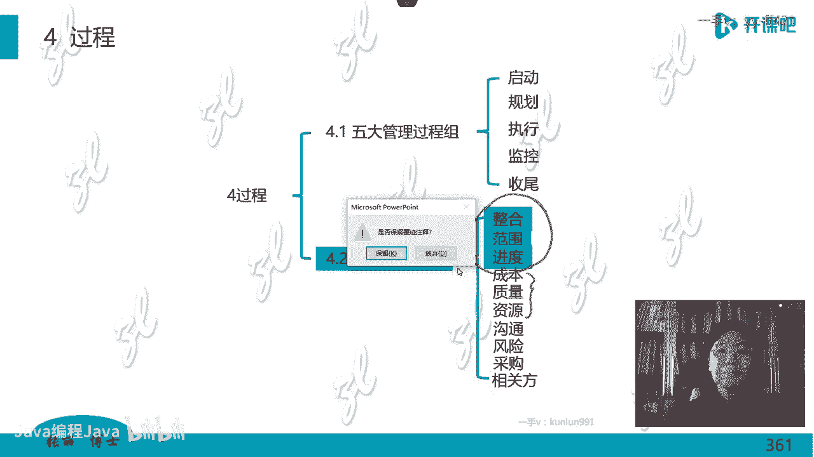

# -PMP认证4期 - P12：17-项目管理过程-范围和进度【itjc8.com】 - OA工作流 - BV1yY4y127aU

好的休息结束了，咱们现在开始上课啊，下一章呢接下来的这一章啊，我们就要学习项目的进度管理了，项目管理它是以进度为主线的一个管理，嗯也就是生命期，生命期不是时间有一个概念吗，他以这个项目的进度为主线。

为生命期为主线，所以进度管理还是蛮重要的，还很重要啊，虽然它有些有些东西都是很常识性的东西，但是呢里边有一些专业的技术，也是需要大家掌握的，尽管这些专业的技术呢，现在被认为是比较传统的。

或者叫预测型生命周期的技术，可是每一个专业人员，专业人士都应该掌握，你是在掌握了，就是你有很深的基础，有很宽的基础的前提之下，在简化的，如果你连这个多的这个都不掌握，你简化什么啊，你直接就是简单的啊。

所以你一个更难的东西都没有啊，好的，涉及的特别主要的两个基本概念，什么叫进度，什么叫工期，进度指的是项目的开始，项目的结束，这两端这个两端点啊，你的确定就叫做进度，中间在这两个端点的中间的持续时间。

持续时间叫什么叫工期，它是这个概念啊，是这么一个概念，有很多学员连这个具体的概念搞不清，就觉得进度工期不是一回事吗，不是一回事，进度指的是这两端啊，中间的这个持续的时间叫做工期，把这个概念先弄清楚啊。

用这一个片子把进度管理所涉及到的一些理念，一些概念，一些核心的东西就给大家讲清楚，首先什么是进度管理呢，就是确保项目按照规定的或者计划的时间，完成所有那个该完成的工作，而且要达到性能指标质量标准呃。

这叫进度管理，你的管理就要按照这个预期的啊，时间完成情况，呃没有困难，老师这个和项目生命周期有什么关系，现在我们讲的就是项目啊，讲的就是项目生命周期上的时间概念，我们讲生命周期理论的时候有几个要素。

第一个要素是不是有时间呀，现在我们在讲生命周期里面的时间管理，就这意思啊，讲这个时间管理呢，生命期里边好多要素呢还记得吗，一时间阶这个阶段是吧，成果标准等等啊，在查那个笔记，我们之前学过。

那我们现在在讲生命期里面的这个时间的概念，时间的管理，进度的管理，持续时间的管理啊，好的，然后我们看，那么在这个时间管理这个地方，进度管理这个地方啊，有一个理念，你如果定一个进度表貌似也是挺容易的。

什么时候做什么，什么时候做什么，但是真要按照这个进度表执行的话是非常难的，这个大家都有体会，比如说假期了，放假了，我们做一个计划要干什么，等这个假期结束，大家再对应一下。

有多少人是假期里按照这个计划做的，很难做到啊，就是你定这个进度表，定计划的时候容易，但是你真正实行要做就特别的难，就做不到啊，那么这是什么原因呢，什么原因是因为你在定进度表的时候，或者说西方人啊。

他是这么认为的，如果一个进度不能够被执行，进度的计划不能被执行，他最主要的问题在于哪儿呢，首先在于进度定的不好，就是你这个计划定的就不好，明知道他执行不了，你还这样定啊，其次才是你执行不到位。

可是我们在做项目的时候，总是反思我执行力不行，执行不到，就没有想过你定计划定的就不好，为什么不好呢，因为你那个计划呀都是简单的估算，大概齐的差不多，我就几点干这个，几点干那个，你都不是精细化的估算。

所以你想照着他执行，做到的话也很难嗯，那么如果一个计划刚一开始，你定的就是一个不可行的计划，也就预示着项目刚一开始就在朝死亡走，那么管这个叫一个什么呢，死亡行军啊，这是一个专业的这个词。

大概是17年的时候，说死亡行军，你看大家都在学习过程中啊，那么死亡行军是个什么概念呢，有一个软件开发专家，他给的这个概念，他说死亡行军啊，就是这个项目从一开始注定就要失败。

因为你定的这个计划它不符合实际，你不能定了一个不符合实际的计划，天天坐在那念经，祈祷他就能完成，那不行，你定了一个不符合实际的计划，就预示着这个项目要死亡，所以叫死亡行军啊。

那么这个进度或者时间是一个挺特殊的东西，它是我们项目管理中灵活度最低的变量，他不可调，因为时间对乞丐，对伟人，对这个有钱的人都这么长，一秒钟这么长，一分钟这么长，它不没有区别的。

你不能说在项目管理过程中出现了问题，你说时间时间你给我停一停啊，让我处理完了我再走，那不可能你只要晚了就肯定是延期，纠正他的办法可以说特别特别少啊，这就是进度管理的一个特点。

那怎么才能定一个合理的计划呢，这跟每一个管理者他的工作作风有关，跟文化差异有关，文化的情况不一样，就是文化差异，包括什么习惯，宗教等等啊，做这个项目的话，他有很多礼节，他星期五要干什么怎么着啊。

那么你要把这个时间都闪开，你如果定这个计划的时候，你不考虑这些宗教习惯的话，那你将来那个计划你做的肯定不可行，他有好多规矩的，一天要做多少次礼拜，然后每个礼拜物要做多少啊，所以这个你要都要考虑进去。

进度管理是项目管理中最大的挑战，没有之一，也就是大家反思一下，我们的项目有多少是按照进度完成的，真正按照进度能完成好的进度管理，是跟计划一模一样，而不是你超前了，比计划超前了好多啊。

那你计划当时怎么定的，你下定的呀，嗯那么这个进度管理，也是引发项目冲突的主要原因，因为我想要质量好，又想时间短，那么这里不就有冲突了吗，你要想让这个进度快，又得加班，多给钱，这不就变成矛盾了吗。

就各种冲突懒在在里面了啊，所以这个项目管理所涉及到的一些理念，在这里给大家展，示，在我们考试做题的时候，一般涉及到进度不能按照计划执行，最主要是计划定的不好，其次才是执行的不好啊，好的。

接着我们看这个知识领域有六个过程，五个做规划，一个是属于监控过程组，有一个学员说啊，到期前项目赶工是常态，那这不是常态，这你管理水平不够啊，不能这么做啊，好的，那我们看啊，接着看啊。

第一个过程规划进度管理，得到的是一个进度管理计划，这是12个子计划之一，嗯怎么定出的这个计划他怎么管呢，管什么内容呢，就管如何定义活动如何排列顺序，如何估算啊，如何定计划，如何这个制定进度啊。

控制进度就如何如何做这个的，他是12个子计划之一，第二个定义活动定义活动我提前给大家讲了，就是把那个w b s已经分解到了工作，就是最底层的工作包，顺着那个工作包向下分解到活动用的技术，也是分解。

你可以拉一个清单，也可以列一个表格，把活动列出来，活动一被列出来就给活动排顺序，排顺序用什么牌呢，网络图一会儿大家就要学习网络图怎么画啊，学习网络图的画法，然后就每一个活动，每一个啊。

你分解出来每一个每一个每一个活动，去估算那个持续时间，一个活动，一个活动，估估单个活动的持续时间，第五个步骤，制定进度计划跟一有什么区别，下边这个第五制定进度计划，这份进度计划不是计划，是项目管理文件。

它其实可以用一个别的词代替，叫做进度表，什么时间做什么，做一个进度表，这个过程很重要，因为这张进度表一被批准就是进度基准，刚才我们已经见过范围基准了，这个地方是进度基准，批准了以后啊，是进度基准。

对以甘特图为进度模型，最后一个过程对项目的进度做控制那些事儿啊，这就是这个知识领域里面这些过程，它主要的目的啊，好然后我们把它展开了，第一个过程得到的是进度管理计划，用专家判断呀，开会呀，分析呀等等啊。

这些技术，然后得到的是一个进度管理计划，进度管理计划都有什么内容呢，首先是如何做这个知识领域，其他这个工作的要求规定都在这里做，然后是进度管理，这个进度教你可以注意看啊，进度管理计划啊。

进度管理计划它是管理规定，还需要确定进度模型啊，进度基准的模型在预测型生命周期的项目中啊，进度模型是以甘特图为代表的，这是业界专业的，如果你说我们公司不行，水平都差，我们不是甘特图。

因为别的图也不是不可以，只不过水平差一点，适应型或者叫敏捷项目，用的进度模型叫做燃尽图，这两个是不一样的呃，用在不同类型的项目中，那如果用在敏捷项目中，你还要在这个管理规定中规定嗯。

我的这个进度计划的发布的迭代长度，一般来说敏捷呢用的都是两道四周一个迭代，那你就2~4周你要发布一次这个进度计划嗯，第三个在这个进度计划里要规定进度管理，进度控制的准确度，计量单位，计量单位。

你是年日月季度呢，西方国家，特别是美国都是以州作为项目进度的计量的，因为一周是七天都一样长，它好标准化，你要一个月呢有大月有小月，时间不一样，甚至美国有些很多州啊，他们的工作这个收入都是周周薪制。

一周发一次工资嗯，按照七天的长短，你要按照一个月，那有多一天又少一天，那我们中国人基本都是按月发工资的，也没有这种理念，什么理念，按月发工资，我每个月都一样多，有大月大月的时候应该多给我点啊。

小月人少给我点诶，人家是的，人家是这么考虑，没有人会这样，你要在中国啊，特别是没有外企背景的这种公司里边，你跟老板说，这个大院你应该多给我钱，老板可能就会认为你有病啊，因为这是都是这么干的吗。

国家都是这样，都是这样的，周薪制对的呃，因为一周是七天嘛，每天都是绝对一样的，根据你那个工作，那么你要在你们的项目里面规定，你到底是什么值，还有一个叫组织程序链接，这个地方现在说不太清，先放在这儿啊。

明天等我下一节课讲成本的时候就能说清了，那么这个这个进度模型，比如说甘特图燃尽图怎么维护啊，多长时间动态的更新一次，由谁来管理，谁来维护啊，这个要求也要说控制进度的临界值，进度的绩效报告格式过程怎么做。

你就在这规定你怎么规定你就怎么办，然后还有一个绩效测量的规则，在项目管理中，一律都采用这个增值的技术来进行绩效测量，那你就要规定测量的方法，比如说你用基准法呢，固定公式法，百分比法，里程碑法等等啊。

这个我们在增值管理的时候都会讲的，这个地方只是告诉大家啊，你在写这个制度的时候，这要有要求，如果你公司的管理水平低，说我们不会用增值，我们不用增值没关系，那你的绩效怎么测量，你自己来你自己来规定。

你规定的就按你规定的办呃，这是第一个过程，第二个过程定义活动，刚才我已经讲完了，在这个w bs工作包向下继续分解，你就分解出活动清单了吗，活动清单对着这个，每一个活动都会有活动的属性。

就是关于活动的描述，这个活动他的逻辑关系是什么样，跟别人他的这个要求是什么呀，比如这个活动他是强制性的逻辑关系，必须谁干完再干，他或者是优先逻辑关系，这个活动的编号啊等等都可以写在属性里面。

另外也可以做一个里程碑清单，里程碑在啊，里程碑节点的时候应该做了哪些活动，这是定义活动得到的定义，活动用的技术专家判断开会分解分解技术，刚才我们w b s讲了，那么活动的分解技术也是一样的，一样的办法。

自上向下向下分解啊，但是有一个概念叫做滚动式规划，什么叫滚动式规划，近期的事儿我可以定得特别清楚，远期呢因为这个项目是特点是渐进明细的呃，是渐进明细的，他刚一开始不清楚。

你不可能把特别远的事定的腿特别清楚，所以你就把近期的这个事定的特别详细，远去的呢你先做一个粗略的粗略的嗯，有学员说这个就是等于p p s吗，不是是你把活动也分解出来，完整的整个叫做pbs w b s。

再加上活动的分解，周公给的这个特别对啊，那它才叫整个的叫项目分解结构，项目一直分解到活动了，我刚才也讲过了，为什么要分解到活动，你不分解到活动没办法进行管理，后边那个中期呢就是项目渐进明细越来越清楚。

越来越清楚，他自己在向前，那么滚动的啊，这个叫做滚动式规划，这个地方要说一个事，刚才我们讲到w b s工作包的时候，我没讲啊，我就特意放在这儿说的啊，大家可以往前回忆。

我刚才写到wb s说到最底层呢叫工作包，我那个里边还写了一个规划包，什么叫规划包呢，我现在在这儿才能说清楚，我要给大家说规划包的概念，规划包就是我远期要干的这个事儿，我现在定计划定规划的话，我不太清楚。

所以我这个地方只有一个规划包，只有一个名称里边的具体的内容描述不清楚嗯，未来越来越清楚的时候，我才能描述，可能我这样说，还是有学员不懂，我举一个例子啊，2008年在北京开的这个奥运会。

当奥运会落到我们头上，我们开始筹建准备的时候，做这个大项目项目集的时候，那么一定我们在这就要做这个wb，那么一定在奥运会的w bs和p bs中，有一个包啊，有一个包，你包括是组件也好，是包也好。

它叫什么开幕式，在全世界各国，你搞这个都有开幕式对吧，有个内容叫开幕式，但是2001年申请啊，给我们这个工作了，2001年年底，我开始做这个w b s我都做出来了，有一个开幕式。

那2008年开这个奥运会的开幕式，我2001年不清楚啊，到底要做成什么样的开幕式啊，中国头一次搞这个东西不清楚啊，那么我一定会有这个名称，名称有，但是里面没有内容，我不知道这个开幕式到底是怎么描述的。

也就是这个工作包的属性，我没法描述它到底要做什么呢，是在火火上玩还是在水里玩，是现代的还是古典的嗯，是搞上千人呢，还是搞个几十人的演员参加的都不知道，那么只有随着时间的延续，到了03年04年。

中国开始向啊全世界的华人征集开幕式的方案，好多人报名都来了，这个时候呢那就选中了张艺谋来做，张艺谋来导那个方案也是保密的，那是不是越来越清楚呢，那我这个开幕式里的内容才越写越清楚。

那么在这个节点2001年底的时候，它就叫做规划包，它只有这么一个规划里面并没有内容，对规划包会慢慢慢慢赋予内容，它就变成工作包了，他这是工作包的一种啊，只不过他不太清楚啊。

业界w b s分解的基准主要是哪些，是按公司的架构来分，不是wbs，它不是按公司的组织架构来分，而是按公司的业务，你公司的业务是做什么，是做产品还是做服务呢，要分几层呢，分成什么内容啊，都有标准。

按照公司自己的这个标准，你比如军工项目，它有严格的军工项目的标准，分几层，每一层是怎么做的呃那这个是不一样的，那在你那地方应该怎么分，它不是按照组织结构分的，是按照什么产品再强调啊，按照产品分吗。

刚才我们那个产品晚餐按那个晚餐分到分的，分到西红柿炒鸡蛋是按照产品分的，你看那餐饮行业他分起来又不一样，那军工也不一样，像你们i t行业分的这个也不一样，所以每家都有自己的这个分解的原则。

你可以按照时间分，也可以按照成果分，但最终呢你在这个w bs的对应的，每一个包里边都是成果，都不能是活动，然后向下再分解到活动啊，这个咱们都已经说过了啊，你分解原则分解的基准都是你自己定的呀。

公司自己定的，有一些行业，有一些行业标准，那你看看你那些行业标准里面是怎么定的啊，把这个活动分出来以后，就要给活动排序了，排列活动顺序，画出这个网络图，怎么觉得wb有点像制造业里的啊。

boom表不是这样的啊，他是那个这还是有区别的，w b s就按产品来分啊，分解的原则自顶向下，刚才已经给大家了，那生产制造业里面他做的是产品分解，跟这个还不一样，我们这做的是项目生产制造业。

他那是生产运营啊，它是一个运营系统啊，好我们怎么来画这张网络图呢，用的叫紧前关系绘图法，这个紧前关系绘图法又叫单代号网络图，但是在考试中，也会考，双代号网络图，所以这里虽然没写也会考。

所以这两种我都要给大家讲，单代号双代号技术都给大家讲，然后利用呃依赖关系，利用时间的提前量和滞后量来调整这个图，一会儿后面就讲啊，也用，比如说你有项目管理信息系统，拿它画更简单吗。

那个project软件里就可以画网络图，就是可以实现的，最终你得到的就是进度网络图啊，然后我们看一下啊，进度网络图长什么样子，就长这个样子，这就是一个单代号网络图，谁给的呢，david from。

有这个编号的啊，在他的教材里，他写的这个东西，他早上起来老头准备早餐西餐啊，他怎么准备呢，开始我们看这个逻辑关系啊，开始做早餐这四个事儿呢，可以同时做烤面包，烧开水，准备咖啡，摆桌子啊。

这个叫做优先逻辑关系，嗯或者叫优选逻辑关系啊，或者叫软逻辑关系，可以先干这个，也可以先干这个就非强制的，然后我做完这个烤面包以后，我在这上面涂黄油，这个叫什么硬逻辑关系，或者叫强制逻辑关系。

必须先看前面那部，再看后面这部，如果涂上黄油，再搁那机器里一烤，黄油化了，把那设备污染了，甚至短路了，什么就不好用了，所以这个是必须这样，那美国人煮鸡蛋是先炒，先烧开水，然后把鸡蛋放进去。

基本上煮的不到一分钟，赶紧就关掉，因为它节约能源，要省电啊，然后就把那个鸡蛋焖熟，它是这个一个做法啊，所有的这个步骤都是这样，这个就给他讲完了，那么单代号网络图是什么意思呢。

每一个这个节点这个地方就叫节点，一个一个的节点，这个节点表示活动，你看烤面包，烧开水，准备咖啡，每一个这个节点表示活动界限表示什么，表示关系，逻辑关系啊，有硬逻辑关系，有这个软逻辑关系。

他们都按照这个逻辑关系从左向右走的，这是单代号网络图嗯，焖鸡蛋口感也好些啊，那就是大家自己去呃，去这个体验生活啊，其实生活也很有意思的，接下来双代号网络图，顾名思义，他用两个代号表示一个活动。

用间线表示活动，那么在这个界线的两端的两个节点，他才表示一个活动，比如说我们说啊活动一二是烤面包活动，二六是涂黄油活动，四六是倒咖啡活动，五六是准备谷物，那个564636，这是什么，这不是两个代号吗。

那么这两个代号之间的界限表示这个活动了，这个就叫双代号网络图嗯，双代号网络图画起来呢会有一些难度啊，其实你画熟了也不难，他有一个虚活动的概念，怎么引进呢，我们看一下啊，首先我们看看这个事例，左边这个图。

左边这个图啊，它表明的是a活动这双代号网络图，b活动干完了再干c活动，但是现在有一个问题，节点一二你到底表示的是a活动还是b活动，但是又是a又是b呀，那就不对了呀，你节点一二他应该是唯一的节点一样。

到底是a还是b呢，所以就需要对它进行一个调整，拉出一个节点三来啊，把这个原来的三变成四，然后我活动一三表示a活动，一二表示b就这样来做的，单代号节点是表示活动对的，双代号呢节点只是搭桥的嗯。

间线表示活动，那我这样移动的话，活动a活动b活动a和b都做完了，再做c的话怎么表示啊，所以我就要在二和三之间拉一条虚线活动记，这个活动季没有这个活动，这个活动叫做虚活动，这个线不是真活动。

只表明b活动做完了要去做c它是一个关系，表示也有人管这个叫假活动，就没有这个活动嘛，所以这个是虚假活动，虚活动假活动就有这么一个概念嗯，所以大家得会画这个东西，现代项目管理啊都在信息系统里处理了。

基本上都不用，就不会用人来操作这个啊，但是一个专业人士你必须要会必须要会画啊，所以我们在考试里边，传统的项目中会涉及一些，那现在呢都已经现代化了，你说他完全不考，他也不一定哪天他想起来了。

毕竟我们有50%的分数还是在考过程，在考传统的项目管理，另外50%考的是敏捷和混合啊，所以这是传统项目管理里的一个重要的，这个方法啊，接着我们再看逻辑关系，单代号网络图或者叫前导图。

这个pdm是前导图的意思，前导图指的就是单代号网络图有四种逻辑关系，第一种完成开始，这个逻辑线就是红颜色的嗯，后边这个活动的开始要依赖于前面的完成，所以它叫完成开始，先说后边这个活动啊，完成开始啊。

先说前面这个活动，前面这个活动完成，后面这个活动才能开始，所以也叫f s，第二个横过来啊，叫开始开始，前面这个活动一开始，后边这个活动就可以开始了，前面活动不开始，后面活动也不能开始。

它依赖于前面活动的开始啊，左下角叫完成完成，右下角叫开始完成，后边这个活动的完成依赖于前面活动的开始，前面一开始我后边就可以完成了，这是逻辑关系，这是单代号，网络图有四种逻辑关系。

双代号网络图只有一种逻辑关系，因为他用键线表示活动了，他没办法表示出四种逻辑关系来，嗯好的，我们讲一下网络图的绘制原则，画网络图啊，画这个网络图的绘制，它的原则是什么呢，它的规则啊有这么几条。

第一严格按照语言文字的描述，或者人家给你一个表格，给你一段语言的描述啊，你严格按照这个逻辑关系，各个活动之间衔接，按照程序进行啊，第二个不允许出现封闭的循环线，比如说这个图形箭头你看都朝这边。

你不能把这箭头画这儿了，这就封闭了，就转圈了，不行啊，第三个，两个节点之间只能有一条界线，不管是单代号双代号都是这样的，第四个一张网络图只允许有一个开始，一个结束，不能一个开始，多个结束，多个开始。

一个结都不行，一个开始一个结束，网络图中所有的节点要按照编号，从小到大的原则，我见过有的学员刚上来画一个八，然后这有一个四，这有一个一，就是感觉就是混乱的，你这么说也不能说是错误，只是逻辑太混乱。

就不按顺序按顺序走嗯，刚才有学员说举个例子，不要举例子了啊，就让你作图，让你画图了，现在学员们准备好笔和纸开始练啊，我给你点时间画网络图，做网络图的练习，现在在这里要画一个单代号网络图。

按照这个描述画个单代号网络图，下一个练习，按照这个描述画一个双代号网络图，我们在课上只练这两个，然后回家你再反过来把这个单代号网络图，画一个双代号，把双代号再画一个单代号，我现在呢先展示单代号。

大家练习啊，给你点时间，你去画一下，画完了以后呢，因为咱们这个没法提问了，我们要在现场就会让学员上来画一画啊，现在呢我我一会儿给大家画这个东西啊，我不能给太长，这个题就给最多两分钟时间。

因为你在考试中把网络图画出来，还得把计算把那个都得做到啊，那你你画光画网络图，你画半天快点画啊，大家画画完了以后都画完了，打个一啊，我看打一的同学多，我就不到两分钟我就开始讲啊。

我就给留两分钟到两分钟我就开始讲了啊，有的同学嗯半分钟都不到啊，就已经画完了，好的啊，大多数同学都已经在刷屏一了，那好啊，我们在稍微已经过了一分钟了啊，刚才嗯我们再稍微给一点时间啊，然后我就开始讲了。

你是不是照我这样的话的啊，好的，很多同学已经画出来了啊，那我们现在就开始讲了，看看老师是怎么画的啊，严格按照逻辑关系项目开始，我用一个汉字开始嗯，活动a节点表示活动啊，活动b同时进行。

这叫活动a活动b同时进行啊，活动a结束以后，c，开始活动b结束以后，f开始啊，活动第一结束以后，活动即开始啊，活动c fg结束后，项目完成，我写个完成或者写结束都行啊，那这张图应该这么画。

那么已经画完的同学，你是不是这样画的，如果不是这么画的，就有错误啊，检查一下还没有画完的同学跟上我，你看看怎么画啊，这个图呢，还是相对来说比双代号网络图容易一些啊，对大家都是这么画的啊，都是这么画的。

我相信大家这个能能够画对，画的也不错啊，这是单代号网络图好，我们现在进行双代号网络图的练习，同样啊再给大家两分钟，这个两分钟就有点费劲了啊，大家再看，改了画双代号网络图了啊，赶紧画双代号网络图。

双代号网络图稍微复杂一些啊，但是你真的学了以后也不会觉得特别难啊，有一个同学已经打出来了啊，那他用了也是不到一分钟，好两个同学画完了不断的有同学刷屏了啊，画完了，我们再稍微等一等啊。

因为这个稍微有一点点难度啊，让更多的同学先自己感受一下，有一学院打一个二二，什么意思，是画完了还是不会画嗯，好的啊，大多数同学也画完了，那么跟上我看我怎么讲的，那个还没有画完的同学，别着急啊，没事啊。

咱们先看看老师怎么画的，那我再等一等吧，再等一等啊，不断的有同学也都画完了啊，一般呢画双代号网络图，它需要橡皮啊，需要这个去不断的擦一擦，调一调啊，调整一下啊，好大多数学员可能都画完了啊。

都一直在这个刷屏，好我们现在开始了啊，看我怎么做啊，严格按照逻辑关系，这个呢双代号网络图用节点表示了一活动，以abc开始，a写在界线上，bc，我把这个活动写在界限上啊，然后这一个节点嗯。

二节点活动a结束以后，d开始，这是个d啊，活动b结束以后，f开始，然后我们再看d先看啊，b在这d在这bd结束以后，一开始就是e那b结束以后，这个地方怎么办，画个虚活动，画个虚活动，因为b离着他太远了。

他不能直接画到一点，画个虚活动把他拉过去啊，那么这个是叫b结束以后，啊啊这个bd结束由我们说完这了，bd结束以后，e开始项目在c，嗯e，和f结束以后完成，这是五这样做啊，然后我们需要把箭头擦一擦。

因为这中间不能有箭头啊，把它擦掉擦掉，这是什么呀，这是一个啊长啊，这中间也有箭头不行，把它擦掉，然后一个，这儿还有一个多余的箭头，也把它擦掉啊，这个图形是这样的啊，是这样画的啊，那么大家对照一下。

对一对，看看是不是自己画的，是不是对啊，这个是一个双代号网络图，以节点表示连接点，以这个界线表示上面的活动啊，太难了，有一点点难啊，别着急啊，但是我们考试的时候就到这个程度，不会画比这个更难的。

所以这两个图要会画对，为了更好的练习，就是今天晚上回去再画画，反过来啊，把这个话删双代号的，你画一个单代号，把前面那个画单代号再画一个双代号，考试就到这个程度，五那里是一个箭头吗。

这三条线三条线对着他三个箭头啊，我这里是三个箭头，这个会出选择题吗，因为它会让你计算那个内容，但你计算的第一步先要画网络图，有的时候呢他会给你一个网络图，给的那个网络图就是一个双代号，你看不懂怎么办呢。

不行的啊，那么这儿有一个说法，这个说法呢嗯也不全是对吧，虚线不明白，但是你看你看这句话啊，我画出来的bd都完成以后，f开始，现在这个d完成以后呃，bd完成有e开始，d完成以后，一开始你会画。

那b完成以后怎么一开始你怎么过去啊，我问你怎么过去啊，是要计算关键路径啊，一和五之间，一和五之间，一和五怎么不是虚线这个呀，一和五之间，一和五之间是c呀，活动c啊，当然不是虚线，人有一个活动啊。

以后我那边abc同时开始，这有个c呀，嗯四和五之间，四和五之间是e，四和五之间是e也不能画虚活动啊，一和五之间有个c呀，对呀，关键是你画完关键路径你才能做题呢，不画完就不行啊，画ef这儿呢e在这儿啊。

f在这，我可能写的当时写的这条线是f，这条线是e呀，这条线是c呀，这都对着的都有啊，b的虚线的起点在哪，在这个b结束以后，对着这个三到这个e活动的起点，四，在他们之间画一个虚线呃，二四，三四不可以。

需要二四之间是d活动，他有活动，不是假活动啊，三四，三四之间是需活动，二四之间不是虚活动啊，这个再琢磨一下，一定要把它画会啊，这个是一个网络图，怎么验证事件代表数字，什么叫验证事件代表的数字是正确的呃。

我不知道你要验证什么数字啊，没太看懂，石活动用实线哎，虚活动用虚线，太阳说的对啊，好的，现在我们看这个图，这个图数字标注的顺序额，数字顺序标注可以不一样吗，那你得一样啊。

你我不知道你要标什么顺序不一样啊，要一样啊，二四是十活动，所以你不能画个虚活动，这张图是我们书上的，它是单代号网络图还是双代号网络图，快点回答，我先得能看懂，好的啊，所有时间都看懂了，一手都看懂了。

这是单代号，好的我们继续了啊，那么在这里标着fs标着开始到开始，完成到完成，你看它有的用汉字，有的用用符号啊，这是单代号网络图，我要说明的是，这里fs表明f活动和季活动之间的关系，叫做完成开始。

也就f完成了g才开始，但是中间加了一个15，这个15就叫做滞后时间的滞后量，为什么要加一个15呢，比如说啊，假如我们在建筑工程中有装修，刷房子刷了第一遍，不能紧接着刷第二遍，虽然他们的关系是完全开始。

但刷第二遍之前我要晾15个小时，这15个小时他没有活动，就在那晾着呢，但是他是有持续时间的嗯，所以你要亮这个墙面亮15，所以往后拖15个小时就是加15 两杆对的，如果你要往前，你要减15。

就是往前搭15不写就默认fs没错，说的对，如果不写这个逻辑关系，都默认是fs滞后量，提前量，对我现在在讲这个概念，滞后量提前量，这里是ss也加了十，他开始后边也可以开始了，但是要加十，加十个小时。

十周十天10年都可以啊，加这个单位，然后向后开始，这叫提前量和滞后量，这是单代号网络图，下边这张图提前量是啥，提前量就是减15往前搭15嗯，s s就滞后15小时开始加就是滞后啊，提前就是减15往前减啊。

fs刚才前面讲过呀，完成开始啊，前面有个逻辑关系啊，完成开始啊，下边这张图是双代号网络图，大家可以看到这里边有虚线啊，这是双代号网络图，双代号网络图只有一种逻辑关系，他没有四种，只有一种。

这一种就叫fs逻辑关系只有一种，看这个就知道是提前量的意思啊，对的，finish star对，有学员把这个写出来了啊，fs是f是结束吗，finish啊，开始是star啊，用的这个词，虚线代表虚活动。

刚才不是讲完了吗，这虚线代表虚活动啊，它表明逻辑关系啊，你把这个看懂什么情况下画虚线，什么情况下画虚线的，k活动完成了以后要做f活动，所以他就要画这个虚线，如果k活动完成了以后不用做f。

就不要画这个虚线，那它表明的是k活动做完了以后做l不做f，它跟f没关系，你要想让k活动跟f有关系，必须画一条这个虚线，表明了这个关系，提前量提前量就是我图纸还没有画完，就开始先制造了，先做了。

所以前面这个事儿画图纸，后面这个事儿是照着图纸做，我只把图纸画的那一部分就开始干了，提前15个小时我就开始干了，这个就叫提前量搭接了，嗯这个意思就明白了啊，好的，这是双代号网络图啊，对呀，前面没完成。

后面就开始做了，这个就叫提前啊，因为我要省时间啊啊双代号只适用于fs关系，对只有一种逻辑关系，它不是适用于它，只能用一种逻辑关系来表示，多了表示不出来，没办法表示多种逻辑关系。

那个单代号可以表示四种逻辑关系，桃子说的是都是要等这个完成后才能开始吗，那不一定啊，根据你的这个规定，交叉作业可以吗，当然可以了哦，这些都是可以的啊，好的，那我们这个网络图就说完了。

这个步骤在这个步骤里边啊，它在进行的是排列活动顺序，排列的结果是网络图，用这个网络图看活动之间的顺序和逻辑关系，那这地方也可以解释说一下啊，挺有意思的，我只能说钱，因为现在都不是这么划分的了。

时代都变了好长了好多了啊，原来的苏联呀，嗯保加利亚呀，什么捷克呀，呃罗马尼亚呀，马来西亚呀，不是马来西亚啊，罗马尼亚啊，这些这个在欧洲的，一般都会使用双代号网络图做排列活动顺序。

也就是北约国家用的都是单代号网络图，美国人还说双代号网络图不太好用，不太明白，但是我们中国的传统的那些建筑行业，工程领域里的老专家都喜欢双代号网络图，他觉得表示特别清楚。

而且这个双代号他用箭线表示活动了，我就可以用间线表示它持续时间的长短，可是单代号网络图用一个节点表示活动，看不出活动的时间长短啊，当然也有人给单代号网络图画上一个时间，比如底下画上一个时间啊。

叫做什么带时标的，带时标的网络图，就是你给他定一个时间，你自己再给他画一条线啊，那这个咱们就不再说了啊，懂了受教了啊，这双代号确实双代号看着不舒服啊，但是现在有这个信息系统了。

单代号双代号都很容易实现呃，呃西方的国家，所以在这个第六版的书里，只保留了单代号，没有写双代号，你看我给大家的这个是第四版的，到第五版他就把双代号给拿掉了，可能他自己也玩不转这个东西，但是他考试还会考。

考试的时候还出现过双代号，所以要求大家了解哎，对就是比较熟练的学员就觉得霜更好用，感觉这个啊，那么这个我们就说到这儿就不再说了啊，下一个估算活动的持续时间，你刚才不是把活动都估出来了吗。

也排了活动顺序吗，比如说烧开水嗯，煮鸡蛋摆个什么，这个这个摆桌子，准备谷物，摆咖啡，那你这烧开水呃，烤面包，烧开水多长时间啊，这个活动多长时间啊，这个过程就估算每一个活动，单个活动的持续时间。

每一个活动到底多长时间，估完了的结果就是持续时间估算，每姑一个活动就跟着有一个估算依据，你是怎么估出来的，那就这么做啊，那么我们看一下，看一下啊，估算的办法，专家判断开会可以用的粗的办法。

比较粗的办法啊，我刚才怕这个就是老死机，我就把那个线拔了，现在我还要，我觉得屏幕暗了，我要插上这个电啊，类比估算，这是粗量级的估算，比较粗的估算怎么过呢，用以前的历史数据，以前做过别的项目。

我昨天烧个开水，就是这样的，拿以前的数据类比一下，那我今天大概也是这么多啊，这叫类比估算，参数估算量价相乘，比如说单价啊，一个小时干多少事，十个小时干多少，单价乘以数量啊，这个叫做参数估算。

参数估算也比较粗，因为你一个小时干多少，那个数据也是粗量的，粗量级的估算，这是前两个啊，第三个三点估算，有学员问了三点估算是什么意思，三点估算是详细估算，前面那两个都是粗略估算，三点估算。

详细估算不仅详细，他还考虑了风险，考虑了不确定，不确定性啊，这是三点估算，后边这个片子会给大家讲啊，然后我先把这个说完再说，自下而上的估算，自下而上，就是按照你那个w b s从下到上加起来。

所以自下而上的它不是单独使用的，是每一个活动都估出来，然后他在自驾上加是这么一个事儿，嗯另外还有一个备选储备分析，一会儿我们会讲储备分析啊，先说三点估算，三点估算的第一步就是要进行访谈或者是调研。

干嘛呀，收集三个数据叫做三值，哪三只啊，最悲观的时间就是我烧一壶开水啊，最晚多长时间能开，还有最乐观的时间最快他什么时候开了，最可能的一般都什么时候开啊，最可能的这三个值最悲观，最乐观，最可能啊。

那我这个调研访谈，我肯定就不是收集一天的数据，那我要收集，比如david from，它早上起来做早餐，他这一壶开水到底什么时候烧开的呢，他要记录一个月上一个月我都多长时间开的，然后我记录完了。

我就可以从里面找到最快多长时间就能开了，因为它电压是不稳定的，它美国大部分都是用用电来烧的，也有部分粥呢用天然气呃，因为这个from他们家呢住在这个嗯，嗯这个马里兰啊。

马里兰州就是那个那个德堡德克里克堡，但是马里兰也很大啊，那德克里克堡的那个地方比较偏啊，这个戴维from家呢就住在华盛顿，因为这个华盛顿dc它是一半是马里兰州，一半是佛吉尼亚州。

这个这个这个dc呢正好就在中间，他就在这dc边上一点的马里兰州那边呃，他还是就是那个地方还是很繁华的，在首都边上的啊，但是它电压是不稳的，那个地方基本都是用电的烧电的，那有的时候他可能十分钟才烧开。

有时候五分钟就烧开了，大部分时候都七分钟烧开，他怎么来的记录啊，每天都记啊，你说详细不详细呃，所以他要收集这些数据，把这个找出来，然后干嘛呢进行计算，那么这个是估算依据啊，也就是你估这个你是怎么编的呀。

你怎么算的，就是这个几分钟啊，你得给人家估算依据，那你做了什么，假设它就可以开啊，就这个水就可以烧开，你就有这个数据啊，这段我们就不再说了啊，外国人不喝开水对的，但是他喝咖啡呀。

外国人离了咖啡是活不了的，他咖啡是一定要开水冲的，要用开水煮的，它烧那个开水呢主要是为了煮咖啡的，他们喝平时喝的水都是凉水，都是冰凉冰凉的水，自来水打开就喝啊，因为也是比较环保的，比较安全的。

他不会喝白开水的啊，他都是要喝这个喝这个这个咖啡的，所以如果你到国外，到美国，你找不着这个白开水，你就找那有咖啡的地儿嗯，你用一杯咖啡的价钱，只要一杯白开水，他也会给你的，但是你要将咖啡的价钱。

他是拿这个白开水冲这个咖啡的啊，剩下的饮料都是凉的，当然一些稍微有钱一点的人也不喝碳酸饮料，也不喝可乐雪碧啊，主要他们的主要饮料就是咖啡，小孩也是喝冰凉的水啊，小孩的奶粉就拿自来水一冲就喝了。

就是冰水啊，冰凉的水，他从小就习惯了，他那个肠胃就习惯了，没有咖啡咖啡我就活不到，今天中午，还有咱们这个学员，也是会用一些这个这个咖啡了，现在咖啡中国人的这个用量也不小了，但是美国人人家不是统计过吗。

平均啊美国人一天喝七杯咖啡，他要喝很多，所以他就要烧水，就这意思啊，好的，那么我们统计出了这个三值，用个计算公式算一下，这就叫三点估算，那么在这一本书里给的计算公式有两个，一个是基于贝塔分布的。

基于贝塔分布的三点估算，一个是基于三角分布的三点估算，那么这个三点估算就是我们要算出一个曲线，因为这个分布是一个曲线嘛，算这个曲线下拉一条线，那个下边的面积也就这个估算呢，它算的是一个保证率呃。

在这个在这个曲线下的面积，求的微积分这么来的，所以你不要管它这个公式怎么来的，不去倒腾这个啊，我们只要记住这个公式，基于三角分布的三点估算，就把这三值加在一起除以三啊。

既碑塔分布的就是把最悲观最乐观加在一起，再加一个四倍的，最可能除以六，因为它是算那个曲线下的面积，它分成块啊，这么来计算的，考试的时候，如果让你计算啊，一个活动的持续时间不做任何说明，特殊说明的话。

首选这个公式，贝塔分布这个公式就是除以六的公式，前面上面这两个我给大家的就是算时间的公式，微积分这么复杂对的，但是公式已经给你了，你不用算微积分，我想告诉你这个公式是微积分呢，要先求导。

然后再微积分算着就导出来的，这样的公式，你不用去导这个公式了，你只是应用就可以了，嗯上面这两个公式是算时间的，下面这两个公式是算成本的，到时候我们讲成本管理那一章也这么算，咱们就只说到这就不说了啊。

我们就把这个三点估算会计算就可以了，嗯这样算呢我就考虑了一个风险，考虑一个区间，不再像是我估计就是七分钟三分钟了哦，我就做了这么一个内容，选择题，一般会给四个数字，让你从四个里边里边选，没有特殊说明。

都用除以六的公式计算嗯好的，那么这是计划评审技术里c cost成本算成本，t time时间t i m e cos的对，是成本算成本也这么算，所以我今天就把这三点估算的公式也给了大家，到成本的时候。

我们就看这就行了，算成本也这么算啊，每一个活动的时间这么估，成本也这样估啊，好的这个就完了啊，那我们定项目管理计划，因为计划有高度的不确定怎么办呢，用什么办法多找专家呀，专家有经验呀。

借鉴以前类似的项目经验，然后去推断，根据以前的项目去推断，还有进行风险分析，风险呢我们会有专门有一章来进行讲解的啊，这是关于这个呃估算活动持续时间啊，现在说一下储备分析，储备分析什么意思呢。

比如我烧开水啊，是七分钟，我估算了七分钟啊，七分钟烧一壶开水，但是你在定这个持续时间的时候，不能只写这七分钟，我再加一个三分钟，为什么呀，做一个储备啊，万一电线坏了，停电呢，我们还得接吗。

那万一有什么事儿了呢，所以这个是应对风险的，叫做已知的未知，应对已知未知风险的，所以我要加一个这个叫什么应急储备，我们在做变更控制的时候，不就是我们可以动用应急储备了吗，对成本也一样，就这意思啊。

加一个这个负余量，安全量，富余量做一个保障，你别严词合缝的，都是这么多分钟，你就给人报上去了，那你出现了1。1些事怎么办啊，那你就没有时间去应对了，所以这个叫做储备哦，这个同关键链法有什么不同。

这是关键链法的基础啊，这个讲完后面啊就讲关键路径法，关键路径法啊，再加这个关键链法，关键链这个不要加到这个活动里，专门拿出来，把每一个内容啊拿出来啊，这是有学员可能听说过关键裂了啊，这个很难控制。

那就是要有经验啊，要有以前的模板呀，如果你没有，就没法算已知的未知，因为你每估算一个，你得给人家估算依据啊，你得告诉我这个道理啊，假如你这片地区经常停电，你才能有这个假设你这个地方从来不停电。

你就跟人说，假如果停电了呢，我再加几分钟，那你可能这个依据就不充分了，如果你所在的地区开发区或者新的这个地方，电能它不够老停电，那你可以加上这些内容得有历史数据对的嗯，所以这个管理呢就太细了啊。

是应对已知未知的管理储备，是应对未知未知的应急储备是怎么算出来的，也是根据历史数据算出来的嗯，你要加多少，每一个活动加多少，根据历史数据统计算出来的啊，这是每一个活动的单个活动的时间估算，第五个过程。

制定进度计划，做出的这个进度计划的模型叫做甘特图，这个甘特图已被批准，批准以后就被叫做进度基准，批准之前，就叫做二，批准之前叫二进度计划，批准之后叫一进度计准，然后还有一个三进度数据，什么意思。

也是估算依据，项目管理是经验科学啊，我是我项目上的专家讲的对呀，他就是经验科学，你从原来统计出来的，所以有很多人他不太认项目管理是科学吗，嗯他就是经验统计归纳来的啊，这是第三个叫做进度数据。

就是估算的依据，你估完了以后，你做完了这个进度精准以后，要做一个项目日历呃，项目哪天做什么，哪天做什么会排出来这个啊，那么在这个过程里有几个特别重要的管理工具，一个叫做进度网络分析，那么其中二三。

62356啊，都属于进度网络分析工具，也就是进度网络分析工具有很多种，2356都是进度网络分析工具，这几个工具也挺经典的啊，还有这个项目管理信息系统，当然你能用这个，那不是最好了吗，如果是敏捷项目的话。

就用一个什么敏捷发布，你把这敏捷愣塞在这里，本身也是一个不伦不类的东西，回头我们最后会统一讲，但在这儿说一下啊，这个就涉及到这个过程里的很多方法，关键路径法，资源啊，优化技术进度。

压缩技术提前量和滞后量，那么这四个呢都比较难，所以因为今天我们还不能把这部分完成，因为现在下课的时间已经到了啊，这个我们就下节课上来再把这个说完，所以现在我这个关键路径法资源优化啊。

提前量滞后量进度压缩，包括关键练法我都放到下一节课再讲啊，那我们这一段呢就把它隔过去啊，那我们先看一下这个进度模型，得到的是一张甘特图，甘特图长什么样子，就长这个样子，1900年，有一个叫甘特的老先生。

他发明了这种横道图，所以甘特图又是横道图最原始，最早的甘特图不带这个黄颜色，黄颜色就放上去以后叫跟踪甘特图，把石器也放进去了，当时甘特搞的这个东西就是计划呃，为什么为第一次世界大战的战争里头。

使用这些东西，就是调动部队按进度走，这个只用横道来表示的，后人呢又给加上这个黄颜色，叫跟踪甘特图，这是甘特图的样子，甘特图改变了形式，就是这个第二种，大家请注意啊，看看甘特图的左侧，这都是什么。

这都是什么东西，都是活动，不是工作，所以你做到工作包也没办法画甘特图，也没办法画网络图，所以你一定要把它分解到工活动，从工作分解到活动，黄色是实际记录对，就是跟踪的情况。

那最早人甘特搞这个时候没有这个时机的，是后人，后来的人给加上去的，但这个图的名字我们并不改，还叫甘特图啊，继续这张叫里程碑图，里程碑图是特殊的甘特图，他不画横道了，他用这个节点来画里程碑。

那么你看这个里程碑图左侧就一个活动，这一个活动分成这么多里程碑，一个活动也有不同的里程碑啊，这就是想告诉大家这种概念啊，这是里程碑图啊，那么甘特图或者项目进度计划，项目基准就长这个样子，这是书上的。

因为书上是一张整图给它解开了，不解开都放在这里边，太小了嗯，那么首先先有里程碑计划，这边都是活动，都是具体的活动，那么这张呢你看这是活动描述对吧，那么得到的右侧，大家可以看到用这个节点表示的。

下边这个叫做概括性计划或者叫主计划，master plan，一个项目的主计划，那么也用这种表示的后边儿这个叫详细计划，细的计划，细的计划用横道表示，后来的人还把这个里程碑，把这个逻辑关系线都加到这里了。

完成开始开始开始加到这里面了，嗯本来最原始的甘特图是没有这些东西的，但是现在都加到里边，也管这个叫做甘特图，将来你做完的进度基准就应该长这个模样，就应该是这种格式这种形式的，这是项目管理业界统一的标准。

如果你说我们公司水平差，我不是这样的也行，没有说非得就是这样的啊，但是这个是标准的里程碑图，一般都穿插在甘特图里，对的这个现在不是里程碑图，在这个在这个甘特图里面，他都画到一起了啊，给大家展示一下啊。

就是这样做的，那么如果你是敏捷和迭代的项目，你就不用甘特图这个模型，你可以用这样的方式发布计划，一个迭代嗯，有这么多user story，用户故事，这一个用户故事又分成几个任务，这几个任务多少小时。

你这么做就行，轻量级它就不用那么复杂了，这是敏捷的发布规划，你可以用这样的工具啊，另外敏捷的他的那个图形啊，那它不叫基准了，它就不叫进度基准了，在敏捷里就没有进度基准了，他就叫理想的工作情况。

理想的工作情况，那么就用这张迭代燃尽图来表示，就类似于一个进度规划，这个实线下边的这条实线就叫做理想状况，上边的那个虚线带，那个上面方块的那个是实际记录，左边那表示是代办的事项，积压项。

代办的那个工作按什么排序的呢，按需求的优先级哪个重要，哪个排在前面，最先做嗯，把这个项目都做完了，相当于你看这个任务，他从优先级重要的这个点数一直在向下降，到最后这个十周都做完了，如果按计划的话。

就相当于一个蜡烛烧完了以后，燃尽了就干完一个就过去了，干完一个过去了，就这么个意思，所以这是敏捷和适应型生命周期用的计划，或者叫规划，我们后面也会统一讲，但这个地方插在这儿，我们就在这儿说一下。

刚才图上的活动怎么变成了组件，是活动的结果是组件就是做组件，它实际上就是生产做组件的意思，开发组件的意思嗯，那么这是他只要你见到活动说组件，那它就是开发做组件的意思，动词的意思。

因为汉语和英文它有表达好处还是不一样的，嗯这是制定进度计划啊，定的是个进度表，大家可以看进度计划，可不是进度管理计划，进度管理计划是规定进度计划是进度表啊，它不一样的啊。

那么每估算也就是每做一个这个计划，你跟着就有一个进度数据，它实际上是什么呢，是支持细节或者叫估算依据，啊这个是我们把这个就说完了啊，这个过程说完了，接下来的这一大段呢。

我们就要进行这个工具和技术的讲解了，刚才我前面说过了，因为这个内容有点复杂，今天大家已经灌了好多东西进去了啊，进度计划和进度管理计划，进度管理计划是管理规定，关于进度的管理规定。

进度计划是刚才那张甘特图进度表管理规定，你就拿文字写的呀，你们公司的制度是不是都是文字啊，当然你也可以用图表，不是不能用啊，那是管理规定啊，那么这些工具呢，我们都会在下节课的时候在再把他介绍了啊。

那这次我们先把它闪过去，下节课上来，我们先完成这部分内容啊，接着我们就走到了这个过程了啊，叫做最后一个过程，控制进度，控制进度就是对项目进度做控制那些事儿，输入工作绩效的数据。

经过各种分析得到了工作绩效信息，还得到了进度预测的信息和变更请求，如果执行控制的时候有问题，我们就可以通过变更请求来进行，这里面也提到了增值分析啊，燃尽图分析啊等等啊。

但增值分析并不是在这里讲解和学习的，像关键路径法呀，我们下次啊统一说，那么这个也用了项目管理信息系统啊，你像这几个啊，资源优化技术嗯，提前量滞后量，进度压缩，关键路径我们都在下次课里面把它解决掉。

因为今天灌的这种实际的东西太多了啊，项目管理技术要实操才能记得牢，刚才有一个学员不是说了吗，项目管理就是实践的学科呀，啊他在中国的学科里边，它也属于实操型的啊，内容这半个小时有点快啊，手动笔记没有记上。

因为我没有讲具体的技术，所以你这个你还记那个笔记，记哪些笔记啊，这好像没有更多的可以记笔记啊，因为我没让你实际操作的啊，我们下节课再实际操作，大家在练习，因为这里面的内容确实太多了啊，好的。

这两天的讲解要重新看，内容太多了，对的就是这，所以它叫重量级的项目管理吗，内容太多了，太沉重了，包袱啊太快太多啊，觉得快了，晚上再复习一下啊，这个内容好的，那么这章学完了以后，我们做一个小的反思啊。

进度它在项目管理中最缺灵活，因为你晚了，时间肯定就延续，那怎么来对付他呢，就要事实求是的制定计划，不要死亡，行军每一个里程碑设置街门来进行控制，纪实的监督，适当的时候要严肃纪律。

才能把这个进度管理管理好，那么进度管理里面重要的技术，关键路径法，关键链法啊，提前量，滞后量，还有这个资源优化技术，还有进度压缩技术，我们还没有讲嗯，所以这个可能学员还都认为很快特别快啊。

那如果把这些都放到里面讲了，那更接受不了了，所以我们慢一点，别着急，但是第四天的课把这个装进去都能啊，介绍完了啊，那第四天还有一个重点难点是增值管理，这两个技术啊。

一个是关键路径法增值管理在这里面有一点难，但是没关系的，因为第四天呢主要的难点就这两个了，剩下的你比如到沟通，那就好多东西都好讲了，就简单了啊，所以我们一定是跟整个的课程进度可以找平的，可以平齐的。

所以我也看大家的这个进度啊，如果大家的这个吸收不行的话，什么叫街煤街门mile stone关口啊，沙点呀是吧，咱们之前讲过生命周期的时候，对的啊，学员给提的对接门就是关口啊。

就是里程碑那个节点决策点杀点啊，阶段阶段末阶段的那个点啊，今天的课呢咱们就学到这里，确实还需要反复啊，需要重复复习，下次的课程呢，我们再把那些关键的技术，再给大家放在一起讲啊，所以今天的课我们结束了。

主要涉及到整合范围管理，进度管理，进度管理，我们还留了几个工具，下次再讲啊，那么第三天的课咱们都学了哪些呢，学了这三个知识领域，这就是你学完以后轻脑子放空啊，然后开始想我们学的十个知识领域里的这三个。

下节课我们开始学成本质量和资源质量，也稍微容易学一点，资源管理呢之前我们说了很多，所以在讲起来就会特别快，那我们就把上啊，上一节课，我们漏掉的这个，进度管理的一些技术和成本管理，这两块作为重点啊。

第四节课把这个学习完啊，这是我们今天的课程啊，大家也都很辛苦啊，嗯也感谢大家呢，咱们自己咱们一起陪伴，一起合作，度过了一个非常有意义的周末，呃，那今天的课程就到这里结束了，下节课我们再继续请大家呢。

下节课要克服困难，还是要来参加啊，好的今天咱们就再见了啊。

