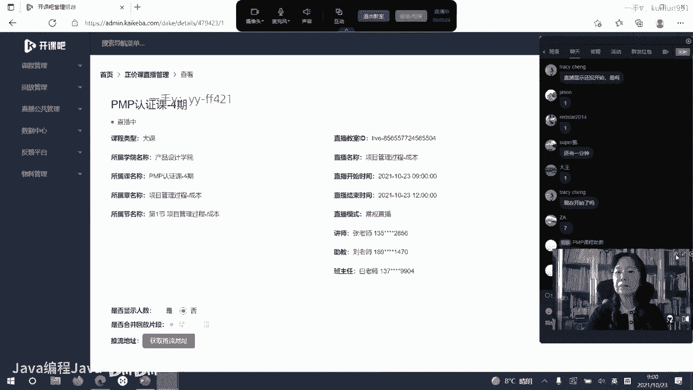
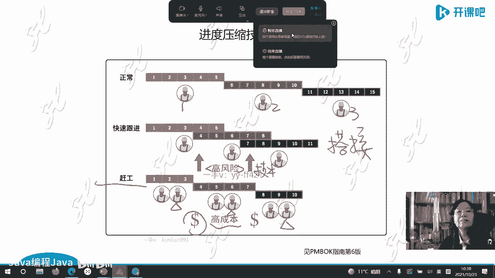

# -PMP认证4期 - P13：18-项目管理过程-成本【itjc8.com】 - OA工作流 - BV1yY4y127aU

学员们好，我们的课程马上就要开始了，请大家做好准备，那检查一下自己的设备情况，网络情况，然后在直播间里刷一个一字嗯，好的，请大家在直播间里刷一字，好的大家好啊，我可以看到是这样的，因为这个今天一上来呢。

咱们这个直播的平台进行了升级，1l级以后我这个地方就看不到直播间啊，待会儿嗯班班老师帮我处理一下，助教帮我处理一下，我只能在这个系统里面看啊，看不到这里边有这个直播间里边啊，有学员的这个问题。

我这看不到啊，那我们就正式开始了，先不管这个了啊，好的呃，欢迎大家来到开课吧，继续我们的p m p考前培训的学习课程，那我们今天呢是要进行第四天的课程的学习，要完成啊，我们把之前学习的内容。

稍稍的或者快速的回顾一下，第一天我们学习了项目管理的概述，里边主要是一些基本的概念和啊，第二部分内容就是呃商业环境，或者叫做业务环境和业务环境对项目的影响，这是第一天。

第二天呢我们学习了人员管理这部分内容，学习了项目的人员管理内容，从第三天开始，我们就开始学习项目管理过程，这个项目管理过程呢都是基于呃，基于这个呃重量级的项目管理，或者叫做预测型与预测型为主的。

项目管理的内容啊，这是我们想跟大家讲的啊，那么今天呢我们就要开始学习第四天，第四天的重量级项目管理呢，我们再学习三个知识领域，第三天我们学的三个知识领域，一个是整合管理，一个是范围管理，一个是进度管理。

今天我们要学的三个，一个叫做质量管理，一个是资源管理，一个沟通管理啊，是三个知识领域，在这三个知识领域里边，我们把那个项目管理的过程都展开啊，进行学习，那我们在第三天的课程里面，还有一些项目管理的技术。

硬技术啊，比较复杂，比较麻烦的，我们没有讲，我们今天呢先把这一部分完成啊，那我们首先先来看一下，先来看一下关于呃这个项目管理计划啊，特别是进度计划，也就是定进度表那个计划里面的一个关键技术。

当然是指的预测型生命周期的项目，主要会用这个技术啊，那个叫做关键路径法啊，我们要学习关键路径法，那学习关键路径法啊，我们就先要做一些这个之前的这种啊储备，或者叫之前的这样的学习啊。

呃首先我们看我们要学习的是，这个单代号网络图，它的节点是怎么表示的啊，就这个单代号网络图的节点啊，它有一些表述定义啊，所以我们要把这一部分内容先先学一下啊，好的，那首先大家看一下，在这个上面所嗯。

片子上所展示的是一个单代号网络图，单代号网络图，我把它分了，打了嗝啊，分了不同的这个格，这个格里边呢一共分了这一共分了有七个格，七个隔段啊，那么在这个七个格的左上角，左下角，右上角。

右下角分别有四个时间参数，我们常常管这个叫四个实参，四个实参啊，或者叫时时间参数，四个时参在这个节点图里边的位置是固定的，或者叫标准化的，是不喜换位置的啊，另外这个七格图里面还有其他三个格。

序号活动名称，活动历时，这三个格呢你可以串位置啊，你比如说你可以把名称写在这里，编号写在这里啊，中间你也可以写点别的东西啊，写个什么代号，代码等等都可以，也就是七格图的四个角的四个实参是标准化的。

固定位置不许动的啊，那这个中间其他的这三个位置是可以动的啊，是可以变的，这是我们想要跟大家讲的啊，内容好的继续啊，我们开始啊学习这个七格图，熟悉了以后再进入啊，再进入我们的关键路径法的学习啊。

好的那大家现在看，我们现在要学习一个关键技术，项目管理的关键技术叫做关键路径法，或者叫关键路径分析，c关键路径分析啊，balance这三个这个组成的字母就是单词组成的字头，cp m叫关键路径法分析啊。

首先这个定义我们知道了，那英文的呃，这个表示呢，这个最早开始时间，左上角这个时参叫俄罗斯大e用e表示啊，然后他经过一个活动，历时doration一个d啊。

就e s加上这个d就等于ef a i finish，最早结束时间啊，这个计算是很容易的啊，左下角叫最晚开始时间，let's start啊，右下角是最晚结束时间，它也等于也就是最晚结束时间。

也等于最晚开始时间，加上一个doration，历时历时的时间啊，啊我给大家举个例子，比如说我这个活动，最早开始时间是八点八点开始啊，然后这历时多长时间呢，十分钟，那这个最早呃结束时间是多少呢。

就是八点加上十分钟，那就是8。10分啊，一样下边也一样啊，最晚开始和最晚结束也一样的道理，他得出来的那个数字应该一样，呃，老师可以多讲一下英文解释呃，因为多讲英文解释咱们的时间是不够的。

最早开始时间需要英文解释吗，呃最早开始啊，这可能这个大家的这个基础啊，差别还是比较大的啊，咱们这么说一下啊，你一会儿我们后面就要这个讲这个案例了，比如我们之前学过那个网络图，你早上起来要做早餐。

要做饭是吧，你做这个饭最早开始时间，就是你最早几点开始做，这就是最早开始时间啊，那是最早结束时间，你做这顿饭需要多长时间，比如半个小时，最早结束时间就是八点半啊，就这意思啊。

那最晚为什么要一个最晚时间呢，因为我根据我的出门的时间算，我出门最晚不能超过这个时间出门，我上班就可以不迟到，这就是最晚时间啊，那就有个最晚的开始，有一个最晚的结束啊。

这个这个是一个我觉得应该很很好理解的啊，就这个这个是最最晚开始时间和最晚结束时间，那么这顿饭我就框起来一个时间了，就半个小时啊，他可以八点开始做，也可以八点半开始做到九点半啊，因为我上班只要不迟到。

那个是最晚的时间啊，这就是最早开始，最早结束，最晚开始，最晚结束啊，活动编号不用再解释了吧，活动名称还用解释吗，一般活动名称这个里面会用一个英文字母a啊，activity，或者用这个任务也可以。

test task啊，也可以，活动历时duration，什么叫历史，你做一顿饭持续多长时间啊，这个大家自己一定要跟上啊，如果我们这么讲的话，我们的任务太多了，根本就完不成了啊。

一定要快速的跟上我们这个学习，那我们先把这个定下来以后啊，这个概念定下来以后，开始进行关键路径分析了，关键路径分析是按照这个七格图，从左向右正着推导一遍，然后再下边这一行啊，从右向左再逆着推导一遍。

去找那个浮动时间或者叫时差，然后来进行关键路径的这个学习，我就是要找最长的那条路径，什么叫路径啊，咱们学没学过网络图啊，单代号双代号都学过吧，那不是有一条一条你画的那个那个线，从开始到结束。

从开始到结束，有n多条路径吧，有很多条路径，什么叫关键路径啊，就是找最长的那条路径，而且没有任何富裕时间的那个路径，最长又没有任何富裕时间，它就是最关键的，为什么找他呢，它代表了项目的工期。

就是可以持续的时间，你找到项目的工期，你是不是就可以做进度计划了，找最长的啊，逻辑就是这么一个逻辑啊，好的，我们现在开始啊，用案例来学习了啊，下边给大家一个案例，右上角在这个版面的右上角有一个案例。

这个案例是以表格形式展现的，必须得看得懂啊，我们不再解释了，如果我们再这么解释的话，那咱们今天就是这个任务就差的太多了啊，就完不成了，这个一定要自己去看懂，把它理解啊，然后根据右上角这个案例。

画出我们版面上所展示的这一张单代号网络图，我们之前的课程已经有训练了啊，这张单代号网络图是以七格图的形式表现的，不是在像我们上次学的，我们就画一个大圆点或者画一个方块，我们给它分了七个格。

把这个节点分了七个格啊，就是为了进行关键路径的推导用的好，我现在开始推导了啊，那么第一个任务，第一个项目，第项目的工作或者叫任务啊，或者叫做活动，叫准备，就活动a是准备准备需要两周时间，这个二是历时。

这个最早开始时间可以从零呃，第零周开始，我们从零周开始啊，加上一个二，得到的就是最早结束的日期叫做两周啊，这是二啊，就准备是这样啊，按照这个网络图画的网络图向下再推导的话，把这个二抄过来。

第二个活就这个b活动叫做刷门框，b活动，他从二开始，c活动刷屋顶也从二开始，这二哪来的，把这二抄过来，直接抄过来啊，直接抄过来，d活动也是二，刷墙也是2b c d3 个活动历时都不一样，b历时两周。

c历时三周，d历时四周，就把它加起来都加起来，这是四，加起来是五，加起来是六，那么前面两条路径呢走到这儿就到结束了，最后一条路径他d完了以后，还有一个e把这个六直接抄过来，6+28啊。

然后到这时候就结束了啊，三个活动对着结束，那对着结束的时候，这个正推有一个口诀，从左向右做加法间的数据，加间的数字加那个这个案例呃，路径上还没有数，如果在真实的其他案例里，路径有数，你也把它加起来啊。

然后路径汇聚，这就叫路径汇聚，三条路径汇到一个活动了，汇聚到一个活动了，叫路径汇聚，路径汇聚处取大，这三个458谁最大，八最大，把八招过来，这个结束也历时两周，8+2=10周啊，这就一个正推就推导完了。

我再把这个公式啊，或者我们那几个口诀给大家说一下啊，从左向右做加法，路径汇聚处取大啊，这个学员们的基础差别是比较大的，不知道这个还有没有没听懂的学员啊，有学员马上就懂了，a d e f就是关键路径。

他就找到了，那刚才有的学员还最早开始，最晚开始还要解释呢，所以大家想的都不一样啊，对有的学员更简化啊，正推取大啊，哎懂了就好了啊，反推取小，刷屋顶五是怎么得到的，不知道刷屋顶是怎么得到的啊。

刷屋顶2+3=5啊，就这么得到的啊，双屋顶的五都是从左向右做加法，见到数字就加一块，见到数字加一块，刚才有个学员说正推取大，反推取小不行啊，因为你没告诉他做加法，他不知道五是怎么来的了。

所以这个要啰嗦一点儿，叫从左向右做加法，路径汇聚处取大，目的是为了对的获取最长时间，找最长的啊，因为你把短的放在这儿，那个最长的路径就完不成了，要把它想明白，对目的会是为了获得最长时间啊。

那么现在在版面上展示的这个案例非常的简单，你拿眼睛一看，你简单一加，你就知道这个关键路径是十周嗯，你就可以找到了，那说实在你不用什么正推逆推，你也可以找得到，是十周早最长的啊。

我们看看a b f这条路径，abf这条路径持续时间是多长呢，2+2+2是六周啊，a c f是多长呢，2+3+2是七周，d e f是2+4+2+2是十周，哪条路径最长啊，就是a d e f它最长也最关键。

所以这条路径呢就代表了你的上面这个案例啊，它的工期的基础只能是基础啊，还不是代表工期，因为工期还要做其他的安排，对的周就是一个例子，你可以添，你可以小时也行啊，这是我给你一个这个周啊。

因为什么这是拿美国的一个案例，美国人都是以周来计算呃，这个时间呢因为一周的长度都一样，都是七天，你说一个小时就是两个小时，三个小时都可以，两秒钟，三秒钟也行啊，这只是一个案例啊，也有学这个还没听懂啊。

这个历史是这个历史哪来的呢，这不这样吗，这里边来的啊，人家给的，人家没有给单位名称，我给加了一个周嗯，你两小时两分钟啊，两个月两个季度，2年都可以啊，就这么来的，所以这个案例呢非常的简单。

你拿眼一看就可以得出十周就不用再逆推了，呃逆推正推逆推的意义在于，在真正做项目中，那么稍微有一点规模的项目，你都不可能拿眼睛看得过来，因为路径很多很多，你画出那网络图来非常的复杂很多很多的嗯。

所以你没有办法像我这样就拿眼睛一看，一夹就出来了，或者像大家那样，所以就得怎么办呢，就得用关键路径分析，用公式在进行逆推啊，逆着推我们再看啊，逆推大家要跟上，有些还没跟上，逆推呢，从最晚结束时间。

也就是七格图的右下角开始推嗯，他们都是双休，一个星期只有五天，对的啊，一个星期五天一共是一周，按照五天算啊，刚才我这么说，甘特图也可以得到，可以的啊，那你做甘特图的时候，有些这个网络工具啊。

它自动给你生成，我现在是教大家这个东西怎么分析啊，因为在咱们真正考试里边，如果考关键路径的话，不可能让你用工具的啊，就是让你手动的这样来来这个用这个逻辑，用脑子把它想明白的啊，用一些手动的工具。

道理其实就在于，那么哪个学员不会计算啊，都会把加减乘除都会就不让你那么复杂了，给你发个计算器，你摁就行了，所以他们的数学能力比普遍的，比中国的孩子弱呀，我们中国的小孩上奥数是吧，学心算，学珠算，学口算。

你给你发个计算机，你们摁去呗，还说现在上那玩意儿干嘛，几个柱子扒拉来扒拉去的还容易错，多麻烦，你拿着一摁就得了吧，但是你的大脑没有经过数学的逻辑训练，数学能力是不一样的，跟这个道理是一样的。

尽管关键路径法的这个图你有很多软件可以画，但是也要求专业人士，你要掌握最基本的这个做法啊，最基本的逻辑和推导啊，接着我们开始逆推了，逆推就从七格图的右下角，这个图从右向左这样去推啊。

好的我们看怎么推的啊，又回到这张图来了，我把这个调一下，回到这个图来了，我们看啊，从右向左做减法口诀怎么说的啊，路径汇聚处取消，那么你正推不是十周完成了吗，把这个十周抄下来，十周减去两周是八周。

这样开开始做减法了，把八抄过来，八抄过来，八抄过来啊，然后做减法，8-2=6，6-4=2，8-3=5，8-2=6啊，就这样减减完了以后呃，逆着又到路径汇聚了，逆着啊，逆着箭头率都往这边了。

那么到路径汇聚处，六二就要取小取一个小的二啊，把二取过来再减去，二又回到零了，正推逆推我们就都完成了，有学员就读不清楚了，这折腾什么呢，政治推完了到十十，推完了又到零，这不是废话吗，真不是废话啊。

为了找相应的关系，找那个最长的路径，前提是因为我拿了一个简单的案例跟你说，我再重复一遍复杂的案例呀，那你就拿眼看不出来了，就需要找关系了，找什么关系啊，找关键活动，现在我们要找关键活动。

什么是关键活动嗯，什么是关键活动呃，关键活动，我就是要找最早时间和最晚时间的差值，有学员说了，正推是算的最早时间，逆推算的是最晚时间，现在我就找这个活动啊，最早时间和最晚时间的差值等于零的那些活动。

说明什么，它的最早开始时间是这个最晚开始时间，也得是这个不能有时差，不能有时间的差别，那他就是关键活动，也就这个活动只能这个时间做，他有一个强约束，强制约了啊，那我们在这个案例中找一下哪些是关键活动。

考试的时候对关键路径计算也是选择题啊，我现在让大家找关键活动，在这里能不能给我找得到，我刚才讲了什么叫关键活动，关键活动就是最早时间和最晚时间的差值，等于零的那个活动。

这个最早和最晚时间的差值怎么计算呢，垂直减垂直啊，不许交叉啊，垂直做减法等于零的那些活动，学员们能不能够找得出来，a a是a a d e f，你看这实验马上找到了a，1f你看垂直做减法是不是都等于零了。

a d e f啊，孙娟娟也答上来了，不错啊，那个ca你你找一下ja，你找一下关键活动，你先跟着老师，关键路径上的活动都是关键活动，对的小魏没错，你可以反过来这么说啊，就是关键活动所组成的那个路径。

就是关键路径，没错，大家都能找得到啊，如果这个案例复杂了啊，一计算赶紧去找那个关键活动嗯，a d e f对土豆说的啊，打了一个ax啊，对ja你也找对了啊，不错啊，a d e f就是都是等于零的。

那么由a d e f组成的这条路径，就叫做关键路径，关键路径上历时是多少呢，十周我们就把这个十周作为关键，就是作为我推导的那个工期的基础啊，只是基础，后面我告诉你为什么是基础啊，好的这个大家就明白了啊。

那么刚才大家做的减法等于零的这个概念，有一个概念啊，叫什么总浮动时间，总浮动时间或者叫总浮动时差，这就是翻译的问题啊，叫total flow啊，总浮动时间差，总total flow，总的浮动时间啊。

那么要一个活动，一个活动的计算，这里给你以活动c为例，活动c的总浮动时间是什么呢，是三也就是5-2，它不是零，不等于零，所以活动c不在关键路径上，也不是关键活动，我就给你举了一个例子啊。

这个就总浮动时间我们就算出来了，总浮动时间是影响总的工期的，跟总的工期啊是有关系的，如果这个总的活动时间不是零的话，它就有一定的灵活度，比如说活动c，你看活动c它最早可以第二周开始，它也可以往后一点。

为什么他只要不影响这个f活动就行了啊，那你看我们这个它有一个三周的浮动时间，总浮动时间他可以往后开始啊，有同学跟不上了，哪个地方跟不上，没办法啊，咱们也得带一带，这个同学哪儿跟不上了。

垂直做减法得一个数能算吗，会算吗，哪个地方跟不上了，你不要说跟不上，你说你哪儿跟不上，哪个地方听不懂，不是两周，什么意思啊，活动c呀，活动c这是五，这是25-2=3周啊，哪个不是两周啊。

你说的什么不是两周啊，cg版可以从第五周开始倒推，跟不上了，口诀呀，让你用口诀，你先把口诀背下来，你现在这个不是倒推算出来的吗，10-2=8，倒推哪儿没跟上，倒推的哪个地方没跟上，终结8-5=3呀。

对呀，8-3=5啊，8-3=5，8-3=5啊，瞬间间8-3=5对，这浮动时间现在不再倒推啊，再算浮动时间，总浮动时间是垂直做减法，大数减小数，垂直做减法，最晚减最早啊，然后这个，最晚结束啊。

最晚的这个开始啊，减去最晚开始呃，减去最早开始，最晚开始减，最早开始啊，这样减算出来的这个十是假设的吗，不是假设的呀，正推推出来的这个地儿也没听没听懂啊，lf他们两个相等，lf和白龙哎呀哪去了。

也就是这两个相减和这两个相减是相等的，我用哪个都行，直接逆推就没有十了，怎么没有十啊，逆推没听懂是吗，正推到十听懂了吧，逆推把时抄过来呀，把十抄下来，逆推把这个十抄下来啊，因为你正着推是十结束啊。

最晚这个最晚结束就是十呀，把它抄下来，必须先有正推再逆推啊，对的什么时候倒推，正推完了就倒推，马上倒推呀，正推完了就倒推，正推完了马上逆推啊，十周是关键路径，也就是说事件十周要干完，为了求零人。

非说的对，求关键路径呢，我现在在找关键路径呢，正推之后就逆推对，紧接着呀，关键路径法是正着推完，马上就逆推啊，马上就逆推，项目经理为了求浮动时间，就用这些对的，而且是复杂的大型的项目，你拿眼一看。

推出来了，十周就不用再逆推了啊，当然你要找那关键活动啊，要不你关键活动找不到啊，上面是正推，下面是逆推，对的呀，呃这个就是差别有点大啊，班里的学员活动福建浮动时间，只能通过正义推吗。

对呀正逆推你才能算出来活动活动时间，不然你怎么算啊，你找不出来的啊，因为你这个七格里的数字填不上，你填上以后才能算出来平啊，因为你要拿最晚开始六减去最晚最早开始二，你这里没有数，你怎么怎么找啊。

你没有正推逆推关键路径可以有多条，对的佳银说的对，但是在这个案例里边只有一条可以有多条啊，ok啊就把他这个基础可能差的有点多，好的啊，正推的正推那条线上的活动不就是关键活动吗，正推线上有好多活动啊。

a c f我也正推了呀，路径多风险是不一样的，对的对的，风平根逆推为什么总时间还是零，哪个总时间是还是零啊，是按照活动来算的，整个可能就有点乱啊，我是在拿中文给他们讲啊，我让中文讲，他让我多讲讲英文。

我说英文讲他有中文呃，总浮动时间是每个非关键活动的，对的田园说的对啊，也不能说是非关键活动，关键活动的这个总浮动时间就是零了，你得的就是零了呀，为什么逆推总浮动时间还是十，因为最晚开始是十呃。

最早开始是十，我就假设最晚开始也是十呢啊，假设最晚开始也是十，乱的根源，那你就别英文缩写了，你就用中文吧，最晚完成时间比最早完成时间长，不是才对，它有可能是零，它不一定比他长，他有可能正好啊。

我们按照正好来算的啊，你这样吧，就是每个人问我，每个人都这么说，反而整体更乱啊，如果没听懂的话，要多听几遍，多听几遍，把它听懂啊，啊我们再重新来一遍啊，重新来一遍，现在我们进行关键路径法的学习啊。

关键路径法的学习啊，首先你先要刚才我说这个的时候，估计有学员就没听懂啊，你先要把四个时间参数搞清楚，总浮动时间是干什么用的，我还没说核心没说到那儿呢啊，就开始乱了，所以咱们重新来啊，重新来。

为什么要进行关键路径的推导，关键路径分析法最关键的就是要找关键路径，为什么要找关键路径，关键路径就是工期，我就要找这个工期啊，关键路径就是在多条路径中最长的那条路径，最长的那条找最长的那条路径的啊。

如果一个项目比较简单，你拿眼就能看出来，最长的路径就不需要推倒了，但是我们教给大家的办法是，当大型复杂的项目，你不可能拿眼看出来，所以你需要用数学的办法来推导出，这个关键路径怎么推导的，正推逆推。

通过正推逆推找关键路径，怎么找关键路径，首先先找关键活动，找到关键活动，关键活动组成的那条路径，就是关键路径，我还没讲到自由浮动时间呢，就讲不下去了，这前面就都没明白啊，对的。

所以假设最晚的总时间还是第十周，那是假设呀，我不告诉你拉过来吗，就是假设啊，所以你回到前面还是零啊，嗯就是这样啊，所以就要找那个通过这样的推导，去找关键活动啊，然后那个口诀正着我还是这样啊。

正推得到的是十周，这个应该听懂了吧，那我假设啊我的最晚开始时间啊，这晚的结束时间啊，我也乱了，最晚的结束时间还是十周，所以从十周再逆推，建设数就做减法，建筑数做减法路径汇聚的时候取一个最小数。

取一个最小数二就回到了原点啊，所以假设这个实在听不懂，要回回放啊，要多看，要不然咱们整个的这个讲课就乱了啊，好的这样我们就看到了不同的每一个活动，在这个七格里边，你就可以看到总浮动时间或者总浮动时差。

是不一样的，找那个总浮动时间是零的，我拿前面这一列减，和后边这一列减得数是一样的，就是数学基础，为什么刚才咱们前面讲过，你拿一个二啊，加上2=4对吧，你拿一个6+2=8，时差都是二啊。

你加了一个都是时差，都是二啊，所以垂直减垂直剪不许交叉，不许斜着，垂直剪等于零的那条路径就是关键路径，这个大家都理解了，关键活动里面找到了，现在要找非关键活动，非关键活动垂直减不等于零的活动。

就是非关键活动，那我们看活动b垂直减不等于零，你我拿前面减和拿后边减都是一样的，都是一样的啊，那么垂直减不等于零的活动有谁呢，活动b活动c呃，他们垂直减不等于零，所以在这个案例中只有两个非关键活动。

活动b和活动c呃，左上角的二是这个呀，二啊两周啊，就是正推也没听懂是吗，这个择心项目从第零周开始持续两周，零周加两周不是二吗，二直接抄过来，一会儿我告我现在就告诉你吧，为什么直接抄过来。

逆推如果不多于复杂的话，你能找到非关键活动吗，如果项目特别多的话，就这个活动特别多，你找不到非关键活动，你找不到等于零的呀，所以逆推绝对不是多余的呀，这是关键路径法的最关键的呃一个步骤啊。

那我现在告诉大家，为什么把二抄过来，为什么从零开始，有没有学校有这个问题啊，为什么从零开始继续往下啊，为什么从零开始，为什么从零开始，有没有学员回答，为什么从零开始，为什么从第零周开始，不从第一周开始。

换个复杂的更不明白了啊，从什么时间开始，你看他现在就开始问了吗，我现在问你，我给你的是从零开始，为什么从零开始，为什么从零开始，不是刚开始没有direction，零作为期初啊。

有的同学说条件就是基础好的，同学说你当然从零开始了，就是觉得都没有必要解释了，还有好多人后面都没看懂呢，这个从零开始，关键是从零开始没看懂，所以二不知道怎么来的嗯，临时项目的启动。

但是为什么从零开始好的，我现在开始讲了啊，回去或者说现在赶紧找出你书包里，你有没有直尺衡量数字数数的，直尺量的尺子啊，直尺直尺的刻度从哪开始，是从几开始的，是从几开始的，如果这个直尺刻度从零开始。

你往后数六就是6cm，往后数十就是10cm对吗，所以要从十开始啊，你要从零开始，你从一开始你到十，这是几个呀，九个呀，你前面还有一段没算呢，懂了没有，零就是从零开始啊，每一个任务从零开始。

你不是就把前面结束的那一周的二抄过来的吗，知道二怎么来的吗，b活动的左上角二是怎么来的呢，都是从零开始抄过来的，懂了吧，现在懂了啊，神经啊，懂了对呀，就是尺子呀，那些疑问就是左上角为什么是二的学员。

明白了吗，因为b活动你接着a活动再做，你就这不能再写零了，因为a活动已经到了第二周了，零周的你0+2周是不是第二周啊，现在懂了吧，明白了没有啊，就这个为什么把二抄过来，因为老师跳了步骤，就是快速的走了。

基础好的同学明白了基础不好的，那么二不知道怎么来的，你先不知道，你死记把它抄过来，逆推也一样啊，这个八抄过来八这八八道理是一样的啊，把它想通，就这样啊，准备了两周对呀，准备了两周啊，你看那个案例呀。

这个地方还没来呢，准备历时，这不是两周吗，我讲的快啊，跳过去了啊，好的啊，这个学的基础弱一点的啊，在跟班里的同学多讨论一下，多听几遍回放，把这个搞清楚啊，好的，现在我们明白了。

活动b和活动c不在关键路径上啊，它是非关键活动，非关键活动就有一个松动的时间量富余量，比如说活动b有四周，你看六周减两周是四周啊，八周减四周也是四周啊，这两边竖着减得数都是一样的，这是数学好的啊。

你先死记硬背背住啊，后面再把它理解了啊，那么说明什么呀，我这个活动币我可以晚一点开始，我不一定第二周就开始，因为我悠闲，我有松散的时间，但是活动d不行，他必须从第二周开始活动，e也不行。

他必须从第六周开始才可以，好的啊，就这样，所以这两个活动是非关键活动，在非关键路径上，他们有一个可以晚开始的时间，但是他们最晚可以晚开始多少周呢，你不能无限制说他晚十周，他第12周才开始行吗。

那最晚可以多晚开始呢，又有一个计算啊，什么计算活动b他最晚可以多多晚开始呢，只要他不影响后边那个活动，那就是最晚的那个开始啊，那我们来算活动b最晚可以多长时间开始，用紧后活动，这个f它最早的啊。

这个开始时间是八周，减去前面活动b的最晚的啊，这个最早开始，最早结束，这个四减去这个四就是活动b的free flow，自由浮动时间，也就是它能自由，它的自由度有多少呢，用8-4，它的自由度只有四周啊。

你不能晚六周，不能晚十周开始啊，你看那基础好的同学马上就知道了啊，f f计算计算怎么有问题啊，计算我现在给你举的是活动b的例子，我这个文字是指的活动c啊，活动c是这个啊。

也就是用八周左上角的这个减去右上角的五，8-5是三周，没有问题啊，没有错啊，这个计算也没有错，老师刚才一直拿b在跟你说事，我这个写的是c活动，每一个活动都不一样啊，每一个活动都不一样啊，要理解。

那记住啊，一定要用上面这行，简，也就是水平减，你如果现在不理解，你先死备注啊，然后再理解总浮动时间，垂直做减法，自由浮动时差，或者叫自由浮动时间，自由浮动，时差水平减水平简要用上面这一行。

后边这个活动的左上角的数，减去前边这个活动的右上角的数，就是前边这个活动的自由浮动时间，是这么捡来的啊，垂直检视总浮动时间，水平减是自由浮动时间，只能上边这行减，不能下边这行减啊，l减es是ff吗。

对的啊，用上面这个呃，不是啊，不对啊，刚才这个z jb l s就是最晚下面这一行不能减，下面这行剪的不对，因为下边这行，你的逆推的那个富裕时间就不一样了，就不对了啊，所以这个学员问的啊是对的。

不能下边减啊，哦不相等，这两个是不相等的啊，大家可以计算，有的基础好的同学都着急了，差不多就行了啊，还要自己去理解啊，把它复习反复复习搞会啊，这个我们就说到这儿了，这个关键路径法有这么难呀。

啊那我下次啊再慢一点，这个地方总浮动时间，自由浮动时间都等于零的那条路径，就是关键路径，我们通过这个计算把关键路径找出来了，对的啊，我先不看直播间了，因为有些人说的这个对，我们老是这么做。

就把这个节奏整个都打乱了，让那个正常听课的同学也非常的晕啊，就是所以大家尽量的，这个跟有的同学没做过项目，不理解，我明白啊，但是不用着急，你多弄几遍就明白了啊，那刚才有的同学说这两个嗯。

是这个总浮动时间和自由浮动时间一样，不一样啊，有的活动不一样，有的活动一样啊，如果他们一样，不仅一样，而且都等于零，他们就是关键活动就在关键路径上，那我关键路径就找到了，我不是现在就在找工期吗。

找哪条路径最长嘛，我就找到了啊，cp m课后多弄点题目嘛，有的是啊题目多的是啊，先把它分析清楚，那么这个关键路径我就说完了啊，把最长的找到了啊，最长的那条路径作为关键路径的基础啊。

这个地方好不容易刚刚明白一点儿，一看书又明白了哦，你考试不会这么难，你刚才觉得刚才那个题很难呀，我那是找了一个简单的，不能再简单的题来做关键路径推导啊，因为它的步骤呃比较少，活动也比较少。

你一眼就可以看得出来呃，就能找到那个关键路径了，刚才前面那段我们刚听懂，问题又来了，我们书上有一句这样的话，在进行前导图排序中，这个前导图是指的单代号网络图，在进行前导图排序的时候，取决于某些制约因素。

关键路径的总浮动时间可能是正值，可能是负值，可能是零，学员们就彻底懵了，找关键路径法啊，关键路径法那个地方啊，你不是说关键路径都是零吗，总浮动时间都灵吗，这怎么又正又是负，又是零，又乱了吗。

啊这个讲的是制约情况之下的关键路径，制约因素情况之下的关键路径啊，那我给大家举个例子，什么叫制约因素情况之下的关键路径呢，啊那么有一个公司客户准备给我们一个项目，人家的制约因素。

强制约是这个项目1月1号开始，我不管你过不过新年，因为西方人过新年，过元旦，他比我们的春节是还重要的，嗯pdm是前导图，前导图的意思啊，那么这个前导图m是分析啊，前导的分析就是单代号网络图。

我刚写到这儿，刚说这啊单代号以后我就不写英文字母了，干脆啊都写中文吧，啊不管你在做什么，放不放假，你要1月1号给我开始，6月30号结束，这是什么，这是客户给的强制约。

你要按照我强制约的这个时间把项目做完好的，我就从1月1号开始，一这个时间点从左向右做加法再推正推了啊，但是我把那个最长的那条路径画在这儿，那个短的我不管，因为那个最长的路径代表工期就是关键路径啊。

从一正推a推导到这儿结束，二这一点结束了，逆推呢，如果按照刚才我们讲那个方法就是理论的方法，或者我们啊关键路径法，正规的方法，我应该从这一点开始逆推做减法啊，那我现在不从这儿开始。

我从客户给我的最晚的这个时间结束时间，这1。3这一点开始做逆推，从右向左逆推a一推到这项目结束嗯，这是一种推导的情况，副职就要进入，你看这个有的学员比我跑得快，已经讲到后面了。

嗯现在我只告诉他第一种情况，那就跑到后面了，那我现在告诉大家，这种情况之下，在这张图里，这种情况之下啊，总浮动时差，关键路径上的总浮动时差是正的，是负的还是零，对的啊，清一色大家都能选到正的。

哎有一个学员选负的，我就等这个出现呢，这里有有一个多的时间，怎么是负的呢，对的神经蛙说挣的总浮动时间，说明我们把这个项目承揽了，我们是有能力做的啊，它是可以做完的，因为这个时间是富裕的，时间是够的。

在这个客户给的强制约的时间里，这叫制约因素，这个时间里时间是够的，时间是够的，那我们就做规划，做计划的时候，我们就很坦然对吧，再看右边这个图啊，一模一样，1月1号开始，6月30号结束。

有学员还倒腾那个副的，这个就是逆推啊，怎么做减法了就不明白，先背下来，不明白，先背吧，背住了就好了啊，一推，那么在制约因素情况下啊，在这个理论或者我们前面讲的，正规的那个关键路径推导的时候。

逆推是从这儿开始推的是吧，假设从这开始推的，我们现在在制约因素情况下，不从这儿开始推，还是从客户强制约要求，我们最晚就6月30号做完，所以我从6月30号开始推a想跑到这儿来了，所以我现在就问你啊。

右边这张图，关键路径的总浮动时差是正的还是负的，是正的还是负的，那就是负数了，对的时间不够呗，就这意思啊，就这意思啊，但是这跟前面那个推导啊，它不是一回事，前面那个是正常情况或者理论情况之下，我那么做。

现在这个情况是制约情况之下，我这么做就是时间不够，也就是如果客户给我们这个强制约，我们把关键路径分析加进去，发现我们根本就做不了这个项目，我们公司没有能力做，因为我们在这个制约之下是做不完这个项目的。

那怎么办，如果我们公司特别想要这个项目，那你就想办法进度压缩，要么加人，要么多花钱，要不快速跟进，想办法在这个时间之内把项目做完，你才可以干嘛，承揽这个项目，否则的话人家客户不会给你，因为我做不完啊。

工期不行啊，做不完啊，那如果我们把公司的所有的实力都展现出来，都去努力了，还是做不到怎么办，没有金刚钻，别揽这个瓷器活，也就是你公司不具备这个能力，你就果断的放弃，没办法做，做不了啊。

那有学员就说我们公司的老板就是明明做完，我们就非要做，那你就做吧，你就跟自己较劲嘛，那叫什么任性对吧，那么有些合同条款是项目延期一天罚款多少钱，我在我自己实践实际的经历中，就有这样的经历。

一个比较苛刻的合同啊，叫延期一天罚款5万 5万美金，不是5万人民币，如果你这个项目给我延期一天罚5万美金，就这么个项目嗯，如果你进行了这样的推导，就是这种情况，你不是勤等着被罚钱吗。

也就是现在公司做不到，我可能特别努力，特别这个玩命的去做了一些安排，进度压缩还是不行，那你要接受每天罚款5万美金的条款，你想想能不能做，是有这样的条款的啊，老师的合同就是大合同，就是这样的。

每天罚5万美金呢啊这样的项目都做过，那压力大的真不得了，虽然那是个咱是这个国有企业，这个东西跟自己好像，那真赔了也没关系，可是做项目的人，他必须有强烈的责任心和责任感，即使刚你接受的时候。

就觉得他难上加难，也要想尽一切办法把它完成，可是我们在做规划的时候都明知不可行，你还要这么做，那不是死亡行军吗，那是什么呀，你这进度这个明明时间不够啊，你非得把它弄来对呀，各种扯皮，那你就罚钱去吧。

嗯虽然这个钱罚完了，领导也不会把这个钱罚到我的账上，也不会给我捡钱，但是对自己有要求的人，他就会觉得我太没面子了，我这个项目都得做成这样对吧，就这意思啊，我们就明白了，现在我给大家出一个题目啊。

出一个什么题，我给了大家在制约因素情况下，正的总浮动时差和负的总浮动时差的粒子的图，图形，我给你画了，请你给我画一个浮动时差，在制约因素情况之下啊，关键路径上的总浮动时差是零的例子。

拿下面就这个图来举例，会不会在脑子里画，有些学员我们别的班学员马上就可以画出来啊，那么大家都有一些这个呃，吐槽了都有些苦水了，真的是这样啊，累死累活，就是最后等着被罚钱的，那么也要我们就被罚。

也得被罚的明白，就当时做好这个的话，就要跟老板说，你要做好准备啊，一天罚5万，我可是没有办法的，就是丑，话说在前面嗯，就这样啊，对的这个学员z a ga啊，他已经说了，你这样拉到头就行了啊，工期六个月。

14重合，二三重合，这个有学员马上就会了啊，这个就懂了，举一反三了啊，好的，关于关键路径我们就过去了啊，不在这扯了啊，找到关键路径了，那大家想一想关键路径找到了，他可不可以到领导那去报告。

这个就是工期就这么长，就按这么做呢，大家思考一下啊，关键路径推导有一个假设，什么假设我不考虑我有多少资源，也不考虑其他情况，你看我刚才做正推逆推，只是时间在这考虑有没有考虑资源呀，你没考虑资源啊。

也就是我们这个假设是不考虑资源，我推出来的这个时间，但是在真正做项目的时候，你可以不考虑资源吗，不能的对呀，你得有余额，你直接把这个关键路径推倒的，就报到上级去，那又是死亡行军啊，又没犯错了啊。

这学员们都说不能对吧，因为你还没有考虑资源，什么资源，你有几个人，几条枪，有什么设备，有什么工具，技术管理的工具技术，专业的工具技术什么都没有，那你你能把那个关键路径推导的时间，就抱上去吗。

啊就注意这个啊，好的，这就涉及到资源管理了啊，资源管理有一些工具，我们就快速的给大家看一下啊，这个地方不再做更多的讲解，为什么，因为工具好用，你就拿来用不好用，你用你自己的工具。

比如说甘特图还可以做成资源甘特图，我们都知道甘特图是时间甘特图啊，诶对的，实际就应该不一样啊，是这样的，那么这是一张资源甘特图啊，资源甘特图还可以以资源为索引，资源分成，人力资源。

这个是物质资源或者叫实物资源啊，你可以这样做啊，甘特图，这是一些管理工具啊，比如资源直方图，你可以把这些管理工具拿来用，所谓直方图就是柱形图，柱形图，一个一个柱子画出来的图形啊，叫柱形图，好的嗯。

这个是一些资源管理的工具，现在我就开始进行资源管理了啊，用资源平衡技术啊，好我们看一下，如果我有一个项目，又是一个小项目啊，根据关键路径的推导，关键路径正推逆推推完了，这个项目的工期是两天。

推导出来了两天啊，就像我这个图里所表示的，这个图是我们书上给的图书上的图形啊，是两天进行关键路径推导的时候，这两天没有考虑资源，两天时间我就能干完，但你别先去汇报啊，再把资源放进去，你看看啥情况。

啥情况呢，我现在手里只有两个资源，两个人力资源啊，两个资源一个是tom，一个是修啊，那么这个网络图是活动a活动b同时进行，他们都做完了以后再做活动c，这个应该现在可以看懂了啊。

这是网络图是要这样这样做的啊，那我关键路径推导出来，就这样，结果我把资源往里一摆，发现问题了，什么问题呢，汤八小时休八小时，活动必修八小时，有学员啊，以为干八小时休八小时就是一个人名啊，这个这个公司啊。

就是这个项目只有两个资源，一个叫汤姆，一个叫修啊，两个资源啊，汤姆和秀同他们两个都要干活动，a都干八小时，然后这个秀再干这个修，同时这个时间啊再干半小时，这个a活动，b活动都干完了再干c再干八小时。

是汤姆干的，汤姆有这个技能干这个啊，很显然按照这个图形把资源放进去就不可行，为什么，因为按照法律法规，每个人的上上班时间就是八小时，我们在进度安排的时候是正常进度，不考虑非正常进度，什么是非常正常进度。

就是加班，加班是非正常进度啊，那是我们做了项目调整以后的安排，而不是正常的啊，也就是，幸福说的对，那么在第一天休要干16个小时，那不可能啊，就安排他加班了，他只有八小时啊，就这种情况啊，修没有三头六臂。

他就不行，那不行怎么办，把这资源平衡一下怎么办，第一天汤姆和修都干活动a，然后这个活动b第二天再去干，他们干活动b原来啊秀干活动b，原来汤姆在第二天做c，现在汤姆只能再往后一天。

第三天再干活动c这个资源平衡技术啊，就看完了啊，就做完了，这个就叫资源平衡技术啊，资源平衡技术，就把原来我理论情况下推导的关键路径，两天的时间加了一天，变成现在实际的三天，理论我推导的是两天。

但实际上三天才行，那你至少把这个三天要去报给老板，或者报给客户，我干三天，为什么我没人呐，我只有两个人呢啊那你家人有另外的情况了啊，所以这叫资源平衡技术，资源平衡技术我给大家总结两句话啊。

一个叫做两个内容资源，固定资源是固定的，只有两个，在这个案例里只有两个嗯，然后我去资源平衡，我去调整或者叫平衡什么工期，怎么调整呢，把工期往后延，延长，所以有一句话叫资源平衡，往往会延长关键路径啊。

也就是你理论推导出来的那个不用做啊，应该第二天帮休干半天啊，他的技能不一样，他不会干呀，还有技能的问题呢啊他技能不一样，所以记住这个啊，记住这个叫资源固定调整工期啊，这是我们正常情况下做的资源平衡。

资源平衡技术往往会延长关键路径，延长关键路径啊，因为时间不够，人手比较少啊，有学员说让汤姆去帮他，帮不了他不会啊，因为他干不了这个活儿，他不能干啊，也就是第二天的活只有秀会干，他们的名字都不能掉个啊。

因为我这个资源的技能是有限制的，这个资源他他只有这个秀才会干这个活儿啊，这叫资源平衡技术啊，我们就说完了，资源优化技术的第二个技术叫做资源平滑技术，资源平滑技术啊，资源平滑技术。

我们看一下右上角又一个小案例，我现在不再展开这个讲啊，把右上角的案例画成网络图，就是左上角的这个网络图，就这样画的，大家可以看得到，左上角的这个网络图是双代号网络图，这个题就用双代号网络图讲的。

然后把这个双代号网络图对应着，把直方图画出来，资源直方图，你就根据这个文字啊，第一天用几个人，第二天几个人就把它画出来了啊，这个就是资源直方图，资源直方图的横坐标是时间，纵坐标是资源，资源的什么数量。

纵坐标是资源的数量，我们就把它都画完了，前提是我们这个都画完了啊，然后我们看一下出现了什么情况，这个项目一共就五天，一共就干五天，但是前两天的时候我需要八个人啊，中间两天我又需要六个人。

后来又需要四个人啊，到最后这这中间这前面还有需要两个人的，你看这个资源使用数量的峰谷差，就是高峰的地方，低谷的地方，资源的低谷的地方差别特别大，总共就五天时间，人员都在那变来变去，不利于项目团队的管理。

我就管过这样的项目怎么管呢，今天这个刚来了这么多人啊，然后这个这个人力资源就要求要上保险，保险还没给他上完呢，不需要了又走了，所以团队是非常难管理的，你这个人员频繁的这个禁书嗯，很多都不方便。

那么就有一个想法，可不可以让这个资源的风骨差，风和骨之间的数量的这个差更平滑一些呢，我们说的是平滑，是支指的资源使用的这条曲线，能让它平缓一些，给它画平了呢，那么条件是可以的，劳务派遣。

劳务派遣也有很多麻烦，你就是到人家那个派遣公司，你也不能随要随到，随叫就来啊，那我们把这个资源直方图重新摆一摆啊，前提是这些活动一定是软逻辑关系，就是优先逻辑关系，可选逻辑关系，也就是他谁先干谁后干。

没关系啊，都可以，我们才能这样，如果是强制逻辑关系，你不能崇拜，你不能把它摆成右边这张图啊，我们把左边的这张图重新摆一下，就可以实现自这个风骨差的平滑，让这个项目从头到尾都是六个工人。

当然技能得都具备啊，条件就是软逻辑关系，这些活动可以这个先开始这个再开始，重新把这个活动摆一摆啊，这个更检验一个人项目管理的能力，就是哪个活动先干他合适啊，这就是资源平滑技术。

也给你总结两条资源平滑技术叫做工期固定，这个技术工期是五天不允许动，那在我们的工程里边，这叫后墙不倒，后边这个时间是定死的，工期不不动啊，干嘛调整资源，我根据这个工期去调动我手里所有的这个资源。

该家人该家人家人该减人减人，该平滑平滑这么做，所以这是资源平滑技术，关键的两条叫工期固定调整资源啊，这是这么进行的啊，那么关键路径法调整非关键路径活动的位置吗，刚才我刚讲过啊，这个是软逻辑关系。

关键路径上，比如说必须强制的谁挨着谁，谁挨着谁，那你不能调整，那是有强制逻辑关系的，我们不是管这个管他是哪个路径，不管他是哪个路径，只要活动之间的关系是强逻辑，你都不能用这个办法，只要是软逻辑。

你可以用这个办法啊，也就是它的活动是优先逻辑关系，随便谁可以开始的啊，这叫资源平滑技术啊，资源平衡技术，资源平滑技术考的太多了，经常考试把这个搞明白，它主要考这个概念和理念啊，好的。

那么我们就可以什么呢，你看啊，你用非关键路径上的资源把它调到关键路径上，也就是项目的总的这个资源数不变，但是非关键路径上的活动呢，它有富裕时间，也就是那个资源呢可以早一点开始，晚一点开始。

最晚有一个时间啊，你可以调动那个资源，干嘛去抢关键路径上的时间啊，这是这样来说的啊，关键路径它是影响项目的总工期的，所以我们要叫做什么呀，像关键路径要时间，关键路径这个时间是固定的，你不能动的。

如果你想让这个进度压缩提前的话啊，把关键路径可以缩短才能压缩时间，你压缩非关键路径压不出总工期来，叫向关键路径要时间，向关键路径要时间，第二句话啊，你可以向非关键路径要什么。

学员们能不能说上来像非关键路径要什么，平滑是平滑，不能缩短工期啊，平滑这个工期不动，这五天不动啊，对的陈亮说的对啊，薛定谔的猫诶，都这个c j j u呃，格格巫说的都对啊，叫像非关键路径要资源，对的啊。

这点我觉得大家都学明白了啊，推导的那个我们自己再去负责复习啊，刘斌啊，这个说的都不错啊，都是对的好的，那我们这个就说完了啊，这个资源平衡，资源平滑技术的概念就把它搞清楚了啊，好的。

现在我们给大家总结一下，我们要定进度计划，也就是要做进度表了，要做那张甘特图了，它的步骤我们复习回顾一下啊，第一步分解，用分解技术把一个大的项目和任务做出工作，分解结构w bs来啊。

第二步同样用分解技术把工作也就是产品啊，可交付成果分解到活动，列出活动清单来就向下，接着再分解啊，活动一倍排一被分解出来，我们就用排列技术啊，把活动排顺序，这个用的叫网络图技术嗯，网络图画一下。

把活动就排出顺序来了，排出的这个网络图顺序里边嗯，不同的路径，一个大的项目有多条各种各样的路径啊，有这些路径上呢又有多个活动，这是网络图，我们给它顺序排完了，然后怎么办呢，把这个不同路径上的每一个活动。

单个活动进行p r t分析，三点估算每一个活动啊，单个活动，它的三点估算估出来嗯，关键路径我们所说的要资源就是把资源调出来，关键路径的资源不能调出来啊，我们说像关键路径啊，它是约束时间的。

你在关键路径上挤才能挤出时间来，你在非关键路径上挤才能挤出资源来，在非关键路径上挤不出时间，在关键路径上也挤不出资源，倒过来说不行啊，还是要理解他啊，我以为加资源不是加资源还是几几时间啊。

好的我们现在说到啊，单个活动的历史都算出来了，接下来通过四个时差的计算，把自由浮动时差，总浮动时差或者时间算出来以后，把关键路径确定了，能够确定关键路径啊，正推逆推推出来，找到那条关键路径了。

关键路径一个项目中可以有多条，但是关键路径的历史，呃多条关键路路径的历史是相同的，为什么我强调这个有一个其他机构的学员啊，他跟我说，他们老师告诉他关键路径可以有多条，每一条时间可以不一样。

那您那叫什么关键路径啊，老师都是晕的啊，你关键路径可以有多条，但是每条关键路径的历史都是一样的，十周十周十周都是一样的，嗯好的，我们说完了，然后我们现在确定关键路径，是不是就确定工期了不行。

还要进行资源优化，把资源平衡，资源平滑加进去，这一步就可以得到一个相对比较可行的，工期来了，那么这个工期你才可以做这个进度表和甘特图，可以做这个基准了，到这儿了啊，我们现在已经说到这个地方了啊。

注意当然欧美人啊，他们在这个路径的这个研究上也是有不同的，比如说啊以色列嗯，以色列人呢他又确定了这个关键路径法不好用，他在关键路径法的基础上，对关键路径法进行了改良，改良得到了一个关键链法。

说关键链法特别好用，我们后边快速的再把关键链给大家展示一下啊，你这个关键路径如果没听懂的话，这后面就有点费劲啊，但是试着先跟着老师先去理解，后续咱们再答疑，在这个重复复习啊，好的我们看啊。

我们定计划的步骤是这样的一个步骤啊，什么是关键练法，有一个叫高德拉特，英文翻译过来啊，高德拉特这个人是以色列人，他上大学学的是核物理，毕业以后分到核物理的工厂来做工程师，做从技术员开始。

工程师来做这个事儿，但是他在多年的这个工作实践中，渐渐地对感管理产生了浓厚的兴趣，基本上放弃了自己的这个核物理的专业技术，开始研究管理问题，研究什么就研究这个工期怎么不死亡，行军怎么定计划更靠谱。

研究这事儿了啊，那么这个高德拉特呢，他也是也是在这个项目管理界，比较有名的这么一个人，他出名是因为啊他是他的研究，他的成果是以写小说的形式，他把那个小说呈现出来。

他的研究的观点都在这个小说的这个情节里边，在这个案例里面展示，他最著名的第一本小说叫做目标，在上个世纪大概是70年代末，70年代到80年代特别畅销啊，曾经高居畅销榜好多年。

而且这个技术至今也影响着项目管理界，就项目管理界呢对他还是一个就高度认可的啊，那这个人现在已经离世了，他已经逝世了，不在世了，这么一个人啊，他的第二本书就叫关键链，然后我们看看他关键链里的一些观点啊。

我们给他说一下，他说这个用关键路径法做工期啊不行，那个工期还是不够用，尽管就是你把那个这个资源平衡，资源优化，你也加进去了，但是有可能还是不好用，他所以他要重新调整怎么调的呢，他研究所啊。

那假设我们做一个任务工期的假设，比如说我们有一个项目，这个项目一共15天，有两大任务都是你看大家在做假设，做研究的时候，都会以一些比较简单的案例来说啊，不会说上来拿一大复杂的来给你讲，这个用简单的。

然后再辐射到一些复杂的东西啊，那么这个任务呢一共就这个项目一共就15天，其中a任务干十天，b任务干五天，这个a任务里的十天是什么构成的呢，干任务a需要六天，我给这个任务a又加了四天，赋予时间富余量。

我们做关键路径推导的时候，我们在做三点估算，估的工期不就是这样的吗，啊我们估了一个工期最早多少，最晚多少是吧，最最合适是多长时间开始，那我估了是六天，我六天再加一个四天，这四天呢应对风险的做了储备分析。

比如说发生了停电或者什么，那我可能就晚了，所以我在这个地方，我这个任务a再加四天，是这么构成的结果，高德拉特的研究就发现，由于一个定律啊，也可以被认为叫节点效应或者叫帕金森定律，所有的人啊。

他这是人性的特点啊，你不能说他是弱点，工作会占满所有可用时间，工作会自动膨胀，占满所有的可用时间，假如老板说姓张的啊，你把这个任务a带走，你去做吧，我是负责人，我领了这个a任务，a又领了十天，我走了。

我去做这个项目，我可能真的六天七天我就干完了，但是你想一下我会不会去向老板汇报，我六天就干完了，七天干完了，绝大多数人不会的，也有可能就根本干不完，因为我有十天我没事把自己搞那么紧，干嘛呀。

我非让自己六天做完是吧，就算我零六天做完了，我也不会汇报，大家在工作中都是这样的，没错啊，有项目经验的人都是这样的啊，对不可能提前去玩的，不会说的啊，不会这么去做的，那不会这么做，这个四天的富裕时间啊。

对于高德拉特，高德拉特就研究这个事，不是就被白浪费了吗，假如你这姓张的，拿走了十天，第十天你出项目出风险了，是不是还得多给你时间啊，因为你已经用掉了四天，没有发生风险，我都用掉了啊，就这么一个啊对呀。

小魏说，你看小魏学懂了啊，你完成了也装作没完成，别人问你，你也会说这个啊，所以汇报工作的时候，你还会这个对呀，你不会就是按照这个做的，这是大家的共识，也是我们自己的经验之谈，都会这样做的。

但是你这件事上个世纪六七十年代，你就被高德拉特发现了，高德拉特说这样不行，因为什么四天没浪费掉了，这个工期和进度管理上他就有问题了啊，那你要按照关键路径定了这个进度，最后你这么分，最后还是干不完。

完不成啊，这是第一个，第二个，假设这高德拉特研究的a b c这三个活动，在非关键路径上，我们刚才知道了非关键路径上有总浮动时差，有自由浮动时差，所以他们可以晚开始，他们有富裕的这个时间。

他们可以晚一点开始啊，假如他们完成的概率是多少呢，50%，a活动，b活动，c活动分别完成的概率都是50%，那没关系的，因为他有富裕时间啊，只要他不影响后边活动，不影响总的任务工期，他磨磨蹭蹭磨蹭一点。

没关系的啊，这就是这个道理，可是当这三个活动，他们的完成的概率都是50%，他们汇聚到关键路径上了，非关键路径的活动汇集到关键路径上了，那这个关键路径完成的概率是多少呢，三个50%乘在一起，是多少，12。

5%，四舍五入以后就是13%，也就完成的概率大大降低，预示着关键路径上的活动地，可能就根本没法完成了，所以你前面的非关键路径，就影响到了我这个关键路径的完成了，你虽然一个一个看有道理啊。

但你这三个都晚开始，最后我这个关键路径就没法做了，嗯所以高德拉特说路径汇聚的时候，特别是非关键路径向关键路径汇聚的时候，风险最大，那你加了那些时间，或者你在这不做一个时间考虑的话，也会有问题的啊。

这是第二个假设，那好我们再做第三个假设，高德拉特做的啊，第三个假设什么呢，他说那既然这样，我在进行三点估算的时候，就把这个最悲观的时间放大一点，这可能12天最乐观，六天最悲观啊，我给他啊放大一点。

放到24天，就是24天的话，甚至再放大，然后他就经过各种计算，计算以后的结果是什么样，你花了200%的富裕时间，安全时间，结果只增加了3%的保证率，30%的保证率和把握，这哪来的呀。

高德拉特计算的不用咱们管了，你不用再给他计算了，他算出来的这叫什么事倍功半，不合算，太浪费了，本来时间就宝贵，不好调整，结果你把这个时间都浪费掉了啊，所以不合算，特别是由于另外一个定律啊。

也就美国人说20世纪美国人最得意的三大嗯，软科学定律，一个就是帕金森定律，刚才我们前面说的，第二个就是这个墨菲定律，什么叫墨菲定律，你想着麻烦会发生，麻烦就发生了，你想着这个是悲观，时间特别长。

那就时间特别长了啊，所以这个不合算，也就是我们用这种办法，在关键路径法分析的时候，用这个办法还是不行，不合算啊，麻烦会发生啊，莫非是一个人名，是一个英国的电气工程师啊。

他平时都坐在这个电气工程师待在办公室里，生产现场呢有问题就叫他们去解决问题，结果有一天有一个车间主任给他打电话，墨菲你快来一趟，我们这里这个传感器坏了，你到我这现场来给我接一下传感器啊，就给我接上。

因为传感器断了，他没法测这个温度，传感器吧，假如说啊就没法测温度了，你要给我接一下，这个墨菲呢，就在工程师的办公室里面收拾工具箱，准备去工作现场，一边收拾，一边皱着眉头，一边嘟囔哎呀。

怎么这个地方坏了这个传感器啊，可容易接反了，我千万别给接反，千万别给接反啊，就这么想这么说啊，结果他拿着工具到了现场还是接反了，还是把他接反了啊，诶对预期是不好的，结果就是不好的，是这样想的啊。

所以这个你认为就是有麻烦，又要加时间，那可能就真加时间，加热时间还是不够的，基于这三个假设，高德拉特开始动手了，对什么动手，对关键路径动手，对关键路径进行改良进行改造了，因为他觉得有问题啊。

有问题他怎么做的呢，好每一个任务那个多给的富裕时间不给到，姓张的了，因为你磨蹭啊，我们不是这个是6+4吗，就给你六，你六拿走是不给你了，是留下来留到哪儿呢，都留到项目上，黄颜色刷的黄颜色的。

这个啊就是把每一个活动的富裕时间你加进去，应对风险的富裕时间全拿出来，这个buffer啊放到项目的上面，放到项目的最末尾，作为这个项目来控制，谁来控制呢，由项目的负责人，一般都是项目经理来控制，对。

怕什么来什么啊，每一个我都拿出来，这是我做了关键路径，我最关键路径下手做的第一个动作，把它都拿出来了，好第二个动作不是非关键路径，关键路径汇聚的时候风险最大吗，那我在每一个非关键路径。

向关键路径汇聚的地方留一些buffer，留一些储备，什么缓冲，时间缓冲，当然只要是画黄颜色的方块，这个都是由项目经理控制的，你这个任务负责人，你这个任务第一步啊，这个任务啊，这个任务的负责人不要给你。

你别拿着都项目经理拿着，当你完不成了，碰到风险了，由项目经理统一给你分配给你，这个时间，你不要拿着这样子的话，姓张的，你带了六天走，那你就会六天完，你拖可能也会拖个七天，八天就不能再往后拖了。

因为说不过去了嗯，因为六天时间是给你带走的那个富裕的，多的时间不给你给谁呢，项目管理者，项目经理，他拿着，等你真的在这六天里出了这个风险，我再给你啊，我再给你这个时间再重新分配啊，这就变成了接驳缓冲。

刚才前面有一个叫项目缓冲，又加了接驳缓冲，除了做这个安排以外，开始用资源平衡技术了啊，我们之前讲过资源平衡啊，大家可以看到这张图这个关键链法啊，展示的这个图，在版面上。

横坐标是时间中间的这个红颜色的链条，红的虚线啊，是关键路径，因为我在关键路径上动手，我之前动过一部分手了，动了什么手，把活动缓冲项目缓冲提出来了，把接驳缓冲也拿在我手里啊，我来给这个不同的活动。

在非关键路径向关键路径汇聚的时候安排，你不要给都，我来给啊，是这么安排的，我前面已经做了这一步了，走到这儿，我现在在做资源平衡技术，我可以找那个关键资源在哪里呢，这x假如我们把这个x当成一个人啊。

人力资源，你看在横坐标这个时间点，这个x要同时做四项工作，如果工作饱满的话，都是八小时都做不了的，刚才我们看的那个资源平衡技术，让他一天干两个活，他都干不了，干不了啊，现在让他一天干四个活，他更干不了。

那怎么办，要做资源平恒技术，还记得资源平衡技术怎么做来着，关键资源就这个x他一天只能干一天的活，另外一个该他干的活儿，第二天再干，第三天再干，第四天再干，把这个关键资源啊，哎这个时间给它拉开啊。

那么这个调整这个路径，就变成了下边这张图的路径啊，围绕着这个关键资源拉这条链条，拉这条链条啊，你看现在这张图横坐标就不是时间了，然后再加上资源呃，不是资源啊，再加上时间的缓冲，就是这个buffer。

有项目的缓冲，有嗯接驳的缓冲，放到这里边，由谁管，由项目经理管，把这个都放到这张图里来啊，然后你再把这个虚线一画，这个虚线你想象着啊是一根绳子一拉直，那个时间才代表项目的工期，或者叫项目的进度安排。

也就是我用现在后面这条虚线这个链条拉直了，当成项目的工期，这个项目的这个工期才靠谱才可靠啊，这个也叫制约理论，t o c什么是制约呀，x现在是制约，因为我就这一个资源，就他会干这个事儿。

你加班找别的资源也不行，别人不会干啊，它是关键资源，又有学员问资源平衡，资源平滑怎么积分啊，回去看看重播，重播里边上文我都写了，为啥管一下，因为我找这个关键资源所涉及的路径，这里边没有关键资源。

因为关键资源你都能够兜得住，他一定是包括这些活动，所持续的时间都在里面的，他们是短的，关键资源那个时间是长的啊，关键资源是最长的，所以这就拐一下，不从这儿过啊，是找关键资源来过，为什么。

因为这个已经包括这两个活动了，都能包括进去了，就这样管，所以这叫关键练法，也就是如果你觉得关键路径不靠谱的话啊，或者关键路径管理的不好，就用它buffer全在最后吗，不是啊，在最后的叫项目缓冲。

在接驳处的叫接驳的buffer，接驳缓冲，一个x代表不仅是代表一个人，代表同一个人，假如在这x是修刚才我们前面的那个案例里的，修，就这个意思啊，关键链和关键路径会得到不同的路径，对的不同的路径啊。

所以他又重新安排了，他觉得这样安排是合适的，或者说我做项目的时候，工期才够用才够使啊，孙娟娟理解的对，这是两个不同的路径，对不一定是同一个人，我是拿同一个人给你举的例子，可以是同一个资源。

比如一个设备啊，一个工具，一个工装只能用它，别的没有不能再做新的都没有，只能过它，所以你只能那活儿都排着队，一个一个拿这个工具解决完了啊，我举的这个人只是一个例子啊，只是告诉大家，因为人比较好理解。

前面那个资源平衡技术用的也是人，所以我这个地方就用人来解释啊，那这我们的关键练法就学完了啊，好现在啊我们再说两分钟到35，我们就停课，进度压缩技术书上给的这个图，第六版啊，关键路径以时间为标准。

关键资源不对啊，你不能说关键路径以时间为标准，你可以说关键路径没有考虑资源，关键练法是把资源考虑了进去，然后进行了管理，嗯好的，那么我们现在看进度压缩技术的这张图。

正常情况下就是第一行台的这个这个图形啊，按部就班一个任务干完，干一个任务，再干一个任务或者一个活动啊，第一个任务干五周，我又用周这个来说了啊，这个五周呢是这个资源干的啊，后面第二个五周有这个资源干。

第三个五周有这个资源干，按部就班这么做，但是现在不行，我时间不够嗯，我要进度压缩了，我要进度压缩了啊，怎么压缩呢，两种方法，一个叫做快速跟进，也就是这个叫搭结，搭接技术啊，怎么搭接的。

你看这个很很很明白啊，前面的任务还没做完，还差两周做完，后面那个任务那两周就先跟上了，先做，所以它可能会带来高风险，特别是技术方面的高风险，下一个赶工我们看赶工怎么做的，本来我第一个活动啊是一个人做。

现在我通过花钱高成本加了一个人做，都加人了嗯，这叫赶工技术，赶工不是简单的加班，要有钱对快速跟进风险加大，赶工呢成本增高，没错啊，快速跟进是用高风险换进度啊，赶工是用高成本换进度，注意这两个概念啊。

也有些较真儿，那我快速跟进就不花钱了吗，不一定，但它不是主要矛盾嗯，赶工就没风险了吗，就没高风险了吗，不一定，但它主要的矛盾是花钱的风险，钱多了啊，这就是进度压缩技术的这个图形，大家把这个看清楚啊。

刚才有学员提，什么情况下用关键链，什么情况下用关键路径，什么情况下，这两个都可以，用，关键路径法定出的工期可能比较紧凑，但是关键链法定的工期相对，因为他考虑了资源啊，他就更全面更富裕一点。

或者说吧关键链法他那工期时间比较长，因为把资源呀，把一些这个八分呀都考虑进去了，它会比较长，比较长的就比较靠谱，但是在中国这种追赶型的经济之下，如果有一个比较长的关键链定的工期，有一个关键路径定的工期。

那关键路径的这个工期，在市场上比较具有竞争力，人家不选你了，虽然关键练法好像是比较合适的，关键链有可能是多条吗，一般不是多条，就是一条嗯，就是一条花生米说了，你在市场上人家就选对，你就会丢单的，明白吧。

所以怎么选呢，就要看自己来决定，如果是公司自己内部的项目，不存在丢不丢单，我们自己的一个研发项目，一个这个我想让他做的更加，这个进度更符合实际情况，我就用关键练法，但是你有面对市场这样子的对呀。

活动并行可能返工啊，所以就风险加大嘛，就这么来的啊，后面这段大家都比较理解了啊，那现在时间已经到了休息时间了，之前我们费的时间有点多，可能我有点呃估计不足，就是没有想到有一部分学员啊。

他可能这个呃做项目的这个基础比较弱啊，可能我们就会讲的有点乱，后面我们还是按照正常的啊，把它讲的顺一点，这样子你去听回放的时候才能更清楚，不然打乱了大家都乱了啊，时间过得真快，对，都休息了啊，现在是啊。

10：37，我们就当10。40吧，这样差十分钟，11点准时回来啊，呃有缓冲吗，没有富裕时间啊，什么缓冲啊，有缓冲啊，我已经给你浮动了两分钟了啊，上向上浮动了两分钟了啊，差十分钟11点回来啊，有缓冲啊。

对呀，这样子的我的浮动时间就快负的了啊，呃我想办法让它变成正的啊，还是能做到的，后边呢大家再配合，我也在调整一下我们讲课的节奏啊，差十分11点，请大家准时回来。

