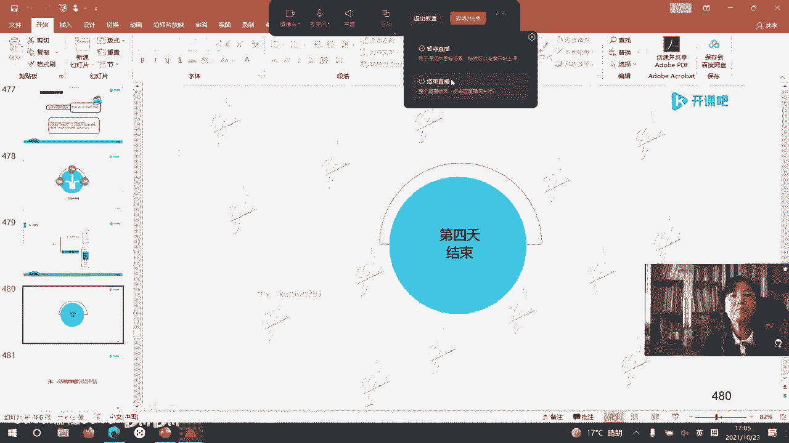

# -PMP认证4期 - P15：21-项目管理过程-质量和资源【itjc8.com】 - OA工作流 - BV1yY4y127aU

好的，上课时间到了，我们继续，我们开始学习我们的这个内容啊，呃也不用着急啊，主要是一个是一个是预习，还有过后我们还要多复习啊，还不用太着急，不管你是学文科还是理科的，其实你把它学通了这些东西啊。

嗯没有特深，不是很深很难的东西啊，多刷几遍题，就是我的经验教训，有学员已经支招了啊，给我们说这个方法了，好的我们现在说在质量管理中含有核心概念，把这个两对核心概念给它区分开啊，一个叫做质量与等级。

什么是质量，什么是等级，质量和等级这个概念有什么不同啊，如果光看定义的话，说这个质量呢它质量低，他是一个问题，是个毛病，因为我们都要追求一个高质量的东西，什么叫高质量，就是满足要求，适于使用。

刚才我们前面说过的啊，但是你等级低呢不一定是个毛病，不一定是问题，比如说咱们所有的学员呢，包括我啊，咱们都有智能手机，现在大家用的都是智能手机啊，就是比较呃能够就功能比较多的。

但是对于一些比如说80岁以上的老人，他们用的老人机，老人的手机就智能化程度等级可能是很低的，他不需要那么高，他不需要好多好多这些联网啊，好多弄些什么，又又照相啊，又什么。

它可能只要有一个带键盘比较简单的功能，能跟自己的子女通话，出去以后呢，要有什么紧急的情况，自己身体不好了，按那个按钮，他可以直接叫嗯，120，就这样，或者直接报个警啊等等啊，他只有这个最基本的功能就行。

所以他虽然啊等级做得特别低，但它质量一样可以做得很好，这就是等级和质量的关系啊，这是对的啊，也有学员自己来说了，好下一个叫精确度和准确度，刚才之前我们学前一章的时候，成本那一章的时候就提到过精确和准确。

我说到质量管理这章在学啊，这个地方在等着我们呢，什么叫精确呀，你数据呃测量的那个结果比较聚合，就是离散特别小啊，不发散就比较集中，这个数据就叫做精确，什么叫准确呢，测量的值更接近实际值啊。

这个说起来呢就特别有些学员现在就说了，应该举个例子对例子就在后边呢啊，而且这个例子是david from我导师david from它的例子啊，他给的例子，那么大卫呢，他们家住在。

就是一个那个美国的一个国家公园啊，其实是原始就是很原始的一个公园，里边那些基础设施啊，条件基本没有，但是自然景观的特别漂亮，她在那个地方呢就是搭了一个小木屋子，小木房子啊，呃有的时候呢赶上季节合适。

还能看到熊，就真正的狗熊啊，可以看到熊的，所以他们都是有枪的，它有猎枪，有枪，他每到周末呢他要出去就练习打枪，练习这个射击啊，打枪，那么他打枪的时候就感觉有感啊，他就这么想的。

如果他要去那个呃这个靶子这个地方打枪的话，呃他那小木屋啊就是一个木的一个小别墅，木质的小别墅，他自己挖的，还有地下一层，上边还有三层，那个是就是呃国家允许他盖的，有这个东西啊，那是它是允许他盖的。

那小木屋就在这个森林，就在这个一个森林里边，国家公园里面啊，他就住在这，那么如果去打枪打靶的话，打五发子弹，五发都命中，把心他管这个叫既准确又精确，五发弹我都打到了中间这么多啊。

那么我们看中间这幅图叫精确不准确，我五个子弹都打到了很集中的地方，但是呢不是我想要的地方都跑到边上去了，甚至脱靶了，打到别的靶子上，集中打了那么几个，那是那这叫精确不准确啊。

最后一个我们看这个叫准确不精确，我们虽然都打到中间，都打到这个九环十环这个左右啊，但是你看他的发散数据的，发散360度方向上面都有，这个叫准确不精确，为什么我们在质量管理和科学研究中，要强调精准度呢。

因为只有精准度才是客观的，能够帮助我们达到目的，达到目标的呃其实我们做事就是要追求精准度，它能够回归就是初心，我们到底要做什么，我们怎么能做成，如果不是这样的，你只关注这里边某其中一个啊指标。

那你最终可能就是自欺欺人骗自己，你花了很多资源，你都达不到你想要的效果，咱说一下，比如说2015年，2015年，我才在中央啊这个嘴里边听到了精准扶贫，这个概呃，不是2015年，2012年，2012年啊。

提到了这个精准扶贫，中国呢从49年建国啊，就是解放啊，以后一直中央政府就在致力于扶贫事业，就是想让老百姓都富起来，但是效果不好嗯12年的时候他那样说，他说呢这个中国依然有很多地方，就很穷。

比如说他举的例子，在咱们自己不能瞎说啊，不许随便瞎传信息啊，说这个你这个新疆的南疆，新疆的南疆地区，那是12年，那个时候啊，就因为这样，太穷了，所以他就什么都顾不上了。

他就光想的是他想的不是那种富裕的这个路啊，不是走的这个路里面啊，所以这是当时这么讲的，那中央政府花了好多好多的钱去扶贫，结果他们还很穷，不是谁随便画的啊，也不是谁随便一看，你觉得那富裕，你觉得那穷。

世界银行啊，有一个县有一个水平线的，其中在非洲撒哈拉沙漠以南那个地区，由于地理环境的恶劣，人口都集中在那，就比那个撒哈拉沙漠以南的那人还要穷，就那么一个情况，可是我们花了那么多的穷。

那么多的钱为什么没有扶贫啊，就是因为我们不是精准扶贫，精准就是既精确又准确，又是我想要的，我又能达到那个结果，因为我重复不断的重复这个数据还能满足他，也就是你贫你脱贫了，你不能说这一个月你脱贫了。

你过了后边月你又穷了，这不行的呃，所以就提出了精准扶贫的要求，所以做事呢都要精准，包括质量管理，包括我们的项目管理和科学研究，都要达到精准，这个结果一精准好，那就是又是我想要的啊。

我又能够这个长期的实现这个指标，所以要研究精准啊，对啊，这世界银行在规定的这些指标啊，你比如说这种情况精确不准确，比如说上级投了钱对吧，投到那个地方了，你倒是给了一群人，这群人都很集中，这个数据很精确。

就像刚才我们学员说的，层层贪污，可能都被那个什么领导干部，什么都装在兜里了，得把这些呃该给的钱，该给到的地方给到，另外扶贫是不是都给钱呀，不是的，你不交给他本领的话，你只给他钱，钱也有花完的那一天嗯。

那么也见到就贫扶贫的路上的一些困难，你给他投入的小羊羔啊，这个小鸡苗你给他，你让他养啊，结果他等你走了全杀了，吃了又来管你要钱，我没有了对吧，就这些现现象也都很多的呢，嗯也因为他技能不够啊。

他这个就培训学习不够啊，结果你给新疆弄了一个培训，还有人攻击说你那什么强制劳动真够可笑的啊，我就觉得有的时候有些东西啊，咱们得正确的来看待啊，那都不是强制，那你有一个政府强制让你富是吧，让你富有。

让你有钱，那谁强制强制我，我巴不得呢，对不对，那也不高兴吗对吧，哪个谁哪个你的上级强制你必须得有钱，你必须必进并成富翁，你不是他还帮你是吧，你到哪找这样的行是吧，所以这个要注意扶贫也用了精准。

所以大家也会观察时事，在社会生活的很多方面用到了精准这个概念，精准这个词既直接出现在考试题里，就是让你判断什么是既精确又准确呃，也对我们的项目管理是有极大的帮助的，好的啊，好我们现在再看这几个概念。

预防和检查它们的区别，咱们说过预防是还没有出问题呢，已采取措施保证不出错，检查时他已经出了毛病了，出了错，你把这个错挑出来，别到客户手里去，这是预防和检查的区别啊，公差和界限。

后边我们讲控制图会专门说公差和界限啊，公差是之前给到的呃，也就是客户提出的他所需要的那个要求，界限呢，是我们为了控制这个这个公差的边界，所设置的所定义的那个界限啊，最后一个属性抽样和变量抽样。

属性抽样只给一个定性的结果，比如说你这一批次的东西合格不合格，合格不合格，这个就叫属性抽样，什么叫变量抽样呢，合格它是几十几点几啊，用数字来表示的就叫做变量抽样，这是这样一些概念，我们要把它掌握啊。

在质量管理中，他跟那个范围管理有点类似，因为质量管理是放到范围那个管理之间讨论的，但是有一点提醒大家注意啊，增值管理说的那么有道理，看起来好像说得那么好，但是增值管理的那个指标里边不包括质量管理。

它只有范围进度成本，没有质量，所以你要进行质量绩效的衡量，还要单独去进行项目的质量管理啊，他没办法用范围进度成本把它把质量放进去，是不是特意不放，不是也想放，现在还没有研究出来。

因为大概在呃快小10年了吧，之前我就看到很多学者在研究，在试图想把这个质量的指标也放到争执里边，有很多的论文都这样写的，但是呢都不成熟，也都没有一个特别好的研究成果，所以现在质量也放不进去。

只是我们在进行管理的时候，是把这个质量放到范围进行管理的，可是我们在范围进度成本，这个绩效测量指标中是测不出质量的指标的，这个在这说一下啊，也就增值管理也是有它的缺陷的，两个比较比较大的缺陷。

一个缺陷是增值不好衡量，所以就定义，比如50 50，20 80 100也可以这么定义啊，这是第一个，第二个，在这个增值的绩效测量指标，pmb当中没有质量指标，只有范围就w bs，就是你要干的那个工作量。

他只有那个工作量，但是工作量干得好不好呢，你还需要单独去进行管理，在哪管理呢，就在这一章质量管理这一章进行管理，这一章质量管理，它既要管理项目的质量，也就是过程质量嗯，又要管理结果的质量。

产品的质量或者叫产出的质量啊，这是这一章啊，另外有一些核心概念需要掌握或者需要了解的，质量管理这个领域，远远的走老于项目管理这个学科，所以人家在质量管理领域里面，已经有很多被世界普遍公认的和呃。

现实实践里面被证实了，有道理的一些理念和概念，就在质量管理领域里边，已经早老于项目管理被发明出来了，那搞项目管理的这帮子人，在进行项目管理的时候就大量的使用了啊，质量管理领域里的一些理念或者叫词汇。

比如说第一个客户满意度，客户满意度是人质量管理领域里面的里边的啊，而不是项目管理，你搞的客户满意度，第二个持续改进的模型，比如pdc循环，之前我们也说到，在这个项目管理中。

也有很多流程强调制这个持续改进，但是是在人家这个质量管理领域里边，诞生出来的，最典型的pd ca循环，也叫戴明环，就是一个质量管理的一个循环啊，常见的持续改进t q m全面质量管理六西格玛。

精益六西格玛啊，这都是质量管理领域里面啊，研究和或者质量管理延伸以后研究出来的，还有马尔科姆波多里奇模型，他在自己的工作中发现，要想让美国伟大，就要让美国它各个方面工作呀，服务呀，产品啊。

质量要立于世界之林，要是优秀的就质量要好，就马尔克波德里奇这么想的，所以他就制定了美国的这个国家质量标准啊，这是美国国家质量标准啊，然后他为了让各个企业按照国家标准来行事，按照国家标准来执行。

美国的国家标准绝大多数都是非强制的，不是强制性的，都是你自由执行，但是为了让你能自由执行的话，给你做一些激励，做一些引导，他就建了一个马尔空波多里奇模型，干嘛呀，就给你这些企业评级。

凭这个质量管理的这个级别评个大奖啊，叫马尔空波多里奇奖，你如果获得这个奖，就给你的商品免税，进到商店里去免检啊，进到商店里去也给你减免税收，那税的负担在国外呢是挺重的，那要如果你要给我减税的话。

大家就愿意干这个事，又是帮我们改善管理的啊，又能给我减税，所以有很多企业呢就会这么做，去争取获得这个马尔空波多里奇奖战斗，这都是n多年前的事了，因为现在美国未来呢越来越空心化。

它就是以金融啊为操控为导向，所谓的先进技术为导向，你技术再先进，没有供应链没人做出来，你设计那东西见不到实物，见不到产品怎么变现呀，啊他其实也面临这个难度，即使现在这个情况。

美国的那个制造业它依然是全世界最强的啊，不要认为美国现在制造业不行了，他还是很强的，说白了就是有一个老话，瘦死的骆驼比马大，他还是有很强的实力的，只是跟他自己比，或者他要拉开距离，或者他要伟大。

可能就不大够了啊，他还是很实力很强的啊，第三个叫做管理者的责任，在质量管理体系和领域中，强调指这个质量管理的主要责任在领导者，在管理者，而不是在具体操作执行和实施的那个员工，如果要分配比例的话。

我出了故障了，出了问题了，有了损失了，管理者承担多少呢，管理者承担损失的85%，那个操作者或者叫非管理者，他们只承只承担15%，就这个比例就这个比例控制的啊，如果在考试里面考题里边让你做题的话。

你得知道这个比例，要不然你就算不对了，这个比例人家考试的时候不会给你啊，是作为一个常识，你要理解的，这是第三个，第四个与供应商要建立互惠的这种伙伴关系，互利互惠的伙伴关系就是大家更赢共赢，你给我。

我让你赢这种关系，第五个预防剩余检查，我们之前说过了，第六个，我们在进行一些管理的时候，要考虑质量成本，就这个管理成本，其中有一致性成本，非一致性成本之前都讲过，那我们在做项目估算。

我也可以把质量成本的这个概念，放到估算里面去啊，这就是引用了项目管理啊，引用了质量管理的这个案例，第七个叫做质量功能展开，用质量功能展开图描述，其实质量功能展开来自于质量领域啊，你看看人家这个名称啊。

质量管理领域的词汇它是干什么的呢，把客户说的不太清楚的那些需求，通过一个工具q f d啊，把它转变成特别清楚的描述，转变成清楚的这个说法啊，这是这样一些词啊，都是在质量管理领域里面所产生的。

另外我们快速地了解一下质量管理的历史发展，严格质量管理最早之前20世纪啊，上个世纪和这个20年代还往前100多年前，他讲质量，讲质量管理啊，都是在生社会化，大生产发展起来的这个前提之下来深入开展的。

但在那个阶段，质量管理叫做狭义的质量管理，专门对生产的产品，就是生产出来的东西进行检查，由工匠自己根据经验检查，或者找一些头脑灵光的小徒弟来检查，检查出的东西，检查出的错误或者坏的东西。

不要落在消费者手里，给自己积一个好的口碑啊，给自己的这个产品呢有一个好的质量的，这样的一个一个描述或者一个证据啊，这是第一个阶段嗯，下午睡到四点半对，但是因为我们今天呢有一些特殊情况啊，有些有点晚了。

我们四点半呢可能还会稍微再严一点啊，但最晚最晚也不会超过五点钟嗯，最晚可能会晚个十几分钟到20分钟啊，这个样子有学员在提问啊，那么因为这个后面的很多内容呢，它相对就简单了啊，就容易了。

特别是资源管理那一章，几乎就没有特别多的内容了啊，第二个阶段到了统计质量管理阶段，统计阶段由于这个事后进行检查，狭义的质量概念啊，这个时候啊，那么统计质量管理呢就会统计那些不合格品，废品。

他们为什么不合格啊，我用一个统计的办法去找那些不合格的原因，这样就让这个质量管理从被动，实现了主动的管理，我找到了不合格品的原因啊，就是就可以把这个错误纠正，我就让这个错误从根儿上就不出现。

那我就可以不会有那么多的资源浪费时间浪费，我弄了一大堆废的东西出来啊，有的学员说一个月的复习时间够吗够啊，一个月半个月都够，看你怎么学习，就是你一定要把你不懂的通过这个反复的听，反复的回，把它看懂。

我们也有这样的经验，因为我们做这个事儿做了十多年了对吧，我们做这事的经验在于哪呢，就是这个培训时间越长的班级通过率越低，培训时间越短的班级通过率越高，因为有一个节点效应，你给他留的时间越长。

那不好好学嗯，不用脱产啊，每天两个小时，2~3个小时，中午先不要睡觉了，中午赶紧刷一刷题，赶紧做一做啊，把那个书一边做题，一边这个看这个啊，一听就会，一做就哭啊哈哈一做就做错，这个是刚一开始的状态。

没关系，多做一做就好了啊，好的，这是统计质量管理这个阶段，在这个阶段呢发明了一些管理工具，一些经典的我们后面会涉及到啊，再后来质量管理进入了全面质量管理的年代，全面质量管理强调的是全过程，全企业全员工。

为什么这儿强调全面质量管理呢，因为在统计质量管理，这里发明的一些工具非常的难，比如说直方图啊，统计图啊，概率啊，数理的知识啊，就是学历比较低，他就弄这些东西很费劲，他弄不懂，弄不懂呢。

他就会感觉质量管理都是大师们的事儿，都很高深，那都你们去弄吧，那我们这个我们这个一般的员工，我们跟这个没关系，结果就发现这样还是管不好质量，所以要由全员的参与啊，只不过责任要划分明确，你一线的员工。

你可能不需要弄那个高大上的东西，但你要弄什么啊，你要负什么责任，都要明确，现代的质量管理进入了动态的管理阶段，持续改进动态的管理阶段啊，要以战略的角度，全局的角度去看待和管理质量，如果没有这个高度质量。

你是管不住的，他不是光质量技术监督局质量部门做的事，它是国家行为，比如说你国家不出手的话，你就不可能解决毒食品，读空气，人们生活水平的这个不高质量不高的这样，所以从国家战略。

就国家来出手来做这个质量管理，到一个企业也这样，你不是靠某一个质量管理的专员，某一个质量管理的部门把质量干好，是全公司都要把它做好啊，然后我们继续啊看到质量管理有一些管理流派。

需要我们迅速地掌握一下这个内容，这些内容是我给大家提供了一些背景资料，你有时间就看看，没时间也可以不用看，你要了解一下代明它主要的核心的观点就行，戴明爱德华，戴明是一个美国的大学教授博士啊。

他写的这本书走出危机，你也不用记这个书的名，他在这里面头一次提出p d c a循环这个概念，这个一定要知道，人家问你pd c a循环是谁的贡献，有人就瞎写啊，是代名的贡献，会连接。

而且pd c a是什么意思，有1年考试有学员连这个都不知道什么是p，什么是d什么是c，什么是a啊，这些都是基本的常识啊，我们在这里就不再说了啊，p d c a循环啊，好的，另外也是美国的一个教授博士啊。

朱兰博士，朱兰博士他写的著作，他在这个著作里提出质量的概念叫做符合要求，适于使用，我们刚才前面说过，另外朱兰说如果进行质量管理的话，要完成三部曲，走三个步骤，要进行质量规划，质量保证啊，质量控制。

质量保证，质量改进啊，这就是q a，这就是q c啊，那么第一个这个质量计划，你可以认为叫q p质量计划，质量管理，你唱好这三部曲，在我们学习的这一章里，就是这三个过程，三个过程进行质量管理的啊。

接下来有个class b克劳斯比，他提出了零缺陷的概念，有人就攻击他，怎么能零缺陷呢啊，一个事儿的可靠率只能有一个无限接近于零，它不能是零缺陷啊，但是你没明白，克劳斯比的意思是在质量成本这个概念中啊。

比如这是一致是吧，这是非一致，lsp认为一致性成本不算质量成本，因为你就应该这么做，你应该投入，他说这个非一致性成本才是质量成本，如果你把事情做得好，不需要纠正，不需要返工一次就做好了。

那你这个非一致性成本你就可以是零啊，你可以不花钱呀，那不就是零缺陷吗，这是它的概念，这是他的观念啊，它并不是指的这个产品的可靠性是百分之百啊，一点都不能有错误，不能有缺陷，所以零切线又引申了另一个口号。

或者说法叫做第一次就把事情做好啊，第一次就把事情做好的代价是最低的，或者叫质量是可以免费的，这是class比的观点啊，另外一个人叫石川新，石川新是个日本人啊，他搞了这样一个因果图。

因为在日本当时搞质量改进啊，就是戴明博士在帮助他们进行质量改进的时候，就发现以这个qc小组，qc小组活动为单元进行了质量改进，特别有用呃，一般一线员工参与这个质量活动，小组对这个质量进行啊持续改进。

那一线员工这问题又来了，他的这个学历不高，学历比较低啊，他不太清楚这个东西怎么分析啊，你给他搞那些图形太高大上了，他不知道，所以这个石传新就发明了一个，只要你认识字，你都会做啊。

你基本的道理你都会就是你懂得的话，这个图这个工具你全都会用，叫做因果图或者叫五vs法呃，无vs图或者叫于川啊，石川图，因为它叫石川西嘛，或者叫鱼刺图，鱼骨图它画完了以后像一条鱼一样，日本的是个海岛。

吃鱼也是日本的主旋律，所以他用自己的生活里面的东西来代表这个图，进行根本原因分析，比如说这个现在一个厂房有这个问题啊，然后我就朝几个方向展开去分析，比如说在工厂里就是人机料法环，从这几个角度啊。

然后他就去分析，比如说为什么会噪音超标呢，他就问为什么啊，因为人的原因，为什么因为人的原因会超标呢，因为这个人不按要求做，为什么人不按要求做呀，就10万个，为什么啊，就因为这人都没经验，经验不足。

你为什么这个经验不足，你不让他经验足了呢，因为缺乏培训，为什么缺乏培训，因为老板不给钱，找到根本原因根因，然后朝着根本原因下手，你才能解决问题，不然的话你治标不治本，找不到本质的问题，你只解决表面的。

比如说你看嗯没按要求人不按要求做，那我们做吧，把它开了开了，你烧完新的员工还不按要求做呀，再来了还不按要求做，因为你没找到根本原因啊，找到根本原因解决问题，一般情况你问五次差不多就到底了。

但是不能问六次了吧，你问5000次，问5万次都可以，但是一般一般问到第五次差不多就出来了啊，这个就是因果图这个做法啊，这是石川心怎么做的，田口玄一，它是一个无线电信号学家。

他在这个书里提出了损失函数的概念，什么呢，把这个产品的品质用钱来衡量，用货币来衡量，其实大家在研究，如果能把质量指标合到我们的增值管理里边，就可以用填口悬疑的损失函数。

那么在汽车制造业特别是传统的行业里边啊，生产制造业的行业里边，对于田口玄一这个名字是熟的，因为它在生产制造业里发明了一系列的，叫做甜口方法，或者叫甜口主张，就这四个，下边这些内容，有时间你就看看。

没时间就算了哈，可以用损失函数来计算来算，你这个产品的质量是到底是多少，也就是拿钱来表示质量，正因为有一个拿钱表示质量的函数存在，所以给这个把它合并的增值管理里，提供了一个机会，但是也很难。

因为行业不一样啊，啊那个质量的衡量都不一样，你i t行业你和生产制造业，这质量管理都差别很大的啊，这我们就说到这儿，最后一个非根保姆，他呢是个美国人，他说要进行全面质量控制，叫t q c全面质量控制。

他又说，产品的质量在任何情况之下都比这个速度重要，应该放在最前面，要不然你干了一个坏的东西，你干的越快有什么用啊，这只是他的观点啊，我们先把大师们的观点给大家展示出来，好的继续。

我们就进入这一章的学习了，这一章有三个知识啊，有三个过程，这个知识领域有三个过程，分别属于规划执行监控啊，这个是q a质量保证或者叫管理质量，管理质量比质量保证的概念要大呃，管理质量包括这个质量保证。

它强调的是项目的质量的过程，管理就是按照iso的标准，按照不同行业，你比如汽车行业14969的行这个说法呀啊，你比如在这个生物医药行业，按照这个接mp啊，接gmp用这样的标准去衡量进行过程管理。

那这个8。3呢叫做针对结果进行了控制，或者叫什么检查，检查啊，那么管理质量也有检查，但是你检查的是过程嗯，8。3检查的是结果，项目的最终结果或者过程中的结果，检查的是这些内容啊，对的好的啊。

我们现在看一下啊，接着看啊，第一个过程规划质量管理，得到质量管理计划，这是12个项目子计划之一，管理质量啊，在整个项目过程中追踪着这个项目的过程，这里的审计指的是审核项目，审核项目啊。

公司外部的外审员和公司内部的内审员，进行质量审核，得到的结果就那质量报告嗯，或者叫做不符合项报告，等于啊这么近的记晕了，r a c有解决方法，因果图纸是根本原因啊，有些人对因为工具有点多。

最后一个过程对项目的这个结果进行控制，q c啊，对项目的结果进行最终的这个控制，如果有不合适的地方进行变更，请求进行变更请求啊，好的，那我们现在看规划，质量管理除了得到质量管理计划以外。

还需要得到一个质量测量指标，你拿什么指标来测量产出，测量这个项目管理的这个过程呢，就有质量测量指标，这个质量测量指标注意啊，相当于，相当于质量基准，相当于质量基准啊，它并不是质量基准。

因为在我们的学习里面没有提质量基准，但它就相当于衡量质量的那把尺子一样，嗯然后这个输入没有更多的说了，工具技术专家判断开会一些这个收集技术啊，这里边有几个技术，比如成本效益分析啊，质量成本。

这我们已经说过了，这个表现技术，这里面有些工具我给大家展开一下说一下啊，好的我们就往后翻了，现在大家看到的也是一个流程图的模型，是我们第六版的pm bok给的，他给的这个模型是戴明博士的模型。

是戴明搞的，戴明除了p d c循环以外，还有一些其他的管理学的贡献，其中包括这个组织系统流程图，这张图就叫组织系统流程图，戴明说，任何一个组织，不管它是什么性质的。

它是企业事业还是政府机构还是非政府组织，还是非盈利组织等等，都可以用这个组织系统流程图来解释，这个s i p o c分别对应的是供应商输入过程，输出客户英文单词的首字母呃。

然后他把它缩写到s i p o c这么一个模型里，任何一个组织都有供应商给他，提供它所需的那个东西的来源，然后进入到自己的这个系统里去输入，经过自己系统的过程的提炼加工，变成了自己这个企业。

自己这个组织的输出到客户手里边去，就这么一个步骤，每一个步骤也有一些相应的反馈活动啊，q a和qc的区别，qa是质量保证，过程管理，就是质量审计中间的审计员来进行的。

这样的大量的活动叫q a q c叫质量控制，就是对结果的检查，你已经做出这个结果了，对结果进行检查，q a是针对过程管理的，qc是针对结果进行管理的，结果怎么管理，就是检查质量检查。

q a呢是过程保证质量管理啊，过程就是s i p o c这个流程图啊，下一个这个叫逻辑数据模型，我们书上也给了这个概念，就是在这个里边，我们可以用这个工具来规划策划质量啊，那么还有这个叫矩阵图。

也可以用于规划策划质量管理啊，下面第二个过程叫管理，质量管理质量是体现的对质量管理过程的管理，比如说你要了解组织质量管理的运行的话，你就知道你公司有没有，一些关于质量的资质证书，比如说cm mi 3。

这就是一个啊it行业，软件行业啊，他有了这个证书，这个证书不是你自己说行，你自己给发的，第三方机构由审核员，国际有国际上的审核员，这个考试还是很难的啊，我们内部有内部的审核员，外部第三方有外部的审核员。

由他们来监督来收集证据，看看你们做的这个东西，是不是符合那个体系的要求嗯，如果符合了，他给你一个报告，如果不符合，他也给你指出，有些不符合，像他要监督你去整改，如果你不改的话，那么这张证书呃。

比如说这个认证的证书质量，能够证明你公司质量的，能够提振你的客户，对你公司产品的质量信心的这个证据你就不足，你不能王婆卖瓜自卖自夸啊，你自己说我这东西特别好特别好，可能人家反而不相信。

如果有第三方评估机构评估了，说我好是另外一回事，他评估完了以后就会给你发一个证书，发了这个证书不是不管了，每年都要进行审计，每年都会来进行内审外审，外审至少有一次啊，这个审查的这个费用是不低。

但是你做一套这个体系呢，那c m m i是很贵的，但iso 9000呢，随着这个进入中国的时间加长，它这个成本也在逐渐的降低，现在也比原来便宜多了，这是管理质量，你看管理质量会用一些什么呢，核对单。

核对表或者过程的分析，根本原因分析，另外也用这一大堆图形，我把这些工具给大家说一下，图形说一下啊，那么这个就是一个核对表，前面加上不同的定语，得到的就是不同的核对表，比如说质量核对表，风险核对表。

有我们自己用的话，出差核对表，旅游核对表嗯，一个活动的核对表都可以用它，这是一个学员，2010年的时候，给我做了一个pmp考试的核对表，我们要参加这个考试了，需要带什么东西呢，12345678 90。

它列出来了，前面这个五项红的字是必须要带这个，后边五项呢如果我有条件尽量带上啊，这就是核对表的格式就做出来了啊，然后明天要考试了，这个学员是一个组长，他组织自己的组员啊，来准备这些东西，他跟大家说。

头一天啊，八点钟要考试了，请大家啊拿出这个东西来准考信，你带了吗，这个美国人考试不叫准考证，是一个准考信，一张a4 纸打印的，等到那个开放的时间，老师会通知大家的，带了两个结果，打个勾身份证。

而且是有效的啊，带没带带了啊，这个考场的座位你知道不知道，这一个一个勾一下，所以核对表可以防止你什么，防止漏，像那些漏掉的一些管理项啊，如果你没有这样的一个记载的话，会漏掉，我们也经常见到。

会看到有些学员就是不带这个有效的证件，就去考试了，人家要求非常严格，因为美国单独请了一个考试公司来运作，这个事儿，单独请了考试公司，人家六亲不认，不会讲这个不会说，培训的老师说，你看挺辛苦的。

学的也特别好，你就让他进去吧，那不行，人家有人家的政策和规定所掌握的，你不带这个证件，你就进不了考场啊，核对表和检查单在这个设计上格式不太一样，因为你检查单和统计表啊格式不太一样，但是他们在管理工具中。

管理工具中它们属于一类检查单，统计表，和核对表，他们属于一类，这是管理工具中的一类呃，虽然具体它长的样子不太一样，那不用带笔和纸，他给你，就像你到宜家买东西那样的，光杆铅笔，木质的光杆铅笔草稿纸。

每个人有几张，他会给你的，而且都是很大的啊，嗯过去我们考试的时候都是a3 的，现在最多也就是可能给你a4 的吧，这个值会给你一些啊，再一个对check list啊，就是检查表啊，可以叫检查单，检查表啊。

有的这个学员说他们自己那也有这个，这都属于一类工具，把它放到这个都放到核对表这里啊，过程分析，什么是过程，我们现在不是一个一个在学习，这49个过程吗，这就是过程啊，你每做一个分析一个过程。

就看看有没有多余的非增值的流程，用根本原因分析一下，把那些非增值的流程叫做精益管理啊，你把它这个非增值的劳动，非增值的活动剥离掉，剩下都是有价值的，有意义的活动和工作啊，这个工具就这么用啊。

橡皮擦要自己带吗，不用都有啊，考场都会给你的计算器简单，只有加减乘除的计算机，如果有计算题也会给你的，如果不给你计算器好，我估计那个加减法可能是十十位数以内的啊，连计算器都不需要。

所以不给你计算器反而更好，就不考计算题了，好多学员不是会觉得很纠结吗，啊，带上脑子，带上四肢就行了，到时候你坐那儿有笔有纸，你自己记不许手机随身带着啊，手机是要离开自己身体的，放到一个固定的地方。

下面就是因果图，大家之前我们已经给大家讲过了，这个因果图也在管理质量中会大量的使用啊，另外一个叫直方图，又叫柱形图，他统计这件事情这个原因，它造成了多少故障的或者叫问题的一个频数，频次发生的数量。

比如这张图由于这个时间不够用，产生了20多个20几个22个毛病，他这22画的不准啊，都快25了，大家知道就行了啊，比如由于你这个管理指令不清楚产生的毛病，有这么多，三个你的过程文件。

你标准化的文件写的不好，有30个毛病，由于系统发生故障，它产生了三次毛病，由于你那个主要的人员，关键的人员他请假休假去旅行了，那么有16个毛病，这个我们就把它做一遍啊，现场一般都会有电子钟的啊。

不能用手机时间都会有大钟给你看，不允许带电子表，可以带机械表，机械手表，人家进考场的时候，确实是一个一个要检查的，现在如果有疫情，还会检查一些其他的东西啊，比如说你的那个什么疫苗啊，核酸报告等等啊。

什么可能是不是还要看这些，那么到底要看什么，就需要真正考试的时候会通知的，你按照那个通知的要求来做啊，好下一个叫判例托图，也叫这个排列图啊，那台湾人如果翻译这个管这个叫柏拉图啊，也会这么叫的。

这个是一个特殊的直方图，特殊的直方图啊，它特殊在哪呢，你看把前面这张直方图按照大小个排列一下顺，序，这个柱子重新排列了，然后给了两个纵坐标，左边呢是还是切线的数量，右边是什么，累计的百分比。

故障累计的百分比，在总的故障里，它占的比例都以100来计算，你把右边的100啊，对着左边的100来计算啊，可以看，因为过程文件不是有30个毛病吗，因为时间不足有22个毛病，他俩加起来就52个了。

所以这条线呢是根据右边的这个坐标去点的，点完以后你连一条线，这个也是著名的二八原则，由意大利经济学家帕累托他发明的，他因为发明了这个获得了诺贝尔经济学奖，他研究经济问题的时候。

发现这个世界上绝大多数财富，比如说80%的财富，又极少部分人拿着就是20%的人，占有了世界80%的财富，他研究这个问题的时候这么做的，后来就发现，这个定律在社会生活的各个方面都有用，都管用。

而不是指在经济活动中都是管用的啊，那么这个就需要我们什么呀，可以通过应用排列图或者帕列托图，找那个最关键的最主要的那个原因，因为它导致了80%的问题，你把那个最主要的原因找到了。

解决了它就能解决掉80%的问题，你老盯着这个小小的，你把这个改进了，他能管什么事啊，管一点你不能说一点都不管事儿啊，但这不叫抓重点，不叫抓主要矛盾，找这个关键的，用帕累托图找嗯。

右边的这个坐标去看累计这个问题的百分比，左边呢还是看缺陷的数量啊，它就是这么一个图形啊，下一个图叫散点图，散点图是找问题的原因的，比如说这次新冠肺炎这个病毒是哪来的呀，原因在哪儿啊。

那你就要用统计学的原理，你统计的样本数据要是少的话，就得不出这个结论来，石川图是刚才所有的这些图啊，都是在找原因啊，你这个是找主要原因，找到主要原因以后画一根线，把这个主要原因不停的向下问，为什么。

一除了主要原因，你还有次要原因呢，但是我因果图只拿一个啊，只拿一个原因来对它找问题，帕累托图是从多个事件中，我找最关键找最主要的，哪个是最主要的最主要的矛盾啊，这个也要精准，不精准也解决不了问题。

比如说北京的空气污染什么原因造成的呀，嗯你找最关键的好多原因对吧，比如说机动车，比如说地理气候环境啊，还有是北三县，我们都造了，临了风过不来等等，各种原因都有，那你找最主要的哪个是带来问题最多的。

这个就叫帕累托图，好，我找着了，机动车是最大原因，那么机动车是最大原因，根本原因是什么呀，你画一个汽车机动车啊，然后你找为什么机动车会有空气污染呢，因为你技术不行啊，为什么技术不行啊，就往下倒。

这是这两个东西的这个区别啊，当然也有专家说，因为我们中国的老百姓啊生活饮食习惯不好，老做饭啊，老炒菜煎炒烹炸的这个烟囱排出的烟，导致了空气污染，也有这说法的啊，不是没有，你真有专家怎么说，也真这么想。

被别人戏称为砖头的砖是吧，而且是被动语态被拍砖的啊，是这样的啊，接着回到散点图啊，散点图那就是新冠肺炎跟什么有关，我们用散点图这个图形一次只可以找一个原因，一次只能找一个原因啊。

比如横坐标这个这个这个病啊，新冠肺炎这个病，比如这边的原因啊，什么原因，比如说动物，那你就找这个病例吧，这个人接触过动物的，是有多少个他会有这个事儿的啊，这找一个原因啊。

下一个图我又找这个这个新冠肺炎跟那个海鲜，跟吃这个海鲜有没有关系，那你找有多少人到过那个海鲜市场，去过海鲜市场生病了，这么早，其实找了好多，到现在也没说清楚，这个新冠肺炎到底是因为什么。

散点图是找原因的，如果你画出这个统计的点在这个平面上分散着，这样分散着说明这个x轴和y轴没有关系，他们没有关系啊，如果你搞出的这个图形像这样他们就有关系，这个关系叫正相关，而且是强正相关很强的正相关啊。

什么是弱正相关呢，弱的正相关这个数据点啊，它是一片一片一片的，有个数据带，它不是那么聚焦啊，但是你时间长了，样板量大了，你从总的可以看，也可以看到这么一个数据带一个趋势，这个就是比较弱的。

正相关有正相关，也有负相关，负相关的图这么画啊，往下画，所以我通过这个图形散点图先找到原因，它到底跟动物有关，跟海鲜有关，还是它从哪来的呀，这个东西还是实验室来的呀，还是人为的，还是生化武器啊。

现在不是还吵吵嚷嚷的不清楚吗，因为没有这个统计啊，你要有统计的这个数据来看到底哪个多，哪件事啊，哪个情况发生的多，这不就是溯源吗，找到根源，为什么要找根源，找到根源你才知道怎么预防，怎么解决呀。

怎么克服这个问题啊，这就是散点图的意义啊，质量审核这里边的审计就是质量审核的意思，质量审核由内部审核员和外部审核员，或者啊由内部的，或者由外部的审核员来进行审核，内部审计的就叫内审，外部审计的就叫外审。

外部审计一般都是第三方，有资格，有资质的第三方他们来进行的这个审查，这个审查就叫做质量保证，呃保证或者是q a或者是对过程的管理，你看内部外部的审核员不是检验员，他不感兴趣，你这个产品到底合格不合格。

交的出去，交不出去，他不管这个，但是他也会审查你的产品，他通过你的产品的审查来得一个结论，也就是你这个公司的质量管理靠不靠谱，是一个叫做结构化的审查，公司的质量体系，能不能支撑你们这个公司提供好的产品。

给你的客户提提振信心，他是管这个事的，它并不是检验啊，做这个事的，如果要是质量控制检查嗯，那么他要检查的是具体的这个产品到底合格，不合格，给这个结论对管理体系，质量管理体系有很多学员呢没有接触过啊。

就对这个体系的概念很模糊啊，所以这是关于这个审核啊，现在还有一些新的说法，比如说面向x的设计，书上给的x就是各种因素都有，它来自于哪呢，最早来自于生产制造业，叫做面向制造的设计。

后来把这个后边这个单词啊，你可以x什么都行，比如说面向销售，面向成本，面向包装，面向测试等等，都可以，什么意思呢，就是在你对这个产品啊，或者产出你的产品，可能是个服务啊，都有可能在进行设计的时候。

就要保证它好制造好，维修好，生产也好用，这个质量不是检查出来，你设计的时候不管随便瞎弄一个啊，那到最后你也不管他工艺能不能实现，其实现在中国的中国的设计水平呢也是不高的，跟世界比起来啊。

就即使你的设计水平上来了，我们还有一个巨大的问题，工艺水平，公益能力，制造能力特别差，因为制造的工人就比较少了，嗯制造工人现在谁去学工人啊，又苦又累又不挣钱对吧，那人家宁可在网上去卖点什么东西啊。

没工作，家长养着都不去当工人，所以我们的产业工人就越来越少了，那如果你是设计的话，你会不会考虑你的产品，在未来这个生产制造能力啊，工艺能力的差别，然后去设计，你搞一个特别好，特别漂亮。

最后你根本做不出来呀，那哪有质量啊，所以设计也有质量这个问题啊，对高级蓝领现在中国很少也没有了，对呀初高中都分分这个分级了，一听谁上的职高，那家长多没面子呀，都要上大学，研究生读博士，读完干嘛用啊。

除了教书，你没别的，没有实际的作用啊，你干不了事儿啊，干不了工程，干不了项目，做不了事啊，那这是整个社会的管理问题，我们不在这评论这件事啊，好我们只说这个工具啊，控制质量，刚才已经说到了。

得到的是质量测量结果，你测了项目错了产品，它指标到底是多少，你测的这个结果，这个结果如果合格，你就给一个核实的可交付成果合合格吗，这个质检验检验员合格，他盖一个章叫合格的这样的东西啊，就这样。

我们用的工具和技术都是之前学过的，只有一个没学过啊，控制图，所以我把它待会单独拿出来说，控制图每次考试都考，一定要知道它是什么概念啊，那么这就是一个统计表，刚才有一个学员说。

这是他们用的checklist，在生产制造业里，这checklist也可以长这样，就是做一个统计用的，它也叫核对表，也叫统计表啊，呃当然现在是这个前导向的啊，有些大学生呢你可能学个保姆稍微容易点。

但是你如果大学生研究生毕业了，你想当那产业工人可不是一天两天能学会的啊，那产业工人也是非常难的，需要很长时间的培训的啊，下面还有一个叫统计抽样，统计抽样不考计算题，但是我用这个表叫告诉你。

在工厂里进行统计抽样，是要按照一个公式来计算的，不是随便瞎抽的一批次产品，我抽十个抽20个，抽300多个，是基于什么呢，是基于这个公式，基于你抽的这个可信度，你抽的这个数量可信度越高，抽的数量越多。

可信度低，你可以抽的数量少一点啊，这是统计抽样啊，接下来我们就说到这个控制图了，控制图呢我给大家举个例子讲一下啊，因为这个每次都会考试啊，我用这张图形，但我并不用这个图的例子，因为它里边是真是美国啊。

那个书翻译过来的，美国的这个这个单位名称尺寸呢用的都是英尺，咱们大家不习惯，所以我不用它，假如啊我家就是造汽车的，我家是造汽车轱辘的汽车轮子的，咱们班里的学员里面有有搞汽车的嗯。

这个控制图一般很难也不难啊，好的，那么这个汽车轱辘，假如我家造的这个汽车轱辘，它的尺寸是十正-1，我瞎编的啊，这尺寸是荒唐的，告诉大家，我家汽车轮子就是加工的，谁家汽车轮子都不是加工的啊。

我只是举这个例子说明这件事儿啊，这个汽车轮子是我们家是一个车工工人站的，这个车床前面啊，把这个汽车轮子加工来的，那么这个汽车轮子的尺寸均值，就中间的这个值十，最高的那个值加上一最高的值啊，我画一条线。

就这条线啊，十加了一，这个叫什么上规格界限，下边也一样啊，你再画一个10-1叫下规格界限，在这里我就不在这画了啊，有个下规格界限嗯，然后我再通过计算标准差的概念，叫正-3个标准差，在这里你就不用管了。

不用这个管它了啊，上下三个标准差的地方再画一条线，这条线叫上控制界线，我计算了三个标准，下边也一样，也画一条线，所以在控制图里是五条线，中间有个均值，上面最外边啊，上下最外边有一个上规格线。

下规格线靠里边有一个上控制线，有个下控制线就把它画出来了，然后我就开始进行，原来的这个案例是12加减0。1啊，人家原来这个原来这个案例里面是这样，因为他用的英尺，我就不用这个跟大家说了啊。

那么我就开始检查我的汽车轱辘汽车轮子了，我按照这个时间维度开始加工了，加工的第一个汽车轮子，比如说第零秒我就第零分钟我就加工出来了，是这个尺寸，我就点在这，第二个是这个，第三个是这个。

我就在这个图上点点儿了啊，那么我们就看到一个现象，什么现象呢，第25分钟的时候，比如我把它当成分钟啊，有一个汽车轮子的尺寸这么大，冒到这儿跑到这儿来了，如果从这个产品来讲，它是合格产品。

因为它在上规格界限之内，但是它已经超过了上控制界限，用这个控制图就要对它进行控制措施了，怎么进行控制措施啊，说明我这个整个加工系统出问题了，叫做加工系统啊，或者叫整个系统出了问题了，叫系统失控。

他一下跑到这儿了，我得管他啊，失控啊，不是失败，我得管他，我不管他，他下次他再加工给你跑外边去了，我怎么管他呀，叫做停机，拉闸停机，整个系统停下来找原因，为什么这一点那么大，正常情况之下。

我测的这个数据点是随机的，上上下下，上上下下，突然一个特别大，突然一个特别小，肯定哪出问题了，是加工的速度不对了，哪松了电就不对了，水不对了，你都要检查，这个叫系统失控，系统失控了，要停下来检查。

这是第一种情况，第二种看这里234567，连续加工的七个汽车轱辘都在均值线以下，这就不对了，正常对的是随机呀，高一高低低，高高低低对吧，是有不同的偏差的，那你都在这个以下，那就是出现了一个什么呀。

呃直都比这个均值要小，这是一种情况啊，还有一种情况，1234567这种情况，你看我画的这个小星星，这个小星星是什么意思啊，叫系统失控，这个被叫著名的七点运行定律，或者叫七点规则。

有七个点连续的都是形成规律性的说明问题了，这七个点你可能跨越了中线啊，不管它是在中线上中线下，那么这七个点在下在上都是同样的道理，那系统失控了，我就要停机处理，干嘛找原因，找到原因再进行管理啊。

再进行生产，在这个生产系统里面找原因，这就是控制图的作用，它可以在生产过程中实现过程控制，也就是这个轮子还合格呢，我就停下来找原因呃，它就不会出现系统性的问题啊，这个叫做七点运行定律啊。

好那么这个上规格界限就叫公差，刚开始我们学的定义的时候啊，这个上控制界限就叫做界限，这就是公差和界限的区别，在控制图里看到这个东西啊，控制图的概念都一定要熟悉啊，好这个我们就说完了啊。

现在我稍微总结一下，因为这一版书质量管理工具写的好乱啊，实际上在质量管理领域里面，常常的表达语言叫做老七呀，或者叫老七种工具啊，还有新漆样或者叫新七种工具，有这两种工具啊，老气样工具或者新七种工具。

有这两种工具啊，老七种工具都有哪些呢，流程图真正在质量管理领域里面不是流程图啊，我们这里写的流程图，你按这个做就行了，不用再去管那个啊，流程图，因果图，散点图排列图啊，或者叫这个叫直方图啊，直方图啊。

帕累托图，帕累托图其实才是最准的排列图，还有这个核对表，统计表，检查单都放在一类的啊，还有控制图，这是老七种，新七种工具都有什么呢，亲河图，过程决策图，树形图，矩阵图，优先矩阵，关联图，网络图。

网络图就是那个单代号，双代号网络图，呃，实际上老几样工具是非常经典的，是重点在我们的书里，从第五版到第六版，把新气象工具已经删掉了，但是他在那个字里，行间哪个地方又出现过一点，所以我把这个也都给你啊。

这样的七种呃七种图形来进行管理的，什么是流程图，前面刚才讲过啊，si poc代名画的那个流程图，或者老师在课上给大家画的整体变更控制图，那都是流程图，得认识流程图长长什么样子啊。

我们前面已经给过一个流程图，新的第七版的吗，新的第七版是什么意思，第六版我现在没说第七版啊，第六版就把这个删掉了，没有这个了啊，第从第五版开始就删掉了，删完以后呢也不怎么考，但是网络图清河图，矩阵图。

树形图像这些基本呢还会在考试中涉及到啊，这是我们跟大家总结的啊，这一章学完了，把这个表看一下，来区分质量管理q a和质量控制qc，你看它的节点都不一样吗，这个质量管理是自始至终进行的。

这个质量控制是在最后的这个节点上进行的，这是一个一个整体的这个图形啊，好的我们已经说完了啊，这是qc的七大手法，你可以这么讲啊，叫七种老七种质量工具，新七种质量工具，有学员说七大手法都是类似的。

第七版不是第七版呀，我这是老七种新，这可能大家理解错了啊，在质量管理学质量管理领域里边，根据年代划分了，我刚才给大家讲那个质量严格了对吧，在第二个阶段，统计质量管理阶段诞生了老七种工具。

在今天的啊叫现代质量管理阶段，诞生了新七种工具，年代不一样，诞生的跟我们学习的第七版第六版没有关系啊，这叫质量管理的老几样工具，新气象工具跟我们现在学的这个概念没关系。

这不是pm bok的老七种新奇种啊，要理解这个意思啊，质量管理和管理质量啊，质量管理是我们通说的通知的啊，管理质量是49个过程之一，叫做管理质量嗯，质量管理是我们常讲的一个概念。

就是大的概念叫质量质量管理啊，这个过程叫管理质量过程把它分开啊，好的，那么质量管理这一章我们又把它梳理完了啊，梳理完了我们看一下质量管理这一章呢，它质量不太好定义，要知道质量管理发展的历史沿革。

小的一些质量管理的流派，考过试的流派都在课件上，所谓的流派就是不同的专家所代表的，比如说代明珠兰克罗斯比啊，菲根鲍姆这个什么石传新，我刚才给大家写的那些人物是这些流派，要注意质量管理中管理两样。

一个是产品质量，一个是项目质量，注意一个概念叫预防剩余检查，但是预防也要适可而止，要成本效益分析要合适，性价比较合适，不能无休止的成本管理啊，成本的预防啊，不是说成本了啊，质量的预防就是质量管理中。

预防要讲究适可而止啊，这是质量管理里边我们提到的内容啊，对的刚才说的那个新七种，老七种只是工具，我给你那个工具都给你列出来了啊，在第七版的p m b o k中就没有管理的工具。

管理的工具就是要求管理者自己都掌握的，唉别想的太多，他就是一个管理工具啊，接下来我们还有一个任务，今天要把它完成，一定要完成啊，可能后面稍微拉一点，但是不会太长，因为资源管理这一章相对就简单多了。

为什么，因为人力资源管理，我们是不是第二天都讲过了呀，实物资源管理与资源管理，分人力和实务资源管理，实物的资源管理，基本上项目经理就使不上什么劲儿，不需要你在里边有多大的作用，为什么实物资源的管理。

都是有专门的部门进行的，比如设备管理，你们公司有设备管理科吧，设备管理的地方吗，人家都有专门的按照法律法规进行设备管理的，那你没有可发挥的余地，只有在人的管理上，项目经理这个角色。

你可以发挥在这个实物的管理上，你就一个做法，按规定办规定怎么办呢，你就按规定办，公司有专业的部门给你提要求，设备多长时间要维护保养，你就维护保养，因为你的设备也是借来的，你借的时候什么样。

你还回去是个好东西，叫好借好还再借不难，你别借的时候，好设备还给人家破烂了是吧，那你不行，你得按照这个设备，它怎么维护，怎么保养，怎么定期，你就按规矩做就行了，在这里这一章主要不讨论实务资源。

所以主要就是人力资源的管理啊，那人力资源我们第二天都讲过了，所以这个这一章呢就比较简单了，对的现在的考试大纲不涉及第七版，第七版不在考试之列，我已经把第七版的一些概念，一些核心的东西也放到课程里了。

但是第七版不是考试的呃，那个依据或者主线还是按照第六版和啊，这考试大纲来进行，考试大纲，最开始咱们的课件里第一篇就是考试大纲嘛，啊人员管理第二天我们都讲完了啊，那么人力资源非常的特殊，它是一种能动资源。

具有主观能动性，这个主观能动性表现在两个方面，凡是人都有分析能力，它是活的，不是你想怎么捏他他就怎么做的，你扒拉他上哪儿去，他可能身体去了，但他的心里的想法并没有跟着你走啊，第二个人都有主观需求。

我们之前讲过需求产生动机，动机产生行为之前都讲过这个内容啊，都有人际技能的各种方法也都给大家讲过啊，所以这一章呢我们只是把过程给它串一下，就可以了，这一章有六个过程，这个知识体系六个过程啊，两个规划啊。

三个执行，一个监控，一个监控过程组的过程啊，好的第一个过程规划出的叫资源管理计划，是12个项目管理子计划之一，第二个，根据资源管理计划，这些规定的要求去估算每个活动，这叫单个活动，每一个活动的资源。

之前我们对单个活动估过时间，估过成本，这里估资源就是我们之前啊有一个例题说了，我们现在关键路径做好了，我们要给他估资源的，估资源就两个，一个汤姆，一个修就两个人，这是活动资源估算，估算资源的数量质量。

岗位胜任他能不能够干这个岗位，第三个过程就是执行过程了，你把这个资源估算了，要这么多质量呢，要这么好质量的，要这么多人数，你得把他找来呀，就叫做获取资源，找这个所需的资源怎么找，就是借来的，到哪儿借。

一般都是到职能部门想一下，矩阵型的组织管理结构啊，我们上职能部门界上一他项目团队界，管其他项目团队借通过什么借呀，通过你的软技能非常强的一个软技能叫做谈判，用谈判的这个本领把人借来啊，这是获取资源。

然后让这个资源都到位了，下一个叫建设团队，关注的是项目团队团体的整体，下一个管理团队关注的是项目团队成员，个人的表现解决个人的问题，最后一个控制资源，这里用了控制，但是这个控制只能控制实物资源。

无法控制人力资源，人力资源的管理叫做监督，叫做管理，你不能叫控制，你控制不了呃，控制只能控制那些实际的实物的资源，什么叫控制啊，跟踪对比偏差分析合适不合适，纠正就怎么样，那你对人就不能这么做。

你只能对物，对那些食物的资源进行控制啊，这我们就说完了啊，然后我们看第一个规划，出图资源管理计划和什么团队规章，团队的章程，这个资源管理计划里面包括三大类内容，一个是组织管理的内容，比如说组织结构啊。

还有组织里边的这个人员呢，叫做角色职责，这是组织管理的内容啊，第二大部分人力资源管理的内容，就是对人的要求啊，对你所要的这个团队里对人人力资源的啊，人力人力资源的要求，这是第二，第三是对实物资源的管理。

但是对实物资源的管理一般都不重新策划，只是说建公司中的什么设备管理规定，建公司中的材料管理规定，建什么规定，那公司都有那些的，就是按照公司的要求做，这个项目经理可发挥的空间几乎是零没有。

你就是好好按照人家那个实物，怎么管理的要求去做就行了，所以这一章的重点不在实务管理上，他也没有提到，基本上都没提到，原来这一章就叫人力资源管理，现在给改成资源管理，他就更宽了一点啊。

那么这里边呢是组织管理，这里有一个责任分配矩阵是要掌握的，这个纵坐标是活动，这个项目要做这些活动，我们团队有这样一些成员，团队成员他们在这些活动里都起什么作用呢，他们的职责是什么呢，用这个英语啊。

英文的这个字母来代替a表示负责，accountable，就是他是这件事情的负责人，他可能会带着几个人做啊，二是执行者，有的时候负责人他亲自也执行，有的时候呢有一个团队，他只负责有那个团队里的人来执行。

因为我们预测型生命周期的团队分成管理团队，执行团队，其他团队他里面还有子团队呢啊，团队的负责人和这个啊，有些人说了，这叫r a c i表，什么叫责任分配矩阵里边的r a c i图，r a c i表。

用这个r a c i来确定人的这个职责啊，这是在管理计划里有的啊，第二个估算活动资源，每估一个单个的这个活动资源需求，就跟着有一个估算依据，你看你估算的时候不都是这么做的吗，都有估算依据。

三资源分解结构r b s，这是什么东西给资源分类的，之前我们学过资源分很多类，比如大类是人力资源，实务资源，实物资源里你又有工具方法，材料设备对吧，那个7m里面包括钱都属于资源，科学技术市场都属于资源。

那你把它分分开，分成类啊，估资源的时候用专家判断，开会自下而上类比估算参数估算，请注意估算活动资源没有三点估算，不能用三点估算去估，这个说最多我可以用那么多人，最少我用那么多人，我们项目管理没有那么多。

没有最多最少就有你到底需要几个人，一个萝卜一个坑把它定下来啊，不是没有给你一个区间，还给你一个这个内容，你不要在项目管理中储备资源，只储备我们的那个应急储备，储备两样东西，一个时间，一个成本。

我只是储备这两样东西，不储备除了他们两个以外的其他的东西，那我资源的储备是通过对成本的储备实现的，我有足够的成本，将来我拿这个钱去找人找资源就可以了，所以不在这找一堆资源都在这堆着等着。

那就不是项目管理了，项目管理是有订单，有项目，我才找资源，找最合适的资源，不是一大帮资源，在这等着等任务，等工作在这干，呃，不能这么没有候补，对这个学员在接b啊，说的很非常的经典。

没有这个候补在这替补在这等着，你要有替补在这等着你，那是运营，不是项目管理，项目管理的资源就不是这样管的啊，所以他是就是最大化啊，让这个资源优化的配置了，在这个团队里到底需要多少有多少啊。

当然这个信息系统也可以帮，我们进行这样的估算啊，这段也很容易啊，大家可以听得懂了，下一个获取资源，我规划好了，我就找吧，我找到资源以后，我就把这个资源分配啊，有实物物质资源的分配。

有这个团队资源的派工单，你找来材料了，你分配好是吧，你找来人员了，有的派工单，这就获取资源呀，但这里有一个工具要注意一下啊，御风派，你看这个虚拟团队呀，人气技能啊，这么多标准，其实我们原来都讲过。

这个不提了啊，我们只说这预分派，什么叫预分派，有些项目可能还没有合同，就有这个人就得到位了，因为人家那个客户就提出来，你我们公司之所以找你们给我做项目，你一定要那谁谁谁谁谁，他得参加。

他要不参加我们公司合同不给你，有没有这种项目，有的那么这个人员这谁谁谁谁谁，项目合同还没签，项目还没有立项，这个人就已经到位了，他必须是团队成员，因为他不是的话，客户就不给我这个项目了。

这种情况就叫预分派，项目还没有呢，团队成员已经到了，至少有他一个，你可能你这个项目经理都会来回换，但是这个人是人家点将的，人家必须要他参加这个就叫预分派啊，这个工具好，建设项目团队。

得到的是项目团队的这个绩效评价，如果团队这里边建设的不好，有问题的话，可以通过变更请求啊，内部指定对你也可以这么说，内定的人员啊，那么这个团队建设里的一些工具，我们基本都学过了，比如说让大家集中办公。

虚拟团队啊，这个沟通技术啊，我们一会儿后面还会说一下，还有这个人际技能，他没有写全人际技能，还有好多呢，另外呢，整个这个团队员工的这个水平要提高的话，也可以通过培训，我们之前都学过，还有团队成员。

团队整体和个人他那个绩效的评估，咱们在第二天这些都学过了嗯，甲酯对的啊，有内内定甲酯，如果你内部项目，你可以内定你外部项目就是夹纸的这样的项目，这样的情况啊，下一个过程管理项目团队重点在团队个人上。

这个个人的绩效不好了，你要找他谈一谈，是不是你更多的用的就是冲突管理能力啊，当然了，也可以用项目管理信息系统记，记录一些问题也是可以的，这个地方强调，如果这个团队成员他不称职，不合格的话。

你要想把它换了，也要通过变更请求，不能说这人不行，开了我不要了，那不行，虚拟团队就是不坐在一起办公的团队，塔克曼理论我们第二天就讲过了啊，就团队不同的阶段该做什么，虚拟团队。

有学员不明白问什么叫虚拟团队，我们天天坐在一起办公，这不叫虚拟团队，远距离我从远处找一个呃组成项目团队，定期的通过远程啊开会，不经常在一起，不经常见面的这些成员，这样的团队叫虚拟团队啊，这是管理团队啊。

他用的这个工具控制资源，咱们之前前面已经说到过了，专指的是控制食物资源嗯，人力资源你没法控制，你就是他不合格，也不能随便给他开走，而要进行什么培训，实在不行，你还要通过变更请求。

因为你找这个人来的时候就很困难，设置了一些标准啊，又这个去千挑万选，又去谈判，又那个你不能到这上来，你看不合适，又给开了，开了，你得说明为什么你找了不合适的人来，他这个体系就是这么较真儿，这么计计较的。

对团队成员都不在一起办公啊，都是在远距离的远程办公，比如说在家庭的这个环境里啊，现在说的是管理团队啊，好控制资源，控制那个实物资源，得到的是输入的是工作绩效的一些数据，通过分析得到了一些工作绩效信息啊。

用的工具方法就是各种各样的分析呀，绩效审查呀等等啊，那有人际关系技能，他也没有写全人际关系技能，我们在前面说过12项，包括情商都可以写在这儿嗯，还有项目管理信息系统，可以用它记录问题，分析问题。

管理问题，但是控制这个词比较硬，他专门针对的是死的东西进行了控制，死的资源，食物资源进行控制，活的资源，那不用它控制，我们一般都会叫什么监督，就比较软的啊，我就看着点就行了，嗯大家一起上直播课。

就是虚拟团队，对的老师见不到对面小哥哥是谁呀，薛定猫，薛定谔的猫是谁啊，我看不到你的表情，也不知道你的长相，我甚至不知道这些学员的性别，但是我们在一起，大家都在一起，不妨碍我们完成一个啊备考的项目。

这是虚拟团队，好的啊，控制资源我们就说完了啊，那么这一章你看资源管理，它就这些主要的是人力资源，我们在第二天所涉及到的内容，第二天的内容在这里全都管用，实物资源书里也没有涉及到，比如设备怎么管呀。

材料怎么管呀，工具工装怎么管呀，工艺那你按照公司的规定管，就一条听话，按制度办，按公司的制度办，这都是公司的制度，你只要掌握好就可以了啊，使物理空间不在一起的团队唉，这个说得很好啊。

也就我们的助教给点评了，物理空间不在一起的团队就叫做虚拟团队啊，你可以查一下，这样利用一些现代化的信息工具进行沟通办公，进行项目管理的团队啊，那一些国际化的项目它可能都会比较大，都会通过这样的一些啊。

不在这个现场的办公，因为现场办公成本高，嗯成本是比较高的，有的时候呢也呃有很多情况也限制了这样，特别是现在疫情，更加突出了这个虚拟团队的可行性呃，和重要性啊，好资源管理这一章。

我在这个总结里面也特意针对的是人力资源，资源管理，靠的是人对人管理的什么灵活性，可没有固定的公式，是死板的这个东西进行管理的啊，所以这个资源管理呢，对人的管理需要等的一些心理学，要懂得见微知著。

你能够从人的表情里啊，小微小的表情里识别一些特别有用的信息，要解人情，理解人情，你这不解人情，这这这就比较麻烦，要懂得软硬兼施，硬是什么基本制度啊，项目的制度，公司的制度，你要按着做啊。

软是什么情商阮技能，这两部分你都应该懂的，都应该有很好的这个操作，要懂得通过你的影响力，释放你的影响力去管理资源，所以这个人力资源呢，我们主要强调的是这些内容的管理，这里没有说啊，没有说这个实物资源啊。

因为实物资源还是那个话，按规矩就行了啊，开课吧，app上助教的题目有点少，后面还有模考呢，还有模考题呢，还有很多这个题目，你就是在按部就班的跟着走，每一步你都跟上，你每一步能够跟上都很不容易的。

都跟上以后考试都不是问题，关键是把它理解了啊，一些硬技能，一些硬的技术去需要反复的，特别是我们今天讲的硬技术就比较多，我们说过那个硬技术，我再强调一遍，四个重要的生命周期理论呃，工作分解结构怎么分的。

还有关键路径法，还有增值管理，这四大专有的这个技术一定要掌握啊，他真正的做题呢它并不是很难，就是我们熟悉了就可以了啊，好的，今天我们都学完了，我们要做一个课节，我们今天主要的重点是成本管理。

质量管理和资源管理，这三章所涉及的过程它不是很多，那么我们在上一节课呢，由于进度那里边啊，有些工具我怕大家跟不上，我们也拿到了今天来进行学习，所以呢这个进度管理里的关键路径法呀，关键链法呀和政治管理啊。

又学了很多东西啊，大家会确实觉得有一点点呃不适应，但是没关系的啊，都可以掌握，后续通过小组的活动，通过不断的答疑，还有我们的助教班主任老师啊，都来呃帮助我们啊，那么我们一定会能够得到一个好的这个结果。

就是一定要先理解，把它懂了啊，好的我们这一部分呢今天就学到这里了啊，然后我们今天的学习呢主要是大纲在这儿啊，我们回顾一下明天学习的或者下节课第五堂课，第五天的课。

学习的主要内容是这四个知识领域的过程的讲，解，这四个知识领域里沟通相关方，又涉及到人力资源，所以这一块我们在第二天做的工作，功课也比较多了啊，最主要的内容是风险管理和采购管理这两章。

另外还有一部分叫做第五部分，敏捷的项目管理，有这个内容啊，生命周期理论看回放，看老师教的生命周期那里我写了满黑板，生命周期管理所涉及到的要素，特别提到了，记得提醒大家一下，杀点杀点这个概念啊。

适应性和使敏捷生命周期的这个理论和管理，是不一样的，咱们之前也提到过，我们在进行敏捷项目管理的时候，会专门再把敏捷的生命周期的这个学习啊，内容要考虑一下，或者说再说得更清楚一些啊。

今天的课程就到这里结束了啊，那咱们大家再见，周末愉快，然后我们在选择第五天的课程再继续学习。

