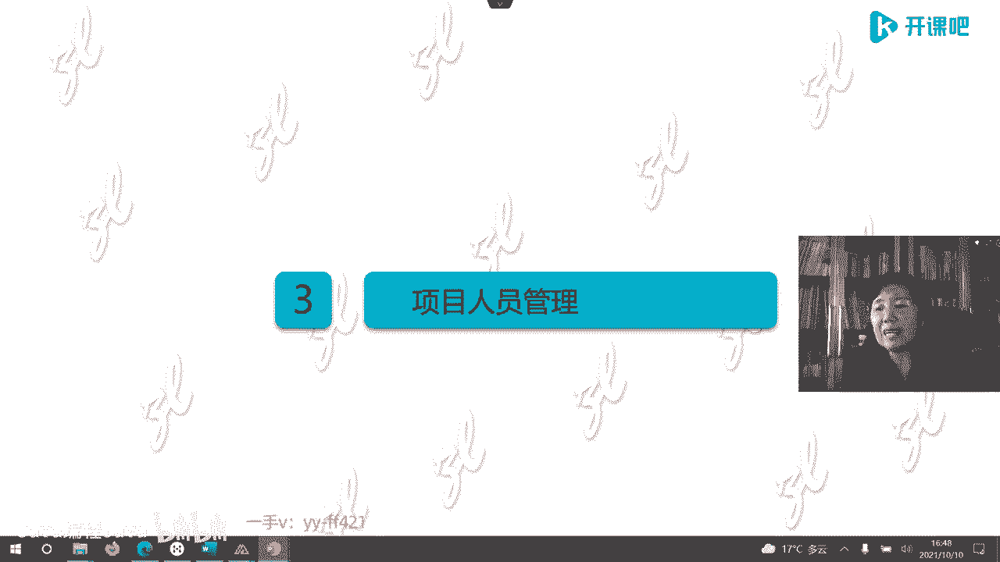

# -PMP认证4期 - P4：9-项目业务环境【itjc8.com】 - OA工作流 - BV1yY4y127aU

好的休息时间结束，我们继续上课啊，继续来学习，诶这个视频好像没有显示啊，然后我们再看一下，好的，咱们开始啊，开始上课啊，呃我们刚才休息的时候呢，听到了这个片子，这个地方我们继续啊，再向下啊。

再来再来学习这个内容啊，好的刚才我们说到了这个管理框架，那在这个管理框架里边有49个过程，这49个过程在我们第六版的p m b o k里，有了这样的讲解，有一些过程到底是哪些呢。

那我们后三天的时候学习的时候，一边学呢就会有一种感觉啊，它仅重复一次就只做一次，或者只在某些固定的地方做一次，第二种类型它是依照需要定期的会做，就是重复，也就这49个步骤，不是都走一遍，有的多做。

有的走一遍，还有的什么贯穿着始终，比如像监控啊等等啊，一直自始至终都贯穿的，到底哪些是这些过程啊，呃其实也并不是很固定的，为什么每个企业都有公司治理呃，都有组织治理的制度。

要按照公司的一些制度来进行管理啊，要让大家清楚，那么这些过程有这样的不同的类型啊，就有的做一次，有的不断重复，有的是根据需要啊，有固定的这样的做法啊，这是让大家了解的啊，另外这个片子再次跟大家说明。

过程和阶段是两回事，或者是两个维度，横坐标是项目阶段，因为是按照时间展开的，那管理过程在这个时间中，你看分布着这样的曲线，这些曲线并不是固定的，它只是示意图啊，比如说启动你也可以延长嗯。

收尾也可以拉过来，那么在某个项目的时间点，这五个管理过程组在交叠作用，以说不清楚的方式描，述不清楚的方式存在在现实中，是书里的原话嗯，在某一个时间点，这五大管理过程组都在共同的作用。

在共同的啊来执行来进行，这是这两个过程啊，他们的这两个维度啊，它们的区别，那很多学员就分不清过程和阶段，在做题的时候就乱，为什么，因为美国人出题的时候，有时候他自己也混。

他把这个管理过程组也用阶段来描述啊，管这阶段有时候也收成，过程有点乱啊，过程和阶段不一样，过程是这五个曲线上面的，这个阶段是以生命周期展开的，它两个维度不一样的维度，好的继续。

那么重量级的项目一定要分工明确，责任责任相对是清晰的，谁做什么，谁做什么，谁在项目中做什么，那么一般来说，项目团队都有哪些角色是怎么分工的呢，我们也会在下次的课人员里讲，我这里只是大致的说一下。

有这么一个角色，项目经理，他是领导项目的，还有职，还有一个叫管理团队，项目管理团队顾名思义管理团队专做管理，不做执行啊，不做操作，还有执行团队嗯，还有其他团队，不同团队的成员职责责任相对是明确的。

分工也是明确的，就是你该干什么，你干什么，各负其职，一个萝卜一个坑，是这样干事的啊，那这是重量级的项目好，那么这个项目做完了，怎么衡量这项目的绩效呢，那就有个绩效率的概念，主要讲的是在呃十大知识领域。

五个管理过程组，还有这种预测型生命周期的框架之下，以范围进度成本质量为核心，那个三角形那个三约束，再加上呢啊对于相关方的管理啊，对于资源的管理，对于风险的管理啊，还有什么呢，还有开发方法的选择。

我们到底选预测呢，选敏捷呢，迭代呢还选混合呀等等啊，主要这个绩效预是传统项目的，或者叫重量级的项目，它的管理呢主要集中在范围，进度，成本质量集中在这些领域啊，包括不确定性，怎么管呀等等啊。

好接下来我们就要学习跟重量级相对应的，轻量级项目管理，它就是不一样了，理念和思路不一样了，那么轻量级的项目管理，这个清亮也是针对文档而言的，这种项目管理中减掉包袱，大量的减掉，没必要的，文档不需要写的。

或者说用简单语言所描述的，让他轻装前进，轻量化，那么轻量级的项目是以流原则为导向的，刚才咱们重量级的项目是以流程为导向，以过程为导向，标准化的这个步骤为导向的，但是我们轻量级的项目就是以原则为导向的。

按照原则来办事儿，原则这个事儿就很灵活了，就是底线原则并不一定把所有的条款都写上啊，就是你做事管项目的底线，把几个主要的放在这儿，至于你选什么方法，那都可以做，也有美国人管这个叫可靠的流程。

前面我们说嗯，就是按流程，以流程为导向的，叫做重复的流程，固定的流程，那现在这个原则导向呢它叫可靠的流程，也就是不要给所有的这个管理者限制的那么死，让他们把握，只要能达到目标，克服障碍啊。

我们这个基本的原则有用什么方法都行，这就完全不一样了，这种项目所组成的团队成员呢叫做多能队员，一个成员什么都得会干，他不是说我就干这个岗位的，我责任很明确，我只干这个，所有的队员都对项目成功共同负责嗯。

项目管理的方式叫做蜂拥模式，蜂拥模式啊，这是第七版里提到的，第六版还没提到这种内容啊，我也给大家放进来了，那么原则我们就要说一下什么叫原则呢，较复杂的人类适应系统所生成的简单规则。

或者我们可以把它理解成底线，包括你比如说三观，那都叫原则，那么在这个原则的驱动之下，这个项目团队是一个高效团队，那么这样的团队里的领导他不会直接去管任务，直接去管那个项目的范围，进度成本。

他只需要管理原则，用原则是管理团队，团队在自发地进行自主的管理，都在原则的指导之下进行的管理，听起来挺理想的一个模式，这是轻量级的项目管理啊，好那么在第七版里说到了项目管理的原则，交付原则有12项。

一项叫做，啊管理工作这个叫像管家一样的管理，管家一样的管理者，那管家和职业经理人可不一样，大家想象一下中式纪念，这个管家是管理管家式服务来自于哪呢，来自于法国，从法国出的这个词。

可是法国人是看着英国皇家的那个管家，按照那个标准来说的服务的这个标准啊，那以后要求的这种团队的领导者，那不叫项目经理了，就是团队的领导者，他要像管家一样来进行管理，那管家跟职业经理人不一样的，在哪呢。

职业经理人是公司高层请过来，咱们是两方，你对赌的，你把我的绩效实现，我给你多少多少钱，职业经理人，但管家呢中世纪包括现代的啊，这个英国的这些管家，它跟主人都是融为一体的，它是主人最信赖的人员。

嗯他跟主人就跟一家人一样，甚至有的管家一生都不离开主人，家就在这个主人家生老病死的就像自家人一样，那么最主要的它体现在什么，对财务的管理上，也体现了对项目经理的价值要求，就是你要管理主人的财物。

还要做主人的私人秘书，第二个就是团队交付原则里面啊，有团队的团队的管理，第三个对相关方的管理，第四个对价值的生成，第五个需要系统思考，全面思考，第六个呢叫做领导力，领导力，第七个叫剪裁。

很多学员就不理解这个剪裁，一直在问什么叫剪裁，tilly rain啊，这个剪裁是什么东西啊，把标准化固定的东西啊，结合我自己的工作时间拿来用，我这样给你讲一个，举一个例子你就知道了。

中国革命的巨大成功源自于什么呀，把马列主义的理论跟中国革命实践相结合，产生的成功，它不是简单的复制，这个我贴过来用哦，叫做有继承，有发展的，有改良的来使用这些过程，这不是49个过程吗，我做项目的时候。

我不一定49个都用某些过程，我可能要根据我们自己的情况要有变化啊，这叫剪裁，这是剪裁的意思啊，嗯对量体裁衣剪裁，但是你剪裁呢要围绕着这些基本原则来进行剪，裁，你不是你都超出了。

这个人家总结的最佳实践也好啊，良好做法也好，你就非得不听你逆反，你自己搞一个，你自己搞一个，你可以融到这里来呀，如果被大多数人认可，你也可以作为一个标准的东西啊，标准化呢是固定的东西。

跟自己的实际情况进行需求，改良后使用这个学员啊，他总结的很好，就是这段话，这就叫剪裁，因为我后面专门有一个片子会讲，先讲讲剪裁啊，所以大家不要着急，所谓的品质就是质量，这是交付的得有这个原则。

面对复杂性的时候，那你应该有一些反应啊，这是交付原则，里面还有针对不确定的机会和威胁，要有管理，你做的这个项目管理应该有适应性，有弹性，还要有变更管理，其实我觉得这个交付产品的原则，这个利益太高了。

那这个都是写给总裁老板们的，差不多了啊，这是交付原则啊，标准化下做私人定制也可以这么理解，这么理解嗯，这个出入差距并不是很大啊，好的，现在这张图片就是蜂拥模式，刚才给大家看那个图片，各负其职。

一个萝卜一个坑，自己站在自己位上，大家看看什么叫蜂拥模式，整个团队的成员啊，像蜜蜂采蜜一样，呼啦都扑上去，那每个蜜蜂都得跪采蜜嗯，一起协作，一起来干事儿，对于团队成员的要求，本领要很强。

他既要懂得规划和管理，又要懂得执行和操作，就执行和操作也会做嗯，密集恐怖恐惧症啊，有人看这个东西，浑身都都起鸡皮疙瘩，这就是所谓的蜂拥模式，那我就赶快翻过去了啊，那么在轻量级的项目中，他的绩效率是什么。

将来怎么衡量轻量级项目的绩效呢，团队得管理的好，相关方得满意，生命期你得选择的合适，是适应迭代敏捷，基本上就我们不会用这个预测型的生命周期，来做轻量级项目的，因为它太沉重了，文档太多了，规划要做得好。

另外对于不确定性模糊应对的这个做法要好啊，就是叫引导指引或者叫导航嗯，另外交付你交付也得满足要求，第七个还是得有项目的一些绩效，第八个就是有具体的这个项目工作，你要符合项目的这个绩效。

你看这绩效又给了那么多，其实这个具体的项目工作里面也包括那个范围，进度成本啊，范围进度成本质量是具体的，项目工作里的这些指标，也就是说未来项目管理的发展趋势，它衡量项目的绩效的方面越来越多。

虽然这个条款的个数不一定比原来多，但是它的方面会越来越多，你将来通过这个项目团队管理的不好，那项目的绩效也不好，还有团队的绩效在里边啊，方方面面的嗯，啊这个别人成功的经验和成果啊，实际上就标准化了。

我们学的49个过程就是标准化的过程啊，就已经标准化了，那么在这个标准化的这个49个过程里，进行载剪裁，所以说这个通过标准化啊来剪裁，这个说法也是对的，因为所谓的别人的最佳实践良好做法。

那么它实际上就形成了这个现在的标准，这个标准就是总结出来的，是这样来的啊，好的，那么这个纪效玉呢用文字是这样写的，我画成这个图就画成了这样啊，呃跟前面的内容一样，我就不再说了啊。

那么一般来说轻量级的项目，就会用敏捷方法来管angel啊，这个敏捷方法呢是什么时候来的呢，怎么来的呢，啊，我们在最后一天的课里还会单独给大家讲敏捷，这个时候呢就快速带过去啊。

那么敏捷呃实际上也来自于五角大楼，也就是最开始他们也是这些军工企业，来用这个敏捷的方法来适应环境快速的变化，在之后啊，2001年有17位所谓轻量级的专家嗯，轻量级的方法学家，在犹他州的这个雪鸟雪鸟城啊。

开了一个敏捷的这个研讨会，这个会呢是被认为敏捷元年，就是敏捷建立的时间点，17个专家联名发布了一个声明，这个声明叫做敏捷价值观，什么价值观呢，右边，这些都是重量级的项目所遵循的方法。

左边是轻量级的项目所遵循的方法，所以他们给出了轻量级的这些内容要优先于啊，优先级要高于右边的这些内容，不是说右边重量级的这些内容不要考虑呃，而是它可以弱化，最重要的是左边的这个轻量级。

我们看一下每一条哈，个人之间的这种互动要比那个你过程倒来倒去，倒那个工具技术它要重要，在项目管理中，第二条叫可用的软件，因为这些人是搞软件工程的，这个价值观是从软件的角度诠释的嗯。

那么把它普及到其他的领域中，不是软件的这个领域里面啊，那叫可用的成果优于剩余复杂的文档，就是你写那么多复杂的，你还不赶紧把那软件拿出来，就这意思不是说那个文档不需要，而是可能需要简化，让它轻量级。

第三个跟客户协作，也就是你跟客户站在一头，比跟客户站在两头进行合同谈判要效果好，就像那个管家那个服务，它跟主人都是一家的了，替主人来考虑了嗯，那么这个管家这个服务刚才咱们没有说透，没说呃，完啊。

这个管家呢他不仅是跟主人一头的帮助主人，主人管财务，他要带团队，如果这家只有一个人，那不叫管家呃，她是保姆啊，这个管家呢他是需要带一个用人的团队的，这个用人团队里各种专业的都有，比如说司机啊。

这个保姆啊，厨师什么园，园艺师什么等等啊，还有什么清洁工，维修工等等，他带着一个复杂的各个专业的团队，这是这个管家他的做法，你看管家跟主人它都是一头的了，这不是好多事都好办吗，如果你要都是甲方乙方。

整天大家站在这个对立面，那个项目就难做了嗯，最后一个响应变更胜于遵循计划，我们定了这个计划呀，不改，老师按照这个计划走，有有变化了，再进行变更管理，你还不如随时响应这个变更，恰恰啊说的是。

这个敏捷或者适应型生命周期的项目，不允许变化，不允许变更，你把迭代的时间截短，比如2~4周，两周就是一个迭代，在这两周之内跟客户确定好的需求不能改，绝对不能改，一个字都不改，两周赶快把东西拿出来。

因为劳改劳改，你就拿不出东西了，那怎么响应变化，第二个迭代的时候，您再改，第三个迭代到一个新迭代的时候，你再改啊，这一个迭代之内不允许改，你别变更了，没有这个变更的事，因为你老变就拿不出成果了啊。

这是他的思路啊，所以这是关于这个怎么样拥抱变化啊，这是用敏捷的这个方法所代表的，所以刚这个敏捷的价值观有这四条，刚才咱们这个直播间里有学员问，敏捷是不是就快点拿东西出来，那你看看是光快吗啊。

这价值观有这四条内容，它也有快的意思，但它不是光快，代表的是敏捷，敏捷的项目管理有这样一些做法啊，这是敏捷的这个价值观啊，另外从领导者的角度，在全市这个价值观也也发布了这样这是六条。

六条内容跟前面差不多，只不过他是从管理者的这个角度啊，这是敏捷联盟专门有一个敏捷联盟啊，来发布的，这个敏捷联盟现在也被p m i收购了，并购了，并购在pmi旗下了，所以他们也会把一些敏捷的这个认证啊。

和这些内容啊，敏捷是指的灵活吗，是那四条是刚才前面这四条价值观的四条，个人互动，比过程工具比这个大型，这指的是就是要简化轻量级啊，第二个是简化轻量级，第一个是强调的是互动，第三个强调的是跟客户站在一头。

别站在队里面，第四个是响应变化，其实这个第四个才有灵活和高速度，快速的这个意思，还有其他几个意思啊，这敏捷的管理专门讲的是这些内容啊，好，那么领导者应该具有的这个轻量级项目，管理的价值观是这三条。

第一交付价值胜过满足约束，你天天考虑那个范围进度成本，你不如赶紧把那东西交出来，交的人家能用，这是第一条，第二条，领导团队胜过管理任务，一个高校的领导，他是管团队，他不是具体管任务的。

他把自己的人抓好呃，为什么命名为敏捷，这个问题问得好啊，那么我大概不到一个月不到一个月呢，这个时间啊，有一个这个17个轻量级敏捷专家之一啊，他的讲座我听了他的讲座，他说当时命名这个敏捷的时候。

大家都是有争议的，嗯有人会认为这个叫啊快捷呃，各种词啊，最后大家选了一个敏捷这个词，那就是他们当时命名这么选的这17个人啊，这么选的人，大家也在问他啊，你为什么命名管这个叫敏捷啊，你不叫快速反应啊。

你不叫针对这个不确定啊，啊你不是他们起了很多名字，最后选择了敏捷这个词啊，选择了angel这个词来作为给这个方法命名啊，就是当时给他这么起的名字，那么每一条我都解释了，那么这个第一条强调的是价值。

不再是那个指标或者叫目标，你光把范围进度满足了你价值，你最后实现了吗，达到了吗，嗯就是why为什么做这个事达到目的没有啊，他实现价值没有啊，那么实现价值是有步骤的，首先你这个项目先要确定价值。

然后把这个价值排序，价值越高的排在前面，优先级高的排在前面，先做先创造高价值的高附加值的这个工作，先这么做，嗯有一个叫hi史密斯啊，他写的这个书，hi史密斯也是那17个人之一嗯。

他写的这个书里有一句话我印象深刻，他说成功的公式很简单，今天交付，明天适应，你快速拿出来交付，不停的让这个产品具有适应性，去适应这个环境啊，那么这个地方我们说了，传统的项目或者说预测型生命周期的项目。

聚焦范围，进度成本约束，那么现在在这个敏捷的这个项目聚焦价值，而不是约束啊，这个大家去看一下啊，那么第二条叫做领导，团队胜过管理任务，一个高效的团队呀，他的领导者呀，要敏捷的领导者，他是对着团队去的。

他把团队抓好啊，这个非敏捷领导者的这个他是管任务，具体管范围多少，进度多少，那个质量和合适不合适啊，看这个的啊，所以这是一个重量级和轻量级的巨大区别，第三个适应变化胜过遵循计划，怎么适应的一个迭代。

您再变，别随便瞎编，一个迭代了，再变一个迭代了再变啊，在这个迭代之内不能变，有些人说，那这个迭代之内客户也提出变怎么办呢，我跟一个台湾的专家专门讨论过这个问题啊，台湾的许秀颖博士。

我们俩私人呢是非常好的朋友，但是交往呢也非常的谨慎小心啊，因为许秀颖也是一个女女老师，她比我还小小几岁啊，他是台湾国防大学的教授，专门教这个项目管理的，那我是干什么，他可能还不知道。

就是这种特别具体的这个身份，所以这种交流呢只停留在学术上，许秀影呢也是非常优秀的这个项目管理人士，在台湾的，那么我也跟他讨论过这个事，他说如果在一个迭代之内还变化，说明什么，说明你迭代的时间太长了。

你揭短不让它变，再揭短，如果一个星期还长，你每天迭代，每天迭代能不能做得到，能不能管理的好啊，这就是他说的，所以一般2~4周这个迭代是合适的，嗯嗯我再说一个说法不太合适啊，但是意思你要懂。

没等客户反应过来，我这个产品交出来，您就先收着，先给我钱，你让他老有时间琢磨，老变老变的没法做，这项目就老改变就没法做了，嗯相当于教嗯交付我的这个眼睛不是特别好啊。

v vip什么vp就是mvp最小的有价值单元拿出去，他就可以用12306网站，记住吗，第一个版本我现在可以买票了，你先用，然后后边我再给你细化，拿到这第一个版本那边的卖票赚钱了。

你也可以给我这个我就可以有收入了啊，这是这样讲的啊，说敏捷适合于比较小的小项目，有些大项目也用敏捷的方法，但是它是局部局部和整体的关系，大多数呢大家理解的对，就是用混合的比较多。

所以这一条强调的是适应适应变化，怎么适应，先截短了，不让它变，然后下一个迭代我再把变化都加进去，就不用再走这个变更的手续，而是让这个变更呢顺理成章，每一个迭代我都加变更进去啊。

项目经理就注重按计划办事儿啊，没有计划我就不做，我尽量跟计划没有出入，跟计划有出入怎么办，纠偏用的是这种思路，但是敏捷的领导者呢就承认变化不可避免，我给你考虑，你先别着急，我到该给你考虑的节点。

我给你考虑变化，它是这样的不同的思路啊，敏捷型的生命周期用的是敏捷方法，对的是这样的啊，好的，那么还有12条敏捷的原则，那么这12条敏捷的原则呢我们就不再说了，前面有交付原则，这个又是敏捷的原则。

跟那个价值观啊，它是配套起来来使用的，所有的这个12条原则，也是解释那四个价值观的，跟那个内容有类似的啊，我们在这只展示就不做解释了啊，好的继续，我们这个第一个呃大的标题做一个小的总结了。

我们前面说了啊，第一个啊叫做项目管理的基本概念，第二个叫做重量级的项目管理，那大量的输入输出标准化的啊，那么第三个我们说了，轻量级的项目管理又是不同的这个方法嗯，呃也有人认为说轻量级项目管理是后来的呃。

真不是，在美国，它几乎是同步的，只不过刚一开始大家用的都是重量级的办法，轻量级的用的少，它形成这个体系的时间要比啊预测性要晚一些，是因为那个时候的观念已经提出来了，但是总结这里面的东西啊。

因为他变化太大，不好总结，所以是后边才建立的，是这么这么做的啊，那么到第四个，我们就要把我们前面学的这个基本概念呀，和这个管理的项目，管理的本质和目的做一个小小的小结，这个小节我给写了六条。

第一个就是要科学管理项目，什么叫科学管理，讲规律，有规律的，什么是个性化管理，艺术的管理，那就是个性化的啊，总结出规律性的东西，这个叫科学管理啊，第二个需求为导向的思维，就是我们前面学过的。

另外要有大局的结构化的管理意识，第四个叫有效的集成资源，第五个叫高效应对复杂，第六个提高成功概率，这就是项目管理的本质，我管理的目的就是让他成功，但是是不是一管他就成功了呀，也不是，但你不管肯定不成功。

也就是我们通过项目管理这些方法，可以极大极大的提高管理的概率，但是他不是说百分之百或者说肯定就成功，它是能够提高成功概率的，久而久之，你建立了这种思维，你比别人成功的次数就多，你也不是不失败啊。

所以我们把这六条简单的总结出来，这些概念告诉了我们这些道理啊，这是这个第一大部分内容啊，我们现在把它说完了，第二大部分啊，第这个关于这个系的内容啊，我们再说一下，我们管理关注的是效率和效果。

我们常常说有效有效有效，这个效指的是两个方面，一个是效果，一个是效率，最好的是又有效率又有效果，但是在我们管理的时候，这个点拿的特别好，不容易，有的时候我先从效果出发，然后再追求效率。

有的时候我先追求快快了，以后再想办法好，那个各个项目呢，它的发展或者他切入点都是不一样的啊，这是关于效率和效果哈，预测型生命周期的项目就经过这么一个步骤，这个步骤的图形我在这也不多讲，其实前面也说过了。

需求导向选项立项，然后立了项，其实这前面这一部分都是公司该做的事儿，到了这儿是项目团队，项目经理带着大家做计划，做了计划实施，然后监控监控呢就是在不同的杀点。

或者叫milestone里程碑的时候不停的检查对应，如果这中间有了差异啊，有了变更就叫做进行例外的管理，这是预测型生命周期的一个大致思路，就是我刚开始讲的那个项目管理的思维，但是敏捷呢它就不一样了啊。

会有一些小的变化，敏捷你看我们画的这个线都是断的，不是连续的啊，它叫分型，敏捷的这个分型也可以被叫做敏捷生命期，但是不这么叫啊，因为生命期跟时间有关是连续的呀，您这个敏捷都是断的嗯，都是一个迭代。

一个迭代，在前面这个迭代的基础上来进行的工作啊，这是关于敏捷的一个解释，我们后面还会提到啊，现在先抛出来，让大家知道有这个观念啊，另外给大家看一下三角形，典型的铁三角的变化，这一开始是这样的。

我们前面画过范围，进度成本，我说了，这里面包括质量的，后边我都不再提了啊，那么这个是预测型生命周期的项目，范围也就是做的内容为切入点，我知道我要做多少内容，根据这个内容我去规划进度是多少，花多少钱。

是这么一个事儿，但是我们敏捷的项目，或者说适应型生命周期的项目不是这样，为什么，因为范围我不太清楚啊，所以我没有办法啊，从范围做入手点，我需要干嘛，规定进度，规定成本，比如说三个月之内花30万。

我可以做什么内容呢，出来它是这么一个变化啊，适应型的生命周期项目是先固定进度和成本，然后我再去找，在这个时间和成本下，我能做出哪些事来，那预测型不这样啊，这个是适应型，当然了。

适应型中的比较典型的敏捷是这么做的啊，左边这个是预测，那么这个敏捷又进一步向前发展了，到现在今天的这个三角形以价值为导向，如果没价值的事就别做，那不是那个美国人说傻瓜都知道不做嗯，然后这边呢突出质量。

因为你有质量才有价值啊，那么那个约束，比如说嗯包括范围呀，进度呀，成本呀，资源呀啊风险呀，我都写到这儿，约束这里边，他现在的三角形又变成这样，我一看我们中国航天没经历过。

前面我们现在我们直接就是这么做的，首先就是价值导向的，不过中国航天的价值主要讲的是社会价值，政治意义，就是直接就价值导向的范围，进度成本这个约束弱化这个东西什么呢，拿不计成本，高成本。

国家投入高的这个资源投入为代价，保证一个好的质量，获得一个价值，这是中国的大型的航天项目都是这么做的呀，请美国人转了一圈，总结完了做成了我们以前就这么做的东西，所以你说中国需要总结啊。

会有好的东西真的是很多，但是没有总结出来，也不去卖钱，你看他们整这一个东西啊，就去收钱卖钱去啊，是这么做的，那么其实这个美国有个电影，因为我不太记得啊，因为这个电影我没看过啊，是叫流浪地球。

是什么一个科幻电影对吧，因为什么到了一个什么什么救援，天崩地日的时候，不计成本不计代价啊，去花在这个救援上，那个电影里提出一个词叫饱和式救援，说这种方法特别好，哎呀其实他们跟中国学习学习不就是这个吗。

哦这是国产电影啊，那因为我这个电影没有看过，我也比较喜欢看电影啊，我也爱到电影院里坐着看电影，但是真的是没有时间，太招太紧张了啊，叫饱和救援，大家都听过吧，就饱和救援讲的就是这个啊。

不计成本代价保价值就这么做，因为你地球都快没了，你还讲什么价值啊，还讲什么这个成本呀，啊那这是关于这个电影里所提到的，其实我们的很多做法都这样，那我又把它变了一下，形，变成现在这样啊，就把这个预测型。

敏捷型都写到这个内容里面来了啊，好的，那么这一大部分我们就说完了，接下来呢第二大部分关于业务环境，就是在考试中占有8%的，这个比例的内容啊，我们把它展开讲一下啊，那么看好这个业务环境。

我们的标题啊内容也不少呢，但是呢它会比较简易，比较简洁啊，内部环境和外部环境，我们这么分，内部环境就涉及到第一环境对项目的影响，内部的组织结构，组织系统，组织的效益和价值，从这几个方面展开。

外部环境从这三个标题展开，一个项目管理的合规性，第二个外部环境对项目的影响，第三个商业分析啊，我们快速的把它走一遍，因为在考试占比的比例中啊，是8%的分值，所以他要求并不是很深。

有一些只是表面的了解就可以，我们也应该明白，像这种大的业务的环境，这个方面都是层级比较高的人，他所掌握的，但是要求我们的项目管理者从业人员，最好你也要有一个高的格局啊，好的我们开始第一项目的内部环境。

我们先看一下项目的这个内部环境，就环境啊对项目的影响，这个影响力指的是环境对项目的影响，它分为两个大的关键的概念，一个叫做事业环境因素，你听着就知道这个词比较虚，他是属于那种意识层面的。

或者叫文化层面的，或者叫企业哲学，嗯是这种虚的这些方面的叫视野环境因素，我们这么这么叫啊，那么它也分内部的外部的，比如说啊外部的政策，法律法规等等啊，这些要求这都叫事业环境因素。

比如说一个企业的内部的潜规则，这都属于啊内部的这个事业环境因素，比如还有某些行业也有潜规则，也有那些不同的风格，这都属于事业环境因素这个范畴的，但是当你那个啊做完了这个项目，所形成的积累的那些东西。

我们管它叫组织过程资产，他对项目是有直接影响的，它又分两个维度，一个是政策，程序，流程和要求制度，比如说你那个法律法规写在纸上啊，我这个手边的纸啊，拿起来不是特别方便啊，比如说你写在纸上。

你把这个制度政策，法律法规写在纸上，这就属于组织过程资产的内容，但你只说法律层面的，法规层面的这种大概念，它属于事业环境因素，你只要先落在纸上了，公司制定的这些规矩制度程序，那么它就被叫做组织过程资产。

在项目管理中积累和生成的那些内容，经验教训整总结梳理了以后啊，放到了组织知识库里，这就是环境对项目的影响，这个事业环境因素呢它就比较实际，他是看得见摸得着的，文档和制度，还有什么经验，呃经验教训。

的总结啊，所以这是第一个概念哈，那关于事业环境因素，组织过程资产我都说完了啊，那这个地方在组织过程，资产这个地方要提醒大家一下，组织过程资产库分两个子库，一个是流程程序库，这个是公司制定的。

你要遵守的啊，另外一个叫做知识库，这个知识库是我们在做项目过程中，积累和生成的，这里边又分我管这个叫五库一档，这里边有五个子库，有一个档案，以前以往的档案，我要提醒大家注意的是。

在组织知识库里有配置管理知识库，财务数据库，历史经验教训，知识库问题与切线处理，数据库，测量指标，数据库，我想问一问你，数据库和知识库的区别，配置管理中的配置是指的这个项目管理啊，要配置哪些管理项。

配置的管理项，在系统中配置的管理项啊，配置讲的是这个意思，我现在的问题是，为什么它分出了知识库和数据库，这考试的时候考我们学院一考就倒，你不懂啊，我现在就问问你，因为我知道哪个地方容易出错的，胡高鹏啊。

他说因为他解释的应该是数据库啊，他是数据产生的数据，只是单纯的数据知识是经过分析加工处理的，倩倩说得对，知识库是一个成功的经验，一个是理性，一个是感性啊，有学员大家都在议论。

我觉得咱们班的学员真的是很棒啊，很有智慧的，数据是实际的结果，知识是总结的，大家说的非常经典啊，我这么告诉大家，数据库是原始的数据记录，就是那个数据生成以后，你记录的知识是经过总结分析升华了以后。

留在这个库里边的啊，这个大家绝大多数同学说的对啊，所以他在用起来就不一样，在做选择选题的时候，你要注意啊，这是考试的一些细节啊，第二个我们说一下组织系统，这里讲的组织系统这个系统system。

那么它原意原来的叫什么罗马，什么拼音字母，这个系统它讲的是有机生命体，一讲组织系统好多人都不理解，哎呦有一次我去这个路过啊，周庄我去周庄中间路过一个博物馆，那个那个因为我是散的游客嘛。

就我自己因为我到上海出差，中间呢有那么一天的时间是我自己的啊，我就赶紧就做了一个这个，在人民广场坐一个大车，我就去了一趟这个哪儿啊，呃去了一趟周庄，在这路上呢，大家下车都要看这个生命馆。

我就挺不愿意去的，我说我不去，我在这车上坐着吧，那个人说你看你在车上坐着挺热的，也没意思，你还不下去看看，挺好的，后来我算了吧，也是我下去看看吧，结果我一看我都不想走了，周庄我都不想去了。

因为这是国家批准的唯一的一个呃民营机构的，就纯这个做生物研究的生命体的真实标本，它都真实标本，现在这个照片上展示，只是我的技术不大好，我照相的技术照的不太好啊，呃那个时候呢呃因为手机也不也不很好。

也不是像现在这样啊，那么这个这个里边这个左边啊，这张图呢是一个全身的，是真正的一个人体的标本，这个人体全身血管的分布，嗯不对吧，pmbok不是知识吗，呃这个pmbok也应该是知识啊。

我刚才讲的是知识库和数据库啊，跟你这个你说的这个pm folk，你把它理解成一个知识，它其中的十个知识领域是知识题，但是它整个的你不能认为pm box是一个知识啊，它也有管理的东西啊，心血管系系统。

这太难了，对大家可以看到有动脉，有静脉，有毛细血管，这个就是一个人的机体啊，全部的身体的血管分布，那么把人体的那个血液抽走，抽走以后灌进去的红颜色的染料，人的真正的血液不是全都是红色的。

因为它流出来氧氧化了，你看到是这样啊，因为我有的这个客户是生物医药公司，我见过啊，那人体的血液还有绿色的呢，你见过吗，黄色的啊，偏暗红的西瓜红，不是这种红色的嗯，那么这个红色呢是住进去。

让你看到人体的一个全身的系统，这样解释一个公司，把一个公司当成一个人体的系统来理解，我觉得大家就对了，什么呢，一个公司想管理好非常复杂，它涉及的要素好像你能点出这么多来，但是方方面面都得有要配合的合适。

这个企业才成功，你那个动脉静脉毛细血管粗细都是不一样的，你不能所有血管都那么粗啊，那就不是系统了，就不配套了嗯所以这个系统讲的是这个内容，那么这个系统有要素，有框架啊，有组织结构，也就是它的有架子呀。

他怎么把这个血管搭成了这种形式啊，他怎么不是别的形式啊，那是架构组织结构来决定的，系统就有原则，什么原则，系统是动态的，今天的身体健康不代表明天就健康，系统是可以优化的，就是系统是身体健康是可以改良的。

系统的组件，你这个某一个局部也是可以优化的，但是一般这两个东西不同时优化，因为它可能会有冲突啊，比如说你要想优化哪啊，你要需要吃糖，但是你又怕有糖尿病啊，他就就会有冲突的，就这么个意思啊，大家会理解。

那么系统它的管理也是呈非线性的，什么呢，也就是说你今天管一下，明天管一下，他就累加在一起就管得好，不一定的啊，它不是线性的这种做法啊，治理的框架包括这么多规矩，程序制度，各种关系步骤等等啊。

这是关于系统啊，我们就简单的拿这个图来说一下啊，再说到这个系统里边，说一个常驻的职能机构叫做pmo，项目管理办公室，项目管理办公室就在这儿呢啊，项目管理办公室它分成不同的类型，谁给分的呀。

公司的高层希望这个办公室是什么样，他才能是什么样，不是我们这个办公室的成员，我们想成为什么样，不是而是这个组织它的成熟度，项目管理成熟度来决定的，这个pmo它是什么角色嗯，第一种角色支持型。

他就是一个资料库资源库，给公司中众多的项目提供这个资源支持的，他不是直接给你配资源，比如说经验教训啊，知识库啊啊，p bo是基于项目的组织，是一个公司，pmo是这个公司里的一个职能机构啊。

你也可以说他比他大，这是第一种类型，第二种类型控制型的pmo的管理者，他具有这个控制程度的中等权限，下一个指令型的pmo直接对项目发号施令，很显然那这个公司是非常重视啊。

指令型的p b o是基于项目的组织，基于项目的公司，我们前面也讲到过啊，因为内容太多，可能大家也不太容易记啊，要注意一下，回去去看一看啊，再复习一下啊，组织结构这一篇讲组织结构它是因为什么啊。

来整理在一起的，这个我们就不重点说，我们重点说组织结构对项目的影响，那我们先要知道都有什么组织结构类型，第六版的p m b o k里给出了这么几种类型，有的类型呃，哈佛教教材里面都没有嗯。

哈佛的教材里都没有这个类型，它是一个比较新的东西，比如第一个简单型哈佛教材里就没有这种，这个也被称为系统型，也叫简单型啊，一般新创业的团队是这样的，那个老板经营者，你跟团队成员都直接管理他们。

你既直接参加项目，也即直接管理职员，也管理运营，甚至具体上手去做很多事，有一个学生他自己开了一个公司，大家都羡慕他，哎你当老板了都不错，那前些年他说不错啥呀，我又是司机啊，又是这个招聘的人，又是清洁工。

又得给大家送盒饭，晚上夜深人静的时候，我还得算账，当会计，我还得这个写代码，什么都得干，这个就是这种类型的，因为这个创业的团队刚一开始起步，他不可能有这么多的资源，用得起，也分工的那么细，因为规模也小。

人员也少，那么在这种组织结构，在公司中做项目的话，那你有没有专职的项目经理啊，哪有啊对吧，没有啊，那么这个项目经理的权限基本也没有，都是一个经营者说了算，也没有这种专职的人员，如果有管项目的人。

他也没什么资源可用，因为都是这个预算或者拿钱的人，都是这个经营者负责人，他说了算这个方块里边就是对项目的影响，他在项目中的地位啊，接下来给大家看一个比较传统的，常见的叫做职能型组织结构，职能型组织结构。

就是这个公司按照从最高到下边，按照不同的职能部门划分部门，比如说搞人力资源专业的叫人力资源部，搞研究的，在研发部，搞财务的，你在财务部，生产部，销售部等等啊，按照不同的专业分成的部门。

那么这种结构它的特点是什么呢，第一人员有归属感，因为如果我是人力资源部门的员工，我每天上班我就进那个门，那个位置就是我的，我往那一坐，这是我每天工作的地方，人是很有归属感的啊，这是这种特点啊。

第二个叫做呃有利于，专业，有利于专业技术的发展，因为我就是人力资源部门，那我不学财务，我也不学市场营销，我就把我的人力资源搞好，到周末放假，我就去学这个课程学啊，所以这个人因为我永久坐在这儿嘛。

所以我就想把我这个东西做做好啊，第三个资源，是专属的，我就属于人力资源部，我就归我人力资源部的职能经理，归我们的经理管，我对一个萝卜一个坑，我不听别人的，我也不管别的事，资源是专属的，专门属于他的。

不是共享的，不能共享，因为你让我人力资源到财务去算账去，我也不会呀，啊这是第三个特点，第四个特点，跨部门，沟通困难，只能在一个部门里沟通，比如说生产部的人想问一问我人力资源的事，对不起，你不能直接问我。

你问直接问我，我也不告诉你，因为我不知道你什么事儿，所以这个市场部的人啊，他要那他要问，那他要先汇报给他经理，他经理找人力资源经理，人力资源经理找员工，员工这样，那就这就这么来这么来沟通的效率很低啊。

也很不好办事儿，那么如果你想做成一个项目的话，这个项目涉及到各种职能，你如果都这么沟通的话，就麻烦了，就不好沟通了，所以就不容易把事儿办成功过去，我们的政府大家也都有体会啊，这个不光是中国。

以前美国也是这样啊，他所有的这个公司和社会，刚一开始都是典型的职能型，是发现问题以后才改革的啊，就各进各的衙门口，各管各的事儿是吧，那我们过去啊，以前我们办事就特别难，为什么，因为你找这个部门。

这个部门说你到公安局出证明，你又去了，公安局说你要到那儿，你拿一个什么证明，最后他们互相证明，最后谁也开不出来，因为他不是一起放在一起来沟通的，因为各个部门人家都有道理啊。

人家有自己的这个有自己的规矩啊，所以你按照这个办啊，嗯现在呢这样的事越来越减少了啊，越来越减少了，为什么，因为要想把事情办成，就不能用职能型的组织结构不容易办成，你比如说啊咱们国家的军队改革也是这样的。

一会儿我后边把几个讲完以后，咱们再说啊，军队改革有同学又提到了阿米巴了啊，好的，我们继续，啊刚才这个课件啊关上了啊，我再把它重新打开一下，因为有的时候一用这个笔呀，他们之间会有一个这个冲突啊。

所以这个课件就关掉了，还能关上，还不错呢啊有的时候它关可能都不太好，不太好关了，稍等一下啊，稍等一下，很多这个老板说的阿米巴啊，都偏激啊，这个一在这个系统里边，它就比较麻烦。

你看这个p p t在打开的时候，我先关了吧嗯，先关掉啊，再等一下，有些同学很困哈，我也很理解，咱们也课程也快结束了啊，后面的内容也不是很多了啊，好的啊，因为刚才这个笔可能点的不太合适了。

所以就会有一点这个问题啊，好的已经回来了啊，那么刚才我们看到了呃，职能型组织结构，我们学到这个职能型组织结构，待会我用笔的时候注意点啊，小心一点，那么接下来我们看项目型组织结构，项目型的组织结构。

它是一个一个的项目，直接对着老板，直接跟总经理汇报啊，做完了这一个项目以后，这个就解散，做完以后这个解解解散，做完以后解散，那么大家想一想它的特点是什么，第一个，跟职能型的对应在一起啊。

有的时候一用这个笔啊，跟职能型对应在一起，人没有归属感，你想一个项目做完了就解散了，我都没地儿去了，我哪来的归属感啊，一个项目一个团队啊，一个项目一个团队，这是第一个人没有归属感啊，第二个资源。

还是专属的，因为一个项目招一帮子人，一个项目招一帮子人，还是专属的啊，专属啊，还是专属的，他不是共享的，一个项目招一帮的人，第三个不利于，专业的发展，专业技术的发展啊，因为我都是临时观点，我现在干这个。

我下次我就不知道干什么了，大家想一想，那个建筑工地那个包工队，包工的那个那个包工头带领的队伍就是这样，干完这个我就算了就没了，所以你看那个员工他有没有职业素养，他不用他不用有职业素养。

我今天在这墨灰筛沙的，明天我没准就到那嗯，我就到那去去去打扫卫生去了，后天我没准我就当厨师去了，再后天我当那个快递小哥去了，所以他就没有这个专业发展的概念，因为它这个是项目型啊，不利于项目的发展。

但是在一个项目中，一个项目中啊，在同一个项目中，他的沟通是比较顺的，前提是同一项目，因为他跟别人也不需要跨部门沟通，为什么，因为我们干一个，我们就我我要一个人力资源，我招一个，我要一个技术。

招一个要一个开发，招一个，我都在这个里边啊，资源也是专属的嘛，都我这个项目管做完一个算一个算一个算一个，那么这种情况，这个项目经理那就是全全职啊，你就想那个工地上那个包工头，他权限肯定是大呀。

那个管理人员也是全职的，资源呢都是项目经理掌握的，就这么干的，但是你想人是非常重要的，项目的资源，如果人都没有这个归属感，你这以后怎么弄啊，也不行啊对吧，所以有人就想把这两种优点合在一起，把缺点都摒弃。

搞一个矩阵型横坐标，当然你纵坐标也一样啊，也可以，他是职能型，你看按职能型管纵坐标，按照项目行管，项目一项目二项目3a b c啊，然后我项目一项目a我需要一个市场的人员，我就招一个来啊。

我需要一个生产的人，我招一个研发，我不需要财务的，我需要一个a，我就我们就组成一个项目嗯，当这个项目做完了以后，你还回到你的位置上去，你回到你这儿，回到你这儿诶，你不这个归属感的问题就解决了吗。

咱不解散，还是这个道理，是这个原理叫矩阵型的组织结构，那实践证明，矩阵型的组织结构比较有利于做项目，因为他解决了跨部门沟通，当然了，他到各个部门去要人，你个谈判要人的时候就难了，他的资源呢就叫做共享的。

共享资源不是项目专有的，我用完以后，我把资源还回去啊，那么他也解决了，刚才我们前面说的那两种组织结构的问题，有一个学员提到说的对，这个叫，但是它又带来了什么新的问题，双重汇报。

你看这个角色既要跟自己的经理汇报工作，又要跟项目经理汇报工作，所以职责权限就好像有点模糊，不太清楚了，是双重汇报管理更难了，给管理带来了难度，也就是矩阵型的组织结构的，管理起来是非常不容易的。

是很难的啊，这个矩阵型组织结构又分三种，一种叫做呃平衡矩阵，一种叫强啊，写这边啊，强矩阵，一种叫弱矩阵，弱矩阵更加偏向职能型，强挤镇更加偏向项目型，他们的影响是这样，平衡呢，就各种情况都有。

大家可以看啊，那我这里画的三个道就是中间是平衡，左边是弱，右边是墙越强的矩阵，它项目经理的职权权限角色越强，越大越弱的这个矩阵它越偏向于职能性，越是职能经理说了算，就这么一个组织结构类型，矩阵型的。

啊矩阵型的就是个项目组，它是横向和纵向管理啊，不是就是个项目组，这是个项目组，做完了就散散到哪儿啊，您别到外面去，你还回到咱们公司，回到公司的职能部门去，他这么一个思路，但是又带来了双重汇报。

他沟通呢也更复杂，因为但是在同一个项目中，这个沟通项目经理的权限就稍微大了一些，嗯那我刚才提到军队改革，大家都知道中国以前的军队都是按兵种划分的，按兵种划分，比如陆海空啊，那么这样按兵种划分呢。

就是职能型的组织结构，我们现在是怎么划分的呀，现在是东部战区四大战区啊，啊东部战区西部战区都有战区的，为什么当战争打来的时候，你先找空军司令部调这个，再找这个，你协调的不好，这战争就打败了呀。

所以得有一个战区司令员，他是什么项目最高的项目经理，他可以调动所有的这个职能的这个陆海空，包括火箭军，包括这个后勤部队，信息部队，我都可以调动啊，来来打仗，以打赢为为结果，其实就是这么做的。

110报警火警的例子啊，你也可以这么理解啊，他集中在一个平台上来进行这个工作，那么矩阵形式最适合做项目管理的啊，这样的这个类型哈，哎呦他不会又在这捣乱吧，好下一个叫多部门，所谓多部门也叫事业步行嗯。

你看这个笔啊，写起来又又有延迟了啊，事业不行，事业不行，跟刚才那几阵型类似，只是啊他把那个项目组啊变成了产品中心，也就是项目组做完了，项目组就拆了，那我们这个产品部呢做完以后，产品部还在是一个永久部门。

不拆而已啊，又叫师爷步行，下一个叫虚拟形，苹果公司和一些创新公司，就是这样，核心设计团队是我们做，然后我通过契约关系跟一些比如做屏幕的，给我做芯片呢，给我这个做做这个供应商来建立这种联系啊。

通过这种企业关系来进行的，那这个预算到底谁管，可能各种情况都有，我们考虑的是这些组织结构对项目的影响啊，而不是光讨论这个组织结构，混合型，只要你有各种类型，就有混合型。

混合型呢就是把两个以上的类型合在一起，一般大型集团公司会有很混合型，一般小公司混合型用的少，但也不能说没有啊，这是混合型，还有一种专门就叫p m o型，这个公司是以项目为导向的。

他最高的这个管理的部门就叫做项目组合部门，然后往下就是各种项目管理办公室，所以项目管理办公室是三个p打头的pmo，可以是project，可以是program，也可以是pfolio，可以是项目组合办公室。

项目及管理办公室，项目管理办公室都可以啊，所以这个是三个p组成的pmo，在这个我们的书里专门提到，由我们pmo主要解决什么，它有三种类型的，一个是提供资源，一个是中等的控制，一个是强控制啊。

前面已经讲过类似的内容了，虎豹胡胡高鹏向前翻一下啊，他是管理公司多个项目的多个项目，提供资源支持，帮助是一个职能部门啊，就类似于你公司的项目管理部，研发部啊，你叫法不一样，它的作用是一样的，好的。

我们只简单的说一下，其实这都是常识，大家理解一下啊，什么呢，论文说变更怎么变，先要解冻，比如我们原来有一些固化的做法，就像那个厚厚的冰层一样，先给它化冻，化成冻了，变成水了，它才能流动呢。

我让它流动一动，由流动移动到我需要的形状，再干嘛，重新给它冻上，我要再变化，我就再重新解冻，比较早了，现在的变化都等不到重新动上，一直在变一直在变一直在变对吧，变化太快了，因为进入了变化的时代。

所以大家要理解组织，可以通过项目来进行啊，你看我们组织的结构现在是这样的，经过项目，通过项目，我们把这个将来的结构变成这样的结构啊，我们了解这方面的内容，因为在大纲里面有，我们就提一嘴啊。

另外我们讨论项目的效益和价值，这个图大家不太陌生，但是有点不一样啊，项目生命期注意看，从这儿开始，到这儿结束，你前面做的前期的工作，项目的效益和价值的讨论是在这个之前的工作，或者叫项目以外的工作。

为什么写在这儿呢，要求我们项目经理，项目管理者要了解这部分内容什么呢，刚一开始我就策划好，我先进行商业论证，做选项立项，商业论证里边一个主要的内容，就是项目的可行性，我到底选不选他。

我选了以后可行不可行，做这个分析的，在做这个可行性论证分析的时候，要分析效益和价值的实现，我怎么，假如说啊我们这个项目做完了以后要挣100万，我怎么才能挣到100万，我把成本控制到多大就能挣到100万。

这就叫效益管理计划，你要做这种综合的策划，按说前面这部分工作，外面的工作不归我管，是我们的职责范围之外的事，只不过现在新的项目管理发展趋势，需要我尽早地介入前面的工作，至少是了解前面的工作怎么做的啊。

所以这就叫项目的效益和价值管理，那我们不是直接去管理，是要参与了解，知道这东西怎么来的啊，这是对项目经理这个角色的要求，可研报告可行性分析没错啊，老师有没有可行性论证的模板分享，有的呀。

那个在实战课里有分享，因为我们现在进行的不是实战课啊，在实战课里都会分享这些模板的，现在我们讲的是这个针对考试的这个课程啊，希望大家都跟老师保持联系啊，以后来参加咱的实战课，为什么，因为实战课完了以后。

给你这个也会给大家一些做项目的机会啊，因为咱学完了拿这个证没用啊，啊这又收拐弯了啊，好五个标题讲完了，我们看一下，那么通过效益的这个计划的策划，要搞出商业文件，商业文件有两个，一个是商业论证。

商业论证就是那个可行性论证，有效性，可行性论证，一个是商这个效益管理计划，就是我怎么才能挣到这个项目应该挣的效益，他之前的策划之前先策划好啊，考虑到变化，那么效益管理计划要跟公司的目标，战略保持一致。

也应该有对效益负责的那个负责人，也有对效益测量的指标，还要假设一些风险，一些不确定，当这些发生的时候，我效益实现不了怎么办啊，这个我们只是一带而过就可以啊，这是关于效益的管理，因为这些效益的管理。

主要是公司中的职能部门和高层的人，进行管理的，项目经理干嘛，你要了解，你得知道公司是怎么管的，而且各个公司也不尽相同，也不一样，我就见到过很多项目经理，自己公司的运营管理一无所知，什么都不知道嗯。

还特别的固执的认为，他说我们公司没有质量管理体系，因为它是银行系统的，我说你中国国这个是五大银行，你肯定有iso体系，怎么会没有，我绝对没有说你回去去问吧，了解吗，了解完了，第二次上课跟我说，张老师。

我们确实有，那当然有啦，那你连这些东西都不知道，那咱在做项目的时候，这不两眼一抹黑吗，啊虽然具体的这个工作不需要你做，但是你要了解公司这东西怎么来的，怎么显得像怎么立得像什么。

这个呃出发点怎么可行不可行啊，这是关于教育管理计划哈，好的现在我们学外部环境，外部环境啊，有很多同学提了一些很多实际的问题啊，我们一会儿再看外部环境，我们不得不提到一个叫做乌卡的词。

中文翻译过来用的是这个啊，乌卡说现在这个时代已经进入了乌卡时代，乌卡就是把这几个英文单词啊，首字母给它写在这第一个啊，v u c av是什么，表示波动性总爱变异变性，第二个u是不确定。

第三个c就是复杂啊，d呃四个叫做模糊，现在这个时代已经进入这个时代了，人和人之间的关系，包括公司都是这种现象，你看以前的这个外部环境多简单，敌人的敌人就是朋友，现在是吗，不是的耶，非常的复杂模糊对吧。

你说你到底他是你的朋友还是你的敌人，你说不清楚，时代已经进入了这样的时代，就要求我们的项目要放到这些环境中，你也要理解这个时代要有相应的灵活性，叫导航不确定，或者叫什么柔性和和可变性。

我见到很多很多现代的年轻人，因为说是在家庭生活还是比较优越的，你就跟我们那个小的时候，年代的那个环境比起来，真的是幸福太多了，但是幸福太多了以后呢，心理承受力反而很低，嗯一到变道，这个不确定模糊了。

复杂了就开始抓狂，就不知道怎么办了，一定要冷静下来，要沉着应对，你看看咱们国家是怎么应对重大事务的，那就是你的榜样啊，在这种复杂环境中怎么进行，那我们的项目也会面临着这样的，复杂的外部环境。

特别是如果你的项目在跨境跟国外有关的话，那你这些东西更得理解啊，那么在外部环境里，我们主要讲这么几条，第一个项目管理的规划和管理的合规性，这个是全世界越来越重视的，美国人现在攻击中国。

就觉得我们不合规矩，我们什么弯道超车是吧，我们老搞这种结果，搞得我们现在比别人强大了，把别人气的要命，说的你是不按规矩竞争的，你不是真正的市场竞争的国家，咱们先不讨论啊。

这个东西有没有道理或者是不是真的，但是对人的这个合规性的要求，对公司的合规性要求越来越高，所以他们会抓住任何一个点，认为你不合规，给你捣乱，你没毛病，人家还挑你毛病，如果你真有毛病，那你不更麻烦吗。

你比如说把孟晚舟弄起来，也是挑你这个不合规啊，你的项目不合规啊等等啊，那在我们项目管理中，涉及到合规的知识领域有哪些呢，合同合约，特别是跨境的项目，你得搞明白合同的这个道理，得合规，你不合规。

你前一个不合规的，那么在一般有一定规模的公司中，都有法律顾问，他们会把着你这个合同的合规性，进行合规性审查，采购的时候有合规，比如说你不能拿回扣，这是最基本的呀啊等等。

那采购里面是特别容易有不合规性啊来产生的，人力资源管理的合规性，你要用符合啊劳动条件要求的人力资源，你不能找一个童工来干活，不能克扣人的工资啊，不能不给人家福利待遇，不能让人家超时加班，没加班啊。

他也是一个这个违法的呀，那你给钱就不违法了啊，当然那么在这个沟通领域也有合规性，比如说不该沟通的敏感信息，保密信息你弄出去了，那你也会被追究责任的，你看美国全球通缉啊，那个爆出了他的这个这个事件。

斯诺登啊，他这个事件全球通缉，他因为你沟通了不该沟通的事嗯，有的学员加班这个事儿点儿点儿点儿啊，咱们后面会提到加班的，在风险管理中要按照合规的方法管，在跟相关方打交道的时候要合规，监管要合规。

衡量项目要合规等等等等，奥原按规矩办事儿，就是这是第一项啊，996啊，还有外部环境，那政治经济文化社会啊，都对项目产生着各种各样的影响，你比如说突然来个疫情，那这也是社会这种这种情况。

那你对你的项目有没有影响，肯定有啊，对你的收入都是有巨大影响的，呃所以我们要理解我们在做项目的时候，还有这么多这些环境，包括法律政治的这种约束都是有的啊，经济环境的约束等等啊，有学员加银说。

pet啊做的外部环境的这个分析p政治啊，political e环境，s社会t是技术这些方方面面的这个影响啊，都在都在这个版面上啊，也就是我们做一个项目经理，我们要理解我们不是独善其身。

特别超多的跟谁都没关系的，啥事都不用管的，两耳不用不闻窗外事的，不是这样的，嗯是都对有影响的，第三个标题，我们就说一下关于商业分析，商业分析就是选项目的时候呢，你的业务分析嘛。

首先你要评估这个是不是个机会，然后进行这个商业分析的规划，专门有这个角色叫商业分析师，我们在中国呢有很多软件公司也管这个叫，当然不，他的职责不完全一样，叫售前那个授权呢。

他对商业上的这个评估可能会差一点，他对这个专业的这个评估会多一些，但是有这么一个角色啊，主要干这个的就类似，但不完全一样，其实商业分析也应该是，商业分析师公司做的这个事儿，顾问做的这个事。

但是要要我们项目经理干嘛，了解他们怎么做分析的，对需求进行评估，然后要规划这个商业规划，然后要考虑这个需求书，我应该翻到多少页呀，现在你回家去看p m b k这个书啊，是前三章里的一部分内容，不是全部。

因为前三章，第一章，第二章，第三章里面的人员管理，我都单独提出来了，还没有讲好，在第二天会讲所有的人员管理，还有很多内容书上没有，比如说商业分析书上就没有啊，因为这是新的考试大纲。

告诉我们要考这个商业分析，我得给你这个，要不然这里有8%呀，有8%的分数呢，在这个书里面没有这个内容啊，还有跟踪监督和解决方案的评价，所以你以这个课件为大纲，然后我们的书呢是要看到前三章。

就基本概念商业环境这个地方啊，书里面有一部分并不全有啊，好的，今天到这个标志，我们的课程就结束了，现在我们课节的时候要回顾一下，今天我们学习了什么，重要的三个方面的内容，第一项目管理思维是一种什么思维。

我说大家就往前倒啊，就回顾，其实大家都能说得出来了啊，第二个大部分对于项目基本概念的解读，有32个方面，另外解读呢我们又从重量级的项目管理，轻量级的项目管理，最后还做了一个项目管理的本质啊。

和目的这个小结，另外第三部分我们说了一些业务环境，主要说业务和商业环境对我们做项目的影响，从两个大的维度，一个是内部环境，内部我们公司的组织结构啊，组织结构的这些类型啊，组织系统啊。

从这些方面来考虑的啊，外部环境从合规性啊，外部环境的影响因素啊，还有那些啊叫做商业分析，所谓的商业分析就是我们选这个项目的时候，应该考虑哪些呀，啊又回到那个可行性分析，商业分析这个角度来了啊。

这是我们今天学习的主要内容，我们学习完了以后过一过脑子啊来学习一下啊，也有同学来总结结构化发散式团队共治啊，这个是什么学习方法，也就是我们在讲那个呃呃第三个啊，学习方法提到了这个学习方法我都给放过去了。

老师又讲到这儿啊，ppt资料能发放吗，联系自己的班班老师，大家都有方法，因为据我所知应该是已经发放了，嗯应该已经发了啊，应该大家都应该有的，你去找一下自己的班主任老师，找同学去问一下啊，都是有的啊。

还有学员学到了plan to do啊，学了这些内容啊，网站可以下载讲义，发过了那个大家自己去啊，去询问一下班班老师啊，今天我们的主要课程就到这里结束了，告一个段落，内容还是蛮多蛮多的啊。

一些细节好多概念没错，有的学员说脑子有点乱，是这样，因为短时间内灌进来大量的东西是有点乱，我们要复习啊，要整理一下啊，再把这个课件好好看一下，根据这个课件再去看这个书，把这个书好好理一下啊。

才能有概念啊，好的，我再把今天我们所讲的内容啊，这个大纲再给大家展示一下，就是我们收回的，这是我们今天讲的内容，下一节课，下一节课呢我们就从第三人员管理那一天，我们就讲这一个标题啊。

来进行下一节课的时间，要按照班班老师的安排，不要错过了啊，也不要迟到，还是要做好准备，以饱满的这种呃这个身体健康的这个状态啊，来参加我们的课程，要不然很累啊，休息不好，很累很困，效果就差一些啊。

今天的课就到这里结束了，也感谢所有的学员们，我们一起度过了一个还比较愉快的周末啊，啊那我们下次课再见。

