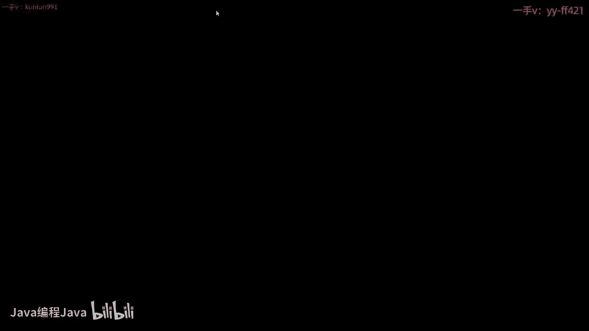
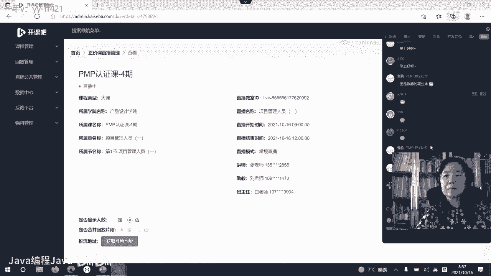
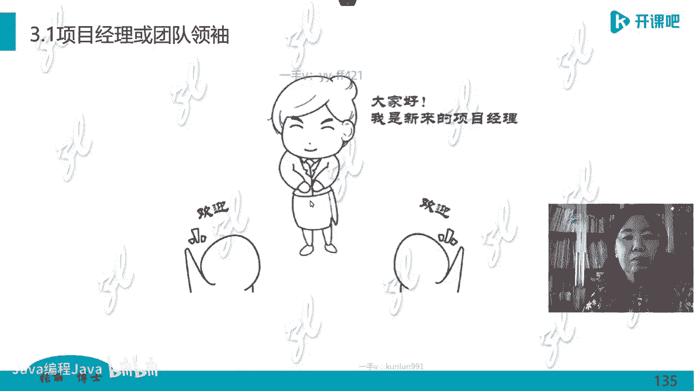
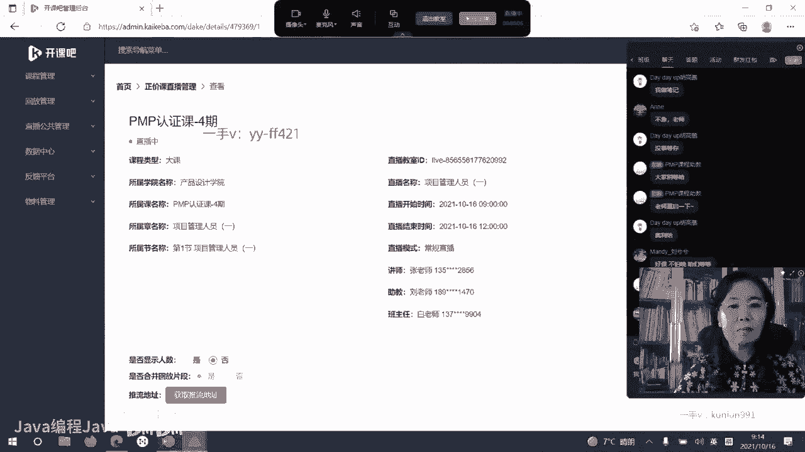
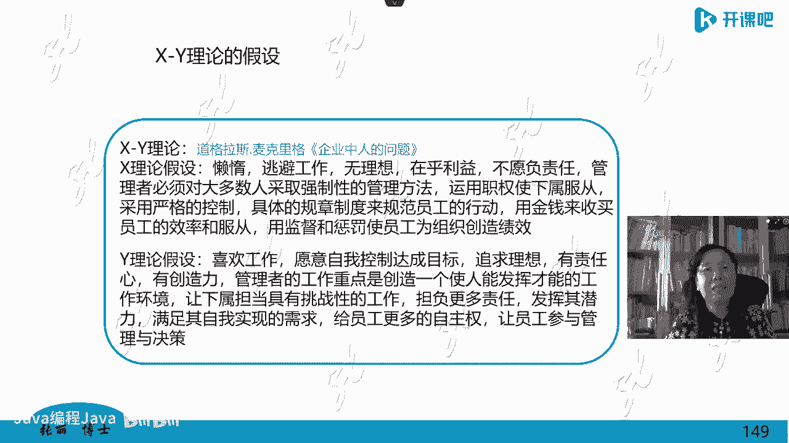

# -PMP认证4期 - P5：10-项目管理人员（一）【itjc8.com】 - OA工作流 - BV1yY4y127aU

。

学员们周末好，我们的课程马上就要开始了。按照惯例，我们还首先检查一下自己的设备，学习环境，做一下学习前的准备工作。如果都做好准备了。那么签到的同时，设备检查完好的同时，在这个直播间的屏幕上刷一个一字。

老师就知道有多少学员已经做好了准备。啊，如果你那个地方有问题的话，你刷个零或者说一下啊，自己调整一下。因为绝大多数学员学员呢这个设备状态啊都是良好的。啊，那可能我们都是自己这个地方啊有什么问题。

所以大家要调整一下自己手里的呃这个设备状况。做好上课前的准备，笔记本啊，然后这个笔呀啊做笔记的啊。好的，绝大多数学员都已经准备好了啊，还有不到2分钟的时间，我们就要开始上课了。啊。

课前呢我也看到也有学生在议论啊，因为这个周末呢两个周末连着连续啊都有课程，可能预习起来就有点啊着急了。但是别着急啊，咱们慢慢来。因为咱们这个学习的内容呢是呃循序渐进的啊，一个是课堂上好好听一下啊。

每天把每天学的东西呢，下课以后自己在回顾一下啊，然后第二天的这个课程，我们再认真的去听啊。好的啊，绝大多数学员都已经刷屏了啊，现在还有一分钟的时间就要开课了。那我们稍微回顾一下啊。

第一节课就是第一天的课，我们学习了哪些东西，主要学习的是项目管理概述和业务环境这两个内容，现在展示在版面上的是啊概述，项目管理概述的内容啊，我们先回顾一下。

主要呢我们学习了一点4那个关于项目管理的解读啊，前面那些我就不再说了啊，项目管理的那些基本的概念，大概有32个之多啊，一些最基本的术语和词汇。另外我们介绍了一下按照生命期理论，项目管理的生命期理论啊。

然后我们把项目呢按照不同的生命期分成了这种重量级的项目或者叫预测型生命周期的项目的管理。和轻量级的项目啊，叫做适应型生命周期的项目管理。我们把它大致的概要做了介绍啊，最后做了一个小节。

就是项目管理到底是干什么的，本质啊。那这是我们上次课的回顾。好的，现在9点钟到了啊，我们正式开始上课了。欢迎大家来到开课吧。继续我们的PMP考前的培训学习。那我们今天呢就要进行第二天的课程。

我们刚才做了一个小回顾啊，第一天课程，我们学习了项目管理的概述和项目的业务环境啊，也叫商业环境。它分内部环境，外部环境啊，这是咱们第一天课程学习的东西啊。那我们第二天课程呢。

就从第三个标题目录的第三个标题叫项目人员管理来学习。因为项目人员管理啊是项目经理或者管理者一个非常重要的软技能。它涉及的内容方方面面也比较多。所以我们准备花一整天的时间来学习项目人员管理啊。

上午下午都学习项目人。😊，人员管理啊。好的，我们看一下这一部分，我们准备分三个大的模块来学习，这就叫结构化。你先把握住结构。第一个模块学习项目管理者啊，作为一个项目的小领袖，一个团队的领袖。

你需要有哪些对自身的角色认知和这个角色应该有的职责啊一共分5个标题啊，第二大部分除了对自己的管理自己的角色认知和职责以外，还有怎么去建立一支项目管理团队，建立了以后去怎么管理项目管理团队啊。

这个分三个部分来学习。最后一个部分，除了你管理团队以外，还有啊这个项目稍微外围一些的各个相关方打交道的相关方怎么去管理啊，怎么去打交道。那么这个分两。标题来进行讲解啊，内容还是不少的。

因为在考试中越来越涉及到软技能的题目啊，人员考试的题目总体已经占到了42%，就将近一半了，这个题目都跟人员管理有关啊，所以它涉及的内容会比较多。那我们今天按照这三个模块来学习啊。在学习人员管理之前。

先给大家看一看啊，这世界上有名的一些大师对人力资源管理呢？有一些什么样的观点啊，给大家展示一下。那么我们先看三个人，可能这三个人呢有熟悉的，有不太熟悉的啊。那么我没有给大家那些比较经典的，比如说呃这个。

人力资源管理的支付呃，专门。进行人力资源管理的这个人啊，那我没有拿他的观点。因为关于人力资源管理呢，是由他来研究出来的。他是一个澳大利亚裔的啊，这个美国人，他是澳大利亚的这个国籍。

以前啊后来呢他加入了美国籍叫啊梅奥啊梅奥这个人呢他是人力资源管理之父，有很多论点，他觉得把人力资源当成资源，然后怎么来调动他的能动性，有这样的观点，我没用他的这个观点啊，那我们先看这三个人。

一个是爱德华代名，可能这个人呢大家熟悉他是发明PDC循环啊，那个代名环的人。这个代名呢他说了这么一句话啊，他说如果你做管理者只信数据，只看数，不相信人的话，那你除非你是神。啊，只信数据不信人。

除非你是全能神。有这个话，这话什么意思呢？西方管理是科学管理，科学管理就是用数据说话，就是找规律，找这些东西。之前我们刚刚开始，我们东方人、中国人，包括日本人，韩国人开始学习美国，因为富裕他发达了嘛？

他就有他这个值得学的地方，学他们就发现哎他们是科学管理的，科学管理怎么怎么样，我们就把这个科学管理，特别是呃对人的这种忽略，放到第二位的这种管理呢。呃，就是奉为一个神明，就觉得哎这样好。

科学管理怎么怎么好啊，可是西方人他在反思反思什么呢？你光信这些数据也不行。因为数据是会撒谎的。而是会说瞎话的，为了达到管理者的一些目的，他可以会造一些数据，或者按照自己的意愿去解读一些数据。

其实这个数据的背后都是人啊，那么最近。有一部大片非常火，我还没有时间看啊，我已经有这个视频了，但我还没有时间看啊，大家可能都知道已经突破了50亿票房大关，让西方人，美国人啊，韩国人都心里酸酸的啊。

叫长津湖，就有这么一个啊长津湖是典型的以少对多，以弱对强的一个战役啊，那中国志愿军有什么呀？那当时就美国人拍的纪录片啊，就个长津湖，他们俘虏的啊人志愿军满脚啊，就光着脚都是大冰坨子，就没有东西吃。

就这样的人，但长津湖战役以中国人民志愿军胜利为结果，这就是你光相信装备，你光相信数据，你光相信流程，他一样打不了胜仗啊，这个背后都是谁啊，人起的作用。

这就是当年毛泽东领导的这个中国人民啊开始建设国家进行国家管理的时候。他是把人放在第一位的那这个思想不是毛泽东的发明，是毛泽东继承了咱们祖先的管理的思想。咱们的老祖先啊，从历史过来上千年前啊。

中国式的管理，就是让人自觉叫做结具之道啊，那个节都是繁体字的节啊，都字典里都不好找那个结具之道，那个拮具之道讲的是啊就是人发自内心的，我服了这个事儿，有责任心去做事儿的。

但是西方人就觉得这怎么把握人的人性都是有弱点的对吧？那你要靠人来做就不行，所以西方就讲究用制度管理，用流程管理，用装备管理，用关工具管理，然后来获得胜利。呃，那东方式的管理呢。

讲究是人发挥自己最大的主观能动性。那么这两个切入点都是可行的，或者说你都不能强调哪个更好，哪个不好。由于我们国家落后嘛，所以我们刚开始学西方的时候就认为好像他们什么东西都好，我们自己当然什么东西都不好。

那种自信就没有了。其实不是当你学管理学到一定程度，你就发现从人切入进行管理，从制度切入进行管理，都有他各自的道理，也有他的适应性，不能用好和坏来评论啊。

这是我说的第一个关于这个科学管理和对人的管理的问题。那么你看西方人在反思对人的管理，在PMI的这个体系中，极大的加大了对人管理的考核的力度，他们也在转头我们在学习科学管理数据管理制度管理，对吧？

那么他们在开始反过头来干嘛，觉得哎呀这东方的这个人的这个管理挺重要，但他不愿意认错呀，他不愿意认自己是跟别人学的，他又发明一个东西，好像我们是在跟他学，真不是这样的啊，所以大家心里要有数啊。😊。

第二句话是一个呃加拿大的人叫明茨伯格。加拿大的明词伯格研究组织管理人力资源管理也特别的有深度。只不过加拿大的管理学在全球的推广，而是就是力度不够，但是明茨伯格在管理界还是非常有名的一个人啊。

他写的叫有效的组织那个书写的非常的好，但是有一定的难度啊，但是他就说了一句话，人力资源，他是一个活物，你怎么能当资源管理呢？怎么能跟那个死的东西资源放在一起管理呢？他有这句话说我是人才不是人力资源。啊。

人就是人，你不能当资源管，我只是说明斯伯格，他有这个观点是这么说的。但是在我们考试里啊，人力资源还属于资源管理的范畴啊，我们就要了解一下世界上的这些大师们，他们的一些想法啊，因为人是活的啊。

不好管的那下面我们再看啊一个这个一个这个网站，一个公司特别著名的创始人，他怎么说呢？他说啊如果我们做。做事情的话，科学管理的话，科学管理你知道就是精细化的呀，把那个规则弄得很复杂。

每一步你抬左脚还是抬右脚都给你规定好啊。你一个执行者就是被管理者，你就是傻瓜就行了。那个说明书上写的，你抬左脚，你就抬左脚，你不用管他为什么抬多高，你就抬多高啊。你只要这样做了，我的管理就实现了。

他是这个观点啊，但是你看这个创始人，他自己的管理实践，他怎么说的呢？😡，如果你定的规则，不是那种特别复杂的，面面俱到的是简单规则，简单的规则反而会为复杂的、充满智慧的条件创造行为呃，这个充满智慧的行为。

创造条件。什么意思呢？他是说你管理的原则简单一些，让人发挥出自己的主观能动性。也就是你给他划归一个底线，底线有了，你剩下多少人自己去发挥。但是如果你的规则特别复杂，就像我刚才说的啊。

你把这个管理对象都当成傻瓜傻瓜管理的话，那个复杂的规则你就可以让被管理对象什么呀？不加思索，不是你定的吗？你让我动左脚抬10公分，我就这么多，我不管你为什么是吧？就会导致什么呀？被管理者不加思索。

做一些很多愚蠢的举动，反正你让我这么做，我就这么做，把那个压力全都传递给管理者身上，我不管，因为这是你弄的。😡，啊，所以我就看你看现在主流的这个西方人的观点在反思什么？对人的管理，给人划定一个底线啊。

给人一个最基本的东西，剩下你要人来发挥他自己的主观能动性。也就是我们的这个直播间有学员说的复杂的事情，你简单化。啊，但复杂事情简单化简单化了，是不是就真简单了，不是他就更加依赖人的智慧了。

那如果你真的是一个制度管理，一个精细化管理，它是啊不要用人的这个管理来体现啊，都是用制度来管理的那我们反思一下啊，西方人正在扭头啊，扭头干嘛呢？让人多发挥作用。

我们现在呢在学习西方的那些科学管理都是有道理的啊。好，继续我们接着向下开始啊。那第一个模块我们要学习这个角色，项目经理或者叫做团队领袖。为什么写两个角色呢？在重量级的项目中，一般是这样降的啊。

叫项目经理这个角色啊。呃，这个今天这个笔记。画到就画不了了啊。还有的时候这个鼻动啊就会死机。刚才不知道哪个地方弄了啊，它就。死机了。嗯，所以我可能还需要调整一下啊，就是咱们用笔做笔记的话。

可能就会出现这个问题。所以大家稍等个2分钟啊，我把这个因为这个东西啊做笔记好，大家做笔记啊，我把这个先这个那个重启。

好的，不好意思啊，因为这个就是设备的原因，它是因为咱们要做笔记啊，所以大家还是呼吁要做笔记的。如果我不写笔记，这样的话对大家是不负责任的。可是有的时候这个设备我用笔的时候稍微小心一些啊。

他有的时候不知道他这个系统有什么冲突的话，就会出现这种情况啊，呃，再稍微做一下测试，没有问题吧。有没有问题设备，大家可以听到吗？听到就刷几个一给我看看啊。在直播间里刷个一，我就知道大家这个状况啊。

好的好的，我们现在正式开始啊。那我们看一下，现在呢我们给大家说的是两个角色，一个项目经理，一个团队领袖。那么这两个角色就对应的是重量级项目管理团队和轻量级。那这个项目经理呢是在重量级团队。啊。

这个是在轻量级团队。啊，他的称呼也就是在适应型迭代敏捷的团队里，一般没有管理经呃，也没有项目经理这个角色，他就是一个团队的主心股，是一个核心的领袖，是这样的人物啊。

所以我们要知道为什么老师这么写项目经理或团队领袖，他在不同的团队呢，就不同的叫法。那在混合型的结构中，在混合型的生命周期的项目中，那都有这么叫的，也可能叫项目经理，也可能叫领袖啊，那这是不一样的。好的。

我们来先认识一下这个角色。先看有效的管理者和成功的管理者。因为你在管理这个团队啊，有这么两个说法，左边的这幅结构图是有效的管理者，有效的管理者他的定义是，我把项目目标实现了范围进度成本啊，质量都达到。

然后呢，我自己的下属。相关方都比较满意，客户也比较满意。哎，我把这个事儿就做成了，这个叫有效的管理者。但是如果想做一个成功的管理者，就是在组织中，他的级别一直在进步，一直在提升。

这样的角色呢叫成功的管理者，他不仅能够把项目的目标达成，还能什么呀？还能就是自己不断的进步位置不断的高升，就是这种叫做成功的管理者啊。那我们看一下这两幅结构图，右侧成功的管理者。

网络联系这部分在他的管理中占了更大的部分，比左边更大啊。那么左边有沟通，网络联系。什么叫网络联系呢？实际上就是人际。人际关系。就是软技能啊，成功的管理者反而在这个方面要求的更多。在这种传统的项目管理中。

这是管事儿的啊。传统的项目管理中直接管人的，直接管事儿的，他花的精力会比较少啊，沟通也是一大块，把这个都放在一起啊，啊，那就是他最大的本领是来做这个的那比左边的这个有效的管理者这一部分还要大。

说明什么呢？作为一个成功的管理者最重要的是软技能。他的软技能非常的重要就是人际技能啊，这是要跟大家说明的。那么在这个地方也给大家一个说法，作为一个这种角色，项目经理或者团队领袖，在他自己的管理实践中。

项目管理中要拿出大于90%以上的时间和精力干嘛进行人际管理或者叫沟通。おん？其实人际管理还是沟通啊，还是广义的，还是在进行沟通啊，只不过是特别定位的啊，就人际的这种管理沟通的目的是达到人际的这种关系。

要有一个良好的或者合适的关系啊，所以一个项目经理，他主要的角色，990以上是在做沟通协调，而不是直接去管那个事儿，直接去写那个代码啊，直接去做一些技术啊，他不是这么做的啊。

但前提是成功的管理者的前提是硬技能，还是说只要他软技能可以就好啊？这个嗯哼啊呃如果你是一个职业的项目经理，就是你专你的岗位就专门做项目经理，软技能要高于硬技能。为什么因为你有了这个人际关系，网络关系。

你可以用一个工具叫专家判断你动用专家来使用硬技能啊。但是你要有大致的了解，你不能说这技术你都是外行，一点都不懂。你搞软件开发的这软件都不知道是怎么做出来的，呃，都不知道怎么弄。你是搞汽车的。

汽车四个轮的，你都不清楚，那你是没法管的啊，一定的专业技术或者硬技能啊，也需要这里说的。😡，硬技能主要指的是管理硬技能。当然也包括专业技术啊，专业技术要有基本的了解就足够了。那你会动用专家。

你会把扒了那个专家扒了人让他来给你做，这就是你的本领了。别人为什么能给你做呢？所以这个软技能重要。在这里边啊，这是给大家回答现实现啊回答的一个问题啊。好，继续我们看职责角色。作为项目经理。

项目经理是组织派你，组织委托你实现项目目标的那个人。就是你的职责就是要对项目的结果负责，要达到目标，是这么一个个人，对你的要求非挺高的啊，叫做管理知识，专业技术知识理解能力和经验，还有对行业发展的关注。

什么叫对行业发展的关注呢？那么专门指的在这里，专门指的啊，是项目管理这个行业它怎么发展。你看大家现在在这儿学习啊，那么未来我们的这个。体系都不断在升级。如果你是一个专门的项目经理，你要跟踪这个升级。

那现在行业里边都怎么发展了，国际的标准都是国家的标准都是做什么呀？啊，刚才有学员说了呃，刘备就是啥也没什么。刘备说了论什么什么，我不及谁，论什么什么，我不及谁论什么什么，我不及谁，但这些人都帮我干。

他说的特别经典，就是一个管理者啊，应该做的事情啊，就是他能够哎收服一些这个专业人士来帮他干，但是他也不能什么都不懂啊，你是一个糊涂虫也不行，你也得有一个高度啊，那技术岗位的一般的专业的技术知识。

也需要了解这个技术既指的是管理技术，项目管理的技术，也指的是你专业的技术。你搞软件工程，你软件工程的专业技术说什么呢？啊，刚才对我说错了啊，那是刘邦说的啊，刘邦说我不及谁不及谁的这个刘邦呃。

刘备也也有这样的这个呃这个典故啊，也有这样的说法，他把一些这个名将都拢在他之下来做这个事儿。那刘邦都做了天下成了皇帝啊，他一些这个专业的人都在他这儿。那刘邦更是一个小混混。

但是你看他玩人的手段特别的高明啊，先利用这些那将来他成事了以后，他会去打压这些人啊，就是他有这些这些手段。但是我们要做的不是学习那个历史上的那些糟粕啊，那些这些这些让我们不耻的这样的做法。

而是来学习他们这种管理的呃想法啊，接着我们再看沟通沟通说的是你这个角色主要充当发起人呀，团队呀，其他相关方的什么呀，沟通协调者啊，来做这种信息的荣。何传递协调的目的是为了搞顺大家，大家顺了吗？

那就实现目标的这个劲儿就一致了，拧成一股绳儿了。那目标实现就不远了。如果这个团队都是散的一盘散沙，没有人把他们凝聚在一起，那是打不成仗的。再说中国这个打仗，就别说这个志愿军啊，这个抗美援朝。

他说这个解放战争，那中国人呢就是咱们毛泽东的部队呢那装备那跟蒋介石没法比啊，那蒋介石那些将军们一身的将校泥啊，都是从川的到这个人家从知识水平，那一手都是黄埔军校毕业的啊。

中国的那个解放军的兵都是由大字不识一个，哎，但是道理都讲的特别通，是吧？所以说你看他们是怎么成的。那就是这个管理者他非常的了不起，他做了一个信息传递的沟通者，这个时候也可以给大家讲一个小故事啊。😡。

那么在解放战争的时候呃，一个部队他全歼了一个这个国民党的部队，抓住了这国民党的这个集团军的啊，这司令员，抓住他了。这司令员非常非常的不服气啊，就觉得我们怎么能打不过你呢？特别不服气，他就想不通。

这个不吃不喝在这抗拒啊，就人家这个把他这做俘虏，优待他，因为他地位很高啊啊，他不吃不喝他就绝食啊，你为什么这样做呀，你不能这个因为咱们这个解放军是有纪律的啊，不不能让他绝食，您就逮是俘虏了，优待俘虏。

你不能让他死在这儿是吧？就是跟他讲，你为什么他说我不服气啊，我被你们抓了，我被这个我的军队就成这样的了，我还打不过你们，我不服气，所以我有一个要求，啊，你这败将，你还提要求，你什么要求啊。

我得见见你们这个领袖，毛泽东我得问问他他到底是他是他是用了什么招是吧？他是怎么打败，我我要跟他谈谈这个事儿。人家小战士说我们都见不到毛主席，你也想见毛主席，他门儿都没有，就这个结果那他我就不吃饭。

就持续在这闹。那怎么办？这个这个小战士赶紧向上汇报啊，汇报到毛泽东。毛泽东说见见他有什么关系呢？我就见见他，把他压压来吧。😡，啊，结果这小战士一个班还是一个一个一个一个排啊啊。

一个一个班压着他去跋山涉水去见毛主席，去见毛泽东啊，结果这一路上他跟那小战士聊天啊，看那小战士穿的那么破啊，说你家里都有什么人这那俩人聊聊聊啊，小战士给他讲革命道理，给他讲这个讲那个等到。呃。

拉到呃毛主席那儿，他说我不见了，为啥不见了，我不好意思见，我已经知道你们为什么胜了是吧？你一个这么基础连队的小战士都能啪啪的讲出革命的大道理，讲出目的讲出目标，讲出这个，我就知道了啊。

你都能讲出你是为什么打仗，你打完仗以后，你有什么憧憬，有什么愿景。所有的这个战士都是这么高的这个热情，我就知道你是怎么赢的了。你不是靠枪靠炮，靠这个好好看的衣服啊，靠这种打仗的知识。

都是靠一种这种责任心，一种热情啊，一种就步调一致的这种做法，那这都是靠什么沟通领导者传递的这个信息来到了这个最小的战士都在这儿啊，所以大家都知道这些历史对的信仰靠的是信仰，对吧？但是这个信仰有人灌输啊。

没人灌输各想各的各有各的信仰，那还能成吗？😡，所以这个将军说，我现在已经知道了，等他见到毛泽东的时候，服服帖帖的，我真服了，我也没那个什么也开始吃饭了。啊我觉得我这个不吃饭也没什么用啊。

也也这个也起不到这种，就是你我也真的就服气了啊，所以这个关于领导者呀，我们从大的这个方面看是这样的。接下来我们再看啊，成功的项目经理有什么特点呢？他需要持续的不是你偶尔去会一点，某些基本技能。

项目管理的基本技能。后面这句话特别的重要，他表达了三个意思展现出一。😊，超凡的人际关系技能。不是卓越的，不是优秀的，超凡的，你去理解吧，啥叫超凡的呢？那就优异于一般人的。第二个，良好的沟通技能。😡，呃。

也是优秀的卓越的。第三个阳光正面的积极心态，积极的态度。一个满脑子负面情绪的人，张嘴闭嘴就哎呦长哎U短，老是不痛快的人，他做不了项目经理，因为项目经理本身就面临着很多难题，难事啊。

你本来就是这个心理承受压力，就就是就承受压力的能力特别小。你在一天黑呦嘿呦的再让你干这个，那你可能就把你压崩溃，压垮了啊，所以这是三条成功的项目经理能够脱颖而出的特质。啊，这应该是极少数人。

不是大多数人啊。最后你要对组织的。全面的状况要有所了解，这个表现的就是格局。你主主要天天盯着你自己的那个程序，盯着你那个小的项目，天天在那儿盯着那些事儿。

那你对这个全局的把握理解会影响你对小局部项目的成功。比如说你对全局把握有什么呀？公司的战略是什么？公司的使命是什么，公司的目的目标公司到底是干什么的？要干嘛？最终要做成什么样子。

我在这个公司里是什么样的角色啊，我这个角色我做的工作对公司有什么贡献，或者我哪个地方跟公司就是三观不合的，根本就不容的。那你要清楚啊，做一个明白人啊，而不是简单我到这个地方就简单的拿了一个公司。

拿了一个这个啊，我就好像给了我一个这个钱满意部门，眼睛只盯在这个钱上，格局就太低了啊。那么还有公司有众多的项目，众多的这些项目优先级是怎么排的，我的项目在这个优先。的顺序率是排在什么地方的？

还有公司的一些策略、管理策略、产品和服务的理念和或者叫潜规则文化、哲学方面的啊，还有风险商务方面的知识，公司的商务是怎么做的呢？啊，你不能说那东西都跟我没关系，我都离得远远的。

你对全局的把握越明确越彻底。你做项目的时候管理的时候，你越清楚啊，你的成功的概率越高啊，这是这么一个角色啊。接下来我们再看作为一个适应型生命周期的团队领袖。那适应型生命周期的团队，一般我们管他叫什么呢？

叫自我管理团队。自我管理们大家都管自己管自己了啊，那你作为一个所谓的这个负责人也好，一个领袖也好，你主要做什么的呢？就是教练式的这种角色就是教练啊，那你的角色叫什么呢？你不是组织在正式任命，你做什么了。

是一个团队的灵魂人物核心。你是呢保证这个目标成功达成了什么引导者。而不是责任人，也就责任不是你一个人担的，谁担呢？整个团队自我管理了，团队所有的人都担，这是关键啊。

我们在后续的练习题考试题里好多这种题目，所以你要把握住啊，这个角色是。😡，引导大家一致是个核心人物啊，后边我还会举例的那你的责任是把大家凝聚在一起，引导大家达成共识。你看看跟前面那个一样不一样。

是有区别有差别的啊，那么这个技能是同样的沟通是同样的，成功的领袖也是同样的啊，这个要求对组织的了解也同样，下边又加了一条加什么呢？那当自我管理团队这个机制或者这种管理的模式失灵的时候。

自己管理自己管理不好了，有问题，比如出现了争执固执吵架啊，这个打断别人。不能自己管理好自己了，怎么办呢？你就应该去出面啊，去指出这种现象去干嘛呀，去做一个粘合剂，把这种东西啊给它弄平啊，这是这个角色。

它主要的工作。因为这个角色它所在的团队啊叫做自我管理团队。啊，这是一个就是员工素质，团队成员素质很高的这样的一个团队。大家都得有自我管理能力。这团队里有一个自己管不好，自己，还找事儿。

还惹事儿的那你这个这个适应性生命周期敏捷的团队，你就不能玩纯正的敏捷是玩不了的啊。他对员工素质的要求也是非常高的也就这个团队员工素质都很高了。弄一个管理者在这是多余的，你不用管了啊，只是协调一下嗯。

只是做一些联络人，做一些服务性的，做一些教练引导者就足够了。好的，那我们再看一下教练，可能大家还觉得比较虚。这是一个什么角角色呢？六合一的角色啊哪六合一啊啊，他比那个项目经理呢可能要求的呃还会。

更高一些啊，有学员说这个定义。是不是书上没有神经哇？对的，书上没有，为什么？因为新的考试大纲是在第六版的书出来以后，一年多以后才重新呃出出版的啊，新的考试大纲是16年17年出的呃。

不是新的这个第六版PMBOK是16年17年出的新的考试大纲是19年出的啊，所以它不太一致啊，但是考试尤其是12月份的考试，它会呃在重量级的项目占一半，敏捷和混合型占了一半。

所以这个东西要在咱课上给大家讲清楚啊，你不讲你这有一半的分值呢，分数你就没有了啊。好的，那这个角色，六合一的角色，所以你要重点看这个课件啊，六合一的角色，第一个是一个老师，第二个是一个导师。

老师和导师还不一样啊，老师就是。教给你传授你知识，导师干嘛？导师是引导，就让你启发你，让你自己去做出一些决策结论啊，老师给你一些提问，给你一些引导啊。第三个帮助者，协助者。第四个问题的解决者。第五个。

如果这个团队有冲突了啊，那你怎么去引导，怎么帮助大家达成共识。最后一个呢还是一个协作的指挥员，就是指挥大家协作在一起啊，把大家凝聚在一起啊，有个学员说啊，我就是失灵的项目经理啊呃。

大家可以就是在这个学习中啊去对号入座，去反思自己的实际工作啊，这个还是蛮好的一个。因为我们学习这个一个目的是为了考试，更重要的是为了应对职场啊，应对职场不同的这种变化，在职场中自己有竞争力。

有职场竞争的能力。所以这个还要真正的。好好学啊。那么这个我也给大家画了一个小画，加深大家的印象啊。好，那么对于这样的一个角色。啊，他就比项目经理要求还要高，要求什么呢？要求你的知识结构是什么跨界的。嗯。

要求你的知识结构跨领域跨界。那我们中国人的学习呢都分的专业，分的领域都很清楚啊。要但是在这种实践中，需要你是跨领域的，都要掌握，也就是你的知识结构，后台要宽，就像那个模特走的梯形台一样，叫梯字结构。

模特可以在后边梯形台站成一排，全部都展示出来。那个是你知识的宽度。然后呢，你也有一个特别强的专业就伸出来那个梯形台，每一个模特自己上前面展示的时候，就是那个你最专长的地方。嗯。

那我现在这幅图给大家画了一个新疆的坎而井。坎尔井新疆的啊，有去过新疆的朋友应该知道，真的这个是非常有智慧的。因为新疆呢它的地理环境气温偏高啊，然后早晚的温差也大，地表的水呢蒸发特别快。

那看那个地方也是个缺水的地儿，所以当地的劳动人民很有智慧，地下挖的暗河，表面上呢都盖上，然后我在不同的地方需要取水的地方，哎，这个地方都有井，我打一个井，这个水就上来了。所以你看你的知识结构。

底下是宽的都是通的，在需要的地方随时打井就可以取水。啊，所以它叫坎尔井式的知识结构。这个项目经理比较忌讳，避讳的是什么？是竖井的垂直树底下不通啊，一个一个井，就像我们汉民族打的那个井，一个井。

你就指一个眼在这个地方提水一个井，那底下是不通的那你这口井的知识没有了，那就这个井就枯竭了，封上井再到别的地方打。啊，就是这种知识井构结构。如果在这个井底下有一个青蛙的话，我们一般管它叫什么井底蛙。

因为它只有这一个事儿，指道看着顶上的天，也就这个井上面的一个天啊，跟这个坎而井似的这种知识结构是不一样的啊，这是我们要说的学员啊。好的，接着我们再看对这个角色，一个是项目经理，一个是领袖啊。

他们这种角色有什么样的能力要求呢？左边这一只。我管它叫硬技能。但是这里专指的是项目管理的硬技能啊，那我个人认为也包括你的专业。😡，技术专业水平最起码的了解，对专业水这个技术的。

假如你搞的这个事儿是金融领域的啊，你金融领域的，你的金融到底是怎么回事，你说不清，那你还搞什么项目管理啊。如果你搞的这个项目是生物医药的，那你要了解生物医药行业最基本的规矩，他们遵循的是什么标准？

GMP叫啊不是。ISO9000，他们要遵遵循特殊的东西。如果汽车领域14969啊，遵循的是那个标准，像这些最基本的你要懂的这个道理。我就像我刚才说的，汽车轮子是4个还是几个，你都不清楚。

你你你管这个项目，你项目管理能力特别强，你也不行啊，稍微这个有一些知识积累啊，右边领导力，我管这个叫软技能。啊，你看这个人才三角是三个等边三角形。虽然在考试中，他们占的分值有高有低。

但是对这个角色的要求，这三个边的要求是同样的。啊，不是说考试分高，就这个要求就多一点，那个要求就少一点。你看最下面一个叫战略和商业管理，这个是什么格局？😡，刚才已经写过一遍了。就是高度格局。

那你如果没有格局的话，就不好理解。😡，嗯。这是我们讲的哎，一直以为没开始，什么意思？课还没开始啊，都已经开始上课了啊。这是咱们上课的内容啊，这也是考试的内容。由于咱们这个上课的时间都宝贵。

所以老师讲的绝大部分可以说95%以上都是考试中所涉及的啊，只有很少一部分做了一个补充，因为没有更多的啊时间精力和展开。那么如果大家想深入学习的话，以后啊开课吧有很多的这个机会再深入学习。

所以我们这个是以考试为导向，让大家积累能力的这么一个东西啊，所以我们讲的所有的这个内容都跟考试有关。不要以为老师是不是说的特别远啊，一点都不远啊，所以要注意这个这是PMI给出的这种专业，什么叫格局啊。

什么叫格局？呃，我本来想薛定谔啊，你这个薛定谔的猫还是挺有水平的，你能起这么一个名字啊，什么叫格局，我给你举个例子啊，这是在一条街上啊，这个街呢就是有英国皇宫皇家在这儿的一个街上有两个。

人物一个是一个乞丐啊，他就天天在这个这个街上要饭，因为有的皇家的这个人嘛比较仁慈，所以这个这个用人管家会给他一些饭吃啊，要饭。还有一个人是呃扫地的扫马路的这个人啊，有一天呢闲来没事，在太阳底下。

两个人蹲在太阳底下晒太阳，俩人就聊天啊，听过这个故事，对吧？那么这个这个这个要饭的说你看看这个什么这这这这这皇家那么有钱是吧？等我以后发达了，我就打造一个金饭碗，我就拿这个金饭碗去要饭，这就是他的格局。

什么呢？可以说贫穷或者说他的思路智慧限制了他的想象力，他再发达了，有了很多很多钱，他也造一个金饭碗还去要饭。因这就是他的格局，他盯着自己的这个眼界，没错。😊，这个扫马路的说，哎，你那算什么呀？

我如果要发达了啊，我就做一个金条帚，而且这个马路上所有的这个这个扫马路的活都得我干啊，别人来不行，就是前头那我得给垄断了，就这个。😡，就这意思啊呃嗯这个有一句话叫贫穷，限制了我的想象力。

那我们在这儿说的什么？你的地位就是你在职场中的位置限制了你的想象力。那你一定要打开思路，怎么可以扩大你的想象力。唯一的出路就是学习。你学习你掌握呀，老板他都在学什么呀，他知道什么呀？

你如果能像他一样学习，你就能像他一样思考。你的格局自然就高啊，这是第一个叫学习啊，当然学习这里边怎么学习呢？结构化思维，要把握住这个高度结构，你不要盯着啊，我就做一个小项目。

你这个小项目在公司中它起什么作用，什么地位？刚才前面讲到的那个格局啊，现在就说到这儿了啊，就交际其交际所。对呀，这就是眼界。您要来要去，您的家财万贯了，最后想的还是扫地，想的还是要饭。

因为你就就知道这么点事儿。😡，嗯，所以他就上不了，所你要站得高，看的才远啊，站得高，你才能看到全局。如果你的位置老是那么低，自己就把自己放在一个很低的位置，所以你永远看不到全貌全局啊，就像我们看一本书。

一定要先看目录，看别人的一个报告，先看这个结构啊，他一共写了三大部分，这三大部分都什么，这个就叫结构化思维。我们项目管理就是帮大家建立这种思维的啊。

一定要在职场上应用PMI经过多年的啊职业脉搏生涯调查啊，经过这个对这些职业人项目经理的跟踪得到了这个本领。现在最近也有人把这个画成了一个四边，就是把这个专业技术单独做了一个边，也就是项目管理技能领导力。

还有一个技术啊，专业技术那一只，还有一个这个战略和商业。其实那个专业。技术呢你也可以放在左上角硬技能这个地方啊，这是关于这个三角形。那我们的学习和考试大纲就是围绕着这三个边来进行的。

我们之前讲过那个大纲，为什么大纲这么设置啊，他是根据这个要求啊，要求你这样就这样考你啊，是这样来的。所以我们的讲解也是根据这样来的啊，下一个标题，我们要看一下领导者，那么如果这个硬技能，我们后边学啊。

那么这个我们现在讨论这章我们主要说的是软技能。那软技能领导者的它领导力基本上都涉及哪些方面呢？这是咱们点PMBOK第六版书里所给出的，我做了稍微的归纳总结它有点乱啊，我给它总结成这么几块。

你看看出现在版面上的这些词汇，这些模块，哪一个不是好词啊，形容一个人正面好的地方，如果一个人这些品质都具备。可以说几乎都是一个完人啊。素质品质很高的一个人啊。😡，那么一般人难以做到怎么办？

朝这个方向努力嘛？这是我们大家努力的方向啊。第一个叫有远见，积极乐观，这个不分先后顺序啊，还要有重点的关注，叫系统思维啊，这个不就是我们学习的时候，一直强调的嘛？重点关注系统思维，乐于跟人合作。

能够摆平冲突啊，是一个服务导向型结果导向，行动导向的一个管理者，能够管理关系进行沟通能力要特别强，尊重别人是一个终生是一个学习型的人啊，诚实正直对文化又有敏感性啊，另外还有一个不太容易获获得的。

能够高效管理团队，这个容易获得，还要什么自己有一种一种品格，叫什么幽默的分享。你看看其实东方人呢是比较含蓄的民族，他们不太善于那个幽默。那这个在西方人里就很重要，他们用幽默化解了很多冲突和矛盾。

有的时候大家这个都很激烈啊，但是他很快就能化解掉。说实在，这个幽默的分享，不在意你学历有多高。反而像我们这种就是学历可能比较高的，幽默还做的不好，你像我就不太会，有的时候就比较认真严肃。

但是我一直在学习幽默，怎么呢？比如说我女儿经常告我或者他带我一起去，你到那个小剧场看看这个。那些什么什么什么叫什么藤啊啊，叫什么这个什么玛丽呀，什么疼，我都叫不上来啊。这个他们说的那些小段子啊。

去看看这个这个什么这个郭德纲的什么，说实在我挺不喜欢这些东西的。我有的时候自一开始去那些小技场，我就不知道他们在笑什么，这有什么好笑的是吧？笑点咋就这么低呢？哎，对，叫什么沈腾，不是马化腾。

马化腾跟我差不多，是这种类型的，都是技术出身的，不太喜欢那个就是贫嘴滑舌的说一些这种好像他们笑的这个东西，我就不太不太会说啊，但是你为了要做一个合格的管理者，一定要学习幽默。

得学会用幽默的语言来解决问题啊，在生活里他也这个幽默的语言可以化解好多矛盾啊，你跟周边的很多的人去学习这些技能。我再给大家举个例子，比如说我们家这个阿姨他的文化程度不高。他其实就是初中毕业，一个合。😊。

人啊啊但是幽默特别幽默，我非常喜欢她，也很有智慧。那我们就跟姐妹一样相处，她比我小的一轮多呢啊，就是在家里就是一个家庭成员特别好啊，为什么呢？你比如说有的时候吃饭啊，我就剩饭，我不喜欢浪费的。

非常不喜欢浪费的。不管这跟你钱也有没关系啊，这是一种风格。所以这个菜呢我都就是没吃完，我就喜喜欢收起来啊，把他这个但是有的时候放到冰箱里久了又忘了，最终还是扔掉了，其实也很心疼的啊，但是每次收拾完。

这个吃完饭整理这个桌子，哎，这阿姨那天突然给我来了一句，哎，外婆你来看看啊，这个桌上摆的菜，哪个是判死刑的，哪个是判死缓的，我不知道大家理解没有啊，其实他可能带着自己的一点小不满。

可是他这个幽默一下就让我们也没脾气了是吧？对吧大家就相处的很好，什么叫判死缓的呢。😊，暂时打着包先搁冰箱里啊，什么事这个就是判死刑呢？那这个就不要了，扔掉了啊，就这样的。你看这个这个语言多好啊。

你说阿姨是不是非常有意思，我特别喜欢他，所以有的时候他一句话，其实本身他就有一种不满。他就觉得你老往冰箱放放。最后后来又忘了吃了是吧？他就觉得你看还占着冰，他其实是有意见的，但是他用这样的语言来表示啊。

你看这个东西哪个判死缓，哪个判死刑，你来说哎我就非常非常喜欢，我只是给你举这一个例子，还有很多地方啊，这个阿姨非常非常的好啊，因为我们家里就就是非常融洽的。其实你看这个幽默，他让整个团队都可以这样啊。

比如说再举个例子，我女儿啊，有的时候呃就就跟他呃这个。😊，就是有点有点这个意见吧，可以这个反映这个意见啊，反映这个意见的时候就说。也就说因为这个他是呃带着这个小朋友嘛，带小孩嘛啊。

有时候他怕他太惯小孩了，就说你不要惯他啊，你要严格要求他，你要这个啊说这个有些东西啊，这些那个特别好吃的啊，怎么怎么着说这个人阿姨说有好吃的，我还先给自己留着呢，我还不不去给别人的，哎。

就这一句话其实你就不会再吵架啊，因为一个事儿闹矛盾闹意见，其实你的幽默就化解了，大家彼此也都谅解也都理解了。那我们去管理团队，其实我们还不及一个不及个阿姨嘛，是吧？所以应该要学习的那你的你这个高学历。

你能那么难的东西你都能学，所以幽默也是能学的，一定要学习一些这个幽默啊，一定要学呃，有的同学这个学不会吧，天生的我一开始也是这样的呃，孩子不听话怎么办，打一顿就好了啊，这个对，一定要保藏这阿姨啊。

所以我是跟这个阿姨就终生，我们肯定永远都是朋友。非常非常好的啊。好，我们继续来啊。接着我们再看批判性思维，推动变革啊，这是一个西方人比较看重的。什么叫批判性思维？不是见事就批判，见事就逆反，人家说什么。

你非得反着来，不是这样的批判性思维是一种逻辑，什么逻辑呢？逢事儿要动脑子，要思考，不是人云亦云。人家说什么，你就顺着走，而是你要有一个主动的判断啊，要接受也要明白，我是怎么接受的，不接受，我不同意。

我也要说得出道理来啊，是这样的一种批判性思维。另外这个角色还是一个能推动变革的人，这多么的难呀。这变革，你变一点儿。人都不开心啊，这变革是一个非常非常难的事儿。其实人怕的就是改变。

你看这个西方国家就不能做改变，做改革。为什么一改革人都上街了，造反了法国啊，马克龙刚上台的时候，把那个汽油一升汽油涨了多少钱，人就上街烧火，打架就开始闹了。😊。

所以我觉得中国的百姓也真的是全世界最好的这个百姓啊，那么就是非常的配合领导者在变革中呢是积极主动的参与进去的那中国变革力度也是特别大的那么这个改变带给人的心理冲击是巨大的。

我们作为一个管理者要明白这一点啊，要明白当改变来的时候，你所面临的阻力，然后你怎么去工作。因为我们做一个项目，做一个项目管理，想一个新主意，一个新东西它本身就是一种改变，就是要推动变革呢？

那我给你说一下西方人写的一本书啊，什么书呢？叫做。啊，他说这个变革提到变革的时候，他说说过说什么呢？如果你把一个员工，你作为一个领导者，你把一个员工。

他的工位座位从这个办公室的左下角移到右上角就掉了一个对角啊，你只挪了一下员工的工位，你带给这个员工的心理冲击有多大呢？相当于把他从芝加哥调到了马尼拉，芝加哥在哪儿，马尼拉在哪儿。啊。

就给他带来的这个冲击有这么大，他会想哎，我在这个工位做的好好的，给我弄到那儿干嘛呀？是要提拔我了，重用我了，还是把我边缘化了，还是为什么有这个安排啊，是那个工位好，还是这个工位好。

他会有非常复杂的心理活动。😡，那么这些心理活动，那如果是负面的，它就直接体现在工作上和项目上啊，它就体现在在这个项目上它起的作用上，是正面的积极推动的还是给你捣乱的负面的啊，所以说这是关于变革。

那么你看我们这个角色还得能推动变革。当你有一些这个变化的时候，还能够说服大家，让大家明白这个变革，来顺着你的思路走，而不是作为变革的阻力。所以这个变革者也完全不一样啊，这是关于管理风格。

你看看这里边全是好词啊，尽管我们现在做不到，那我们都在这个努力的路上。但是你要知道作为这么一个管理者，应该最起码有要这样一些优秀的品质啊，这个品质谁也不能说谁最好了，最高了，都是在努力的路上啊。

越积累越好越积累越有。就这样一个啊。我team的一个人就因为换座位离职了，你看看带来这个，因为你给他的心理冲击很大呀。啊，那是不是玻璃芯，那不同的对象管理对象也不一样。所以你要去识别的啊。好。

接下来作为一个管理者，因为我们说如果是项目经理啊，不是那个自管理团队的那你就要行使你的管理权利，行使你的管理权利有很多种方式，我们梳理啊拉拉杂杂落了一大堆啊，在这个附录里边，那我给他整理一下。

把它呈现在课件里边，整理了一下，我给它分了两大类，用这条线分了两大类，线上边是一类，线下边是另外一类啊，线上的这一类，是显性的权利。嗯，可以看得见或者容易获得的什么呢？地位呃，高层领导授权的。

你是正式合法的对吧？那我就去管。那么你正式合法的，你就有一些信息的把控资源的把控。还有一些这些特殊情景，在这些情景下，那么就是证明了你的这个地位，你可以用这个地位来管理。因为老板让我管的。

所以我就这么管啊，你就可以去防好施令，还有奖励奖励的权利，惩罚的权利或强制的权利。因为我有一定的这个地位啊，我有一定的授权呀，所以我就要做这个管理。当然了，你可以想一下。

因为我们项目团队都是一个临时的项目经理角色也是个临时的，你用这个好用不好用。啊，你用这个好用不好用，你可以想一下啊，它的呃可以用，但它力度不会特别大。另外呢我这个人也不太行，这个就我也考像强不起来。

你说奖惩我也没那么多这个资源来这么做，所以我就可以干嘛，用这样的方式，一个是躲着点啊。惹不起躲着点，一个是迎合，哎，我就多跟你说，就是哈着点别人啊，一个是呢就用比较强硬的这个做法啊。

那么这种施展权力的做法好不好用，你自己去反思一下啊啊，这都是施展权利的结果是什么呢？让你的被管理者来听你的，按照你的意愿，按照你的要求来做一些事啊。另外如果我是一个资深的专家，在这个专业里领域里边啊。

我有好多经历经验，有那个很高的一些资质证书，比如说我是一个中科院的院士啊等等，就是你的地位很高。那么这个也算是一种权利，你可以来用啊，这是显性的，你看这些东西都能看得到啊，你是专家授权的，对吧？

你的那些这样的风格都是可以看得到的但是我们看线下啊这个。权利是隐性的。但是是更管用的权利。怎么呢？你的个性、品格、魅力说服别人的一种能力。因为你是发自内心让别人服的，而不是下一个命令。

你必须按我这个做啊，别人可能心里不服气。但是你不是在那做着嘛，就算了，我就先听你的，等下一个项目，没准你还放到我手里呢。啊，那么第二个叫做领导力。什么叫领导力？领导力就是一种跟随力。

它不是你发号施令别人跟随的，而是别人自愿的主动的愿意受你影响，愿意跟着你走。我经常也听到一些高管跟我说，张老师，我愁死了。我说为什么？他说我就跟个光杆司令一样，扛着战略的大旗，自己往前走，回头一看。

一个跟随者都没有，这说明什么领导力不够。啊，就是没有人相信你，没有人会跟你一头，没有人会跟你一起走啊，还有那种教练式能力，影响别人的能力，就是别人愿意看着你哎来做事，觉得你做的对。

那你想想怎么才有领导力、影响力呢？啊，你足够强，足够让人信服，有知识，有情感啊，有情商，还有这个品格魅力，让人真正的发自内心的服，会讲故事。但是你光耍嘴皮子讲故事，别人识伯识别了，你一天到晚讲故事。

别人会服你吗？那现在的年轻人啊特别有智慧，你会讲故事，他比你还更会讲呢啊，也不是说都会讲故事才有领导力呢。你比如说你看我就看现在的年轻人在网上会发一些东西，怎么说呢？他说这个凡是。😡，天天给我讲战略。

讲文化，给我讲画蓝图，画大饼的领导，就是不给我钱的领导都是流氓。😡，你看你在人心目中都是流氓了，你还在那讲故事呢，你得真得有自知之明啊，要符合自己的这个管理方式啊，所以这个这个是比较管用的。

那么有人说哟这个好难呀，就我得做到多高的位置，我才能有这个不用，你今年就可以检验你自己的领导力有多强，怎么知道自己领导力有多强啊，回家去看一看。家是你每天要去的地方吧？每天在的活动场所吧。

如果家庭里多个成员，当然了，你飘在别的地，就你自己一个人，你是没法检验啊。如果这个家庭里边有各种角色，父母、妻子、孩子啊，亲戚，你看在这里边人家最愿意听谁的，谁是这个家的主心骨啊，那个人领导力就强。

没有很少有家庭说咱们定个规定啊，必须听他的啊，没有人这样做，但是大家就会自主的都会听这个角色的。为什么他靠谱啊，他说的东西我们都愿意听，我们愿意服，我们愿意尊重他。那如果你回家你去检验检验。

你看你说个话有没有人听啊，谁去跟随你跟随你走，你在家里都是多余的，你一回去别人都不讨论事儿了，都不说话了，有什么事都不愿意跟你说。那你的领导力影响力，那在哪儿啊，都可以看得到啊。

这是第二个第三个你的那个参照的权利和背景关系不是中国人讲关系，西方人美国人也讲关系。但是人家讲的这个关系是什么呢？是符合职业道德的关系，而不是说你有关系，你就为所欲为想干什么就干什么？

你利用这个关系把事情做成功，把项目团队管理好。那么这个是呃项目管理中所特别的愿意。释放的这种权利。所以也是一个什么？我这个勾画的更大，我再画一个勾最管用的权利。是这一项啊，后边还有一个我的情商。

我的那种愧疚感、责任感、意识感。就是我觉得我可能不是太行，我不要对特别硬的对大家啊，很软的，很愧疚的对大家，然后自己的沟通协调能力也比较强。哎，这种都是隐性的一种权利。这种权利呢可以带你走的更远。

走得更高啊，可以让你提拔的更快。你看这就是软技能更多的啊内容。接下来我们再看科兹纳教授美国西北大学的科兹纳啊，因为他写的书叫项目管理计划控制和呃进度计划进度和控制的系统方法。

他写的这个书呢被认为是项目管理界的圣经。啊，他的这个书里也经常会有一些练习题考试题对应着PMP的考试。目前在中国已经有第十2版第十二版的中文版了。他在这个书里提出来，项目经理的职权或者在项目管理中啊。

职权有三种类型，一种叫做规定的法定的权利，赋予的权利，这个谁有呢？公司中的高层。中层管理者。因为他们才是公司正式授权给的这个权利。那这个章程的权利谁有呢？项目经理项目经理就是短期的授权，给你短期的授权。

还有另外一个权利叫暗含的权利。也就是那个浅示的权利。和前面我们说的这个参考的权利，背景的权利就指的这个。隐含的暗含的权利，这个谁有呢？在公司中任何人都可以有。但是需要什么呀？长期积累。

时间短没有这个权利。也不可能暗含着什么东西啊，也没有这个权利。呃，就是咱们这个说扯得远一点啊，呃，你看那女孩子找对象的时候，你要看的深一点远一点，她现在不行，那未来不见得不行啊，要善于发现未来。

所以要有一个长期的这个积累的观点。嗯，也就是当年30多年前你找人家的时候，你也不知道30年以后人家是不是会成为一个国家主席啊，会成为一个第一领导人呢啊，那你才会有这个关系。那关系是积累起来的。

对于绝大多数人来说，他不是天生的富二代，什么红二代，他的关系都是在呃日常的职场中慢慢积累的。当然这个关系是指的正常交往形成的关系，而不是说我为了权利啊，我为了这个以后怎么对我有用啊，为了私利。

我怎么搞的，还是要遵守职业道德的啊，哪个最管用呢？这几种权利，这个最管用。啊，这是在管理中，我有切身的体会啊，有的时候用这种权利管管人管事，真是特别的有效有效果啊。

那么科斯纳博士在书里又写了一5种权利的来源，一个是法定的授权的，发号施令的。刚才咱们前面说过了，一个是奖赏的，一个是处罚权，还有一个是专家权利，这四种说实在都不太好用，特别是专家权利要引起大家的重视。

西方人认为上帝造人各有不同。他有自己专长的强项。如果一个专家专家在专业技术领域特别造诣特别深的话，他就不太善于沟通。他沟通就不一定好，所以这个专家并不太适合做项目经理，要注意这个观点啊。

但是什么东西一到了中国，西方的好多。这个规律啊或者戒律到我们这就不太管用。我们中国有很多身居高位的专家，比如说啊中国科学院、中国工程院的这些院士们，人家有非常强的专业造诣，也有很强的管理能力。

比如说自己开公司做老板啊，遣什么遣室。嗯，或者叫暗示啊，这个叫浅示。暗示。或者叫什么末视。嗯，都这么叫。呃，都是这个指了一类的意思啊，就是它潜在的那种背景和关系所带给你的力量和权利。嗯。

你不是特别有权的人，哎，但是你家里可能有一个特别有钱的后台，是不是也有很多人会围着你转呀？就是这个道理。但是西方人在这里讲的暗含的权利，遣示的权利。有一个前提就是遵守职业道德的前提之下。

遵纪守法的前提之下，不是说你有这个暗含的权利，你就没有底线了，你想干什么就干什么啊，他是为了把事情做成功的嗯，最后一条影响力和暗含的浅示的权利啊，他们可以划在一起。这个是比较管用的。

我画勾的这个权利的来源有这些关于权利的来源考试啊，这个方面。也经常会被涉及到啊，所以这个咱们要了解啊，有学员说，你看评职称的时候，也就是说你不可能光会学术，还得有其他的东西啊，这个确实是有这些特点。

但是也真的是很无奈，也没有办法，你学了管理就知道你比如说屠呦呦是吧？他搞了一个这个东西，真的诺贝尔给他讲，但是他他进不了院院时，这个团队进不去，可能他还缺少一些什么条件或者一些什么沟通的这种东西啊。

这个也真的是没办法的事。当你学了这个管理以后，你就不会气不分儿，你就会了解了，这也是客观存在啊，好的，那么这个我们就说完了啊，接着我们来解读一下团队领袖这个角色。刚才有学员说了，又不给他的权利啊。

他怎么可以。这个做团队的领袖呢能做得到吗？那我们给大家讲一个故事啊，叫做仆人是领导。这个服务型领导也被翻译成仆人是领导。因为最早的来源呢？就是仆人是我比较支持这个词，但是专业团队里面有一些老师呢？

就对这个仆人是领导嗤之以鼻，觉得怎么是这样。因为你要懂得来源，你就知道为什么要这样翻译了啊，那色务是服务，但是也被叫做仆人是领导，为什么这么叫啊呃这样说啊，那么咱们把这个故事讲一下这个小故事讲一下。

一九四几年那离现在也很长了啊，上个世纪1九四几年啊，这个时代，有一个叫做ho喜ho喜啊嗯。我看到的是中文的书籍，因为没有见到英文原文的资料啊，我看到的中文书籍的简介介绍，因为呼西的小说在中国没有被翻译。

ho西呢是一个一生非常坎坷的作家，他非常坎坷，他的经历呢就是很悲惨。这么一个人啊，那么霍西呢就经常去写一些科幻小说，他把自己的这个坎坷，通过科幻啊来表现出来。如果他写真实的可能会有点不大方便啊。

他就用科幻这种性形式展现啊自己的一种心态啊写小说里面写的。他曾经在194几年写了一本小说叫做东行记。呃，东行记这个小说。那么东行记的这个小说被。啊，叫green leaf。

gr leaf翻译成中文叫叫什么呃格朗利夫叫什么？就这个啊gr leaf这么一个人啊，这个人是仆人是领导的创建人，发明人，他看到了这个小说，看到这个东西受了启发。

把这个词用到了啊这种领导立管理的这个角色上叫做仆人是领导，用到这儿或许的小说东行记是怎么写的呢，写的什么内容呢？他写的是一帮人类似于我们今天的一个旅友啊，自发的组织一个团队，我们想到哪去旅游啊。

要算计这个钱要便宜，我们坐车要便宜，吃住也要便宜啊，去搞这么一个不参加正式的旅游团。因为那个太贵了啊，而且也不一定能够满足我们对这个风景的那种啊这个旅游的这种呃需求和意愿。可能我们想看地儿看不着。

我们自己组发一个。旅友的这个团队，我们到那儿去旅行啊，去看他们这个团队向哪儿去旅行了呢？向东方啊，因为东方有特别好的景色，然后大家组织一个团队就向那儿走了。那么在这个团队里有一个人物，这是一个小说啊。

有一个人物叫里奥。这个人物这个人物穿着也特别整齐，谈吐不俗，看起来就很有气场。这么一个人。但是他在这个团队里就是类似于一个仆人的角色。大家的呃行李谁拿不动了，他给扛着谁缺水了。

他赶紧去跑去给别人找水喝水。那么到了一个地点，他去给大家做这个规划，去找这个旅行社，找旅点，找这个住的地儿要便宜点啊，吃饭了，那我们吃什么啊，去做这个策划，又给大家找这个物美价廉的这个东西。

到了一个地方呢，找这些风景。那么大家一路在向西行的这个路上啊，如果比较枯燥，没意思了，他给大家讲段子唱歌啊，一路高高兴兴的就这样的去往东边走，这个旅行的这个过程非常的愉快。那团队的所有的成员很享受啊。

一到一个关键的地方就会想这个。😊，到哪去了啊，利奥什么什么事儿啊，一有什么谁有什么困难都会找啊，利奥商量商量，走到一个一个休息的地方，别人都很疲劳，都累了。利奥呢也挨个给别人按摩，打洗脚水啊。

给找洗澡水安顿大家，没有人给他规定。因为这个驴友的团队本来就是大家自发的，自己组织的，每个人都以自己的这个意愿组织在一起去做的这么一个一个旅行，没有人说选择他当一个什么队长嘛，当一个什么管理者。

没有人这样干，但他自发的去做了很多这样的事情，赢得了大家的这种爱戴，大家觉得这个团队里利奥真的是一个活宝，而且又是一个不可或缺的人物，像这个团队的灵魂和领袖一样。

带领着大家一路高高兴兴的向东走去玩去了啊，结果有一天一觉睡醒，突然发现利奥不辞而别，不知道他哪儿去了，没了这人就走了，他什么时候离队的。😊，大家也都没看到，没有跟任何人打招呼，结果所有的人都垂头丧气。

觉得好没意思啊啊，自己这个有什么事儿想唠叨唠叨，也没有说话的对象了。那个包有点背不动，说谁要帮我背背，也没有人这么去做了，是吧？大家就皮皮他他的往东走，结果走着走着不断就有人离队啊，就不干了不做了呃。

就不去了，就觉得没意思，也没有人说段子了，也没有笑话，没人给我们唱歌了，别人也不会了，走到哪儿呢？要吃什么住什么，大家就一大堆矛盾，你要东家的，他要西家的，有人要吃好一点，有人要吃便宜点，结果就这个。

呃，保姆型啊就是仆人型啊，就这么一个啊。所以就变成了现在就变成了这种状态了啊，就走的就成这个状况了啊，这是东行记里写的这个故事。结果多年以后，这个团队里的有一个人，东行记这个驴友啊。

这帮团队里有一个人突然就发现在一个场合，一个教会搞的盛大活动中，台上演讲的那人就是利奥，结果他也不管不顾，特别的激动，就冲上台去一把拉住利奥的手候，当年你怎么走了啊，你把我们甩下都不管了。

我们的团队都散了都没有了。你干嘛去了是吧？就哎呀，就跟见到这个亲人一样啊，这多年以后就非常的说的。感动见到他激动加感动。他这个时候才发现利奥是一个教会很高级层面的领袖。😡，啊。

那么当年的东行记是这个教会做的一个实验。什么实验呢？仆人市领导到底可行不可行？啊，所以有人ground live就管这个仆人是领导叫什么呢？叫活着的矛盾体。我们都知道仆人是这个家里或者是这个地位最低的。

但他怎么又是领导呢？这个这个词不就是矛盾的吗？他地位最低，他又是领导，那有这样的角色吗？这种角色存在吗？可行吗？利要用他的实验教会做的这个实验实现了仆人是领导啊，他以一个仆人式的。😡。

这个姿态出现在团队中啊，一个服务型的出现在这儿，但是所有人都听他的，没有人给他认命，所有人呢跟着他走，那他不在了，他就离一个队了，那其他人也都散了。😡，啊，就这么一个故事就这么一段啊。

那这个故事来源于哪儿？这个教会为什么要教会做这个验证，做这个实验呢？那这个回到圣经，因为美国是一个宗教国家呀啊，那圣经这个书马太福音第二0章一开头有这么一段话，圣经里边有啊，怎么写的呢？

咱们不传播这个宗教文化，只是说这东西的来龙去脉来源啊，所以我也说我把它翻译成不认识领导是什么样的，根据什么样的出处啊，来源，那么这个圣经这一段写的是说什么呢？说这个。啊，在这个。凡人的这个国家。

普通的这个国家由君主来管理大臣啊，就是这个皇家君主管理大臣。大臣呢在管理百姓，他们制定各种制度。如果百姓不听话，他们就怎么怎么样啊，这个马太福音这么说的，但是在我们这儿这个这个上帝把他弟子召急了啊。

这么驯话，这么说的啊，你要到我们这里来到宗教来，不能这样做。如果谁要想当团队的老大，必须先当这个团队的仆人，就上帝说的话啊啊，那如果谁要想当这个团队的管理者，必须先做这个团队的服务者，要服务好大家。

只有这么一个出处，有这么一个来源。那么就来的就是有了这么一个词，叫仆人是领导。那利奥呢所代表的他们这个这个教会就想这可能吗？可行吗？我们先验证一下实验一下，西方人有这种科学思想。

科学思想就要用经过验证的东西才是真的呀，才是真实的，没有经过验证的那只是一种幻想，一种想象，所以他就用东行计这种做法，东行记里的这个故事做了验证，验证的结果是这种领导是存在的，因为他已经证明了啊。

我们通过这个验证就觉得这个是可行的哦，后来这个人团队里的人恍然大悟。原来你们当时在做这种验证，做这种实验，我们不知道啊，难怪但是我们真的好喜欢好喜欢你啊，是吧？你离开你了以后。

我们这个团队就做不下去下去了啊，你看子不语说人低成王啊，呃这些东西有没有道理，那是管理学中的一个内容。我们要了解至于他是不是最好或者怎么样啊，这个咱们不做解读啊。

所以就来了仆人市领导这个称谓被写进了PMI写进了项目管理的这个书籍里边去。那么在这个项目管理中，项目的领导者和领袖就这么一个角色。所以他不能用项目经理来定位他，因为没有给他授权啊，没有人让他管啊。

他自己自发的自主的去进行管理。那么在适应型生命周期的项目管理团队中，就是这样以这样一个角色来进行管理的。所以那个金字塔是倒着的啊，虽然他在最塔尖，他是领导。

但这个塔尖是在最底层以最低的身份叫人低这个身份啊为王的。呃，那么这个人这个角色要有远大的目标，倒转的人金字塔，他对他的属下有高标准原要求，但不是所有的属下，是骨干。一层一层的传递。

你把项目团队的骨干抓住啊，为项目团队的人做铺路实，开路实，为他们创造条件啊，以这个优势为本，就是你利用人的时候，利用人的强项优势，而不是盯着人的这个弱点，这些都是常识。我们不再讲了啊，所以想告诉你。

仆人是领导，他是怎么来的，就这么来的啊。好的，下边第七版PMBOK又有一个要求叫做呃。twardship有这么一个概念，就像管家一样管理。那么管家我们之前也提到过啊，这个管家又是一个什么角色呢？

它有几个特点，我们在这列一下啊，第一个特点。他跟雇主。是一致的。利益是一致的。那就不是甲方乙方买方卖方，哎，这我们还得讨价还价，呃，扯这个事儿啊，他跟雇主是有一致利益。😡，这是第一个啊。

所以他充当雇主的一个最贴心、最忠诚的啊。第二个叫做这个角色呢，他有忠诚度。还有什么啊，还有这个。叫亲戚。他跟这个雇主是高度相信的啊，信任的亲信充当这个信，这个叫什么私密私人的秘书。嗯。这是这个角色。

第3个这个角色要管理。团队。而且这个团队还是多专业的。我们之前说过是吧，厨师啊、保姆啊、司机啊等等啊。刚才倒三角的五行内容是重要程度的排序吗？是的。这是这个呃仆人是领导，就是 green人律夫啊。

格林利夫吧，就翻译过来啊。grin就是格林童话的那个grren啊，gr利夫啊，这个人他写的这个书里给的这个倒三角，他的重要程度是排序的，是按照这个倒三角来排序，不是随便写的啊，他管理多专业的团队。

这个是管家式的这个服务啊，如果就他一个人，那他不能叫管家啊，可以呃。可以说是这个家就是呃最紧密的成员吧。啊，他还不是一个真正的这个管家，因为管家他要带领这个团队的第一条是什么一致？雇主，这是雇主啊。

跟雇主。利益。一致。对，大家要做笔记啊，我就写一下跟雇主的离职多专业。对你看那个管家，他管理的团队，哪个专业，司机、厨师。啊，然后清洁工、家庭教师嗯呃就是这个外边除草的维修工，这是不是多专业啊？

多专业的。嗯，他管理一个多专业的团队，这才叫管家。而且还有一个比较重要的啊，就是管理主人的什么财产。😡，特别是从这个经济。摄入这个经济角度。管理主人家的钱，就是主人是好多钱是交给他来管的。

或者一部分主要的钱来交给他的管的纸质讲义还没到啊，大家都怎么做笔记啊，先这个因为我们的这个课件，它是会反复回放的啊，因为这次我们的课呢，就是呃出现了一个一个比较大的这种变故，提前了啊，我们提前上了。

因为这个考试时间提前了啊，所以当初呢做这个准备工作按那个计划呢，它不是这么计划的，就打乱了一些计划啊，所以以后我们在这个方面也要做的更好一点啊。那么这是呃关于纸质讲义啊，应该很快也会给到大家啊。

你可以在这个电子版上先做一些，或者先记在本上啊，将来在网上腾再复习一遍啊。那么这是关于他管家要有这样一些事儿。那么现在你就看啊PMI就是要引导所有的项目管理者要以这个方式一致。

你看跟刚才那个格局是一样的，为什么要让你有格局啊，因为你要跟老板站在一致的角度去考虑问题，你不能想啊，老板是雇我的，我我不管他他爱他怎么怎么样是吧？你要作为这个老板的亲戚和私人秘书这样出现的。

他这是一个引导，也就是让未来的这个项目管理者应该有这样的一个方向发展方向，但至于能不能做到，是不是真的做到，也不取决于这个管理者，他自己还有公司给营造的文化，还有这个老板是不是尊重他啊。

你愿不愿意当这个老板的亲信，你愿不愿意忠诚他，这个有很多方面的要素啊，只是用一个形容，就是要形容这个角色啊，要这样的去充当管理者啊，下面这张。表格是第六版PMBOK里的内容。我们比较一下什么叫管理。

什么叫领导力。管理是一个解决问题的。做法。解决什么问题，眼前的问题。也就看的是短期的。领导力呢是立足长远的。从长远的角度，它营造一个氛为一个环境，或者说你打造自己的一个东西。

它属于文化这个层面比较持久长远的管理呢，我就解决今天的这个事儿，范围进度哪不好了，要怎么怎么做啊，要怎么管？长远的是哎我通过这个积累，自己有了情商啊，有了一种软的这种技能，激发人的这种能力。

是这样做比较的，这个比较的表格就是在我们的书上给的。所以大家也要了解，将来要考到你这两个方面的内容的话，你要把握住他们最核心的东西啊，所以你就不会选错题啊，类似于项目和运营这种。

这种管理啊分配你这个说法也有道理的啊。在这个管理风格上，我们还要强调一些传统的最基本的西方人的管理的风格的假设。因为它会直接出现在考试题里，对大家也有用啊，有些学员也知道。

但是毕竟大多数同学呢都不是学这个管理学专业的，所以们把这个也要展开啊。有个叫做X理论外理论的假设你假设不同的理论，你用的管理风格和管理做法是不一样的。比如说基于X的假设啊这种理论是什么呢？

什么叫基于X的呢？你领导的团队，你的这个管理的对象都是懒惰的，不负责任的啊，就是都是很很低下的那你要怎么管理他们，拿严格的制度管理他们。

啊，定好了制度，定好了规矩，胡萝卜加大棒干得好，给你点奖励，干的不好就罚你钱就来搞这个的啊，所以让员工要按照这个来进行的。我不相信人性，因为人全是毛病，都是缺点，这个叫基于X的假设。如果你是这种假设。

你管理团队就是一个风格啊，另外基于Y的假设跟他正好是对应的，是个极端，叫什么呢？叫做唉所有的团队成员啊，人之初性本善，他们都是好人，都是有积极性的，都有责任感都想把事情做好，我要充分调动大家的积极性。

让大家来努力工作，不需要非常强硬的盯着他们拿鞭子抽着他们去干工作，这是另外一种假设，这就是著名的X假XY啊，理论的假设。那么这个内容出现在这本书里啊，叫做道格拉斯麦格里格，他写的。那么这个刷蓝色字的。

这个你也不一定要背下来，也不一定非得。要死记记住他，但知道在这个西方人很早很早，你离现在也快100年了，有这么一本书里写的这个内容。这里边给的啊，那么有一个日本人叫威廉大内。为什么叫威廉？

他是日裔美国人，他就是他很小的时候，他父母是学者，带着他呢就移民美国了。在美国。呃呃，待会儿我再回答你这个问题啊，那么他就发现这个假设呢嗯有点太极端，不是X就是Y是吧？所以威廉大内给了一个Z理论。

他研究出一个Z理论，他说什么呢？这个公司啊。文化企业文化影响到这个员工，他的状态。如果公司的企业文化积极向上，特别阳光，人表现出更多的是那个Y的那种状态，Y理论的状态。如果这个公司本来就是一堆乱七八糟。

就是这个就是叫风气不正啊，就是阴暗的，所以那个员工更多的也体现出那种X的状态，这是威廉大内他给的这个理论。但是威廉大内的这个理论。虽然他写了一本书叫Z理论啊，点两个点。日本是怎么崛起的副标题。

但是他在这个管理界并没有掀起特别大的大浪。在我们的PMI考试中，只考X理论外理论没有考到过Z理论。但是我给大家做一个简单的引申，是有这么一个理论的啊，西方人还是死抱了他这个X理论外理论特别的青睐啊。

虽然年代已经久远了啊，我们也可以看到这个美国的这个帝国呀，是有点垂木了啊，不是现在这个现在很多新的东西也没有拿出来啊，这是我们想说的X理论外理论。呃，今天有中间休息，10点半休息啊啊。

那我现在有一个学员说，张老师，你认为人性本善呢，还是人性本恶呢？我比较赞同威廉大内的观点，跟环境有关。那同样一个人在同一个时间，在不同的环境里，他展现的是人的不同的各面，要学习一些心理学啊，什么呢？

你看人呢就是一半是魔鬼，一半是天使。那在某些环境里，他在天堂就是天使，他可能到地狱就是魔鬼了，就跟这个环境的关系还是比较大的啊。另外这个团队的灵魂，还有说都工作被社会感染了，怎么还有本质呢？

有的学员啊对这个环境对自己的那种影响啊还是很有感触的啊，赞同，这是我回答大家的这个赞同天使和魔鬼人都有两面啊，所以孟母要三00找一个好环境的地方把更多的正面的释放出来。

或者叫有一个话叫近朱者赤近墨者黑是吧？那但是你的层级也高，你接触的人群，人体就不一样了。人群你的这个群体就不一样了。你的朋友圈子也不一样了啊。

所以也允许我张老师真的不是一个呃这个就是一个怎么很势力的人啊，但是也允许我介绍一句话。那你来到开课吧的这个群体，跟着我们去见识，更多的一群积极阳光向上的人，你的水平就会提高。这个地方呢休息之前。

我说一个事儿啊，一个人他的能力。和水平。跟什么什么有关呀，是你周围三个人。😡，你常接触三个人的能力水平的平均值。那好吧，那你看你接触什么人，这个接触的人并不是说你要接触学历多高的啊。

要接触那些有智慧的人啊。你比如说学历并不高的一个阿姨，就是有智慧的人，你每天从她那里都能得到欢乐，得到快乐，还能学习很多东西是吧？所以你是你周围你常接触三个人的平均水平。😡，🎼啊。

那你就要来一个好的环境，好的地方展现出自己更多的那个积极阳光正面的那一面。啊。好的，现在的时间是10点30分，10点30分啊，我们休息一刻钟，也就是差15分钟11点请大家回到准时回到课堂来啊。

