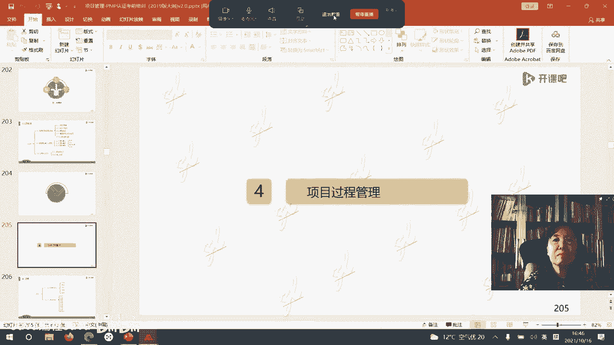

# -PMP认证4期 - P8：13-项目管理人员（二）【itjc8.com】 - OA工作流 - BV1yY4y127aU

好的嗯，我们休息结束了啊，开始上课，那我们继续呢，今天的话题，今天话题的第二个大的模块，第二个大的部分是对团队的建立和管理啊，好啊，咱们今天的第二个大的标题叫团队建立与管理，首先我们看一下。

预测型生命周期的项目团队是怎么建立的，项目管理者或者叫这个项目经理，他去提标准，提条件，要人把人要来的，那么他会通过找职能经理，找公司的相关的这个高层啊，找其他项目管理团队去谈判，把人要来。

下面这个黄色框框里的这些内容，就是要人的标准啊，我提标准，比如说提，因为我这个成员都是借来的，那么在这段时间之内，这个成员可不可以借来，因为人家可能还有其他的工作，或者叫我们也常常说没有档期。

人家档期在干别的工作呢，你想借别人，别人不见得这个时间有时间，第二个，你用这个资源，这个资源要花多少成本，这个资源的经历能力，知识技能态度，另外这个项目如果涉及到跨境跨国家跨地区，那个国际因素。

语言因素，沟通能力，时区等等，都在我选团队成员的时候的那个条件中，可能我看中了某些资源，但是职能经理能不给我，人家在一个别的项目团队里面在做呃，工作呢，人家来不到我这个项目上。

但是我为了啊要让我这个项目顺利的完成，我可能就会通过多种谈判，去想办法把这个资源给要来啊，这是预测型生命周期的团队，预测型生命周期的项目团队，包括主要有这几部分，团队成员，一个是管理团队呃。

一个叫做执行团队，一个叫做行政支持，还有其他团队大概是由这些团队成员组成的，那项目经理呢是属于管理团队的核心人物，或者领头人带领的，他其他部分的团队成员呢也都管理嗯，管理团队的成员顾名思义只做管理。

他不执行，也不去写代码，他做执行管理啊，他不做执行的操作，那执行团队的成员呢就等着管理团队的成员，你把计划把这些路线图都画好，我照着做就可以了，嗯一个人可以同时在几个团队中吗。

道理上管理团队和执行团队是不串秧的，呃一般是不在这个中的，但是对于一个非常小的项目来说，这个管理团队的成员呢，他同时也在做执行，就比如说吧我们这个项目团队就三个人，我不可能再分两个人做管理。

一个人在做执行啊，他可能是共同都担待着各种责任的，稍微大一点的项目团队，这些成员都是呃不混在一起的，各做各的事，各负其职啊，叫做责任分工明确明晰优势互补啊，大家自己哪个是强项啊。

来施展自己的强项来进行工作的啊，对看项目大小啊，有的项目呢就是一个人当几个人用，确实是这样啊，那么刚才说到的是预测型适应型生命周期呢，团队叫做次管理团队，自主管理团队。

那么自主管理团队就有这么几项内容啊，叫三大基石，其实就三个大的方面需要注意的，第一个自管理团队的所有的成员必须要承诺，信守承诺什么呢，我进这个团队就是为了完成目标，我自己管理自己，把目标做成。

一定要诚信，你得遵守这个，你承诺了这个目标，你又不好好干，最后又完不成，那你这种人就不能自主管理，不能进到这个项目团队里，第二个最重要的方面，管理者高层要授权放权，你得让他能自己自主管理啊。

你如果不给他权限，自主管理，他怎么自主管理，他也管不了嗯，那么也有这个外国人写的这个书，自主反其管理团队，他能创造特别大的价值，所以这个高层的领导者呢要明智，你是天天守着钱不放呢。

还是底下的人放钱里头能给你挣来大把的钱呢，这个书里就这么写的，当然你想想嘛，还是要这个钱好吗，你老亲自去管，那还不如人家管好了以后把钱带给你，就这样说的啊，咱们的助教说的对。

对管理团队成员的素质要求非常非常高，你看这个没有头了嘛，大家都对我们自主管理，但自主管理不是无政府主义，而是每一个人都具有那种自觉性，高度自觉性嗯，都至少是马斯洛需求层次理论的第四层。

这样的团队成员他可以实现这种自主管理啊，最后一个叫做每一个成员，必须得认可这个组织的共同所遵守的，那样的一些原则，原则有两条，第一条，在这个团队中的任何人不许对他人使用暴力，有人以为这个动手大打出手啊。

还不是指的这个这个暴力主要指的是语言暴力，就是当有冲突的时候，不要互相挤的人，不要特别难听的这个语言在这儿，因为大家都是一个朝着一个方向，一个目标来商讨来讨论问题的，而不是互相不认可，你有这个我记得你。

你有那个我就是揶揄你啊，用一些特别难听的话语，第二个又是啊，就是第三条，其实原则里面的第二个原则，又跟这个第一条类似了，每一个人都要遵守承诺，信守承诺，完成目标啊，所以这个听起来很理论啊，但是呢。

确实也有一些好的公司做到了，但是做到的是少数，我们讲的是纯适应型生命周期的团队啊，你要混合呢就可以借用这里面的一些道理，但你不一定一模一样啊，一模一样，是不是真的有这些员工能够做得到。

那么在这个团队中不需要管理者，也没有项目经理可以有这个仆人式领导啊，一个教练什么等等，可以有的，这是适应型团队，它的组成和他管理的一种模式啊，那么在适应型团队中或者敏捷项目的团队中。

团队成员都是什么样子，怎么高素质的呢，叫做跨职能的，就是多面手，跨界的啊，自组织的通用型的专家人才，这些人组成的团队嗯，那一个人他又可以做管理，可以做计划，又可以写代码，又可以做这个行政支持。

他一个人都是能搞定的，所以在这种团队里，谁对项目的目标负责呀，所有的团队成员都负责呃，要求大家那个技能都比较平均，不再是优势互补啊，而是水平都比较平均，互相都可以替岗的啊，这样的团队啊好。

那么团队建设分成了不同的阶段，从团队成立开始啊，那么不同的团队建设阶段，就有不同的管理风格来管理，你作为一个管理者的话啊，那首先这个是啊有人提出的团队一成立呢，他经历过这样的不同的这个阶段。

首先呢项目刚一成立，在项目的早期刚成立的时候，管理者的管理风格是什么，叫做指导，什么是指导，亲力亲为，手把手的教团队成员应该怎么做，应该怎么做啊，就是你跟团队成员的这个互动是最直接的。

不是说团队成员都特别菜鸟，不如你强，人家可能也有些大腕，但是老板是把这个项目授权给项目经理的，对于目标啊，对于内容啊，对于范围你比别人更理解更了解，所以你要通过这个刚一开始的阶段。

把这个项目的目的目标啊，最直接的老板要求你的那个期待啊，他能够传递给团队成员，所以刚一开始你可能项目刚一起步挺难的，也挺累的，也就中国老话说的一个叫做万事开头难，这是开始啊，随着时间的延续。

项目团队就进入了磨合阶段，震荡阶段，团队成员过去都来自于不同的背景，有不同的经历，来自于不同的项目上是吧，就会有冲突产生了，这个时候管理者的风格呢就要关注冲突管理，因为你不顺利地度过这个震荡阶段。

预示着项目就离失败不远了，适应型团队成员都是教练吗，不是啊，因为我们最后一天有一个模块专门讲敏捷，会告诉大家那个里边都有哪些角色啊，有哪些人物，第三个，随着磨合阶段的度过。

项目团队的建设呢就进入了规范阶段，大家开始遵守同样的规定，开始彼此互相理解自己，其他的团队成员因为已经了解了吗，了解了就理解嘛啊，然后大家就互相合作，互相配合，形成制度来做事，这个时候。

项目经理的管理风格就叫做教练式的和支持，这是两种管理风格啊，两种一个是用教练式技术干嘛，你开始撒手了，你开始引导了，你不是在手把手教了，这个地方是手把手在在做啊，到后面就开始松手了，开始干嘛。

让自己的特别是管理团队，自己担当相应的这个职责来做工作，然后你要给予他们一定的支持和帮助，规范阶段啊，度过了以后，项目就进入了成熟阶段，成熟阶段的表现是团队成员配合默契，彼此啊，就是话语可能都是多余的。

一个眼神就能传递一个马上就懂，因为大家长期朝夕相处都已经非常了解了啊，所以那个配合是非常默契的，你比如说你可以在某些班组，我们在工厂现场里就可以看到啊，那个老师傅刚一蹲下，那小徒弟马上把工具箱就端来了。

因为他长期配合合作，老师傅没说话对吧，然后这老师傅开始干什么，他马上趴着，第一个班子，他就知道这个怎么协作的，在这样的团队中，这样的生这个生命周期建设的阶段中，团队的阶段中，项目经理用的管理风格叫授权。

你可能都有点多余了，让大家自己来解决这个问题啊，那么随着成熟阶段的度过，项目团队快要做完，项目就要解散了，在解散的时候，也就是项目的后期最结束的时候，什么问题最大，人员问题最大，因为项目做完了要解散了。

所以人心惶惶，就会想着哎呀，那我后面去干什么呀，我要再回我那职能部门，我那职能部门的那个坑都被别人占了，我会去干什么工作呢，会有一些顾虑的，这个时候特别考验项目经理，对人员遣散的这种风格和能力。

怎么做呢，提前不是这个时候你才做，提前要做好什么遣散规划，提前要做好遣散计划，就想好了哪些成员怎么怎么离开这个团队，到他自己的那个部门去，怎么工作，那项目经理在遣散这个计划下，你起什么作用。

给大家写推荐信，或者给大家说好话，去把他们推荐到更好的项目中去，这是最后一个这个阶段的管理风格啊，就做好遣散的规划啊，下面我们再看在团队建设里边儿有一个概念哈，有一个需要掌握的叫做培训。

如果这个团队成员我们千挑万选，拿这个标准挑出来，到了这个项目上还是不会干事，所以就要对他进行培训，给他定培训计划，那么在新的这一版一九版，2019版啊，考试大纲里专门提出了，怎么来评估这个团队成员。

他培训的效果，培训效果的评估专门提出来了啊，那我们中国人在这个培训上做的没有西方国家，好，西方国家特别是欧洲国家，哎呀那培训对员工来说都是一个巨大的福利啊，有一个学生是天津的学员是吧。

他在西门子公司工作，那我是看着他成长起来的，这十多年，他从刚新进入西西门子的公司，什么都不知道，慢慢通过学习项目管理一直在走一直在走诶，他现在做到了西门子公司的一个高管。

那这个高管呢每年西门子公司送他到德国，专门去学培训半年，大家都挺羡慕他，哎呀他多爽啊是吧，要去培训半年的，但是这个同事说啊，这个女生这个这个女孩子呀长得非常漂亮，个儿也高高的，很漂亮，一个姑娘啊。

一个女孩，那么他说其实培训是非常辛苦，是很累的，而且培训回来以后要评价你的效果还要什么呀，给你的工作加码啊，绩效加码，你以为培训都让你到一个地方吃喝玩乐去了，那不行，培训很辛苦，互联网都关掉对吧。

在又用德语的环境，在德语环境里边学习的啊，所以这个这个学生他是这种状况啊，每次回来以后就给他的这个职务也提高了，那么他的这个当然他的待遇都提高了吗，啊他的绩效也加大了，他就能做到。

那么人家是怎么衡量这个的呢，西方国家啊，第一个从反应层面培训完了以后让你填填表，哎这次培训怎么样啊，你满意不满意啊，打打勾啊，老师好不好，机构好不好等等，这是第一个层面啊，叫反应层面，最低层面的。

第二个学习层面的，给你出一个卷子，你答答题你都学什么了，你不觉得挺好的吗，人家一答题都不会，那这就说明这个培训效果还不是特别好，这个评估啊，就是收获方面的，考考试或者写写写个体会。

让你写体会你都写不出来，学了什么东西都不知道了，那么这个就能评估学习的程度，这是第二个层次，第三个层次回到你的工作岗位上，你是不是把你所学的这些东西，应用到你的行为中了，能够实际改善你的行为。

你真正在这个工作中，就是按照培训讲的这些做的，你是不是能够做到这更深层次的啊，这种评估了，你以为资本家给你出钱，让你学习个白学呀，它都它都会对你这个效果进行评估的，如果你去一次评。

人家评估完了不太好不太好，以后就不送你学了，说明你这个可能你也有问题，公司有问题，不花钱再送你学了，因为这是有成本的，最深一个层次的是评估一下，通过培训你的经营业绩有没有提高。

老板的投入是要看产出的嗯培训完了，你是不是能够给他带来更大的收益，所以这就是西方人的想法，那中国人基本上就平到第一层，顶多到第二层也就不错了，那两层不会平，不知道怎么评，太麻烦了，特别是这个业绩。

这怎么算呀，我们自己的成本都算不清楚呢，还不知道怎么回事，这个培训完了，什么是培训带来的这个业绩呢，那评价的标准，这个怎么怎么实际操作呢，啊人家都有一套这种体系，这样的评价，所以在这个观点上。

我是多引申一点，多说了一点哈，西方人对呀，三四很难呀很难，所以中国人就不做呀，但人家西方人都有非常成熟的这个体系，包括法国的这个评价体系，我也都看过啊，法国的威利亚公司是供水公司，是全世界前五名。

就是在供水行业非常优秀的这个公司，他现在在中国也有好多合资的单位啊，包括在云南啊，啊在上海啊，在天津都有这个威利亚的这个公司啊，在这个江苏也有啊，有没有案例格式的分享呢，因为这里会涉及到一些财务数据啊。

这个地方人家不会给你的，但是我告诉你一句话啊，中国的老板就会认为给他送去培训，学完了他就走了，学完他就走了，亏死了，会这么想，但是欧洲的老板，欧美的老板啊，当然欧洲的老板比美国要强啊。

美国太看重那个具体的利益了，欧洲的老板会怎么认为呢，他会怎么说呢，四大石油公司壳牌，他们的老板啊，他们的员工就是大剂量的进行培训，壳牌的老板会说，我宁可要一个愿意培训，爱学习，培训完了他就走的员工。

我也去给他投入这个培训，我也不要一个永远不参加培训，永远赖在我这儿的人，你看理念不一样，这个人整天赖在我这儿，但是也不学习，也不进步，也不参加培训，嗯所以我不要这个人，我想说的是这种理念啊不一样。

这壳牌公司世界世界四大石油服务公司，壳牌的老板说的话，所以他们每年会送出去大量，甚至他觉得要裁员，裁员的名单在这了，裁员之前还送这个员工去学习，所以从壳牌走的很多的员工，他不会说自己公司坏话的。

他永远感恩这个公司，他给了他一种能力，让他离开这个壳牌以后，在别的地方他还有一个好的发展，这个就是思想不一样啊，这个说的稍微远了点，再回到我们这里来说回到我们这儿说，如果这个成员他不行。

我送你培训完了以后，评估了以后还不行，怎么办呢，在考题里就出现过啊，所以这个我们的书上有原话，说这个员工就需要笔画外的培训，还是要给他培训额外的计划外的培训啊，叫额外的培训，所以这个是在这个团队培训。

这个上面的一个内容，这个就是团队的建设，你看团队建设，我们前面说了，更关注团队的整体，虽然我培训的是一个一个的个人，但是我想要的追求的是团队整体的，他的这样的能力和实力的提高。

嗯你看有的这个中国的公司啊，他离职以后培训证书都不让人家带走啊，系统培训有的时候流动会增加，中国的很多老板都是那个小心思啊，这个员工说的也很对啊，叫胡高胡高鹏对吧，是这样的，其实你跟美国人打交道。

你就发现他们在小的地方特别特别傻，他就是傻子似的，好像都不知道这个事，但是他有高格局，大的方面，他很精明，这些小的方面他不像他不是那些小心思，那就格局还是比较高，还是啊他的思维。

他的这个这种现状限制了或者他的智慧，限制了他的想象力，限制了它的发展啊，好的我们只说这，因为我们考的是这个体系，我们讲这儿啊，另外说在团队建设里边，还有一个常见的工具叫做知识管理，什么叫知识管理呢。

知识管理的三条原则在右下角啊，在这个版面上，第一知识要积累积累原则，那些数据你要收集啊，你不能全部都扔掉了，现在社会当前的这个社会，人们越来越重视信息和数据的什么重要性，谁掌握了数据，谁就掌握了天下。

那当年中国人可能根本就不大理解，这数据都有什么用啊，现实的一些记录都不是特别认真的啊，去把它保留下来，那你光记录下来，积累下来了，不共享，不分享也没有意义，每个人都保密保密，保密锁在自己的抽屉里。

不去共享，不去传播信息，很快就过时了嗯，第二个叫做共享原则，第三个交流原则，这个信息拿出来再一交流一共鸣，它产生的就不是两个信息了，呃一般在讲知识管理的老师会举这么个例子啊，比如说我对面上课的这个啊。

有一个没女朋友，她是学生，在这上课呢，他手里拿着一个吃的苹果，我手里也拿着一个吃的苹果食物，这食物啊，我们俩一交换什么情况，它还是一个苹果，我还是一个苹果，可能就大一点，小一点，也就这点东西。

但是如果他一个知识，我一个知识，我俩一交换是什么情况，我俩真的不是每个人手里两个知识，知识和知识有时候会产生共鸣，至少达到的是1+1大于二的效果，他会有多个东西产生，所以知识的积累，知识管理太重要了。

知识管理包括知识所形成的产权，专利啊等等，这些都属于知识管理的范畴，在我们项目管理中，左边列到了知识管理的这五条，第一条，通过每一个项目利用公司原有的知识，利用我们每个员工，你自己已经具备的知识。

通过项目合成生成新的知识，每一个项目都得有进步，都有新的知识把它记录下来，在那个收尾那个里边啊，收尾过程中记录归档，沉淀这些知识，第二个要注意分享隐性知识，跟隐性相对的就是显性知识。

比如说项目做完了以后的那些档案范围，进度成本都是看得见的，这是显性的知识，在报告里面有，但是在项目管理中，有很多特别巧妙的思路，思想都在员工的头脑里沉淀着，他不说没人知道的，一定要用一种文化啊。

激发用一种管理，一种文化，激发咱们这个成员分享自己的隐性知识，让他说出来，怎么让他说出来，怎么让他贡献给组织，给适当的激励呀，那么激励无非就是两条吗，一个是名，一个是利对吧，那么这个知识是他发明的。

你就搞一个理强定理，王强方法，张强攻势，那就用他的名字来命名这个东西，那员工会很自豪，我当然愿意分享了，我分享完了才有人知道哦，我有这种能力，我可以做这个事，但是光有名还不行，还得有利，怎么有利呢。

比如说在公司的局域网互联网上啊，把他这个东西放进去，点击量达到多少就给他多少钱奖励，就有都有人看呀对吧，如果其他的研发项目用了这个张强模型啊，用了这个东西，用一次给这个新的这个项目。

百分之多少提成给到他，因为他用了我这个做基础啊，又有名又有利的奖励，哪个员工不愿意分享，就愿意分享了，如果我不分享，我锁在这时间久了都没用了，人家有更新更好的东西，人家不用我这东西了，通过这样的激励啊。

让员工把自己的隐性知识分享出来，这才让整个组织啊有一个大的飞跃，有一个大的这个进步，因为显性知识都是看得见的，摸得着的，这个隐性知识他不说你都不知道啊，什么叫隐性知识说一下啊，比如说有一个配方。

有两个厨师都按这个配方做馒头，它做出来有一个就好吃，有的就不好吃，他们就一个小的诀窍，窍门不在这个配方里边儿啊，比如他和面的这个动作，或者这个数量这几下，或者他有一个什么样的一个诀窍。

这个诀窍他不说别人是不知道的，但是人家只能知道诶，他做出的馒头就是好吃，他怎么好吃，我也是按照配方做呀，他也按照配方做呀，那配方就是显性的都能看得见的，就是这个意思啊，一定是要让大家把这个分享出来。

所以这是一个组织行为，不是一个项目团队，你就可以做得到的一个公司，他要有这种管理，有这种制度激励着员工去愿意分享，嗯这是第二个，第三个，这个知识要留下所有员工，不同团队成员员工集体的智慧。

而不是比如我们考题说了，那我收集经验教训，那当然不对了，所有员工啊，所有员工都是有智慧的，不看他的层级啊，不看他的出身学历，一个农民工他的诀窍，你要不知道你还干不好这事儿呢。

嗯所以所有的成员他都是有这个知识智慧的，嗯有学员有有觉得感觉有收获了啊，另外我们要将知识管理的这种专业理论，把这个这个工具和员工联系起来，刚才我们说的给这个工，给这个啊员工的这个知识产权呀。

或者一些模型啊命名，这就是一个知识管理工具啊，一种知识管理文化，你跟每一个员工联系在一起，就可以激发他们分享这个东西，就可以实现我们的知识管理的，一个比较好的呃方向。

最后一条叫将这个生成的知识叫知识转移，很多人就不理解什么叫知识转移，知识只放在书架子上啊，放在电脑里，没有用的知识要转移到他所需要的地方，所需处，它才能带来价值，我们中国人在知识转移。

成果转移上远远做的不如西方国家好，也就人家一个知识都能变成钱的，我们行吗，我们好多写了论文，我们一些院士写了好多文章发表，一都在那个架子上锁着呢，他怎么能够走下来，走到生活中变成能够产生价变成钱。

就这意思到他去他需要的地方去转化成价值，这个是比较重要的，这是第五个啊，就说了知识管理的全面的东西啊，啊也有人说那这个教会徒弟饿死师傅了，所以就被那个俗语都给带偏了，也不全是这个。

说明这个师傅本事没到嗯，如果一个师傅他有高超的技艺，他会永远被模仿，永远会不被超越，他越怕别人超越，就那点东西捂着弄着，那徒弟一旦有一天比他强，那他根本就啥也不是，所以这个人也是在进步啊。

在这个成长的过程中的，所以我们就说这样一些啊，知识变现没错啊，你转移了才能变现啊，转移到他去的地方去啊，好的下面我们看知识管理的路径，怎么才能有知识啊，先要有数据，数据经过加上一定的背景做了分析。

你要大量的数据，你看不出实际意义，加上一定的背景做了分析，就变成了信息，信息在上级不同上级的要求之下，经过分析组合，我给它写成文档，叫做报告嗯，培训完一直被模仿，从未被超越，对的就是这个意思啊。

被需求才有价值，是的啊，这种低级的师傅很多，大家跟现实联系起来了，那么这张图表到了这儿完了吗，数据信息报告完了吗，再往上一个台阶，经过抽离，经过分析得到什么知识，一个人，一个公司。

一个组织都是这个路径啊，就变成了公司的知识了，那这个知识是不是就到顶头了，不是一个有知识的公司，他也走不了太远的，再往上还有一个台阶，我留了这两块儿，就是要写东西的知识，经过升华，经过归纳，经过处理。

变成了智慧，一个有智慧的人或者一个有智慧的公司，他会永远立于不败之地，因为智慧可以保证这个公司和这个人举一反三，应对各种困难，即使他落到了谷底，他反弹的高度也比其他人强，因为他有智慧。

就是那种给予反三灵活应用的能力，我们一个人的积累也是这样的，不是浑浑噩噩糊里糊涂，我收集了好多信息，我也不去讲，我也不去想，我也不去分析，我也不管它有什么用，那最终那你在跟某些人打交道的时候。

你会觉得有些人哎呀，这些人真的是不错，他挺有智慧的啊，他能够特别有哲理说出一些东西来，而且他不是夸夸其谈，他也是自己这么做的啊，所以这是一个知识，它发展的这样的一个台阶和路径啊，获得的路径好。

接下来我们进入下一个团队建设的，一个比较重要的内容叫做评估，怎么去评估这个团队，个人啊，团队和个人的绩效呢，对于个人的迹象，或者对于个人是不是胜任这个岗位，有这么几种评估的做法，这些呢就是书上写的。

但书上写的这个不明确，我再给大家重新写一下啊，第一个不按顺序了啊，假如我们这个你要找工作，或者别人评评价你是不是称职，就这个履职分析履历，分析你履职的情况，或者叫简历分析，你要到一个地方找工作。

不是先投简历吗，那么别人可能会给你这个机会叫做面试一下，有一些特殊的岗位是需要心理测验的，看你的心理素质过不过硬，有没有心理问题啊，第四个进行情景模拟啊，公文call呢测试一种角色的扮演。

比如我招一个销售啊，来了，那我就做一个这个游戏管理游戏啊，或者叫一个案例，那么啊你就是现在就是我们公司产品的销售员，我呢是一个挑剔的客户，这就是考官啊，考官或者是招聘你的人，招聘官，我是一个挑剔的客户。

你不管怎么跟我说，你说什么好的，前提是啊我全部都说不好，而且我说特别难听的话给你，我看你怎么回答我，我通过看你对我的这个交谈，对我这个推销营销的这个手段，来判断你是不是适合做一个销售。

所以这些都是在评估一个人的能力，对于某些岗位的能力啊，这是对于个人，对于团队呢团队建设的绩效怎么评价呀，四个指标一通过团队成员在这个团队里边啊，通过这个项目个人的技能有没有改进呢。

我把这个改进理解为提高团队整体的能力，有没有提高呢，团队的离职率是不是降低或者等于零呢，正常的在运营型的组织中，正常的团队人力资源的流动是一个好现象，但是在一个项目团队中，频繁的人员的离职。

预示着项目的失败，在一个项目中，人员尽量不要走，你做完再走，要不然这项目就都撂了，你在中间再换一个人就很麻烦的，特别是i t项目，你在了解这个前因后果，因为i t项目是一个逻辑产品。

这个逻辑产品不同的人的逻辑思维也不一样，一换了人，那前面这段要想解释清楚都很麻烦嗯，所以这是项目团队的绩效的衡量，不是一个公司，一个组织运营团队对人力资源的管理，最后一条啊，跟第三个它是对应的。

凝聚力是不是强啊，这是对于团队绩效的评估啊，有这样几个指标，那么评估的办法就是用绩效的办法来评估，常见的常用的绩效，评估的方法有这么几个，一个叫做kpi关键绩效指标法嗯。

那么这个是通过设置关键绩效指标衡量，关键绩效指标来看你的业绩绩效好不好，你这个在项目团队中，你这个岗位啊，它主要的这个指标啊，你是不是达成了用它来评估，还有一个叫360度评价你的上级评级，供应商啊。

下集全方位的来给你打分进行评价，西方人也说这个比较好用，而且呢比较简便啊，也比较真实客观，但这东西到中国就未必了，我跟你有矛盾，你再好，我也给你打低分，有没有这样有啊，比如穿上级。

下级要这样穿小鞋的等等，嗯所以这个到底好不好用，不能一概而论得分情况，还有一种叫平衡积分卡，平衡呃，balance bs啊，积分卡，bsc，平衡积分卡是什么意思呢，它是一个战略管控。

连呃项目管理的这个评价都有的，他是把这个关键绩效指标，会装到这个平衡积分卡里，怎么装呢，平衡平衡嘛讲究的是你管理各个方面的啊，平衡首先第一个方面管理要有钱，能把收入拿到，怎么能拿到收入啊，客户得满意啊。

因为我们的钱都是客户兜里的钱，客户怎么才能给我掏钱，他满意了就掏钱了，这是逻辑，客户怎么能满意啊，我内部的管理，内部的流程得特别让他爽，让他高兴，所以这叫内部流程嗯，内部流程怎么才能做得特别好呢。

才能真正执行的到位呢，员工要好啊，所以有个员工学习与成长指标，所以大的模块有四个大的模块，每个模块里边还有kpi，关键绩效指标，有些企业呢采取这个方法，就是我们前面说的卡普兰诺顿，他们发明的平衡积分卡。

这些概念我现在写在板面上的，除了最下面这个哈，都出现在考试题里过，虽然不让你解释，它，让你挑选，好多学员听都没听说过，他就不知道干什么用的，怎么挑呢啊，最后一个这些年比较时髦的kr嗯。

o k r其实不是新东西，它也是一个考核方法的变种，原来叫目标管理法，现在又加上了一个目标与关键事件，就叫做kr了，目标与关键事件，这个办法呢他主要是进行项目绩效改进的，它并不跟工资挂钩。

这是kr的这个评价方法，适合于一些这个互联网的团队，讲究的是绩效都公开透明，每个人都明着亮明了来管理，看板式的这种管理，最终呢提高整体团队绩效用的，他不是考完了以后。

哎你多少分他多少分发钱用不干这个用的啊，这是kr的方法啊，好的，现在我们进入了第三个模块的学习，第三个模块啊，第三个模块叫做除了项目团队以外，和我们项目经理这以外的人员的那个相关方。

相关方的概念是广义的，非常非常广泛的，我们看第六版的书上给的这幅图，项目的一些主要的相关方都有哪些，首先是中间的这个角色，项目经理，他是非常关键的相关方，然后再向外围气一点，有谁呢。

项目团队团队咱们刚才展开过，说过有管理团队，执行团队啊，我说的是预测型的生命周期项目，如果是敏捷迭代的，所有的成员既干管理，又干执行，所有那个都都这么干啊，k r哦，和kpi的区别，一会儿我讲啊。

别着急，我这有人问了，我看到了，我一会会会给大家讲一下啊，适合x型的这个o k r是和y型的，创新型的项目，一会儿我给大家讲一下啊，这两个东西的区别啊，那么下边这个叫ppp经理，什么p p p经理啊。

不是指的那个投资的时候那个那个3p啊，那个p p p那个p p p是指的嗯，投资的那个那个构成政府，个人和民营企业做的一些是一种叫经营模式，你比如说北京地铁4号线就是ppp项目，什么p p p项目。

它是港铁，承包了的，政府出政策，政府出了一个政策，你这港铁我没有记错的话，他应该是20年啊，就是香港港铁在这经营地铁4号线，20年，20年后，你把这个这个地铁移交给政府，然后我们来管理20年的。

这营利都你拿着政府干嘛，给你出一些条件，出环境，你出什么，你出资本，你出钱，20年你挣你的钱啊，你把这个钱挣够了，所以在北京呢好多这个坐车呀，什么都是有交通，都是有补贴的，但是地铁是没有的，为什么。

因为你都这种模式，你给人家资本家，你都不让人挣钱了，人家给你这20年干什么呢，对吧，20年之后你再还给我，政府就是用这个模式啊，这是p p p模式，我现在这说的是p p p经理，不是那个哪三个p啊。

project program profportfolio，就是项目，项目及项目组合这些相关的经历都是什么呀，都是项目最直接的关键的相关方，还有一个资源经理，就是那职能经理，包括人力资源经理。

还有管非人力资源的那些什么设备啊，工装啊，材料啊等等，那些经理都是项目的相关方，再往上再扩大一点，t m o项目管理办公室指导委员会，如果你在考试中见到这个词，指导委员会，各种各样的指导委员会。

决策指导委员会，战略指导委员会啊，有一个什么叫做呃这个呃叫做什么呃，专业指导委员会都在考试题里出现过，很多同学就蒙的不得了，这是干什么的，总之他们的委员会的意思用的单词叫board，就是董事会。

也就是这个各种各样的委员会，在公司中是跟董事会评级的，就是高管吧，高层组成的，或者我们变更控制委员会都见过这个啊，这些委员会就是，高层管理者对于项目来做一些决定的，还有领导机构，还有发起人。

这里都讲了嗯，一般把发起人作为高管，作为自己公司的这个老板啊，这个圈再往下扩啊，往往大扩，最终用户客户他们是有区别的啊，客户和最终用户客户可能不一定使用你的产品，但最终用户是用你的。

直接用你的产品的供应商，就是给你提供分包服务的，还有用了一个相关方这个词，就是方方面面，比如说啊团队成员的一些家属啊，呃等等，这些都属于相关方或者社区啊，社区的一些老百姓啊。

我做的这个项目影响他了没有啊，和他影响没影响我这个项目只要影响到了，就跟这个项目有直接或者间接关系的那些呃，机构或者个人叫做相关方，首先我们先看相关方的概念啊，啊一会儿我再解答嗯。

k p i和o k r的区别啊，先把这个这一段内容讲完整，因为有学院会提意见，我听的都是一段一段的不完整啊，好的我们先把这个说完整，咱们再解解释那个问题啊，好那我们这个第三个模块。

第三个部分就是要跟相关方打交道的时候，怎么打相关方啊，太重要了，如果他能帮你，能够协助你啊，给你一条心，至少吧他不管嗯都能够成就你，如果他还给你捣乱，老给你挖坑，你怎么你怎么成功啊，你就没法成功了。

大家有这个经验，你想干成一个事，亲人家属父母朋友都支持你，给你自己的，你不见得做得成，但是如果有一个人给你挖半个坑，你绝对就就就倒下了，所以相关方管理特别重要啊，相关方管理。

就是要想办法让相关方跟我们建立共识，以一个态度，一个目标去对这个项目，保证这个项目的成功，而且呢要扩大正面的相关方的那种积极影响，缩小或者遏制那些对这个项目有负面影响的，那些相关方啊，这是指导相关方啊。

指导相关方的目的就在这儿，我常常用这个词，我知道用的很不合理，也不严谨，但是我也没找到可能比他更好的词，来形容这点事啊，叫什么呢，在相关方管理中，一定要具有一个本事，叫什么本事，化敌为友，我说不严谨吗。

你这个做一个项目怎么都变成敌人和朋友了，我只是用这个来比喻啊，来让他让大家知道一些方向，为什么呢，中国的老话也这么说，当敌人变成朋友，他比朋友更可靠，他是真的服你了，但是当朋友变成敌人。

他比敌人更有具有威胁，因为他太了解你了，你的软肋在哪，他都知道，对的啊，就是这个家银同学说的，让多多的人支持你，让少少的人反对你，没有人反对你，那你不就把事做成了吗。

啊这就是指导相关方最终要想要达到的目的啊，那我们用一个工具来进行相关方的识别和管理，这个工具的横坐标叫做利益，也就是我这个项目对相关方，跟相关方有什么样的利益往来，利益关系，我的项目影响到你的利益了。

或者你能够通过你的啊资源或者努力，来影响这个项目的利益，所以横坐标是利益，纵坐标叫权利专业的词，那叫相关方映射分析表现矩阵，但它又叫一个叫什么名字呢，叫权力，利益，方格，也有画这一道的啊。

权利利益方格或者叫权力利益矩阵，我用这两个维度组成这个矩阵，然后我们就进行相关方的分析了，怎么分析的呢，你看a相关方，它利益呢，就是我们这个项目跟他的这个利益关系不太大。

所以对这个a相关方我们的管理叫做令其满意，你别惹他，别招他啊，对于bhf这样的相关方，他们的这个项目跟他们的利益，实际利益关系特别大，权力也特别大，那对这样的人应该怎么办，重点管理怎么重点管理啊。

实时请示汇报啊，多依赖他，因为他权力还大吗，对于利益很直接，但是没什么权利的，比如说我们现在要做一个旧房改造，跟当地社区的老百姓关系十分紧密啊，但是那些人他有什么权利呢，所以跟他们要保持什么随时的沟通。

现在进行到哪了，需要大家配合等等，提供通知等等，对于权利利益都不是很大的，这样的相关方做的这个叫做监督，就是你盯着点，为什么，因为也许哪一天诶跟他就利益大了，也许哪一天这些相关方g和d他权利就大了。

就跑到上面去了，所以要叫监督，我现在这里画的四个方块儿叫什么名字呢，叫做相关方管理策略，管理策略啊，这是对相关方进行管理的策略，其实这四条主要是从沟通的这个角度讲的，还是要做好充分的沟通。

沟通呢我们之前已经学到过这个东西了，唉有一个学员挺了不起的小哥哥啊，他那领导让对方的人反叛过来，这个其实就是在这个相关方管理，我们部门都有好几个人去甲方上班了啊，这个是可大家都能看到啊。

那么我们在这个人员管理上，在项目管理里有这么几个嗯，有这样几个策略需要大家掌握的，这是权利利益方格啊，好下面我们再看，在跟相关方建立共识里边，还有另外一个工具可以帮我们大忙。

这个工具叫做相关方参与与度评估矩阵，这个相关方跟我们的这个项目的参与程度，分成这样几种类型嗯，一共五种，在考试的时候，他不会给出你这个图形，你还是要大概记一下的，相关方对于项目参与的程度有这五种。

一个是不知道，一个是对立的，抵制的，反对的，一个是无所谓，中立的，一个是支持型的，一个是领导，一共这五项，这是相关方啊，对跟项目的参与程度，我们希望这三个相关方，左侧的这三个观点的相关方啊。

都要支持我们的项目，在英文的书上，他只给个d啊，你就当支持是支持我们这个项目，现在是什么情况呢，相关方一根本不知道这码事儿，相关方二无所谓，只有相关方是三是支持我们的，我们在相关方管理中，要说服相关方。

一说服做工作，让相关方二都达到支持我们的这个状态，这是相关方管理的目的，通过什么来说服他，就是建立共识来解释来沟通吗，让他跟我们一致，最愚蠢的是，把已经支持我们的相关方推到这个位置去。

变成跟我对着干的这个位置去啊，所以这是关于相关方管理的建立共识，今天的课呢结束之前，我回答一下有学员的问题，cd代表什么，在英文里边也没有给这个单词，这个c呃，这个d代表的就是支持什么知识啊，我们需要。

需要他支持这个c呢代表的是现状，这个相关风，现在到底是支持不支持我们的是现状，沟通没用，关键是利益共存，还通过沟通寻求利益啊，他有什么利益说出来吗，嗯也是这样啊，这个是说到这儿了，另外解答一下。

刚才前面有个学员的问题，kr，kpi有什么区别，区别大了呀，kpi叫关键绩效指标法，假如用它来衡量项目的话，项目的关键指标是什么范围，进度成本质量啊，你把这个定好了，然后做好了标准范围做到哪就算好。

然后给他打分进行评价，这叫k pi，什么叫o k r呢，目标和关键成果，关键事件法，关键成果法除了有目标以外，还有这个成果和结果，比如他的目标有范围，进度成果成本吗，那你拿出的这个成果。

它最终所带来的价值带来的结果是什么呀，要用关键事件的面谈的这种方法来获得，就是他最终拿出来的这个成果呃，这个指标只要完成了就是好的，但是你这个指标完成了，你关键成果能不能给别人带来价值啊。

这是kr衡量的方法，kr适合于创新的团队，这个kpr一呃kpi一般用应用于生产制造业，过去那个传统项目的啊，这样的衡量kpr呢做好绩效指标以后，一般来说不透明，都是背对背的，你就完成你自己的最后就行了。

ok而是一定要透明的嗯，要公开的就是每个人承担的都是什么目标，拿出什么关键结果，这个关键结果最后到底有没有什么用，kpi是跟工资挂钩的kpi，我完成了这个啊，那我工资里边。

我的绩效里边给我一块k r是不跟工资挂钩的，是跟你的绩效挂钩的，什么意思，帮助你改善绩效的，让你提高这种能力的，但是他做完了的那个结果，可能给你一些不好的反馈，并不影响你的工资，不会扣你的钱的嗯。

360度什么行业用的多，公务员事业型单位，他不好客观评价，只能让别人给他满意度打打分，这样来做，这是360度啊，那么这是这几种绩效办法的解释，考试里边都有提到，有一个学员特别有意思啊，有意思。

考完试给我打电话，张老师几乎建了一个360度，我知道我只知道361度，我不知道360度是啥呀，你看所以我就把这个要放到课里给大家讲一讲，k p l是对细节，这个o k r是对整体，对。

它是对整体绩效的这个啊，那学员说他知道361度，不知道360度，呵呵有些人已经笑了啊，就是所以他并不考你特别难，真正让你怎么操作，但是他会在这个里边让你选择一些方法，你都见都没见过，变成361度了。

你这不是麻烦了吗啊，一会儿能不能说一个呃，一遍欧洲的那个领导说的关于员工培训的话，我记下的是我宁愿不是是这样啊，我宁愿送一个啊，都送员工出去培训，培训完了他就离职，我也不愿意要一个待在公司永远不培训。

永远不学习的人，大致意思一样啊，但是是我送，我宁愿去送一个员工出去培训学习啊，他学完了就离职了，我也宁愿这么做，他赖在公司的这个人，就这个话啊，看重播对的，那我们现在有时间也可以给他解释一下权利。

利益方格，权利影响方格有区别吗，有区别，因为这个坐标有一个坐标呢是利益，有一个坐标是影响，比如说你也可以叫权力影响啊，权力影响方格也可以这么说啊，可以做一个考点的总结嘛，可以。

但是这个考点的总结啊太灵活了，因为管人吗，你哪有一个固定的城市，一个固定的方式啊，所以考情商啊那个题目就特别灵活，所以虽然学到人员这一章，大家都觉得很有趣，可是做题的时候错误率特别高。

嗯大家总结一下这个考点，我讲的所有的东西都是考点知识分享，除了给予奖金奖励，还有什么呀，命名啊，名和利呀，张强定理，王强公事啊，多出点题，别着急呀，嗯我们在战略上要稳步，在战术上还要抓紧。

因为我们11月份就考试题目，后续班班老师会给大家大量的题目，就怕你做不完，就怕你不能按时完成作业啊，关于项目和运营，如果物流公司和货主签订了3年的服务合同，这3年里物流嗯，嗯我看啊。

物流企业为货主提供的物流服务阶段是运营吗，如果你那个提供的物流服务是重复性的劳动啊，这3年之内重复性的就是运营，他理解的是对的，但是如果你更放大一点啊，这个3年它也是一个项目，从头到尾啊。

3年有开始有结束，到这个合约结束我就做完了，但是中间呢我做的这个事是重复的，反复性的，那就是运营啊，呃学员提的对，为什么利益低的相关方是监督呢，这边啊因为这个项目可以说目前跟他没啥关系，没啥关系。

是不是就不用管他了呀，不是因为随着时代的变化，内外部环境的变化，它有可能就跟他有关系了，比如说啊这么说吧，比如说在这个社区建一个基站，建一个这个发射的东西啊，离这近的老百姓他肯定生气啊。

就觉得这个是不是会有什么什么，对身体健康不好啊，但是有些老百姓呢在另外的一些小区，比较远的小区，跟这个关系不是特别大，后来呢我就决定又在加这个发射装，你又影响到那个小区了，你得监督他。

所以他从这个利益小有可能变到利益大了呀，随着你这个项目的改变，它会变成利益大呀，虽然现在d和g这两个相关方权力低，你怎么知道人家未来不当区长了呀，人家要提职了，变到这个位置呢，你当然得监督着呀。

变化了你都不知道，所以要监督啊，奖励就是名和利啊，这个说到了，我是做汽车研发的，项目目标如何描述smart原则嗯，描述项目目标，你把smart写清楚，但是你这个汽车研发的时限是多长时间，1年之内。

2年之内啊，你要做一个什么事儿，很清楚地描述，要有一个可测量的，可以达成的啊，可以分解的，最后有一个时间限制的，这样描述目标，监督也可以理解为关注吗，可以理解为关注，在这里就是关注的意思啊。

项目和运营不是相互独立的，可以交叉存在，没错的，项目和运营实施是在转化的嗯，感觉这个坐标的横坐标，不是将复利意义象限画出来，是不是将复利一象限画出来，哎这个坐标那美国人给画的没有复利益象限啊。

就跟他的复利益，我们这个图不是这么画的，请问老师关于绩效指标嗯，怎样的绩效指标是合理的呢，大家问的真的都是实战，真的挺棒，有没有一套业内通用的模板呢，是有的，但是业是指的项目管理这个行业。

但是并不一定适合你所在的那个行业，比如说汽车行业，生物医药行业，生产制造业，it行业那个绩效都是不一样的，这个指标因为专门有一本书，就是关于绩效衡量项目，绩效衡量的考核还比较厚，那本书还比较厚啊。

有一个这个书籍有一本这样的书的啊，考核机制不一样，对你可以剪裁，那么关键是这个考核呢是一个管理，你不能把他认为这个叫绩效考核，叫绩效管理，绩效管理呢有这么几个维度，第一目标嗯，目标做好了，要有计划。

有计划了，还有考核标，考核指标，有指标了，还有标准，它要达到什么标准嗯，比如说我要考数学，就是一个指标，什么叫标准，数学是80分以上，90分以上合格，这叫标准，然后还要执行，就是衡量你要对标。

拿着实际跟你那个标准对标，然后给出一个这个结论，这个就叫绩效考核啊，老师这个就是知识面广，对，因为我们接触的东西多，我给很多企业做过这个咨询，给他们做过绩效的这个方案呃。

项目绩效的方案给北京大学林毅夫的团队呃，做他是智库吗，做这个研发他的绩效衡量绩效指标的衡量，我们给他研究绩效指标，给他研究绩效管理的体系，项目的绩效，项目的绩效和一个工厂里，组织绩效和一个运营的绩效。

生产的绩效它是另外不同的设计，因为生产的绩效大部分用的都是kpi指标，我们在这个项目中一般会用一些什么呢，就是，k r k r用的也少，为什么中国的企业做绩效管理的目的，都是要跟收入挂钩的。

跟那kr那就不太一样了，所以用的基本都是什么呀，b s c平衡积分卡，从组织战略到从上往下传递的，做这种东西，平衡积分卡里把关键绩效指标装进来，会用这种综合的做法啊，做这个绩效衡量课后呢。

我们又有好多题目啊，目前为止大家呢就是现在先去嗯应对这个考试，等考试结束了，开课班还有实战课，实战课更精彩，后续还有更好的这个策划啊，再跟着走，kpi是不是要根据战略没错，是对的，所以要先有目标啊。

要有战略啊，有没有往年的考试题和必考题目的讲解，担心考不过不用有这个担心，请你记住，美国人的这个考试在全球都不会公布原题的，谁说自己有原题，那就是骗你的，就是忽悠的，但是机构敢做这个事儿。

那题目也会有一些来源，我只能说到这儿啊，你听懂了就懂了，你懂得你不懂得就拉倒了，你就按照老师的要求做就行了，嗯那么这些题目呢要好好的练，虽然考试里不会有可能跟这个原题，你做的原题一模一样的题目。

但意思这个方面都是一样的，而且都是选择题嗯，模考题目的讲解课程有啊，到时候会给大家讲解这些内容的呃，呃有一个学员说kpi啊，就这个关键绩效指标法，老师是不是再说一下，就这个啊。

首先在公司的考核里边不是有一个指标管理吗，你这个指标先做四个大的方面，一个财务指标，财务指标要知道吧，把你公司的财务指标拿来成本指标，盈利指标，库存指标，这都属于财务指标啊，还有这个劳动生产率。

每个人的劳动生产率现在要考这个，现在呢还考e v a就是劳动附加值嗯，那这些都是财务上面专用的一些指标，客户满意度，客户满意度有一些指标，你把这个这些你装在这个模块里的，就是一个一个的kpi指标。

内部流程，内部的管理流程运作的好不好，装一些指标，员工的学习与成长，你每年要经过多少培训，培训完了是不是合格，有一些评价，把这些指标做出来，积分卡的这个计算的权重啊，这个考核的权重计算进来。

对大家进行这样的评价和管理，要对个人团队，和整个组织或者叫部门，当然这个部门就不是项目了啊，就是指的运营的那个部门了，要做评价，评价完了，把这个结果要统合整合在一起，作为一个整的对某个员工的评价。

对普通的员工的评价是不一样的，可能指标一样，但是啊这个权重是不一样的啊，有这种评价的啊，好的对了啊，我看到学员呢啊也提了上次提了一个问题啊，对于项目项目及项目组合有一些疑问，那我在这答疑一下啊。

我给你讲一个例子，你就知道项目组合很好理解，项目集不好理解，单独项目大家都理解了对吧，我们先说这个项目及program这个词啊，啊我给大家说一个例子，什么例子呢，2016年啊。

那1年大概我在哦就是初入香港，在香港待了大概有大大半年啊，在那个地方在学习项目组合，项目集管理的这个专业的内容，因为当时在咱们国内啊，没有这些专业的机构来学这个东西啊，我学不了这东西，我就去了香港。

但是我没有住在香港，我人住在深圳，我每天呢我都通过这个方法啊，我已经有了这个出入这个这个证的这个卡呢，是办了一个当时的临时的工作卡啊，我可以每天出入口岸，我走的是福田口岸，他有好几个口岸都可以走啊。

福田口岸比较大，然后我住在深圳这边，因为我不喜欢香港，我不愿意住在那啊，包括我现在我都有香港的地铁票，地铁卡啊，他的那个叫八达通嗯，相当于有一张八达通，你那随便坐什么车，坐地铁很方便的。

他的那个火车地铁啊，就是一两分钟一趟，一两分钟一趟，它的管理水平很高，一两分钟一趟，它都调度的很好，也不撞车的，我就去那做这个事啊，那么在这个嗯差不多待了快快半年，不到半年的这个时候啊，我有急事。

我要回北京了，回北京呢，我是在深圳的宝安机场坐飞机回北京的，那么大家想啊，坐飞机飞行一趟飞机飞行，这是一个项目集，那么项目集的目的是什么呢，要安全地把旅客从一个地点送到另外一个地点，安全的送到干嘛。

获得客户满意，这就是这个项目级的目标，那么在这个飞行的项目集中有多少个项目呢，大大小小大家想一下卖票吧，你这个航空公司要卖票吧，卖票完了，你要直击吧，直击你要登机，要上飞机对吧，然后你上了飞机以后。

你在飞机上要吃饭吧，啊要吃这个饮食吧，餐饮那时候还没有16年，还没有这个什么呢啊深圳真的特别好，我非常喜欢深圳，我的很多朋友都在深圳，我到了深圳都不用住酒店的，我的好多朋友在那边做生意，做的也很大。

都自己都有别墅，但是我为了不麻烦别人，我经常也是会住一个离这个口岸近的，这个酒店的啊，那样嗯有我最好的朋友，现在你们的说法叫闺蜜啊，从小一起长大的那个女生还是中国银行，中国工商银行，现在退休了以后呢。

他家就在深圳，在这边啊，那么这个我现在接着讲我的这个项目集啊，那么还有你到了飞机上以后的那个体验吧，服务员的那个服务的体验吧，啊那么这一套这么多的项目合在一起，它是一个项目集，怎么让这个项目极好呢。

达到目的什么目的呢，安全把里克从那边送到这边，还有一个什么呢，叫做客户满意，我这个旅客要满意，这个目标就达成了啊，好那一天我收到了一个短信，我要走了嘛，我第二天走，我那个买的票呢是比较早。

所以我可能准备呢就六点多，我就准备从那去宝安机场，我就从酒店离开，我是这么计划的，因为我那休息，我一个人在酒店嘛也比较晚，我夜里还在工作，大概是夜里都一点多钟了，我收到一条短信。

短信说你的这个航班被取消了啊，所以你要重新规划，你这个哎我就想我这个明天早上要走了，怎么航班就取消了，我又查了半天航空公司，我也查不到半夜三更的，你打电话都是那个自自动的语音服务，也找不着人。

所以我就决定啊，明天早上我还是按照原计划，六点多钟出发去机场，我就做了这么一个决定，结果等我，我怕不知道是骗子发的什么什么什么短信啊，什么取消了，要怎么着的啊，我就没理他，我早上六点多还是到了宝安机场。

结果到了深圳机场以后，在这个因为我是那个vip嘛，在那个这个呃，这个这个钻石卡的这个柜台排队啊，然后那个服务员特别特别好态度，就说真的对不起啊，张女士，你这个飞机确实被取消了，哎哟我说那怎么办呢。

他说你看呃，有没有就说离这最近的这一班的这个飞机啊，你能不能就是我把你改签到最近的这个，你是想早点走呢，你还是想就是订这个下午晚的飞机，我说我已经到机场了，哪个航班近啊，我就坐哪个航班走。

他说有一个航班去北京的，但是呢人比较满，而且你是这个你是头等舱商务舱的客户，可是那个商务舱也没有地儿了，你走吗，我说走啊，我一走进我就到这儿了，也无所谓啊，坐哪个舱都没关系，他说但是你这样。

我跟那个飞机上面啊，呃协调一下，给你做一个备注，就是你上去以后先找这个这个乘务长，然后让他给你安排一个，你看看那个头等舱还有没有空位，有空位你就坐在那儿，没有空位，你再让他给你安排一下。

所以我现在先不给你一个座位啊，我就给你这么做的，你服务态度多好啊，真是好极了，我现在那个场面都在我脑子里啊，结果我就上了飞机了，上了飞机也比较早，我上去呢就按照他给我指指引的指导的。

我就先找那个乘务长把情况说明了，乘务长说这样吧啊你先做这个高级经济舱啊，就是头等舱前面紧挨着的这个经济舱，说你先坐在这儿，等一下，等我把这个都安排好了，我给你找这个位置啊，让你先坐这儿，他说。

但是不过呢这个呃高级经济舱呢，现在也是满员的啊，就是地下我看的这个指标也是都是满员的，这是没有座位的，所以你现在先暂时在这坐，如果来了客人呢，你找我啊，找我，我再给你协调，我给你举什么项目集呀。

有学员听不懂什么叫项目集，我现在给你举这个例子，说项目急呢啊，记住啊，program这个词啊，地下是直击，有卖票的项目，有直击的项目，卖票的项目，我很满意，值机的项目，那那取消了也没办法。

不知道因为什么啊，有有什么演习还是什么啊，那么直接的这个服务员我也很满意是吧，他给我出的这个主意我就上去了，结果我在这个高级经济舱这坐着，就看到了这么一幕事儿啊，那么在这个这个机位右上角的那个位置。

拔角那个位置先做着一个男士，一个男的，他坐在那个里边，请里边啊，就靠着窗口了，因为那排是两个鸡，两个位置，这个男士呢就坐在那里边，结果他挺躁动的，不一不停的来回走啊，就是这样啊，后来他跟服务员说话。

我一听他是香港人，就这么一个人啊，然后坐在那，结果那飞机都快要关门了，那一瞬间噔噔噔噔从外边跑上一个女生，女生很年轻，那五官很漂亮，但是这个女生非常非常胖，很胖很胖，特别胖的一个女孩子啊。

我当时其实我也有点不高兴，你不是说这个高级经济舱也满员了吗，怎么现在就要关机门了，这个经济舱还是空着的，但是那个四个角比较好的位置，都已经坐满了人了，就是临关门的这个胖女生就跑进来了，跑进来以后。

这个胖女生就坐在这个香港那个男生的旁边，这个位置了啊，也就是第一排第一排的啊，他是那个男生呢，是靠窗，他是靠过道的，就坐在这儿了，顿时这个香港的男生就不高兴了，也不是男生了，年纪都很大了。

50多岁有五六十岁这么一个人了啊，嘴也比较碎，老在说什么的，他就急了，生气了，他说这个这个飞机上那么高的位置，为什么非得坐我这儿啊，女生说我是这个票啊，我票就是这个位置啊，他还生气了，说不让坐这儿。

他开始把列车长叫来，把这个把这个什么乘务长叫来，把这甚至都惊动了，后来里面那驾驶舱里的飞行员都出来了，他怎么了，他生气了，说你们你们是猪头啊，你们猪脑子，你们怎么安排的呀，这么多空位置。

为什么非要两个人挤在这儿啊，他嫌人家女生胖，你知道吧，我非常佩服这个女生，纵使天打雷劈，我什么都没发生，这是我的座位，我就不离开，我就坐在这，什么我都不说，我在这坐着，这个人就在那闹哎呀。

这粤语一会儿什么就在这闹，这个这个乘务长啊，这些这飞行员能跟他解释，跟他说呀，就是这个因为这个直击呢是下边坐的，直击都是在下边坐的，直击我们飞机上面的人，我们并不知道这个是怎么安排的，你看对不起。

给了你不好的体验，但是也只能这样，就是这种的，那后来就跟她商量，这个女孩子商量说，你要不然坐在后面这排位置，这女生说我凭什么走啊，这是我的位置，我就坐这儿啊，我不动我就坐这儿了。

那么他就跟那个香港人商量说，要不然你能我不能，我不能位置，我是什么vip，我vip就是要做这个，这是vip的位置，我就坐这儿的，俩人都在这听着就在这吵起来了，就在这闹呢，那以后啊咱们不评价啊。

我只给大家描述事实，后来这个乘务长什么就紧急磋商完了以后，就把这个香港人挪到前面头等舱去了，这个位置不就胖的女生，她自己一个人坐，没有女生，反正我不管，我就坐这，结果我的问题成问题了。

我在这坐着干什么呢，我不是等着我要一个头等舱的位置吗，怎么把那个香港人一道跑到那，那我我在这儿做什么呀，我赶紧找车部长，我说那我怎么办啊，我是不是坐那儿的，哎呀乘务长好像突然才想起来我的事。

就是单腿一个腿都给我跪下，我说别别别，咱都是同胞，可千万别这样，我享受不了这个东西啊，他说你看我本来说协调让你做，那你看现在发生这个问题，实在不好意思，你又没有地儿了，那个位置。

就是那前面就一个位置给了这个香港人做去了，那我也生气了，我说这不对呀，你看我买的是头等舱的票，我花的是头等舱的价钱，我在这儿，我一上飞机，我第一个就跟你说了对吧，我说的是要这个事，你要把它给卸掉。

他他一闹，你给他弄回去了，那我这不就没地儿了吗，结果人家哄我哄我哎呀，我说算了算了，咱们就让着香港男同胞吧，别弄这个事儿了是吧，就这就这我就甩了这么一句话，那咱让着香港男同胞。

那个男士一点都不觉得不好意思，加上他的东西到前面走了，很得意，他搞了一个闹出一个头等舱来，结果把我给挤的，我就在这后边，这是后面，这也没关系，结果那个这个飞机上的乘务长啊。

这个什么乘务员就觉得特别亏待我了，所以当那个头等舱发饭的时候，因为头等舱的饭跟后面是不一样的，大家知道结果那服务员专门端出一份来给我，那么这些过程都是小声协调的，这个舱里边还有别的人，别人急了诶。

他为什么要吃一份，这个我们为什么吃的没有，又又急了，又到一个这个事儿，我想跟大家说的是这么一个案例啊，闹成这样啊，结果送饭对我是一个特别好的一个东西，我也可以去点去这个，结果这个仓里的别人都没有啊。

然后就变成这样了，我想说的是什么呢，你看啊服务员每一个人做的都非常非常好，但是他们的这个协调好吗，项目级协调的好不好，为什么上边是空着的，你底下说这个都满员了呀，啊那上面的不知道也没法安排呀对吧。

所以这个闹完了以后又缺了什么，你说每一个人服务态度都好，你找谁你也好像找不着谁，但这个项目集没有达到效果呀，你这个项目集我刚才讲的飞行这个服务，把我从这个地方送到这个地方，要获得我的客户满意。

你看这里有多少客户不满意嗯，那大家就都不满意了，所以这个整个这个飞行就是一个什么项目级program，你要把它放在一起一块儿管理，才能取得好的效果，你地面跟地下啊，地面跟那个地面跟天上，你要协同。

你要协调啊，地面和地下有几个位置，根本不知道整个那个高级头等舱呃，不是高级这个这个经济舱空着那么多位置，底下说全满了，他不给我一个位置，我没有啊，嗯然后说到时候你跟他协调，你要那个，那你先把我给协调了。

到那这别人怎么一吵架又到那对呀，信息不对称，为什么信息不对称啊，因为你没把它当成一个项目集来管理啊，你一个一个单项目管得都很好，卖票的好，直击的好，上面的服务员态度好，吃的也好，弄得也好。

诶最后怎么客户就都不满意呢，这就是项目集管理的意义，把他们要搁在一起，综合管理，提问题的同学明白了吗，什么是项目集管理嗯，什么叫项目组合管理，一个公司所有的项目非项目运营，你怎么投资搁在这儿，就这样。

可能还有好多人没赶上飞机吧，搞不清啊，一个机舱那么多都空着呢，所以下面说没有位置了，就这样啊，所以大家就能够找到，根据我这个例子找到什么，什么叫项目集，我在上课的时候说过，奥运会是一个整个一个项目集。

因为他都是为了保证奥运会开成功，所以所有这个项目要搁在一起协调，要搁在一起管理，你都单独管，每个都特好，但是这个人上去以后体验就不好了啊，就这样给民航的一整套项目级的管理案例啊，那咱们一起来整理啊。

这个北燕你是不是民航系统的，咱们这个学员真的是各行各业都有，所以咱们一起啊整理出一套好东西来啊，项目集和项目组合的差异，项目组合项目集里边每一个都是项目，你项目组合里边还有非项目。

还有运营项目组合主要是投资组合pfolio吗，哦公司我一个家庭，假如我就有100万，我是先买个房呢，还是先买个车呀，还是先教育孩子呀，还是先把孩子送到国外读书啊，那有这么多的选择，这么多的事儿。

在这儿我先投资哪个呀，排个优先级呀，那么这叫组合管理，项目组合管理，我这个投资的优先级放在哪儿，嗯那么项目组合管理呢，它可能就是所有的这些内容啊，都是来抢共同的资源的，什么呢。

就这100万不是共同的资源吗，但是他们彼此之间可能没什么联系，联系不是紧密的，但如果我们飞行的项目是不是联系是紧密的呀，你底下给我直击服务态度那么好，到上面给我挤得我没有一个座儿坐，是不是就是这样啊。

呃呃老师行啊，软件行业的c m m i算不算p m p的子集呀，算呀啊，c m m在项目管理的质量管理那一章啊，质量管理的叫质量保证体系啊，是算的啊，这个学员说的啊。

还有一个学员说的e r p m e s啊，这种项目它是不是项目级，可以说它是项目级啊，这个加飞龙说的啊，项目集里头没有运营，如果有的话，他也是指的那个培训，就是培训上岗啊，培训嗯，你看你的乘务员啊。

做这个卖饭的或者专业的，这个他需要经过这种培训的，而且培训他算是一个运营的话，培训是在里面的啊，今天这个项目集也是此项目吗，那项目集在项目组合中，它就算是一个子部分，那项目集下面也有多个项目。

多个项目相互有联系，就像刚才那个飞行的那个案例啊，我我刚才说的那个每一个步骤是有联系的，没有联系，那就是项目组合管理，如果有联系，你比如卖票卖票系统，地面的直接系统，大家不了解天上的情况。

到上面这个排座的这个情况，飞行啊，服务员的服务质量发散啊，这都是这样啊，都是这个整个这个项目集的内容，那么项目集里的这些内容要协调协调，你才能达到目标，客户才有满意度，不协调就变成这样了啊。

所以我讲的这些故事也挺有意思，常出门嘛，他经历的事就特别多，项目及它可以是项目组合的这个子项目，项目组合除了资源约束以外，主要项目组合就是资源因素，没有其他的，但项目级呢它是有逻辑关系的，相互关联的。

有相互逻辑关系的项目组合不一定有逻辑关系，可能没有关系，没有逻辑关系啊，会不会一个项目级的项目，在另一个场景变成项目会的这个学员说的对，胡胡高鹏说的对啊，串联的是极并联的是组合，可以这么理解。

项目和项目级有什么区别，项目募集里边有多个项目啊，比如卖票的直击的飞行的啊，在天空中服务的，它是多个项目，项目呢是单个的，就一个卖票的，就一个卖票的直接的就一个项目啊，一个是单项，一个是多项目啊。

是包含关系，对的助理助教说的对啊，好的，那我们今天呢呃答疑了一下啊，所以这个时间又已经超过四点半了啊，大家还意犹未尽，我感觉咱们学员学的还真的是很不错的啊，最小单元这个是呃呃it项目中的那个vip啊。

呃呃不是v i p叫mvp，最小的有价值单元是讲的那个产品啊，回头我们在讲到那个地方的时候，再解释这个内容啊，对项目集包含多个项目，但是是多个相互关联的项目啊，mvp啊这个学员说的啊。

在这个nba这个叫最有价值球员，在我们的软件开发里，这是最小的有价值的单元的产品，而且最有价值产品的最小单元拿出来，要尽快的拿出来，再这个敏捷项目里面这样的啊，嗯很多学员说爱听。

但是爱听咱们也要照顾自己的情绪，为什么一天做的时间太久了啊，要明天我们还要坚持学习的项目组合，包括多个项目和项目集，对的这个话说的对啊，练说的对啊，大家就真的懂了啊，出的门多嘛，经历的多，读万卷书。

行万里路，那你可能就掌握的就多了啊，这个都是以后大家也可以做得到，当当大家跟我这样的经历，走过来以后一定比我强，因为我属于个资质很平平的人，那大家都很聪明很智慧啊，好的，今天呢我们课到这儿做一个小课解。

我们今天学了什么呢，人员管理首先学到了项目管理者，他的角色定位一些内容，学到了项目团队怎么组成，怎么建设，怎么管理，学到了第三个就是项目相关方怎么去引导，这是我们今天学习的主要内容啊，学完了以后。

我们再把今天的大纲看一下，我们今天学习了这么多的内容啊，有这么多的内容都被我们过了一遍啊，这是今天学习的啊，会不会一个项目啊拆解成项目集，一个项目不会拆解成项目级的，项目级是多项目。

一个项目就是一个项目嘛啊一个单项目的啊，好的，明天呢我们要学习的是第四大部分，项目管理过程内容特别多，尤其是明天我们的任务非常艰巨，我们要学十个知识领域的前三个，我现在提前跟大家做一个预告。

说一个啊什么呢，有可能我明天的内容不能都讲完，我可能会甩下去一部分内容啊，到第四天讲，但第四天就会把第三天第四天的都消化掉，都讲完，我得看大家接受的接受的程度，如果大家接受不了。

我不能通通通的光自己这么讲啊，那么第四章这个第四章啊，呃大家手里有课件，你可以往后翻一下，看一看到哪个地方课节，就是有那么多页码在存在啊，那么今天的课程就到这里结束了。

也给大家留一点时间去度过一个很好的周末，一个愉快的周末啊，好祝大家周末愉快。

