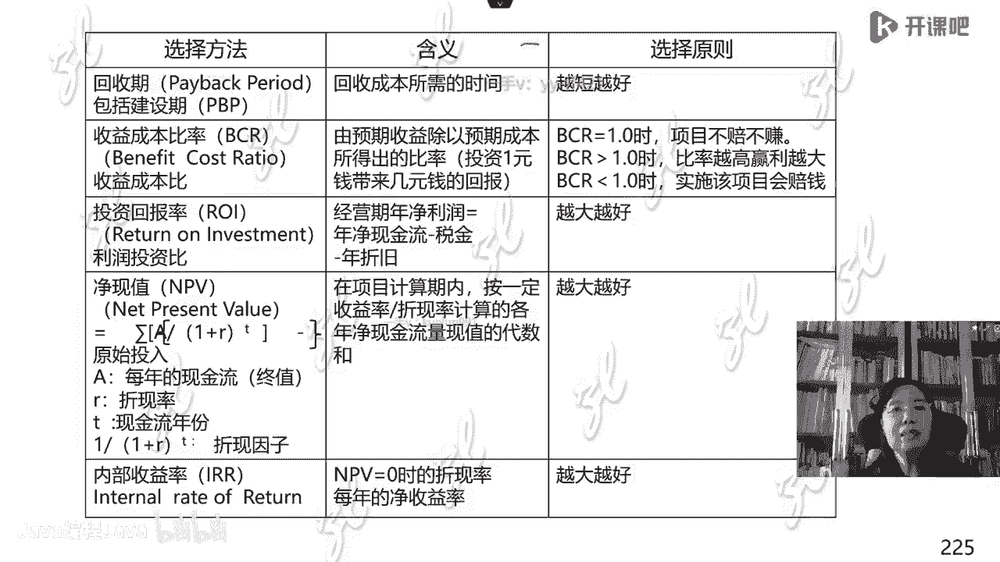

# -PMP认证4期 - P9：14-项目管理过程-整合【itjc8.com】 - OA工作流 - BV1yY4y127aU

新年好神经蛙是吧，早上好神经蛙是吧，好学员们早上好啊，今天的课程呢就要开始了，开始之前呢，进入直播间的学员还是按照惯例检查设备，做好学习前的准备，如果都做好了呢，在直播间刷一个，一来告诉老师。

老师也会看一下哦，昨天做题错了好多，很正常的，因为刚一开始啊，我们不太习惯，不太习惯他的这种做题的思路思维啊，后面还会有老师给讲题啊，错题呢还有一个原因，可能我们对这个体系啊还是不够熟悉。

看一下这个书籍啊，还是得复习预习，先别着急啊，好的好的，谢谢啊，是在喝水，因为北京这几天降温了，降得很冷很冷的，然后家里又没有来暖气，然后我这个书房呢，我是为了怕咱这个电脑呢过热会出问题。

所以就也没有开空调，所以这个房间还是有一点点冷啊，哦不知道学员课后做的哪些题啊，有一些题目确实不要乱做，要听这个老师的引导，还有些题目呢它的答案给的呢并不一定都合适，所以按照咱们啊班里的安排嗯来做题。

当你这个把班里的计划，把班里的题都做完了，有余力，闲得发慌了，你再去外面再找点题，为什么，因为那个时候你已经有一定的基础，了解这个思路了，嗯然后你再去做别的，如果你现在刚一开始啊。

还不熟悉自己这个体系呢，然后开始到处在外面找题，做这个设计，互联网上大家也知道，好多这个信息都不一定的准确啊，所以这样回会这个把你给引偏的，而且还会引起比较大的焦虑，这个就不必要啊。

先按照老师的这个要求，另外我们所有的题目呢，它基本都是整合类型的，虽然某些有一些知识点的偏向，但是它整体都是整合类型的，所以你刚知道个一点儿啊，然后你再去做那种整合的题目。

涉及到咱们没有系统梳理过的东西，可能这样会正确率会低一点啊，这没关系的，还是要按照计划走啊，不要着急啊，好的，新进入直播间的学员呢，我们的课程快要开始了，大概还有三分多钟。

所以还按照惯例检查自己的学习环境，网络环境，音频视频是不是能听到，然后做好上课前的准备啊，比如说记录啊，笔记啊等等啊，都准备好啊，准备好了就刷一个，一老师可以看到有多少学员已经做好了准备啊。

有问题的学员，网络有问题的学员自己去调试调整一下嗯，让你的学习环境呢具备这个认真上课听讲的啊，感觉还有没学过的内容对的，因为他所有的题目呢都是都是这种综合性的，整合性的。

因为我们前面提到过项目管理是系统工程，是一个结构化的东西，所以它是完整的啊，你有了某些地方的这个缺失，所以你答那些题的时候，思路啊就啊可能到不到，到不了这个题目所考核你的点子上啊，就容易出错。

所以别太着急啊，我们的课呢其实也是在紧锣密鼓地在这样进行，很快呢就会把所有的东西都梳理一遍，首先你先听过一遍，然后再反复的复习，所以不是特别的着急去做题，到时候集中精力啊，做题一边做题一边看书。

不能以题代学，说的像中国的这个考试一样，题海战术，我就光做题，我不学这个知识，我也不学这书里的东西，那还是不行的，因为人家这个考试主要考的是能力嗯，考的不是你背书的那种，死记硬背的这个这个做法啊。

而是考的你一种真正的项目管理能力，所以你得把这个东西都搞通，把这个理念都转一遍，都通了，都让他闭环起来，做题才有效果啊，不急着做啊，要关注这班主任老师发的这些题目。

都是按照我们自己的这种教研设计啊来进行了，来发的题目，好的新进入直播间的学员哦，一定要检查好自己的学习环境设备，然后刷一二对老师的讲义呢，那是怎么说呢，这个宇涵说的对的，但是你得真懂啊。

你是真懂还是假懂，只有你自己清楚啊，不是说你你是你，这就是怎么说呢，有很多学员在学习的时候啊，自欺欺人，有一个曾经有一个上海学生跟我说，他一天学十多个小时，然后怎么怎么样，我说你学习的效果。

说实在也不是全拿时间来衡量的，你十多个小时就坐那发呆，效率特别低，或者说根本就没学进去，那你一天20个小时也不管用啊，关键是得学通了，学懂了啊，如果不懂要跟大家讨论，咱们有班级啊，有群你问一问别人啊。

问问大家，不要闷着头，自己在那理解，自以为自己这个是懂了是会了，可能你有一些嗯误区误解啊，这个是需要跟大家讨论的，还有不到一分钟的时间，课程就要开始了，请学员们尽快的做好准备，检查好自己的上课的环境啊。

今天我们的学习任务很重啊，好的时间到现在我们的课程呢就开始了，今天到第五天啊，也就是345，这三天我们开始学习项目管理过程，这一部分也可以叫项目管理流程，那么这些流程是怎么来的呢，是标准化的结果。

流程是标准化的结果啊，这个世界上因为这个体系是向全世界开放的，全世界有志于项目管理的实践者，就是最佳实践者啊，他们分享了自己的最佳实践，经过梳理，还有一个专家团队，然后呃限定在这个管理框架管理体系中。

在这个管理体系中梳理出来了，有这么多的管理过程啊，要按照这么多的管理过程走一遍的话啊，按照这种标准化的做法走一遍的话，就相当于我们是规范的进行项目管理的，那我们项目管理的概率啊。

成功的概率就比你不按照这种做法做要高啊，是这个道理，那么这些流程就是这么来的啊，所以从今天开始呢，我们要学习项目管理，在第六版书里给规定的是49个流程，49个过程啊，49个过程在这三天的时间里。

我们都要详细的梳理一遍，要稍微细一点，如果不细，可能大家回去再看书，负担就会比较重啊，我这个地方尽量给大家梳理的细一点啊，那么所以我们就按照这个架构开始来学习，这就是流程这么来的。

之前记得有学员问过ip地，就是这个华为的ipad，从ibm学来的ip地，其实异曲同工都是同样的道理，什么呢，ipad也是标准化啊，把你的那个网络片段啊，都把它变成标准件，将来你需要的时候往上一插就行了。

就像货架式的管理标准，一个一个流程，就类似于我已经总结出来了，按照这么做的这样的经验，将来我做的时候呢直接按着这个做，不要呢，没有规矩啊，没有一个规律，到时候新来一个项目就心乱撞。

我们都知道项目都是临时的，单独的，每一个都不一样的，来一个就乱撞，来一个就乱撞，撞成了，就算我成了，撞不成就稀里糊涂了，那我们那个是无意识的管理，流程管理呢是有意识的固化的管理啊，之前咱们也说过了。

所以这个流程管理是重量级的项目管理啊，也就是预测型为主的项目管理，所以我们在这三天的最后一天，留出相当一部分时间要讲轻量级的管理，但是你重量级的不知道你轻量级的管理，它是针对重量级来学习的。

所以我们不能先讲轻量级啊，要先讲重量级的管理好，现在我们开始啊，那么第四部分就是项目过程管理，那它的大纲是比较简单的，这个重量级管理的项目管理框架，就是五大管理过程组，十个知识领域啊。

这之前有预习的学员都了如指掌啊，心里都很清楚了啊，好的，我们再看看这个项目管理的结构或者叫框架，再强调一遍，再书上第25页啊，它横着的这个坐标是五大管理过程组，纵着纵坐标安排的是十个知识领域。

在这个平面中，他装入了不同的过程，在不同的坐标点啊，有不同的过程，那我们的这个讲解是按照这个表格，横着来讲的啊，就是第四章啊，知识领域啊，讲完了第五章，第六章这样横着讲的，那么学员一定要听过一遍课以后。

竖着看一遍书，比如你看了4。1，你再看13。1啊，那么在你的脑子里就有一个概念了，就把这个经纬给支起来了啊，我们是按照横向这样来讲解的，按照这个顺序来讲解的啊，好的，那么我们开始学习过程之前。

要给大家介绍一个东西，在十大知识领域，每个知识领域它有一个前沿，p m b o k第六版啊，那么实实际上在就是这个第六版之前，前五版我们的老师就是我们自己的老师，就是这么上课的，到了第六版。

我估计啊这个专家也借鉴了我们的经验，是这么安排的了，以前第五版之前他不是这样的啊，每个知识领域之前前言，他都介绍这么一段东西啊，每一个都是啊这标准化的，也就是他这个知识体系的讲解也是标准化的，第一部分。

每个知识领域都有多少个过程，这个过程大致都是什么意思啊，做一个简介，第二部分，每个知识领域有哪些核心概念，如果你搞不懂，那么这一章就不太好学，第三个这个知识领域，因为我们整个的这个项目管理。

一直在动态的演进发展之中，那么这个知识领域，未来它有什么样的发展的趋势，和一些新兴的知识的诞生和新兴的一些实践啊，这是第三个，第四个，那么这个知识体系应该怎么去考虑剪裁因素，虽然他这些标题都挺好。

但是它里面的内容啊，有一点就是不够精炼，或者说说的也不够明白，比如说这一章怎么考虑剪裁啊，他基本上每一章都是一个套路啊，回头我们统一说一下关于剪裁的因素啊，最后一个他又对不伦不类。

在这种重量级的项目的流程管理的啊，这个最后一部分又说了一个敏捷和适应，怎么考虑这个内容，那敏捷的适用他不是这么考虑的，你愣把他往一起扯啊，所以特别是后两块不是特别合适。

所以第七版呢他就重新呢有一些改动了，那老师在这个讲解的时候会给大家一定的引导，现在我就说一下关于剪裁嗯，剪裁是什么意思呢，叫做你把这个标准化的东西，要跟你自己的实践相结合，因为这49个过程相对固定。

可是到了你自己的工作实践中，它不是一个一成不变的东西，你不能按一个固定的东西，反正你就这么做，因为有很多实践者向pmi反映，所以你这东西学起来确实挺好，但是到我们这地方根本用不上，因为不是这么用的啊。

我们拿你这些过程，好像我们会有一些新过程，用你这些流程用你这这些过程在我这里不好用，是不是都不好用呢，也不是有的好用，有的不好用，实际上这就体现要会灵活的剪裁，应用剪裁并不是指的简报。

如果一个一张报纸啊，我需要这个我从上面开一个窗口，开一个条拿来用，不是简单的复制粘贴，而是这种理念用到我这儿，我去做一些改良，你可以改良组织结构，可以改良啊，项目工作可以改良这些知识体系。

特别是各种特殊不同的行业，可能就不会按照你这个做，比如生物医药行业，石油工程啊，这种打井的这个行业，他有些就不能按照这种通用的做法做，他有很多自己所特殊的地方，那你就加过程啊。

这个标准不是说不允许你加过程，不允许你删减过程，有的我不适合，我就不用它，这叫剪裁，结合自己的实践，你可以有所删减啊，甚至每一个过程我也叫这个啊规划什么什么，但是我规划那些做法。

跟你的通用标准里可能有差别不一样，这都是不允许的，但是我们在学习的时候呢，一定是有一个固定的城市的啊，叫做因地制宜，老师啊也讲了最后一部分关于敏捷适应环境，我基本上啊不会在这个课程的中间说。

偶尔会提到一些啊，那么它会放到咱们最后一部分，形成一个完整的体系来讲，因为敏捷他是另外的一种思路，或者叫另外的一种管理，你愣给他塞到这里面来啊，你哪个都说不透啊。

所以前三个呢可能是咱们学习的主要的东西啊，我们作为一个说明，先说到这儿，关于剪裁，刚才我做了一些讲解，现在大家可以再看看这个图啊，这个图形写的是剪裁，你可以采什么呀，可以选择开发方法。

是预测还是适应还是混合，关于组织你可以剪裁，比如说到底公司需不需要pmo，需不需要这个啊，这样的一个部门政策和法规治理啊，我们的这个组织结构啊，第三个根据项目我们可以删减相应的过程。

第四个在检查和适应这个环境，一定是要形成一个持续改进，就像pd c循环一样啊，所以这是剪裁的一些基本的东西啊，我们就说到这里啊，然后我们看一下项目管理整体的发展趋势，未来的发展趋势是什么呢。

越来越强调使用信息化啊，自动化的信息系统，在这个体系中强调它叫p叫pm i s直译啊，项目管理信息information system系统，项目管理信息系统，用这样自动化的项目管理信息系统。

因为在项目管理中，有大量的跟踪数据过程的文档形成，如果你全都用纸质的这样的管理的效率太低了，特别是咱们又强调要积累积累组织过程资产，你都弄一个这个档案室，库房存了大量的那些纸质的东西又不好查。

用的时候又特别麻烦是吧，所以要强调用这种自动化的系统来进行管理，但是据我所知，目前全世界比较好用的项目管理信息系统，也确实都在西方，但是到咱们这来又不一样啊，因为中国的这个项目跟西方比呢。

它差距嗯还是不是一般的大，不是说我们差啊，是指的这个不同很大，是因为我们有我们特别特殊的地方，特色的地方啊，呃比较著名的这个呃项目管理信息系统，过去有这个p3 p6 啊，都是哪儿呢，oracle开发的。

买一个这个信息系统，非常非常的贵，买回来以后呢，一般来说都不能直接使用，还需要二次开发，还需要结合自己的实践再开发，所以有一些公司呢就自己会做一些小的系统，当然需要财大气粗。

因为我作为评委呢去帮一些公司评论，评过这个东西啊，国内也有一些公司啊在做这个系统的开发，当然这个价格也不菲啊，可能是得有实力的比较大的那个公司才行，你比如说我给一些这个核工业，核工业部。

他们做的这个信息系统，做的还是真的是特别好的，我以前也给他们提过，让他们向国民经济，其他的这些小公司做一些普及，能不能把价格降下来啊，便宜一点，让大家都用得起，但是人家也是一个企业。

人家主要是为自己服务的啊，人家的使命也不是说都为整个社会服务啊，还有呃，北京呢也有一些就是开发项目管理信息系统的，但是我都接触过，感觉呢都不是特别好啊，另外还有一款嗯这个软件是一个办公软件。

微软的project软件啊，它可以做一些简易的啊，这个项目管理的一些内容啊，包括范围进度成本啊，这里边基本上就有了，当然它这里边软技能的这个比较差，比如说沟通啊，呃和这个风险呀。

他那个软件做的不是就是不能涉及这些，另外呢project软件不支持协同办公，他是每个人单做完了，还有人给集成整合在一起，这个也是特别麻烦的事啊，所以这跟大家做一个说明啊，有一些公司这个实力比较弱啊。

他可能就会选用project这样的软件，虽然功能弱一点，但是呢它成本低啊，也用得起，这是第一个趋势，第二个趋势，项目管理越来越采用一些可视化工工具，比如说在办公室，在会议室做一些那些作战图啊。

做一些作战图什么，这个挂一些图表，让大家一目了然，就这样，不要那个大部头的规章制度锁在那，要想看一个东西，那么多的文字看起来就费劲啊，呃这个管理界呢有一个说法，叫什么意表或者叫意图意图啊，意图抵千字。

意图给抵签字，所以尽量用这种图表可视化的东西来表达，你写了一大堆东西，别人还得转化消化去理解啊，这是未来的趋势，第三个越来越强调对于项目管理，这个过程里边形成了各种各样的经验，知识的沉淀。

嗯要进行知识管理，不然的话你就亏死了，就别人都利用了你的东西，你都那个那我们现在也看到一些资料啊，什么日本人呢，韩国人呐研究中国的中医，然后再反过来给中国人服务，收中国人的钱。

那中医都是咱们中国老祖宗的东西，为什么你没有知识管理呀，人家注册这个商标，注册那个商标，把一些中药的名字，人家都注册商标了，说这个就是你知识管理的失误，明明都是你的东西，最后搞得中医算哪儿的呀。

中医中医嘛，他说中都是中国的东西啊，最后人家韩国日本去卖东西啊，卖这个东西去做，所以要注意这个知识管理，把自己的这个东西留下，对西方人来说，这个就是你的金饭碗，是财富啊。

不是这东西好像我们都日常都发明完了啊，有这个好像天经地义的归你用，那可不是等你再用的时候，别人都弄走了对吧，然后人家要注册一个商标的话，将来你需要这个东西，你还要哎还有一些咸菜对吧，酱菜等等啊。

什么酱豆腐等等这些东西，可能大家都见到过这样的案例，那我们在项目管理中也需要这样啊，这是第三个，第四个未来发展的趋势，增加了这个角色项目经理的职责，所以现在对项目经理的要求有一个格局，过去可能就没有。

你把那个具体的事情干好了就可以了，现在不行，希望你有高度，因为你站得高，你看才能看到全局，看得远，第五个越来越强调，不是说单一的方法能解决综合性的问题，一定要用符合的或者叫混合的方法啊。

所以这是未来的发展趋势啊，就项目管理越来越朝着这个方向去调整，以后出现什么新版本的啊，这样的知识的更替或者叫迭代，可能都是朝着这几个方向走的，大家可以关注啊，好的我们进入第四章的学习。

今天我们计划学三章，整合管理，需求管理和进度管理，项目管理我之前说过有四大专有技术，传统的项目管理啊，一个叫做生命期理论，我们已经学过了啊，一个叫做w b s，一个叫做啊这个呃关键路径法。

还有一个是增值管理，那么这四大技术里面，今天我们可能会涉及两个啊，一个是w b s，一个是关键路径法，所以今天的任务还是蛮重的，我也要看大家的这个接受程度，如果确实跟不上的话啊。

我们就今天会拿掉一部分知识，明天呃就下一次课，我们再把它展开讲啊，但是第四天我们肯定都能取平了，没有问题啊，所以看大家的程度，大家如果能够接受，我们还是按计划进行，如果接受不了，接受起来困难。

那我们就调整一下啊，我们的这个嗯计划你看这个就叫跟实际相结合，所以每一个班你听的这个进度都不一定一样，因为跟大家的情况是配套的啊，好接下来我们看我们这个学习，也按照标准化的学习。

每个知识领域都是这四个标题，第一个基本概念，第二个由于项目管理是目标导向的，或者叫目标管理，所以我们从这个过程的目的入手来学习啊，第三个我们把项目管理的过程展开扩展啊，就是指南的部分了啊。

最后一个做一个小的归纳，小的总结啊，按照这样的步骤来学习，首先我们先学习的是项目管理的核心概念，基本概念，什么叫整合呢，现在出现在版面上的这一堆字就是书上的，我从书上抄的，那你都认识字，你自己去读啊。

我就不在这儿念这个字了，给大家举个例子啊，整合它整合什么呢，嗯是整合咱们管理中所需要的所有要素，把它放到一起统一管整合不是混合，不是简单的1+1的叠加啊，它是把这些要素融合在一起的，比如给大家举个例子。

2015年啊，下半年的上半年有一个北京青年报的记者，他在北京青年报的头版上，大家懂得新闻媒体的都知道，头版都是非常重要的信息，嗯那么在头版上他发表了一个一个一个小文章，这文章有一个感慨。

他说你看北京人啊，这个卡太多了，就兜里的卡太多了，把我们自己用的那些卡包啊，钱包都撑坏了，都装不下了，那么多的卡，那能不能所有的这个卡合起来，就一张卡全都解决问题呢，提了这么一件事啊。

实际上咱们有很多学员也是搞信息技术的，从技术上来讲没有难度可以实现对吧，那你看我们兜里都有什么卡呀，水卡电卡，煤气卡，银行卡，银行卡都不止一个，假如你换的工作多，有的单位要这个银行的卡。

有单位要那个银行的卡啊，你弄了好像也不愿意去注销，有的呢一个银行好几张卡啊，一个这个借记卡，一个工资卡，一个信用卡啊，就整了就好多好多的这种卡啊，然后你坐公交又有公交卡，有的地方的地铁还有地铁卡。

还不能还不一样啊，有的地方出租还弄一个什么什么卡啊，搞的这个卡就很多很多，有的时候都得找一会儿啊，翻译一下哪个是哪个都不要弄错了，就这么复杂的东西啊，那么把它们合成一张卡可行吗，他们就是一张卡。

他也没有身份证，这个也代表你的身份嗯，他说你去你单位，单位还有食堂卡，小卖部买东西的卡，一整整了一大堆啊，那么把这个所有的东西集成在一张卡上，专业技术上是可以做得到的，但为什么不能做呢。

因为这每一个卡的背后都是不同的管理职能，不同的管理职能都有不同的利益和管理规定，你把它都弄在一起，那管理规定不一样，怎么加在一起啊，谁整合谁呀，银行我有银行的管理规定，我怎么能跟你那个汽车。

火车的东西给你整一下啊，那整不了对吧，那我交通运输呢，要是我这样的规矩，我怎么能跟你那个社保卡怎么能混到一起啊，那混不了都有各自的管理规矩，所以每一个卡背后都是不同的职能主体。

都有职层主体不同的管理规定和利益，所以他不好实现啊，这就比较难了，那什么时候把这些东西都捏在一起，一张卡刷什么走什么自动的这样分流啊，这就实现了整合在信息化这个系统啊，叫什么集成。

嗯支付宝确实在极大地实现集成啊，是一个真是一个很好用的东西，你煤气卡什么都在里边，但是我为什么不提支付宝呢，因为中国的呃很多职能的管理呢，它是国家行为，是政府行为是吧，你支付宝能不能承担起这个来。

就最后它的发展和走向到底是什么样，这个国家其实应该做这个事儿啊，啊那是15年的时候啊，记者再提这个，所以你看你只有一个东西，这个做的什么就是集成，就是整合，所以大家就理解这个内容了啊。

我刚才用一个社会问题来说这个事儿，回到我们项目管理中，项目有十大知识领域，每个知识领域背后都是不同的职能部门，你看谁管范围，谁管进度，谁管成本，谁管质量，在你们公司。

是不是都是不同的职能部门在进行管理啊，谁管采购，谁管设备，管资源啊，谁管那个办公室会议沟通，这都谁管，是不是都不同的利益主体啊，那么这个角色是干什么的，你就要做整合，你要想办法把不同的利益主体捏在一起。

整合在一起，目的是让我把这个项目做成，如果我们每一个事儿都找一个职能部门，那就没办法了嗯，所以这个项目经理呢，要把所有的职能当成一个整体，干嘛呀，整合在一起，这个叫整合，这就是你的工作啊。

那么项目经理最主要的工作就是整合，听起来好高大上，多难呀，就一个办法，唯一一个方法叫什么沟通，协调，你只要沟通协调成了技术实现，那是另外一回事嗯，所以你做的很多的工作就是沟通协调。

把所有的这个知识领域捏在一起，整理在一起，我这个项目就好成功了啊，这是项目经理的主要工作，所以整合啊特别的重要诶，你看有些人说了无数卡啊，无数的会员，但是我们知道现在有这个嗯微信啊。

你比如微信那里边就有一个卡包啊，你可能把所有的卡可以加在那，那个不叫集成，不叫整合，那是一个存放的地方啊，各个不同的那个会员卡放到那，至少减轻了你兜里的那个钱包的那个厚度啊，他可以直接搁到那儿了啊。

是一个电子卡包啊，它是方便找卡，但是它不见得能够实现啊，多卡合一，其实在美国呢有很多嗯事情呢，你就不需要那么多啊，他就是有一个社会安全号码，身份证都没有，你一报，那小孩生下来就有那个社会安全号码。

你报那个号码，你比如说你在银行啊存钱呀，然后你这个你的账是怎么走啊，你的个人诚信的记录，都会在那个号码的统领之下啊，但是这些年呢美国就穷兵黩武，到处打仗了，自己这个东西发展的也很慢，他不是没有技术。

他的精力没放在这儿啊，所以他的信息化程度也很差，嗯还不如咱中国，我在那个地方，我16年去开车竞走错路，因为我用他那个导航嘛，等你都过了那个路口了，他说你右转我都过去一站地了，到哪右转去啊。

所以就那个东西都特别慢，做起来也都不如最早我们接触美国的时候呀，真的是很吃惊啊，那个都是另外一个世界啊，觉得很好很好，现在呢中国的信息化程度比他好多了啊，因为他不注重自己的这个建设。

他把眼睛全盯着外边了啊，他以为把别人打下去，他自己就是优秀的最好的了啊，这个咱们不再多说了啊，继续，那么我们学习第二部分了，叫做项目管理的这个过程，过程的目的哈，这个知识领域是整合啊，它一共有七个过程。

分别属于五个管理过程组，大家就想那张那个图表啊，那么这其中有两个管理过程组，一个是执行过程组，一个是监控过程组，分别这里边装着两个过程，其他的过程组呢都是一个过程，只有这两个装着两个过程，这说明什么。

有学员老说，老师你给我画重点，不用画美国人的书，自动你就能看得出来，重点说明你看本来这个执行过程组，我们在整合嘛，基本上整合成一个就行了，为了体现他重要，单独拿出来讲解啊。

监控过程组为了体现这个变更的重要，单独拿出来讲解，所以这两块就是重点啊，这是跟大家说的好，接下来我们看每一个过程的目的，顾名思义，你要把这个过程都学懂啊，这个4。1过程叫制定项目章程。

从你自己对这个汉语的理解上，这构成做什么呢，它什么结果呀对吧，是制定一个项目章程啊，他最终的结果是拿一个这个文档出来啊，叫制定项目章程，这个章程是项目管理中比较重要的文件，项目管理文件嗯。

所以这个过程呢就拿这个东西出来，那这个文件上面有什么，我们后面再讲啊，第二个过程拿这个东西出来，项目管理计划，你看这两个构成可没合在一起啊，一个是拿一个最重要的项目管理文件。

一个是拿一个最重要的项目管理计划，所以文件和计划是不一样的东西，从内容上本质上作用上都不一样，文件就是这个项目所对应的，唯一的一个指导性的东西，一个文档项目管理计划是一个制度，规定。

嗯也就是怎么样去管理我这个项目呢，一个管理的要求规定，在做项目之前先把这个规定说好，弄好啊，这里面包括12个子计划，还有六个要求，我常管这个叫12+6，当然了。

这12+6对应的是第六版的p m b o k，以前的或者以后的，不是这样的啊，只是针对第六版，还有12+6个内容，但是是要整合在一起的，不是12份六份啊，18份我拿着订书钉一定不是这概念。

是要有这些方面的内容组成的，项目管理管我这个项目的规定制度要求，将来我不知道怎么干了，我就看这个计划，计划相当于衡量一个项目的尺子，你先把尺子给做好啊，然后你再按照这个要求来进行项目啊。

接着就第三个叫指导与管理项目工作，这是执行了干嘛呀，按照这个标准，按照这个计划把目标实现，在这个过程中，计划赶不上变化，又变化了，进行变更管理，申请变更管理嗯，然后咱们这样来进行啊。

第四个过程进行知识管理，不断地在执行过程中，利用已经公司已经有的经验知识，生成新的知识，也就是你每一个项目都要有收获，都要一个新东西，不是稀里糊涂在那坐着的，所以这个人家这个西方人的项目管理啊。

你每做一个事儿，你就先得告诉我你有什么新的收获，新的东西，这个新的东西并不全部都体现在技术上，也体现在管理上，还体现在对人员上，你比如人有什么进步，你得给我都把这些东西都梳理出来。

那么通过这种方式建立一个学习型组织，学习型组织不是大家都坐在那儿学习嗯，而是要把自己有用的东西积累起来啊，形成一个一个永远保证这个公司啊，能够健康持续发展的东西啊，下一个过程，第五个过程监控项目工作。

虽然这里排的是第五，大家可以看到啊，我每个过程之间没有那个箭头，没画那个数据流动线，为什么管理过程是没有这样顺序的啊，第五个过程叫做监督监督项目工作，监督都做什么呢，都做哪些事呢，我给大家在这里写一下。

一定要做笔记这个地方啊，第一，跟踪，跟踪什么呀，跟踪实际呀是吧，你拿什么跟踪实际呀，拿标准跟踪实际，拿计划跟踪实际呀，计划就是要这么做，我看我实际是怎么做的，我们这做的是监控管理啊，这跟踪你跟踪了以后。

就需要实时进行什么测量，嗯拿尺子跟着实际一边跟一边量，一边跟一边测量，你这一测量就会看到什么偏差，去进行偏差计算，你量了啊，我可以告诉我所有的学员啊，应该可以说几乎所有的项目管理要素。

不可能你拿尺子量跟这个实际一模一样啊，那刻度都没有差别，不可能的，都会有偏差的，有大有小，有正有负，所以你要算出来，如果你见到一个谁量出来的偏差一模一样，一定是假的呃，我们到下面做专家去检查啊。

肯定是假的，没错这学员说的对，叫差距嗯，现在我们在做偏差的计算，先这一步先不管这个差距是好是坏，什么时候管呢，后边叫偏差分析，好你就分析了这个偏差是正的呀还是负的呀，偏差大还是小啊，是好还是坏呀等等啊。

这个再做偏差分析，然后在偏差分析的基础上给一个偏差评估，评价了一下，评估一下啊，刚才咱们说的啊，分析完了给他一个结论到底好还是不好啊，给他一个说法，这是第五个给出这个说法了，那接下来就要有。

决策或者叫小的方面啊，我们就说决定决策，那么这个偏差好怎么办，偏差不好怎么办，偏差大怎么办，偏差小怎么办啊，也就是是否需要纠正呢，嗯我画个问号啊，说是不是要需要纠正，是不是需要变更呢，变更什么呀。

变更是你原来的这个计划啊，那实际已经变成现实了，你不能变更了对吧，变更原来的计划是不是要纠正啊，是不是要变更啊，这是第七个决定啊，然后还要进行趋势分析，趋势分析，照这样下去。

我的这个项目到计划的那个完成的时间，是个什么情况，乐观的还是悲观的啊，第九个，叫做预测，这个预测不是规划，而是监控什么呢，在这个项目进行了这个节点，我进行啊偏差的评估，分析绩效的管理。

然后我就预测一下啊，到这个项目该完成的时候，前面这个八呢是趋势，它朝一个什么趋势走，第九个呢是我预测一下他未来的这个结果，他们两个有点类似，但是它也是不同的东西啊，最起码监控要做这么九大类的事情啊。

那么这个叫监控那些事儿，它比较多，比较复杂，以后我在后边的学习中，常常会说监控那些事儿就是这样一大堆，今天我们就把这个掌握了，就是监控的就是这些事儿来干这个啊，监控的这些事儿，这是第五个过程。

第六个过程，决策的对象嗯，是变更纠正吗，对就是你决策的对象，你到底是纠正呢，把它改一改呢，还是要给他变更啊等等啊，第六个，那么如果你要决策要变更怎么变更啊，变更怎么管理啊。

按照一个整体变更控制的流程制度进行管理啊，这是第六个，第七个结束项目或阶段，那么一个阶段末一个里程碑的点啊，和最终未来的这个项目把它关闭掉，所有的合同结束掉啊，之前我们都说过。

最重要的是这个地方要检查你的经验教训，是不是总结出来了，是不是归档这个过程是持续在进行这个工作，最后一个过程，4。7是我看看这些工作，那些资料是不是都收集齐了，是不是要归档了。

来干了这个汇总和复检这个工作啊，那管理项目知识自始至终都在，有新的东西就留下，有新东西就留下啊，那外国人说你要及时的生成，及时留下，为什么，如果你不及时留下，你就忘了，到明天就忘了，就这么简单。

就这么个道理啊，就是整个的整合的一个项目，管理的主要的这个内容啊，这是我们先过了一下啊，每个过程我把我刚才啰啰嗦嗦说的那些东西啊，啊列到这一个表里，这个表里的内容写的这个内容都不是我写的。

第六版的p m b o k书上的，但是它到处都有，都是散的，为了让大家学习方便，把书上的东西都总结在这儿，每一个过程的作用在这儿，但是每一个学员要学会用自己的语言来表达，像我刚才那样啊。

而不是照这个那邦邦邦念一遍，你不一定理解，一定要理解，你不理解，那你等于没学到没学会啊，好的，那么每一个知识领域，我把这个过程的作用都在这里列出了，我就在这不再讲了啊，我用我自己的语言先把它讲完了啊。

那么每个这个作用呢，给大家学习来背书一个资料啊，我们现在现在学习第三块内容，叫做知识体系的指南，我们开始扩展了啊，每一个过程我把它展开了啊，那么我们现在看一下我们学习的第一个过程，叫制定项目章程。

既然项目管理是一个目标导向的管理，所以我们学每一个过程的时候，先从输入入手叫呃，先从输出入手啊，叫起，建出支入用这种科学化的方法来学习，正着走这个输入工具输出有的时候有点晕，就不明白。

因为这是结果导向的，每一个过程到底要什么结果，你从这儿入手反过来学，那就效果不一样啊，这个过程制定项目章程，我们先看右边输出，他得到一个章程，还有一个假设得这两个东西，我们先从这儿开始讲啊。

然后再反过来再看输入啊，好的这个过程得到一个项目章程，什么东西是章程啊，好像中国人做这个项目不太习惯这个章程啊，给大家看一个章程的真实模板，美国人呢美国的一个真实项目i t项目的啊。

就是软件开发项目的一个dna测试仪，这个公司要给别人开发一个dna测试仪，刚一开始就写一个章程，章程是非常非常简单的，一般就一页a4 纸，它有几个栏目，第一个项目的基本信息，项目名称，售前日期。

开始日期，结束日期嗯，这是第一个最基本的信息，第二个项目关键的里程碑，我在中间6月30号的时候还设一个啊，最后都完成了，这个日期有一个第三个项目的预算，这个项目的发起人肯定是发起人给你的。

发起人给你150万，当然这地方都是美元啊，我就给他省了，没写啊，注意这个数是一个大概要的数，可适当增资，也就不是给死的，当然了，增资不可能再增150万嗯，也就是在这个150万上下少浮动一点。

150万主要干什么用的呢，都是人工成本，所有的硬件都采购，我们公司自己不做啊，这是这个栏目下一个栏目授权授权给谁的呢，授权给项目经理尼克的，呃发起人把这个项目授权给项目经理，尼克尼克，怎么联系等等。

这个号码项目的目标是什么啊，有时间12月31日，这是符合smart原则的，在这个时间要完成这个产品的开发，产品的功能要符合合同条款，呃，这个就是项目的目标，符合smart原则，可测量。

直播间里的这个学员啊，跟上老师的这个进度啊，基准怎么变，我们后面都会讲的，没到那呢，你着着着急，先学后面的这个，把这个拉掉了，要跟着这个走啊，先跟着咱们的内容走啊，那么项目成功的标准，项目当然做完了。

什么是成功标准，这里讲了要准时完成，要经过测试，文字一样，功能特性都要满足要求，另外注意由ceo来批准，是不是ceo批准了就算成功了，还不是要附上其他利益相关方，比如说客户啊。

嗯用户啊得附上他们的意见和建议啊，方法和人员这两栏非必须，章程里面不一定有这两栏，因为如果项目持续时间过长的话，那么人员他也是在变动的，还有这个方法他也不一定就是固定的，当然你就写在章程里。

他也没什么问题，但是你没有这个也是个章程啊，也是对的，一定要注意，最后这个栏目一定要有签署人授权的发起人，你得签名，项目经理，你揽了这个项目的话，一定要承接这个项目啊，就是要承诺你签了这个字。

就要对这个项目负责，最后一个其他利益相关方都有什么意见，所以章程是一个粗略的简易的，或者叫做高层次的需求，高层次的需求啊，是这样的啊，所以这个那个学学员嘛，你要跟上我这个速度哈，或者跟着我这个课程。

你现在咱们学这个一讨论别的，我告诉大家，项目当中在考试里面涉及很多题目的呃，你你你你最后这一段没听着你跑的变更变更，一会儿我们会花时间讲的啊，别着急啊，刚才不是给你那个目录了吗。

后面专门有一个过程是讲这个变更的，大家别急啊，一步一步的走，这就是项目章程，那么还有一个东西是输出假设日志啊，假设日志是重要的输出，什么是假设日志呢，那么就是在这个上面要记录两个内容的东西，一假设条件。

二制约因素，假设条件和制约因素的区别，也经常直接出现在考试题里，老师高层次的呃，高层级指的是公司架构的高层吗，不是是指的项目项目的高层次啊，项目的高层次需求什么呢，就是下达给项目经理的时候啊。

高层次给你的那些要求，有的公司在这个大型的国有企业里边，这个章程也叫什么呢，目标责任书给你，这不是高层对你的要求吗，所以都是高层次的需求啊，不是你项目经理自己写出来的东西啊，因为我们还没说到那儿呢啊。

一会儿再说嗯，刚才项目章程里有s o w吗，工作说明书，工作说明书是项目章程的前端，也就是客户需要的东西，那是客户写的，现在项目章程我们还没说到，那就把它打断了啊，先把这个说完啊，再说大家的这个问题啊。

这个假设条件日志里边有两个内容，一个假设条件，一个制约因素，什么叫假设条件，假设条件一啊，就是假的，我在做目标做规划的时候，都会有这样一些假设，他需要在实践中真正做的过程中，被证实或者证伪。

证明它是真的或者是假的，比如说我们公司选了一个项目，在伊拉克啊，做一个什么项目，然后我们的假设是伊拉克政局稳定，领导人跟我们的关系好啊，这这不是假的吗，啊你做着做着项目在那i s i s了。

这个恐怖组织在那闹了，所以你这个政局稳定的这个假设就被证伪了，就不是真的啊，这叫假设，那你在做项目之前，你并不知道他后面会怎么样是吧，所以你说的说的这个假设，要一条一条一条的记在这个日志上。

这一大模块啊，叫假设条件，第二个制约因素，制约因素是真的，什么是制约因素，刚才那份项目章程给你150万，是不是制约因素啊，让你12月31号完成，是不是制约因素啊，给你人员，这个项目组就给你三个人员。

这些都是制约因素，这是真实存在的呀，真的啊，所以这个区别一定要搞清楚，到时候你会蒙的，一考试就蒙了啊，那么要单独列这么一个东西在一个文档上，当然也有的公司有的项目，这两个东西是一个文档合二为一的。

为了体现对假设和制约因素的重视，可以单独拉一个文档，你就写在项目章程里也是对的，也要写在这里边的啊，所以这是输入输出啊，输错了，这是输出好，大家想为了得到刚才我展示了那样的输出，需要什么输入呢。

需要什么东西呢，需要什么输入呢，这才讲到这个输入啊，有些人就跑到前面来问了，输入第一个叫商业文件，就是可行性论证报告，因为这里面论证完了有项目的目的目标对吧，商业论证再往前有sw。

这个是外部的客户写给我们公司的，也就是人家客户要，这是statement of work啊，叫做工作说明书，那个客户说我要我要我要我要这个，他要了，我们进行可行性分析，你要这个可行吗。

那这步骤是这样的啊，所以那s o w在那呢，我现在讲这个地方，你不要跑到，那你跟着我这个思路走啊，那么在这个商业文件里有两个比较重要的文件，一个叫商业论证，一个叫效益管理计划啊，还有我们输入这个东西。

在这个章程制定的时候，要输入那些协议和合同的内容，我先说三和四说完了，因为每一个过程都有三和四啊，或者类似这样的输入什么呢，事业环境因素，组织过程，资产这些概念我们之前都已经讲过了啊，大家都了解了。

你每一个过程都有这两个输入，因为事业环境因素是一种，不以你的意志为转移的公司的那种氛围环境啊，你不要他也在输入，它制约着你做项目的灵活性，项目管理的一些潜规则呀等等，都属于这个之列，组织过程资产。

假如说公司有这个项目章程的模板，你拿过来一用，这不就输入吗，给你用的呀，啊所以这个这两个输入呢是每一个过程都有的，尽管你在后边的过程里看到，有一项可能没写某一个啊，写了一项有一个没写，他也有啊。

只不过人家没有强调而已，所以我们重点说的是这个一和二的输入啊，一和二还是非常重要重要的啊，第一个叫做商业论证，商业论证就是可行性分析，可行性分析从哪些方面展开呢，一个是需求，商业的需求。

在我们书里给了这样七个方面的需求，他也没有穷尽，因为我们之前说过了，只要有一点点小理由，有一个小需求就可以做一个项目啊，不仅是市场啊，组织啊，客户啊，技术进步啊，法律啊，生态啊，社会啊等等啊。

它并不是封口的，各种各样的需求都可以带来项目，所以你商业文件啊，可行性论证报告要从你这个项目为什么立得像，你把那个商业论证呢，是从哪个方面啊，你立得像做一个论证，这是第一大块啊，这个比较容易理解。

第二大块要进行肺效鼻，费项比分析或者叫成本效益分析，这个成本效益分析有点麻烦了啊，成本效益分析，往往我们也管这个叫项目选择方法，我选这个项目的时候，要用成本效益进行来分析啊，那成本效益分析有两大类啊。

分析方法一类其实啊真正是三类啊，但是我们只讲两类，因为最后这一类呢它不单独使用，它跟前面我们说的重点，这两类配套使用啊，哪两类，一类叫做非数学的模型，一类叫做经济计量的数学模型，顾名思义。

非数学模型不用算叫做定性的分析啊，数学模型需要算是定量的模型啊，这两个模型还有第三个模型在这里叫评分模型，它就是给定性分析，定量分析这两种方法做辅助的，干嘛呀，给他加这个权重加权模型啊，你定量算了。

这个数算出来了，但是根据不同的项目，我可以给他加那个加不同的权重，所以第三个评分模型我们不重点展开说嗯，只说前两个，一个叫非数学模型，一个叫数学模型，非数学模型比较简单啊，或者说他讲解起来容易讲。

所以我们先说非数学模型，非数学计量模型就是选择项目进行商业论证的，模型很多很多，但是在我们考试中涉及到过这样几类啊，第一个叫圣牛模型，圣牛模型啊可能听起来好高大上，好难呀对吧，这个西方人啊，他挺有意思。

他们是那种比较追求浪漫的民族，他有个什么事呢，他就起个名字，命个名来做这个事儿啊，那什么叫圣牛模型呢，我们经常啊会这个见到这样这样的事情，但是我们就没司空见惯了，我们就不善于给它起个名儿啊。

什么叫圣牛模型，圣牛模型就是指的，最大的这个大牛他是管理公司的，那么他在选择项目的时候，啪一拍桌子，一拍大腿，做出一个决定，咱就上这个项目，可能有专家跟他说不好啊，这个又不赚钱，又不怎么又不怎么样啊。

会说这个，那么但是他说你别管公司是我的，因为我是大牛是吧，我就做这个决定就要这么做啊，不管什么理由，什么道理，我喜欢就这么做啊，因为他牛啊，所以这个就叫圣牛，不知道大家听懂了吗啊，见没见过圣牛啊。

见过圣牛吧，选项目的时候就个人主观意志啊，这个叫圣牛模型，因为他牛，所以叫圣牛啊，第二个战略啊，或者叫这个叫经营需要，同时也叫战略，需要，啊战略需要模型，对老板说了算豪横啊。

有的学员就是老北京话叫豪横啊，那么第二个也是公司中位高权重的大牛，做出的东西啊，好的啊，大家有好多疑问啊，一会儿我先把这个讲完整了，再给大家回答啊，那么这个战略需要模型，战略需要模型跟省油模型。

虽然它相同的地方，管理层啊，决策层一拍桌子做出的决定，但是战略需要模型，经营需要模型，它是有理由有原因的，嗯不像是这个圣牛模型，我就说了算，你们就别管什么理由，没有理由，没有原因，我也这么决定啊。

那么这是战略需要模型啊，那么战略需要模型的一个很好的例子，中国呢咱们国庆刚刚过去啊，中国49年解放50年的上半年，那他是当时中国绝对的第一大牛啊对吧，汪又拍个桌子干嘛，我一定要有自己的核武器。

我有自己的原子弹嗯，但是他不是圣牛模型，为什么他做出这个决定，觉得你这是非法的，一水儿的都对中国进行制裁，从各个方面啊进行封锁和制裁，这就算了吧，还给你进行什么核讹诈，核威胁，美国人说了。

我在日本扔了两个啊，你给我等着我，这还有呢，我记下一个就是对你的嗯，我就是对付你的，一直就有这种有一把这个剑啊，挂在中国人的这个头上，你想啊这个时候的领袖他是什么心情啊，什么心态啊是吧。

那个时候提出的口号，备战备荒，为人民的一直就是准备着随时准备着打仗，随时准备着你来欺负我们呀，我很小的时候都做过那些演习呀，家里的窗户都贴成那种米字形，因为那时候的他很愚蠢，都不懂吗。

就以为那个说这个原子弹的爆炸的冲击，威力特别特别大是吧，把那个窗户上用那个纸条玻璃窗啊贴成米字形，说那个冲击波来了，那米字形不容易，那个说这个原子弹要来袭是怎么躲啊，所以这个大家可能都知道啊。

反正北京啊到处都是防空洞，因为我们在大的单位就是大院的这种，我们大院里哪是房防空洞的入口啊，这个家长都去挖，孩子们也都跟着帮忙去挖，什么时候来了，一有什么警报，怎么去钻，那个时候都是这种状态啊。

嗯在备战备战呢，所以是战略需求，那个时候呢苏联老大哥说，哎呀你中国人你不要原子弹，你不用搞原子弹，你懂吗，你你你有物理学家，你有懂物理的吗，你有钱吗，这东西是烧钱的，得有钱，得有这个知识文化。

你说一一大把子百分之八九十的人都是文盲，你搞得了这玩意，你搞不了，你不用弄，你听我的就行，我罩着你们这帮小兄弟，你只要听我的话，按我的这个重那来事，我替你铲平，都是这个思想啊，过去呢中国也想的是啊。

按照他的这个做法做，跟做国家是同样一个道理，你有求于别人就要付出代价，人都不是那么好求的啊，不是那么白来的，都是需要有代价的嗯，你都要听我的是吧，他那种大国主义人家也富裕啊，工业基础也雄厚雄厚啊。

科学家也多呀对吧，那你确实是不行啊，啊人家就是一种那种居高临下的那个状态对吧，你听我的，你的政治安排要听我的，你看我们中国现在就是这样的啊，然后这个人选他也要提对吧，然后你这个东北的煤煤矿过去。

日本人打走了，你们都不会弄，然后我们去帮你开采，就我占一个多少个股份，哪个哪个地方，要不然我给你来个军舰给你保护，你也没有啊，都是这样的做法，那咱想一想啊，来搞这个斗争，自己家的亲人都死了好几位。

就是为了请一个大爷在这指手画脚，在这吗，嗯所以他非常的不爽啊，也心里也不服气，为什么别人能有我们就真的就不行啊，就被别人说成这样啊，所以就是我们一定要有自己的，不然你受制于别人真的不行。

所以他当时的他那种战略思想啊，一般人都看不懂，都不明白，而且是在那种社会那种时候啊，那我必须得有自己的东西，不然的话这个这个这个不是那么回事儿，你都听别人的了，不一定最后能别人能给你一个好结果。

真的就是这样啊，你像我们现在的女生找对象都是一样的，你以为你找了一个生活的这个靠山啊，啊你以为你找了别人，别人的钱凭什么给你啊，你得算计算计这个事儿啊是吧，其实任何人的靠山都是自己啊，而不是别人。

不要想通过一个婚姻，你怎么发财致富了都什么，你是付出代价的，有的代价是你不能承受之重，道理都是相同的啊，怎么呢，第二个5年计划，我们现在老老实实认认真真的做，一直做到14 五。

现在2021年14 五计划开始啊，苏联这国家哪儿去了，都没有了是吧，现在美国人分析中国，我们成功了一个很大的经验，就是我们做的这个规划，5年规划，我们一直把它走进去的啊，啊这个真理也是利益交换。

你可以不用做利益交换呀，啊有些时候呢可能还是取决于自己啊，是这样的，这个真的是可能现在的社会时代不一样吧，他培养了不一样的时代的这个人啊，我有的时候嗯可能就是怎么说呢，就是张老师是一个彻底的无产者啊。

我什么都没有，我名下嗯，我家好几辆车，没有一个是我的名字，也有好几套房，没有一个是我的名字，但是我无所谓的，从来没有追求，我要这些东西，你越想有这个这些东西可能越不属于你，嗯我我是这么想的啊。

就是怎么说呢，反正我是不认可这个现在的这种状况的，你自己强比什么都行，比什么都强啊，这个是这样的，所以特别有意思，有1年呢啊，这个单位单位那个有一个小助理给我打电话，说，张主任。

你这就来我们办公室签一个字，什么不知道什么，因为我们那时候是分房子吗，单位分的这个房子说要签个什么字，结果我过去了一看，人家说哎呦不行，这个房子不是你的名，所以你还不能签字回去啊。

我在那就跟他们开了一个玩笑，我说你看看我多可怜啊是吧，我这是彻底的无产者，什么东西都没有名下，什么都没有，生一个孩子还姓别人的姓，又不是自己的姓啊，这打架是开玩笑，但是这一点都不影响你的幸福生活。

你有大把的钱，你名下有一大堆东西，你不见得有我的这个好日子过啊，所以这个其实怎么说呢，有的思想呢是跟现代的人有差别的，是不一样的，不要以为你名下有一大堆东西，你就幸福啊。

这是我们想说的那一大堆东西是你的吗，是你挣来的吗，嗯我挣来的我都不写的，我名下那别人拿嘛，一样嘛，你活着的意义在什么呢，让周围的人活的更好吗，那你才能活得更好啊，你活了艺就守一大堆数字。

天天看着高兴啊是吧，这个没劲啊，这是人的想法不一样啊，说到这儿就只说这么多了啊，那么好的，他我要原子弹，我们的大管家，找资源，中国人确实那么多，都是文盲，没有人懂物理，那怎么办，嗯把眼睛放到世界上啊。

放到世界上一看，有一些就爱国的这些科学家啊，留学生他们在国外呀，然后祖国对他们发出召唤，让他们回来呀，三强钱三强啊，这个三钱啊，三钱，就是那个时代啊，召回来的那么多科学家回到祖国来。

那我们物理学家就有了吗，你看我们中国人没学过美国的项目管理时，我们不就是这样吗，全球集成资源啊，我把放到全球去找啊，谁能帮我是吧，我们自己的科学家回来也做这个事儿，苏联的科学家也帮我们。

但是不知道哪天他不高兴了，怕死毁协定走人了，对不对，这是不是这人你用人家人家就随时这样嘛，但我们自己的人经过短短的十多年两弹一星呃，中国人突破了这种，西方根本就不能想象。

你能有的这个东西获得了巨大的成功，我们两弹一星我们都有了，特别是氢弹，氢弹比原子弹还厉害呀对吧，这中国是唯一这么几个有氢弹技术的国家啊，有这种武器的国家，你有你不见得用，但是跟你没有，你想用用不了。

是两个概念，两个意思啊，所以这个就现在的今天我们有这些东西啊，大家看跟我们没有这些东西能一样吗，你的后盾能一样吗，有一个叫做特蕾莎修女这个人啊，他获得了诺贝尔的叫做和平奖啊，这么一个一个一个角色。

都搞这个那难民那么多，吃不上喝不上呢，你先搞这些东西啊，怎么着，那么这个如果人民都富裕了，你就跟那个肥羊一样，随时都可以被别人杀死，那大家今天就会看得明明白白的啊，这叫战略需求。

战略需要跟圣牛模型的区别在于，战略需要它是有需要的，虽然这个东西不赚钱，但最终它会给我带来巨大的收益和效益的，圣牛模型是我不知道能带来什么效益，我就随便一拍桌子，爱有没有有就有了没有，那我就找各种借口。

我没成功，这是巨大的区别啊，那么第三个叫专家意见模型，专家意见模型专家是一些有造诣的人，我们听听他们的说法啊，对呀于敏啊，这有很多很多啊，你可以看一下两弹一星功勋，非常每个人都有特别精彩的故事啊。

包括姚桐斌是吧，其实我也很幸福，都是在跟他们一起共事的啊，有很多这样的这个人员，可能大家看到的都是在影视作品电影里面，那我呢他就活在我的生活里，就是家里周围的邻居啊，都是这样的，一些老科学家都是见过的。

当然他们呢已经渐渐的都离开离开我们了，可是这个记这个历史啊，这个过程它是永远在说明一些问题的，那么这个地方我就要说一个美国人的评价，他们特别不甘心心甘情愿，但是他不得不这么说谁呢。

我那个导师david from以前就提过他啊，david from就不得不嗯说中国人啊，是有项目管理基因的，什么意思啊，他们就能把事做成功，就这个意思他不是特别愿意说这个话的。

但是他不得不承认这个就是现实，所以我也觉得挺自豪的啊，你刚开始跟他学习的时候，他很反感大陆的学生，他觉得我们不行是吧，干什么事都粗粗拉拉，都什么都大概齐，没有一个精细的安排是吧，都是差不多的，大概齐的。

他就喜欢日本学生，台湾学生，韩国学生，亚洲的什么印度学生，那就不喜欢中国人，但是跟他学习了这一段时间后，我们不服气啊啊我们也特别的认真呀，我们也争气呀是吧，那么最后2016年我去美国的时候。

年底啊去听他的课，最后的半天是一个星期五，星期五下午那半天他在讲台上讲课，他突然点将点我，我他之前没有跟我打过招呼，我也没做任何准备，他说现在还有半天的课啊，这半天的课我临时决定我不讲了。

他自己说这个课不讲了，让谁呢，让这个张丽同学让他上来给大家讲讲什么呢，讲他的项目管理实践，讲他们怎么成功呢，讲讲中国人的经验，他说中国人是有项目管理基因的，他不是在私下说的，他是在一个课堂里说的呀。

说实在我当时我的眼泪都下来了啊，我觉得真的是，我们中国人应该有这个民族的节气和骨气，我没有做任何准备，但是我站在这个讲台上啊，也有翻译嘛，是有翻译的，然后会讲到我很有条理的，把这个项目管理讲到这。

他呢坐在第一个位置上，下巴手杵着，下巴颏啊，眼睛在这杵着，整个就是一个地位的转换，那当年我们看他因为david from一米九几的个，非常帅的一个人，像那个好莱坞的明星一样啊，白人吗。

他是我们看他从身高到思维到理念，我们都是仰视的，结果现在我们在上面讲，他仰着头看啊，这个并不是说我多么有了不起啊，而是我们中国了不起是吧，这也就是美国今天的不爽，其实这很正常。

不要觉得大难临头没什么了不起的嗯，那么这个就是有一句话叫什么呀，雄鹰要展翅高飞，谁也拦不住嗯，但你是不是雄鹰啊，你还是地下那小鸡崽子呀，啊那这个就取决于你自己了，你不争气的话。

那永远就是那个长不起来的啊，依附别人的这样的东西啊，这咱们只说到这儿啊，好的第四个叫比较利益模型，比较利益模型啊，比较利益是定性的方法，选一个项目，假如说啊我有十个项目可以选择，我有这么多机会可以选。

但是我没有任何一个数据让我能够把它选出来，那怎么办啊，我就用这个比较例试一试，凭感觉试一下啊，我把这十个项目分成三类，中间四个，前面三个，后边三个就是我认为最好的可能选择有三个，最不好的，有三个。

一般的有四个，怎么认为的，就凭感情认为的，把这个三再往下分，比如说这两个，这是一个诶，这两个项目好像还不错啊，然后你再把这两个项目往下分，一定能够分出一个，你感觉比较好的项目和一堆不好的项目呃。

不好的项目怎么叫好和不好比较嘛，他们相互之间比较而来的，把那不好的项目，那你就别选择做吗，它的收益也小吧，这个最后给你带来的价值也小，你就选一个你认为最好的，当然做选择的话是有风险的。

也不一定你每次选的都对啊，也会有失误的，但是你要会做一些这个分析啊，这叫定量的选择呃，定性的选择模型啊，或者叫非数学的模型，顾名思义，我们看这里面基本上没有计算啊，都是凭一些社会的这种感觉来选择的。

那么你选的最后要由那个结果来证明，你到底选成功了还是没选成功啊，那就是成功了，我是这么认为的啊，当然也有人不服气，认为这个不好，那好不好的是吧，大家自有公论，自己去说吧啊这是非数学模型。

接下来就进入定量的选择数学模型了，数学模型的这个选择就有一点点难度了啊，在学习数学模型之前，数学模型叫经济计量模型，也叫盈利能力模型嗯，在学习这个模型之前，要学习一些简单的基本概念。

不然你这概念不知道你不会学啊，那么这个模型在我们第六版的书籍里，他给了五个啊，用五个数学公式从五个方面进行计算，第一个回收期英文缩写也叫pbp，后边会有一个叫收益成本比，顾名思义啊，收益除以成本。

然后再百分比再乘个百分百啊，它的英文缩写叫bcr，还有一个叫投资回报率啊，英文缩写叫r o i，还有一个叫净现值npv，后边都会给大家英文词组的，还有叫内部收益率或者叫内含收益率啊。

内部呃或者叫内涵收益等等啊，它翻译过来有不同的说法，英文缩写i r r啊，这五个模型是咱们书里给的，但是他没有给计算公式，只给了一个概念，可是在考试的时候，他会随时撒芝麻盐一样会考一下这个内容。

作为一个专业人士，你也要会算会算呢，其实你能看得懂就行啊，那么刚才也有学员在这个讲这个直播间里提，商业论证是谁干的呀，不是项目经理干的，我跟你说这个过程的输出啊，授权你是项目经理，这个过程输出了。

你才介入项目的工作，就正常来说啊，那么这个是输入啊，这是有项目之前的工作，谁做的呢，s o w是客户写的，客户写的，他想要的东西，我想要想要，我就想要这个这个这个那个对吧，然后商业论证，是谁呀。

执行组织就是执行的公司，比如说我们公司做的，我们公司谁做呀，一般都是战略发展部门，投资部门啊，市场部门和这些人来做做商业论证，做这个分析的嗯，那么做分析就像我们说的。

你可以非数学模型来做和数学模型做在前面呢，还有一个需求分析，就按这个内容也要写进去，写一个商业论证报告或者叫可行性报告啊，那为什么我在这儿给项目经理讲这个呢，前面也提到过，项目经理要尽早的介入项目。

从这个时候就介入，你要能看懂，要听懂，要会算，就这意思啊，将来你介入项目的时候，这个工作都已经完了，既然他是第一个啊，过程的输入，其实他是项目外的工作，要求项目经理掌握，而且还考试。

就这个意思我跟大家说了，但是他不一定每次都考，他偶尔会考一下，他的前提是你必须掌握啊，有时候考，有时候不考，但是他考的时候你不会怎么办，你看不懂怎么办，所以老师是一定要教给你的，你一定要掌握这个内容啊。

好的我们说完了再学习计算之前，我们要先对基本概念做一个简介介绍啊，第一个基本概念，项目计算期，也就是项目的生命期怎么算呢，包括两个，一个叫做建设期嗯，一个叫做经营期，两个期。

建设期就是你正在开发没有拿出东西来呢，经营期就是拿出东西来收钱了，收钱收到什么程度呢，把你的成本，收回把你的成本都收回，这个叫计算器，假如我给别人开发一个软件，是1年1年开发一个软件啊。

3年把钱都收回来，那个项目的计算机是4年啊，14年这个东西啊，所以这是第一个呃，注意项目的计算机啊，考试的时候人家让你算的话，是这样算的，但是现代的it项目有的是敏捷迭代的，一边开发一边收钱。

那你就不能把这两个直接加在一起了，这个道理大家都懂，因为你这个时间是有叠加的了，叠加你这个时间就比把这个加在一起，时间要短了，要注意这个啊，但是我们在考试中没有见过啊，一边这个建设。

一边收钱的叠加在一起的，这样的计算都是很简单的，建设期多少，建设期完了再收钱，收钱完了收那个钱多长时间收回来，让你算经营期都是这么做的啊，所以要知道这个怎么算的啊，原始投资为了做这个项目。

公司投了一大笔钱，比如说盖了一个大楼啊，来这个来来做这个项目，那你盖楼投资的那个钱也是原始投资嗯，项目的总投资有原始投资，不要忘记了，如果你这个投资是从资本市场融资来的，资本市场融资是有成本的。

如果是从银行借贷的借贷，那你要还给银行的利息，所以这一块也要算到投资里面来，也就是将来在项目里边算成本，你要把这个刨掉的，而不是只看这个钱的表面啊，第四个概念现金流，我们先不看这个净这个字啊，现金流。

什么是现金流呢，以一个1年，在财务管理上都是以1年为一个计算期，这年的年初期初流进了多少现金，到年底流走了多少，现金流进不就收入吗，流走不就成本吗，你这个流进的现金减去流走的成本。

留在这个账上的现金就叫现金流，这个现金流是公司可以用的嗯，现金流也是非常重要的，现金流一断，公司就没有钱花了，那你就没法嗯，没法花钱了，所以这是一个大的问题啊，这叫现金流，但是在我们考试的时候嗯。

在我们考试的时候，这个不是碱啊，不是剪，你看这个我刚才笔给你挡上了，不是剪啊，我这个刚才写的时候把它挡上了，就是跟他重复了，你看的是一个剪了，我给他写到这儿啊，在考试的时候还有让你按月计算现金流的。

道理是一样，本来现金流的概念是以年为单位，但是以一个月也可以计算现金流，一个季度一周都可以计算现金流啊，下一个回收期，回收期就是把你投资收回来的，那个时间的年限啊，这个地方有一个静态的概念。

不考虑动态的因素啊，这个钱多长时间以后他都是1万，都是2万啊，所以叫静态的概念，最后一个互斥项目先学习这个基本概念啊，什么叫做互斥项目呢，互斥项目说的是两个相矛盾的项目，比如说我公司做选择。

我的资源就这么多，我就100万，我只能投这个，我只能选一个项目，现在我手里有两个机会，两个项目啊，那这两个项目互相相斥，也就是说选a选不了b，选b选不了a，他们俩是相斥的，怎么办呢。

我在选择的时候要选一个最优方案，这是常识，选一个怎么最优方案，因为我们现在学的是经济计量，就只从钱的角度考虑，哪个挣钱多，我就选哪个啊，选钱的挣钱多的那个方案就是最优的方案啊。

这是经济计量模型项目计算机考试要点，能再讲一下吗，项目的这个计算机对吗，好的啊，我给你出一个例题，你就明白了，对两个产品同时选一个啊，哪个利益更多就主攻哪个，对这个球上位说的对啊，这个西红柿炒鸡蛋。

我跟你说一下啊，你说的这个计算机没听懂，我给你出个题就懂了，客户让你开发一个信息系统，开发期是2年嗯，开发期是2年，也就2年，你把这个信息系统做出来了啊，投资是100万，开发期是2年，投资是100万。

2年以后这个系统不是开发出来了吗，就开始盈利了啊，进入盈利期了，你就开始收钱了，每年每年收回20万，每年收回20万，问你项目的计算机项目的周期是多少，1000000÷200000。

是不是5年把这个100万收回来啊，这是5年啊，别忘了前面还有2年建设期呢，就是5年加2年等于7年，前提是你在开发的这2年没有收入，没挣钱，没收钱，对的，7年啊，前提是这2年没收钱。

可是现在咱们有些it项目不是这么做的，你不是敏捷吗，你拿出一个版本给他，是不是就收钱了，就收回钱了，那你这个时间就不是5年之内收回了，我说的这个懂了吗，懂了没有，那你就搭接了这个时间啊。

可是我说搭接时间的那种考试，在考试题里没有出现过，资金回收之后，那个经营期就不叫项目计算期了，那是你这个项目未来运营的盈利期，不是项目计算期，是因为项目是临时的一次性的结束了，我们把钱收回来了就完了。

这个事儿后边你在不断的收钱，你收的时间越长越好，那是运营，那是产品进入了，那是产品生命期，是运营了啊，不是静态回收期，不考虑钱的时间变化啊，这个指的是时间，时间不同，钱不同。

这个动态静态讲的是时间对的啊，建设期加运营期就北京地铁4号线嘛，我修地铁的时候挣不了钱呀，但是i t项目不是这样的，软件不是这样的，你一边开发是不是一边可以挣钱啊，那你那时间就不能这么简单的加了啊。

就这个道理我可能说清楚了，这次啊你想修地铁，你不可能一边修地铁，一边开地铁呀是吧，比如修地铁修了5年啊，然后投了比如多少个亿，后面多少年我收回来，你再把那个加起来，人家算完。

这个以后还要给资本家留一点人家的盈利期，然后政府再收回来，比如说这个地铁20年30年收回来，那人家资本家在选这个项目的时候就算好了，我的这个计算机我多长时间能收回来，然后能给我全挣钱的那个时间是多少啊。

应该这地儿大家可能就说听明白了啊，刚才的例子静态回收期啊，不是这个钱的这个对，静态回收期是7年，但是项目的计算期呃，项目的计算期是7年，静态回收期是5年，对的啊，计算机呢。

因为回收期只是把钱回收来的这个时间啊，那么计算机还要加上前面的建设期，就差这回收期不算建设期，区别在这个地方啊，可能我们大家对这个财务的知识，有一点基础弱啊，这个vivo同学啊，因为我眼睛不太好啊。

是不是vivo啊，因为看英文字母，我这个眼镜可能就弱一点了啊，vivo同学这个回收期是5年，项目计算期是7年，明白了啊，好多同学就清楚了，现在我给大家说的都是静态的，因为我还没有讲到动态啊，不要着急。

接下来我们开始看动态了，说动态了啊，一个好的项目，他决策的特征有三个或者叫决策原则，也就是你选一个好项目有三个原则，这是经济原则啊，不是社会原则，比如说我们造原子弹的那个项目，他不能用这个来衡量。

因为它是不挣钱的，不赚钱的，他是大量来花成本的啊，第一个投资项目做选择的时候，要看整个项目寿命期内的现金流，不是看第1年我投这么多钱又心疼算了，但是你还看第3年，第4年你收回来才多呢。

要看整个项目期投资啊，这是一个概念，第二个在真正的项目投资决策领域，没有用静态时间来投资的，都是要考虑资金的时间价值，也就是要做动态决策的，要做动态检测的，不然的话你就赔了赔本了啊。

那么第三个一会儿我给你说，第二个再说例题啊，第三个互斥项目在选择的时候，西方人就选股票价值或者股东价值最大化，我们中国人讲的就是哪个最挣钱，就选哪个，因为中国的有很多公司，他不是上市公司，那没有股票。

你特别是一些国有企业，它不是股份制的，所以没有股东，没有股票，那就是什么呀，哪个挣钱就选哪个，哪个利益最大，选哪个互斥项目啊，这是第三个，第二个我说一下货币的时间价值，货币的时间价值啊惊人。

可能大家没有这个意识，真正在做投资领域都是动态选项目的，不能选静态啊，但是静态先给大家说一个这个概念啊，什么叫动态呢，嗯我举一个例子大家可能就知道了啊，那么今年呃在这个2008年。

是中国改革开放30周年的日子，1978年被认为是改革开放元年，因为1978年12月18号，中国要打开国门，全面改革开放啊，要重视科学技术，是这么讲的了，嗯所以从那儿开始到2008年整整30年。

在那个时候有很多人宣传啊，呃中国人民的生活水平有巨大的提高，有巨大的进步等等，但有些经济学家不服气，说不能喊口号，我们要计算怎么计算呢，嗯就2008年的时候，有一帮经济学家就进行了计算。

在1978年也就30年前啊，1978年他们计算是选用了北京市，北京市常住人口平均年啊，平均不是年了啊，平均人均，嗯银行存款，作为计算的对象，当时30年前是多少呢，而不是52，就是54，我老记不住这个数。

我就用54啊，30年前每个人人均是54块钱嗯，那么这个钱不是定在这儿了，30年以后这个钱是在变化的，比如说有通货膨胀，涨价因素，银行利息因素等等全方位的因素啊，那么30年以后。

54块钱在2008年价值多少钱呢，这个时间价值赋予54块钱嗯，54元啊，我写错了，54元应该是多少钱，我让大家猜一猜，你猜猜一下30年前的54块钱还动态了，钱是动态的，今天的一分钱，明天不是一分啊。

如果咱们学员有有钱的拿一个亿，今天存银行，你明天再取出来，银行肯定不能给你一个亿，200万啊，有一个学员猜的200万，按物价吗，5000块钱，各种综合因素考进去啊，通货膨胀，银行利息1500 2万。

205万，按大米的价格5万嗯，15400啊，15000好，我现在给大家了啊，经济学家经过计算以后，30年后54块钱是220万人民币，人民币220万嗯，也就是这个潜在变化了，假如说30年前。

现在就是40多年前啊，1978年有股市，1978年是没有股市的，我说假如说啊1978年有股市，我把这个54块钱不搁银行放到股市里去，投资，30年以后又又挣了50万是吧，我挣了100万，对不起，您赔了嗯。

他应该价值220万才持平，所以投资决策的时候要动态的选择决策，而不是只用这个钱，所以这个钱呢每年都是不一样的，每年不一样，这跟复利还不一样啊，现在我们算的不是复利，复利是你把它再带进去算，我不算复利。

我只算这个钱，他动态了值多少钱，怎么计算呢，动态的计算一会儿休息完了回来我们就计算啊，所以我也给大家一点时间，休息的时候请大家去准备纸张笔啊，来计算，你用点草稿纸或者你的记录本在里边算一算啊。

我会给大家出例题计算的，那我们在休息回来以后讲这个计算公式，给大家时间，让大家计算啊，现在是10：31啊，我们休息现在32分了啊，我们休息13分钟，差一刻钟，11点请大家回来回来，我们就要计算啊。

所以准备好笔和本笔和纸啊，来做计算好。

现在休息差一刻。