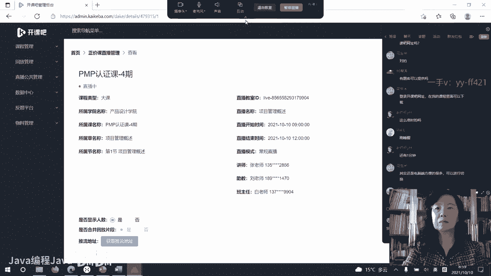
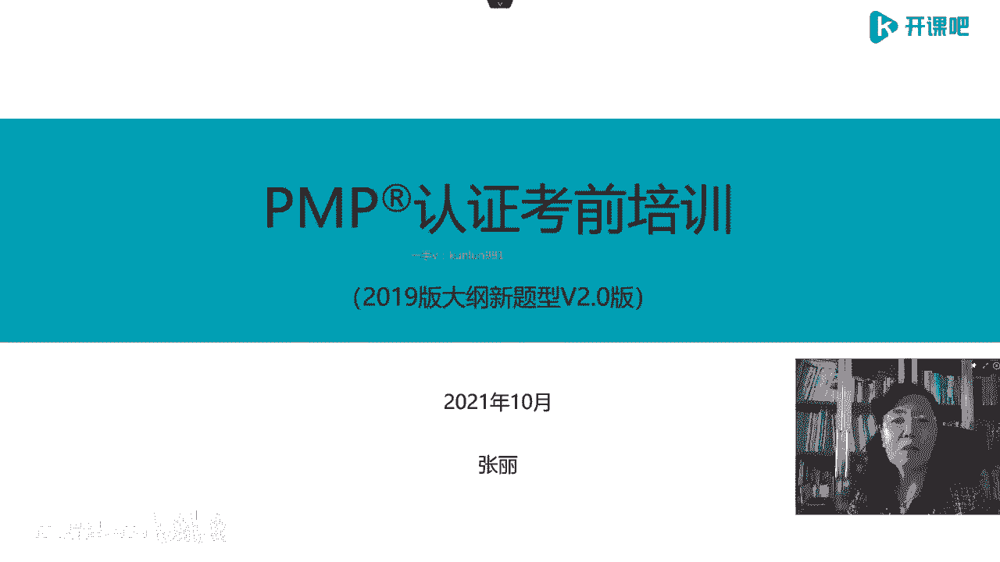
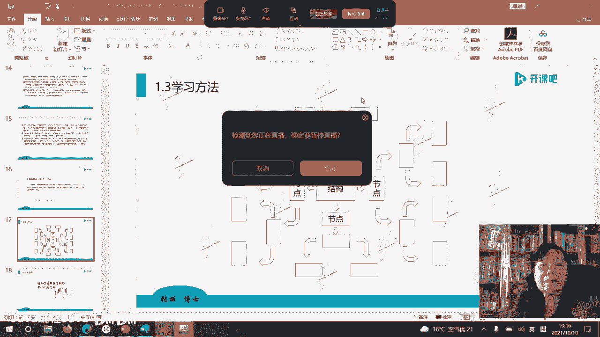

# -PMP认证4期 - P1：6-项目管理概述【itjc8.com】 - OA工作流 - BV1yY4y127aU

学员们好，欢迎来到开课吧，呃我们的p m p考前认证的培优班啊，第四期马上就要开始了，在课程开始之前，请所有的学员检查一下自己的网络呃，设备音频视频，看看有没有问题啊，如果都没有问题的话，声音小是吗。

嗯声音小对吗，声音怎么样，是声音小吗，有些人那不小啊，大家调整一下，如果一切都ok的话，在直播间里面刷个一字给我，我就知道啊，没有问题或者谁的有问题，大家调整一下啊，我刚才又把声音调大了一些。

嗯如果没有问题刷一啊，有问题刷零，我可以看一下都有多少学员状况是正常的，还有多少有问题的啊，好的直播间里一已经刷屏了，好的声音没有问题啊，如果谁那个地方有问题的话，自己调整一下啊。

好我们的课程现在就要开始了，呃，我们今天开始学习呃，p m p的考前培训的这些知识，那么从今天开始要连续五个周末，这个大家都应该已经知道了啊，我们学习pmp考试的一些主要的内容和啊。

围绕着考试大纲来学习项目管理相应的知识，因为我个人一直主张啊，不要因为考试啊，我们去做一个什么事，就把我们的注意力过多的放在考试上，当然了，因为我们这个是以考试为一个主线，来开展的培训。

所以呢考试也是我们最终要面临的，一个重要的任务，也就是我们一定要完成好这个任务啊，大家可以看到这个平面上啊，把版面上所展示的，我们这一次的培训就是第四期的培训啊，是针对2019版的考试大纲。

2019年10月份啊，美国p m向全球发布了新的考试大纲啊，我们这次培训呢是按照这个新的考试大纲和，来进行培训的，那么这个版本已经进行了一次修改，因为我们前面已经进行了四期，到今天是第四期培训了啊。

前面呢也已经啊嗯培训过了，但是我们现在已经到了第二版，因为这个月应该是大概从8月底吧，到9月份，p m i的第七版的p m b o k呢已经出来了，虽然他不会考试考这个内容啊，那我们更新到二点版呢。

把相应的内容做了一定的补充啊，所以这个版本呢我们就来开始啊，用这个版本来学习啊，助教已经提醒大家了，虽然咱们大家有课件，但是一定要做好课堂的记录和笔记，因为我的教学的风格可能大家慢慢习惯了，就知道了。

我会在课件上的去写一些板书，把一些重点的内容呢是需要大家用笔记的啊，不是在课件里全部都给你的，为什么，因为人的学习的记忆通道是多通道的，比如说用眼睛，用耳朵，用大脑用笔来记啊。

用你四肢调动你身体的尽量多的器官，去学习记忆，你就会掌握的比较好啊，那么这个是我们开课前说的这些内容啊。

好继续，首先呢我先做一个自我介绍，可能也有些朋友呢有对我有一些初步的了解啊，那我现在呢是开课吧，呃特别聘请的咱们这个项目管理，教研组的这个专家啊，我的最高的学历是美国管理技术大学，的工商管理博士。

这个博士攻读的方向就是项目管理方向，那还有一个啊中国的软件工程硕士的学位，其实我最低一个学历呢是学的电气工程，但是由于学校敏感，我没有在这里面写啊，另外我还在美国读了一个nba，还在北京大学啊。

专门就政府的项目怎么进行怎么做，做了访问学者啊，从时与我在北京大学的导师是郁俊丽教授，也是一个美女教授，那么在美国管理技术大学啊读的这个博士，从事于据说是具有全世界项目管理第一人的。

david from教授啊，是跟着david from教授来学习的啊，另外呢还有一些呃考的什么什么考试的，这些资质等等啊，我就不再说了，那我的专业背景啊，是在航天企业。

我在航天医院现在的缩写简写叫火箭院啊，顾名思义是造运载火箭的，那么那几个宇航员刚刚回来的航天员啊，也就是坐着我们院所制造的火箭呢，从太空出差刚回到地球上啊，我在这个火箭院工作了35年。

主要的工作就是围绕着项目管理来进行的啊，这个是跟大家做一个简要的介绍啊，自我的介绍，那么开始教学或者说普及推广，项目管理这个体系，我大概有十多年了啊，从事呃项目管理的这个咨询，大概也有20年左右啊。

这是大致的一个这个经历啊，所以有一些经验，有一些呃可以向大家传输的一些案例吧，当然了跟航天有关的一些案例，可能大家也比较了解，也比较知道啊，出一些对敏感信息的保密啊，保护啊。

有些东西我可能不能说的特别直接，和特别明白啊，大家理解就好啊，好的，那么这一段呢就是在我们的课件上，还有一个老师的寄语，这个寄语我不在课堂上讲了，大家自己拿到教材以后自己看一下啊，好的。

那么我们这个培训叫做考前培训，考前就是跟考试相关，那考老师我们就要围绕着考试大纲来进行，2019版的考试大纲，就以前各个版本的考试大纲啊而言，或者相比较而言做了非常大的变化和改变啊，我们不说以前旧的了。

因为我们学的是新的，那么告诉大家呢，考试遇这个叫考试预啊，考试域有三个，就是考试的领域有三个，第一个叫做项目管理过程，那么我们都会在后边的课程里面展开啊，项目管理过程或者叫项目管理流程process。

这个单词它叫项目管理流程或者过程，都是按照项目的全生命周期，或者叫寿命期展开的，那么它分成预测型，适应型，混合型，主要这三大类啊，这是第一个大玉啊，或者第一个模块，第二个考试域。

第二个模块就是项目管理中，涉及到对人员的管理，也就是第二部分人员的管理，它又有三个部分组成，一个是怎么把自己管理好，就是自己怎么胜任自己自我的这个角色，什么自我呀，项目管理者或者叫项目负责人。

或者叫项目经理，或者叫项目团队的领袖人物啊，就这个人物，那么他对自己角色的认知和自我管理，第二部分对于整个项目团队的组建建立和管理，这第二部分内容啊，第三部分内容除了你自己。

除了咱们项目团队的直接的人员以外，还有一些间接的外部的相关方啊，很广泛领域里的，包括明显的相关方，潜在的相关方和我们还难以识别，不知道的相关方，那什么叫相关方，就是对我们项目有影响的。

或者我们项目的结果对人家有影响的啊，这都是相关方，这个三个方面构成了人员管理的内容，最后一部分叫做业务环境，业务环境曾经也被翻译成商业环境，就是business啊，那么这个业务环境嗯。

也在考试中占有一定的比例，但是占比比较小，占多少呢，8%考试的分值啊，占8%，人员管理占42%，流程管理占50%，将来我们考试我们的分数就是这样安排的啊，好的围绕着这个考试大纲。

我们学习的内容分这样五个部分，第一部分项目管理概述，第二部分业务环境，这两个内容要在项目管理学习的第一天完成，也就是今天完成啊，第二天我们用一天的时间来学习项目的人员管，理，最后的3~5天。

第三天到第五天啊，我们完成这两部分学习项目管理过程，或者叫流程，以及我专门把敏捷项目管理拿出来，给大家做讲解啊，那么3~5天我们学习后面这两部分内容啊，这个学习就叫做结构化的思维。

就是你先要知道我们一共学多少东西，学多少内容，怎么学的，然后再去展开，不知道应该学多少，不知道什么内容，哗啦哗啦一大堆啊，这样下来这叫结构化思维，我们学习五个大部分，第一天两个啊，3~5天学两个。

第二天的时候我们学专门学人员管理啊，这是学习的目录或者叫主要内容，按照这个主要内容，我们开始我们的学习啊，那么首先我们学习第一部分项目管理概述啊，项目管理概述再分四个部分，你看这就叫结构化的思维树形图。

或者叫思维导图展开的啊，在概述这一部分，我们学习四部分内容显而易见，重点是第四部分就是对项目管理的解读，我们开始呢先从项目管理的思维做导入，再介绍一下项目管理的前世今生，也就是今天的项目管理。

那么它的历史传承是什么样，第三个介绍一下这个考试的呃区别啊，这个考试跟中国考试的区别，也就是学习方法啊，那么这是呃前三个部分，我会花少一点的时间来介绍一整天的时间，我们要学习第四部分解读项目管理。

这里又分四个标题，一个叫做项目管理的一些核心概念，第二个叫做重量级的项目管理，跟它相对照的轻量级的项目管理，还有最后我们做一个小结，总结项目管理的本质和目的啊，好的我们开始学习啊。

在这个标题里面的第一部分1。1啊，这个目录我就不再往回翻了，但是我刚才已经讲解了，大家脑子里要有一根树形的这个线啊，要有一个这个曲线，好的第一大部分项目管理思维，其实每个学生或者每个学员或者每个人。

新学一个体系，新学一个学科，重点在哪里啊，重点不在知识，不在那个表面的这个信息上呃，为什么，因为现在是信息爆炸的年代，你想查什么很容易都查到，很方便都查到，甚至你可以跨境去听美国的哈佛啊。

普林斯顿呀啊这些大学，他们的那些顶级的世界顶级的专家的课程，花很少一点的钱你都能听到啊，所以知识的普及并不是我们在这里，虽然我们这个考试呈现的是知识考试啊，但是我们重要的是建立学习，这个学科的思维方式。

花生米已经说了啊，思维方式对很重要，所以我提一个问题啊，所有的学员，那么我们在学习项目管理的时候，想要建立一种什么样的项目管理的思维方式呢，好我在这个版面上给大家画了这么一个框子啊，左边一个字。

右边一个字，实际上我是想用中国语言，把这个项目管理思维说清楚啊，那么这个中国语言我用一个中国的成语啊，来说明这个思维，中国的这个成语是什么呢，每到年节啊，一个年度了，或者到呃跨了年的时候。

彼此之间人们都有一个美好的祝愿对吧，祝你新的1年心想事成，有没有这样说过，你祝福过别人，也接受过别人这样的祝福，那么心想事成，大家好好琢磨一下啊，如果你能想什么又能成什么，那是一个多么惬意的事情。

在这么复杂，这么艰难，这么呃波诡云涌的这种变化的年代和时代，如果我能想什么成什么，那我不是太美了吗对吧，那怎么能够做到呢，这个地方给了我们一个什么样的想法呢，也就是说如果你是企业个人都适合啊。

这个模型也就是我先要明确我要什么目标啊，那我的这个目标是想要达到什么目的，请注意区别目的和目标是不一样的啊，目标是那些指标啊，或者叫做what，什么内容啊，目的嗯是最终我想要的。

我想实现的那个结果叫做y，一定要把这个区分开，非常非常的重要啊，过去作为一个实际管理项目的人，他的重点呢就在那个目标上，我只要把这个给规定的内容我做完，我交出去，交给你就完了。

但是随着这个学科的变化和世界的变化，对项目管理者越来越要求你对目的的关注，也就你稀里哗啦把这一堆东西交出去了，把这个产品交出去了，是不是达到了，如果这个目标目的是你自己的，是不是达到了你自己的目的啊。

那么是不是，如果是需求方是客户的，是不是达到了客户的目的，你只把这个产品交给别人了，目标实现了，但目的未必能达到，要注意这个啊，最好的是目标也实现了，目的也达到了啊，这是想我就想好了。

但是你天天躺在床上想啊，是跨不过去这个啊这种半虚线的框框的啊，因为你是到不了右边这个城的，那中间还需要两个非常重要的步骤，第一个步骤我还用中国字来说啊，叫做谋啊，你要谋划好，我想达到这个目的。

我要这个产品，我要达到这个目标啊，我要实现这个目标，达到这个目的，那我就开始谋划了，我怎么才能实现目标，怎么才能达到目的啊，在美国人的这个项目管理体系中，管这个叫策划plan计划。

其实这个计划不是简单的进度表啊，而是规划，策划的意思啊，我要想一下，那我到底能不能够嗯实现这个我怎么实现，我得把这个路线图画出来，先别着急做啊，做之前要先谋啊，动手之前先动脑，先动脑子想一想。

别急急忙忙的，我就想达到这个目的，我要挣一个亿了，然后稀里哗啦就开始眉头苍蝇一样撞，那你是绝对实现不了的啊，卯好了以后干嘛天天躺在床上画蓝图啊，谋远景，夸夸其谈，嘴在这说还是实现不了啊，要干嘛呀。

要动啊，英文在美国人眼里，这叫do要执行，要做啊，要做谋定而动，才能心想事成，就这么一个逻辑啊，你按照目的目标我先定好了啊，然后我去按照目的目标去倒推倒牌，我的那个路线图，按照这个路线图。

而且是严格按照路线图，别做着做着跑偏了，去操作去执行，最终我就达到了我想要的结果，这是这么一种思维，那我们看一下这个思维是个什么思维啊，叫做结果导向的，或者叫做目标管理。

有学员在直播间说pd ca不对的嗯，为什么，因为项目是临时的，我不循环啊，我只有一个开始到最后一个结束就拿到结果了，你再循环就到别的项目上去循环了，那么所以项目是遗憾的艺术，错了就错了。

没有机会让你在这个项目中或者说反复修改，或者你反复修改的就是一个不成功的东西，没做成的东西啊，你持续追求的，跟我们说的这一段的项目管理是有区别的啊，要注意这个，所以这个p d c a不是说全错。

把a拿掉，前面来一个star开始，后面来一个结束，finish啊，这就是一个项目整体的这个思维，什么思维，以结果为导向倒牌，我想要的那个计划，严格执行计划，得到我想要的结果好吗，这里边又有一个问题了。

严格执行计划，时代变化的这么快，每天甚至都有大量的变化，跟昨天不一样的东西，那你严格按照计划，计划变了怎么办，所以有中间的这句话叫做变更管理，拥抱变化，按照这个思路要加上对于变化的管理啊。

要灵活的对于变化进行管理，我们就把这一个路子啊，把这条线给它补完整了啊，这就叫做项目管理思维，什么是项目管理思维，也可以叫做是一种成功做事的思维，成功把一件事做成，或者叫把事情做成的思维。

那么大家想一想，不管你是在职场上还是在生活中，成功做事的思维思路和行动行为有多么的重要，对格局要高大上啊，那么大川刚才给了一个要格局高试了，你要跳出这个圈子，从结构化的这个角度。

站在高一点的位置去看整体，看这个项目的整体哈，而不是像我们过去那样做事，稀里糊涂就钻在一个地方啊，也不知道整体是一个什么情况啊，所以这是项目管理的思维，说起来蛮简单的呀，一点都不高大上对吧。

很简单的一个东西，甚至是一个中国人人人都明白的常识，初中生可能都懂的，都知道这么做，但是能够把它做成的人，真正建立这个思维，把它划到你的血液里，划到你骨髓里的人是少数，所以成功也是少数人的事儿。

虽然原理很简单，常识很简单，但是你真正做起来，真正操练起来就会有各种各样的惰性，或者有各种各样的困难挡住你了，结果你就后退了，你就没有坚持按照这个思路真正的去操作去做，所以成功的人是少数的人啊。

这是我们想说的啊，这样呃这样的一个思维和方法啊，倩倩说啊，这个课程最重要的其实真的不是考试，大家来体会啊，来了解，我也希望帮助我们所有的学员都通过考试，但是有一点通过考试，你只冲着考试使劲儿。

我告诉你通不过啊，美国人设计的考试很巧妙，怎么呢，他是考思维方式的，考能力的，所以这个考试是需要一点经验的，有的学员说，你看我不想我现在没有经验，我也不想花那么多时间去积累经验，我想快一点可以吗。

当然可以啦，不是自己摔跤经验，你看别人也是经验呀，啊所以看别人怎么做的呀，咱们班里咱们有群呀，看看学员是怎么做的呀，看看别人怎么做的呀，你也可以快速积累经验，有些人工作了一辈子依然稀里糊涂。

没有一点经验啊，有些人工作年限只有12年，但是他非常有智慧，为什么呀，你要善于积累，你要做一个有心的人，如果你让这些很多好的东西和知识，信息思路都跟你擦肩而过，跟你没什么关系，你怎么可能有进步呢。

所以你经验再多，所谓的经验就是熬的年头再多，你不见得有真正的经验啊，那我们这一段就先说到这里边啊，那么我也看到直播间里有很多学员说了一下，这个呃课题呀，说了一些这个考试的题目的事儿。

关于考试题目你真不用着急，咱们都有这个安排，我开始说了，咱们五天呢先把主要的这个课程学习完啊，到时候该给你练题的时候，就怕你吃不消大量的题目，你必须在老师要求的时间内完成啊，你得快速的做成啊。

就怕你到时候跟不上啊，别着急要题目，因为你还不了解整个这个思维，整个这个结构，你把那个题做了一遍，那个题就等于废掉了，浪费了白做了，不是真正的理解了去做题了，所以做题别着急啊。

按照咱们的计划一步一步的走啊，好的，那么根据刚才我们讲的这个思维，大家看一下啊，一个企业要想有好的项目管理，涉及到什么内容，目标管理当然包括目的管理啊，这里边就有一些内容，那首先我们是从目标出发的呀。

你得有关于目标的管理，你要达成目标，要做事，要策划，要谋，要plan要度，那就要得有资源资源，需要人力资源，非人力资源，那么在一个公司中，它就有各种各样的角色，组织结构权限大小不一样。

那么对我们的项目管理形成了巨大的影响，所以这个也要有啊，另外对于刚才我们说的变化不确定等等，那就有问题和风险管理啊，还有一个非常非常重要的，我们为什么要锁定项目的外目的呢，也就是需要增值管理嗯。

美国人写的一本书怎么说的，傻瓜都知道，原话就这么说的啊，傻瓜都知道，不要做那些没有价值的事，如果这个东西没有价值，你还不如躺在床上睡个觉，不要做那些东西嗯，所以我们的项目是为了实现价值的，你一定要增值。

你忙活了半天，费了半天劲，不增值不行，当然增值这个值价值的值啊，不光指的是经济价值，还有社会价值啊，也就是我可能通过这个事儿没有赚钱，但我赚来了声誉，赚来了知识产权，赚来了我所有的本领。

但是你这个本领最终还是要体现在经济上的，还是要有附加值的，你得做有意义啊，那么这个意义不光是叫别人看起来很好的，很要面子的意义，而是货真价实的得有经济价实啊，专利不是知识产权吗，专利是呀。

专利是知识产权的一种啊，知识产权还有很多其他，你比如商标也是啊，也是知识产权啊等等，那么我想说的是，通过一个项目要增值，所以你得有管理呀，你不管理怎么来的呢，对吧，还有知识管理，也就是你做了一件事情。

给自己留下了什么，沉淀了什么，这六点是分别由公司的哪些部分负责的呢，那么你就要去跟你的公司对号入座，各个公司组织结构设置的不一样，他在的部门不一样，你比如说目标目的管理一般啊都应该在投资啊。

战略这个部门管理资源呢分两部分，人力资源，那肯定在人力资源管理，非人力资源看什么，比如说设备啊，工装还有一些方法，市场等等，在你公司都哪管，可能是分开的，也可能是集中的，风险管理。

一般在很多单位都是在法务部门，审计部门啊，进行风险管理，当然了，也有的公司专门有风险管理部啊，还有增值管理，一般有财务管理的部门啊，还有战略管理的部门来进行管理，知识管理都由公司的，比如说研发部门啊。

知识产权部门或者是归档的资料，归档的那些部门进行管理，那就看你公司怎么设置了，各个公司不一样，大公司有大公司的设置方法，小公司可能合并统一都在一个地方管理，但是所有的这些管理。

都可以在一个叫做项目管理办公室的，统筹协调之下直译啊，项目管理办公室嗯，直接在这样的一个机构的统领之下啊进行管理，当然了，跟你公司的项目管理成熟度有关，跟你所在的公司是不是项目导向型的公司有关。

什么意思呢，有的公司是项目导向型的，有的公司是生产运营导向型的，不一样啊，你比如大型的生产制造工厂，它工厂的那一部分就是生产制造导向型，不是项目导向型的研发，都是项目导向型的it公司。

互联网公司都是项目导向型的公司啊，所以这个咱的这个课程，现在大量的面对着互联网公司和t公司的学，生和学员啊，那么美国也是一样，不是说中国是这样啊，在美国也是这样啊，大量的这个学生呢来自于it行业啊。

pmo部门就解散了对吧，等项目结束后，不对的啊，po我们后面还讲啊，pmo是一个常驻机构，公司项目组会解散，但项目管理办公室是一个管理机构，不会解散，建筑行业，汽车行业啊。

他们在生产运作的时候属于生产运作，但是建筑业啊，一个建筑项目，一个建筑项目是典型的项目导向型的，汽车行业的生产部门是生产运营，但是汽车行业的研发部门是项目型的啊，项目组跟项目管理办公室。

team跟officer是不一样的啊，把这个区分开，team跟officer是不一样的啊，好的，那么我们再看项目管理的思维，项目导向型的思维给所有的普通人一个启发，启示，叫做项目是做事的思维。

这是一种style，一种风格啊，也就是这个人的风格不一样，他成事就不一样，我们在呃社会生活中，职场中，市场中啊，家庭中到处跟人在打交道，我们跟人打交道的时候，就明显发现诶有些人很好诶，很靠谱。

你让我具体描述他怎么靠谱，我也说不太清，我就觉得这个人值得交，有些人人品很好啊，三观也很正，但是稀里糊涂的，你跟他一起做事老是提心吊胆，就是就觉得他思路模糊，思路不清楚，重要的区别在哪里呢。

这个人有没有这种style，有没有项目管理的思维和style，那什么是项目管理的思维和style呢，我们再说一下啊，首先项目管理是需求导向型的嗯，也就是由需求引发的，你要做什么很少是自己决定的。

也就是需求由人不由己，我想要有一个东西特别特别好，对绝大多数人来讲啊，他不是这样一个思路，绝大多数少数人才可以引导需求，那是高手，比如说这个微信的张小龙，他搞出一个微信，中国人外国人全世界都用这个。

比如说抖音在国外叫tiktok，把美国人吓得都要把他封了啊，原来没有，这个时候好像大家你去收集这个需求，未必别人能说得上来，但是他们造出了这么一个东西，让全世界的人都需要，这是极个别的人。

绝大多数人90%啊，90%以上的人吧，能够做到需求导向就很了不起，什么叫需求导向，市场上要什么，我做什么，而不是我做了一大堆，摆在市场上没人要，我就天天在那喊，这不行啊，所以叫市场需求什么。

我们就做什么，我们要选要什么，就看市场需求什么，那么美国的教育也是这样的，跟中国不一样，我们中国的教育就是上学，我们就学数理化，然后我们就一定要玩命的去上重点学，要上大学还要上985211上这些。

那美国人未必是这样的啊，是这个社会需要什么，我就学什么，而不是说我到了高中分科了，我是学文科的好吗，那个数学你不要找我来说啊，我就是管这个的，那市场上不需要你这东西怎么办啊，你就自己死抱着我不学数学。

因为我我学文科的啊，还有学理工科的，就觉得我不会写文档那东西，这这这太麻烦了对吧，我没学过，因为我上的是理工科，那不是这种思维，而是市场需要什么，你就应该学什么，你就应该有什么本领啊。

你的本领是围绕着市场导向来做的，所以这是第一个思路啊，我也见过很多创业的学员啊，张老师，我要创业了啊，这个把自己的父母的存款都拿来啊，在这个投资一个公司弄了那么几10万块钱，我说你搞这个东西。

你做没做过市场调研，因为他专门从天津吧，天津的学院跑到北京来，我上课，他在外面等着，等我出来来问我这个问题，那我就要既然学员这么认真的来找我，我也要认真的说真话呀，那你要想干的这个事儿。

他是一个电力方面的啊，一个一个专业，他想搞这个东西，你想电力现在目前为止，在中国都是国家政府垄断的呀，你私人可以搞一些这种东西吗，你有没有做过这样的市场调研，不用调研呃，我自己有一个专利。

只要我干的这个好，肯定有人要，你看你就不是项目思维，你怎么可能把项目做成功呢，我给他泼了很多冷水，我说你需要融资，老师也可以给你投，但是我就告诉你，我今天告诉你，我今天拿钱给你，他不是来找我要钱啊。

他只是来说这个思路，他征求我的意见，我说我把钱给你了，我就当他打水漂了，根本你就做不成，他不相信啊，觉得老师怎么你看我这么虔诚的来找你，你怎么这么一瓢凉水给我泼下来，因为我说你也学过项目管理。

你这不是项目管理思维啊，你把市场调研的结果拿给我看，你就是拿给我看，我未必相信你这个信息对吧，那么你至少也做了也有啊，连这都没有，没问题，我就自己那么做，做这件事情过去已经快小10年了。

结果这个学生一事无成，把自己父母的钱全部都赔光了，没有了啊，然后他要再去融资嘛，去跟人家路演也没少讲，都没有人相信他这东西，因为你该做的事情，你的思路都不对，这是第一个思路啊，好市场有这些需求。

那我是不是做呀，市场需求多了去了，你不见得做呃，你要选择到底是不是做是不是立项，这个个人和公司道理是一样的，市场需求很多，你公司都选吗，也不一定啊，你要衡量各种情况，各种风险，还要衡量自己的本领啊。

市场需求那么多，你干不了也不行啊，嗯或者违法了也不行啊，啊所以你要选择是不是做好，我们选的结果是yes，做那做什么呀，什么内容呃，你把这个内容要规定下来啊，怎么做呀，你走什么路径啊，你打算怎么做呀。

那我按照这个前几步做，取得了巨大成功，接下来就要让这个成功可持续，能不能我以后都重复这样的事儿，让他变成成功呢，那么这种是一个项目管理思维，你不信你去分析那些成功的那些人，当然了也有很多钻空子的啊。

咱们就不再说那些啊，我们看人家的优点，那无一例外都是按这种思维方式做事儿的，当然了，高手呢并不是发现需求，围绕需求做，而是引导需求哪，那都都了不起的嗯那这种人当然更厉害啊，那更少数你就搞一个东西。

你需要研发，需要投资投入很多啊，再去试再去做，当然人家这个背后也是有市场预期和调研的，也不是凭空就在这拍着脑袋胡来的嗯，那么这是做事的风格和思路，也就是你思维的养成，要按照这个思路啊。

瑞幸败在第五部上吗，不仅是第五步，在这个过程里有没有投机取巧，有没有违反政策制度的事儿，如果你有违反了哪地方的相关的规定，或者忽视了干系人相关方对你的影响，你就倒死霉了，你想做成一个事儿。

亲戚朋友家人都在帮你，但是你不见得做成，如果有人给你挖半个小坑，你一定摔倒啊，你一定会栽倒，会败啊，或者所以瑞幸咖啡可以大家去思考啊，好第二个标题，我们讲一讲项目管理的前世今生啊。

讲讲项目管理的发展历程，在非常非常非常古老，非常古远古时代啊，那么就已经有很多的奇迹开始被修建呃，比如说世界著名的，如果你有去过梵蒂冈，梵蒂冈那个大教堂，富丽堂皇，漂亮极了，他在意大利中间中部。

那有那么一个地方就围了一个，可能还没你家那社区大那么一个地儿诶，它是一个国家，单独的是一个就是以教会啊来做的，这个这样的一个一个国家，他那个梵蒂冈的大教堂经历过多少年的修建，非常非常的漂亮啊。

还有埃及的金字塔，不过我大概是1年前看了一个资料，说埃及那个金字塔是假的，是100多年前呃，人为做的，为什么说有人想这个，觉得这个埃及这个地方就是沙漠，想拉动旅游。

围绕着尼罗河这个沿岸是不是搞一些什么东西，那就没有一些噱头啊，就被人搞出来的，就算是被人搞出来也100多年了啊，这个也是很早之前的，当然这些都是传闻没有被证实的啊，那么看看我们中国的万里长城，在太空。

在其他星球上是很少有的可以看到的，地球上的啊，可以肉眼看到的奇迹就是我们的万里长城，那么最早开始修长城，秦始皇到现在也是上千年的历史了啊，还有大运河，古今中外都有运河，像这些工程没有留下啊。

那些可以考证的文字资料，他们是怎么建的，怎么弄的呃，怎么形成的，这个是怎么管理的，可能都没有这样的资料，但是他们有这样的结果，这个结果向人们无声地诉说着项目管理的魅力，他留给了地球，这种奇迹。

让后人可以去观赏，在西安的那个兵马俑看不到，可以看看图片啊，以后有机会自己发达了，可以去全世界各地去看一看，新冠病毒消亡了没有了，或者说已经变成流感那样，不怎么奇怪了啊，大家就可以到处去走一走。

去看看世界嗯，所以这些人间的奇迹，都是项目管理的后果和结果啊，这些奇迹这些结果很早就有说明，古人很早就有一种思路去管理一个事儿，能把这个结果做一个好东西，但是没有形成文字的成体系的今天。

或者现在我们见到的成体系的项目管理的，结构化的体系都是来自于国防工程，20世纪的国防工程，上个世纪啊，特别是两次世界大战，第一次，所采用的这样系统工程的办法啊，那么搞出了啊成体系的项目管理的体系啊。

这是成体系的，或者说学科的起源或者苗头啊，我们是从这儿开始的一些著名的计划，比如说曼哈顿计划，和阿波罗登月计划，也是美国啊，宇航员登到了月球上的这个计划，中国人也在努力中啊，还有北极星计划。

北极星计划是美国海军的一个计划啊，这个海军的这个计划呢，呃它是呃怎么呢，我就大致的跟大家说一下啊，是核潜艇，大家都知道，前两天你关心时事的话，10月2号美国美国的核潜艇跑我们南海，这撞着什么东西了啊。

那么这个核潜艇它挂着有核武器啊，那核武器也是在舱里的，在潜艇的舱里的舱盖打开核武器推出点火，准确的命中目标，这个打击性是非常巨大的，因为核潜艇你看不到啊，你不知道他在哪转呢。

那么它可以呃在这个有海域或者海域附近的呃，目标，它会从这儿突然冒出来去打击你，或者说在海底它就可以发射做这个哦，武器的发射，那么大家可以想海底是有压强的，打开盖儿嗯，还要发出去，还要点着火。

还要准确命中目标，所以这个北极星计划是很厉害很厉害的啊，那么这个美国的这个北极星计划，在这些工程中开发出了，或者搞出了一个成学科成体系的方法啊，或者一个科学管理的体系。

那么这个体系是项目管理最初的最开始的雏形，不过这个地方我忍不住啊，要跟大家说一下啊，这个呃北极星计划中的，刚才我们说的这种武器啊，呃我可以很负责任的告诉大家，我们中国也有的啊，中国人也是有的啊。

所以呃当然了，这个技术是非常复杂的，这个命中率准确率都不高，美国人也不高也不低，我们中国的这个技术跟他是差不多的命中率，所以他很害怕中国呀，啊觉得中国是这个偷偷的慢慢的就发展起来。

没想到中国人这么聪明啊，能够搞出他们认为谁都搞不出来，他们最优等的这个东西啊，这是额外说一些事啊，所以这些大的工程啊，啊都是有这个都是有这样一些体系保证的，他不是闷着头瞎干的，说我造原子弹计划。

我就瞎试，我试到哪儿算哪儿，试完了就怎么怎么样了啊，不行的，它都是有一个项目管理的体系的，所以项目管理的这个体系来源，甚至包括不仅是项目管理，我们见到管理学中的很多管理的一些方法，一些思维。

一些理念都是来自于国防工业，特别是美国，因为他们啊把这个国防呢或者说他们的军事呃，看的是非常非常的重，有很多成果并不来自于那些搞管理，专业的管理专家，而是来自于嗯五角大楼啊。

美国的五角大楼有机会也可以去那看一看，那是世界可以说军事的中心啊，就是在这个地方搞了各种各样的事，他可以在全世界各地穷兵黩武啊，这只说到这儿啊，那你了解别人，你才知道怎么回事儿啊，那么这种来自于军事。

来自于国防工业的体系，怎么就跑到我们现在每个人来学了呢，怎么来的呢，它中间过渡了一个桥梁啊，美国人他会发现诶，他们这种大型复杂的工程用了一个办法怎么做，怎么成，我们把这个用到我们的工厂。

用到我们的生产经营，用到好莱坞，拍电影，用到经商来，用到管理咨询机构做这个项目导向，用到it项目上可不可以呢，有人就尝试啊，在上个世纪60年代，以杜邦公司为核心的一批公司。

但是杜邦公司是第一个吃螃蟹的人，他就把这个军事上面用的这种方法，用于自己的公司做设备检修啊，做公司的一些项目，因为当时杜邦公司啊蒸蒸日上，杜邦公司是一个美国多元化的这个公司啊，发展的特别特别特别好啊。

那么这个杜邦公司呢他就琢磨这些方法，我们经营可不可以用啊，啊当时他发展得特别好，社会需求非常的大，对他的这个要求，产能的要求也特别的高，他只要造出来就赚钱，只要造出来就赚钱。

可是造不出来啊啊因为他各种的管理啊，各种的这个设备啊，也不能长期保持正常，你就人传人倒班设备在转啊，最后这个设备也不能保证它完好，所以他们就用了这样的办法试了一下，结果取得了巨大的成功。

用项目管理的办法来去进行，工厂的一些项目的管理啊，它极大地提高了效率，因为这个效率对他来说就是钱哦，你效率提高了，造出来的东西了，他马上就会换成钱啊，所以杜邦公司呢采用项目管理这个方法。

取得了巨大的成功，就让这个方法走进了国民经济啊，各个方面，包括政府，学校啊，医院等等，都开始采用项目管理的办法，我说这个是在西方啊迅速地普及开来了啊，到了今天我们今天的项目管理就比较成体系了。

有比较完善的科学体系，比较成熟的体系都嫁接在，或者是他以什么为载体呢，学会协会全世界都是这样的啊，协会和协会叫社团，是社团管理，但是在中国不一样，中国过去社团都是归政府管理的。

如果一个没有政府背景的协会和协会，影响力非常小，不会有人加入，他，还给他交个会员，弄什么，谁给谁给他办这事儿去啊，不会有的啊，但在西方国家，无一例外，学科的载体都是各种各样的协会，行业协会，专业的协会。

那个协会负责这个行业的发展，负责这个行业的引领，负责这个行业的标准，负责在这个行业中的从业人员，他的能力评价，组织评价，就公司的评价，都是行业协会或者社团来进行的啊，那么世界上比较成熟或者比较有名的啊。

体这个协会，我们重点介绍这两个美国的项目管理协会，和欧洲的国际项目管理协会，这两个啊项目管理协会啊，这两个学会还有更多的协会啊，我们就不在我们这里来介绍了，首先p m i啊，他不是第一个世界上成立的。

项目管理方面的协会，现在有资料呢，都说欧洲国家1965年，这成立的是一个第一个国际项目管理协会，其实不是的，在他之前更早，而且还要早不少，第一个项目管理协会其实是澳大利亚的，但是澳大利亚他没有成影响。

没有制造出影响来，所以现在别人都不怎么研究他啊，那重点研究呢，我们还说欧洲这个国家以欧洲国家发起的啊，那现在叫欧盟，当时呢没有欧盟，1965年就成立了这样的项目管理协会，他的英文缩写叫ip ma啊。

是这样的一个机构，叫做国际项目管理协会，几年之后，美国成立了类似的或者性质相同的这样的组织，叫项目管理学会，它翻译成学会英t t是个研究机构，研究所啊，这个机构从1969年成立，就在美国的费城这个地方。

因为费城是最早华盛顿之前，作为一个临时过渡的首都存在的，所以费城也还比较好，比较繁华，在东部啊，在美国的东部这个地方，1969年，在一个就是在美国的这个呃大学里边啊，在一个大学里，费城属于哪呢。

啊费城他是在东边的这个海岸这个地方啊，有一个比较著名的这个大学，那么在这个大学里边几个人，这几个人是什么人，就是项目管理的从业者，他们周六周日聚在咖啡馆啊，记载咖啡馆就讨论我们我的项目有什么困难。

你的项目有什么困难啊，然后慢慢慢慢的他们就成立了一个机构，就是我们干脆搞一个组织吧，把这个组织呢放到这个大学里啊，叫个研究所，实际上就翻译成了项目管理学会，就这么一个啊，呃他们成立的时候非常的沮丧。

为什么，因为国际这个词已经被欧洲人用走了，他们想引领世界新潮流，用国际啊这个词结果已经用不了了，被别人用走了啊，那就是啊在这里用了用了这个项目管理协会，前面什么都没要啊，宾大呃，最一开始不是在宾大。

后来也挪到宾大，现在又从宾大挪出来，曾经他曾经在宾大里面用过这个办公室，在宾大里面啊，作为这个呃一个办公室，现在他独立单独做出来就是一个协会协会，为什么呀，因为他非常非常的富有。

虽然社团他定位是非盈利组织，但是它富得流油啊，一会儿我们给大家讲一讲他是怎么富的流油的，怎么欧洲国家自己创立的就敢叫国际呢，那你先起名也可以改，敢叫国际呀，所以美国人就生气呀，对呀。

就是你们起了个名字叫国际，那我就把我往哪放啊是吧，他很在意这个东西的，说明什么呀，说明美国人的这种就是因为人强大了以后嘛，他就觉得都不如他就这种心态啊，一览无余，在202000年，2000年。

在中国呢清华大学召开了一个亚太地区的，包括就是台湾人也来啊啊还有呃东南亚，还有这个香港澳门，日本韩国，就日本韩国啊，呃东亚这边啊，他们对这个项目管理也是比较热衷的，那么在清华大学就开了一个这个年会。

开了一个学会，那么这是中国，应该说也是第一次承办这样的会议啊，就觉得非常的大这么个事儿啊，清华大学，包括咱们国内的很多搞项目管理的人，也很重视这个事儿，就是搞那样大幅度的宣传，做了那个易拉德。

做了大型的广告宣传啊，啊请了谁来请了谁来请了，特别是请了p mi来啊，就在这个广告里写了一个美国项目管理协会啊，写了美国项目管理协会，欢迎美国项目管理协会，本来说难听点是讨好别人对吧。

表示我们东道主的一个热情的欢迎嘛，结果没想到美国人一看到这个伊拉德，一看到这个大型巨幅的广告，当时就蹿火了，就冒火了，急了对吧啊，人家那边叫国际项目管理协会，我这叫美国项目管理协会。

我这项目管理协会前面有美国吗，没有美国这个字啊，你们干嘛给我加上美国呀，拿掉扣掉所有的伊拉德重新做，要把美国去掉，你看看这个还没搞明白他的心态对吧，他不想要，就是我不写美国这个词。

反而我代表了比你这个国际还要大的，更高的这个层面啊，所以我想给大家说说这段背景，大家就明白p m i它有多牛了，对啊是笑死的啊，所以跟大家说说这个事儿啊，另外刚一开始美国成立这个东西的时候。

这个协会也不断的在迭代，他到底要干点啥呢，他也并不是很清楚，所以它的logo啊，各种各样形状的，有方的对吧，还有这个做成西瓜瓣的，这里写着pmp，然后这个什么还有pm等于什么，做成这样。

但是今天嗯应该是在2020年，美国pmi的logo改成这个样子了，这是新改的啊，这个印度人是it行业出身的，学it的，你看他这个设计，我感觉啊就有点信息化的那个现代感，不像原来他那个他那个标志啊。

标记了那么死板啊，那么我们看p这是第一个啊m啊，第一个p是代表项目，这个m还代表管理啊，i代表研究所是p m的缩写，这个m还代表合作嗯，i还代表机构，注意右下角有一块，这一块是一个留白，是一个空白。

这个空白是干什么用的，大家想一想，这是一个把标志改成这，这样是一个什么思路，为什么做一个留白呢，咱们学习的时候思考一下啊，为什么做个留白，更新本土化，这个叫做叶子啊，因为我眼睛不太好，你就用繁体字啊。

叶子说得对，本土化本土话说得非常对啊，表明了他以世界大哥自居，以项目管理的鼻祖自居啊，怎么呢，这一块如果在中国，你有机构的话，可以写上你中国的一个什么特殊的标志，你在泰国。

你可以画一个泰国的一个一个什么寺庙啊，你在新加坡，你可以画一个新加坡的狮子诶，对自定义的啊，大家看看他是什么心态啊，你都要在我这个pmp pmi的框架之下，设计你的这个东西，那他是龙头老大。

就是这么一种心态，开分店了，开分店了，开放式的太对了，如果你没有在中国，你这没有，你就画这么一个斜杠，留白也蛮好看的，颜色都是不能变的，按这几个颜色做啊，把这个颜色也搞得很明亮很亮丽。

过去py的颜色就是蓝色啊，一种深蓝色，有点像我们开个八的这个蓝色就一个色彩啊，现在也色彩特别丰富，开放与合作，没错的，就是这么一个思路，一个想法啊，所以我想告诉大家，从他的这个标记logo的改变。

那么他的一种心态都在这个logo里所体现了啊，这是关于这两个协会呃，世界上还有很多协会都是在对项目管理做推动，做贡献的，但是比较有影响力的是这两个，那么大家也知道这两个啊。

协会所在的地区目前仍然是世界最发达的国家，是第一世界啊，那么虽然他们的人口并不多，但是他们是呃需要就是他们是不甘落后的，永远想引领世界的，是这样，有学员说呃我们我们的这个logo要更新也未必啊。

单一色彩用单一色彩的解读啊，好接下来我们看一下啊，那么这个1969年五个有有说五个，有说六个，有说七个，有说四个，为什么，因为你刚一开始在咖啡店坐着，这周末她有事儿，这几个人聚。

那周末她有事是这么发起的啊，现在我们看到的美国的书籍上说，五个志愿者我比较也比较自豪的吧，可以介绍我的那个导师戴维夫，一个老头呃，呃但叫老头呢个子高高的，1米9几的个儿，跟好莱坞的明星一样，白人啊。

那么他是是这五个志愿者之一啊，所以为什么他也比较有影响力呢，啊这是这个时候开始成立的，后来呢大家就想我们这个协会要搞标准，要制定项目管理标准，76年就提出这个想法，这个思路83年就发布了一个报告。

这个报告中的第二章就叫做项目管理标准，后来把这个第二章拿出来，不断的演进演化，就变成了我们今天学习的pmbok guy的，项目管理知识体系指南这一部分内容啊，嗯现在已经有第七版升级了。

但是第七版啊还没有，就是官方出的正式的文字版啊，虽然这个呃已经流传了很多中文版都有了，那么正式的中文版还没有出来，所以也不会按照这个来考试，当然这部分内容我也会给大家加进来一部分啊，那么第一版呃。

刚开始是一个报告，到了第一版的p m b o k100 多页，第二版200多页，第三版300多页，第四版400多页，第五版500多页，第六版700多页，加了很多啊，第八呃。

第七版告诉大家缩减到了300多页，就大概这么一个步骤，这么一个路径啊，出了这么一本书，那我们现在考的，或者我们的考试大纲，是按照第六版的，p m b k所给出的体系来进行的，又按照考试大纲啊。

所以我们围绕着第六版就可以了啊，那么这样的一个东西它一直在动态演进，一直在变化，所以其实美国人带给我的一个冲击，这是一个方面，比如说我原来在国内学习啊，我就觉得诶这本书我学会了。

我估计这个东西我就掌握了，我就以为这是我的了啊，那么我们就试图哎看一个知识领域，看一个书啊，这样啊，国外不是这样的，可能有的人一辈子就写一本书，但是不停的在版本迭代升级，今天的项目管理跟5年前不一样。

5年前又跟10年前不一样，他一直在更新，一直在演进演化这个东西啊，呃就是最多的那一版对的，但是第七版虽然300多页，并不是内容减少了，内容更多了，因为他没有办法在那个书里写了啊。

他又批出来拿到别的地方这个东西，因为呃目前来说跟咱们考试啊，或者跟咱们这次考试关系不是太大，所以我们要考试的时间也比较紧迫，就是集中精力聚焦我们的主要的能量啊，去关注这个先额外的啊，先少少去啊。

更多的去设计，还有分散我们的注意力啊，后来啊他们就想推广普及这个东西，大家想一个行业协会，一个行业里边的啊，这样的协会他出的标准在美国不是强制性的，是非强制性的，我们中国的标准都是有政府背景的。

都是政府来出，自上而下得出美国人是谁用谁写标准，而是自下而上的走的非强制的标准，那么谁来学我们这东西呢，如果我这个非强制大家都不学，我搞一个标准不就没用了吗，所以我就搞了认证专业人士的认证。

这是协会的职责和责任呢对吧，搞这个认证，现在全球有很多很多具有这个资质，在中国呀就有好几10万嗯，为什么我说好几10万，因为有人过多少年续证了，有的人还不持续，就是续证的人数也非常的多。

美国人现在看到我们也有很多人有这个证书，因为这个证书在美国考试的话，嗯是也是很难的，也就是通过率啊30%左右，所以你在美国有这个证书的人啊，人家会瞪着大眼睛看，你觉得很吃惊的啊，觉得你很了不起的。

你就有这个证书啊，到了善于学习的东南亚国家，比如说日本，韩国啊，通过率翻翻也就60%左右，但是当这个东西啊走进中国，走进中国，开考以后，84年中国开始考试以后嗯，八九十通过率八九十，好的机构啊。

那就更反正跟着我学的好多的班都百分之百嗯，就咱们中国的学员特别善于考试啊，就是呃我想说的这个内容啊，中国为什么不搞个认证，白把钱搞给美国呀，因为没有这样的行业协会啊，没有领导这个这个学科的专业啊。

这是呃伯乐，你说的非常的就是也是我的痛点，我也一直就想这样搞啊，好的这个证断续了几年了，还能续吗，再考啊，在考试啊，再交钱再考试啊，就能续嗯，这是呃关于他的大致的这个介绍啊，我们要考这个证书。

也要了解一下他大概的历史啊，那么它的版本这样的，我刚才也已经跟大家说过了，现在这个红颜色的还没有正式出版，虽然它叫2020版啊，现在已经就是正式的中文版还没有发行，所以现在不用太呃在意他。

但是我已经把相关的内容介绍给大家了啊，啊还有类似的协会，英国英国有个叫特纳的教授，他也往返中国呃，几次跟中国也很友好，其实他搞的东西也很不错，但是影响力远远美国没有美国这么高，为什么呢。

我们看看美国人是怎么价值运作的啊，学习一下他的思路和方法，每隔4年这个认证的啊，这个依据或者叫p bk升级迭代一次，怎么迭代，不是由各个国家的专家来写，而是开放的架构，由全世界各国的志愿者。

你将来考了通过了，你有这个证书了，前提是你有这个证书啊，然后你说我要觉得这个地方哪儿不合合适，我想给他做贡献，把我自己的实践给他做一个补充，美国人非常欢迎啊，举着双手，赞成你进来，你来吧啊。

你当然他要考核，不是说所有的人都行啊，考核通过了，你进来唉，你来参与这个写啊，写完了以后啊，所有的人写完了以后，你去你自己写的吧，你会帮助他推广吗，是开放的呀，你会帮助他推广，你会给他这个宣传啊。

他是这么做的，然后呢用这个东西吸引大家呢去做这个考试，那考试考试的费用，任何机构跟机构都没关系，是直接把钱给基金会，基金会是直接给美国的，待会我给大家介绍基金会是怎么回事啊，那没办法呀。

那你大家也可以啊，来搞啊，呃机构60分150美元，那是续证，如果你续证的话，他一直就有效，如果做国际项目的话，还是必须要有这个证书的啊，所以你有了这个资源，你要让这个资源发挥作用啊，不发挥作用。

它就都变成成本了，你想办法把这个证书变成资本啊，他是下载的升值的，你别想着都是成本老花钱呀，啊所以你跟着开课吧走啊，这种机会是有的，将来兼职啊，去做一些项目。

那你就你把这1000多块钱挣回来不太容易了吗，嗯因为开个八是一个叫做职业啊，职场培训，让你职场更自由的，这样的一个也是一个开放的啊，职业训练的一个一个机构啊啊这个就不多说了，以后你找你的助教。

找你的老师去了解啊，好的，那我们看欧洲呢嗯，欧洲啊，我看一下欧洲呢i p m p也就是i p m a，它的考试叫i p m p是分级的，a b c d分四个级的学的，美国的这个考试不分级，它只有一个级。

他是分不同的专业的，比如说我们现在考的p m i的，p m p是项目管理专业人士，然后你可以考项目集管理，就program叫pg mp啊，还可以考项目组合管理叫pf啊，mp这是这样升级的。

但是这个欧洲的这个呢a b c d考四级，他呢是以答辩的方式也考一个笔试，很简单，那个人人都可以过啊，嗯答辩就是你讲一讲，你做的一个项目怎么怎么样，他是比较主观的评价，有几个评委说你过你就过了。

说你不过你不过是这么一个做法啊，还有一些英国的一些著名的大学，也有一些这样的考试，我们大致的了解一下啊，看看资料就行了，这里不过呃做更多的解释说一下，p mp 1999年呃，就是国家给他下达的一个任务。

什么任务呢，在当时那个时代那个之前，制定了国家中长期人才发展规划纲要，做了这么一个纲要，在这个纲要中提出嗯，未来10年，这未来10年已经过去了，这个纲要的节点是2020年啊，当时已经过去了。

我给你讲讲这个背景，这个东西是怎么走进中国的，跟大家讲一下啊，在那个时代，2020年啊，呃是节点，100万还要多有100万多的缺口，叫四化啊，就是四个方面，第一具有国际化视野。

这人才不能是不知道外面的天下啊，这井底蛙不行，具有国际化视野的，第二叫做专业化，第二个啊，第三个信息化，其实现在看什么叫信息化，就是得要有这种数字时代啊，这种背景的第四个复合型，还要要求得更高啊。

当时是说要有这样四个方面的，特别是复合型，我们中国的教育到高中都分科了，复合型人才特别少，什么是复合型跨界的吗，跨界人才啊，因为现在时代的变化发展，新的科学技术的产生，让行业之间的界限越来越模糊。

你比如说谁能想到是吧，这个特斯拉还搞成一个那样的汽车，那原来都不知道啊，他跟it这里有这么紧密的关系，所以这个跨界的人才也是一个重要的这个方面，那么国家定了这个战略以后，就把这件事培养这个人才的这件事。

交给了当时的中国国家外专局嗯，中国国家外专局培训中心，让他们去找，你在全世界找，有没有一个什么办法，花的时间又不是很多，快速地帮助国家培养这样的人才，当时啊那么就在全世界范围内寻找。

就找到了这么一种东西，项目管理它原理简单嗯，也适合中国的土壤，我们中国也有成功的，大型的这样的国防的案例啊，所以就觉得哎这个东西行，那么这个跟国家已申请国家就同意了，是由国家引进了这个考试这个项目。

有问题了，出了问题了，你比如说中国国家外专局那里边，我们请了好多的外国专家来帮我们啊，来做这个事，包括我那个导师david from，他也是中国国家外专局的啊，请过来的项目管理专家是这样的人才。

那么结果被美国调查，觉得他们是叛徒，觉得怎么怎么样，所以在应该也是在2020年啊，中国的国家外专局就没有了，改革了，化归化病患病到哪儿，科技部，科技部下边有一个国际人才发展基金会。

所以我们现在都叫基金会，基金会是指的这么一个在科技部，挂到科技部下面了，叫做国际人才啊，发展基金会也是通过跟外面的这个人才交流，通过科技方面的这个交流，来跟外国的专家来进行一些联系的，就是这么一个机构。

所以我们每个学员马上就要面临着报名的工作，你要在这个基金会的网站上等注册，也就中国啊基金会的网站上，你要登记注册，说明什么，如果你考试通过了，一个一个库，你进了这个库了。

所以大家不要认为这是简单的考一个证书，是我们在这里把自己打造成一个对中国有用的，啊，具有国际化视野的，一个切入点或者说一个口啊，一个一个输入的口啊，所以这还是很重要的一件事情啊。

也就是这是中国国家的政府行为，不是哪些研究生自己学了课，到这儿教教你，不是这样的啊，是国家引进的，所以你这个报名是双重的，既要在美国报名，又要在中国报名啊，在美国注册，又要在中国注册的。

是这样的一个呃一个库啊，所以我们要了解它的来源啊，所以我也经常会提到基金会基金会啊，说到这啊，这个我在看着时间啊，因为10：15了，10：15就是我们休息的时间啊，休息15分钟，请大家十点半准时回来啊。

这是休息一刻钟啊，大家十点半准时回到课堂来啊，大家也休息一下啊。

