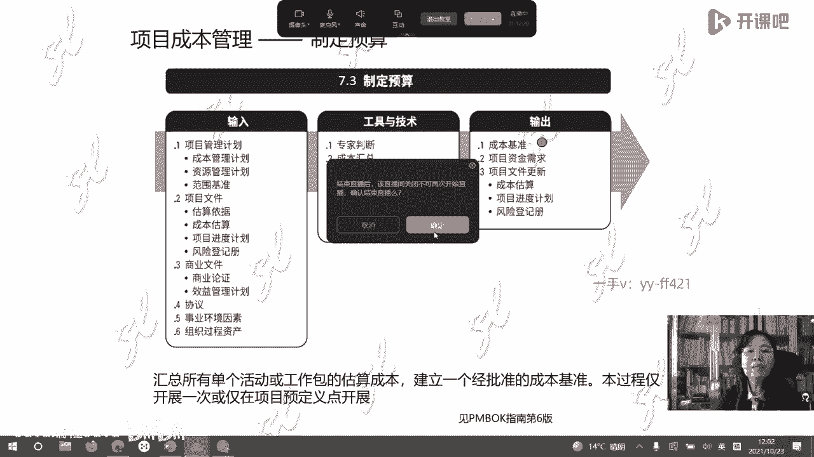

# -PMP认证4期 - P14：19-项目管理过程-成本【itjc8.com】 - OA工作流 - BV1yY4y127aU

好的各位学员好，休息时间结束，我们开始上课了啊，好咱们开始上课了啊，刚才我们说到进度压缩啊，给大家说完了，下面一个题呢就是一个进度压缩的一个例子，但是请大家呢对这个赶工啊，技术呢有一个正确的理解。

赶工它不是简单的加班，他还有一个名字叫做时间，成本，嗯时间成本平衡法，时间成本平衡法，那我们看时间成本平衡法是怎么计算的，那么这种计算题呢曾经在考试题里边出现过，关于计算题呢出现在考试题里面的。

我们才会介绍以前没有出现过的，那那还有不少啊，咱们没有更多的去展开，但是过去重量级项目为主的这个考试里边呢，这种题目多，现在呢也不一定多，甚至有的时候一次考试根本就不考。

但是我们不能都以这个考试不考试啊，作为我们学习的标准，还是要有基本的了解，还是要懂啊，那我们现在看我们用这个例题来说一下，关于进度压缩里面的赶工怎么计算啊，那么这个例题这么说，假如这是一个考试题的话。

说进度安排如这张图，一看这个图你就应该看得出来啊，他是一个什么样的图形，是单代号网络图还是双代号网络图，这个图呢把这个节点分成了五个格啊，那也就是说这个节点分多少，还是一个比较灵活的。

并不是很死板的东西啊，目前这个工期是18周，然后我们要把这个工期，在上级或者客户的要求之下压缩到17周，16周，15周，然后我们怎么压缩，压缩的成本是什么，就这样的题啊，叫时间成本平衡法。

已经有这个小哥哥说单代号啊都已经说出来了，很不错啊，这是单代号网络图，这个题呢案例呢就更简单，只有两个路径，那么哪一条是关键路径呢，我们现在先看正常历史啊，把它加一。

加上面这条路径开始a b结束这条路径啊，是正常历时是七周九周，这是16周，关键路径上的时长啊，不是关键路径，是路径的时长是16周，我们找关键路径啊是多少，下边c就是开始cd，结束是18周。

很显然下边这一条路径是关键路径啊，这一条是关键路径，因为它长啊，它最长啊，关键路径，那么也代表了这个项目就是18周，工期就是18周，现在我们要进行压缩，压缩三次啊，压到17周，16周啊。

15周有学员已经快速的都找到了啊，那么这个压缩是跟成本有关的，大家可以看到在这个图形里边也已经给大家了，正常的历史啊和正常的成本，还有压缩的历史和压缩的成本，什么意思呀，a活动他不是无限制可以压缩的。

你压缩到一周，压缩到零轴不干了行吗，那不行，它不是无限制，它最多可以压缩到五周，压缩成本是这么多，如果正常呢就花5万，但是有压缩就得花钱啊，6。2万你才能压缩到五周啊，那么其他都是这样啊。

都是这么解读的，嗯好的，然后我们就开始进行压缩了啊，现在嗯情况是这样的，我们要把18周压缩到17周，我请问大家啊，我们先把成本计算出来，先把成本计算出来啊，大家看一下成本计算，刚才我那个案例给大家了啊。

任务a可以压缩到两周，压缩成本是多少呢，拿6。2万减去5万啊，然后再除以二，因为是可以压缩两周嘛，也就是每一周呢你要压缩的话要花0。6，压缩也是需要成本的，对的啊，不是说免费加班的啊。

a b c d分别都算出来，我们就算完了，好的进度压缩有两个硬条件，这两个条件是什么呢，第一一定要压缩关键路径上的工期，这个道理大家都明白，之前咱们说过很多了啊，有的学员呢在考试的时候就找一个哪个便宜。

就压缩哪个不是关键路径啊，你压缩那个工期没有用啊，第二个压缩成本，被第一的活动，这两项你在做题的时候注意这两项，第一找关键路径去进度压缩，第二找那个关键路径上最便宜的活动进行压缩。

当然前提是那个都可以压缩，如果那个活动不能压缩了，再便宜也不行，注意这两条啊，基于这两条，我们开始做这个题目啊，对的好的啊，好继续啊，我们看我们把刚才我们说了啊，下边这条路径是关键路径。

我们把时间也都计算出来了，我们要压缩下边这条路径的历史，压缩哪个活动呢，下边这条路径有一个活动，c有一个活动d哪个便宜，大家回去翻一翻，哪个便宜啊，哪个便宜，压缩活动c对的啊，这个版面上也有。

但是你要理解啊，你不是照我这上念的啊，压缩混沌c因为c便宜对吧，c一压缩就把原来的是原来的是十周啊，压缩到了九州，但是压缩历史是九州啊，注意压缩到了九州，这个图形就变成这样了啊，九州了。

那现在下边这条路径它的历时是多少呢，17周上边我没动，刚才是16周，现在还是16周没动啊，是不是我已经把工期从18周压缩到17周啊，我已经完成了啊，按照题目的要求，我还需要继续压缩。

把这个呃工期压缩到16周，请问学员们在这张图形上压缩到16周，压缩哪条路径，压缩哪条路径，学员们已经说了啊，学员已经说了，压缩活动地压缩cd路径，压缩活动d啊，都已经找到了，在cd路径上压缩活动地。

为什么，因为c已经不能压缩了，压到最低了，不允许压缩了啊，那么这个贵活动d比活动c要贵，但贵我也得也得压缩他，因为没办法，那个已经没有空间了，好吧啊，这是压缩到了16周，那我压缩d啊，向下看啊。

压缩d上边是16周没动啊，下边也是16周，请问大家现在关键路径是哪条，从大王这个答案啊，接着往下，从大王的答案接着往下啊，对的啊，现在非关键路径是16周，原来的非关键路径16周啊。

现在跟我压缩到这个是一样了，所以关键路径变成了两条，两个都是关键路径了，这个做的对啊，就是让大家通过这个题去理解关键路径，再理解啊，好按照题目的要求，我们要把这个项目压缩到15周。

请问应该压缩哪条路径或者哪个活动，现在我继续压缩，压缩到15周，应该压缩哪个活动，还是从大王的这个回答啊，往下刷，从，有个学员用了一个货，用货可以吗，格格巫啊，小哥哥爱国者后面来了啊，压缩几个。

压缩一个是吗，对的格格屋说不可以，因为你只是压缩一个活动，那你另外一条路径还是长的，要压缩两个活动，压缩哪两个活动a d啊，刚才给答案给一个的，再想一想，对都要啊，都要压啊，都要压缩，压缩什么呢。

压缩a压缩d大家都选对了啊，这样呢就上边是15周，下面也是15周啊，那么这个我们再看啊，那就已经不能压缩了，说在我们再再把这个压缩到14周行吗，可以压缩到14周吗，回答我如果把这个项目再压缩到14周。

可以不可以，对格格屋马上就回答了，不行嗯，不行了，为什么不行了，嗯因为压缩啊，它有个空间限制的，它不是无限制可以压缩的啊，所以这道题大家做的不错，爱国者说太抠了啊，跟实际结合起来就觉得太抠了啊。

cd没办法压缩了，为什么压缩d有这个c一不知道为什么压缩低，那你再考虑一下，之前不是压缩过了吗，因为之前压到16周，现在压压缩到15周啊，又减一周啊，你压缩过了，那是16周啊，你只把上面压缩到15周了。

下边还是16周啊，还是长啊啊，所以把它理解通啊，看这个图形嗯啊还有学员那网络不行，还以为我们的课程没开始呢，啊好的啊，这就是进度压缩技术在考试题中的出现，就会这么考的啊，人家会让你选都会选啊。

但为什么c和d压缩要选d c还能压缩吗，压不动了呀，怎么看能不能继续压缩了，看这儿啊，正常历史和压缩历时压缩力时是九啊，压不动吗，只压了一周不动了，这个也不能压了，你看这压不动了。

所以压到16周就压不动了啊，压到15中啊，就压不动了，ab加上没有15周，加这个样，加这个，这不是15周吗，这好多学员这还蒙着呢啊，这6+5不是15吗，6+5是15啊，看怎么做啊，对的啊。

自由浮动时差没有了啊，嗯不不清楚的学员只能看回复了啊，这张表格就把前面压缩的步骤稍微总结了一下，在考试里呢不会让你总结这个的，基本上不会的，就让你压缩完了就行了，但是你自己心里会总结也可以啊。

对的有些人在讲解了好，刚才我们说的是重量级的项目在进行进度管理，定进度计划，但是如果一个敏捷项目，不需要那些不需要分解到这个工作，然后再到活动再排顺序，在这个计算三点估算，在关键路径法折腾完了。

在这个关键链法不用这么做啊，他只用这样简易的这个工具，所以他是轻量级的呀，我只这样发布计划就可以了，我只在这里写任务a5 个小时任务，b任务c任务d我们在最后的那一天啊，明天的课。

最后那一天的课程里会给大家讲敏捷项目管理，告诉你这个是怎么估出来的，不再需要呃，或者说啊没有必要需要三点估算呀，关键路径啊，那么去计算了，不用那么复杂，因为什么敏捷的这个项目。

你本身你迭代的那个时间就短，在一个迭代里，你完成的那个任务的数就比较少啊，那它简单的这个逻辑关系，简单的图形还是必要的，不需要那么复杂，所以你只这样定计划就行了。

如果一个轻量级的进度计划就用这个图表示嗯，如果重量级的进度计划就用甘特图表示嗯，这个地方应该大家都清楚了啊，好的我们就把这一段说完了啊，今天我们这才进入我们今天的这个内容，项目的成本管理。

才进到项目成本管理这个内容里来啊，按照概念说啊，按照基本概念啊，呃没关系，你没办法吸收，需要反复重复，我觉得其实大家在中国的课堂上课，已经很幸福了，然后我们在美国课堂上课，这么厚的书大概是三四百页吧。

一天老师就讲完了嗯，你剩下的时间都要去刷题呀，自己去复习，自己去练习啊，不是说你在课堂上就能学到什么东西啊，如果一个新不是说在课堂上学不到，你新掌握一个学科，新学一个课程，你能够在课堂上所掌握的东西。

有10%都不到嗯，这10%随着你不不去学，不去练，还会衰减，所以你必须要经过复习讨论，才会增加40%，经过小组活动又增加40%，这样你才会掌握的更多啊，必须得细化，去真正的去理解，去细化啊，好的对的。

美国人讲的就是自我学习啊，所以他的内容就很多，接下来我们看成本这一章，这是关于成本的定义，我就不在这念了，说字典里怎么说怎么说啊，什么叫成本呢，就是你为了获得一个资源，你为了获得一个劳务。

你所放弃的那个东西一般以货币形式存在的，以货币形式存在的，你为了要东西，你花出去的那个东西，你对这个货币，对这个钱进行管理，就叫成本管理啊，这是我们对成本的这个概念，只是我们现在进行的是项目成本管理。

不是公司企业运营的财务处，管的那个成本管理哈，但是这里边有一些基本概念，在财务管理领域它是一致的，需要大家掌握的啊，那我们看一下啊，成本管理就是你对这些钱进行管理，曾经有一个学员问我。

他说我在公司根本就不涉及钱，我们也不管钱，我们的项目经理这一章，成本这一章可不可以不学，我们就不管钱，不学了，答案是no不行，必须要学习，因为老板把这个钱给你，让你做项目，你要对他负责呀。

至少你要盈亏平衡，你不能哗啦哗啦赔的一塌糊涂，那这就又涉及到项目经理的责任了啊，涉及到项目经理的责任的问题了，接着我们看成本的一些概念，成本的分类，我们这里涉及一些这些啊，那这些都是在考试里面出现过的。

那更多的我们就不再在这儿再说啊，直接成本，间接成本，你把他们当成一对儿来学习，直接构成了你这个项目的那个结果，产出的那个结果的啊，花费或者成本就叫直接成本，不直接构成你那个产品是间接构成的。

间接组成的就叫间接成本，我给你举个例子啊，你加工一个零件，比如你要加工一个零件，这个零件是个是个钢的，不锈钢的那个不锈钢就直接成本啊，你没有他做不出这东西来，你直接你要把不锈钢的钢坯买回来，经过加工。

它变成直接成直接的这个花费啊，原材料还有什么员工项目团队的薪酬绩效，他们的工资啊，这都是直接成成本，团队成员的工资福利待遇，直接成本，什么是间接成本，管理人员的薪酬福利待遇和水电气暖，没有水电气暖。

这个零件加工不出来，开发不出来啊，所以必须得花这个钱，但这个钱是间接的，包括你公司的管理人员，职能部门的人员都在协助你做这个项目，所以他们的工资薪酬待遇都属于间接成本，直接成本和间接成本需要嗯。

需要了解下一个一对固定成本和变动成本，固定成本就是不随着你这个项目，产品数量的变化而改变的啊，成本变动成本是随着产品数量的变化而改变的，成本举个例子，比如说如果是线下课程啊。

到线下到那个会场去听培训的话，对培训公司来说，什么是固定成本啊，租会场的钱，老师的这个费用，这都是固定的，什么是变动成本呢，就是每增加一个学员，要增加一部分教材啊，这是跟数量有关的，增加教材对的场地费。

老师的费用等等啊，那么这个变动成本是什么，学员的教材费用，你多一个学生是不是多发一份，多一个学生多发一份啊，呃给你发的资料啊，题目啊，什么讲义，这个你讲义义也是要花钱的，平均摊了一本讲义，比如说多少钱。

多一个学生就多花一个这个成本，这叫固定成本和变动成本啊，下一个概念机会成本，机会成本是指的，我由于选择了项目a，因为我有多个项目选择，我只能选一个，我要放弃其他的项目。

因为我选择项目a你所放弃的项目的最大收益，注意是最大收益啊，不是最大成本，你放弃那个项目的最大收益，就是你做选择项目a的机会成本，比如说嗯我今天不来上课，我不在这个开课吧，网站上课，自己是老板。

我到外面要去谈一个工程，谈一个项目，我谈成了以后可以让我挣10万块钱，可是我没去谈项目，我是选择了到这来上课，那你到这来上课的机会成本就是10万元，因为你可以挣10万啊，那如果你有三个项目。

今天可以出去谈，一个谈成了挣10万，一个谈成了挣15万，一个谈成了挣100万，三个项目，那我选择来上课，我就没去谈，那你的机会成本是多少，10万十五万一百万啊，这个案例大家刷一下屏。

唉马上就有同学蹦出一个数来了啊，而且是正确的啊，因为你那三个机会也只能选一个，你不是把有的同学把那三个加在一起啊，那不对啊，100万对的，这就叫机会成本，但是机会成本不作为项目选择方法。

在可行性论证的时候说，机会成本一般不这么说，因为机会成本不确定，好像你出去今天签约合同挣100万，你觉得挺亏的，那也没准，你去出去你你还赔了100万呢，你迁回来以后还赔了100万呢。

你想我还不如来上课呢，所以这个机会成本，它不是一个相对确定的一个概念啊，它是一个就是具有这个定性的啊，这种价值的这种论证，所以他不作为说项目选择方法对，说不定没签成功的，对的，你得鸡飞蛋打了课也没上。

那个也没证，所以机会成本我们要理解它的概念啊，也会在考试题里出现啊，就刚才我给大家说的那个例子，你答100万的那个就是考试题，比如说那样啊，那个叫纯粹靠猜，所以叫机会啊。

那机会成本呢它是具有表征意义的一种说法，但它并不表示直接花掉的成本，因为有些人就不懂你，比如说我就曾经接到一个，我有一个就是比较好的朋友，中科院的一个教授啊，他给我推荐了一个微信，因为我也比较忙。

平时也很少去去看这些东西啊，这个v现在这个名字啊是一个名人，大家都认得，就我就不说这个人了，但是我相信这肯定不是这个人，他自己的这个微信，他肯定是利用这个有的人利用他这个名义啊去，或者是他的团队。

或者干嘛操作的一个什么事儿啊，加上我了，加我以后天天在这跟我说话，天天给我这个我挺我挺着急的，因为我确实没有时间啊，他跟我说，你做一个项目吧，我给你推荐一个项目，这个项目特别好，你看你天天在家闲着干嘛。

你每天拿出来可以，就是每天你要做这个项目，每天可以挣50块钱呃，说让张老师来做，每天做50块钱啊，是不是诈骗，咱们不知道啊，只是因为我这个好朋友呢是特别靠谱的一个人，所以呢我不相信他会把差诈骗的这个。

微信推给我啊，所以我就一直保留着这个人吗，然后他就跟我说，你每天挣50块钱，我说不行，这个机会成本太高嗯结果他就开始做工作，开始语音说的这个不花成本，这个是不花成本的啊，怎么怎么样。

我说你连机会成本的概念都不懂，你在这儿告诉我，我每天都挣钱，你说我该信你吗啊，就他机会成本都不懂，他说每天挣50块钱，不花成本，那什么是机会成本，他没听懂我这个意思啊，我拒绝他，我高大上一点对吧。

我说我不选你，我不我不每天挣那50块钱，因为机会成本太高了，我不知道大家理解了没有啊，如果我们这个直播间里也有学员不理解啊，还是得因为我们是专业人士，你得懂啊，你得知道张老师是怎么拒绝他的。

以后你也可以别人找你的话，也可以用这种说法来拒绝一些事，你说你那个我不能做机会成本太多了，对他说这个这个不花钱，你看他到这儿，你说你跟他还有什么可谈的呀是吧，所以后来再在这个麻烦，我就果断的我就把他了。

把他给清出去了，没办法跟他聊天，根本不是一回事啊，所以我们的学员也是这样啊，你要明白机会成本是什么概念，你别把这个当成你看那个还要挣钱呢，做这个呢，对的那个那个50块钱机会成本，这个对我来说啊。

这个不合算啊，我每天我可以挣60呢，开玩笑啊，这机会成本太高了啊，我是说我说机会成本太高了，他不花成本，这个不要花钱的，又不那连这个都不懂啊，所以这怎么怎么弄到一起啊，啊好的，这个就说到这儿啊。

大家也开心一下啊，再说一个沉没成本，之前呢，我也看别的学员在直播间里也刷过，关于沉没成本这个概念啊，我们以前也是呃花了一些钱了，现在我们在做的这个项目呢，其实跟我们以前花的那个钱，做的基础呢是有关的。

但是我在这个项目里啊，我不不把这个沉没成本拿出来说事儿，也就是不拿这个沉没成本管客户要钱啊，所以这个钱就叫做就就不啊沉在这像沉船一样，我不管客户要了，比如说我给大家举个例子啊，呃我们公司呢之前有实例。

盖了一栋大楼，花了一个亿啊，盖了一栋这个写字楼，现在我们承揽一个项目，来了一个这个项目，这个项目其实在100万 200万，比如说啊你盖那个大楼一个亿呢，你说你把那个成本都分摊到每个项目里来吗。

原则上你摊起来没有问题，它也是全成本核算，但是我们拿那个楼在都摊到每个项目里，谁还给我们做事啊，那我们真的就是一个一个单都会丢单了，所以我这个成本就沉没了，我不再在每个项目中去算我这大楼一个亿的钱。

我不管这个项目里要钱，因为我这个楼还有别的挣钱方式，比如说我用不了，我可以出租，我买的这个龙涨价对，可以这么理解，就当打了个水漂，但他不是打水漂的啊，他们是有别的增值的做法的，特别是对中国来说。

保值的这个作用高于世界上所有的国家，可以说啊，当然他现在国家也在调整，未来以后呢可能会这种现象会减少啊，我只是这么说，还有一个例子，比如说我们公司啊，之前做过这个项目，特别认真的做，也花了不少钱。

结果做做做我们就做不下去了，因为我们技术也不具备，能力也不行，我们最终就难给客户拿出一个好的成果来，那老板就果定的果断的停了，咱们这不做了，可是我之前花了不少钱呢是吧，那过了5年之后，公司能力也强了。

技术实力也大了，经济实力也大了，财大气粗了对吧，也有钱了，这个时候市场上又有过去，我们做的类似的那个项目，我们又去招投标把它给整过来了，争过来以后，我以前因为做这个项目，可能赔了或者花了一些钱。

不是放到那儿了吗，那有人就会建议你，看我们现在还做这个同样的这个设备啊，同样的这个项目啊，那我们就把以前那个赔的钱都加到这个项目来，然后我们去挣钱嗯，博弈论中沉没成本有好有坏。

对的沉没成本不一定都是好的，也有呃，也不一定都是坏的，得分情况啊，所以我给大家举这个例子，就是想说第二种情况，我们之前为那个项目所积累的那些花的钱，如果你不再跟新的这个客户在，要这些原来的这个基础。

原来积累的这个东西啊，那么这个钱也叫沉没成本，如果你要要，也不一定没有道理啊，也不一定没有道理，项目都是要分担成本的，那就看情况啊，对的这个学员举的这个例子，跑步机啊，它是对的，嗯好的。

那么这是沉没成本，下一个我们再看生命周期成本，如果在考试的时候和你看资料的时候，没有特殊说法，这个真就这样说，生命周期成本一律指的是长周期，长周期就是产品生命期，他考虑了项目结束以后，产品走向市场。

后边的运维啊，售后服务啊等等啊，它是全寿命期的成本，哦没接成单子呃，呃不是这样的啊，这个有学员说，如果我没接成单子，这个客户的钱算沉没成本吗，呃在这个项目中不算沉没成本，因为你就没接成单嘛。

你又花了钱了是吧，那你下次再做项目的时候，下次接跟这个类似的啊，这样的时候，那么这个不会回来了，下次再做类似的项目的时候，你不能回来想，我上次还请你们这公司吃饭了，把这个也谈到这里来嗯。

如果对一个下一个项目来说，这个是下一个项目的沉没成本，在这个项目它就不是沉没成本，因为你没谈成啊，没有项目啊，就没做成，但你花了钱了，先封在那，先放在这儿了，对上亏损啊，市场开发费用算市场开发费用。

或者说你1年都市场开发了，算成亏损了，但是你下一个在做项目的时候，那个不计算进来的那些成本就是沉没成本啊，这个大家就理解了啊，好的再学习一个概念叫啊这个经验曲线，经验曲线讲的是，当你大量重复做某件事。

或者做某一个产品的时候，随着重复次数的增加，随着重复次数的增加，或者叫数量的增加啊，数量的增加效率你做这个事的效率会大大降低，带来的就是成本的降低，所以在成本管理中研究啊，经验曲线或者学习曲线。

实际上这就是一个常识啊，别人把这个变成一个什么学习曲线，让你来理解啊，我给你出出一个这个案例啊，比如说你新到一家公司，可能刚步入职场，在大学里边也没学过，也不会，老板让你做ppt，不会做。

第一次做那p p t愁死了，都不知道怎么弄，好多东西也不行，问啊问问问好多啊，啊这个错了啊，哎学员说的对啊，诶不是效率降低，而是效率提高，你看学员学会了啊，就在找这个问题了，效率提高啊，不是效率降低。

效率会提高，是口误的啊，对的大家说的对，我正在举这个例子啊，刚说了一半，这个例子呢就说让你做这个p p t，你第一次是不是很慢，很慢，不好做，如果你每天都做，每天都做，每天都做大量重复的做p p t。

效率是不是会越来越高啊，会越来越高啊，老板甚至给你一个小时，半个小时就可以拿出来了啊，甚至你还有点模板，你更快就能拿出来了，随着效率的提高，做这个ppt的成本大大的降低，至少人工成本降低了。

因为原来你做这个p p t可能八小时，现在我做可能18分钟就做出来了，嗯没错，这就是伸手变熟手，没错，就是这个概念，伸手变手手就被人家外国人搞成了学习曲线，所以你要习惯这个说法，也叫经验曲线。

考试的时候见到这个概念，别不明白什么道理啊，好的接着我们再讨论这对概念，应急储备和管理储备，应急储备他就是针对已知的未知风险的，作为项目基准中的一部分，由项目经理来把握和管理，这个之前我们说过不少了。

也就是钱，之前我们在进度里面讲的是应急储备时间，就是成本，同样管理储备是应对未知的未知的，这一部分费用是高层管理者所管理的，项目经理无权动用，如果他想用，必须要获得高层的批准，你没有权支配。

所以这个成本也是项目基准之外的，就成本基准之外的费用啊，成本不是你可以控制的，好的，那我们说完了，接着我们又讨论一个好麻烦好麻烦的事啊，呃如果你现在暂时概念想不通，先把这个公式先死记住。

然后再慢慢的把它想明白，在这个成本管理中，不能回避的一个概念叫做折旧，我们之前学过折现，就是把钱的未来值算成现值，折成现值啊，现在我们做的叫折旧，怎么折旧呢，就是你买的大型的吸柜的设备。

还有一些重大的固定资产的投入，你一大笔钱投了好多了，你已经投出去了，那么在你后续的经营活动中，你投出去的这些钱，实际上当时是帮助你做了经营活动，在后续帮你进做了经营活动的。

可是你当时刚投的时候不一定帮你了，后续他帮你做了这个经营啊，帮你做了就帮你赚了钱，那么你利用原来投的这个钱，后续赚了钱，那原来投的钱里面呢有一些东西啊，就可以在这个现在赚的钱的，这个利润里面给它减掉。

为什么就不用再去上税，你看你前期投入那么大，现在开始挣钱了，你挣的这个钱花国家税收都给你收走了，你应该减掉什么，我原来买这个设备，买这个楼做了重大的投入是吧，得把这个钱得适当的给我减一些啊。

我就是在这个利润里面，扣掉了这些重大投入以外再去上税，就这么一个道理啊，所以通过折旧可以减税，减少这个税收这个概念也在考试里面出现过，就考过这样的题，也考过计算题啊，咱们这里快速说一下。

折旧有两大类方法，一个叫一般折旧，一个叫加速折旧，在中国也是这样，这个税收啊相对来说还是比较简单的，他的那个算法也比较简单啊，就直接要钱就好了，但是到我们中国算这个税收有点复杂，有点麻烦。

但你不用管那些，你把这个大的概念要理解，分折旧分两大类方法四小类，第一大类叫一般折旧法，一般折旧法的第一个直线折旧就是线性的折旧，第二个叫工作量折旧法，嗯不管是在考试中还是在现实实际的应用中。

这个都现实里用的很少，基本不用考试里边就没考过，但是作为知识体系的完整性，我把这个给大家放到这儿了啊，第二大类叫加速折旧，顾名思义加倍了啊，双倍法，双倍余额递减的这个办法，第二种法年数总和法啊。

我们分别把这四种方法的计算给大家看一下啊，第一个做法叫直线折旧法，假如我买了一个这个固定资产用了几年了，你用了几年不就用旧了吗，啊，所以你要就对你用旧的那个价值进行折算。

就用固定资产的原值减去现在还值多少，值那个值多少，就是残值，也就是你把它处理了卖，你看你还能卖多少钱啊，那个就是残值啊，净残值你拿你买这个东西的原值减去这个残值。

你可以还卖的这个钱得到的这个差不就是救吗，你折的不就是这个旧吗，那么我的这个东西预计使用的年限，使用期啊是一个数字，我除以它就相当于我每年用旧了多少，每年用旧了多少，这是直线折旧法啊。

工作量法跟直线折旧法一样，我之前说过，没考过试，现实里用的也少，只是下边儿除以工作量，上边都是一样的嗯，也就是分子都是一样的，分母变成了工作量了，就差别在这儿，所以他们统一都属于一般折旧法。

一般折旧法净残值怎么来的，实际统计的，你把你这个设备拿出去卖，人家说给你多少钱，给你的那个钱就是残值啊，这是已知条件啊，净残值就是还值多少钱，给你举个例子啊，假如你买了一个买了一个呃一个重大的设备。

买了一台车吧，买一台车啊，你买这个车的时候是20万啊，过了5年这个车卖10万，你不是卖了吗，这个就是净残值，这个车用旧了多少钱呢，用旧了10万，因为我原来买的时候20万呢，用旧了10万嗯，市场价格。

这个是不是反推，这不是反推啊，这是你实际去卖人就给你10万块钱，你让人家估价做价嗯，大家可以知道，其实有车对车有感觉的，这个学员都知道，你20万买一个车，从这个4s店开出去就不值20万了。

人家你要卖可能就18万了，就这样啊，就当时出去以后就会减价的，那这救了多少，救了2万，那个就是旧嘛，嗯所以这个实际一般是算目前的净残值啊，就是你现在卖你卖多少钱啊，算这个净残值，但是这个对呀。

这个房子在中国就不一样啊，啊在国外呃是不是这样的啊，所以大家拿房子来理解，就不是这样的，车是加速贬值，这房子不保值了吗，不仅保值还升值了啊，所以这个是折旧的这个办法啊，好的双倍余额法。

把直线折旧法乘以二，分子乘以二，最后2年不能乘二，最后2年平均分配啊，你用旧了多少，用旧的那个数字都乘以2x2，到了最后2年，你就把它平均分一会儿，我们举例子啊，不用着急，好的年数总和法公式就麻烦了。

公式复杂了，公式复杂了，叫做它除以的分母是折旧年限乘以折旧年限，加上1÷2，这是什么等差数列，有的学员都忘了啊，所以今天这个估计全乱了，学的啊，等差数列的前n项求和公式，求出前几前面的这个就是几项啊。

它的和那我们这个现在算折旧，我们是1年啊为单位的，所以这个年呢年的极差就是1年呃，呃这个公式是需要记的，但是我想告诉你啊，考试的时候没有考过那么多年数，考的年数是少的，所以这个前n项求和公式。

你只要把年数加起来就行了，比如说折旧折5年对吧，那么这个分母就是什么呀，就是1+2+3+4+5年数总和，你这么算就行了，不用记这个公式了，因为考试如果要多20年100年呢，那你你你这样做不就慢了吗。

你一加你加了100去太多了对吧，那么再说你折旧也一般也没有，折旧100年的题目，那哪有那种东西啊，这也就不现实了，所以在这个这个办法就叫年数总和法，把年数加在一起好，我们这几个说完了以后就要开始啊。

给大家一个案例了，反正这种计算题拿个案例做，大家就明白了，有一个鞋厂，广东的鞋厂固定资产的原值是18万，预计的残值是1万，用旧了多少，180000-10000就是17万，我要对17万进行折旧。

使用的年限是5年，那么这个企业呢要上33%的，企业所得税也给你了，资金成本率也就折现率是10%，给了你值这个折现率了啊，那个公式都很简单，不是需要死背的，每1年这个鞋厂这5年啊，他经营的数据都在这儿。

第1年挣10万块钱，这个是没有扣折旧的，之前的这个利润，第2年9万，第3年12万，第4年8万，第5年76000啊，就这么个数据，然后我们开始计算了啊，开始计算折旧了，首先我们第一用第一种方法计算折旧。

180000-10000是17万，170000除以预计使用年限5万啊，5年，那你得到的是1年折34000，就是平均每年都折34000，然后你把这个每年要上的税34000，第1年的这个啊。

你拿100000-34000，因为34000是不用上税的，34000是那个旧折的那个旧不需要上税的，拿100000-34000，就剩了66000，66000，企业所得税是33%，就是你第1年上2万多。

第2年啊，然后你上的是这个18000，第3年啊，在这上了这么多，第4年是这么多，你把它都加起来啊，就得到一个数字，得到一个数，因为我这个镜头挡住它了，我一般轻易不不挪，这个镜头容易死机啊。

大家可以看一下自己手里的资料啊，然后这个嗯5年以后的数现在多少呢，所以我要折一个县，把第1年的数2万多乘了一个0。909，0。8260。751，这个数字你熟悉吗，嗯折现率是10%，按10%算的。

还记得那个折线的公式吗，一加r的t次方分之一，人家给你那个表格里都算完了，0。9090。8260。751对吧，我们练习过是不是这样折旧一下，我这样折现一下，折到现值，折到现在的这个值啊。

这是直线折旧法啊，折现因子对的没错，大家想起来了啊，而且10%，我们是不是那个之前的那个表格都记得了，有这么几个数字，对吧啊，好我们现在就不管了啊，工作量法一样，我就是除以工作量啊，我跟大家讲过了。

我们一般不会不是说一般了，一般在现实里都不用这个办法，在考试的时候也不做啊，折现率要再讲一下，你要回去看回回听啊，折现率已经是过去时了，看那个回放的时候再把折现率，因为很多同学都能说得上来啊。

就一定要跟上好的，下边到双倍余额了，双倍余额现在我的日折5年对吧，我们不是折旧折5年吗，那前3年都成二，前3年啊，每前3年都乘二，最后2年把剩下的那个不乘二，把这个最后这2年平均一分还剩下多少。

最后2年不再乘二了，就变成直线折旧法，一边一分就分出来了啊，这是双倍余额加速的啊，年数总和法，我把这个分母年数1+2+3+4加到15啊，然后我把这个每年的每年算出来这个数字啊，我去呃除以15。

除以15又得一个数啊，然后你再做啊，把这个也都累计统计起来，最终呢我们要看一个分析表，你看这个过程里的，你看不出声来，请大家看最后一行数字，最后一行数字啊，他虽然做起来麻烦点，但不难啊。

最后一行数字我开始提问了，最后一行数字，就是这家鞋厂按照不同的方法上税，上那个税的数，我现在问大家按什么方法上税，对这个鞋厂的经营生产管理最有利，最有利呢就是最有好处呢，老师话音还没落。

有学员都已经给出结果来了，你为什么选这个呀，因为这个数字最小，对不对，上税上的最少啊，嗯那么用什么方法来上税，对我们公司的经营就是财财税收啊，啊对我们公司的收入吧最没有利呢，最不好呢，有学员选双倍啊。

哦那是上面那个问题啊，对的直线法为什么直线法最不利，因为上税最多，为什么双倍余额最有利，因为上税最少就是这样比的，就这样看的，我们都可以看到了，你看我们比的都是限值啊，我们不比那个未来值。

道理其实是一样的，他未来值他也是这个限值啊，他是这个多这个少，未来值也是这样的，也是这个多这个少的嗯，所以在这里考虑折旧的意义，就在于这里哪种方法上税最合适，算完了你就知道了嗯好我们给例题啊。

看看第一个下列哪种折旧方法对税收最不利，刚才你不是已经答了吗，嗯为啥不是线性的，你不是计算了吗，线性的不合算，线性的上税上的多啊，不是让你计算了吗，第二种第二题。

双倍双重余额递减法是一种什么样的折旧方法，是三加速折旧的办法啊，第三题说abc公司它使用年数，年限总和法已经限定了，在考试里让你用年限总合法来计算折旧，他们买了一台价值15000的计算机。

3年以后可以卖3000，这个就是残值，3年以后可以卖3000啊，然后折旧折3年是吧，折3年，那么问你这个你折你折的这个折旧是多少啊，拿固定资产的原值15000减去残值，0。3除以年数总和，1+2+3。

所以你不用背那个公式啊，就是六马上有学员算出来了，2k哪个是2k的答案，哪个是2k的答案，2b2 b就是2k的答案，就这么计算啊，所以这个公式也是比较简单的，你把那个年数总和加在一起。

但是这个年数过多的时候就公式好用了啊，那年数过多，其实在现实里面基本上也没有那样的情况啊，好的选2b选项啊，如果问，dd折旧多少，第2年第2年你就算就1+2嘛，底下1+2啊，但是你这个是3年以后的残值。

你要是第2年你得算第2年的残值，第2年就不是3000了，可能比他比这个卖的多一点啊，时间越长，你就卖的越少啊，所有的pmp考题都没有重点非重点之分，它是一个结构化的知识体系，所有知识都要了解都要会啊。

感觉没什么用，有用啊，你要是经营，你要是你觉得算税啊，你用什么办法去折旧啊，这是国家都有法规的，中国呢是有新会计啊，新会计准则在这个会计新会计准则里，公司进了那个高大精尖的设备。

都在财务管理那个地方会算的，比如说有服务器，你要服务器要去折旧，折了旧就不用上那么多税了，可以发给项目组的人了，怎么不管用啊，管用啊啊好，现在都讲全成本核算对的啊，这个知识领域有四个过程，听起来比较少。

但是很难啊，难度特别大啊，那么我认为就是在这个49个过程里面，或者这十大知识领域最难的，最不好接受，最难吸收的就在这一章呃，前三个过程做的是规划管理，最后一个过程做监控那些事儿，对成本做监控那些事儿。

第一个过程得到的叫成本管理计划，这个东西是12个子计划之一，对成本管理的一些规矩制度，第二个过程估算成本得到什么呢，得到一个数，或者一组数，如果你用三点估算的就是一组数，你估算出了一个成本。

比如说100万正-100000啊，呃1000万最低多少啊，最乐观多少，最悲观多少，你估的是数，估的是这个资金，就叫估算成本，下一个过程，7。3叫预算，制定预算预算就是你把以前估算的每个工作包。

每个合同活动里面啊，他总结出来的就是你估出来的那个数给他汇总，加在一起，是不是又加一个总数，总数就完了，不对啊，他最关键的概念在这里分配，也就是7。3得到了一个成本基准，这个成本基准不是一个数。

是一条曲线，一条s曲线啊，得到一条s曲线，所以它可能最高的这一点是一个数字，这个数有可能是估算的上面估算的这个数，但是整个这个过程定的这个基准是一条曲线，我之前给大家说过，曲线作为基准的意义在哪里。

因为每时每刻都有检查标准，他是被分配到项目里，怎么分配的，横坐标是时间，纵坐标是成本，他按照时间把这个钱分出来了，分到每一个时间段，一条连续的曲线，得到了成本基准，这是第三个过程啊。

我们最终要得到的东西，最后一个叫控制成本，控制成本就是对成本做控制，那些事儿怎么呢，跟踪测量偏差，计算偏差，对比偏差，分析偏差，这个评估，最后这个偏差出了，我到底是下一步怎么做，做决策，要不要变更预预。

我们这个给预测一下是什么情况，我们做一个趋势分析等等啊，这是成本管理的几个过程里面讲的啊，好的这个作用我们不再说了，刚才呢也有一个学员提问，可以选折旧方法吧，对项目团队要理解折旧方法啊。

他是怎么选的对啊，何苦上青天说的更对，折旧方法可以选，但是是公司选择的，而且是做规划的时候选的，不能中途来回变啊，你选了这个办法，你就你们公司都是拿这个办法上税的啊，那不是说你你你你觉得一会你要这么做。

一会那么做，那是要法规的，按照法规做的啊，第一个过程我刚才讲过了，得到的是成本管理计划，12个项目子计划之一，用了专家判断开会呀，数据分析啊等等啊，这样的一些技术。

那么成本管理计划里边应该都有哪些内容呢，对的那大家都应该选加速折旧，那你得懂啊，你不懂就不选加速折旧了，你就选一选一个好算的直线折旧了，结果对你是最没有利的啊，你不是学过以后才知道吗，所以要了解啊。

成本管理计划就管这一章的其他的过程如何管，如何管，如何管啊，那些要求啊，制度规定里边包括成本的计量单位元角分一元，千亿元，千万元等等，还是万元啊，精确度和准确度，在质量管理那一章，咱们在讨论这个概念。

组织程序链接也在后续讲，现在说不了那么轻，控制成本的临界值，它那个临界值的报告等等啊，他是什么样，那么应该呃怎么样的去报告，他的报告格式都应该在这个制度里规定，另外还有一些其他的细节，比如说怎么融资啊。

怎么筹资啊，当汇率波动的时候怎么办，如果你的项目是涉及境外的，是跨境的，那就一定要考虑汇率问题，考虑汇率问题不一定项目经理考虑，你没看我们工具里用了一个专家判断吗，你找专家来，有金融专家，有懂的呀。

嗯让他们来帮我们来进行这个管理，另外在这个绩效管理中，成本是一个重要的迹象，在项目管理中啊，那我的这个绩效怎么衡量呢，我在这里定一些绩效衡量的一些规则，这里面具体的这个规则，我们后面学完了你才能知道。

所以这个地方我不强化每一个细节，学到后面你就懂了啊，好的，第二个过程估算成本，刚才讲过了，得到一个数或者一组数，他们就叫成本估算，每估一个成本估算跟着有一个二叫做估算依据，你凭什么把这个活动估算出来。

就是5万，凭什么攻完了就是11。3万，你给人家一个依据，给人一个支持了一个背景啊，资料输入没有更多的要说的，我们看看工具技术跟我们学的进度管理，那一章啊，概念基本都是一样的，你可以用专家判断。

可以用一些决策投票投票啊，可以用项目管理信息系统，自动化的去估都可以啊，另外你估算成本的时候也可以用类比估算，它比较粗量级啊，用参数估算这个也比较粗啊，也比较粗啊，下面自下而上的估算。

这是详细估算用的三点估算对吧，呃呃自下而上的估算啊，这个不是详细估算，三点估算是详细估算，自下而上的估算，要跟其他的估算方法配合，就从下到上加起来，跟估算成进度的时候，那些方法具体都是一样的。

三点估算的计算公式都是一样的，我们在讲成呃进度的时候，就已经把成本的三点估算的公式也给大家说，完了啊，我在这里要说一下的是带红点的质量成本啊，和成本估算估算依据，我们看一下估算依据。

还有一个名字叫做支持细节，也就是你凭什么给这个活动估出来这个东西，你支持他的证据在哪里，那么这个就是依据的文件如何算出来的，你的那个假设制约条件，还有你估的这个准确度，就是你估的粗啊还是细呀。

嗯这是关于估算依据啊，质量成本没有一次考试不考的，考得还很灵活，一定要掌握在管理项目中，可能一般的技术人员管理项目，就会把自己的眼睛就盯到那个直接成本上，间接成本就忽略掉了。

嗯那些管理成本想的就比较少了，就是成员的这个薪酬啊，待遇啊，呃比如说管理者的一些工资啊什么的，这个直接构成的原材料，这些可能大家想的比较多，但是在真正在项目中，还有一些管理成本也需要在这个估算里面考。

虑到管理成本都有哪些呢，质量估算，这个质量成本在进行估算的时候有哪些呢，我们看一个专业的概念，来自于质量管理领域里的，叫做质量成本啊，质量成本分两大块，四小块，我经常会说叫质量成本，填字格。

在你的心里啊，画一个田字格儿，这不是一个田字格吗，质量成本填资格啊，从中间对称的左边这个叫一致性成本，英文翻译呢有的也管这个叫good的成本，就是好的成本，他是为了避免失败，我花的那个钱什么钱管理的钱。

管理成本，管理上的成本啊，为了别做坏我花的这个钱，那么它包括又包括两项，我们不是田字格吗，这又拉了一条线啊，因为这个图画的不是直的，我这个田字格拐弯了，上边左上角叫预防成本，我为了把这个事情做好。

我多花了一些钱，预防的出现多花了什么钱，比如说多给员工培训，让他们的技能能力高，少出错误，比如说什么叫文件过程就是标准化啊，我把项目的文档都固化下来，流程都固化下来，标准化管理。

那我这个标准化我搞这个文件的固化，它是需要花代价，花花成本的，但是我这地方花了一点成本，那我后面做起来就快了啊，这叫标准化，另外在完成的时间呀，设备的管理啊，比如你设备预防为主啊。

你的设备平时国家都是有规定的，哪些设备是呃一类保养的，二类保养的，你要保养这个设备啊，就像你开车一样，你不管不顾，你就瞎造啊，那你将来出了这个问题，那很危险的，你平时就要开多少公里了，去加油是吧。

平时开多少公里了，你开到4s店做的检修，做的休整，小修大修小保养，那个叫对吧，叫车辆保养，你是不是都要干这个事儿啊，这个就是对设备的预防性的投入，你可能不投他也没坏，但是你真坏了以后就麻烦嗯。

那不仅是麻烦，可能还很危险，左上角叫预防成本，左下角叫检查成本或者叫测试成本，评估成本都可以，这么叫啊，检查成本它是产品做出来了，不是预防了，为了不把这个坏的东西交到消费者手里。

我们公司内部要进行大量的检测测试和检查，比如说质检人员，检验人员，他们是会要花成本来干这个事儿的，用了评估呃，测试检查这一条要引起大家注意啊，叫破坏性实验带来的损失，有1年考试考这个题目。

好多学员就彻底的就蒙，什么叫破坏性实验呀，这不花成本呢，怎么破坏性实验，有一些产品，特别是实物型的产品，或者是一些比如说金属类型的非金属也有啊，这种产品评估成本翻译得不好，对，你就可以是check成本。

检查成本就行啊，他这个写的评估的啊，那么这个这件产品它有物理性能，比如说一个金属的零件，它的什么叫物理性能，抗拉强度，抗压强度可能大家不搞这个跟这个比较对，还有汽车的安全碰撞试验。

你撞完了汽车不就坏了吗，你不是说修修再卖，那不带那样的啊，还有的零件金属零件抗拉强度怎么做呢，有拉伸试验机啊，你到那个真正的那个实验室里边对气囊爆破，对呀，都是这种啊，大家可以都可以见到那抗拉实验。

你把这个实践啊，这个零件加到下面一个转，上面一个转啊，然后开动电源，它就往往往两边拉，拉到最大一下，啪拉断了，那个就是它的抗抗拉强度的那个数值，压力是多少，但这件产品坏了，疲劳试验对的都是对的啊。

咱们学院还是蛮懂的啊，我不是学机械的，我的第一个学历，本科学历是电气工程，但是在实践实践是一个最好的课堂，在这个工作中啊，我就是所有的东西都接触过，都去学习过，所以你大学学的那个那个东西啊。

说实在也就学点思维逻辑，其他的东西好多东西在现实里都不一定用得上，用得上的都得现学，包括呃也转行学了这个管理啊，也不能这么说啊，老师不会的东西还是很多很多的，这个不是真谦虚啊，老师也不是装的人。

就是我还在努力的再去学，还有好多我也特别羡慕你们现在的年轻人，在知识爆炸的年代，你们有很多选择的机会，有开课吧，有线上的好多这种课程啊，你们都可以去来做，不像我们当年那样啊，对必须得学习软件工程。

我要讲这个软件工程，可能大家会觉得很可笑啊，呃我们这个咱们这个半路就停下来说这事儿啊，我们单位呢大概是在九九几年啊，那我工作了都快10年了，像我们那么重要的研究所才进了一台电脑。

搞了一个恒温恒湿的那个环境啊，一般人都不能进去啊，哎呦说那东西可神了，速度又快又什么又这个没见过，因为当时我们家先生正好是那个室的领导，就管那个的，我还求他是吧，我说你让我进去看看那什么东西。

那东西他怎么就那么快呀，都是这种人，那也是都是大学毕业啊，结果呢进去以后看了还觉得特别得意，我能看到一个电脑，哎，这东西是怎么处理的，我们当时写科研报告都是手稿啊，哪有电脑啊。

呃所以你跟着时代的进步得学习啊，这是给大家说了这么一段事，那你今天呢你都变成了信息化的时代，你不学软件工程，啥都不懂啊，啊你这个电脑如果计算机或者软件，你要靠自学的话，有一点难度。

特别是对我们那个年代毕业的人来说，所以我必须得选一个学去上，上了一个学，把软件工程给学回来，学会啊，他到底是在做什么的，这样你对敏捷，对于软件的管理又掌握了，就拓宽一点啊，不是每个人不一样。

有人喜欢学习，有人不喜欢学习，就按自己的爱好去行事，我觉得也蛮好的啊，好的回到这儿来啊，其实他不需要死背，后续我们做题的时候，大家可以再去强化那些知识啊，接着回来看右边非一致成本或者叫不一致成本。

叫坏的成本，或者叫损失成本，或者叫失败成本，统一都是在这个图形的这半拉田字格里面，再分两部分，一部分叫内部失败，什么呢，我们公司自己的质检人员检验测试，自己查出毛病来了，然后我们花钱给人家返工。

甚至有的报废，你重新干了，你不是要花钱吗，这个就所以这叫损失成本，失败成本啊，在这个制造型的企业里，我不知道现代化的企，这个汽车的企业里是不是这么做啊，每个月都会报非制成本的报表的。

要报这个非抑制性质量成本的报表啊，那个管理者是要报这个报表的啊，那这叫我们自己发现的，如果你自己都没发现，如果在生产制造业行业中啊，这个就叫错检漏检，错漏了，跑到客户手里。

客户发现您这东西不好给你打回来索赔，甚至失去业务，这个叫外部失败成本，在生产制造型企业中，对不良质量成本啊，那么外部失败成本是严格禁止的，将来是会找责任的，到底是谁造成了这个问题，但是在软件工程。

软件行业中，外部失败成本，它的那个危害程度可能没有生产制造业那么大，如果被别人发现了，因为那bug本来就不容易发现吗，如果我们自己内部没发现，没纠正，外部发现了，让我们去纠正，也会有损失成本。

但是那个代价不如内部呃，不如这个这个就是生产制造业那么大，我再说一个，在我们过去啊，我们的这个军工的行业里，如果出现了外部的成本损失，有可能你还会蹲班房呢，会有人上纲上线，上到政治搞破坏的角度啊。

来来评判你的，所以是一个非常严重的事，我只说到这儿啊，就大家考试的时候就会明白嗯，会有内部抽检的，对的我们就明白这个概念了，这些概念都要理解啊，都要学的懂才可以，那么在这个质量成本里。

有一个非常重要的概念啊，或者现在说是两个重要的概念啊，第一个叫做预防胜于检查，嗯也就是之前你做一点投入，多做一点投入，你可能就让这个项目更好预防为主，这是第一个观点，第二个观点。

软著软件行业看上去损害不多啊，第二个好问题是第二个啊，重点是预防花多少代价呢，无限制的花，这个就不敢干活了，我这个设备要买最好的检修，我一天检修一遍，是不是这样，不是叫成本效益，要分析干嘛呀。

找最合适的预防投入，或者叫适可而止，找性价比最高的，这样的投入不是无休止的预防，你说预防剩余检查好吧，我就别的不干了，我天天在这预防，那也不行啊，所以这两个观点要注意要重视啊，接下来成本预算和成本控制。

这两部分呢都有一点难，因为我们上午呢，关键路径稍微耽误了一点时间啊，但是我们还正常休息，我下午呢会把这个时间呢给弄回来，会抢回来的，没问题啊，因为沟通的那一章，资源的那一章，我们在第二天讲了很多。

后面他花的时间不会太多了啊，好的，现在是12点整，我们把这个课程呢先停到这里，下午不进这个直播间了啊，我们就进到这个质量和资源，管理的那个直播间里去，但是呢呃我们的这个内容呢会把这个预算。

或把会把成本讲完了以后啊，然后再讲质量管理和这个呃这个资源管理啊，咱们的课程是基本上是能够赶上节奏的啊，所以也感谢大家配合啊，爱国者你还要去做饭呀，啊真的是很勤劳的，我特别喜欢这样的孩子啊，为什么。

因为一屋不扫没法扫天下，不要老天天瞄着大事，你那个做饭呀，干这个事儿其实都是项目的一种锻炼啊，你会非常优秀的，好的去做饭的学员都是优秀学员啊，嗯快速的利用这个时间呢，把自己的身体健康啊。

身体指标解决一下啊，一点半我再说一遍，一点半准时回到课堂，来进另外一个直播间，不再是这个直播间了啊，进到我们的质量管理和资源管理直播间，一点半。

