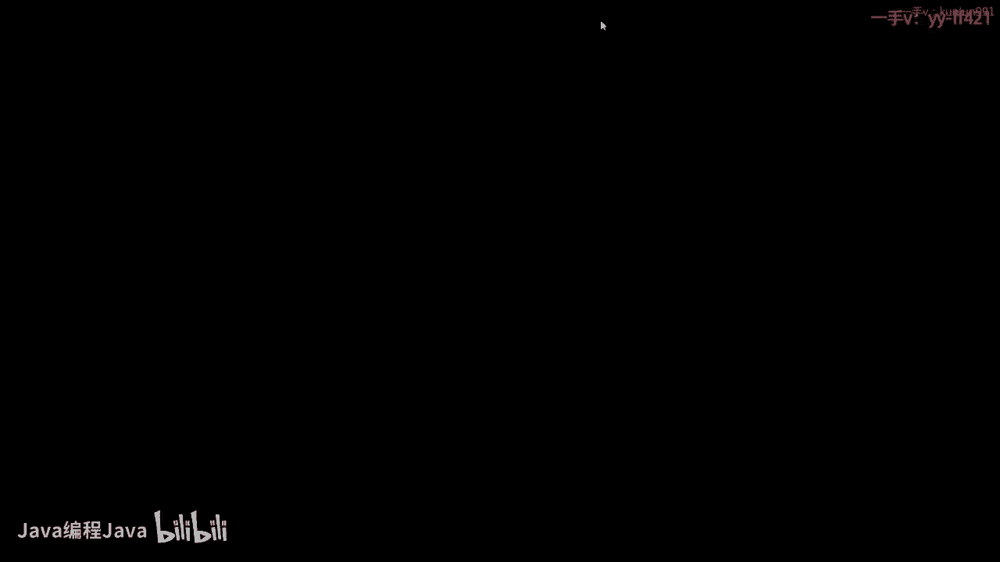
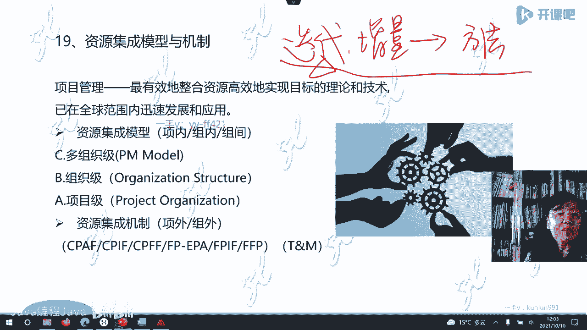

# -PMP认证4期 - P2：7-项目管理概述【itjc8.com】 - OA工作流 - BV1yY4y127aU

好的，休息结束了，我们继续学习。现在我们学的这个部分叫1。3学习方法，这是一定要说一下的。因为我们中国的学生学习呢就是已经习惯了我们自己的一套逻辑啊，那对于他的这个学习就不一定适应，不太习惯。

首先它的这个东西，这个体系叫做结构化的结构化的思路，所以你在学习的时候一定要找到那个结构，围绕着这个结构就像那个树形图或者叫思维导图一样，它像啊不同的方向发散。所以这个学习方法呢两句话啊，我们先说一下。

第一个叫做结构化。因为这是一个结构化的知识体系，所以你也要这样学习啊。第二个叫什么？第二句话叫做发散式。结构化发散式的学习。所以啊你在学习的时候，你就发现它跟我们中国人学的那个东西啊。

它那个逻辑不太一样啊。比如说我们围绕着一个内容向下不停的延伸，不停的发散啊，学了很远很远啊，那么可能我碰到一个这个知识点，就这个三角的知识点。

如果我再从这个方向啊向下学学到这个地方也碰到一个相同的知识点，所以它又重复它的解读啊是站在不同的角度解读同样的内容。所以这是发算式。那你在读PMBOK第六版这个书的时候，也会发现它这种结构化的逻辑啊。

怎么呢。比如说你读这个书，你读中国的书啊，你读你学到第三章了，然后他学过的内容或者说以前写过的内容，他不重复了，他就说请见第二章请见第一章，第二章第一章是有啊，我学过，对吧？但是这个书你学第三章。

他让你请见第八章，请见第十二章，让你往后赶。你的感觉就乱了就不习惯了，就是什么？他在不同的节点啊，在讨论问题的时候啊，它有可能在这个书的后边。所以这个书不是一页一页一页这种逻辑去读的啊。

要注意它很多人所以读这个书的时候，就觉得很费劲啊，觉得这个书怎么读不下去啊，就这种感觉一看就要睡觉，就这种感觉。但是当你读熟了以后，熟悉这种方式以后啊，这种学习方法以后，你会觉得它真的是能够打开思路。

啊你有一个很高的格局，另外这种结构化发散式的学习方式也是创新思维形成的方式。一个人能不能够创新，其实跟他这个思维方式是有关的。如果你能够结构化发散式，其实就具备了创新思维的基础啊。

仅仅是基础不是说你这样学了就能创新了。但是你不这样学是一定不能创新的啊，所以这跟我。我们的培养学习也不太一样啊，所以要注意啊。思维导图要做链接了啊，有学员这样说的啊，好的，那么这是第一个啊结构化发散式。

我们要掌握这个。那么在每学习一个部分一个地方的时候，我就告诉你什么是这个东西的结构。那大结构又套着小结构啊，一个一个像树形图一样，像我在版面上展示的这么个示意图一样向下展开的啊。

那么还有一条学习方法里边，特别。重要的需要引起大家注意的是，集体的学习或者团队的学习远远它的效果啊远远大于个人学习的效果。所以咱们有班班有群体啊，有学员大家在一起呢要互相讨论，要商量。

那个经验欠缺一点的要虚心的在群里请教那些有经验的同学。有经验的同学，你也不要觉得你可能就你那个东西就都是真理，也未必啊那么经过多方的这种讨论式的学习，那么呃形成共识，那这种学习呢才是最有效果的。

而且是一个短期学习能力就能够大幅度提高的一个办法，要注意两条啊，一个是结构化发散式的学习。一个是团队学习，注意团队和集体的学习啊。好，另外呢这个内容呢班班也会给大家讲。我这个地方就展示展示。

这个片子就好了。咱这个考试学习方法里面，那你要围绕着考试啊，对吧？考试是不到4个小时，差10分钟4个小时，180个题，其中有5个题，美国人在向全世界的考生做研究征求意见，不算分。就是这样的问题。

你认为应该选哪个，因为他也没有一个建议的答案。要全球的考生来给他这个建议的答案。如果大家都没答案，那这个题以后就被刷掉了，不用了啊，就不再采用它了。如果大家认为这种情况之下啊，就是选一合适。

那以后那就一A就作为他的。啊，推荐答案放到里面去，它是做这个研究的啊。那么题型我们讲了，这次考试会涉及到新题型。但是大家在做这个模考练习的时候都会给大家新题型的啊，这5个题会有标志吗？没有混在里面呢。

你不知道是哪5个题啊，所以这个就呃是。是随机的，但是随机的对每一个考生来说都是这5个题。但是5个题的分布不一样，因为你坐在考场里头，卷子有54种，甚至5种啊，封皮儿，你那个封皮不一样。

那个卷子题目是不一样的。啊，过去题目不一样是排序不一样，比如1到180个，每个题都一样，排序不一样。就是我的第一题可能是你的第52个题啊，它排序不一样。现在也有题目不太一样的可能，但是原理都一样。

考的内容都都差不多啊，只是题目不完全一样，为什么他要杜绝作弊，杜绝在考场上抄袭，别随便瞎抄，因为跟你卷子一样颜色的人都离你比较远，你根本就抄不到，离你比较近的都别的卷子跟你的题都不一样，你抄什么呀？啊。

那么注意看啊，全部都是选择题，因为在中国没有实现计算机的考试，还是笔试的这个考试，所以它没有办法，有些计算机上能操作的题目，它没有办法在纸张上操作，所以用的还是选择题啊，单选题多选题。

但是多选题他会告诉。你选几个答案，比如说他给你5个选项，他说五选2啊，5选三啊，他会给你这个5选4，他后边会告诉你啊这个内容关于是不是。啊，怎么做？这个由老师们再回答我们啊，我们这个地方就不再说了。

我就想告诉大家，最后考试给你三个分，一个是对人的，一个是对过程的，一个是对业务环境的。就是我们前面说的那个考试大纲啊，另外三种类型的项目预测型敏捷型混合型也都在整个考试中均匀的分布。

这是你学习的时候要围绕着大概这个考试的内容啊，我就大概说一下，这个不太清楚，不太明白啊，也要去问一下我们的老师没有五选五，我没见过五选五。因为多选题新题型的考试是2021年1月份开始的。

也就是刚刚开始的啊。那么在中国呢6月份没有采用这个题题目啊，6月份也没有也没有开考，啊，要6月份开考了啊，本来是说9月份。采用新题目，但是9月份也没有开考，挪到12月份了。

12月份呢是第一次这种新题的考试，但是呢他都用这种选择的方式来进行。啊，关于敏捷和适应型，我后面讲啊，不要着急。好，这个分值的分配比例也在这个这个片子上显示，我就不在这儿多讲了。因为我们有班班呃。

还会给我们解释，我们把我们更多的精力放到我们考试的内容上来说啊。进入今天最主要的内容，1。4关于项目管理的解读。我们前面说的那么热闹，项目管理的思路思维啊，还有这个考试怎么回事，怎么学习。

那到底什么是项目管理呢？我们进行项目管理的解读啊，第一个大的部分，我们要学习项目管理的一些核心基本概念啊，并不是全部概念概念多级了，只是一些核心概念。所谓的核心概念基本概念就是这些概念，你不掌握啊。

你不了解的话，会影响你的考试答题，你会影响你整个项目管理的学习的，那么这样的基本概念，我给大家提出了多少个呢？32个，这就叫结构化思维。我现在学的一。4。1个标题，下边有32个概念。啊。

现在张老师讲到哪儿了？你其实是整体的。完整的不要稀里哗嗒，我给你个概念，就让你这么走，你自己一待会儿还得数数数去。😡，啊，这就叫结构化的思维。首先我们先了解什么叫项目啊。啊。

项目是为了获得一个独特的独一无二的唯一的。输出唯一的成果、服务和结果的一个临时性工作，临时性努力，你投入相应的资源，得到这样的东西，达到目标的一个临时性工作。既然他是一个临时性工作。它就有开始有结束。

所以它跟运营里的PDCA循环不太一样。嗯。🤢，那么接着我们再看啊第二个。我要讲的第二个概念，项目有什么特点呢？根据它的定义。它最主要的特点，第一个叫临时性。临时性不是我们汉语理理解的短时间时间短。

临时性依然可以时间持续很长啊，临时性的意思表明，每一个项目都有确定的开始，都有确定的结束。也有可能这个项目持续100年有这样的呀，比如说一些大运河呀等等啊，都有这样的。历史比较长的。

我们中国最著名的建一个三峡大坝，历时17年，那它也是临时的，为什么？因为他有开始，最后他要建完嘛。😡，你像拍一个电影，做一个这个航天呀、工程，造一架飞机，你搞1个IT软件，做一个互联网。

做一个一次性的支撑服务，这都属于项目啊，所以临时性不意味着时间短，这是第一个要回答大家的。第二个要回答大家的。临时性不包括这个项目所产生的成果。恰恰相反，我这个项目所产生的成果就是为了让它永久有用。

比如说我造一个万里长城，我让他千秋万代，上千年永远不倒。😡，啊，这是我对产品的期待是长期的啊，但是这个项目是有结束的。你不是千秋万代永远天天在建长城，建哪啊，建满了呀，是吧？不是这个概念啊。

所以要把它理解成，所以对西方人来说，这个项目可有魅力了，所以这个项目所建的这个成果不能轻易拆掉。啊，因为他是一个历史遗迹，当时做了这个决策，搞了这个东西，就让它立在这儿了。我怎么能过多年我又给拆掉了呢？

就我们中国就这个思路就不如他们啊想的这个好，所以你虽然他这个国家才200多年，200多年在咱们中国，一个王朝的迭代更新还没有还没有这个完呢，对吧？那么他就就搞得这么先进，搞的这么多好的。

这个东西因为他留了很多东西啊，不允许这样啊，没错啊，这个蔺同学美透啊，他说的特别的到位，也就是项目项目的过程是持续呃，是临时的，项目的结果呢应该让他永久的，你说的持续的不太好啊，是永久的，结果是永久的。

过程也就是项目的过程是临时的，结果要永久的啊，这是第一个。第二个每个项目都独一无二，就像树叶一样。啊，每一片叶子都不同，就像我们人的指纹一样，每一个都有自己独特的纹路啊，都不一样的。啊。

有人说我拿一张图纸啊，一拨人呃呃盖同样的楼房盖这几层都一样的这个那怎么是独特的呢？时间还不一样呢？嗯，你一个时间同时造两座楼，那你两座楼的这个时间都会延长啊，还是不一样的啊。所以每一个成果都是独特的。

所以呢每一个成果都是遗憾的艺术。你做不好，它就这样了。你再想就就变成了改了啊，第三个，既然它有临时性独特性，所以这个项目叫做渐进明细，就是越来越明白，越来越明白，随着时间的延续持续啊。

项目的信息是越来越清楚的。可能刚开始你就不太清楚到底都是怎么回事，最终会达到一个什么啊。那么到了。最后才能真正明白这个项目都是怎么回事啊，最后一个项目是驱动变更的。有有一个学员说了。

长城也是经历了几个朝代的临时性项目组成的太对了，大家就学到位了，对吧？那么这个英国的特纳教授就提了个问题，既然这个临时性可以持续那么多年啊，成百年甚至上千年这么年这么长，那我们怎么理解这个项目呢。啊。

特纳教授就讲，你不要纠结它持续了多少年了，不用管它这个了，你只要记住一个项目是带来变更，而且可以驱动变更的。本来这个地球上没有这个楼房，由于项目楼房就立起来了。本来这个地球上没有一个万里长城。

由于一个项目它实现了从无到有。啊，本来公司的组织机构是这样的，由于一个项目它就改成了另外一个状态，就变革，改革成了另外一个状态。就这么一件事儿啊，所以这是项目的几个特别重要的特点啊。那么好。

既然项目临时有开始又结束，项目因为什么开始呢？咱们PMBOK的第六版里给了这么几个开始的理由，我认为不限于这些各种需求，它可以驱动项目的导致项目的立项和开始。比如说法律的新要求，比如说需求的需求呃。

需求的这个来源啊。比如说我需要创造需要改进，比如说变更或者战略等等等等，不限于这个只要有需求，有立项就驱动了这个项目的开始。好。项目这样开始。啊，那么项目怎怎样结束呢？项目怎样结束结束在哪里呢？😡，嗯。

我们看一下，在我们的第六版里和在我们考试的题目中出现了这样几种结束的状态啊，需要我们对这个中文的啊要了解一下。第一个叫做项目结束，它描述的语言叫项目结束。这个专指项目目标达成了。

我们也可以认为啊比如目标达成了，我们认为是一个成功的项目了。当然你目的达成了才好衡量啊，只不过我们在这里就不提目的，你目标达成了，我们说项目就结束了。啊，那么这种情况一般就是正常情况的项目结束。

第二个说法叫做提前终止。有学员把这个提前终止理解成。超前完成提前完成，那你错了，不对啊，那不是提前完成，而是指的我已经达不成目标了，根本就做不成了，我也没有钱了，没有资源了，我可能没法再做这个项目了。

😡，那叫提前终止，也就是这个项目无果而终了，没有达到结果。第三个啊叫项目终止，这个需求立项的时候说的挺好，后来就发现不存在了，没有这个需求了。那项目这叫项目终止需求不存在了。第4个。

由于各种各样的法律的新的变化，法规的新的出台，我就不能再做了。所以也管这个叫项目终止，或者由于什么某种便利，比如公司的高层，因为这个在一个企业中在一个组织中，是不是做项目项目的选择。

它不是由某个人决定的。它是由公司的高层，由一个可能由一个集体决策的团队来决定的。那那个集体决策的高层或者团队，就出于某种我们自己的意愿和便利，我就不想干了，也有可能会终止。啊，所以关于项目的结束。

在考试中有这样几种描述和情况啊，这是我们要讲的。有的学员啊讲临床研究，那他可能是医学方面的啊。请问公司的主营产品战略转型属于项目管理吗？那你的转型的研究就属于项目管理啊。如果你已经转型成功了。

转型的生产，那是运营不是项目啊。三和四可以认定就是不需要了吗？可以对的。但是在考试中或者在我们的书里，他这样解读，我给大家单独拉出来三和四啊，这是项目结束。好，接着我们再看，既然项目有开始。

有结束就有边界。三和四是不是都可以认定啊，不需要了啊。刚才我已经解答过了啊。好的，然后我们再看项目边界啊，大家可以看啊，一会儿啊下课结束，快结束的时候，我给大家留点时间提问啊。

如果现在咱一边讲一边问就打断了啊，有的时候这个整体它就不够完整啊，大家这个内容呢待一会儿呃，咱们课程结束之前给大家留一点提问的这个时间啊，所以大家放心，因为那个时候我也可以专心的去看屏幕。

这样我两边的这个顾着呃容易可能会让这个课程不够连续啊，一会儿我会给大家解答问题。好的，我们再看项目的边界。项目的边界，我们看结束。先看结束啊，项目的结束是一个相对比较清晰的一个时间。

比如说啊10月10号。这是项目结束的日期，横坐标是时间。😡，我可以很清楚啊，知道什么时候结束的。但是我们看项目的开始。有一个时间区间。啊，有一个这样的数据带时间区间，为什么呢？因为项目的开始。

是需要界定的。由公司来界定规定啊，为什么我给大家举个例子啊，2008年8月8号在北京开了著名的北京的夏季奥运会啊，当时呢这个奥运会的开幕式也非常的啊美轮美奂，是受到了这个国际社会的普遍的赞誉。

搞得特别特别好啊。那么好，那么这届奥运会的开始时间是20。08年8月8号吗？是不是啊？那需要规定，对吧？那么我们决定把这个项目把这个奥运会近这年的奥运会给中国开，是什么时候呢？2001年。

那2001年这个时间是不是开始呢？那大家记得不记得在之前还有一次投票奥国际奥委会投票没有投给中国，我们没做成啊。那么这个就这个是不是开始时间呢？还是最开始决策中央领导人说决策在这地方搞奥运会。

从那个时候开始啊。😡，所以这个项目的开始时间需要界定你界定从哪个地方算开始，你的项目就从哪儿算开始，你的项目管理就从哪儿进行。啊，有学员说，2001年就开始了，那决定要开奥运会，不是2001年呀。

之前还有一次投票呢，对吧？人家也没给我们呀，在之前还有呢，其实最早新中国刚成立，毛泽东就讲，你看这个奥运会都在别人那开，到我这儿来开开行吗？那个时候是一种梦想是不可能的啊。

因为西方国家排斥中国不承认啊中国的这个政府和政权啊，所以对到底从什么时候开始，各个公司不一样。比如说有的从中标啊，有的从什么呀，我想告诉大家的是开始的边界是模糊的，是需要界定的。

一般结束的时间倒是比较明确的。其实这个片子就说明这个问题啊。好，继续什么叫做管理呢？那种临时性一次性啊有高度不确定的事件，我们把我们所学的知识、工具、技术用来管理他们。那么这就叫项目管理。那管理。

是我们这个学科的重点，而不是项目重点落在管理上，管理什么呢？管理有4项呃，最开始呢是有5项，后来合并完了啊，叫四项基本职能。这是全世界的共识。当年呢也是100多年了，法约尔提出来的啊。

管理的四项基本职能是哪四项呢？计划。组织。😡，领导。控制。所以我们这门学科学的是对项目的管理。😡，学怎么计划，怎么组织，怎么领导，怎么控制。😡，啊，所以分成了那三个考试预考的重点在这里。

当然你那个专业关于项目的专业也要有了解。后边我们还会提到啊，这是关于项目管理啊，这些我写在板书上写在这儿的，需要你去记录的啊，所以大家要准备好啊。好。

项目是为了达到目标的那我们就要先了解一下目标管理中目标管理的目标是怎么定的，怎么描述的呢？那在专业上它是有固定的说法的。不是喊的大口号啊，随便喊一个大口号。其实中国人在这里也是在不断的学习过程中的啊。

管理的思想基本职能有学员已经背书了啊，说的很好，谁来决定开始时间，当然是由高层来决定项目的高层啊来决定啊，好的，那么项目的目标你要书写项目的目标这个文档一定要符合smart原则。

smart原则是指的这5个英文单词的首字母组成的。第一个叫做明确的。谁看这个目标都知道什么意思，非常明白，不能有歧义的。第二个，凡是目标都可以测量。如果不可测量，它不是我们项目管理中的目标。啊，第3个。

你定的这个目标一定是可达成的可实现的。A第4个，这个目标和它相关的内容之间是有关联的，是有联系的，有关系的啊，第5个有时限的，有时间限制的。很多年前我去上海啊，见过那时候上海还没有那个高架桥呢。

我就见到上海拉一个大横幅在一个地方啊，说上海要打造一流的国际化大都市，就这么一个，他叫我们的目标是要打造我当时看了就说这不是目标。你准备花多长时间打造一流化大都市1000年吗？嗯，如果没有时间的概念。

你这就不是个目标。我既然说这个话，举这个例子，就是想告诉大家，在考试的时候给你一个，你能区别出哪个是目标，哪个不是目标啊，是有这样的题目的啊，那么就要按照smart原则。对。

那就是一个大口号到底能不能达成国际一流。你国际一流怎么测量啊，跟什么对标标准是什么呀？明确不明，能不能实现呀。😡，嗯，所以这个要是。搞清楚才能知道我们项目最终要达到一个什么情况。

你连最终你要达到什么都不知道，那怎么样的？怎么来描述成功呢？是吧？这叫项目目标啊。好，下面我们就提到成功了。项目的成功对成功的解读啊，其实是很麻烦的。啊。如果从目标的这个角度来讲，传统的项目管理。

讲究非常重要的，这叫项目管理。三坐标。啊，这三个坐标就是项目管理成功的重要三个指标，或者叫标准的内容啊，三坐标或者叫项目管理铁三角。这是传统项目管理最重要的三个指标啊，还有叫项目管理3约束。

为什么这三个指标之间相互有关联，是有约束的？用一个等边三角形来表示这个三约素，意思是说它们同等重要。意思是说，你只要改变了一个边，其他两个都在晃。都在动啊，一个边的改动，牵着两个都在动。

那么这个三坐标和三约素实际上是四个因素，也曾经有人说我们用一个正方形写行吗？不行，因为正方形，你比如说你有一个边在调整，可能它对边跟它平行的那个你看不出来影响关系，所以只能用三约素三角形啊。

也就是四个要素是用三角形表示的三约素，三约素有四个要素来的。一个叫做项目的范围，所谓范围就是内容。这个项目做什么内容啊，边界对吧？那么在这个内容里包括了质量要求，也就是质量包括在范围中，包括在内容中。

嗯，另外一个边叫时间，另外一个边是成本，大家就知道啊呃也有学员说。快好省。啊，那你这个范围呢其实是多，对吧？你这个进度呢实际上是快啊，你这个好呢是质量省呢是成本，多快好省这四个边。

所以它的一个基本成功要素是这些指标，这些目标都要达成，以相关方的满意度代表的质量指标。因为相关方的满意度更广泛。因为它包括服务的质量，包括产品的质量啊，就满意度放在这里面了。有的把质量弄成一个内切缘。

不对，内切缘不是在这里边的啊，是质量包括在范围中的。我希望你学最正宗的项目管理。我画只到这儿啊，不是把那个那质量放到内切缘里。为什么一会儿我们学到不是一会儿了，等到我们后三天学到后面的那些过程里边。

你就明白了啊，不是把那个质量要画在中间，这个里边啊，画在我们这个立方体的中间里边，不是这样的啊，它是一个因素，它是三约素的内容之一但是是四个要素啊。是不是这个三个要素都满足了，或者我们都达成了。

我项目就成功了呢，给大家提个问题啊。😡，不是。😡，嗯，因为还要Y得实现。也就是目的。😡，刚才那个是目标。目的还要达成目的要达成一个最重要衡量目的的就是价值实现。😡。

价值实现在第七版的PMBOK里专门给出了一个价值实现系统，还专门有一个这个东西啊。那在我们这个第六版虽然没有专门写那个，但是内容是有的。嗯，在咱的第六版的书里叫商业价值。商业价值体现在两个方面。

一个叫有形价值，一个叫无形价值。我不解释了，所有学员都看得懂啊，什么叫有形价值？什么叫无形价值。我之前也说过，其实无形价值的获得？最终还是为了有形价值。嗯，你弄那么多专利商标干什么？

不是还要有经济回报吗？那不是挂着奖状在贴着办公室里看着玩的。😡，最终还是要实现经济价值的。但是我们中国人做项目呢，我们不太习惯这种说法叫有形价值，无形价值。我们会管这个叫经济效益。和社会效益。

道理是一样的。同样的道理啊，所以要实现价值，这是重要标志，也就是范围进度成本要满足价值还要实现，那是不是就够了，我项目就成功了。不对。还有其他标志，什么标志呢？相关方的利益不能受损，公司的利益不能受损。

符合当地的法律法规和职业道德。怎么解释呢？我给你举个例子啊，我们公司。😡，啊，做一个。做IT项目的，有客户委托我们给他们做一个系统，这个系统专门去攻击中央电视台法轮功组织找找我们做是吧？

专门攻击中央电视台范围进度成本我也做特别好，客户也特别满意，商业价值我们也实现了，你项目成功了吗？嗯，该进监狱了。啊，该被法办了，因为你不符合当地的法规啊，你违法了，那不行啊，所以还有其他的这个标志。

这个标志里边也给出了财务衡量的指标，还有非财务衡量的指标。财务衡量的指标有这几种。这个在考试之中都见过，所以我们都要学习，但是不是在今天学习。我就是告诉大家，要有这些指标的计算的学习。

我们会在后面的过程里边讲到啊。这是关于其他的这个标志啊，所以项目成功的这个解读都不是单一的，不是简单的。你就可以看到它的这个结构化系统化啊，是一个很复杂的事儿。啊，这是第9个啊。

第10个之前直播间里也有学员不停的在问，现在我就在这个地方解释了项目和运营有什么区别呢？我们看一下，从这个管理者来说，项目我们管这个叫项目经理，项目负责人，什么项目经理人等等啊，都有这种说法。啊。

那么我们看运营呢都是职能经理部门经理，这个职能经理部门经理是公司授权任命的，一般不出什么问题，人家不会下台的，都是管理的这个部门是日常。运作的。但是项目经理呢他是一次性的。这个项目结束了，那就解散了。

所以你也就不是项目经理了，你的授权是短期的。😡，第二个，从团队的角度上来讲，项目呢是项目组来进行，运营呢都是一个部门来进行，这是职能部门把它区别开啊。从时间性实现性来讲，项目就是临时的一次性的啊。

运营呢是持续不断的。比如说生产线流水线。嗯，要持续不断的运作，那个叫做运营呃，operation的管理，不如project啊。目标项目的目标是独特的，运营的目标是重复的。啊。

我在这个生产线上制造的质量啊，一定要一致性越好啊。才会越好，有的学员有不定时的，有点卡是吧？哦，放慢一点速度啊。我这边的网络很好的，没有问题啊。哦，电脑端很流畅，有的同学用电脑看很流畅啊。

是不是用手机看有点卡啊，大家的这个情况不一样。因为我这个边是呃直播的这个书房信号是非常好的啊，没有卡过的啊，所以大家去检查一下自己的网络啊，我就不停了接着讲啊。从目的上来讲，目的。项目是为了快点结束。

赶快结束，结束完了，达到我想要的目标，实现我想要的价值。😡，啊，运营可不是这样啊，我这个生产线永远开着，老有运作，老有汽车做，老有毛巾织，我才能挣钱呀。织毛巾的那个流水线那个织布机。😡。

那是运营永远维持的。我们管理上追求的运营就是要效率高，因为效率就是钱。我之前说过杜邦公司，当时他是生产导向的时候，他也用这个方法啊提高效率的。那么对于我们项目来说，就是提高效果的，你要拿一好东西出来。

所以它是目标导向的管理啊，结果导向的管理，拿好东西出来。啊，这是第十个概念。第11个。那么项目。它的生命期是怎么划分的呢？生命期理论怎么划分啊？😡，项目生命期理论啊，美国人可有的讲了。

或者说五角大楼的这帮人啊，说项目管理啊中有4项。独有技术。四项独有的项目管理技术。😡，啊，其他的你在项目管理学科里见到的都是从其他的领域引进的，或者我们采用的。你比如说刚才咱们前面那个相关方满意度。

客户满意度，那就质量管理领域里的。那你这个项目管理领域里有4个独有的，有哪四个独有的东西呢？第一。生命期理论。第二。😡，工作分解结构。WBS啊。第三。关键路径法。CPM啊。关键路径法WBS叫工作。分解。

结构。还有第4个增值管理。增值管理就是。EV。嗯。嗯，这四项技术是项目管理所独有的技术。如果你看到这儿都是从项目管理中来的，或者说的啊，那么这四项都是我们后边学习中的，既是重点又是难点。

所以我在这停一下，专门说一下啊，因为我们现在学到了第一个重点。说实在也算是有点小小的难，不是很难啊，那几个跟他比起来，这个是最简单的这四个里面，其他那三项都很难的。😡，嗯，那么生命期理论。

什么叫生命期啊？也就是这个项目从立项到结束这一段啊，如果把它拟人化，就把它当做一个人有生命体。生物体来讲，那么它的生命的时间有多长？这叫生命期，因说生命期怎么还变成项目管理独有的理论了呢？怎么这么。😡。

这么高大上呢，因为它不光是持续时间，生命期理论，包括这样一些要素啊，什么要素呢？我给大家写一下啊，一定要做笔记啊，要记录第一个要素时间。因为项目的生命期嘛，就是按照项目的持续时间来展开的。

所以第一要素叫时间。第二个要素，这个时间不是从项目开始到结束稀里糊涂这么长啊，而是要把这个时间分段啊。化成。阶段。分段就像下面这张图一样。嗯，我在下面画的这张图一样。

把这个项目画成一段一段儿一段儿的分段，分的这个段叫做阶段，每一个叫一个段啊，第一个阶段、第二个阶段、第三个、第四个阶段。啊，这是阶段。第三个生命期理论的第三个要素，我都写在这儿吧啊，这样整齐一点。

第三个要素是什么？是成果。嗯，成果或者叫做产出。你这个阶段你拿出一个什么东西来？😡，所以你到了某一个阶段，这个阶段要有成果，你得拿东西出来。😡，啊，拿成样的东西出来，这个东西可能是最终的成果。

也可能是中间过程的成果。就是后边阶段的配件组建啊，在项目中管这个叫组建。什么叫组件啊？组成的零件组成部分叫组件。不管是实物还是IT项目，还是代码，都是一个都是一个叫法，都叫组件啊。

就是后续的一阶段的组成部分。那每一个阶段都要有这个这到第三个了啊，第4个。衡量标准。你拿了成果出来，这个成果达没达标？😡，这个组件在这个阶段达没达标，达没达到标准。😡，得有标准量一下。

拿标准得量这个成果是不是合适啊，这是第四个。第5个。要进行。评估。评估，因为你拿标准量了这个成果，评估什么评估项目在这个阶段点，在这个阶段结束的点啊，那你做的行不行啊？😡，可以不可以呀？😡。

所以你这个标准除了衡量成果，还要衡量过程，也就是你这个项目过程你行不行啊，就这意思评估。啊，然后。还有决策。行怎么办？下一步不行，下一步怎么办？一般来说行就接着做呗，就做这么个决策。不行。

那你是提前终止啊，你还是项目结束啊，你还是变更给他纠正一下再接着来呢，所以要做决策。😡，啊，这就被叫做项目生命期的理论。要要有这些啊，这5点属于什么？属于项目生命期。项目生命期的理论。

我们讲第一个不是项目生命期理论吗？这项目生命期理论有这么多要素，这么多内容呢，而不是说你一个时间就是生命期，因为我们学的是管理啊，在这一个生命期中，你要管理有这么多要素。我再强调一下，第一时间第二阶段。

第三成果第四标准第五，评估第六决策。我每一个都给大家讲了。重点突出要讲一下的是一个阶段末，每一个阶段末啊，我划分的这个阶段阶段末还有一些名字啊，这些名字被叫做什么呢？阶段出口。

 milestoneilestone里程碑，阶段关卡决策卡、时段关刻卡。因为这要决策呀，所以有关键决策点，有决策关卡支撑。对的，我先给他解释清楚一些啊。所以在这些地方，它又被这么叫。

还有啊我们见到的叫做街门。阶段的门这地方要做控制门啊，还有呢叫接门，什么接门线都有这么叫的啊，限制的线接门的门线，想让大家多看一点词，别到时一考你这个你都不知道啊。😡。

最关键的这个点还可以被叫做什么杀点。😡，如果决策不干了，是不是就把它杀掉了？😡，啊，所以这个阶段点又叫杀点啊，我已经把它解释清楚了，因为在咱们考试里考的是那种呃能力和概念，你有一点模糊，你就玩不转了。

就乱套了。所以一定要把每个细节都搞清楚啊。我每次讲到这儿的时候。😡，好潮的词对，沙典呀，嗯在你那查啊潮啊，在我们这个里边不潮。所以以后咱们都用专业语言说，跟老板去讲沙点去，老板就瞬间就蒙圈了是吧？

就我们是专业人士啊，这不是瞎来的啊，对门禁管理门线管理等等啊，他讲的都是这个点，他怎么管理啊啊，就是讲的。😡，决策嘛哎接下来你怎么办啊，下一步还做不做等等啊，就是这么干的。因为有些项目。

比如说在某个阶段，你已经做的很糟糕了，继续在做，只能投入更多的资源，投更多的钱，赔更多的钱啊，老板蒙圈了。对的啊，这个点在什么位置问的非常好。😡，啊。不同的专业，不同的行业阶段划分不一样。

一般来说就专业啊讲究叫划4到6个阶段，有按时间划的，有按那个成果划的。啊，比如说项目做4个月，一个月一个阶段也有那么划的啊，那么自己去划分有些行业不一样，它划分有专门的呃，有专门的标准。在美国。

它不同的行业协会里都有好多行业的这种标准啊。我每次说到这儿呢。我就想发个感慨，不让我说，我还有点难受啊，我觉得这么啰嗦，扯了一大堆。其实我们中国的文化中，我们中国古人，我们的老祖宗祖先啊。

假如把我们人也当成一个项目，我们人不是项目啊，不当人我们可以当成项目来管理自己管理这个人，假如把我们当成项目，一会儿我给你解释，为什么不是项目啊，把我们人的生命当成一个项目来管理的话。

我们的老祖宗千年之前都给我们划分过阶段，怎么划的？有学员知道吗？😡，有没有学员指导？😡，特别控制点。嗯。哎，已经有学员说了啊，不是明朝上千年，明朝离现在400多年啊，不到千年。嗯，四五百年。三十而立。

四十不惑。咱中国这个老祖宗的这个话说的多经典呀，五十知天命是吧？60怎么样七十怎么样都有的，就到70啊。因为中国古代是。😡，其人活七十古来稀啊，其实就是你随心所欲，从心所欲不逾矩。

你就是在规矩框架之下做事儿啊。60五十知天命不是指的认命了，而是指的灵活到50岁了。世界天地的运行规律，所有东西你都已经看开了，都明白了啊，都懂了。你别到那时候做那不跟你年龄不相符的事儿。

这不是中国老祖宗画的这个东西吗？多经典啊，你看三十而立，三十是不是时间呀？😡，是不是这个时间也是个阶段呀？😡，而立就是你这个人啊，他成长成什么样，这个人才是不是成果呀？而立是不是就是标准呀？😡。

那么这个项目这个人不能当项目管理，就后面这两条没办法管，你可以评估，但是不能决策。他如果不合格怎么办呢？是吧我现在我就说明白了啊，怎么办呢？不让他活着了，那不行啊，对吧？所以这个人不能当项目管。

严格这么套，就差这么一点啊，不能这么做。所以我觉得非常的经典啊，十五至于学，你看学员连这个都有了是吧？这个不就是生命生命期吗？二0而内卷，那有新的你有新的生命周期的解读了啊。😡。

所以这些内容呢就是咱们中国古时候就有咱们中国的这个古有的这个思想也很先进，也很棒，理念很好。但是有一个问题啊，我要跟大家说，正是因为评估这个地方。我觉得我们这个地方做的。可能不一定比这个西方好了。

就在这儿了啊，哪儿呢？好，我们有三十而立，四十不惑啊，我可以去评估有这个标准。那我问大家，我现在34岁010天。您说我应该而立呢，还是应该不惑呢？有没有学员回答我？对的，杀点有学员一边学习，一边总结啊。

度过而立。交叉点杀点对大家新学的东西而记住。奔着不获去，你看这就是我们中国的项目管理叫什么呀？差不多就行了。因为什么？因为我只有30的标准，40的标准，我的标准是画点的。😡。

但是美国这个标准在增值管理中，你就知道那个标准是一条曲线。在时间轴上是一条曲线，也就是任意一个时间点，我想评估，我想检查的话都有标准，我可以不用，我用的时候就有。这个就是我们要学习的东西。

所以我们的先人也很伟大，但是我们先人在科学思想上不如美国这个项目管理，那我们就学呗。就这意思啊，所以他这个项目管理叫什么？叫精细化的。😡，目标管理。它是精细化的目标管的很细，我每分每秒我都有标准。

但我不一定用。可是你想评估的时候你没标准，你只能等到3040才能评。中间怎么办？中间管不了了，没标准了，没法测量了。😡，啊，所以我这个感慨发给大家啊，让大家去理解啊这个东西啊。这是第11个概念啊。

关于生命期的呃，有有学员，包括什么课代表啊，大家都给总结了，非常非常的好啊，要记住这些东西啊。嗯，所以你不来听课，你不知道这里的概念的这些概念都抄在书里的对吧？你回家看书就就行了。

那么听老师讲会听到这些内容啊，第十2。😊，这个生命周期有不同的类型啊，第一种类型叫预测型的。它的另外一个名字叫完全计划驱动型。什么意思啊？这个项目的生命周期啊，就项目，我刚一开始我就很清楚很明白。

范围知道怎么样，我做的事儿都清楚。所以我就把计划做好，把图纸做好，严格按照图纸，按照计划去做去造就行了，这叫预测型的生命周期的项目，比如说盖楼房大部分啊，当然不是现在的一些新建筑不是新型建筑，不是。

比如说传统的建筑，你盖一个楼房，你盖之前你得有图纸吧，你盖之前你就知道这个楼是十层，哪边朝阳，哪边是按哪边接水，哪边接电，哪边是这个呃放工作的地方，哪边是生活的地方，你就很清楚的，做之前你就很清楚。

所以你画完图，按照计划第一个月造。到到哪儿？第二个月造哪，你去做就行了，叫做预测型生命周期的项目。嗯，变化是中国的标准啊，现在中国的这个变化把把西方也搞得很很着急是吧？他们也也在变起来了啊。好。

那我们继续看啊，第一个是。😊，叫做计划驱动型的，就基本上不太变的啊，有一些项目它就是这样类型的。第二个叫适应型生命周期。适应型生命周期就是变更驱动的。在我们书里呢，这个地方呢写的不是特别明确。

可以看得到。可能他们不是学软件的，不是学信息化的。啊，这个方面专业上他不专业，所以他有的时候把适应型和敏捷方法呢并列。他们不是并列的，适应型是一大类，敏捷呢只是适应型的一种方法。啊。

敏捷的这个方法其实还分更多的方法，还有不同的分类，比如说crrome啊，这个极限编程叉P。啊，结对编程啊，比如说水晶球等等啊，这个后面我们都会提到。啊，所以这是适应型生命周期项目。什么呢？刚一开始啊。

我就不清楚最后弄的什么样，我不像那个楼房一样，有图纸我能画的那么明白，他就是一边做一边看一边做一边看，走着看这个需求需求越来越明确的。所以我要用适应型生命周期。😡，来管理项目。2。

能不能举个适应型生命周期的例子，可以。比如说12306，大家熟悉这个词吗？卖票的网站对吧？大家还记得不记得，可能咱们学员都比较年轻啊，第一个版本的12306网站开发出来的时候，遭到了。社会的。

普遍吐槽不好用啊。想找那个想卖票，想想找还是不行。有的人上去去注册啊，注册这个身份证，一发现哎呦，你的身份证已经被别人注册了，急得要命，跑到火车站去整。😡，对吧这是第一个版本的。

因为那个时候并不太清楚这个卖票的大的主体需求。我知道啊，我做到最后我就是一定要做一个售票的这样的一个一个网站。但是里边细节好多不清楚是吧？它就不停的迭代，我拿出第一个版本来，第二个版本。

我是不是根据第一个版本里边反映出的问题，需求，我再改呀，我再把那个身份证那个弄好一点，我再把那个卖票的页面整的正清楚一点。有些员说什么手游等等啊，因为我对手游不是特别了解，因为我也不会玩，没用过。

所以我就没敢举这个例子啊，1212306可以刷码过卡，那就是后来越来越迭代变成的。你刚一开始第一个版本的时候，大家知道吗？那比那个到门口窗口去买票，还要麻烦的多。😡，光那个注册的过程就折腾的。

还有这个苹果啊一直迭代到15等等啊，这个大家就自自己就举出这个例子来了。嗯，但是你要盖一个楼房是这样迭代的吗？一说12306我就明白了。没错，你盖一个楼房是这样吗？我今天先盖一层，第二层怎么盖。

我得看第一层盖的再改。那那那那楼房能那么建吗？😡，所以这是不一样的生命周期的项目啊，要跟大家说明白啊，那楼房可不能这么干啊。😡，楼房是增量的啊，你也可以说增量的，也可以说是预测型的，之前我就画好了。

不许改，绝对不能干。你改完那没人给你批气，不允许的啊，迭代和增量是属于适应型生命周期的方法，适应型生命周期的管理方法叫啊迭代和增量微信也是对的。现在信息产业这些东西啊。

好多东西今天的这个智能化的这些东西产品，它都用的是适应型生命周期，这两种生命周期一定要理解。因为它管理方法是完全不一样的。刚才我说的生命周期的那个主流的那个主要的那个特点啊，它主要是和预测型生命周期。

但适应型生命周期呢，要拿那个东西类比来进行管理。第三种类型，这两种生命周期混合，不要认为。混合完了以后，就是他们俩叠加在一起，它是第三种。与前面两种不同的生命周期类型啊，它不是纯预测，它也不是纯适应啊。

把它混合一起，又变成了第三种类似于这个世界，有资本主义，有社会主义，还有具有中国特色的社会主义。是第三种独特的混合型的。你不是不能认为它是把两种加在一起的。😡，啊，这个我要给大家说明白了啊。

中国特色的社会主义。啊，这个大家就清楚了。那么这个既不是资本主义，也不是中这个这个社会主义了，也不能说是全社会主义啊。但是我们最后定义的是有中国特色的社会主义，它主流还是社会主义。

可是我用了其他的一些方法，道理是一样的。你这样立一类比就全学懂了，要不然老在这玩玩概念。😡，嗯。政治问题不讨论啊，因为结果说明问题，因为这个结果要好的话，怎么做都是有道理的。结果不好，你怎么做都没道理。

现在中国的这个发展速度啊，把让别人发达国家把你当敌人，已经说明结果了啊，咱们就不再说了啊。好的，这是项目生命周期。项目生命周期。其实我们是从项目管理的角度讨论的生命周期。😡，啊。

项目管理的角度讨论的生命周期。接下来第13个概念是开发生命周期。我个人理解，这专指的是软件开发。😡，你房地产开发的不是这样分的呀。😡，你比如说我们的研发，我们的产品开发，有些新产品开发。

它也不是这样的啊，这个其实特指的就是软件开发。因为我刚才讲过，首先PMI的董事会主席变成了IT男。😡，IT出身的，而且现在全世界啊它在向着信息化智能化的时代发展，信息化智能化的企业也越来越多。

信息化智能化企业的员工学项目管理的也越来越多啊，那么这是符合潮流的。所以这里讲的是开发生命周期，有这么几个一个预测型，一个适应型，一个混合型，这适应型里边包括敏捷的敏捷还包括很多啊。

那么迭代和增量都是适应型中的，甚至是敏捷中的。一种方法一种常用的方法啊。呃，刚才有的神经哇同学表扬老师说老师三观正，也有学员批评老师说老师被洗脑了啊啊，那要知道我的年龄已经都到了。一个不不惑。

我早就过了啊，那没那么容易被别人洗脑的啊，要注意自己的观点，你连自己的父母、家庭、祖国都不爱，谁会爱你呢？对吧？这是最简单的做人的道理和情商啊，这是拐弯了啊，接着我们再看这是开发生命周期，我讲的开发。

这个开发这个词，它是有限定意义的，它不是广义的开发啊，你比如说新产品开发，那可能在你IT行业是这样，但你在生产制造业，比如说我能看得到的一个这样的一个铅笔或者什么新产品开发，未必它就会用用你这些类型。

可能就是只是预测型的啊，那你要根据情况来分啊。好，我们看一下开发生命周期，软件开发的模型，这个是搞软件的同学都常见的瀑布模型what for。啊，一个部分完成了，接着一个部分一个部分完成，接着一个部分。

每一个部分要向上反馈，这就是瀑布型。所以刚开始要做好计划这么开发的。但是现如今的社会啊，这种瀑布型开发的项目越来越少了啊，越来越少了，理论是结构化的啊，实际混合的居多，学员们自己就得出结论来了啊。

那么下面这个叫做迭代的开发。你看它跟刚才那模型不一样，它是螺旋的，先根据最基本的东西开发一个原型。然后不断的第二个原型啊，那你每一个原型都是可以使用的。只不过你用起来有很多需求之前不清楚。

加上风险的考虑，加上新的需求啊，往上在不停的迭代出第二个原型。第三个原型，最终到了现在比较成熟的12306网站的运行。啊，那么这个可能就是大家都想要的，也许呢12306个网站还在迭代，还在把它做的更好。

但是它基本上已经实现了我们想要的主要的功能，就是卖票啊，哎找座啊等等啊，这些很好的这个跟我的身份信息关联呀、记忆啊等等，这些基本都有了。然后堵住黄牛啊，这些基本都已经实现了。啊，他的目标也达成了。

目的也达到了。那么这是关于这个。啊，螺旋迭代开发的一个情况啊，另外还有两个词要区分开，有的同学很清楚，有的同学还模糊不清楚啊。那我们说一下迭代和增量，这个图也不是我画的，在过去的敏捷网站上。

现在的敏捷网站上这些都去掉了，最早在国外的敏捷网站上给了大家，大家就可以看到咱们班里有的同学是很清楚的啊。假如我家搬家搬了一个新房子，我呢也想赶时髦，我想在我的这个客厅里挂一张世界名画。

我就到那个宋庄艺术呃地方啊，让那个让这个找这个现代的画家给我模仿一个啊，搞一个世界名画，我追追赶赶赶赶时髦啊。如果这个画家是这样画画的，一个月画一部分，一个月画一部分。

这个叫做增量一块儿1块儿往上购的3个月，他把这个画画完。那么只有到第三个月结束，我才能把这个拿回家挂在我家。如果他第一个月挂到这儿，我可不敢挂在家里，这是什么东西？吓死人了。啊，不明白。

就是你过程中的这个产品是不能用的这就涉及到呢增量。那么每一个量呢，如果你是适应性生命周期的，你最好呢做到一个哎人家可以挂，可以收钱的这个部分。因为你假如这个杀点或者这个里程碑点，你做到这儿。

人家客户就给钱了，那我们增量这样增，你不要增到这个只画一个头顶上这个脑袋，这这这你增这一块量可是比较麻烦的。😡，啊，所以你增量增到一块儿，也是可以收钱的，让别人看到成果的，看到中间成果的。

但是最终这个产品这个画只有全化完了，我才能挂才能用。第一张图就不一样了，上面这个这个叫迭代，也就是我要画一个世界名画，那么那个呃作家就给你勾出来了。哎。

我给你勾出来这种啊这个就是最终的它大致的这样的样子，但是它比较模糊。我后面还要给你细抠，给你细画的特别细。其实画到这个第一个模糊的，我拿到家里就可以挂了。😡，因为我家这个老这块老凸着，我觉得不好看。

我挂在这儿啊，画家，你上我家来画吧。😡，那么。他第一个图就可以挂了，就可以收钱了呀。😡，所以，迭代可以实现早期利益12306网站一边在后边迭代，一边开始收钱运营。它可以实现早期利益啊。

您不然说这个承揽12306网站的这个供应商啊，这个软件的开发商。他要12月搞出来，那政府一生气不让你干了，太长了，你这时间我老也用不上，我把这又给别人了，您这不是项目就丢了吗？😡。

对吧所以这个迭代或者说敏捷它起的就是这个作用，兑现实现早期利益，赶紧实现价值啊。我们项目不是创造价值的嘛？啊，增量就是有呃不同数量的迭代组成的，可以这么理解。如果你在每一个增量里再加上迭代。

它都是混合的，可以这么做啊，可以这么理解的。12306是迭代跟增量对的呀，都是混在一起的，单一的很少，但是你单一的概念要搞清楚，不搞清楚都混在一起，你更麻烦了。也就社会主义你不懂资本主义你也不懂。

那有中国特色社会主义你也更就搞不懂了。所以你每个就要研究明白，搞清楚啊，就中国的政治家太伟大了，特别了不起。所以我觉得世界的项目管理也在跟中国学，为什么呢？因为他们现在也老玩混合型，他发现这混合比较好。

混合能达到目的。这混合我觉得是中国人的贡献啊，他们以前要不然啊你跟他意识形态不一样，就非得让你死啊，你就非得跟我一样，非得这民主，你不民主就怎么怎么地了，你土壤不一样，都按你那么做行嘛，是吧？

他自己现在走着走着也觉得有问题了，走不下去了啊，所以要注意这个是他们俩的区别，然后我给大家一个通用结构的生命周期，多指一般这种画法指的是预测型。也就是依次一个接着一个一个一个接着一个的。

不管你在什么行业，不管你从事的是大项目还是小项目啊，什么专业，那么通用的生命周期，阶段的划分是这四个一开始有一个准备开始阶段，然后就进入了计划阶段。还记得我们刚开始说那个项目管理思维吗？

刚开始这是定目标的对吧？然后就到了这个执行。😡，然后有一个结束，假如这个是star。这个是finish结束的话。就分这么四个段。啊，是这样。划分的啊通用的结构，你说我项目过大不行怎么办？那你就。😡。

把大的项目拆成小的，然后每个小的再用少的这个生命期。为什么啊？因为杀点太多了，太啰嗦了。老决策老决策老决策，你这项目走不下去了，效率太低了，所以不要把生命期划于划的过多。啊，但是你过少了又不能体现。

又不能解决问题啊。这是通用生命周期的模型。我有一个问题啊，刚才前面咱们讲过管理的基本职能，有学员提前看书，也知道这个结构里有启动规划执行监控收尾。可是我通用的生命周期里边没有监控啊。

那么在我通用生命周期里面，有没有监控管理啊？我提问一下啊，有没有？哦。有一个学员说监控在执行里边，有的说监控一直都在，所有学员都说有有有啊，说贯穿说在整个项目中的是比较合适的答案，它不是光在执行中啊。

它是贯穿在始墨的，这里边全都有啊，你看我们生命周期理论里是不是有一个评估啊，而且我跟大家讲了，还有一个曲线，就是你任何时间点都是可以评估的。所以虽然这个这个里边没有写监控，可生命周期理论里面是有监控的。

但是它提醒了我们什么呢？监控。😡，是不允许画阶段的。😡，嗯，如果你在一个项目中画一个阶段，画一个段，就这个段做监控，其他段都不做监控，糟糕了。你这项目就管理不了了，必时必须从始至终贯穿在始终的。嗯。

因为你画一个段儿做管理的话，你就管不住了，你就监控不住了就会出问题了。嗯，持续的要做持续的这个管理，对监控是全称整体的啊要进行。所以学员们大多都理解啊，全程的没错，是全程的管理啊。好的。

那预测型生命周期有什么特点呢？这个特点很重要，需要你记住，过去考试没有一次不考的。因为现在比较强调敏捷和适应型啊，所以预测型的会考的这个比例减少啊。对呀，有的学员说每个阶段你也可以看成一个项目的啊。

这个是预测型生命周期的项目的特点。项目刚一开始，不确定性和风险比较大。高啊。因为我不知道我最后盖出的楼，我不知道我最后编的软件到底是个啥东西啊，它不确定性大啊，但是不确定带来的影响。😡。

另外一个叫法也叫变更的代价比较小。😡，因为你刚开始嘛，你果断杀掉了不做了，那没什么影响。你比如说我想在这个地方盖个楼，现在这个来个大推土机给我挖了一个坑，对吧？哎，我又决定不干了，那影响就挖了一个沟的。

这影响不是特别大。😡，但是随着时间的持续，到了后期，项目的变更代价影响越来越大。但这个不确定越来越小。因为间接明细嘛我越来越明白了。可是当我这个楼房盖了10层，我决定不盖了。

你想想你那个变更的代价影响有多大。😡，啊，所以这个曲线大家要把它记住，它很有现实意义。好多学员说这都是学这玩意干嘛呀？你看在我的工作中，我给大家举一个例子啊。有一年我有一个非常难的项目，特别难的项目啊。

本来我已经被调到，就是在集团的专家组工作，没有在这个在做具体的项目了。但这个大项目呢非常非常的难，就要把我给调回来，让我来进行这个管理。那我当时呢是在上海刚落地浦东。那个时候呢手机还没有这种智能的呢。

上了飞机，手机都关了，我一下飞机呀，有这好多这个短信，哇哇哇也都进来了，就找我让我赶紧给单位回电话啊，我就赶紧给单位回过去了。单位说你在哪，因为专家组的工作呢，他是不受单位管理的那我说我在上海。

现在刚落地浦东。不行，你先买票赶快回来。哎呦这有重大的事儿，你必须得回来，我要请示我们这个专家组的组长，我们专家组的组长也急眼了。因为在专家组，当时我是年龄最小的，所以是干活的呢，第一主力啊。

到了晚上整理资料写这些东西，基本都是我的事儿。因为那些老先生们嘛基本上动动嘴，不太不太工作。这我一走了以后，大家又觉得不行了，所以又跟单位来这个交流这个事儿，单位说不行，必须得回来，现在他不回来不行啊。

这个有有有重要的这个事儿，结果我连机场都没离开，买了一张票，马上又返回来了。回来以后就给了我一个呃比较难的非常难的项目。那我当时第一个表态是我有没有选可选择的余地，就是我能不能不当这个负责人。

我可以当顾问，当专家，我可以帮你来做这个事，但是不要让我亲自在负责。因为咱们我们这个地方高学历的年轻的都有让他们来做是吧？我来帮他们呃，上级领导说你没有选择的余地，这是组织原则，组织。

决定你必须做那就好了，就别说什么了，对吧？那就做吧。那么在做这个过程中，因为他们已经开始了呃一小段时间，非常非常的乱，管不下去了啊。因为这个项目也非常难，从专业的技术上也很难，市场也很难，为什么？

因为当时呢其实市场我们的客户并不想把这个项目给到我们的。啊，是由于很多努力才把这个项目争取来。所以相关方包括客户都是在等着看笑话，希望你做不成，正好就说明你看就不应该给你吧，你做不成吧。

就是想这么做的这么一件事儿啊，我也很挠头，所以我不想当一个就是主要的负责人，我就是帮助支撑行不行，结果给我的回答是不行，我必须得负责，那我就负责吧，没办法啊，因为这个咱要听组织的安排啊。

那我就开始负责了，真是前一段我确实也很多东西都不清楚，事儿也不清楚，那就经常去开协调会，每次开协调会，我到那的时候，我们那个总师啊，总工程师呃，我们个人私人关系非常非常好啊，私人关系非常好。

但是他看到我去了，他也会觉得哎呀，你来了，我就放心一点的，我说千万别这么想，因为我前面我也都不了解，我压力也巨大啊。因为这个是一个你知道领导怎么跟我说，说这个项目就是死马当活马医，本来就是治不好的。

这么一个项目啊才甩到我这儿那既然都是还没做，就看到了他的前景，就是个死马了。你说这应该怎么做呢？这非常非常压力大的啊。所以我前期呢我也比较镇静哎，就不是特别急于啊来去表一些态，我去收集一些信息。

但是每次开会的时候，这总是他就训我他就批评我，他就觉得我好像这儿也不清楚，那也不清楚但是我也没有没有着急啊，那么到了有一次开会终于这个总是爆发了。因为我我的前提是我们俩私人关系是很好的。

但这个项目对大家的压力都很大啊，然瑞总是说你这也不清楚，那也不清楚，你干嘛吃的呀，你到底清楚什么呀啊，连这种话都上来了，在一个那么集体的这个环境中，如果碰到今天的好多年轻人就玻璃心，大家就稀里哗啦了。

哎又崩溃了，又这个我一点都没事是吧？发自内心的没事，我就笑了啊，那么多人的眼光齐刷刷的都奔向我。对吧你看这这这干嘛吃了啥也不知道是吧？我就笑了啊，然后他问我，那你到底什么时候最清楚啊，我说这样啊。😡。

咱们大家都是搞项目的，都是学项目管理的。所以这个基本常识要有你要问我什么时候最清楚，结束的时候我最清楚。啊，现在项目就是见记明细的，我现在就是不清楚的这个就是风险，就是不确定的，就是不知道的。

我就干这个吃的，对吧？我现在本来就是不去这是他的特点啊，你说你着什么急啊，是吧？所以咱们一定是要稳住要稳住的这样走。你现在你这样你说说我也没用，他本来就他的特点就这样啊，所以在座的人都哈哈大笑。

我这个总师也特别高兴下我说你就是高手，要么你来了，我就放心了，老这么说，其实我也是压力很大的，还是说这个所以我说你懂了一些道理的话，你回答都是智慧，你担心什么，你怕什么呀，别人一去，你看今天我生气了。

我我才不生气呢，对不对？项目特点就是这样，你让我怎么样啊，那谁也做不到啊，对吧？你说我什么时候最清楚，结束那天结束那点我什么时候我都跟你说的清清楚楚的是吧？所以大家都笑了，就是你要懂的这个道理啊。

就是我给大家举的这个例子啊，这个例子本身也告诉大家这个特点这。😡，变化到底有什么用？好多学员对着这些东西都很明白，到了工作中就被别人老师气得气得自己抹眼泪是吧？那你不是有工具用吗？啊，可以回答的啊。

所以这是它的特点啊。我要跟大家说，要记住啊。好，阶段之间的关系，这叫顺序关系。😡，啊，这是一个一个阶段。每个阶段里有5个管理，就是那个生命期的那几个管理啊，启动规划执行监控在这里绕着。

每一个阶段都要进行管理，每一个阶段要进行管理，每一个阶段进行管理，这就是它的特点。😡，所以你要分清阶段和管理过程，它不是一个概念。嗯。这是阶段跟时间有关系的划分的那我在每一个阶段里，我要进行项目管理。

这叫管理过程，这不一样的这叫顺序关系啊，这必须实战呀，你不实战，你将来跟人吵架都不会吵啊，是吧？所以要幽默，要占有主动权，哎，最后别人还同情你支持你啊，然后我再跟大家实战一下啊，汇报一下。

这个项目最终的结果特别倍漂亮，做的非常漂亮啊，所以这是我值得说的一个东西死马终于被我变成活马了。当然有人不服气，就觉得本来就怎么着，本来本来当时怎么谁都不要，本来我也不想要的呀，是吧？

那么你刚开始我就不想要，就说的就是死马，现在死马活了，你没有觉得简单了是吧？这这是常识啊，你在哪做项目在哪个江湖都会有这种特点的，但是没关系，那你积累起来，这个过程里有很多很多特别值得分享的。

以后再说啊，先说考试。😊，先说这个事儿啊，这叫顺序关系。😡，这叫交叠关系搭接关系。专业上咱们项目管理的术语叫交叠关系。啊，那么这两个关系有什么特点呢？顺序关系时间长。😡，啊，交叠关系搭街省时间。😊。

但是风险大，特别是技术风险。😡，前一阶段没做完，后边搭上了，你说有没有风险？😡，前面这个按部就班比较稳定，但是你可能会丧失很多市场机会。嗯，你可能进度的要求不能满足，这就是他们的关系的特点啊。

阶段和阶段关系的特点。那么还有一种关系连特点都没法说，叫做迭代型。😡，适应型生命周期用这种迭代的关系，它的关系很难拿示意图画出来。我挺佩服美国人搞这帮的人这么画的迭代，就是第一个迭代12306的。

后边的我再开发的这个跟前面有关系，甚至跨着跟后边有关系。😡，嗯，把零碎的东西信息统筹起来最难。对的，那么这个迭代。啊，或者适应型生命周期跟预测型最大最大的区别在哪儿？也就是一个迭代，我拿出来的东西。😡。

可用。虽然可用，但它未必是组件。未必是最终成果，只要你后一个迭代，对前面的，只要你后一部分啊第二阶段的内容对第一个阶段有更改，那就是迭代。😡，不更改，比如说啊我造一个这个东西是半成品，后边阶段还要用呢。

那么这是预测型生命周期的项目。你拿这个东西是组建，后面都用我这个适应型生命周期，这不是组建。😡，你先写了个代码，先用着，下回再用，我把前面代码都改了，窗口也改了，或者改一部分。你只要改一个码就是新的。

所以它不是组件，可能也不是最终产品的组成部分，这就是预测型。😡，啊，或者叫waterful和迭代的区别，就是瀑布和迭代的区别就在这儿把握住这个啊，很多搞这个软件工程的学员这都不明白。😡，嗯。

一个是它是组件，它拿出来就是这个东西，它不变了。我到后边到最后我到这个最终结束也不变。一个是它第一版，你先这么用啊，第二版我可能把这个改了，让你更好用，就是1。1点的改，也不影响你用，再这么改。😡，啊。

所以要注意啊。他们的区别。接下来资源啊资源就是我做项目的时候要动用的，任何人做项目都得有资源，没资源，那不是无米之炊吗？那怎么做呀？那也不可能做出米饭来呀。😡。

那么资源在项目管理界一般叫做7M特意凑的啊，把这几个要素专门用英语单词啊，是M打头的词来表示人力资源、材料、机械、资金、信息、科学技术、市场。啊，都以M打头资源有这么多，特别要强调的是技术。

技术也是一种资源。那么当学员你拿到了PMP证书，你拥有了别人没有的资源呀。那你说这个证书没用，那没用，不是资源的事儿，是你的事儿。😡，是你没让他用起来，你想办法让他用起来呀。😡，你不让他用起来。

那不浪费了吗？你就变成成本了，老花钱养着它。😡，是吧你你得让它变成这个给你增值的东西啊，让资源给你增值啊。😡，啊，所以资源呢是什么呢？资源管理是在复杂多变的环境之下，你把资源集成，把一件事干成。

资源是给你服务的。但是世界的资源又是稀缺的呃，资源是很缺的。为什么这个地球有战争啊，大家都在争夺资源呀？嗯。做MES啊，有学员做MES啊，这生产这个生产环境的这种系统啊。这是项目资源管理啊。

所以这个资源是可遇不可求的。大家为了争夺资源就这样抢，那么资源可遇不可求，所以就不要啊养着资源，养着资源太浪费了，一定要干嘛共享。😡，资源一共享效率就高。如果你把这个资源请回来，你买一个机械设备。

这一年12个月就用一个月，剩余时间都闲着。那你怎么办？你租出去啊，赚钱呀。😡，让他更共享起来啊，就是总的这个道理就这样啊，怎么感觉增量是预测型呢？啊，增量如果你中间可以拿钱了啊，其实它也是一种适应型。

你增看你增多少，你增的那一部分啊，可以变成最终的组件了啊，这种也可以的。啊，这是资源啊，那么下面给大家看的是一个资源分解结构，就是把资源分类的图。把刚才我上面写的文字分成类的图形。

这个地球不是有经济学家说了吗？地球上的资源，如果满足人类都向美国人过去啊，美国人那样生活。现在美国人的生活质量也在下降啊，像美国人过去那样生活生活的话，能满足多少人，这个地球的资源，15亿人。

但是现在地球多少人，几年前就72亿。😡，嗯，所以你大家不抢怎么办？你好了，我就赖呗。所以奥巴马就发出一个感慨，中国14亿人都想富裕，那是地球的灾难。😡，哦，合着那富裕的只能是你们我们就不配呀。

中国人勤劳善良、聪明勇敢，他不富。😡，那上帝都不。😡，都心里不忍，知道吗？老天爷都不会放过的对吧？他多么这多么优秀的一个民族，他该富裕，对吧？可是你富裕抢了别人的。

因为现在这个世界是存量的发展就这么多呀，如果以后科学技术发达了，比如说那些一些核裂变的技术导致就出来了，那能源都不是问题了，这些都不是问题了，大家也不抢了，现在不想啊，第这石油也就这么多，是吧？

这个资源数目这也都这么多，对呀，天理难容啊，这个这个这个唯一姑娘说的太太对了，对吧？所以我们正在走在这个富裕的路上，还继续要持续走下去，谁想摁我们，我们都不干，谁都想过好日子呀，对不对？

这这这不是说三观正这就是最起码的常识，你怎么能站在人敌敌对的那一边来说，你就不配，你就不该那你到人那边人家给你好的好吃好喝的，给你也不带那么做的呀，是吧？这这这个确实也是三观。😊，わあ。好的，对呀。

比如说二氧化碳可以变面包了等等。那你那些科学技术解决了才会有这个啊。好的，那么在讲第19个之前，我们停一下啊，现在还有3分钟，我们的课呢就到12点就要结束了。因为大家问的问题也比较踊跃。

所以我让大家呢提再集中的提的一些问题啊，还有没有前面讲过的，没听懂的啊，后面还有要接接着讲的，别着急啊，咱慢慢来啊。😊，前面讲过的还有没有一些没听懂的啊？😡，没听懂的问题。😡，对呀。

所以中国为什么接着要走这个科技强国的路啊，要走科技发展的路啊，因为你科技发展的好了，也不是去跟人家硬碰硬的去竞争啊，迭代和敏捷的区别，迭代和增量。😡，嗯，这个学员我再看一下啊。迭代。增量是一种方法。😡。

敏捷和适用是一种模式。敏捷的这种管理模式要用迭代和增量的方法，也就是你称为你这个模式叫敏捷，一定是用了迭代的方法。如果没用迭代，您别管你那个叫你别管你那个叫敏捷。😡，那么增这个适应型呢又有好多方法。

其中敏捷是一种比较典型的方法啊，甚至现在就拿这个敏捷啊就当适应型这么去讨论了。其实适应型他也有好多方法啊。这个我说完了，对，敏捷是一种模式，一直不太懂敏捷的意思，还没讲到呢，别着急啊，后面会讲的啊。

同学们对提了问题，别刷的太快，靠太快，我就看不到了啊。😡，好的，我再看啊顺序关系的特点。顺序关系按部就班呀，质量可靠啊，它有保证一个事做完再做一个阶段，一个阶段做完再做一个阶段，它就比较可靠，对吧？

这是它的特点啊，项目目标中的二啊revolution关系啊，就是正因为一个大的复杂的内容，它们之间互相有关联，所以它可以向下分解呀，这个二是。有相互关联有相互关联就是可以分解的。

因为我们后面会讲到分解啊，讲到那时候我也会说一下啊。哎，迭代是一种方法，敏捷是一种模式啊。好的，敏捷下面敏捷是一定要用迭代方法的，不用迭代的方法不叫敏捷。啊，敏捷驱动变更也不懂什么叫crrumme。

后面会讲的，别着急，都在后面的啊。现在是因为这个咱们是发散型的，先给大家抛出来。生命周期和开发生命周期。前面你说的生命周期主要是指的项目管理的生命周期，它包括管理过程，包括那个管理的产品。

后边这个开发生命周期，基本上特指软件开发生命周期啊，敏捷是让项目快速结束吗？不是是快速拿出最小单元的产品，快速换钱。而不是快速快速全部结束，而是快速变前的意思。😡，啊，因为你快点拿一个能给你钱的啊。

sme有预习文件啊，组件组件就是单元，就是组成部分的意思。在咱们的这本书里叫做组建模式和方法的区别。模式是一种模型，方法，是做这个模型的操作。剪裁剪切是什么意思？后面会讲都在后边呢啊。😡。

剪切会在后面讲嗯。DDD模式是适应型的吧，应该是DDD也是适应型的。所以适应型有好多方法呢，包括DDD啊，还有其他比如水晶球等等。一会儿我们后面会提到预测情可以理解项目结束时候才变现吗？对的。

基本上可以这么理解，时间太长了，不确定性太大了。别人突然一停不给你钱了，你就瞪眼看。😡，嗯，当然他根据里程碑的划分，也会给部分钱的。杀点可以再解释一下吗？杀点就是阶段末的那个决策点。

因为我要决定这个项目是继续做还是不做，还是要变更，所以就像决定它生沙一样。嗯，今天讲的是32个概念啊，工厂新建工厂的这个例子有5个阶段，每个过程是每个过程都有的。对的啊，你新建个工厂。

每个过程都有这些阶段。嗯，剪裁我们后面再讲啊。🎼好的，呃，不占大家更多的休息时间啊，现在已经过了2分钟了，12点02分。那我们中午呢呃课程就结束了，下午大家进直播间别进错啊。虽然我们的这个标题不太一样。

但是我们会继续接着讲，下午是一定要回把这个课都结束，都讲完的啊，那我们的上午的课程就到这里结束了。今天下午一点半一点半上课啊，一点半让大家都休息一些，吃好饭啊，下午还做好笔记啊，一点半啊。

来把这个概念都讲完啊。好的，今天下午一点半再见，中午休息。

