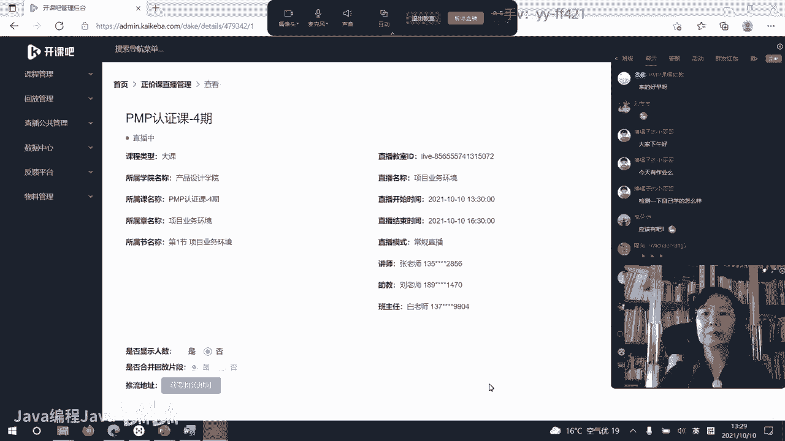
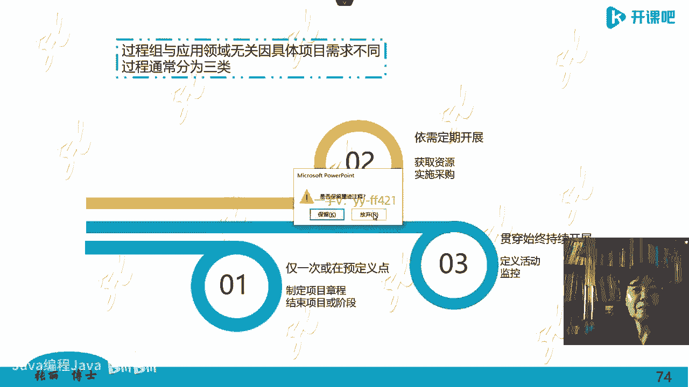

# -PMP认证4期 - P3：8-项目业务环境【itjc8.com】 - OA工作流 - BV1yY4y127aU

好的，下午上课的时间快要到了，请大家做好上课前的准备，检查一下设备，网络视频音频都有没有问题，如果都可以听得到，都没有问题的话，请在咱们的直播间刷一个一字啊，我就知道大家是不是做好准备了。

准备好记录的工具笔啊，本啊，或者是你在电脑上记录都是可以的啊，准备好课件，准备好学习的用品，学习用具嗯，看看声音有没有问题，如果大家这里都没有问题啊，咱们就准时开始了，好的我们开始上课啊。

我们上午呢说了呃，第一个大的模块的关于概念啊，概念这里面呢一共32个，咱们休息之前说了18个啊，后面我们再继续看，第19个，我们讲一下，我们刚才第18个说到了资源，收到了资源，他多么的难得。

那么资源难得的话，就要充分的利用，就要优呃，优化配置好，你不能这么难得的资源，你再到处去浪费啊，越是有钱的人，人家越重视这个资源的保护和合理的利用，而不是把什么东西都买过来，堆在那个地方等着生锈发霉啊。

而是要合理的去利用资源，怎么利用资源，刚才前面讲过了，共享资源，他就比较好，就是谁需要这个资源的时候就给谁用，如果这个资源不需要了，就把它还给社会，然后让其他的项目再去选择。

所以我觉得这种共享资源的想法呀，对人类来说是非常残酷的啊，因为我们每个人都是人力资源啊，那么带给我们的这种动荡，焦虑不安也是必然的对吧，因为我们现在就是一个被别人挑来选去的资源，对吧。

如果这个呃是项目导向型的，你这样的人才的话，那你去做项目，项目没了，解散了，说换地方等等，嗯那你这个资源呢就是在在跳的，那什么样的资源特别受欢迎呢，那肯定是能力越强越受欢迎，越有本事越受欢迎。

你甚至在家里坐着啊，那金子就从你家在房顶屋顶上往下掉，为什么，因为有人找你做事啊是吧，有人让你来做项目，让你来帮助管项目，因为在西方特别是美国，他这个项目经理呢都是一种职业了，职业化的。

有的人就专门做项目经理，他不工作，甚至有的公司就专门是提供就是项目服务的，这种公司，美国有日本也有啊，中国的第一个大的，这个是布鲁格水电站的这个项目，就是改革开放以后我们学习了西方思想以后。

做的第一个布鲁格水电站的项目，就是请日本公司来进行项目管理的，让人家来帮助项目管理，因为他自己不会做呀，为什么，因为当时去招标投标的话，呃，那个这个项目的这个费用。

就是呃供方呢就提出的条件就要特别特别高，只有日本这家是别的公司的啊，这个费用的1/3都不到，特别节省啊，人中国人都觉得你这个能干出来吗，哎他就能干出来，他专门有一个这个公司提供这个服务啊。

用项目管理的方法不仅做出来了，而且质量和范围都很好啊，那么像这些专业人士专门做项目管理的，这些专业人士是难能可贵的资源啊，那很多公司都欢迎，那一般的你对这些不是特别懂，不是这个。

那你肯定就会为自己的出路工作而焦虑啊，所以提高自己的项目管理能力，也是让我们这些资源啊，日本的项目管理起源于欧美吗，日本人也学习美国p mi的这个项目管理，日本人是尤其佩服美国人，因为被打服了吗。

他可能从心里不一定佩服吧，嗯从心里不一定佩服吧，但是他认为美国的这个管理有很多东西呢，他是跟着学的，但是日本人也有，他自己比较有独特的一些东西啊，也就是呃p mp的这个考试，他们也会考的啊。

那这几年考的稍微少了一点，包括韩国，韩国呢也有人做这个项目管理啊，包括教学呀和研究做得特别好的，但是这2年也没什么事儿了，因为他们这个学习啊，他跟他自己的国家的经济是直接有关联挂钩的。

那现在的经济的主要的这个活跃体啊，是在中国啊，所以你看中国出的这些项目经理呢，又远远的比他们诶要多也强，咱们拥有证书的人数也比他们强，所以这个证书在中国呢也比较红红火，是跟咱们的经济状况。

跟咱们现在的整个社会的发展是成正比的，是有关系的啊，那这个关于资源，说到这儿，你看什么资源你会好好保护呢，就是借来的吗，不知道大家有没有这么一个说法啊，呃不是就是非借来的书啊，你不能认真读。

就是你要买一个书放书架子，可这一辈子都不读，如果这个书是借别人的，你是着急啊，得赶快读完去看啊，对呀，两颗原子弹打的服服帖帖的，光头张被打入冷宫了吗，绝对没有啊，啊这个那个那个张博士。

他也是是咱们整个这个开课吧，项目管理这个方面的这个负责人也是带头人啊，讲课讲的也非常棒，但是呢他要分分开吗，分配吗，因为各有各的课啊，那么也各有各种各种各样的班，各个老师带各种班啊。

张张博士的课也非常的精彩，欢迎大家有机会都去听啊，这是中间插了一句，现在说到关于集成资源的事，既然资源这么难能可贵，资源要是要分享的话啊，或者共享的话，资源才特别起作用，那么资源怎么找呢，都到哪找呢。

所以这个就叫做资源集成了一个所谓的模型啊，就这么一个路径什么呢，我们首先做项目要找资源的话，现在项目组内，项目组外去寻找啊，谁适合做这个项目，那么再说一遍啊，咱这个项目呢导向型的是有项目。

立了项以后才找资源，才找人，而不是招一帮子人坐这儿等着等着项目来干，那不是项目思维，说我有项目了，我根据这个项目的需求要求，技术要求，管理要求和岗位的要求，我再去找人，那我在项目。

我们现在自己的这个组内去找这些人，组外去找这些人，这是在项目级的，在组织级呢，公司级呢也就是在我们公司里边，公司内部外部其他的部门看看有没有合适的人，如果公司还没有多组织集，多个公司。

比如说有战略合作的这个关系啊，这样来进行啊，多组织集还不行，那你跨去跨过跨范围嘛，跨国嘛，跨境嘛，看国外有什么资源，如果你需要一个国际的大咖，现在都挺容易的，不像过去一样啊，觉得好像挺一个那样的资源。

怎么怎么样，因为现在信息化也发达，你不一定到项目组来吗，你虚拟的或者通过网络的这种呃关系，你可以给我提供这种支持或者辅导，或者提供项目的一种这样的资源的这种服务，都是可以做得到的啊。

所以这叫资源集成的这样的一个思路啊，资源是由p m o分配，还是项目经理自己招聘，别着急，后面咱们都会讲的啊，那么首先呢我们这个资源的组成，他是项目经理提条件，你没有资格呢，除非是特别啊。

呃呃因为我们做的都是国家级的重大项目，我们的重大项目的项目经理，其实都是项目集经理啊，这样比较高水高的这种项目经理，他也不能自己去招聘成员，他是提条件，比如我这个项目需要什么什么什么什么样的人。

需要什么什么专业的，需要什么什么素质的，谁给我招啊，职能清理职能部门就是人力资源经理啊，和职能部门，他们来帮我来获得这个资源，满足我的条件，如果这个条件满足不了，怎么办啊，那我就需要我们这个项目经理。

就需要还得给这样的人适当的培训，让他才能上岗，要不然他没有啊，现在这种资源我想要的也没有是吧，我就只能教他一点，手把手的教啊，这是关于资源集成，当然了，pmo项目管理办公室，有责任来帮助你配置这个资源。

并不是他给你分配，因为在人力资源管理上，p m o也不是专业，他也是非专业，你比如你让他衡量一个人，看一个人怎么他也他也不太懂啊，这是关于资源资源集成的机制啊，好的既然资源是共享的。

谁用谁就可以拿过来用，那你随便用吗，不可能你只要用资源，资源是宝贵的，资源就要花钱就是值钱的，那么怎么样花钱呢，以合同的方式来获得资源嗯，通过各种合同类型来把资源拿到手，那么这个合同类型在这一版。

第六版的p m b o k里，i p d是和什么类型的项目开发，和我们现在学的有啥差别，谢谢呃，我还是想啊给大家留一个时间，咱们再答疑啊，但是也有人问到了i t d，i p d呢。

其实是i d m他们先开始发明的欧美国家，但是在华为发扬光大了，华为把这个i p d用的比较好啊，那么这个ip d是什么呀，其实我认为也是一个比较怎么说呢，转变了样子以后的一个新概念。

其实在传统的企业里，所谓的ipad就是标准化，货架是管理，就是你把以前的这个模块，包括你那个软件的那个片段啊，你写的那个软件的那个原型啊，那个代码啊，代码包它标准化了，你标准化的东西越多，货架上啊。

你来了新的东西，你直接拿过来就可以用啊，那么它不是效率就越高吗，所以这个i p d是标准化，它跟项目管理呃有什么关系啊，项目管理是我做项目的时候又有标准化的模块，我又拿回来用。

那你当然项目的效率也高了也快啊，所以这是i p d跟我们的这个关系，也就是我们项目经理会运用i p d的技术，在我们的这个项目上啊，他那个货架里面的网子网络纸片段啊，那些都已经形成模板了。

或者形成固定的东西了，你拿过来用它不就快吗，实际上就是标准化的思路啊，那么这个为什么来自于西方呢，因为中国的标准化呀，嗯做的不够好，虽然我们的标准化是国家行为，自上而下，我们很多标准也是强制性推行的。

执行的标准，美国呢他倒是自由的，都是随便的，都非强制的，但是他倒比我们做得好，呃他因为他经过了多年的工业革命，经过了工业革命，所以它标准化的思路深入人心，欧洲国家也一样啊。

他们都有经过标准化的这个路径和路程，所以他们走到今天，你包括德国，走到今天他该信息化了，数字化了啊，工业二点它就容易对吧，但咱们中国呢没有经过这种标准化呃，一个时代吧。

可以说是那么那个西方人的这个时代在什么，100多年前啊，泰勒制啊，泰勒搞的，他在工厂里那个标准化，那到了日本都管这个叫傻瓜管理，一般员工你不要懂什么原理，我管理者告诉你，就就按照一个动作去操作就行了。

嗯把一个专业一个动作你做得特别熟练，包括现在做软件也是一样，你把一个固定的东西啊做的很好，就相当于他把他架到货架上了一个呃一样，然后我需要的时候我拿过这个标准件嘛，想一下宜家宜家的那些桌板儿啊。

可以当餐桌板，可以当柜子板，可以当桌子板，它是通用的标准化的，其实i p d讲的是这样的东西啊，i p d类型的项目开发，它是讲的利用标准化的组件和模板，然后来进行我们的项目，现在我们学的项目管理。

i p d只是一个应用技术啊，一个标准化技术而已，我们的项目管理呢范围更大，让你站得更高，格局更大，i p d只是一个方法和技术而已，好的回到我们的合同类型上来，我再强调一下啊。

待会我给大家一个答疑的时间啊，那么要这样，我老把课程掐断，可能会影响其他没有问题的学员的学习，听起来这个体系就不连贯了啊，好的，那我们看资源集成，我用合同这种方式啊，把资源搞来，那我用合同合同的类型。

在第六版的p m b o k里有这样三大类，在我这个版面上写红字的就是大类啊，然后每一大类里面前两类，每一大类里面又有三小类，第一种叫总价合同，总价合同的第一种叫一口价，固定总价合同就是总包合同啊。

我就给你一个这个价格，然后把这个事做下来，当然技术条件功能质量要求等等啊，都是要定下来的，然后给你一个一个这样的这个价格，一般这种合同适合于什么项目呢，就是预测型生命周期范围是固定的范围。

要不固定你一口价也架不了啊，你要干的内容到底都干什么，怎么能确定一口价呢是吧，所以这是第一个啊，叫固定总价合同，第二个在这个总价的基础上再加一个激励，这个激励嗯单独商量，当然了，他也要在合同里边体现。

合同里要体现，那么总价合同是都有上限的，也就是总价合同价格是封口的，价格是有上限的，在合同里就规定好，这个项目最多总价一共是多少啊，然后在这个总价的前提上，可以根据项目的具体情况加一部分激励费。

但在合同里要体现，要能明确它是价格上限是有的，第三种类型叫总价加经济价格调节合同，假如我们这个项目持续时间比较长，如果你定了一个总价，那么多年你都不变，这很显然就不行，因为时代在变化。

人力资源的价格在上涨，原材料的价格在上涨，又有通货膨胀，又你5年前签一个总价合同，10万你5年之后还是10万，那就不行了对吧，所以怎么办呢，签这种合同总价假如说这个合同还是10万。

但是比如说我这个合同利时是嗯，历时是这个3年或者5年啊，那每年给我加10%，每年我再调节一个数一个比例啊，加20%等等啊，就是这个类型的，这叫总价加经济价格调节合同，不要小看时间带给这个钱的。

呃他的这个影响是非常大的，还是说因为我这个多年呢也在做项目管理的咨，询，我的有一个客户就是北京的，呃也不是军工的航天的企业，其实它是也是一级政府，在海淀这边，海淀大家都知道啊。

这是北京的一个比较好的区域，为什么，因为它这个学校比较多啊，受汇率影响，对日软件外包哦，有的同学做对日软件外包的啊，是不是就适合哪个合同，大家自己就在对应，就跟自己的工作实践在对应。

我给你讲一个总价加经济调节合同，如果你不按照这个做的坏处啊，我再说我这个客户在海淀，大家都知道海淀区，因为周围呢他教育资源比较好，比如学区房比较多，所以他的那个房子涨价是很快的。

但是当时那个当地的那个政府呢，因为他们都是农民嘛，转成这个城市人的，那么当时呢，农民的土地也可以用于做这种建设用地了啊，他们就盖了很多可能有手续的，没有手续的，包括这个住建部都没有批的等等。

一些这样的一些写字楼，就是外面人来租赁，包括什么租商场啊，租这个什么什么汽车的4s店呀等等啊，就租用他们这边的这个房屋，那么当年呢你想农民的土地，刚可以有别的用处的话，农民也是很激动的啊。

就觉得我们终于可以摆脱那种啊面朝黄土，背朝天的那种辛劳的生活啊，我们可以通过这个瓦片经济啊，吃这个房租来这样生活，那不就显得更轻松一些嘛，就这样啊，那但是呢我们干完这个东西，因为它没有发展的眼光。

他也不懂啊对吧，我干完这个楼如果没人来租，怎么办呀，他就着急啊，刚起初啊，啊那是改革开放前30 30多年前了哦，刚刚刚改革开放的时候，那么为了让别人来租啊，我就定一个价格啊，比如说一平米五毛钱。

现在就是这样的，然后你租你必须长租啊，你短租我都不给你，为什么，因为他怕你住两天，你走了，他还得再忙活找人，那时候的观念不一样，做人多少年了，60年啊，租这么长期，一个合同五毛钱租60年。

没有经济价格调节，你就想一想，因为那个时候的眼睛也没长在后脑勺上，也不知道未来什么样，啊把他们就给挤死了，五毛钱一平米租60年，当时就是这样的，因为急呀，要来呀，结果现在造成了很多很多的问题对吧。

因为这个你这你这土地都长成这样了，2019年就前几年嘛，卖了一套两间一套的房子，因为他们拆迁嘛都有很多房子啊，有一个两间一套的房子啊，那个位置很好啊，还有一个他家啊租了一个房子，一块钱永久居住。

其实他心里很难受的，那个时候啊，然后呢，这个这个我说我这个朋友卖了一个房子呢，就这个客户也是朋友，现在卖了个房子，两间一套，大概有不到60平米，卖了多少万呢，1000多万不到1100万。

就这么一个价格的地段，你五毛钱一平米租给别人永久这么住，大概不是永久，60年60年早着呢，那时候就怕你跑了呀，赶紧留住，你就这么一个做法，现在后悔啊，后悔不行啊，你有协议啊，你跟人签的有协议呀。

现在中国有合同法了，当时没有啊，合同法规定你这个最长不能超过20年啊，只有特别极特殊的情况可以延到什么，30年内都很少有这种合同，可是你过去签了60年了，也没人说不管用啊，结果咱这当地政府就想让人家走。

轰人家人家就是不走，因为这我没有协议，我也没违反规定，到时候我就给你钱，你凭什么让我走啊，咱们俩这个协议还做不做数啊，你合同法那是那合同法之前的事啊，哦合同法是否可以否决之前的事。

这就是法律的一个盲点吗，这是说不好吗，人家拿出这个人家也没违约，也没什么，所以你就让人家走不了啊，结果作为这个咨询顾问，人家就让我来对吧，帮着处理这事，真的没法给他处理啊，怎么处理啊。

他们什么办法都想尽了，红道白道是吧，要么就跟人家好说好，人家就是不同意啊，要不就给人断水断电，你断吧，一瓶一五毛钱，我拿着当库房了，我搁一库房，我存个自行车，存个什么东西，存个汽车，我们这院儿锁上。

我开个汽车过来，你没招啊，人家这就给你的这个最后啊又打苦情牌啊，跟人家谈呀，跟人家掉眼泪呀，跟人家哎呀，人家说你们真的是太不容易了啊，真的好可怜呀，行给你涨点价，一平米六毛嗯。

就变成了就这么个情况就不好办，所以只能等到有政府啊，集体的这种拆迁呀，才能把这些东西腾出去，我就是想告诉大家总价，如果你这个合同时间比较长的话啊，你要有所考虑啊，那你学过习了，你应该知道。

那当时农民不知道没学过习啊，他都付出代价了，所以我给你讲的这个案例啊，这是第一大类合同，第二大类合同叫做成本补偿合同，也就补偿成本的合同啊，那么这类合同是对于那个范围，项目范围刚开始不太清楚。

就是我这个买方也就是甲方啊，我想做什么我都说不清，那我提给人家乙方供方的话，人家怎么给你做呢，嗯毁约赶走，那毁约你要赔偿吗，也也也有这些赔偿的，这个事儿也没少赔，你陪人家都不走，怎么办呢。

你总不能这个发生治安事件吧，啊这个成本补偿合同是对于这个项目的范围，之前没法界定，不太清楚这个定义的，那怎么办呢，我这个甲方我找你的乙方来啊，你给我做项目，然后你就去干吧。

按照这个按照咱们商定的大致的这个思路啊，然后你干的这个事，你拿发票来，我都给你报销成本吗，嗯嗯你为我干的事，给我花的成本我都认账，我都给你报销，那除此之外还得给人家补偿啊。

人家到你这儿来也不是为了挣个成本啊对吧，那你就要补偿它成本以外的有几种补偿办法，一个叫做成本加固定费，比如说你给我做这么一件事啊，最终你给我达到这个目的了，把成本我都给你报销了。

我给你固定费加50000+100000+500000等等啊，这是第一种，第二种我们商量一个成本价格，要是这样的话，你想想那供方可高兴了对吧，他能做一次测试，做一次实验，我非做五次，反正我做梦。

我说出我总能说出道理来，我说出道理来，你甲方就给我报销，我就花钱嗯，就这么做，所以这个成本呢他就控制不住，为了让供方控制成本，甲方又给一个合同啊，叫做成本加激励费，也就是咱们锚定一个成本啊。

比如说这个成本干这个事儿一个亿，你就别再多了啊，或者多了以后以后咱们商定的这个成本，多了以后多花那部分，我就要给你惩罚，你话少了哎，我就给你点奖励，所以这个激励分正激励和负激励，这是第二类合同。

第三类叫加奖励合同，一字之差是完全不同的两种合同啊，什么叫成本加奖励合同，有一些项目成果无法客观衡量，甲方提这个需求的时候，也提不出衡量的标准，因为不能客观衡量，比如说我给你举个例子。

在美国管理咨询业特别发达，管理咨询的结果是什么呢，咨询方案管理方案吧，那管理方案一片纸多少钱啊，管理咨询是一个什么服务，叫做智力服务，智利多少钱一斤啊，怎么标价呀，怎么标这个你这个方案值多少钱呢。

那就是在做这个项目的时候，咱们没法定，先不定你先给我做，我把成本都给你啊，然后你做好了以后，由我甲方说了算，我说值多少钱，我就给你多少钱，我觉得这个值1万，我给你1万啊，我说我觉得这个值10万。

我就给你100000加的这个奖励，就是这样一种类型的合同，叫做成本加奖励合同啊，也给大家举个例子啊，让你分开跟加激励不一样，跟加激励合同呢，他要按一定的比例去奖惩供方啊，那这个比例是在合同里要写好的啊。

是要计算的，我们到学过程的时候再计算，再学习计算这个啊，甲方不是说多少是多少，那甲方不是说多少是多少，成本是固定的呀，成本是要给人家报销的，不是说固定的啊，别人发生的成本对呀，买方永远在挑毛病。

所以这是一个具有挑战性的一种合同类型，就是管理咨询行业，好多特别著名的世界的管理咨询公司，它会采用这种合同类型啊，那人家这个好的咨询公司也会挑客户的呀，他也不会随便找客户，随便找甲方来做这个事的啊。

这个是我就告诉大家，有这样一种合同类型，是我们的这个书里给出的，大家要学习啊，比如说蒙牛的牛根生，蒙牛的牛根生，在他曾经1度在他这在做ceo的时候，他曾经呢有这个呃有过困惑，什么困惑呢。

他走到了一个发展的瓶颈，他不知道怎么走了，他想找人呢给他咨询咨询，这样他就通过朋友给他找到了一个姓胡的教授，这个姓胡的教授是台湾人，他家是台湾人，也是咱们华人，也是咱中国人啊，但是他加入了美国籍。

他呢在美国的大学里面教书，到这个呃，没有课的时候，他都在台湾待着，他不不喜欢在美国呆，等到有课的时候，他飞到美国呆啊，他是这么这么做的，那么这个胡教授呢通过别人介绍，就介绍给了牛根生。

牛根生呢就找他来咨询问一些事儿，当时他们怎么商量的这个方案呢，咱们俩关着门关门聊两天，牛根生竟然把蒙牛做成这么成功啊，他也不是吃素的，他也不是头脑里什么东西都没有的，人家也有很多主意点子和办法的。

但这个时候他被绊住了，有困难了，所以他只能找比自己更更棒的人，他不会找一个咨询公司，连自己都不如的，所以他也会挑选挑选这个世界级的比较有名的，咱这世界级的胡教授呢不跟他提条件，也不提咨询费都不会提的。

但是成本你要给我吧，我来这往返的飞机票，我过来，我要住七星级的酒店，你得给我吧，基本的这个办公条件你给我吧啊，这些你可以提成本都给啊，然后这个方式是两个人闭门关门聊天，聊了两天，我跟你说，我哪个地方难。

我有什么困惑，然后你来给我解答啊，你来给我出点子出主意，这两天开开门走出来以后，牛根生就给了他18万人民币，18万啊，激励费的定义感觉不是给卖家的，激励是双方的，双方有分一个比例激励的呃，分担比例的。

但是呢我们计算体现出来的是计算给卖家的，不计算自己的啊，是分担的，分摊就是奖励啊，因为你惩罚也是讲也是激励的一种啊，有正激励负激励啊，分担是分担超过的部分，不是分担成本，而是不是分担成本啊。

而是分担超过的那部分，超过的部分，那就要惩罚，这不就是激励吗，负激励吗，啊如果你省钱了那部分我就兑现成钱给你啊，这个就叫激励啊，哦明白了吧，超过就惩罚，对，节省了就奖励，后边我们后三天有这个计算啊。

不要着急，咱们这个学习是循序渐进的，慢慢来啊，咱们这个地方先不计算，先不到计算的啊，哦就是没钱挣啊，对啊，成本我给你了，所以你能力要强才能会有这个东西的啊，那么这个我再说牛根生出来以后啊。

关了门出来以后就给了他18万人民币，说实在，作为一个国际级的专家，18万人民币不算多，因为这个这个牛根生认为你这两天就值这个，也就是你一天就值9万块钱，如果聊完了，牛根生就觉得这些办法我都实现过。

我都采取过，我觉得没什么，没什么太大用，那他可能一分钱都不给他，但你的成本，你吃住什么，这些我都给你解决了啊，我可能一分钱不给你，我再跟大家开个玩笑，我看你也挺可怜的，陪着我聊两天，挺口渴的。

送你两箱蒙牛牛奶吧，这是开玩笑啊，瞎说的，说句心里话，人家也不见得敢喝你的牛奶啊，这是这是咱们自己这么说啊，那么这个我想举这个例子，告诉你什么叫成本加奖励合同，他跟成本加激励合同不一样，加激励合同啊。

他还是会商量的啊，好的，那么这几种类型跟大家说完了，还有一种叫公料合同，工料合同叫做量价相乘，量价相乘啊，就是总量和单价相乘，这样的合同，比如说单价单一的是多少钱，一件多少钱，比如你给我做这个专家服务。

一天多少钱，半天多少钱啊，然后比如我们这个it行业常用的人天工时，都是指的工料合同，用的工料合同啊，那么这个成本加奖励合同，适合于大项目创造类的项目，复杂项目难项目或者叫国防项目，没有人用这个总价呃。

没有人用这个成本补偿合同啊，总价合同一般用范围比较确定的，比如说装修啊等等啊，奖励不是不都是奖惩，没有罚款的吧，不对啊，从管理学的角度讲，奖励分正激励就是激励合同啊，分正激励和负激励。

哎那个他说的我现在明白了啊，他说的是成本加奖励，合同成加奖励啊，就是不给你钱了，但是你不能罚人家啊啊你不能罚款，成本都给别人，但是你就不给他这个奖励了就完了，比如我认为他不值钱，我就不给他，不给他钱了。

但你不能赖掉，把成本都赖掉，人家是为了你来的呀，给你来做这个服务的啊，所以这个他的问题我明白了啊，好的，那我们看一下嗯，一般的i t项目，一般的研发项目甚至有一点难度的，创新类的项目，用的都是公料合同。

对的奖励和激励是一字之差，它是不一样的合同类型啊，那么用的都是工料合同，只有大型的国防项目，你比如我们以前航天会用成本补偿合同，现在也在大量的在减少啊，这种比如我们用的都是成本价固定费。

我们为了给国家做一个这个事儿啊，那你国家都得给我钱，除了这个以外，你还要补偿我一大笔什么，美国也是这样，美国的国防项目也是这样啊，那也这种合同都会尽量的减少都市场化了啊，那么这是关于合同类型。

合同类型啊，跟我们买卖双方承担风险啊是相对应的，大家想一想，总价合同对买方有利还是对卖方有利，或者叫甲方或者乙方啊，总价合同成本补偿补偿合同是最常见的吗，在国防工业里是比较常见的，在其他领域里基本不用。

基本不用啊，对的啊，这个同学说的对呀，啊土豆也说了啊，买方对甲方啊是最有利的，嗯因为一笔价我就给你了，你花超了，你花这我不管你，你这质量要求这个功能特性你都得满足我，我给你一笔钱嗯，你说我花成本花多了。

那你自己没管理好，那你自己的事啊，所以这个总价合同对甲方最有利，那我再问大家一个成本加固定费，最下面一个合同对谁更有利，对谁更有利，最下面这个成本加固定费合同对谁更有利好，我接受大家的建议啊。

一定要把这个体系连续对，对乙方更有利啊，这就是我下边讲的这个片子，用合同类型可以分担甲方乙方的财务风险，这里主要讲的是财务风险啊，就是经济上钱上的风险啊，也就是总价合同对买方最有利啊。

那个成本补偿合同那就对乙方啊最有利，对买方就最不利，这个地方要跟大家强调一下，只有我们中国会说甲方乙方，因为我们有的学员搞不清楚这个呃，国际项目管理中，国际的工程项目也好，国际的i t项目也好。

只有买方，卖方，没有甲方乙方，我是为了让大家听明白啊，说到甲方乙方，你清楚这个意思就好了，成本补偿合同刚才举例子啦，刚才那牛根生那个就是成本加奖励合同啊，你想让我举一个成本加激励费的合同。

我知道你这个意思，成本加激励费的合同，我们后三天讲课的时候会计算的，会讲计算的，我们商定一个价格，如果你花超了，我就惩罚你，如果你花省了，我就奖励你，是这样的一种合同类型，再强调一遍。

成本补偿合同一般都是大项目，国防项目，竣工项目才这样做啊，举个例子也可以这样举啊，这么说吧，我不说中国啊，我说美国这个美国一天到晚穷兵黩武，他整天打仗对吧，比如说这个特朗普。

包括现在的拜登又想跟谁干仗了，想打谁了，他要开发一个别人不能防的武器，比如说啊激光制导炸弹，这个不是新东西，是已经有了的东西，我就是瞎给你举个例子啊，因为拜登说我现在要打谁谁谁，我要打仗了。

但是我缺一个要做一个激光制导的武器，谁给我干呢，这个雷神也好，洛克希德马丁，这都是美世界著名的啊，这种这个军工军火商，包括波音公司，那你们来给我造啊，你来给我造的话啊，你给我造这个。

你给我做这个炸弹的话，那么你想洛克希德马丁公司就该提要求了吧，全世界都没有这玩意儿都没这东西，这东西是什么呀，我们得做大量的实验呀，这个拜登给钱，我先要他个50个亿，完了不够再给钱，所以这成本你都得给。

成本给了以后还得给他补偿啊，一般大型军工项目采用这种方法啊，假如说特朗普或者拜登，你跟他定好了一个50亿，结果他50亿没兜住，花60亿那行，那你多花出的那个10亿我就要罚你的嗯。

我就要罚这个10亿的一个百分比，咱们俩商量好，比如283746，咱们定一个比例，我把这个钱给你发出来嗯，如果你没花到50亿，你省了，那你你花了40个亿，你那十个亿我们也分担分担什么。

分担是成本的正的激励啊，比如咱们商量一个比例，然后我把这个钱给到，你是这么做的啊，他都适合大型国防项目，我就告诉大家，原来我们航天呢就都主要用也用这样的一些，我只能说到这儿不能再说深了。

大家理解就行了啊，所以对这种合同呢我们会用会用这个，所以这个中国的军工企业过去呢，它不是市场行为，以前还有一种更极端的合同类型，叫什么成本加成，什么叫成本加成啊，叫成本加成本百分比。

你听听这种合同类型啊，我花的钱越多，政府给我的钱越多，因为我花了这么多成本，我的那个固定费或者激励费是成本百分比，我花100万就是100万的，比如说10%，20%，30%。

我花1000万就是1000万的百分之二十三十，那你想想这些企业会把成本做得大大的吧，嗯那就不利于成本的节约呀，美国现在把这种避掉了，不允许有这种合同类型，中国早就不允许了，但是还有这个成本加固定费合同。

但是现在用的也很少了，这是国防工业的项目才用这些啊，激励的概念有正激励和负激励啊，好的接着我们再学习第20个概念，第20个概念就是占的层级再高一点，组织级的项目管理站在公司这一层，有单个项目。

单个项目就是项目级的项目级的项目，它主要最终的是把产品交出来，它是一种逻辑管理，单项目管理啊，一般我们管这个第一个p叫project，大家都知道啊，那第二个叫项目集，项目集就是多项目组成了一堆儿。

多个项目放在一起的，但是在项目集中有这个项目极有专门的概念，什么概念呢，项目集不是简单的多个项目往前一放啊，而是相互有逻辑关系的项目放到一起叫项目集，在咱们中国一般管这个叫什么什么工程。

比如说啊曼哈顿工程，前面说的北极星计划，阿波罗登月计划，这个就是项目集，一个大的项目集，因为这个项目集里边，下面还有很多单一的小项目，这些小项目彼此之间有联系，有关系，如果没有关系的话。

那他不能搁在一起，它不叫项目集，比如我们上午提到过的一个案例，奥运会奥运会项目就是一个项目集，比如说啊在这个项目集里，他有什么项目呢，场馆建筑项目，这是一类啊，比如我要建网球馆，建那个开幕式的鸟巢。

建那个水立方，就这种建筑类的项目，这是一类项目啊，那么还有什么呢，开幕式还有志愿者团队，还有这个卖票的系统等等，这个项目集里有多个项目，但是多个项目之间有相互关联，必须把它们放到一起管理。

因为他们总个总搁那搁在一起，目标是一样的，就是要把奥运会开成功，目标是一致，唯一的一个，这里面有n多个项目，但是就一个目标不能有多个目标，嗯所以目标是一致的，有逻辑关系的啊，项目这叫组织集，这叫项目集。

中国人呢也把这个项目集翻译成项目群，美国有些东西，包括我们中国也把这个program翻译成计划，比如说北极星计划，阿波罗登月计划啊，实际上它是一个项目集群，跟这个组织集就是站在公司这一集看项目。

不是一回事啊，两回事嗯，所以项目集或者项目群，它叫program program，还是一个逻辑管理，但他最终呢强调的是综合能力，你放在把多个不同的这个项目是有逻辑关系的，项目放在一起管。

实现1+1远远大于二，这个效果比单个管理某一个项目，它对总的目标啊是更加有用的啊，所以这是项目集管理，再往上叫做项目组合管理，pfolio，pfolio这个英文单词你可以查一查，叫投资组合管理。

所以这个角度，项目组合管理是公司中的高层进行项目投资，决策立项的管理，项目组合中含有项目，含有非项目运营也在里边，他强调的是投资，也就是公司，我就有这么多资源，有这么多的钱对吧，我都投在哪儿呢。

所以我要先排优先级，他是一个优先级管理，我是先投在运营上，我还是先投在研发上啊，这是他们管理的要点，高层进行管理的，你比如说华为嗯，运营是给我带来源源不断的现金流的，我得有啊，我得有这产品。

我得制造对吧，那么华为投在研发上的钱也是很多的，在他跟世界的公司都基本上起平了，那学外国学的非常的到位，学得非常好，那我家里就这100万投在哪儿啊，对呀，战略协同怎么协同啊，通过投资pfolio来协同。

也就是你投资要组合组合的比例要合适，既要有未来的发展，就投在研发上，又要有眼前的发展，运营也得投入这个钱，要不然你员工的工资靠什么发呀，你光想着未来了是吧，所以这个是个优先级管理啊。

这三个概念我们都给他搞清楚，一个单一项目，单个的一个项目，在一个公司中，它有三种不同的存在形式，比如说他就自己独立存在，跟谁都不对话，跟谁都不说话，单个一个在一个公司里。

这种项目现在在基本上所有的公司里都很少见，第二个也就是这个项目他在项目组合中，因为所有的项目都在组合中，因为你都是投资决策的对象啊，所以你的项目不是都孤立存在的，除非你一个公司就是项目型的。

就那一个项目没有别的是啊，你要有也有运营，也有其他多项目的话，他可能在项目组合中，可能在项目集中强调的就是单独管单个项目的，这个负责人一定要有这种理念，也就是他在组织中，这个项目不是单一的。

他跟别的事情，别的项目啊，项目组合，项目集都有千丝万缕的联系，都要跟项目组合和项目集进行沟通和对话啊，另外项目集的概念，刚才我已经给大家讲过了，再强调这个片子上的红字项目集。

这个集中所有的项目必须是共同目标，他们之所以算是一个级，在一个集一个群中，就是因为他们是靠共同目标关联在一起的，如果有一个目标不一样，那就不在这里边，对的这个学员问的对啊，项目啊不一定在项目集中。

但一定在项目组合中，没错的啊，是这样的，那项目组合里边还有非项目有运营啊，这是项目级的第一句话，共同目标关联的，第二句话叫做交付的收益一定要协同，也就是他们匹配配套最合适，不能某些特强。

某些特弱搁在一起，一匹配的不匹配了，一定要注意，benefit收益这个单词不是指的钱上的收益，它是指的好处，它包括钱啊，包括你的经济收入和什么非经济收入，也就是无形商业价值，那个好处要协同。

你不能在一个项目集里面有多个项目，这个项目做得非常高大上很好，某些不行，但是他们放在一起的时候不行，还有呢有的项目呃，这个项目集里的各个项目都很棒，但你往一起匹配的不行了，会影响你的好处的获得。

会影响收益的获得啊，这是项目吉他的概念啊，把他们搁在一起呢远远放在一起管理啊，远远比单一的这样的管理更好啊，另外也有人在我们的书里专门解释了，项目集不是大项目，但实际上在我们中国人这理解啊。

项目级就是有相互关联的小项目组成的那种，大项目，在国际上大项目是有定义的，有很多学员呢跟我交流说，哎呀我做过什么大项目，你可轻易别开这个牙，什么大项目，您对项目有10亿美元以上，什么成本。

你做的那个影响上百万，10亿美元呀，不是人民币呀，10亿人民币的项目可能还容易啊，10亿美元是多少钱，你算算啊，而且你这个项目会持续数年，这样的项目才叫大项目，你不是这种概念，就不是这样的啊。

哦项目经理对这个学员问得很好，项目经理不管项目急，也不管项目组合没资格管，但是你要知道我的这个事儿啊，我的项目跟他们是有关系的，要跟别人协作好，因为你在他们其中啊要懂得这个概念。

所以21项目集项目集管理啊，他在考试中会出现在概念这个层面，并不让你具体要求你这个，因为你要是考这个项目集经理叫呃pg mp，还要单独考，目前为止在中国还是全英文的，学费也非常的贵啊。

未来会呃价格会便宜，未来也会有中英文的这种对照的考试出现啊，这美国人承诺的这么说的啊，我们项目经理是只管单个项目，但在考试中会涉及到这些基本概念，你会概念你要会答，要有这个意识跟别人协作啊。

项目就是项目组合，刚才前面都讲过了，考虑的是投资优先级，对项目组合的管理呢就叫项目组合管理，这张图形是我们书上的，很明确，刚才有的学员就写了啊，谁包括谁谁怎么样，你看看这张图全明白了嗯。

项目组合它可能有项目及a项目及b，甚至还有单项目，在这个项目集里，甚至还有什么运营嗯，项目集中也可能会有一些运营，项目集中的运营主要指的是项目集啊，项目集中的运营主要指的是培训，上岗啊，培训啊。

那培训你不是运营吗，日常性开展的吗，但在这个项目集里面，有这样的日常性工作掺杂在这里边呢，所以这张图很清楚地告诉了大家，项目及项目组合项目它们之间的关系啊，那么他们都是在组织战略的。

统一的领导之下来进行的，也就是所有的公司的项目组合，项目及啊，单项目都是为了实现组织的战略的，刚才前面说过了啊，说的是这个呃，有的学员说叫做战略学堂，刚才说项目不一定在项目集中有问题吧，哦没有问题。

你比如说这个项目他就不在项目集中啊，他但是他一定在项目组合中啊，某个单项目你看左边那个图不就是这样吗，这个项目一啊，他就不在项目集中，但是它在项目组合里呀，啊你的项目也可以在项目集中。

所以你要懂得项目集和项目组合的关系，虽然你不管这些事啊，另外我们在学习一个概念叫做战略，战略的字典上怎么讲啊，等等这些我就不再说了啊，这个书里边也没有给特别明确的，但是他会考试跟这个战略有关的词汇。

mission vision，使命愿景啊，还有这个go的这个目标这些词汇，那我们分别看一下啊，一个企业的战略，它是一种什么规划呀，定位呀，听起来有点虚，这个我们就不再说更多的啊，然后我们看什么是使命。

使命就是你这个企业现在还在这个市场上，在这个呃世界上存活的价值，为什么这个世界有你这个企业呢，这就是你这个企业的使命，从这个企业成立那天起，一般使命是不会改变的，除非并购重组，你就倒闭了什么。

那你就重新来了，那你这个可能你的这个你的这个使命就会变了，一般企业这个使命是不变的，但是什么是变的呢，vision愿景是变的，比如说我公司准备做一个百年的企业，前5年1~5年我的目标是什么。

我的愿景是什么啊，第6年我再到第10年是什么这样推的，所以这个叫愿景，愿景是分阶段的，下一个叫做mission statements，使命陈述，用我公司的产品和业务，来说明我公司存在的价值。

就是把我的使命陈述出来了，这个叫使命陈述，比如说我给大家陈述一下，我是随便瞎编的啊，你要理解我这个例子就好了，目的是为了给中国人民提高安全感啊，给这个中国在国际舞台上提供话语权，这个就是使命陈述。

因为有产品，我的产品是原子弹，那目的是我存在的价值是什么，是为了什么，为了什么，这叫使命陈述，如果没有提及产品和业务，它不叫使命陈述，又是一个口号目标，我们前面之前说过了，要符合smart原则啊。

这是关于使命陈述，那我们看一下战略和项目之间的关系，嗯项目是支撑组织战略的，战略，又必须被项目一个一个项目所实现推动了，实现战略是战略层的，项目是战术层的啊，那么就出现了下面啊。

我们看这样的一个企业的一个总的这个图景，从高层这个地方有愿景，使命战略，目标战略啊，组织战略，在他们的这个高层的这种战略思想的指导之下，有项目组合管理，项目及管理，运营管理啊和单项目管理，有这些内容。

我们看在这个三角形的左边叫运营嗯，在这个三角形的右边是项目和项目集管理，这两个轮子相当于一个企业的两个汽车轮子，它要一样大，或者说要同步发展，一个太强，一个太弱就会出问题，甚至有些弱了以后。

它可能就会影响你的未来的发展，比如说曾经是世界500强排名第一啊，很多年你大家不知道是哪家公司吧，柯达公司，柯达，有些年轻的朋友都没听过这个公司，现在没有了，被永远的被抹掉了，柯达做什么的照相机。

我们原来的那种照相机的啊，机械照相机的胶卷的，那么在中国，在全世界的大街小巷上，都开着这样的小亭子对吧，然后你可以冲照片去洗照片，卖胶卷，他付富的流油发老财了，为什么现在没有了，因为不用这种照相机了吗。

嗯哎对谁要知道柯达胶卷暴露了年龄了对吧，那个时候大家大家都见过，都做这个啊，那么现在谁还用这个东西啊，但是比较具有讽刺意义的是什么呢，世界上第一台数码相机是柯达公司发明的，柯达公司研制的诶。

用数字用这个成像，我不用这胶卷了，就是他搞的研究，研究完了以后，他觉得人这个不行，这个永远也干不过我，这个胶卷相机，如果是真正的搞艺术的啊，真正是这个摄影师大师，那一定会用这个胶卷。

像你不会用那东西的嗯，但是你看看日本的公司，这个索尼啊，松下呀啊等等，还有这个佳能啊，现在那些数码相机远远打败了胶卷相机，因为它照出的像丞相一点都不差，甚至比你那个胶卷的那个成像更具有艺术性。

所以易水的艺术家们都改了，你都用这个数码相机，结果他当时研究完了以后，他还开足马力生产的这个东西，他觉得那个研发那东西没什么用，他没在那地方投入，结果现在就一下子垮了，没有了啊。

甚至一夜之内之间就消亡了，你500强怎么强，有什么用呢，这样的例子还有什么呢，还有诺基亚，诺基亚的手机过去，那带键盘的小翻盖的各种那个手机，之前在中国市场上，中国老百姓如果有两个手机啊，一定有一个嗯。

一定有一个是这个这个呃，他家的这个手机，那么现在也没有了，为什么你不开发这个智能手机，当时考虑这个智能手机，觉得智能手机不行啊，光玩概念没什么用，现在有没有嗯，对诺基亚手机现在谁还有啊。

我估计有也是这个老东西老物件了，作为这个尽力进历史博物馆了，哎对呀，左手一个诺基亚，右手一个摩托罗拉，你听的是那个是这个笑话是吧，嗯一眨眼就卖三台，就这样，现在的诺基亚还在哪，因为你没有考虑他的未来吗。

你没有研发呀，你没有这个能够跟上时代的新产品，当你发现遍地都变成了智能手机，你在研发来不及了，你的市场都被别人挤了，都占了，虽然诺基亚公司现在还在也很不错啊，但是你这个业务手机业务没有了，已经开始。

因为你做不了，你再做智能手机，你也干不过苹果，现在我们中国好多智能手机也很棒啊，华为啊，小米啊等等啊，像这些手机也都起来了，什么vivo呀，我觉得好多年轻人也都买中国的这个手机用啊，这就是道理。

所以运营和项目就像我们一个人，我再形象的举个例子，两条腿一样，这两条腿要一样长，一样粗，这个人的机体才健康，您那个一腿长，一腿短，一个粗一个细，你自己去想象一下吧，那公司的发展会是什么样啊。

这是关于这个图景啊，所以我们会说项目集和项目是战术层面的管理，项目组合是战略层面的管理，战略管理就是正确的做事儿啊，战术管理就是以正确的方式来做这个事儿，战略就是选择你选的方向，如果不对了。

罗盘都不对了，都走错了，你做的越到位，这失败就越惨痛，那战术就不是别人给我选了方向，我就用好的方法把这个事情干成就行了，那我们现在学习的单项目管理，甚至项目及管理，属于战术层面的事儿，这个要理解啊。

那么刚才那个项目组合管理，就是高层的属于战略层面的事情啊，使命和愿景的位置有没有错，呃刚才的那张图是美国pmi啊，在项目集管理那个书里给出的啊，这个图形呃，这个落叶知秋呢跟我有同样的想法啊。

其实应该使命画在上面，但是他把愿景画在上面也没什么，也不能说他有原则的错误，因为大家有不同的这个解读，按说使命应该在上面，但是美国人画的，我第一次见到美国人写的书，使命是在下面，愿景是在上面的。

我们中国人写的这样的战略的书，基本上都是愿景在上面，使命在第二层啊，美国人呢都应该是使命在上面，愿景在这个下面啊，可是p m i给的这张，这张图是符合中国人写的这个东西的啊，是这么写的啊。

好的接着我们再看基于项目的组织，什么叫基于项目的组织啊，如果你已经形成了啊，就是怎么说呢，已经形成气候了，这样的公司如果要绑架我甲方啊，要给我提各种条件的话，我就可以甩开你，不用你单独成立一个机构。

把我这个目标实现了就行，我们管这个叫基于项目的组织，临时性的，所以项目的组织就有个临时的观点，因为项目的特点就是临时的嘛，啊美国就特别会玩这个，为什么，因为他政府没有钱，那钱都在资本家手里。

他国会要干个事，他就一他这个这个总统要干个事儿，他就是找国会要钱去就得商量对吧，那是这要个钱都这么难，如果这个甲方又这么这么来来给你提条件的话，那行你要要的高，我就不找，不找你了，我找谁啊。

我向全社会征集谁能给我干，谁花的钱少，我就找谁呀，马斯克就是在这种自主之下脱颖而出的，我nasa就给你帮助，给你支持，因为他承诺我可以用最低的成本干这样的事，干同样的事，我的成本就比别人低得多诶。

那大家当然在美国就欢迎他呀，就基于项目的组织，就把他扶起来来做这个事儿啊，全世界公认的日本人成本管理是做的最好的，咱们就讲火箭发射嗯，嗯其实世界最公认的啊，最低成本的火箭性能也好的火箭是中国的火箭。

但是我客观的说一句话，嗯因为中国的火箭为什么成本低，因为它不是全成本核算，他员工的无私奉献，加班加点资源没有算钱的，资源好多都没算钱的，所以你不好这么去比啊，火箭是最便宜啊。

因为他这个全成本核算有它是最省钱的，日本人做这个成本管理到了极致啊，是这样的，那么这个美国人他肯定就是费钱的，因为他也有钱嘛，欧洲国家也不如日本这个成本管理控制的好，可是马斯克提出了一个什么观点呢。

我造一个火箭啊，是日本火箭的1/10成本，我跟政府承诺，我要你给我这个就够了，我就跟你杠上，那你说美国政府不找他造吗，不给他提供支持和帮助吗，也不是他自己有多大的本事啊，是政府啊。

这个机构nasa呀给了他很多协助，包括发射场，让它低成本，甚至不花钱的去用去做实验对吧，2万块的发射程序等等啊，这个可能大家就都知道，他就我就要便宜吗，我就要低成本用这个来吸引。

那国家就可以把这个给低成本的人做啊，这是基于项目的临时性组织啊，第30组织治理，组织就是公司的意思，这里不是指的公司治理结构，没加那个结构完全就不一样，什么叫组织治理或者公司治理呢。

是指的我给你说一个简单的词，你就理解了啊，是公司的规章，规章制度体系也就是公司的规矩啊，公司治理这方面的治理不是管理啊，管理呢它层级比较低，治理它最关键的核心，用这个词来理解，把控，把控嗯。

就组织对全局的把控，管理呢我们只是计划组织领导控制是这样啊，在这个管理治理是全面的，把控全面的啊，他比这个管理是高一个层级的，你想干嘛干嘛，他是这个政府啊，就是这种社会治理这个层面的。

那么这个治理在企业中，就是公司的一些规章和制度，说到这儿，我们接着就可以看项目治理概念，就是项目治理一定要在组织治理的框架之下，每个项目怎么干事儿怎么做，你要听从公司的规章制度，符合公司的要求。

不能自己整一个什么东西嗯，或者脱离了公司的管理去做项目管理，那除非公司专门去做啊，老师讲解的书上有没有有，只不过它分散在各个地方，我给他集中了组合了一下啊，这样来做的啊，组书上都有，第六版的书上都有。

我把这些核心的关键的概念拿出来啊，第32个，也就是最后一个，这个基本概念叫做治理的架子框架，也就是你管理的你一个项目的管理框架呗，比如说包括什么叫项目成功啊，你标准怎么界定啊，怎么验收啊。

然后我这个项目管理的问题处理的一些流程啊，团队的角色呀，还有组织的机构啊，沟通啊等等啊，这个就是治理的架构，也就是一个项目的管理，治理需要哪些方面的内容啊，所有的东西呢。

大部分内容都在p m b o k第六版上，不是全部啊，为什么这个既然有学员问我，这个地方再掐断一些啊，什么呢，我们的考试大概有70%嗯，70或者多一点，在书上还有百分之二三十的内容，书上没有的。

他是要由你平时积累的，所以我讲的有些东西呢是会考的，不会考的，好多东西我都没有更多的时间来展开讲解了啊，会考的书上没有的，我会给你一些更多的这个解释啊，我们讲的比如讲的话语。

更多的地方就是经常考试的地方啊，好的，我们现在学1。4。2了，我们刚才刚学了第一个模块基本概念啊，有了那些基本概念的澄清，我们后面学习起来就轻松就快了，要不然我后面说哪个词，大家都不理解，都不知道。

咱们没法学习了啊，好的，我们看啊，1。4。2，1。4。2啊，那我给它起个名叫重量级的项目管理，顾名思义，重量级的项目管理，就是你在这个过程中做的事情特别的多，特别的精细，什么东西重量级呢，文档。

文档非常非常多啊，那么这个重量级的项目它是怎么管理的呢，是以流程为导向的啊，也就是之前有复习的学员都知道，我们的项目管理的架构框架叫五大管理过程组，十个知识领域，49个过程，或者叫49个流程。

第六版的p m b o k，就这样沿着49个流程为导向，但是你可以剪裁啊，那么前面有学员问我一会儿再提这个概念，因为我专门有剪裁的这个片子会讲他的啊，那么按照这49个流程去展开，49个流程。

有输入有输出啊，然后还有工具技术，每一次你都要把它记录下来，产生大量的过程文档，但这些过程文档呢基本上都是自己留存留底的，客户并不一定需要，但是你要花时间的呀，这么做的意义在于什么。

跟那个i p地呀异曲同工，前面不是有学员问华为的i p d吗，可能有些公司也在搞这个i p d啊，叫做什么标准化，也就是我们把管理也标准化，按照同样的方式做同样的事，固化下来。

这些流程我们就认为成功可重复啊，这是进行重量级项目管理的一个依据，或者叫做思路，或者叫理念，比如我总结经验，我原来怎么成功的，我原来怎么失败的，我把这些总结经验以后变成一个步骤，变成一个流程。

就像你也可以说他也是i p地放在货架上啊，我每一个做一个新项目，我就从这里面取，我就按照这样的标准的做法做，让成功可重复，这是他的观点，那么标准化是西方走过了很多年，很长时间的这种训练。

那我们中国的这个训练，就是我们在刚刚学会走路，走的还不是很好的，就飞起来了啊，跑中间跑的这个都很快，所以中国的很多企业的标准化程度，远远的低于西方国家，如果我们学员有在外企里工作的。

你看到外企的那个标准化，或者说老外的那种死板啊那种规矩，你认为它是死板固化啊，它是标准化的思想，但我们中国人就更灵活，就是标准化的这个东西啊，不一定啊，非要那么按着做，因为这个来不及啊，时间来不及。

我们不用那么精细化啊，但是经历过这个精细化标准化以后，你再简单，它概念不一样，跟你根本就没有经历过，你上来就简单，此简单非彼简单，最终呢还要大道至简，还要走到剪这个位置，但是人家是经过了复杂以后的检。

你是根本没有经过的简，现在很多互联网公司就头疼，分公司怎么复制成功模式，因为你这个总公司你成功模式都没总结，你这流程都没有，你没有经历过这个过程，你让人家怎么复制你呢，所以要研究啊这个东西。

所以这是一个重量级管理的一个大致的概念，那么在重量级管理中要固定流程，要明确责任，有不同的岗位啊，那么你各司其职，你在你的这个位置上发挥你的作用，正确履职，然后就会得到产生同样的结果，什么同样的结果。

同样成功的结果呗，因为我们做项目追求的就是成功啊，做成啊啊，这就是重量级的项目管理啊，那么重量级的项目管理啊，换句话说就是那个预测型生命周期的项目管理，我们按照预测型生命周期的项目啊来进行管理。

就是生命周期的，那么这种管理的框架单项目啊，单个项目，每一个单项目怎么体现它的系统化和结构性呢，他不是一个点，也不是一个维度，还不是两个维度，是一个三个维度组成的立体的空间啊，是多维度的管理啊。

一个维度就是我们之前讲过的生命期，我在后面写个四，是指的通用生理期，一般就画四段，当然你也可以更多啊，那么还有一个维度就是管理维度，管理维度指的五大管理过程组，我不在版面上写了，他们分别是启动管理。

规划管理，执行管理，监控管理，收尾管理，你听这五个词好像跟时间有关，我告诉你跟时间没有直接一一对应关系，这是考生们的一大难点，认为启动就是刚开始啊，启动完了就是规划啊，执行的就跟着规划。

后边监控呢他就不知道摆哪了，收尾呢肯定是最后，那么这个五个词只是指的管理的五类工作，并不指的时间概念，收尾也可以一开始就进行啊，这个就是我们后面要解读的这五个词的概念，因为它是五个管理概念，是五类管理。

它跟生命期不一样，生命期是不是有时间的概念，是按照时间划分的，有先有后有钱的啊，我们这个管理呢它什么时候你都可以执行，都可以收尾，都可以监控的嗯，管理指的过程，对的管理用的词叫过程，生命期用的词。

刚才我们讲过阶段，请你把它们分开，因为他们在管理框架中是两个不同的维度，这是容易不理解的地儿啊，还有第三个维度叫做管理功能，管理功能或者叫做知识领域，或者叫做知识体系，第六版pmbok给了十个知识体系。

并不是穷尽，而是最起码最少你要这么多，如果你在不同的行业，不同的产业里边，你可能还会比这个十个知识领域展开的要多啊，这是最起码的由这三个维度组成了项目管理的，单个项目管理的结构或者叫做框架啊。

那我又给大家画了一个简易的容易看的啊，就右边的这个这三个坐标这样看的，你在这个立体中每切一块儿一个管理单元，这个管理单元既有时间概念，又有你要做的管理的事，还有那个管理的体系，知识体系，管理功能的应用。

这个才配叫做啊系统的或者叫结构化思维，单个项目的管理啊，是这样的一个东西，不是一个简单的一个点，只管一个事儿，所以它是系统工程好的，那我们看把前面这张图生命周期这个维度拿掉，为什么什么时间做什么事。

什么时间做什么事，他不固定，它没法标准化，如果什么时间做什么事都标准化了，大家都不用来学项目管理了，拿一个作业指导书，您就照着干吧，管理是一个非常灵活的事，如果什么时间做什么事，有固定的模式。

有流程有公式的话还学什么呀，那项目管理就失去了它的魅力，之所以项目管理有魅力，就是不同的人来操练，结果是不一样的那种，你得到的那个成就感也是不一样的啊，所以搞项目管理的人呢，他为什么总是很激动呢。

因为他老干新的事啊，一个临时的一次性的事，而且我的管法就跟你不一样，但是我就能见到好的结果，所以它不是一个一成不变的，有一个固定模式的一个东西，虽然它也有标准化，但是它的标准化不是死板的啊。

是一个灵活的，对拿捏分寸度要合适的啊，好我们拿掉了生命期，就是时间的这个维度，就留下了另外的两个维度，一个叫做知识领域，一个叫做管理过程组，他们组成的这个维度啊，在这个空间里面分布着49个项目管理过程。

在这个表格里一目了然，在我们第六版的p m b o k，第25页上有这张图，那么这张图就是所有考试学员的，读书的一个索引哦，你拿它来砍树啊，这个图可以横着看书，也可以竖着看书，怎么横着看，按这个表格。

4。14。2，4。34。4啊，这样走，这是我们书上页码的顺序，但是如果真的想把项目管理学懂，建议大家竖着再看一下书，我看完4。1，我去找13。1，所以这个书是前面翻翻，后面翻翻，前面翻翻，后面翻翻。

是这样的一个东西啊，然后我竖着这样把书看一遍，把这个经纬支出来了，那么你的这个概念就很清楚了，为什么是49个是呃，现在不这么叫了啊，以前叫最佳实践或者叫良好做法，因为有人质疑了吗。

你怎么你那个就叫最佳呀，是所有以前的人做项目管理所总结出来的，最好你就按照这45个步骤，所谓的流程和过程不就45个步骤吗，你把这45个步骤走一遍，那个成功就可复制了，所以这个标准化这是总结出来的。

多个项目提炼总结出来的，谁给提炼的pmi呗，是吧，就是美国的项目管理协会组织了一些志愿者，全球的志愿者给他提供的建议，大家可以想嘛，想了这些过程以后，把它装到这个架构中，装到这个框架里来啊。

这是我们想说的啊，所以那个时间那个维度什么时间在做这个事，那就灵活了，所以我们在学习的时候呢，把生命周期这一支呢就先去掉啊，先学习这些内容了啊，这就是我们后边儿书籍后面三天的课。

第三天到五天的课的一个目录就在这儿了，之前先给大家讲了啊，但是这是预测型生命周期的项目，或者叫重量级生命周期的项目，每一个过程输入输出用的工具，大量的文档记录，非常的麻烦，很复杂。

但是你必须经过这个复杂呀，你这才是专业人士啊，你非要读博士，你很吃力的，你不是不能读啊，也能读很吃力的，你中间要补很多啊，为什么有些格子是空的呢，因为在这个交界处没有过程，不需要做这个步骤呃。

不需要做步骤的地方，格子就是空的，不是所有格子都是写满的，有些学员已经发现了啊，那写写了过程的这些空间才有过程，那些空子就那些空着的地儿，就是在这些地方没有交接点，没有交界处啊，也就是没有过程。

我们这个地方不用不用用过程来管，那么由于p p t的展示，它字体会很小，我告诉大家在书上25页了，我就又给大家整了一个清晰的图啊，我里面的那些步骤都不写了，这个49个过程分布在这里面。

当然有的格子是空的，有的格子才有啊，万幸不是满的，要是满的就更重量级了，更受不了了啊，那么这个架构叫做五大管理过程组，十个知识领域，49个项目管理过程，再说一遍，管理过程跟项目阶段要分开，不是一个概念。

项目阶段是指的时间，我这管理过程啊跟时间不是直接一一对应的，虽然那个描述和表达听起来像跟时间有关，但是它跟时间不是直接对应的关系好，那我们就要说一下，既然五大管理过程组跟时间不是直接对应的。

那都干什么了，把这个给我们讲一讲啊，第一过程组叫做启动过程组，这个时候做的主要的几个事儿，我都给你合并了，拿这个词来表示简化了，有这么五个事儿，选项立项，当然选项立项应该是在项目成立之前做的事儿。

在过去选项立项都是公司职能部门，高层或者战略部门进行的工作，跟我这个项目管理者没关系，那是向外的事，所以现在依然可以这么考虑啊，这是项目外的工作，但为什么写在这儿，要求做项目管理的人员或者项目经理。

怎么立项的嗯，理由是你越了解你后续做项目越成功，所以项目经理或者做项目的人，最好尽早地切入到这个整个这个项目，选项的立项的过程来嗯，那么选项立项了，项目的目标目的就被确定了啊，象已经立了，那怎么办。

由高层向你授权，因为你是个临时的角色，他给你授权啊，叫组织相关的人员对相关方进行识别，有多少人有多少是这个机构，相关方是一个广义的概念，不是不一定光是个人啊，那些机构谁跟我们这项目有关呀。

我们这项目对谁有影响啊，先去识别，然后这个步骤啊做完了以后要进行一个开会，开的这个会，nation啊，或者叫nitting meeting会议，或者nation meeting这个会议啊。

这个叫项目启动会，由高层来宣布谁谁谁，这是公司让他做的这个事，满满的仪式感，要不然咱中国做项目就不重视这个是吧，等你作为一个小项目经理，这些都是我们曾经经过的，我们开始去找职能部门去协调，找采购找。

特别是年轻的时候，你采购说哟，你谁啊，你来找我干嘛呀，我给你采购什么东西，找你们领导来，没人知道你是干这个的，悄悄的就你把这个干一下就行了，人家不是，比如说我在互联网上啊，在公司的局域网上啊。

局域网和公司的一个什么公告上，或者开一个广泛的这个会议上，哎这个人他是项目经理啊，是公司让他做的这个事以后，大家都配合他，协助他授权给他，让他去做这个事儿了，把目的目标都澄清。

是做这么一个啊k off在这里啊，刚才有学员已经提到k off了，它不是归启动过程组的工作嗯，启动过程我做类似的这样的事情，就把它叫做启动，我做到项目中间的一个阶段，我去识别相关方了。

我去搞一个新的授权了，那也叫启动，而是根据这个事儿定义的启动，而不是根据时间定义的启动好，这个确定了以后，我就要做纸上模拟，纸上模拟画一个什么road map路线图，做一个纸上模拟了。

就是我没动手之前先动脑子，我现在指正比划比划，画个蓝图，我怎么去实现这个目标呢，刚才我们前面说的思维，这就到了规划过程组，要把啊目的目标所给我提出的各种任务要求，考虑进去，要编制一份项目管理计划。

这个项目管理计划是一个综合的整合的计划，在第六版的p bk中，它至少包括12+6这方面的内容，主要的立项有哪些文件后面会讲啊，别着急，主要的立项在后面有有讲啊，然后要进行评估，评估什么。

因为你定了这个项目管理计划，计划赶不上变化怎么办啊，要评估各种不确定，各种风险也要一并考虑到项目管理计划中，当我把这个初稿出版的项目管理计划做好了，怎么办呢。

开一个kick off项目的启动会或者叫开工会议，也被翻译成中文叫开题会议嗯，踢足球的那个踢啊，开踢会议，呃就是用足球的这个运动来类比的，这个你看两边都做好了，球员也站好了。

大家在那中间那个裁判员一吹哨开球了对吧，在这个开球之前，你是不是要做这种启动会啊，要准备谁踢前锋，谁踢后卫，谁守大门，不能等我们这这夫妇一吹哨了，就等等，我大门还没来呢。

嗯所以这个启动会kick off是要干这个事的，就是大家彼此熟悉，团队成立也要承诺我能做这个事儿，如果你不能承诺，你也先在这个会上说一下，我干不了这个事儿，那提前说这个也叫傅承诺，可以叫分工会。

分工只是take off的一项内容，还有责任的划分，职责的划分，还有什么沟通关系的建立，咱们以后怎么联系啊，电话微信还是传真等等啊，这个不是评审会议啊，开工会议不是评审会议啊。

而是这个项目正式启动之前的那个会议，包括分工嗯，包括计划的布置，因为这时候计划已经做好了，他在什么时候开呢，k off规啊，规划之后执行之前在这个地方开，它是属于规划过程组的，你做这些事儿。

做的就是规划，然后进入第三个过程组，执行过程组，执行过程组，请你注意，不是你，我说的落地一点啊，哈着腰撅着头的在那写代码，那不叫执行管理，我们这里讲的是执行管理，通过一些管理手段。

把我定的那个蓝图让它落实，推动它，让它实现，那在世界管理中，执行管理一个经典的做法叫做表单，通过表单和记录开展过程管理，咱们学员可能有学质量的，或者了解质量管理的，你看那质量管理中间的那个步骤。

那个流程，那些记录质量管理体系要求的各种各样的记录，那是执行管理嗯，执行管理还包括对员工的管理，对知识的积累，我给大家举个例子，执行管理啊，怎么进行执行管理呢，不是执行操作呢，它的区别在哪啊。

咱们去一些嗯比较稍微好一点的写字楼，包括我们上班的这些写字楼啊，在他的卫生间或者关键的地方都有一张值日表，比如说那个清洁工打扫卫生，打扫完了以后，它会记录这个东西的检查单，对的。

那么这个检查单是谁做的呀，管理者做的呀，你做这个检查单就是执行管理，你这个检查单是依据什么做的，依据管理计划做的多长时间消一下毒，他就没有危险了啊，你并不是那个拿着扫帚直接扫地。

拿着抹布擦桌子的那个清洁工，那个清洁工做完了，这个动作以后，他在管理者的要求之下会去登记那个表格，但谁做出的这套表格呢，是管理人员，就算是清洁工，纸笔也是管理员，你教给他要这样做的啊，检查单呀啊。

记录表啊等等啊，那这个叫执行管理，还有在这个项目管理过程中积累那些知识，积累那些数据，也属于执行管理过程组这个过程组的范畴，嗯那么大家后续可能还要进行报名，应该我知道的，从明天开始就正式报名了啊。

考试的这个报名了，那你在考试报名的时候，你要写这个你做了哪些管理工作啊，执行过程为什么要谈判，谈判是谈判，要员工要人，要资源，你要跟职能经理去谈判，要资源，要资源来啊，不是买方卖方的谈判。

这里找的谈判是要资源，因为我要执行管理，我得有资源，有团队资源来帮我做呀，那这个资源你只有资格提条件，你不能自己摆个桌子，到哪去到那儿去，这个呃去去招生去啊，你要提条件。

所以我们这里讲的谈判是获得团队成员的谈判，看到了吗，不是甲方卖甲方，乙方买方卖方的那个谈判啊，嗯小团队很难做到这么多步骤，对的呀，别着急呀，小团队可以剪裁呀啊可以剪裁来进行啊。

但是你五个管理过程组呢都是经历过的，下一个叫做监控过程组，咱们之前讲过监控做什么跟踪测量，拿什么测尺子，什么是测量的尺子，就是这计划项目管理计划，我做那个蓝图，就是盯着那个实际的尺子。

然后我进行偏差计算，因为你一测量嘛就就会有看到偏差，进行偏差分析，进行偏差评估，那么在这些节点里要做出我到底要变更啊，还是要调整啊，然后我对这个项目的总体的趋势做一个判断，做一个预测。

这些事情都是监控监控什么时候进行，什么时候都可以，那个标准是一条曲线，自自始至终持续的，只不过你监控的点越密，管理的成本，管理的代价越高，也不一定有必要，比如说我每秒钟都可以监控，那我就每秒钟监控一下。

那大家都停着等着你在这做决策吧，就别做事了是吧，所以原理上监控是实时进行，你都是可以的，但是呢会画成那个节点在里程碑，mes丝洞就是接门的那个地方进行监控，中间的这个过程里都可以进行监控。

你随时想让他监控都可以的啊，这是监监控过程组，收尾过程组，请记住，收尾过程中没有交付产品，我们的学员在考试里边特别容易错，这个收尾我是检查我的项目，是不是所有的事都做完了，我的合同，我作为甲方。

或者我作为乙方的合同是不是都已经实现了嗯，还有财务，我们是不是都已经该支出的都付出了，但是我这是检查财务的支付，并不是在收尾过程中支付的支付，在监控过程中交付，也在监控过程组验收，都在监控过程组完成啊。

这是这个特殊点，特殊点考试里容易错，我在收尾过程中呢，只是监督一下，看看我这些是不是做完了，没做完，我去弥补，还有一个叫做管理收尾，它就是知识管理沉淀知识，我每做一个事儿，我就要积累下来。

我要收集我的经验教训，我不能下次我又掉坑里了，我得把我做得好的东西总结出来，抽离出来嗯，这是这个五大管理过程组，有的学员就跟p d c对上了，没错哪个同学说的复盘在项目管理中收尾。

用复盘的方法是非常经典的，所以这收尾过程组用的是复盘这件事，而并不是你再去交付了，这个时候都已经完了嗯，那么这个重点呢就是把经验教训知识积累下来，美国人认为我积累的经验教训，比我这个项目挣的钱还要宝贵。

因为他是我以后永远的财富，他永远让我有钱花，而不是只挣这一次钱，也就是我们讲的授人以渔啊，还是这个鱼，你给人钓鱼的方法工具还是就给他鱼吃，鱼，吃完了就没有了，你给他一种能力，它就不一样。

怎么通过能力的提高啊，就通过这个反复的积累来提高，它跟运营pd c循环的区别是有检查啊，有这个启动，有收尾，没有处置，那个处置就是新的这个计划啊，这是一种新的思维，这种思维啊，听起来那不就是常识吗。

有多少学员能做到，我可以问这些学员，你这些年做过什么事，你有没有记录，你有没有笔记，我35年的职业生涯，记了35年的工作日记，工作记录一天不差，包括加班，所有这些东西都是积累。

就是你发生的这些事都积累在这，我出差我都会带着这些东西来记，当然你不能记保密的，保密是专门的东西嗯，所以你要留下积累这些知识啊，规划过程组，各规划管理有什么逻辑或者什么依赖，比如说规划质量。

我们在后面讲过程的时候都会讲，咱们的学院思维都是超前的，做的非常好啊，就是在动脑筋学的，但是别着急啊，咱们循序渐进，慢慢来，后边都会给大家讲的啊，十大知识领域都在这摆着，我不再一一再讲解了。

因为后面的我们的这个过程，都是按照十个知识领域来展开的，但五大管理过程组特别重要，我要给大家说一遍啊，十个知识领域，就是按照这样的知识领域展开项目管理啊，好的还有在重量型的重量级的项目管理中。

涉及到大量的管理学的工具技术，当然也包括独有的项目管理的工具技术啊，那么这个包括多少呢，咱的第六版pmbok里给了总结，我们给他列了个表，他那里边没列表，一共132个，其实我对于他的这个东西。

我也有些不太认同的地方哦，我们讨论就可以了，它把它分组前面这个嘛分的还有道理，后面这个分的那他自己分来分去，就发现管理的工具技术不是这么分类的，最后有60个他放不到地方，来个未分组，他也找不着组了。

因为管理的这个工具啊，它不是特定物啊，它是属性物，什么叫属性物，它干什么就是什么工具，你比如说改锥用来拧螺丝刀，它是一个拧螺钉的工具，用来杀人的是杀人工具，那你说你分到哪组啊，所以它叫属性物。

它不是特定物，不是叫这个名字就不能改了啊，我们把这个完整的跟大家说一下，监控属于自始至终的呃，交付结果不属于执行过程组，属于监控，对着好回答大家这个问题啊，这个就是这个体系里特殊的地方。

我们后面还会给大家点啊，现在先说到这儿，不用特别着急，那么交付到底在哪个过程呢，我们后三天都会定位到某一个过程去，别着急，我们先说这个大的概念啊，好的那么到这儿呢，现在已经03：06了啊。

我们已经拖了六分钟的时间要休息了，休息15分钟，咱们就少休息一分钟啊，那么03：20：03点20分，请大家回到课堂来啊，休息一下，那么大家在休息期间，解决一下个人的输入输出啊问题，然后在以饱满的热情。

再回到我们的这个直播间来学习，03：20。

