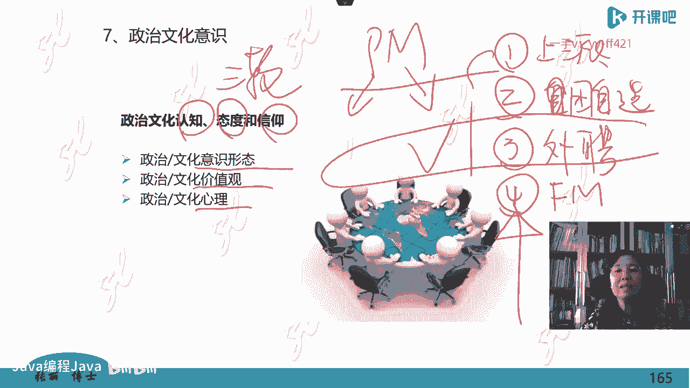

# -PMP认证4期 - P6：11-项目管理人员（一）【itjc8.com】 - OA工作流 - BV1yY4y127aU

好的，呃，休息结束了，我们现在开始回到我们的课堂上来来上课啊。呃，刚才课间呢也有学员在里面讨论啊，有一些问题书上没有管家式的管理，我刚才已经提到了第七版的PMBOK啊。

有管家式管理专门提的12项项目管理原则。呃，管家是第四个，大家解决了啊，呃，企业文化最呃很难管。呃，有学员说问了一下，说这个X理论外理论是干嘛用的。因为我们现在讲的这段内容叫管理风格。作为一个管理者。

你用什么风格来管理X理论外理论是影响一个管理者管理风格的。如果你基于X的假设，你管理起来就是制度化，六亲不认，别跟我说那么多废话，制度定好，干得好，奖励干的不好就罚叫胡萝卜加大棒。那么基于Y理论。

因为你想的是员工都是。特别认真的都是好的。所以你在管理的时候，你可能就不会用那么严格的那些制度，就是呃叫什么这个民主式的管理，大家商量大家讨论啊，大家都发挥主观能动性，这样就形成了你的管理风格。

那你的管理风格是有依据的，依据的是这个假设你假如你的员工是这样的啊。还有老师呃，还有一个学员说，刚才您说的一个人的管理能力是平时三个人的这个平均水平。他是一个心理学家，专门研究人的关系的这个人。

他给出的啊，也不是很有名的啊，我也就不提别人了。那么他是这么讲的，内卷是最好做的焦虑等于压力除以能力啊，强大自己才是解决问题的唯一标准，自己跟自己比每天进步一点点就好。对的，我们从这些学习里在寻找啊。

让我们自己能够解脱或者能够快乐的一些这个呃智慧啊。好的，接着我们再看第二个啊内容就是关于管理风格的啊，现在我们提到的都是管理风格，在做管理风格的讲讲解啊。

有一叫乐文的人我们第一天的课程提到过他就是变革理论，当时说他说的啊，乐文是一个著名的。组织管理学家，也是心理学家。那么关于他的这个什么名字呀，这东西你记不记都没关系。你要知道呢，他经过多年的研究。

研究出管理者的风格有三种啊，一种叫做专制型的，一种叫做民主型的，一种叫放任自留的。经过他研究，放任自留的是最不好的，就是你什么都不管啊，叫无政府主义，那么放任自流型的这个团队效率是最低的。

成功的概率也是最低的，最好的是民主型的啊，实在民主不行，哪怕专制也不能放任自留。我们就介绍一下啊，这些经典的，或者说是。比较基础性的一些理论。因为它出现在考试题中过。下一个叫管理方格理论。

刚才咱们讨论的也有人啊也说过啊，管理方格理论是布莱克诺顿莫顿，这是两个人，他们俩主要是研究战略管理的。实际上他是心理学家啊，他们搞了平衡积分卡呀，都是他们做的，这是呃管理者啊。

那么他们研究呢说人的管理风格呢。领导者的管理风格可以用这样一个平面啊，然后做出两个用两个维度组成的平面做出一个一些象限来表示啊。那么这个两个维度呢纵坐标横坐标分别都分成九份，就是九格格。

也有人管这个叫管理九格理论啊，或者管理方格理论，它跟那个呃就是九格人形不是一回事啊，有一个那个那个这个心理学研究的那个九行人格，九行人格也是画这个方格啊，九行的跟那两码事，不是一回事啊。

这个讲的是管理方格横坐标这个维度，因为这个东西啊，这个理论它诞生的年代比较久远，比较早了。所以它用的词你看都不是今天的语言，它叫横坐标是这个管理者更加关心生产。今天我们就可以把它改成更加关心任务。

更加关心工作。啊，那个时候叫更加关心生产啊，纵坐标叫更加关心人，用这两个维度来组成组成的这个内容啊。管理风格是领导力风格吗？不是领导力的概念更大。领导力其中包括管理风格，管理风格是领导力的一个方面啊。

好的，然后我们看纵坐标是更加关心人，然后分成了9份儿，横纵坐标都分成9份儿，它就组成了这么多象限啊。我们看9一这个象限的管理者的风格是这个领导者更加关心任务，关心生产。

所以管这种领导者的风格叫做任务式的管理。这个19更加关心人际关系，他相信人际关系好了以后，团队的生产力自然就上来了，不是说他不关心。啊，生产，而是说管理的切入点在这里就是它的这个理论啊。

那么一九风格呢也被常常被叫做俱乐部式的风格。这个就是中间风格，还有一个一1一就是不称职的管理，因为我也不怎么关心人，也不怎么关心生产。那么这个布莱克和诺顿就认为这是呃不称职的不合格的管理。最右上角99。

这个象限里面他讲的是这个管理者最大限度的关心任务，关心工作，同时最大限度的关心人际人的发展。人际关系。那么管这种风格叫什么团队是管理，所以团队是管理哪来的呀，可不是随便造一个词，说团队是管理就是团结的。

不是这么解答的啊，它的出处在这里，这个方格呢都考过试，但是呢考的比较早，就是以前考过啊，那么现在没有提及过，但是只要考过的，我就拿出来给大家说一说呃，九九是最难达到的吗？对，关键是那个度不太好达到。

有的时候特别顾及人际之间的这个关系啊，那个好像对生产的那些对这个任务的一些要求，可能就会降低一点，你怎么把握好这个度啊，这是不太好管理的啊，那个比较好的这种状态呢，同时也是需要管理者呢，他有更。

很高的管理技能和管理水平的这也代表不同的管理风格啊。另外一个叫做领导全变理论。呃，也就是你的管理呢不是一成不变固定的，而是随着环境而全变而改变的啊，权衡而变化相继而行的。那么这一费特勒模型为代表。

这个领导权变理论呢一般就提到的是这个费特勒模型。之前呢做一个假设西方人做的这些模型都是有假设的，也就是有前提的，你不是在任何场合随便拉过来的就用啊，他是通过建立模型让你掌握一些规律。

但这个模型建立的时候都是有假设的啊，那么他首先做的这两条假设。第一。如果这个领导者啊他对他最不喜欢的同事，他也可以给一个正面的评价。人这个动物就非常的奇怪，非常的。怎么说呢？在有些软技能方面。

他自己也解释不清楚啊，莫名其妙，你可能就看一个人比较顺眼，莫名其妙，你就看那个人哪儿都不对啊，是有这种特点的是吧？所以这个你看有一首歌是怎么唱的，莫名我就喜欢他没有理由没有原因。

你反过来莫名我就不喜欢的，也没理由也没原因啊，也有这样的这个歌词展示啊，但是作为一个管理者，你不管你是喜欢他还是不喜欢他，但是你能够在这个工作中给他一个客观的正面的评价啊，这个这种人这种领导者。

我们就认为他叫以人为主啊，就假设要知道啊，不是可能大家想的那个以人为主，第二个，如果对你不喜欢的同事，你就批评他一无是处，他就没有一点好地方了，就是演员看他哪儿都不顺眼是吧？所以呢这种人呢。

我们管他叫以工作为主。因为他是在职场上。所表现的就基于这两种假设费特勒搞了这样一个模型啊，那我们看这个模型的图，这下面这写的都是一些氛围和环境。比如说上下级的关系啊，任务的这种结构是不是清晰呀。

权力的这个位置是不是特别明确呀，这个情境的有利性，也就是这个团队的。分为。是不是好呢，还是有利呀，对项目有利还是不利呀，是正面的还是负面的呀啊，就有这么一些这个环境。那么这些环境在这下面都标着好啊。

不好啊，明确呀，弱呀等等，标着这些啊，我们看在这个两端也就是这种关系都非常的好非常明确非常好和非常的差，这两端情况之下，适合于什么呢？适合于。在这条直线下面的啊，在这个水平线下面的叫做以工作为主的管理。

如果这个团队这些氛围特别好和特别差，你都适合以工作管理比较严严格的叫做制度管理或者六亲不认的。刚才咱们前面讲过的啊，就是非常严厉的这样管理。如果这个氛为不好不差，这样的那就是什么呀？上面这个。啊。

就是适合在这种环境之下，适合以人为主的，就比较柔和的，比较商量式的这个管理。啊，刚才说的LPC啊，量表指的就是那个刚才我们说的啊做的这个假设啊给做的这个假设右边的这个图就已经说明了情况。

其实你在现实里边到处可以看到这样的例子啊，也就是你那个团队或者人都特别熟悉了。你就可以展现特别就特别好的，特别差的，你都可以说，但是如果这个团队啊声声色色的啊，也不是那么特别好，也不是那么特别差。

这个时候就需要你管理的时候要软性一点。也就是你这个管理者的风格也是在变的，不是自始至终形成了，你到哪都是一个做法啊，要根据环境的不同来施展你不同的这样的风格啊。好，第四个标题我们要讲一下这个角色。

因为我们现在考的这个叫做项目管理专业人士，是一个资格资质角色。那这个角色跟其他角色一样，都有这个角色所应该遵循的职业道德。啊，和规范。我们前面一直强调，在职业道德的基础上啊，情境有利性，就是那个。

公司就是这个团队的项目管理的那种氛围特别好啊，和特别不好就离心离德的啊，比较呃发散的。那么这个叫情境有利性，情境就是场景，就是在这个环境中啊，它是正面的还是负面的，现在再说到这个职业道德和规范啊。

不同的职业，不同的角色都会涉及到道德和专业行为规范。你比如说会计，那会计应该遵守什么样的道德规范。你比如说医生医生应该遵循什么样的道德规范啊，如果你不讲这个没有底线了，人家新生一个孩子。

你说这个孩子死了，你偷偷出去把它卖钱了，那中国也有这样的呀。那你还能称得上是一个救死扶伤的医生吗？你还能称得上是这个职业里的。一个合格的人嘛，你职业道德都不遵守，最起码的这是底线啊啊。

所以我们的项目管理人员呢也需要有这个啊会计再不做假照，反正有职业道德吗？会计有会计的职业道德，医生有医生的职业道德。那么医生的职业道德，医生在西方是就职上岗之前是要宣誓的。啊，来宣读这个医生的宣言。

你要读这这些东西的。啊，你像现在中国的这个公务员，你上岗之前，你要宣誓要遵守职业道德呀。香港的公务员，美国的公务员啊，你在上岗之前都是要宣誓遵遵守职业道德的那我们的这个。无病送上手术台。对。

还有这些新闻啊，还有现在是个悬案还没有定的28事件，可能大家都知道错坏人生的28年是吧？大家管这个叫什么二八事件，最后还没有结论，到底是怎么回事儿，不管是错换还是偷换，都是医生，他职业道德低下的表现。

你错错换也不对呀。啊，人家这故意偷的不对，人你错坏你就对了，你就理直气壮了啊，那你也是渎职罪啊，你没有遵守你这个岗位应该遵守的职责啊。😡，一个项目经理应该遵守什么样的道德规范呢？行为准则呢？有4条。

我给他简单浓缩到4个2，因为它是会考试的，但是他不单独拿出一个模块考试，他在所有的题目中融合在一起揉在一起考试了。那么凡是违反职业道德这些条款的内容，都不是你在考试中所可以选择的选项。呃。

那你要你让你选的话，违反职业道德的都不能选啊，就这么一个在考试中的作用。但是这个专业人士这个角色也应该了解。那你都有什么样的职业道德呢？四条第一责任。一个项目经理，他的责任就是把项目做成功。第二。

尊重在项目管理过程中充分的尊重项目的相关方尊重他们的性别性格、宗教文化习惯，啊，不同地域的国家人种等等啊，这充分尊重。这是美国人给的第三个叫公正，在处理一些冲突矛盾的时候要做到公正，你做不到公平。

但是你能做到公正。什么呢？有利益关系的时候，别自己都装在兜里啊啊，把自己利益放在前面，你就不公正了。你自己家的亲属，自己的好朋友，自己有关系的。哎，这个我偏向他一点，这就属于不公正啊，第四个叫。

诚实一定要实事求是，诚实的处理问题，不能向客户隐瞒啊，偷偷的骗人家，明明你达不到这个指标，你忽悠人家，你搞这些东西。呃，所以有这个4条，那么这四条又有两个程度，一个叫做强制的标准，必须这样照做。

还有一个叫期望，期望不是说你可以不做，而是说期望的这些条款里面啊。不容易客观评价，就怎么你这样就算做的好了呢？它客观评价的标准和条件不是特别明确，所以也要求你呢就尽量的都要把它做到啊。

职业道德规范在PMI网站上每次考试都要考到，在考试大纲里专门规定的。啊，在PMY网站上长篇大论的英文写了很长，我把它归纳总结抽离剥离了以后，变成了一页PPT给大家展示在这儿啊。

有学员说书上又没有书上只说了4条责任尊重、公正诚实这4条有，但这4条的展开，没有告你让你见这个网上见网上的这些内容啊，所以我给大家放到这儿来啊，我把这个提纲提炼出来，就给你应对考试足够了。

看职业道德也没问题，你看这个就可以看好了。要不它内容很多，那你可以去下载啊，你不是会员还没法下载，你到上面去浏览，浏览，你在一个一个在看学了在考试，这样不是费劲嘛啊，所以我把这个给大家展示出来啊。

所以要来听课，要不然你真的不知道啊，光看那个书还有很多东西不在书上啊，这是要说明的这4点啊。大家看到啊这个东西写的真的是很高大上，很好的。但是美国人或者做项目的人是不是真的按照这个做呢？也不一定未必。

因为有很多学员他也较真。说你看我们跟那个这个国外的人做项目啊，他们也怎么怎么样怎么怎么样，所以我给你一句西方人的所谓叫做啊俗语吧，或者叫做一个什么说法，一个老话吧，西方人怎么说的啊。

请你按我说的做不要按我做的做啊，这就是典型的商标，大家就明白了啊，因为我们中国人特别老实啊，也按照他说的做，也按照他做的做，结果你把他惹翻了。啊，对他说一套做一套，咱们不管那些啊，咱们就认真的。

我们就认为这个东西是合理的，我们就照着做。结果我们做着做着就比他做强大了。因为我们是按照你说的特别好的理论这么做的呀啊，他说你请你按我这个说的做，你别按我做的做啊，他怎么做。你不用去给他纠结啊。

那我那么做行，你那么做可能就不行啊，这些我们就明白就好了就不用管了。所以不要揪着这样一些，你认为跟书上不一致的东西啊，去做文章去讲究啊，所以我们要有批判性思维啊，跟大家讲了吗？啊，认可的去吸吸收去批判。

去了解啊，但作为考试的内容，这上面的文字，你看大家顺一遍读一遍，看一遍就解决了啊，就已经解决问题了，应对你考试肯定解决问题了啊，这些都是我觉得也都是基本常识。一个你没有专业的，非得经过这个训练的。

也都知道这些内容哪一个不不该做啊，哪个不太合适，这个是非的观念还是有的最基本的是非啊。好的。😊，继续这个比较重要的是这个第五个部分。第五个部分就是人际关系技能。刚才前面我们提到了很多次人际关系技能。

还提到人际关系技能要超凡的。那么这个人际关系技能都是哪来的都什么东西呢，还围绕我们这个书啊，我们这个书给划定了，在附录里边有17项。但是很多内容特别碎，它也不分类。我给它整理合并完了以后。

合并成了12项。我觉得这12项就能说明了。那17项在哪呢？就是非常小的小字啊，在这个沟通里面叫积极倾听观察交谈啊，会议人际交往民意小组，我都把它放到这个沟通里面了，这都属于人际技能的范畴。

因为人际技能被作为未来特别重要的一个方面。所以我。这12项都要分别展开给大家讲一讲啊，都给大家整理一遍，讲一讲。就是应对考试的时候呢，我们脑子里就有结构化了啊。那么这个分别你看左边列的领导力、影响力。

团队建设，教练式技术，政治和文化意识，建立信任啊，右半边激励沟通谈判决策冲突管理情商啊，这就是咱们第六版PMBOK里的给的这个范围叫人际关系技能。

基本上已经涉及了真正的人际关系技能的大多数内容或者基本内容啊。那当然你如果在社会上学心理学，可能人际关系，还有比这个更多一点的东西啊。那其实这些就已经足够了啊。那我们一个一个的看一看。

首先我们先学习信任，我没有按照刚才前面的那个顺序啊，我认为信任是第一重。要的，所以单独把它拿出来说，如果人和人之间要有信任关系，才谈得上。刚才12条的那其他11条，不然没有信任，怎么去沟通啊。

谁跟你说真话呀？没有信任，你哪来的领导力影响力呀啊，所以这个信任很重要？但是我把信任摆在这儿，我提问一下咱们的学员，什么叫信任，你能给我回答，对吗？什么叫信任？从专业的这个角度讲啊，信任的定义是什么？

什么叫信任？😡，嗯。有没有学员说得上，我在直播间，我盯着直播间啊在看呢。😊，假设信任是假设是吗？还有吗？交给你，我放心，你办事我放心。嗯。🤢，靠谱。用人不疑，靠谱，真实不装。哎，你看咱们学员都经典啊。

依赖在合理的范围内，相信认可、使命必达、诚信、实在啊，对人品的这个肯定啊，嗯，大家也都说了一些无条件执行，相信并信任人本善，相信人啊，我给你一个专业的定义，所有的学员拿起笔来啊。

在镜头前面啊在这个屏幕后面的同学们困了的，赶紧打起精神来做记录啊，不然你就没记上啊，做一个记录，什么叫信任。我说啊，我不在上面写了啊，我说你要记录，你这样记录，你会得把它记住什么呢？

啊专业的这个解释信任的定义叫做当你受到可能的伤害时。当你受到可能的伤害时，大家都记录啊，画重点了啊，我给你敲黑板了啊。当你受到可能的伤害时。课代表也可以呃背书一下，在直播间里啊，当你受到可能的伤害时。

对对方保持正面的期待。受到不是收到啊，当你受到对当你受到可能的伤害时，对对方保持正面的期待。这个是专业的定义啊，你都是专业人士了，你用点专业的术语来解释啊。当然你可以用你的语言特别简易的来解答。

这个是定义啊。当你受到可能的伤害时，对对方保持正面的期待，就是你相信对方不会害你啊，你有可能受到伤害，在这个地方啊，有可能别人会呃做一些不利于你的事儿。但是我相信他是不会做的。就是这个定义。

当你受到可能的伤害时呢，对对方保持正面的期待。啊，这是信任的定义。那信任有三个要素，这三个要素是哈佛大学一个女教授，她总结出来的。呃，这三条他讲怎么样做，你就能够被别人信任呢？有三个要素。

第一个要素叫真诚。真诚。啊，这个是大家都理解的。你如果跟人打交道，脑子里肚子里先拐8个弯弯绕，谁敢跟你打交道，人家不知道你的心眼到底是怎么样，怎么想的对吧？所以待人要真诚，要坦诚啊，这真诚是第一。

第二叫做这个人要有逻辑性。这一点，刚开始我不是特别理解。哎，后来我就想通了，想懂了，你看网上不是说嘛，你要跟靠谱的人打交道，有的人他很真诚，品德也特别好，三观很正，但脑子稀里糊涂一锅酱子，他没有逻辑性。

他不知道因为什么，所以什么，他搞的那个张冠李戴。😡，那这样的人你愿意信任他吗？因为他经常会把事搞砸的，他虽然是一个规规矩矩的好人，人也真是不错。😡，他逻辑不行，他稀里糊涂，你知道吧？

所以要有那种就批判性思维，要有逻辑啊，人才能跟这个靠谱的人打交道。哎，信任是单向的，不可传递。对，为什么是可能的伤害？还。呃，还能事实可能的伤害就是有可能啊就是它是一种不确定，可能人家会害你。

可能人家不会害你。就是在你这种不确定的情况下，你选择的是正面的，你为什么会这么选择？😡，因为这三条第一，这个人是真诚的。第二，这个人逻辑性强是靠谱的。还有第三，这个人怎么才能被别人信任呢？

要素像他人一样思考。其实我给他起一个名字啊，大家也都听说过。换位思考。也就是同理心。但是在这个哈佛大学教授研究的内容里边，他写的是像他人一样思考。我们可以理解为就是同理心换位思考。你站在别人角度想一想。

就这个人他总会这样做啊么这就是信任的这三个要素，具备这三个要素了啊。当你跟这些人打交道，虽然也有被伤害的，可能，但是我选择就是正面的啊相信他不会害我的啊，我就有正面的这个期待啊，叫做推己及人啊。

己不欲勿施于人啊，遇到老好人，都没啥逻辑，只能用态度好来演饰这些大家都可以对号入座，都可以在现实中见过啊，相信别人不会故意伤害你啊，是客观原因。对啊，信任就是一种感觉啊，这是第一个信任。

那么大家都懂的这个道理。如果能够信任的话。啊，建立信任的话，什么都好说。如果信任一旦被破坏，你要想重新拾起信任，让别人信你特别特别难。你要有几倍或者几十倍几百倍的努力，甚至一生都不可能再达到了。

比如说你干了一个坏事，偷了人的东西，你从监狱里出来。比如说啊你就说我肯定改好了，我会怎么怎么样，但是周围的邻居啊，要么搬家，要么把家都锁得牢牢的。😡，总会觉得你不行，这就是什么呀？

你跟别人之间的这个信任关系没有建立。😡，别人已经不相信你了。😡，嗯，所以你要想再恢复，让别人认可你太难受了，就是太难做了。这就给管理者提了一个醒。如果你自己主动的破坏了这个信任的话，重拾信任。

有的时候几乎不可能，或者说至少是很难啊，你看这个有学员总结的大白话啊，我觉得特别的好啊，这几句什么叫做信任的要素呢，第一态度好，第二脑子好。第三，比心。啊，就是比心好啊，将心比心。哎。

你看这学员都说信任也是一种资产。对呀，他可以也可以说有人管这个叫生产力嘛啊。态度好脑子好啊，还有将心比心，这个把信任就给大家都总结出来了啊，说出来了。好，第二个，我们要学习这人际技能的情商。

咱们镜头前面就是我们直播间的学员，很少，甚至没有啊人没有听说过情商的，都知道这个词情商。但是你知道情商的专业的定义吗？专业怎么说的？怎么叫啊？情商对吧？情商是谁发明的呢？

尽管在这个人之前也有很多人讨论和议论，但是把它写成书，作为一个正式的概念，是这个人丹尼尔戈尔曼啊，他现在又出了一本新书，我还没有去买啊，还没有读呢。丹尼尔戈尔曼呢由于他发明了情商，写了情商三部曲。

也就是三本书啊，获得了美国心理学会终生成就奖。啊，就是美国心理学呢给他的这个地位还是很高的啊，这是关于这个丹尼尔哥尔曼啊，那什么叫情商呢？大家也记录一下啊，情商就是一个人管理自己情绪的能力。

人管理自己情绪的能力就叫情商。因为在我们的考试中，人际技能里边要求有情商情绪管理，对人管理自己情绪的能力。那人的情绪有几种呢？四种哪四种呢？对一个人管理自己情绪的能力啊，你情绪有4种，哪四种？哪四种？

哪四种情绪？嗯。我看一下啊，大家能不能说得上来，人的情绪有4种。喜怒哀乐啊，我就知道你们要说错，所以我才提问啊，最后一个字改一下，不是乐，是聚。喜怒哀惧啊，改一下喜怒哀剧。刘书聪写给了一个啊喜怒哀惧。

那么管理要实现或者要达到两种效果，或者两个目的合二为一，才是你情商的正确表现。哪两个目的呢？第一。通过情商的管理啊，情绪的管理让。自己开心。😊，要让自己高兴啊。😡，那些不能让自己高兴的人。

我们给他提一个高度，就是情商低的表现。可能这些大家没想到啊，以为自己是不是有一些什么东西啊。😊，嗯。这里有什么说法吗？喜怒哀惧啊，喜怒哀惧是在这个丹尼尔戈尔曼这本书里所体现的，因为我们考的是美国的东西。

这个丹尼尔格戈尔曼是一个美国人，那关于这个情商的研究，其他国家的也有不少啊，但是我们重点介绍的是跟咱们考试比较关系密切的。所以通过管理自己的情绪，通过情商，第一要让自己开心，光让自己开心了。

都让别人痛苦也不行啊。所以第二个要合二为一的啊达到的效果或者目的叫做让别人。😊，舒服。这两条。都要同时做到啊，都要达到啊，就让自己开心，让别人舒服。哎，那你就是一个情商比较高的。

其实我们在现实中也经常会见到这样的人，你跟他打交道就觉得特别轻松，没有那么大压力，特别舒服。但是你跟有些人打交道，你就特别的紧张啊，那那些人呢当然了，他要如果是在职场上可能是让你紧张，会有一些目的的啊。

但是平时呢就是你跟别人打交道，你也能区分出来，有些领导，你跟他打交道就是很舒服的。😊，虽然他也要求比较严格，但是他能够呃让你就是调解，你，让你愿意跟他沟通的。那么这是这两条啊，这是情商的这些内容。

另外我们把这个情商的要素也介绍一下，情商主要有这么5个要素，但是划分成两个层级。啊，第一个层级这个我们专门讲的是对管理者啊，管理者的情商。管理者的情商。第一个，作为一个管理者要有自知之明。

叫自我认知人对自己的认识，有的时候是很模糊的。因为你对你自己的认识可能不是真实的自己，而是什么？别人眼中的你啊，别人说我又特别了不起，特能干，我就认为好像我特别能干，但是不一定是这样的。

可能别人说这人不咋样，那你可能又觉得哎我很沮丧，我也不咋样，那实际上真正的你不一定是不咋样。所以你自己对自己要有一个认知，要有一个正确的相对符合实际情况的评价，可能百分之百都符合，也不见得。啊。

你是不是就最了解你自己呢？也不见得。😡，嗯，人认识自己也是很难的。😡，第二个，在自我认知的基础上进行自我管理。自我管理，你就是自己梳理好自己的事情啊，自理自己能对自己的这个行为负责任，这就叫自我管理。

有很多人啊决策得起，但他承担不起这个后果。比如说拿出好多东西炒股了，然后自己就跳楼了。他这他对自己的这个管理，他hold不住。嗯，他能决策的了，但承担不了这些后果啊，这是第二个。第3个。

在前两个台阶的基础上进行自我激励啊，有一个作家嘛啊应该我没记住啊，这没没记错的话啊。这个叫叫一个一个诗人，他写的这个是吧，老马自知春光短，不用扬鞭自奋题。我自己啊就知道我该做什么，我应该怎么做。

不是等着别人胡萝卜加大棒，我才去努力工作啊，我都清楚我要干什么。只有这些潜质的人才适合做管理者啊，心胸也是不一样的。当然你做管理者，除了管理自己，你还得管理别人呢，也有两个啊，一个叫做也要认识别人。

认识别人也非常非常的困难，不要认为整天跟你朝夕相处的人，你就很了解，也不一定的。能够害你的人都是最亲近的人。😡，嗯，你不见得真的特别了解他，哎，经常会他让你大吃一惊，会有这样。为什么？

因为不是你认识一个人，他就永远是这样了。因为这个人呢是动态的，他随着环境，随着他自己的心理活动也不停的在变化的。你是不是能够准确的能够认知他人，了解他人。你在认知他人了解他人的基础上才能管理他人啊。

才能安排他们呀，啊，才能跟他们打交道，这是情商的主要内容，情商在我们的考试中也出现在这个人际技能里面啊，但是大家要仔细体会他的这里面的这些要素和内容，真正你说情商，你看丹尼尔哥什曼也不是很后吧。

写了三本书呢。那我们在这儿。5分钟就基本就说完了，这什么呢？就在我们考试里边涉及到这些内容的一些基本要素，我们已经掌握了，但是并不代表你情商你就有个提升啊，有高了。那情商是需要在自己的实践中慢慢去体会。

慢慢去。啊，激励他人，包括在管理他人里边啊。😡，啊，管理他人里边其中就包括激励啊，对别人的激励啊，这是情商。因为激励还专门12项技能，里边还有一项我们一会儿会单独拿出来讲的啊，这是情商的。

主要要素在考试中，你要了解这些词啊。好的，第三个就是我们常说的领导力啊，这个德鲁克有一个叫做德鲁克的人，他是目标管理啊，或者叫管理学之父。德鲁克说了一句话，什么是领导力没那么复杂，没那么难，就是跟随力。

你看看你做事儿，或者你有一个想法，别人愿不愿意跟随那个跟随，不是你强硬的发号施令，是人家发自内心的愿意听你的，这就是领导力。所以领导力又有几个部分组成，哪个部分第一前瞻性，就是你那个预测性。

你看未来看的比较远的那个能力啊，第二个叫做感召力，你有这些才有领导力，并不是说你这个地位位置要有多高，也不是说这个东西就跟人品没关了啊。你比如说那些战争贩子，发动战争的人家希特勒当年打仗的时候，一一战。

拿破仑是吧，在这个那个法国的那个阳台上一声巨呼，那那么多年轻人就跟着他去在奥地利嘛，奥地利一个二层的阳台上，就他发表那个广场理论的时候，在那一喊，那成千上万的年轻人跟着他就去打仗了，这就是一种感召力。

一种对别人的影响力，这就有影响力，这个不排顺序啊，有影响力。所以影响力呢既是领导力的一个构成，也可以单独拿出来。还有决断力，你干什么事都磨磨唧唧的，好多事情都不能够。特别快的啊。

或者说有一个非常清晰的这种理性的决断的话，别人也不愿意跟你走。因为你瞎做一个决定，我跟着你干嘛，我跟错了咋办？啊，所以这是领导力的构成。还有有个把控能力，你这事儿弄弄弄哪都失控了，都不给你管了。

那你怎么哪回来的领导力呢？所以领导力主要是有这5个力，它构成的一种合力混合在一起构成的合力啊，领导力怎么实现呢？也就是你要有什么本领才有这个领导力呢？第一个要有目标控制的能力。我写在这儿了啊。

你要清晰的知道你要做什么，目标是什么。第二个，当有变化了，有变化的把控能力。有人际关系的把控能力，有对事物本质的把控能力，有一种平衡控制的能力。在不同的事物之间找这个平衡点啊，有行动控制的能力。

还有个人控制的能力，能对个人个人实现控制的。那么当这些能力你都在不断的提高的话，你这个领导力呢实现的途径。是这些呃实现的途径清晰了，这些能力你逐渐提高，你的领导力也在不断的上涨。

它是潜移默化的慢慢的形成的。没有人的领导力是一天就建起来了。啊，这个罗马大厦不是一天建成的。所以它是慢慢的一个积累，长期的这个积累啊。管理能力加个人魅力啊，又有同学总结了管理能力加个人魅力。

它形成的这是第三个啊叫做领导力。接下来这个啊我们就看一下领导力，它也要有一种风格，形成领导力的风格跟什么有关呢？跟你公司的那个特点有关，跟你自己本人这个领导者的特点有关，跟周围的环境特点有关。

也跟你团队成员的特点有关。啊，你形成一种领导力的风格的话，它这些是相关因素，也是我们第六版PMBOK给的。我觉得这是常识性的东西啊，大家容易理解。另外领导力的风格类型书上给了一些类型啊。

那么其实它也是希望。我们的项目管理者在你的职场和工作实践中，慢慢的形成独特的你自己的一种。领导力的风格。你越有风格，你这个个性风格越特别啊，越特质越明显的话，其实你的领导力也越强。

那是慢慢形成的那基本上都有哪些呢？这个并不是穷尽了，说就这么多啊，不是啊，可不是画一个风口的这是我认为呢他给这个领导力的风格，是举了这样的一些主要的领导力风格的例子，一个叫放任型领导啊，就无政府主义。

我也不怎么管，你们大家就自己管自己吧。😡，那有一些非洲的领导人就是这样的，他们这个咱们这个说说多了有点歧视啊，也不太好。这样，但是确实有这种案例，他自己就贪污啊，干嘛呀，啊大家你们爱干什么干什么。

经济好不好的，我也不管，反正我就管那个国际社会，管联合国要这个救济，救济来了就自己想办法自己亲属自己偷着分啊，底下我不管你放任自留行的领导风格。啊，交易型领导特别特殊的，大家都能对上号。川普、特朗普。

因为他生意人出身，干什么都是你给我多少，我给你多少，你给我多少，我给你多少。交易型领导服务型领导比较典型的这是我自己心里对号入座的啊，你可以还有别的解读。啊，我们最敬爱的周恩来总理。

就是一个典型的服务型领导。啊，他也是大家出身，个人素质非常的高，是典型的一个仆人式领导啊，就那么有魅力。那么在他逝世的时候，因为就在北京嘛，因为我在北京，那个是我是记得住的那十里长街啊。

长安街有十里地长，两侧站满了人民群众，没有人。说的发一个通知是吧？这个今天要怎么着了，他就自发的在这个地方。😡，为什么人心就是一杆秤？😡，呃，老百姓心里都是明白的。啊。

所以这是周恩来总理是这样变革型领导，非常典型，大家都可以说得出来，对吧？邓小平太了不起了，你把一个人的办公室办公位置换了一下，人都能辞职啊。邓小平带给中国的是翻天覆地的变化，是颠覆性的变化。

就是这个变化让中国跟上了西方发达国家的脚步，居然被别人变成了靶子了。啊，觉得什么是靶子，实力相当，你才当靶子呢，看你差的那么老远，谁搭理你啊，对吧？现在觉得哟你跟他形成这个竞争关系了呀。😡。

对吧那么你现在你看这些东西好像觉得很容易。在当时他所处的那个环境，那变革是面临着多大的风险呀？你看邓小平的所有的这个书籍，你可以看一看啊，邓小平怎么做的，我死了，把骨灰撒向大海啊，别像那个苏联人一样。

把列宁的尸体都拿出来这么折腾我。😡，对吧这个人他不是说活的时候，别人对你有威胁，有争议，你死了以后都有可能会受到伤害的。所以骨灰我都不要，因为我就是大地的儿子，我回归世界。😡，扔到江河湖海里给我放的。

这个里边你说这是什么样的领导人啊，是吧这个大家都是人啊，都不容易的。魅力型领导在我心目中就是毛泽东。😡，嗯，没有人可比，不仅是我们中国人，的外国人。😡，中东国家的人，人家恐怖分子都拿毛泽东当榜样。

我这么跟你说吧，我们自己的人民还贬低人家有些人啊，太缺德了，太不好了。😡，嗯，那你这是这是真理啊，这是事实啊啊自己的领袖，他真的是特别的有魅力。啊，这样抗日战争胜利了，对吧？那日本的好多男儿都没有了。

都是要不战争中打死了，要不就关在这个中东呃，这个远东啊，不是中东关到远东的监狱里，比如旅社呀，俄罗斯都关在监狱里了，好多这个日本的俘虏。😊，日本人他们当时受这个军国主义的影响。

觉得这个被俘虏也是很丢人的，是吧？当这个后来毛泽东做了一次特赦嘛，释放又放了一些日本人啊，放了这个包括溥仪嘛，也都是那次特赦的时候，新中国把他们给放了。放了以后，这些日本的战俘，不回国呀。

觉得没有脸回国，就去到。美国呀、欧洲呀，去那些发达国家干嘛去呀？你一个战俘代会打仗出身的，你到那去干嘛去啊？😡，你知道他们干嘛去啊？百分之八九十的人做讲师讲什么讲毛泽东思想，讲论持久战。

讲在经济活动中怎么用毛泽东思想获胜。这是中国的对手啊，日本的战犯啊。那我们中国人民自己呢？有多少人学过毛泽东思想啊，学过毛主席的著作啊，那是我们就是真的也是祖先留给我们最宝贵的这种财富啊。😡。

那他是这就是他就有魅力啊，你就说那是当时那年代，今年当时那年代他也脱颖而出的呀，也不是别人啊，对吧？那是非常了不起的这样的一个人啊。那老三篇嘛，矛盾论实践论啊，应该读一读，我跟你说，他告诉你很多智慧。

😡，啊，还有包括毛泽东的诗词，特别的有魄力啊，特别的有气魄。交互型领导就是这种互动的互动型领导。我个人认为就是今天的领导人习近平，他就是这种交互型领导，因为他是一个上山下乡插队的知青的背景。

所以他了解最底层的劳动人民、农民的疾苦，他经常还会去回到他插队的那个地方。那因为他的这种做法，哎，他插队的那个就汇及了当地的那方百姓。啊，也慢慢就带动会富裕了。你看他总是会到这个最基层，到人家家里去啊。

到一些养老院，到幼儿园啊，他就会是这种交互型的。别的领导有没有也有，不是说人家没有这个特质啊，但是对他来说，这是他突出的一个表现啊，就是互动型交互型的学毛选是我的一个小目标啊，我觉得这个学员呃是很好的。

毛选的，我打算在考完以后集中的去阅读，真的，我们中国人有我们自己的东西啊，现在拿着美国的这个都当什么神明是吧？😊，唐僧是什么风格，大家可以给找吗？唐僧的风格在哪里？可能不是这几个里面啊。

大家可以给他起一个啊，那我们讲授这个就是想告诉大家，作为一个管理者，慢慢也要形成你自己的一种风格。形成你自己的一种风格。那么你的这个管理的权利或者这个力度就会更大。那是魅力所带给你的。

如果你稀里糊涂的啊啊啰啰啰啰啰啰嗦嗦型，有人是啰啰嗦嗦型啊，变革型的是邓小平。我个人认为啊是这样的，这个还有目标型的等等啊，大家可以去对号入座，去反思一些东西。那么你准备做一个什么风格的呢？

当然跟你的经历啊，职场都是有关系的，慢慢形成啊。第四个，我们说一下影响力。啊，前面说过了领导力领导力呢，它有一点是就是主动的意思啊，因为你好像就是别人主动的跟着你走啊，你主动的去带领，有个主动的意思。

影响力是非主动的，就是间接的。我就做我的事儿，但是无意识中就影响了你，你就愿意跟着我走。它是从不同的角度来解读这种能力的。如果你对影响力不够理解的话。

就看看新中国啊改革开放、中国改革开放这40年来中国的影响力在世界上是怎么慢慢慢慢形成的，或者叫影响力是怎么逆袭的，原来你一穷二白什么都没有，谁瞧得起你呀，你有啥影响力啊？现在好多国家干个什么事儿。

也看看中国怎么干的。😡，哎，中国它是怎么弄的？当然他还也有好多攻击在里边。😡，嗯，这个书单呢我最后会给大家推荐的有书单啊。唠叨可能太准确了啊，这是大家说的，因为大家什么事都盯着中国。啊。

所以我觉得中国非常了不起是什么呢？别人不管好的来的，都往你那儿拽，不管好的来，就从另一个角度说明什么呀？他关注你了，你有影响力了，你不然有没没有影响力，你好好坏，他才不拿你当的事儿呢。😡，啊。

所以也不用害怕，就是被别人攻击。因为他是从另一个角度显示出你的理影响力了啊。好的，影响力呢有两个维度，一个叫权利带来的影响力，一个叫非权利带来的影响力。这个在管理学中呢都是要学习的。权利带来的影响力。

我们都明白，因为正式授权你了，应该地位高嘛。那你去指挥别人，别人都得听你的。但是一个人真的是不是有影响力，是当你没有权利的时候才能看得到。比如说我们在职场上啊，我们做。管理者做官儿，做高位啊。

觉得自己得意洋洋，觉得自己能力特别强，权力也特别大，真的是这样吗？😡，当你下台的时候，你看还有几个人在你周围。😡，嗯，当你下台的时候，有没有人在你家放鞭炮？😡，有没人家骂你啊，站在路边见着你吐你几口啊。

当时你有权利，人家没办法，人家惹不了你，对吧？等你没权利的时候，才是你真正有影响力的体现。它表现在你的品格、知识、情感、才能啊，道德魅力各个方面。😡，不管你有没有权利，对啊，有些人说人走茶茶凉啊。

但是如果你真的是让别人发自内心的啊，影响别人的那你这个茶不见得会凉的。嗯，好的，这是影响力啊。第五个团队建设团队建设一个管理者，你不是光把自己就是你自己吃苦赖劳赖牢了，在那干，那不是管理者。

你要带动一个团队共同去实现目标。通过别人来实现目标。啊，这是团队建设。那这个呢又分两个层面，一个是建设团队，一个是管理团队建设团队，你把你关注的重点放到。团队整体上。

这个团队整体合力的形成是建设团队你最要关注的。什么是管理团队呢？更加关注。团队个人。这个成员个人啊，那我团队的这个成员，有些人可能他有些技能不够啊，还有他的这个绩效不太好。那你关注个人的这个管理。

所以团队建设这两个方面都要顾及到让一个团队形成合力，你的目标才能做成。要团队要有凝聚力，如果大家都分散的，都各干各的脑子里都扒个心眼是吧，自己转自己的这个事儿，虽然表面上都是用户咱团结都这样。

那是挂在嘴面上，但你的项目不一定能做成。啊，这是团队建设啊。第六个人际技能叫做教练式技术。什么是教练式技术呢？他上个世纪呃呃这个20世纪大概是19。

也就是五几年六几年这个时候在美国兴起的美国兴起的这种教练式技术，他是有一个来源的这是一个哈佛大学的一个学者，这个学者呢呃他自己不光研究这个学术啊，还热衷于运动，他喜欢打球啊，喜欢这个。

所以他就跟他几个朋友呢，开了一个这个俱乐部就是运动的这个俱乐部啊，这个教练呢就呃这个这个学者呢他非常的喜欢这个人叫什么叫高威。翻译过来啊。高危啊，他喜欢这个运动，他就建立了一个这个他尤其喜欢打网球。

所以喜欢网球这个运动啊。那。教练需要认命吗？应该是。自动形成的啊，也是自动形成的对高绩效教练啊，高危。那么高危呢他做这个网球俱乐部，哎，他发现了一个现象，什么现象呢？因为他这个网球俱乐部。

他也招一些学员培训大家来这个玩一些运动啊，来学一些运动，啊，随着俱乐部开门的时间加长，他那运动的项目也增加，玩这个项目玩那个项目，其中有网球，还有什么滑冰，就是冬天的冰雪运动。

结果有一年呢报网球的学员暴增特别多，所以他这个教练不够用了，不够用了，可是学员都报了名了。那你让让大家这个也得来参加培训，那怎么办呢？他临时就起个招想个招，让那个教滑雪的教练去教学员学网球。

滑雪教练他他这个网球他不是专业呀，他不懂啊，对吧？结果他没有想到的是，当过了一段时间。以后，滑雪教练教授或者教的这个学员成绩比那个网球教练教的要好。你看反而他发现了这个现象，他就开始研究研究什么呢？

他发现这个滑雪教练教网球的话，他不真正教那个网球的技术，因为他不会啊，他就引导这个球员，引导这个学员啊，让他自己发挥自己的主动能动性，自己学，他就做一个引导的这个方式啊，因为他提出。提出什么呢？

就是这个人在运动场上，他的对手不是那个他打网球的对方的人，而是他自己他要战胜自己，战胜自己心理的障碍，他才能成功。所以这个滑雪教练就不断的问他啊，从四个方面这个模型，你现在你的目标是什么呀？

要叫做世界冠军，对吧？但是那你现在是什么呀？我现在是个菜鸟。😡，那好，那你有什么方案有什么路径可以达到世界冠军，你自己列呀。然后我就在这启发你啊，你列一些列了。假如你列1个20个途径。

都有可能让我实现这个目的啊，那你要选一个你到底能选哪个呢？你将要选的那个你在这个二0里个选一个方案，按照这个方案，你走下去，他就在旁边不停的给你鼓动，不停的给你打气，他做的是这件事儿。

然后让你动脑子发挥主观能动性去做这个事儿，他并不是直接教你啊，这个来球多少度啊，然后你用多大的力量。因为他不懂啊，因为他是滑雪教练，就这么一个这个事儿。所以高威经过这个事以后，高威就写了一本著名的书。

虽然著名，但在中国没有出版，在国外我也没找到，叫做网球的内心博弈。啊，写了这么一本书，他从中总结出了一个。一个办法啊，就是你教授别人让别人进步的呢。

可能不一定非得专门教他这个行业这个专业的知识和这个专业具体的做法，而是要打开心扉，让他战胜自己内心的恐惧，改变心智模式，让他能够。有一个大的飞跃和提升，其实就是让他实现自我的管理。

但是你从旁边起一个这个触动者的这个作用啊，所以这个就形成了叫做高技效练教练技术。有这么一本书来展示高级高技效教练是有这本书的那高级校教练呢，不是高威写的。他在这个人呢是个英国人写高技校教练的啊。

他在这个里边呢。啊，写到了提到了高威这个人啊，提到了这个事儿，提到了这个来源。因为他在体育运动这个上面做事儿嘛，所以他就给这个技术命名为教练式技术。大概在上个世纪改革开放啊，一改革开放以后。

就被一个中国的广东人引进了中国，刚开始是在广东在广东那个地方啊折腾弄，但是一引进了以后，有很多很多的变化，就是他不在啊围绕着这个专门的真正的这个东西啊，他搞了一些神神鬼鬼的像那个搞传销的似的那样的啊。

所以被政府也查处了几家，当时现在在中国在北京也有这个教练式技术的公司，也是一帮外国人在这玩啊，玩这个教练式技术，但是有很多东西我特别不耻，我觉得他们搞的那个呃名称也不一样。有的比如叫魔鬼式训练是吧？

有一个新华社记者做了卧底，专门进去看他们说那个那有些东西啊。简直是可能是不能接受的。比如有一个环节，就是所有的人站成一圈啊，然后呢你来剖析你自己你的优点缺点，然后剩下的人就批判你把你踢批的体无完肤。

之让你接受什么这些东西。那从心理学的角度上来说，这是对人的一个尊严的伤害啊。那么这些具体的做法是不是可行。这个就要大家。对呀，有个女董事长，叫什么叫卫蕾吧，哎，叫魏蕾的一个女董事长就去参加这个高端。

他名称不一样，不叫教练式技术，叫什么什么什么精英班，花了好多钱在那被别人一说倒地猝死了。啊，应该才30多岁那个高管，有一个这个有同学说啊，一个女的这个董事长啊，那个高管这30多岁长得年轻漂亮的。

为了学这个变成这样了啊，那么党的党小组的批评与自我批评不是这样的。这是党内的一种民主生活状态。因为我一辈子都在参加这样的活动啊，那不是不是像这个像他搞的这个教练式技术这样啊，那有点的过分了。

过分到什么呢？啊，你不是不善于沟通嘛，你不是不爱沟通嘛，那就给你弄一个环境，就是要让你战胜自己什么，那不是这个扯的就有点扯了啊，还有一个你不是装嘛，你不是穿的比较体面嘛，那你到我这个里边就穿个破大背心。

就这样我觉得这就是对人性的这种违背，当然大家的认知不一样，为什么因为我亲自经历过啊，所以说这个经历，这个上午基本上也差不多了啊，有一次有那这个年应该也大概有10年了，这个事儿啊，十年前了。

我有一个特别好的好朋友，他说呢哎呀这个从南方来的人这来给我公司的员工做这个这个就叫做教练式这个魔鬼训练啊，魔鬼训练。说这个特别特别好，你去听一下，你你肯定这个你你就能听的比我们感受要好。

我说他怎么怎么好呢？哎呀，他让我这个员工啊学会了感恩啊，就是呃在那儿学习的人痛哭流涕的在地下打滚，就是我听到了，我觉得很可怕呀。感恩是别人教出来的嘛。感恩是要求出来的嘛。啊，你像我作为一个父母。

从来没想过要让我自己的孩子感恩我呀，那是你做出来的，不是你要求的啊，你老子，你就必须得感恩老子，那你越这样的话，那别人越不一定尊重你啊。😡，啊，那不是要求来的，是你自己做出来发自内心做出来的啊。

结果那个魔鬼训练就叫我去了啊，很远，大概在回龙观好像那个北京那个地方啊，就离我住的家里是很远的。我去了是一个下午啊，中午就到他那儿，我的那个朋友呢呃是个女的，她也是一个公司的一个一把手啊。

她自己办了一个公司，一个咨询公司啊，这个。一个女的，她比我年纪大一点，我们都是好朋友。啊，然后过去了过去了就见到一大堆人排大长队。在这个排队过程中，很多人在给你发一个协议啊，协议你要签字。

我一看那协议写什么，你在里边学了什么，看到什么怎么样，你不许外传，不许外说，不许这个要签这个协议，我说我不签学习是什么目的啊，就是要传播呀，你搞的这个东西不让人说，你你搞什么鬼啊，我不签字啊。

如果你让我进，我就进，不让我进，我就不去了，我转身我就不排这队了，不学了。😡，因让我签什么字啊，结果他好不容易抓着一个人嘛？他不能让你不学呀啊，最后是商量半天说算了，张老师个性比较强，不签字就算了。

他别签了进去吧，大门帘吊着那个音乐都给这个对呀啊，有很多什么什么这些讲课啊，你看到的那个把那个窗帘关着黑黑暗的暗极了，看不见啊。

前面的人扶着就是后面的人拉着前面人的一角一个一个就这样摸瞎子似的这样进去啊，进去以后就台上有一点跟那个荧光虫萤火虫似那样的那个一点点的光啊，然后这个椅子呢都是活动的摆在这儿，说一会儿那个椅子就要都撤走。

人都站着，为什么呀给你躺地上打滚，什么创造条件。对，有个学员说高级洗脑。😡，啊，就这种套路的啊，我心里很不舒服，对吧？然后在台上讲的那个人那讲的都什么乱七八糟的东西，说一点营销的，说一点。

我都不知道他最终要达到什么目的。因为我后来提前离场了嘛，据说是后面达到的目的是高级洗脑，让你们这些人再去营销，给我拽来多少多少学员，就是要搞那些事的啊，要把你批判的，就是你的那个东西都不行。

真的是精神鸦片，但是我从进去的时候，我就听到了啊，我就开始留神注意什么呢？哪儿是门，因为里边黑的呀，哪儿掉着门帘，哪个地方是门，我就看好了啊，看好这个地方了，结果中间我就瞅了一个机会。

就是他不知道让大家在那咕动折折腾什么的时候啊，我就从那个地方。😡，跑出来了。啊，我就从那出来了，我就没在里边，也有一个学员，也是我们应该开课班的学员啊，说我差点被这种陷入了这个传销的这个这个里边去。

我就从那里出来了。我一出来五六个男男女女的年轻人就把我给围上了，不让我出去，说不行，你这个违反规定，我说什么规定，他说协议，我说协议我没有签。我没有跟你签协议，为什么不让我走啊？

你要控制我人身安全和自由的话，我110报警了。😡，对吧我上这课我不想上，我觉得这个东西不适合我，对吧？我要为要离开，为什么不行呢？😡，那你这是搞什么呀？这个没交钱啊，因为我不是说了吗？那个公司的高管嘛。

他请我去，他让我看看这种方式，这种模式嘛，是那个女的那个朋友，她请我进去的吧。😡，结果他们就围着我不让我走啊，就这个也是一个现在想起来也挺危险的事儿，但是我我不怕啊，我也有底底气的，真的太恐怖了。

这个东西我是想跟大家说这个啊，他想扣我的啊，这时候后来我那个女女的朋友同就是介绍我来的，因为她已经听过这个课了，她在外面呢，她看到我这个发生这冲突，她赶紧就来了是吧？他就开始解释说这我带来的朋友。

我这个什么不能对她这样。张老师地位很高的，你们跟干这事儿，哪行啊，对我说没事，你要这样干我，我就110报警啊。然后这个他们最后也没办法说算了算了，让他走吧。啊，张老师也不会这样的啊。

后来我回去就说我这个朋友，你搞的这是什么东西，你让员工来参加这种培训啊。啊，他们都学会感恩了。我说你在你的实践中，你再证明吧，感恩谁感恩你啊。事实证明后来这个我这个老就这个女老总这个公司啊。

她员工跟她闹嘛，对博公堂打这个，我说不是都会感恩了吗？怎么又跟你闹这个呀，你自己没有做到，就是你的管理没有做到，他不是这样学来的啊，但是大家的认知不一样。我想说的，我个人认为这种不叫教练式技术。😊。

不叫对人的启发。😡，嗯，不叫把把人搞的那个。😡，本来是一个一个这个漂漂亮亮亮亮啊，挺这个端庄的小姑娘，非得破伊拉撒的那你是对人的不尊重，那为什么要这样做？😡，他讲话战胜自我是吧？不要装。😡。

这是这跟装两码事儿啊，这个解读是不一样的。我想跟大家说这个事儿啊啊对，也有人说这叫邪教吧，就这个什么东西。啊，但是现在也有一帮外国人在咱们中国在北京也搞这个东西呢，所以大家要识别这种东西啊。

是不是可以其实正确的教练式技术引导，他可以给你一个很好的未来。如果是搞这种走火入魔的啊，我也是建议咱们的学员啊，不要让这些被打着教练式技术幌子的一些什么东西啊，蒙蔽了自己的眼睛，要有批判性思维啊。

要自己能够识别一些事物啊。但是作为一个项目管理者，你要引导你的团队的成员达到这种效果。引导大家达成一致，你具有了这种教练式技术，你也可以就什么呢？可以有一种呃这种说服别人的能力了。嗯。

人的大脑也不是随便轻易就那么容易被你洗的啊。对的，不要做傻白甜。对，你要真诚。但是这个经历了复杂以后的真诚啊，它不是那个幼稚，它这是两个词啊。你如果幼稚的话是个缺点。但是你真诚是个优点经历过复杂以后啊。

你再简单，那是高端的简单。你刚一开始就简单，什么都不识别，又是两个东西啊，所以要注意这些活的软技能的这些技术里边一些陷阱啊。好，下面我们再简易的说一下政治文化意识。一个搞管理的人必须有政治文化意识。

政治文化意识就是指的在一个团队中是吧？他的职责责任权限是怎么划分的，他们将来兑现的利益是什么，它包括啊这样三个方面的内容，一个叫做认知，你知道不知道这个是政治啊，一个叫做你对这些政治和文化的态度。

第三个就是信仰方面的内容，这是政治文化意识。你如果一个管理者不懂的这个内容的话，也经常啊会吃亏上当。因为你不懂的这种权利的分配啊，那么这个政治文化意识他会表现在意识形态方面，价值观方面和这种心理方面。

呃，说起来挺虚的，我给大家举个例子吧，考试的时候假如给你一道题，这道题说由于办公室政治。这个我们这个团队的项目经理被挤的走了，不让他干了，他还给他踢出去了啊，项目经理都被人给踢出去了，由于办公室政治。

😡，那后面怎么办？怎么再选一个项目经理来呢？几种选项啊，比如四个选项。第一个啊，上级派一个来。第二个。我们公司自己呃我们的团队。呃，团队吧，先写团队自己选一个选出一个来。第3个。Y拼一个。第4个。

找公司的职能经理。让职能经理来干吧，让那个当官的让他来干这个这个。角色吧，那你选哪个？我在这等一下大家啊。😡，嗯。有的同学在这发感慨啊，妈耶，张老师讲的太好听了，其实我也好多都是跟你们学的啊。

选两个团队自己选一个。😊，团队自己选一个出来，选4个，让职能经理干。大多数同学选二啊，有一个同学选4，还有没有其他的？😡，选项。选1124都有人选了啊。这就是一道考题呀。

所以这个办公室政治我想告诉你这个怎么考啊。😡，这么半天，我只见到一个叫太阳和太阳上面的，还有铁观音选了三三是正确的答案。选三啊，我跟大家一样，在自己的工作实践中曾经也用二这个办法处理这样的事儿。

这是一个你看这个美国人出的题，但是我们在我们的工作实践中见过这个事儿，这个小白啊选的是三开心就好。后来同学选的三啊。😊，我们用的是二这个办法，我们就出现这种情况了，这个项目经理人家自己都生气了。

根本就不干了。你这谁在吧抬大叫情目，我也不干给我多少奖励也不干了。因为这个因为矛盾斗争，首先先要明白什么叫办公室政治办公室政治就是组成不同的利益小团体了，这两波啊，不团结了，你一波他一伙的就要闹起来了。

闹了，就把这个项目经理给挤得走了，人家也不干了。😡，那后来我们用的办法是怎么办？选一个吧。😡，咱们团队自己再选一个吧。😡，你知道选的结果是什么？整个这个选这个团队40多个人选的结果当时啊没有经验啊。

这都经历过了以后才知道啊。那么选择的这个团队成员是个双数，结果三轮投票选举，三轮投票结选举两个候选人。啊，票数一模一样，你都不知道人家什么时候商量的。😡，怎么商量的？一模一样。

每次选举一唱票完了哈大家哄堂大笑，气得我们这个管理者真的是分分的，没办法。😡，这都是亲身经历，三轮选的票一模一样，根本就选不出来。因为你已经有了这种。😡，矛盾斗争了，他是带着这种情况去选举的。

他能选出来吗？你想想。😡，嗯，你不知道怎么串通的一模一样，这个票这是我记忆犹新的一件事儿。😡，你就没法选，你选不出来职能经理不适合做项目经理，为什么？因为他手里有专属的资源，资源都他管，人也他管。

设备资金都他管。他对自己管理的这个项目偏心眼一点，那不就不公正了吗？😡，所以不能让职能经理去管项目团队，就不适合不倡导这种管理的做法。所以他也不适合，也不能选这个上级派一个来，那这个都挤着走。

上级再派一个不接着挤的吗？😡，没法做是吧，只能外聘一个，因为我们的项目团队成员都是借来的呀。我从外部借一个跟我们这个政治文化好像没什么太大关系的，或者没有东西对他有特别大制约的。人为干完人家走人了。😡。

对吧所以他会非常公正客观的去管理这个团队。因为我自己我本人也做过这个角色，就是人家闹意见闹矛盾了。我被别人聘来做一个外聘的管理这个项目。我这两种都经历过。结果我去以后也是两波都来拉我是吧？

这跟我说这个好像谁谁谁，我一概不听，因为我不认识，我也不知道我也不想知道这种关系，项目管理到底需要什么原理。这个目标怎么能达成，我就全部在工作上，谁也没法说我呀，因为我就是一个临时角色干完我就走了。

你们爱怎么怎么地，跟我也没关系啊。😡，外聘和上派外聘是外部的人，上级派一个可能是我们公司内部的人。你上级派一个人来，可能还是公司内部的人，他还有这种利益纠葛。

外聘就是我们公司以外的人从别的地方调一个人来。啊，不是我们这儿的，就外部聘聘什么呢？聘这个人够不够项目经理啊，他做没做过给他标准是要打条件的，聘吗？聘是有你要符合条件的，你上级派就是空压一个人来的。😡。

嗯，外部派来的不叫空降，他是在外部聘一个人来的。这么来的PM是什么项目经理，project management项目经理啊这个角色。不看做的看说的啊等等。结果我去被别人外聘去那做，那项目干的非常成功。

谁也别扯什么东家长西家短，我也不知道，我也不认得，我也不清楚你们这个事儿。😡，我该严厉管，我就严厉管，也有别人提醒，别得我得罪他怕什么，我走了，我一直不归我管，临时的我都是。😡，嗯，我只要拿到我的绩效。

把我的这个项目标实现了，我这事儿就干完了。😡，所以啊啊这在项目型组织架构里没问题吧。在职能型组织架构，在这个矩阵型都没问题啊。因为我们矩阵型组织结构的项目团队，他也是可以从外面找资源，都是调来的呀。

都是找来的，你从外面找也是可以的。资源集成的话啊。好的啊，对呀，外聘干完了，项目一关闭一完了，我就走人了，对吧？我有职能部门，我有我自己的工作岗位，有单位啊。当然我们从大的那个单位范围是一个。

你大家也知道航天的那个大的单位都成千上万的员工对吧？他底下那个小的单位有很多嘛。那我被那个小的单位去借调过。当然也肯定是那也是招聘的呀，需要这么一个人肯定也是领导给他暗示嘛，领导让我去的。

但是你也得符合那个人家那个条件嘛，才能去的。去来以后肯定是各波都怀着自己的这个心态，回来找你谈一些事，那些事情跟目标无关的，跟这个没关疑虑，你不听就完了，你根本也不去不去了解，根本也不别知道这个就行了。

😊，啊，好的。今天上午呢已经到了12点了啊，我们上午的课程呢就对运营你所遇到的情况可以借鉴，可以借鉴这种方法。其实中国怎么做的，怎么改，你要要做有些人，你要学习当铁板一块怎么都弄不动的时候，不用理他了。

用基于项目的组织，我们之前学过，对吧？干嘛？你在单独打鼓令开张，你单弄一个呀，比如说啊我说到这个又说一下，北京永远解决不了这个人口交通乱七八糟老这样，对吧？那怎么办？我在那弄一个雄安。

是吧把一些中心什么我单起一个呀。😡，🎼雄安不允许卖房子，雄安的房子都是租的啊，你在那工作，你在那租，等你退休了以后，你走到别的地儿，你挣够了钱，你到别的地方买去，我找一个新的地方在实堰。我在北京不行了。

你压不下来，你管不了，弄不了了，对吧？你心努一，这就是运营的里边的一个策略啊。好，我们的时间已经到了啊，就是呃就不再延长大家了啊，要不要在这个时间拉的很长。因为中午大家要休息的啊。

要按着时间来完成我们的学习计划啊，下午请大家一点半准时回来啊，中午稍事休息啊，一点半就准时上课啊，不要迟到，因为你迟到好多东西就听不到了啊，我们会内容会过得比较快啊，上午的课程就到这里结束了。

下午一点半再见。

