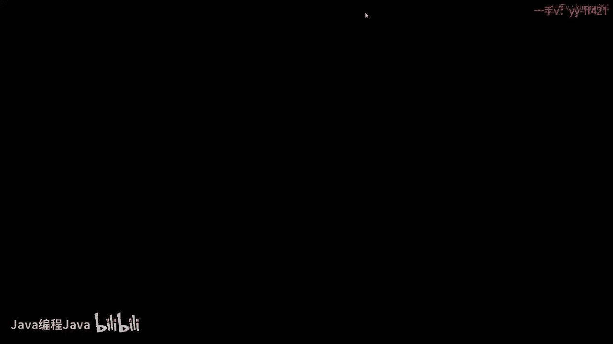
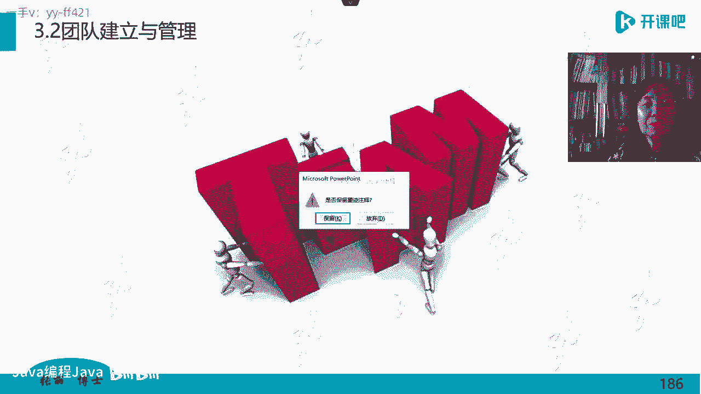

# -PMP认证4期 - P7：12-项目管理人员（二）【itjc8.com】 - OA工作流 - BV1yY4y127aU

Yeah。

各位学员下午好，我们继续学习呃人员管理这一部分内容。那么在学习之前，我们再检查一下自己的网络设备和学习环境。因为下午呢换了一个直播间啊，就是换到了人员管理二这个直播间啊，所以这个学员们下午好啊。

那大家再检查一下，已经进入直播间的学员，再检查一下自己的设备，没有问题，还是按照惯例，我们也签到打卡，然后嗯报告老师一下设备状态完好，用在直播间刷屏刷一的形式啊，来做这个报告。我看一下哪些学员啊。

已经准备好了，有多少学员准备好了。如果有问题的话，自己检查一下自己手里的呃设备状况啊，学习的情况。嗯，做好记笔记的这种准备工作啊，把要学习的用具都准备好，拿到自己身边来。方便做笔记。

不然老师待会儿讲到关键地方，你又没有办法做笔记啊，那这个是一个损失，后面还要补。好的啊。还有2分钟快到2分钟，快2分钟的时间啊，课程就要开始了。那进入直播间的同学呢打起精神来，下午上课是比较累的。

比较辛苦的啊。那我们一定要呃以饱满的精神热情完成今天的啊学习任务。进入直播间的学员检查一下自己的设备，音频呃视频课件能不能看得清声音是不是听得清，做好做笔记的学习的准备，啊。

看看自己的网络是不是有问题啊，调整一个比较舒服的姿势啊，来进行一下我们的学习。嗯，陆续有学员啊进入直播间了。那么进入直播间的学员按照惯例啊，还检查自己的状态，做好学习前的准备工作。

做好准备了就刷一个一啊。老师也知道你已经到场了，有多少学员呢已经做好准备了啊。有问题的学员自己反复进一下直播间，退出，再进一下啊，调整一下自己那那个地方的设备啊，学习的状况环境啊。

然后做好准备开始学习啊。还有不到一分钟时间啊，那进入直播间的学员检查好了以后啊，就要刷一个一啊，做好上课的准备。嗯，新进入的同学啊要做好上课的准备，做好准备了，刷一个一啊。好的。

不断有学员陆陆续续进来了啊，按照上课的时间。好的，时间到啊，一点半，我们下午呢准时上课。那我们现在学习到了关于人际技能人际技能的第七个啊，我们说完了。好，接着我们继续向下啊，第八个就是激励。

刚才有学员说哎前面那个领导力影响力那地方怎么没有提到激励呢？其实它是那个管理能力，管理能力呢，包括激励，我们专门把激励啊拿出来讲解。也是我们这个书上啊，人际关系技能。

这12项里面专门列出了一项叫做激励啊，在哈佛啊哈佛大学呢也被公认的，就是世界啊，在管理学呀和这个软科学研究比较好的这样的学校啊，它是在世界排名考前的这个学校。那么在这个哈佛如果要学习激励的话。

一共有多少呢？大大小小加起来啊，100。91种方法。很显然，我们不可能都在这里来讲解这191种方法。但这191种中，其中有5种常用于企业管理的在企业管理中常用的激励方法，在一般的团队里常用的激励方法。

我们就把这5种给展开说一下哪5种呢？我们列在这儿了啊，马斯洛需求层次理论，赫兹伯格的双因素理论维克多的期望理论亚当斯的公平理论，麦克 le兰的后天需要论这5个啊，我们只说这5个。

其实还有一个比如说强化啊那个理论，我们就不再单独拿出来讲什么叫强化行为。也就是说他做的好的，你就老讲励他这个啊，你看你公司的年底都会评论一些什么先进呀，明星啊等等啊，凭这些什么骨干呀。

实际上啊就叫强化强化那个对正向的那个行为做强化对负向的行为也做强化。比如他做错。那就罚就罚的会狠狠的啊，那么那也是一种理论。但是我们不讲这个强化理论了啊，主要说这五个理论。

那么这个激励他讲的并不是表面上大家看到的。比如说口头表扬一下，给他发点什么物质的东西啊等等啊，激励其实最追求的是激励的结果效果，什么效果呢？让被激励的对象发自内心的释放出自己的能量潜力。

把自己最大的这个动能实现出来啊，那这种做法才叫激励，发自内心的激发出这个他不会因为受到什么挫折，然后就不去这么做了啊，他是发自内心的认真的干而不是他嘴上所表的态啊，就是喊个口号，好像他多积极啊。

不是这个意思啊，那我们看第一个啊大家也见过这个是经常见到的。斯洛需求层次理论，大家都知道，马斯洛呢是一个就是精神心理学啊研究的一个一个学者。那么他提出呢人的需求呢是划分成层次的，最低的需求满足了以后。

他就向更深层次的需求迈进再上一个台阶，这是马斯洛需求层次理论的五个层次啊，也有的图形画了6个，也有的画了4个，但是你最展开啊，把它这个很合理的展示出来，实际上还是马斯洛需求层次的五层次理论。

最低层的理论是对对最低层的需求啊，是对生存的需要，空气呀、水呀啊你能活着呀。首先先啊这最基本的需求，然后当最基本的需求满足了，我就需要有安全的需要，有自由的需要啊，有那种对规矩次序遵守的需要。

当这个被满足了，我也都呃呃觉得挺自豪的。或者说我觉得我挺有啊自由感的，挺有安全感的那就接着再往上迈进，就是要有情感的归属感。友谊呀、爱情啊、社会的接纳呀等等啊，都属于第三层次。

第三层次也达到了就到了第四层次，希望有尊严，希望获得别人的尊重，希望呢别人给我一些更具有挑战性的工作，能够展现我更强大能力的啊，让我多担待一些责任，就到了第四层。第五层叫自我实现层。

自我实现层就是我发自内心的，我也不讲回报，不讲什么啊，也不会委屈。那么就自己全部的心甘情愿去做这个事儿。啊，那么实际上这马斯洛需求层次理论下边这四层。下面这四层都是要别人提供的。别人给的。

我们就用这个简单的说法啊，最上面这一层是自己给自己的。你把握住这个啊，好多学员在考试中这个就。会出错啊，常常误把第四层当成第五层自我实现了。我大概是去年吧啊去年前年看过一个资料。

那个资料说呢这个世界呢啊自我实现的人太少了。本来以为物质极大的丰富，到了一定程度呢，大多数人都会走到自我实现，其实结果不是这样的啊，包括有很多富翁，他不一定能自我实现。

虽然他去捐献去救助一些穷人或者去搞一些公益，但他是出于什么目的呢？不一定是自我实现的目的啊，而是由于他的财产没有办法分配，他只能用于在西方国家呀，你这个资金啊，资产投到做公益上是不用上税的。

是为了减税啊，或者为了嗯更进一步的来展示自己的公司。你包括他把这个钱要给孩子继承啊，或者什么都会上很多很多的税的，所以他。是不想这么做的啊，也就是说他不是发自内心的自我实现，不讲回报。

心甘情愿的我要做的这个事儿。那么这个世界自我实现的人很少到多少呢？在富翁中也只占2%。的人群很少很少的啊，所以那个所谓的比如说。啊，富起来的那个人去帮后进的或者说穷人啊，这种可能可能是一种理想的愿望啊。

不一定能够真正能够实现。那么对于一个管理者来说，你的被管理对象，他的需求层次在那一层，你就要有有针对性的去激励，不能说这个员工，他现在吃喝还成问题呢，你天天给他讲要自由要尊严，那东西对他来说有什么用呢？

他得先活着呀，但是当一个人已经走到了这个高需求了，高层次的需求了啊，你给人家发10块钱奖金，人家心里想了，你还不够侮辱我的呢？一年到头到年底了是吧？你给我你觉得我优秀先进，最后给我得10块钱。

人家10块钱干脆捐献给你吧，人家也不要。啊，就是说明你的激励不对路子，你得针对不同层次的人群给予不同的激励，他才管用。所以马斯洛需求层次理论从这个角度讲也是一个激励的模型或者叫范式。

激励的这样的一个啊做法啊，你可以通过这个层次来激励啊，对呀，那你到了那个层次你根根本就不会看上10块钱了啊，但是话说回来特别穷，那流浪汉，那个你给他10块钱，那就觉得要饭的，他会觉得哎这个挺多的啊。

可能我平时乞丐嘛，我都一分钱一毛钱一块钱的这样的时候，有人给他突然给他这个10块钱啊，他觉得是一个大钱的。所以这个层次不一样，他这对这个东西的理解也不一样啊。

越往下层这个需求呢越在意的是那种实物性的需求。越往上层走，越在意的是精神上的需求而。而且到了最后一层，就是自己自发的自主的。他不会有任何委屈。你像啊这个叫做释迦牟尼，他就自我实现了。他本来是个王子。

家里有钱这样出身的，他非得做那菩提树底下念经啊，干嘛呀，这普渡众生啊，那众生不见得理解，有的义教徒，就跟他叫信教不一样的，还就是觉得他怎么怎么不对，往他身上拽这个树叶子拽这这蔬菜臭鸡蛋什么的对吧？

那他也不会生气的，他会觉得他们不懂，我要渡他们，要普渡众生，还是这么想的，对吧？你像李书童啊，大家可能都见过这些人物啊，实际上呢就是这个饭是模型，西方人有的时候也挺头疼，为什么呢？

因为这个普遍适用于西方社会，就是以经济社会啊，他们的这个假设就是经济人，经济人就是趋利避害的自私的人啊，是这样的一群人那。那这些人呢，他是这个。就是他会讲究比较实际实惠的。所以我这个需求没满足。

我就到这儿，我就拿这儿，我到这儿就走到这儿。但是在这个西方学者研究的时候，发现一些中国人不符合这个。层次理论。啊，你朱自清啊，他死的时候啊，肚子里没有粮食啊，都是草啊。人日本人说给他吃的。

给他这个让他这个出卖祖国，对吧？那朱自清我宁可不要，我不吃，我不要这个低层次需求，我宁可死是吧？我也不要你的那个东西，所以有的时候可能他们会觉得那么傻吗？那不理解呢。😡。

是吧这个这个需求层次理论呢来自于西方，请大家要清楚啊。他进入中国以后呢，杨靖宇对呀，他们是那那是有信仰的，也就是他们没有生存的需求的满足，但他们已经达到了自我实现。哎，这个就是用这个模型解释不通的了啊。

他为了民族的利益，为了这个信仰，他可能吃不上喝不上，他没到要让西方人理解，他不应该有有这样的这个这个境界呀，不应该达到知我自我实现呀。可是现实就是他达到了。😡，对吧这是我们只说这些内容啊。好的。

我们看第二个模型。第二个模型叫赫兹伯格双因素理论。赫兹伯格是一个人啊，这个人呢他经过研究呢，他得到这么一个结论，叫双因素理论。他说这个激励啊很脆弱。分两个啊大的因素，可以激励一个叫做卫生因素。

卫生因素也叫安全因素。呃，安全因素。或者叫保健因素。等等啊，那么它包括什么呢？包括工资福利啊，你的基本的待遇、生活条件啊，工作环境等等。啊，这是最基本的最基础的这样的需求。啊。

该理该理论不一定适合这个有信仰的人啊，就医的时候肚子里都是草。对我们的学员们还是这个新一代的年轻人还是非常的怎么说呢？正面和阳光的，有很多东西啊都是都是有共鸣的啊。朱自清不是吃美国人的原助粮。

后来是死于胃病，但是美国人要给他原助粮，他也不要啊，他为什么有胃病啊，因为他长期营养不良，他不能正式就是按照正顿来吃饭啊等等。那像这些都是有民族气节的人，你包括从古至今是吧？文天祥说怎么说的？

人生自古谁无死，留取丹心照汗青对吧？他要的是这种气节，他并不是那我先一步一步的都满足了，我走的上面，我我当我特别富有了，我才能会那样啊，那不是这个意思啊，咱再回到赫兹伯格的双因素理论来啊。

那么赫兹伯格说良好的卫生因素，就是你给他好的工作环境条件，工资高一点啊，然后这个福利待遇好一点，那么这种东西不会激发他发自内心的那种作用的。基本上没有特别大的激励因素。但是如果你这个卫生因素很差的话。

恶劣不好的话。它一定是会破坏激励的，就是这个因素好的话，不一定能激励它，但坏的话一定会破坏激励。还有一种因素叫做激励因素，什么呢？给他责任感，给他更高的这样具有挑战性的工作，给他更高的。

职责啊负责让他负责一些事儿，一些责任啊，那么这个因素是有激励作用的。如果这个因素不好是恶劣的那也会破坏激励。这是赫兹伯格的双因素理论。有人就把这个两个理论如果不太好理解这个卫生因素这个都是都有哪些呢？

激励因素都有哪些呢？有人就把这两个理论啊给它对比了一下啊，把下三层。嗯，马斯洛需求层次的下三层认为是安全。保健因素，这是两个不同的人搞出来的东西啊，他给他搁在一起类比了，把这个上两层当成什么。

当成激励因素。也就是高层次的。马斯洛需求层次理论的这个层级才有激励作用啊，低层次的。这个没有什么激励作用。当是你当然了，你如果不好，我也不好好干啊，这是这两个理论，我们给他嗯往一起联系一下啊。

第三个理论叫做期望理论，如果你激励一个人能激励到什么程度就激励的这个大小，怎么来计算呢？如果有一个值的话啊，期望值乘以效价就是大小期望值乘以效价。什么叫期望值就是目标值。如果你给这个人定的目标过高。

他怎么蹦都够不着，那就躺平了呗，那只能躺平了，我也够不着，反正我我怎么努力也不行，我这一一生我也不可能企及所以他对这目标就丧失信心了啊，如果你给这个被激励的对象。目标定的过低啊，他轻而易举就能得到。

所以他会有保留的，他不会真正发自内心的去做事儿啊，他就想我有能量我就明年再接着释放啊，现在反正我这点就够了。他能力极强了，是吧？这个叫做期望值，什么叫效价呢，当这个目标期望值达到了。😡。

激励者或者管理者能够给他兑现多少对价？呃。🤢，对价，比如说一个销售人员，你答应他销售了多少啊，给他提成多少。如果他这个销售目标完成了达到了，那你得让他相信，或者他相信我肯定能得到这个提成。

他就会特别努力。如果他就不信任你觉得你那里就是给我画个大饼，我做到了，你也不会给我，所以我也干脆我就不做到，那么傻干嘛呀？😡，啊，所以这个叫做期望理论。期望理论讲的是激励程度的大小，跟两个值有关。

一个是目标值，一个是你兑现的那个目标值实现以后的对呀，你光画一个饼，最后都没有那哪行啊，那破坏了信任以后，啊人可能都会有别的选择啊，就已经就就看不起你了，看不起你这个管理者了啊，轻易不要做承诺，承诺了。

你就要实现，你实现不了的，你别去跟人家去说这个啊，就是期望理论，下一个理论叫公平理论。中国的老话古话也有这个说法，我不换管而换不均，我给我少没事，但是我就不不接受这个不公平就是做的少的人。

他多拿做的多的人反而少拿，我就认为他不公平。但是要想做到公平，非常非常困难。因为每个人都会站在自己的利益和角度来解读这个公平。总之，你让我拿的少就是不公平。嗯，所以这个非常的难把握。

如果你让被管理对象感到了不公平，那可能就右边这些现象是吧？既然你不公平，那怎么办？可能第一种是积极的，我就特别努力啊，我就做到你奖励的那些人，你觉得好的那些人，我朝他们学习，向他们那个方向去努力。

当我做好了，我不是也拿的多了吗？啊，这是正面的，但是从23456这种做法，大家就可以看。第二个嗯。那我就得给别人使个绊子，让他也少一点，对吧？他凭什么就这么多呀，他干的好，还是因为他有资源呢。

或者谁向着他也怎么是吧？自己就有想法了。第3个，减少自己的投入，降低贡献。那我也取得一个什么心理平衡，搞一个心理安慰啊。第4个我就想办法增加别人的难度，给别人。制造点困难。😡，嗯。

那还有的员工呢就是那种阿Q精神，哎，算了，我比上不足，比下有余，我别比那个最高的了是吧？我找一个这个还不如我的人比一比。哎，这样他也就觉得好了啊。最后一个呢。

那可能我就因为这种呃我个人认为的不公平现象离开这个单位了。嗯，所以这是公平理论所展示出来的对呀，哪有绝对的公平啊。那么很多人呢可能一生都在追求做一个高位的管理者，但你真坐到那儿，你就会觉得高处不胜寒啊。

你怎么弄，你这碗水都非常的难断平。嗯，你有向着的人，有鼓励的人，就有得罪的人啊，就是让人家不满意的人，所以总会有啊就是在这个公屏里面只能什么呀，不断的去试去找找那个相对合适的平衡点。

过一段时间这平衡又会被打破了。所以这个管理是动态的，永远在找啊，没有绝对的公平，是这样的啊，那我们要。理解或者了解激励理论里边这几个特别主要的东西啊，那我们在做的在真正做激励的时候要有所考虑。

这是第四个啊。第5个我们看叫后天需要论。他不是那个马斯洛需求层次里的那种通用的范式了。他说这个人呢他被激励的那种要素都是在后天他的经历啊，他自己的这个家庭，自己的环境职场，他的学习的能力等等。

慢慢在后天里边形成的形成什么呢？有的人特别渴望成就。特别想这辈子出人头地，要搞一个什么东西啊，要青史留名，就这么一个啊。那么第二类人呢特别希望就是要亲和好多女生呢都喜欢啊，就这种的需求，后天的需求。

就希望自己能够有一个稳定的生活，稳定的家庭啊，稳定的一个环境。啊，那个人员之间都那么和气。呃，这是。亲和的需求。还有一类人呢就对权力有极高的需求。这个不关乎利益。比如说他也有钱，你看那个特朗普就这样。

他家是富翁啊，他很有钱做房地产的，在这个美国很多主要的城市都有特朗普大厦，其中在纽约就第五大道就有，那是一个就是纽约最繁华的地方，有一个呃特朗普这个大厦，他特朗普大厦呢全国修的都是一个样的模式。

你走那一看你就知道你不用看那个文字就知道这又到了川普大厦了。那个里边的装修都非常的豪华。自从他当了总统以后就是纽约第五大道的那个特朗普大厦呢，也不让下第一层呢还可以进。但是偶尔有的时候他也会封。

那个特朗特朗普大厦的四周呢都已经被围，就不让你靠近了，你可以从那个大门转门进去啊，你只可以上到几层。然后最高层呢最从最高层上面两层的，那个是特朗普有的时候会在那办公的，就那么他很有钱。当时被选中了。

他做总统以后，他都不想去白宫，他那白宫那地方怎么住啊那么差，他绝对不如他家好啊。所以他进了白宫以后，自己花了很多钱。他老婆呀把那个白宫翻天覆地重新装修了一遍，都按照他的这个风格。

这个美拉尼叫什么什么拉尼亚啊，他装修了以后，都按照自己的装修完了也到点了4年下台了。他没想到他以为他还能再做4年。就是这样的人，这这种风格，那么他并不看重这个总统给他带来多少钱，多少具体的利益。

他要的就这个权利，但是他一直也没有实现自己的这个需求啊，制约他的东西太多了啊，他老想跺一跺脚，全世界啊都听他的他要就这种感觉，这就是这种人的需求，那你对他怎么能够才有激励呢？对吧？你投其所好嘛？

让他满足这个需求，他的那个激励啊才能有作用，我们常常说什么呀？需求产生动机啊，动机产生行为啊，啊，你那你这这个你要符合这个逻辑啊，他激励就管用了，他到底什么动机啊，需求导致带来的。我有了这个动机。

我这需求也满足了我的行为就能体现出来。哎，我是一种什么样的。所以这是西方人研究的所谓这个激励理论，激励理论的这5条。啊，我们常用的这个东西，中国当官才更容易搞钱，不要随便搞钱。因为历史就是一面镜子。

你可以借鉴啊，就像和珅一样。啊，你搞钱的时候很愉快很痛快，自己家都盖了一个藏宝楼啊，有机会大家到北京来看看那个恭王府，和珅曾经住过这个府啊，他自己贪来的东西，专门搁的一个一个藏宝楼小楼里边啊。

做标签都做不过来，怎么做呢？用窗户的形状来表示我这间屋子放什么，这个窗户做成大金元宝啊，这间屋子是纯金元宝的那个放会做成字画，那个里边是搁子古字画的，就是用窗户的形状来标明他那里边存的什么。

结果不是还是属于国家的嘛？对吧？那一夜之间是吧，让他都死了，他不在乎钱。对呀，这个特朗普不在乎钱，他总统他是亏钱的，他干嘛，他有权利的需求啊，这就回到我们的后天需求论，他要的是这个东西。啊。

可能他最后也没有实现，还没当过瘾呢，所以一直还在闹腾啊，这是关于这个后天需要论。总之还是这么一个逻辑，也就是需求产生动机啊，动机产生行为。那你要懂得这个心理学上的这个路径，这个流程就可以什么呀。

可以投其所好的去激励对象，比较麻烦的就是一个管理者，他根本就不知道他的下属到底需要什么，他需要的东西也许不是他嘴上表达嘴上说的。他可能会呃用自己。最真实的行为来表达，他那不是说嘴语言说的啊，那么。😡。

那么是真实语言有的时候是变样的，不是真实的表示啊。好的，这是后天需要理论。这个5个激励理论啊是在我们考试中都见过的啊，都见过的考试的内容啊，人家提到哪儿，我们应该知道它主要说的是什么意思，没有难度啊。

需要有些没学过的，要记一下啊。第九，我们学习一下。沟通的人际技能。前面一直在说，沟通很重要很重要。因为我们这个项目经理以大量的精力，大量的这个时间啊和工作内容都放在了沟通协调上。

那这里讲的沟通是广义的沟通。广义的沟通，包括听说读写。总之。你不管用什么形式传递信息，就叫做沟通。所以听说读写都叫沟通。也有人就以为我这个说话叫沟通，写就不叫沟通，写也是一种沟通啊。

那么这个沟通主要讲的是信息交流交换，主要讲的是这个词有效。沟通是与生俱来的一种能力，人天生就有都会，但是能不能有效沟通呢？就是后天它形成的一些沟通的一些技巧，一些本领。嗯，先天人都会沟通，比如说动作。

婴儿会哭声用哭声，对吧？要表达自己的一个意思，想要引起你的注意或者怎么样啊，天生就是都是有的。那么就需要呃有效的传递信息，讲究的是有效。这个有效呢包括效率效果，有效率的传递信息，有效果的传递信息。

让信息不走样。我就是想要表达这个表达的这个让别人接受。但是这个都不是一个很容易的事儿，想有效都不是一个很容易的事儿。如果信息一走了样，产生了误会，误解就会带来冲突等等啊。那这是关于沟通。

涉及到沟通的一些内容，还包括什么？沟通最主要的一个要素，叫做积极倾听。西方人说，你看我们这儿有个谚语。什么叫谚语呢？上帝给你啊，一张嘴，两个耳朵，一个嘴，就让你少说点，多听点。要多听别人的。表达啊。

明白别人到底是什么意思，然后你才可以做自己的决定。如果别人说说你也不仔细听，你都没明理解别人到底要做什么需求都不清楚啊，下一个观察他也是广义沟通里的内容。观察什么观察别人的动作非语言。

他通过一个姿识眼神态度、笑容表达了啊沟通者传递信息者更真实的信息，所以你要会观察。而且这个观察要用什么做法呢，叫见微之处，不是听别人说，而是看他特别细小的一个动作，一个一个表情。

他就能表达一个更真实的信息，这是管理者呀，就需要你有这种本事，啊，有见微知处，能识别别人想法的啊这样的一个做法。另外交谈，那么就是用这个口头语言嘛？开会会议是一个经常见的沟通方式，人际交往。人际交往嘛？

人和人之间打交道，交往，那最多的用的还是沟通啊，听说读写做动作啊，语言非语言啊啊，最后还是想正确的传递信息出去，让别人理解你，了解你，你也了解别人。下边一个名意小组是指的什么呢？就某一些关键的东西。

我们做一些这个投票啊啊，我们几个小几个成员一起来决定一些东西啊，这也属于一个沟通的方式啊，这从广义的这个角度讲说的沟通啊。那么沟通在我们的梳理被分成了不同的类别啊，按照活动不同的维度进行的分类。

有这么叫的内部和外部沟通，常常这个内外部啊在项目管理中是针对的项目，就是项目内部，项目外部但是也有些题目是说的执行组织，就我们这个公司的内部和外部的沟通。呃，你看西方人他教授沟通。

甚至教自己的那个小孩子们啊，在学校里面，在幼儿园里边还没有上学，他就会上这个沟通的课。他们也叫社交课等等啊，有这种社交课，有沟通的课。啊，但是他到别人的地盘上瞎鼓捣，瞎挑拨人家的时候啊。

他就鼓捣人家要知情权，要这个要那个他这教自己的人民要内外有别呀，内部沟通，有外部沟通啊，那怎么你要知情权，你知情什么呀，是吧？所以每个人对信息的把握都跟你的地位身份是有关的，在一定的范围之内。

你该知道的就知道，你不该知道就不知道。那中央政治局委员开会，那能让你知道吗？😡，嗯，你是哪个角色呀？所以你也挑拨，然后你都跟好知情全都闹什么。对吧老师名意小组能举一个呃实际的场景吗？可以啊。

名意小组是这样，比如我们要决定一个事儿，我用头脑风暴，头脑风暴出了好多个主意。嗯6000个主意，比如说那这6000个主意我先按什么方法做呀？所以我就搞一个名意小组。

这些名意小组的这个人呢不一定都面对面都到现场了。他有可能通过互联网通过什么啊，做一个投票，就是我们在这6000个方案里边选那么。几个啊，那你要排出优先级来，对吧？

所以用名义小组组成的这个成员组成的这个小组去投票，投票得出来哎，哪个方案第一，那就按哪个做哪个方案第二排一个优先级啊，决策委员会呃，它也不全是决策委员会啊，它是由就是我们要决定一些东西。

有一些这个有个小组形式的这种组成，大家去投票的。你看这投票嘛，它也是其实也是沟通的一种方式选这个方案的一种方式啊。好，继续回到我们课程来正式沟通和非正式沟通。那一些重大的信息，重要的信息一定是正式沟通。

比如说盖上红章啊去传递，是中国有红章，的，国外也没这个土章。嗯，但是我想说的是，有很多信息一定要正式沟通。比如说合同合约说咱口头说一声，我跟你说一下啊，就那个那个那个什么多少钱能怎么办吗？那不做数的啊。

要正式的，你给我传递零给签字的，有章的这个这叫正式沟通，非正式沟通，就是下班路上小哥几个约着喝点酒打个球。哎，这个时候我们传递个信息，那非正式沟通来的。啊，所以这叫正式和非正式沟通。另外。

按照公司组织结构的层级，从上向下传递信息，叫向下沟通。你向老板汇报叫向上沟通，评级之间沟通叫横向沟通，或者部门组织结构那个并列的那个职能部门之间的这个沟通叫横向沟通。下一个官方和非官方沟通。

有点类似于正式和非正式不一样。因为民间你传递的一些信息，就叫非官方政府或者在正式的网站平台上，比如说外交部人外交部发言人，那发言那都是官方沟通。你这儿听说一个什么什么美国的什么事，你认那一个。

那你都是非官方的，不是正式的。啊，下一个口头沟通和书面沟通，这个大家都比较理解啊。最后一个语言和非语言沟通，这个在管理中是非常重要的啊，那有这么一个说法，在沟通中，因为我们强调这两个字。

这个词刚才也提到过有效。在有效沟通中。嗯，语言。就是你说的那个语言说的那个话啊，或者听说读写的那个话，那语言在有效沟通中占多少比例呢？😡，7%。语言只占有效沟通的7%。然后我表达的方式。

沟通表达的方式在有效沟通中占多少38%。所以有的时候有人也听到这个话，你怎么说比说什么内容其实更重要，也就是那个态度嗯，你选择方式传递的那种表现出的一种态度。这是第二个啊，这两个加起来45%了。

肺炎沟通。😡，占55%甚至什么以上还多啊以上。那么前两个数据哦，我没见过最后这个数据在考试中考过PMI的考试中考过这个数据啊，前两个没有考过。最后这个考过啊。这个沟通管理学里强调肺言的沟通。

传递了更加真实的信息。这个人的动作、语气、语调，你一模一样的语言，你就变个语调，你传递的信息就不一样啊，比如说我给你举个例子啊，说好，今天下课以后这个同学啊，张老师啊，我请你吃饭，哎，你看同学很高兴。

你看老师挺辛苦讲的课，还请我吃饭是吧？多美呀。哎，你下课以后跟这个学员说，下课以后我请你吃饭，这啥意思呀？这不是我要请吃饭的意思了啊，一模一样这个词一稍微变一个语调，表达的信息就全不一样了。

如果写出来就是我请你吃饭，但是听到语调以后就更真实的表达出了很多内容啊。口头沟通是不是属于非正式的？那看什么情况，比如说在这个开两会啊，人大开会上面在那发言，在那讲讲事儿，那是不是语言沟通啊。

那也是正式的。不是说语言沟通，口头沟通就是非正式的。我在那个一个大会上做报告，我这也是口头啊在说话，对吧？但是我这个沟通是正式的，看场合啊，这是这样的。对的，察言观色。

肺语言就是要了解这个语言背后的什么潜台词。他真正心里想表达的是什么。啊，可能跟他说的语言不一样。比如说我们小的时候年轻的时候，那个时候中国呢就是还很落后啊，粮食都很少。像我们作为这个北京人。

他是发粮票了，一家有多少粮票，那么孩子多的这个家庭，特别是男孩子多的家庭，那时候没有油水，吃饭就吃的可多可多了，对吧？那么人家家这个粮票是很宝贵的，就是你有钱，那时候确实也没钱，家家都一样啊。

那么你人家这个你要是到人家家正好赶上中午吃饭，你吃人家家一碗饭，人家孩子就少吃一碗饭。真的是到月底就没有这一碗饭啊，所以那个时候呢吃饭都是也是一个很大的事儿啊，有这个小孩子，比如给父母传递个信息。

说你去到邻居家啊阿姨家跟他说一个什么事儿去，你去了，正好赶人家吃饭，人家摆桌子说，哎呀，你坐下吃饭吧，你坐下吃饭吧。😊，你可别真坐那吃饭啊，你坐那吃饭，人家就少一碗了。

所以那个时候小的时候父母总是教育我们不要吃别人的东西啊，就是你赶快回来，因为那个时候是经济都是拮据的，你吃了别人人家的孩子就少了。虽然人家的父母也真的是挺真诚的，让你吃让你吃，可是你真吃了。

人家会很尴尬的。😡，啊，所以这就是一种这个表态啊，那么方式就讲的，刚才我们讲的是内部沟通外部沟通啊，语言啊、非语言啊，听说读写啊，这是沟通的方式啊，这是语言呢是语言表达出来的那个直意直接的意思。

方式说话的方式，你是直接的间接的，是写书面的，还是用什么啊，所以这是表达方式，是指的表达方式占38%，非语言沟通。比如说你见着人一面，哎，搂一搂，不不说任何语言握握手，一个眼神，别人就知道哦。

它是友好的。但是虽然你嘴上跟人家握手，但是你那个那个表情都凶狠狠的。你想那个握手的人心里，他会觉得你是很不情愿的。😡，啊，所以要明白这些内容啊。注意文件沟通是正式的一种沟通嘛，那不一定是文件啊。

文件也分情况。当然你红头文件呢一定都是正式的沟通。就是当有说法跟这个红头文件不一致的时候，是不是都按红头文件，为什么？因为那个是最正式的，最官方的沟通啊，所以关于沟通这几个意思啊，得了解清楚。

另外需要说的，我再给你出一道题啊，考试中碰到一个这个题。也就是我们在讲沟通的这些内容的时候，它有一个前提，假设什么前提假设大家都用同一种语言在沟通的时候，他所表现的情况。那我给你一个题目啊。

这个题目这么说，现在有一个机会。单位要调你去到国外境外去工作。这个境外用的语言呢，是你非母语，就不是你在比如说我们中国人到海外去工作了，用的不是中文，比如用的是英文。啊。

就是这么一个场景说你要到那儿工作去了，那你怎么跟别人更有效的沟通呢？有这么几个方式供你选择。第一个。书面沟通，每次跟人沟通时候拿个笔纸在写。第二个我不行，我带一个翻译去，因为我语言不行，带翻译啊。😡。

就是你长期，比如说你到海外工作一年两年，长期这第三个带翻译啊，第二个带翻译。第三个。嗯。第三个叫做肺炎。用肺语言沟通啊。第4个。嗯，叫做那我想一下啊，第四个给的这个答案是什么书面语言带翻译曲啊，非语言。

第四个是学习。当地的语言。这四个选项你选哪个？😡，我还没写完第四个呢，有同学就已经选三了。嗯。还有没有其他的答案？一审大家都认为非语言沟通有效是吗？😡，如果把你派到国外去了。😡，国外工作去了啊。

你就跟人家比划是吗？用非语言沟通啊。😡，后面的学人上来了啊，选的是4。四十大对的，你看你要考托福考加RE啊，你要了解当地的语言，你不了解当地，你光比划不是比划错了吗？😡，是吧有同学选二带翻译。

那你除非你是国家主席领导人。那工作起还带翻译啊，你几个人，除非我们是一个短期工作的一个团队啊，那么他可能团队会配一个翻译，会这样。人家现在把你一个人派到那儿去工作，对吧？前提是什么？与非语言沟通有效。

前提是指什么呀？大家都用的是同种语言啊。那肺炎你比划也得懂啊，有些比划它意思也不一样。你比如说在非洲国家啊，你有些笔划可能是不友好的，你也不能随便去做某些手饰啊等等啊。😡，所以这个非语言还是要讲究。

对呀，学习当地的语言短期不合适。那刚才我说了啊是一个长期的啊，短期也合适啊。你知道在美国美国其实有机会去的话，就会发现啊他最歧视就不会说英语的人。因为他奖历你连沟通都不会。

因为他有一个特别就是那种叫什么这种就是这个自恋嘛，他觉得英语就是他的语言就是最强大的啊。虽然他说的是呃移民国家都尊重大家的这个选择，但是不会英语，其实在那儿也是会吃很多亏的，因为你跟人沟通不清楚事儿啊。

啊，会出危险的。啊，所以这个非语言的前提呢对，大家都不是共识，都是用同一个语言，就是大家都用英语哎，咱们非语言管用，大家都用中文，咱们非语言管用，而你用的语言都不一样，你在非语言意思都不一样啊。

特别是在美国真的不要瞎比划啊，瞎比划有生命危险。嗯，因为美国是一个。可以合法持枪的国家。虽然呢不同的州也有不同的法律啊，有的地方严一点，有的地方松一点，但是它持枪是合法的。如果你跟那警察交流。

你都摸这儿摸那儿的，人家以为你有枪呢，帮你脑袋爆了。😡，人家不是瞎比划的。所以在这个国外，你被警察摁那儿了啊，或者有什么事要找你了解的话，第一件事儿双手抱头表示我没有威胁，你看你得知道这个手势吧？😡。

那咱们这双手抱头不觉得自己是罪犯吗？你文化不一样啊，你语言这个不一样啊，不就这样啊，是吧？所以双手抱头告诉他，我不会动的啊，我两个手不动，对吧？那你这个我的驾照在哪？假如说你这个超速了，你警察说你了。

本来没多大一个事儿，但是因为你拉手抠找这个翻你的驾照掏你的身上，从你这个兜里掏什么东西，人以为你掏枪了。😡，这个就是文化不一样，或者这个动作不一样，它就比较危险啊。所以这个时候就是这个呃。

但是其他的人呢咱们不讲这个，咱们也不讲种族歧视，因为种族多了，又是这个移民国家，那么这种国家的概念呢，他可能也弱于这个种族。所以这里边种族歧视呢，也会有很多对呀，他是互相歧视的啊。

也不光是说都谁谁谁怎么样啊，啊，我把二呃也理解成自带翻译器，不是带翻译器啊，这中国的这个信息化真的是很强。科大讯飞的翻译器真是好用。这里说的是带一个分翻译人员，你一个人到海外工作了，自己还带一个翻译器。

很显然，一般的公司也你也不会有这么高的待遇，这样给你配备的，除非你是离了你不行，特别高层的这个人啊，所以我给大家在这个地方说一下给一个题目啊，也就是我们在真正考试的时候，他并不会直接问你这些概念。

他都是用一些这些场景，一些案例。啊，一些实际的场面给你让你做的这个判断。所以你对这些概念要特别清楚。如果不清楚就有问题了啊。另外书写沟通的时候，我们要书写的话，听说读写不都是沟通嘛？书写的话有一些原则。

当然他这个原则是针对英文写英文而言的，可是中文的书写也可以参考，就是你首先不要有错别字吧，你标点符号要正确吧，语法要对吧？你那个逻辑要清晰啊，写的要明确呀，别有那个多余的字啊，你像我在看方案的时候。

我的手下来给我写的些管理咨询方案，我就大量的删掉那些口语化的字，这个什么什么什么啊，你怎么写的这个语言里了，书面语言里了，有的人经常是然而吧，但是吧还带个这个把是吧？带个把这些得地得。

这个把这个这些虚词全部都删掉，不能有多余的这个字，要高效率沟通。非常的简洁，而且要明确10个人10个人看你写这东西都是一个意思。我们也见到很多理工科出身的学员写一个很简单的一个产品说明书。

几个人看几个意思，不明白他说的什么又奇异啊，所以这是书写写作，也是一种非常强的沟通能力的体现。一般情况之下，口头表达能力强的这个书面表达能力也强，这是一般我也见到过啊，口头表达能力非常强的人。

他书面写这个特别费劲，也有这样的人啊，那么这个。对管理者来讲，听说读写都是同样的要求，不是说你很能说就行了。你也要能把它善于用书面文字语言啊，书面语言把它表达出来。啊，另外沟通的技巧。

第一个就是积极认真的倾听。因为要理解不同的文化背景，不同的宗教习惯，不同的性别差别，他们之间的沟通的一些差异。嗯，还有要能够懂得相关方，他到底有什么样的利益诉求和期望。另外要会一些强化技能。

比如说说服别人的能力啊、指导啊、引导这方面的能力，这是沟通的技巧啊。所以再强调一遍，沟通强调的是有效。也就是您这个信息传出去了，效率也高，效果也好，能够达到有效的目的才是一个好的沟通啊。

由于项目经理他大量的工作都在沟通，所以这个一定要了解啊，我们再把这个沟通的模型跟大家好好说一下，我可以负责任的告诉所有的学员，沟通模型是每次考试都考的内容。每一次都考，没有一次不考的。😡。

这是一个沟通的最基础最底层的或者底线的一个最基本的一个道理，一个理论或者理念。所以必须要会必须要掌握啊。那么这个沟通的模型在我们的这本书里画的是这个样子的沟通就是有信息的发送者，有信息的接收者。

就这两边。信息的发送者在发送信息之前快速做一个编码啊，他先编码，就是我要表达什么呢？做了编码了，编码的方式有很多，可能是快速的思考，可能是把它写出来，然后通过一个媒介，一个媒体把这个信息就传出去了。

传到哪儿，传到接收方这里。接收者接到信息的第一时间先解码，什么叫解码。哎，他什么意思啊？他跟我要传递什么信息啊，然后解码啊，解码了以后做双重两重的反馈，两次反馈。第一次反馈呃，这本书叫确认信息。

其实就是什么呀？告知收悉。这个信息我收到了。😡，这第一时间做的啊。那么光有这一重反馈，一次反馈，并不能够呃表明你做了高效的沟通。还有第二次双重反馈，这里反馈信息。这个反馈怎么反馈呢？叫你要表达一下。

你明白否。或者你收到了，你收到什么了，你明白不明白啊？常常这第二个反馈会用什么方式呢？叫做。你简要的用自己的意思重复一下发送方的信息。哎，这个就是你明白了。如果你照着别人的原封不能念一遍。

你可能不一定懂，不一定理解。你用你理解的意思来表达一下。😡，啊，这就是有效沟通模型里的最重要的双重反馈。嗯，接收者要做双重返馈。第一知道。第二，你重复一下他发送信息的人。比如说发送者说几月几号啊。

下午几点在第几会议室开会，你好，收到提前收到啊。呃，星期一下午2点，我准时参加第一会议室的会议哎，这个就是你不是照着他把他的通知再重复一遍，而是你把你自己的理解再回一遍啊，这就是一个有效的沟通。

有学员已经注意到了，在两边还有环境沟通的当期的环境。这个环境里其他的内容大家都比较理解，不理解代记。什么叫代记啊？嗯，代记就是代沟。代沟不同年龄段的人，他沟通的语言不一样，一定要注意这个语言环境。

这个事验事业环境因素。你比如说现在咱的这个屏幕前的年轻人，二三十岁的人啊比较多。那你跟那八九十岁的人沟通呢，你说你现在的那些语言他听不懂的呀。所以这有代记啊，你在发送信息的时候，你要考虑到这些因素。嗯。

包括你在职场上有一些年龄比较大的老专家，你应该用什么样的语言来跟他沟通？他能够明白啊年代的差异，代季的差异啊。那领导给你布置任务，然后领导要确认一下啊，他你是不是理解他这个意思了？对的。啊。

就是这样的啊，就是这个意思，就是要确认。所以日本的一些好公司，世界五百强，日本的就是特别优秀的公司，他的老板跟员工怎么布置工作呢？跟你说123做完了啊，说完了，你给我重复一遍，我刚才说的什么。

他让员工跟他说一遍。啊，这就提到了什么呢？如果沟通没有效果，效果不好，谁的责任更大呢？发送方的责任更大。如果他不反馈的话，你要索要反馈，怎么索要。一般发完通知以后，你就会说收到请回复。收到请回复啊。

给我奶奶发个YYDS，他说你小子讲什么呢？就是这样啊，他不懂啊。因为你现在的这种这个网络的这个语言啊，这个方法非常管用，可以确认接收方。对的，是不是理解了，他可能只听了一个表面的意思，他没有明白呀。😡。

如果他们真的没有名白，他是在去做事儿。😡，他就不能准确的执行发送方的那个意思，他就走样了。😡，啊，所以这是有效沟通的模型的关键。我也常常管这个叫一来二去。你看咱们中国语言一来二去，他俩就熟落了。

怎么一来二去啊，就这样一来二去的。呃，这就是一来二去的沟通模型啊，一来两去啊，来回这样一反馈，大家就明白了啊，所以这是一个有效沟通的模型，每次考试都考再说一遍。啊，他艺考的跟这个类似的内容。

你就想这个沟通模型。另外还有一个词要解释一下噪音。这里提到的噪音不是物理噪音，说我们沟通外面有个拖拉机咚咚咚，我们听不响，那不是我们讲的不是这个啊，这个信息传递中的噪音就是信息传递的阻碍。

什么因素阻碍了信息的传递呢？考试的形式啊，是什么？是案例，给你一个案例啊，然后让让你来。😡，说这个题目让你来回答啊，噪音包括什么语译学。😡，语言。还有什么人的理解能力。还有人呢经历。嗯。🤢，经验。

都导致了信息传递的障碍。嗯，还有专业。比如说我们普通人一般人到医院去看病，你看那医生写那东西你就看不懂，不知道这写的什么。但是你把那单子给到药方，人一看就能看得懂。因为这专业咱们不知道那个东西是什么。

😡，这些东西造成了有效传递信息的障碍。嗯，而且这个障碍这个阻碍这个噪音是很大的。比如说你看大家都做过这个游戏啊，呃呃找10个人站到前台，悄悄的告诉第一个人一句话，甚至不告写一个纸条，让他看一下。

然后不让别人看啊，然后他再一个一个一个的就悄悄的传给下一个人，传到最后你看那信息都面目绝非了。为什么？因为每个人都加上了自己的理解。我觉得是这样的，他不是有意的，不是故意的啊。😊。

就是这么一个媒介呢就是传递信息的方式。嗯，这是哎对，有一个叫你画我猜是吧？那么这个就是在传递信息里边。会失真，会跑偏了，这个叫信息传递的噪音，或者叫阻碍。所以一个管理者要明白，有些信息传偏了是正常的。

因为什么有噪音了，有阻碍了。这个阻碍到底是什么因素。我们右边写的这个大家就应该就能够嗯就能够知道在真正传递的时候怎么做。按呃噪音会发生在传递信息后，不是解码发生的吗？呃，也不全是解码这个地方啊。

它主要讲的传递过程中，信息就已经跑偏了。跑偏了，这个理解就跑偏了，是因为受到了这些因素的影响，你解码就解不好了。在解码之前，你受到这个影响，你解码解成了你自己所理解的这样，所以就需要双重回复啊啊。

你一回答我就发现哦，他没明白我说的这个意思，我可以再给他讲一遍，所以这样才能更那个。更有效的传递信息。这里还需要说明一点，职业道德或者是道德人品方面的因素不是噪音。什么意思？有的人在信息传递过程中。

故意的人为的想挑拨利间，人为的造谣，改变了这个信息的方向。这个不是管理学历沟通管理学历研究的问题，那是。职业道德领域里的就是我明明知道这个传递信息的人是这个意思，但是我说出去虽然也是原话。

我给它添油加醋，给它加工一下，把它变成别的因素。嗯，这是人品问题，这是道德问题。在你选这个题目的时候选的时候啊，人品的这个问题不是指的噪音。嗯，因为我们学习这个体系的。

假设条件就是每个人都是遵守职业道德的。你你来学这个PMP专业人士吗？你要考职业道德，遵守职业道德的，你还不遵守职业道德，搞这些东西，那就是另外的这个事儿了啊。😡，好的，这是关于沟通模型啊。

我们必须一定要了解啊。那在考试中所涉及这些内容呢就难不倒我们了，常常会有这个双重反馈的这个意思。或者说比如说啊我跟大家说一个题目。当一个信息发出去了，常常会被认为什么呀？对方就被接收到了。

这是常见的信息传递的误区。那么他会问这个。在这个有效沟通的模型里，这个责任最大没传递好在哪啊？责任在谁身上，就类似这种啊。还有我们后面做练习题的时候都会有这些内容啊，大家会在这个题目中再进步啊。

另外前面也说过，会议呢也是一个比较重要的沟通的形式。会议关于会议的啊内容或者关于会议的理解都是常识。我们在这里不再说了，这里强调的也是有效而不是数量因为考试有一次出了一个题目啊。

说的这个这个开会啊以下哪项是正确的，说呃多开会，有一个开的会议多啊，这个选项还有一个呢叫做这个呃开的会就是效果不好，就是没有效果的会。有的学员认为多开会是缺点，不是。没效果的开会才是缺点，才是不正确的。

其实西方人一点都不比中国人开会少。嗯，你想他开他民主管理嘛？他两会他不是两会了啊，他那个国会众院参院整天的开会啊，那个会场永远都是满的。那会议会场是可以进的。我有一次去美国国会，正好那国会在开会。

我也不知道他在开会啊，他门口那个当时把门站那保安，的保安都是穿的那个秘书的那种工作服啊，不是有特别重要标志的。当时也没在，我就一拉门，一看，那美国国会在里边开会呢，别人也都看看我友好的笑笑。

人家也不会这样啊。其实他那个游客呀什么，他都可以从那儿走的。但是一些重大的会议，他是封起来的，是不让你参加的。啊，这是这样的，所以无效的开会才是浪费时间，多开会不一定是缺点。我想提醒大家注意的是这个啊。

关于开会的一些注意事项。那么在这个片子上，左边右边都有啊，这是你在自己的单位也常常见到的关于开会的一些规矩和一些要求，我们在这儿就不再说了啊。好，在考试中，我说的是在考试中啊，常见的会议类型。

会议的说法，我给大家列了表。在预测型生命周期的项目中，会议一般会叫做启动会。呃，我们之前也说过，kick off开工会这个启动会。是在启动过程组结束了，就任命项目经理的时候。

宣布项目经理有权动用组织资源。当然他不是自己亲自动用，是通过职能经理帮忙动用组织资源的时候，开这么一个会，这个叫启动会议啊。第二个会在考试时候也被翻译成，有时也被翻译成启动会议。但它叫kick off。

所以你看这个启动大会要，看一眼英文，说的是哪个内容。这个kick off会，是在规划。之后。启动之前开的会，之前我们在前面介绍五大管理过程组的时候也介绍过这个了。它不一样啊。

这个会的主要内容和作用是团队成员彼此要熟络一下，而且从上到下。因为我规划做好了，计划做好了，向下要布置这个计划，布置规划。自下而上要做什么承诺，这个非常非常重要这个词啊。

那么在这个会议里就没有承诺这一说，在下边kick off这个会议里就有承诺。这一说。承诺也就是。😡，嗯，我能做这个事儿。我承诺了，我就要负责，我就要把我做的这个事儿责任给履行到位。

如果我说我不能做这段时间我有什么事儿，这也叫承诺，这叫什么承诺？负承诺负面的承诺啊。😡，附承诺负的。嗯，另外在这个会议上还有目的就在这儿呢？这几个我正在讲啊，开工会议的目的在这儿分配工作嗯。

开T也任命了项目经理，项目经理早就任命了，在这任命了。😡，这个时候项目经理已经任命了，任命了项目经理以后，项目经理才可以做计划。做完计划以后才开这个kick off会，布置计划，因没任命你项目经理。

你带人家做什么计划呢，对吧？然后团队之间建立那种沟通关系，建立责任关系。😡，呃，谁哪个团队做什么事儿了，所以这是两个不一样的会议，这个在考试中也特别容易出错。另外一个叫焦点小组会议引导式研讨会。

后面在其他的章节里，我们还会讲相关的内容啊，在这儿就不再。呃，详细的说了，因为这儿也说不太清。我们在那个具体的点上再说这个啊，还有一共8个啊啊不是封口了，你在家也更多。

但是我们考试里主要见到的这个规划会议。所有在进行规划，进行plan的时候啊，进行计划的时候用的都是这个planning meeting这个会啊。第六个状态会议，或者叫状态审查会议，这是项目的周例会。

周例会月例会，这个例会。叫状态会。现在项目的进展情况做这个汇报的。第七个投标人会议在招投标采购那一章用到的招投标之前的准备会不是开标会议啊。是招投标之前的准备会。后边碰到这些内容的时候，我们还会详细讲。

还有一个可能是以会议形式存在，也可能不以会议形式存在的，叫做经验教训总结会或者评估会议。啊，预测型生命周期的项目在考试中，我们常见会议有这样的说法。敏捷呢迭代呢适应型生命周期用什么会议呢？一站立会议啊。

每日站立会。第二，迭代的规划会。第三sprint冲刺发布会啊，冲刺评审会用的都是这样的语言啊，有学员说那个早会对的，那个早会就是站立会议啊，迭代审查会迭代回顾会就那review回顾会啊，第七个。

整个项目的会这个回顾会啊，第八个项目结束的一些活动。他用的这个会议的名称不一样呃，用的这个名称是。有区别的那根据这个会议的名称，你就可以区别出这道题。考我what for考我这个呃预测型生命周期的项目。

还是考我适应型敏捷和迭代。你通过这个会议就知道这个项目现在在做的是什么项目，选的是什么生命期管理的啊，这是要注意的啊。好，第10个人际技能叫做谈判。谈判是一种特殊的沟通，这个沟通最终要达成一个共识。

这个共识一般都会以合约或者合同的形式来建立，这就是谈判啊，合同也有可能是文字的，也有可能是。啊，就是默认的一种合同。你比如说你到商家买衣服，你交了钱，商家给你衣服，这本身也是一种合同。

但是我们没有签一个写一个纸啊，但是这是一种合约的形式。我付了钱，你给了我这样的东西，当是你给我这个东西质量也好，如果质量不好，我肯定会要会去找你的，我肯定要退呀、索赔呀等等啊。那么这是。

谈判它的结果就是我得有一个这样的结果。那好，我们又回到有几个。啊，有三个教授，大学教授，也是哈佛的教授，专门研究了谈判，写了一本书叫谈判例。在这本书谈判例里边，这几个学者提出了这么一个观点啊。

他们刚一开始这个书就这么写的，它很薄，也不是很厚的一个书呃，说谈判呢有这么几种风格，比如说大老虎似的啊，大狮子似的谈判，非常的强硬，什么都得听我的啊，这是一种。第二种呢就是小绵羊小白兔似的谈判什么呢？

哎呀，我比较弱，什么都听你的吧，就这样不断的让步。那么这个几个学者说，这两种谈判虽然可能最终都达成了一个共识，一个协议，但是都不好。因为你在执行的时候就不行。就执行不下去。😡，嗯，所以怎么谈判好呢？

这几个学者研究了以后，就给了一个叫做原则谈判法。要用原则谈判法。这个谈判例里边写的啊，什么叫原则谈判谈判法呢？就是按照原则来谈判，按原则来谈判。

谈判主要所表现的这个形式就是协商、商量交涉、磋商用的这些词。啊，在进行谈判的。那谈判其实真的也是一个挺难的这个事儿。因为各方都有这个利益的诉求，让大家都能达到，都能满足，就挺不容易的。

因为有一方有的时候满足了，另一方就利益受到了重大的损害。所以美国人研究的他写的书叫做原则谈判，按原则谈判，还是那句话，他不一定自己那么做，未必那么做。还有一个这个谈判还有一个条件。

假设那我们双方都是怎么说呢？我用一个中国话啊，毛主席的话，人民内部矛盾，就是我们自己都是朋友这样谈的，按原则谈判。如果我把地对方当敌人，那就不是这种说法了，我就死活我也不想让你赢。

而这谈判不是在达成共识的过程，而是你死我活的在这儿。😡，那就不能拿这个谈判例来解释关于谈判了。那么谈判按原则谈判哪几条原则？四条原则我写在这儿。第一条谈判的时候对事儿不对人，我们谈的是这个事。

不是这个人，但是做到这一条都很不容易。人有的时候跟别人谈着谈着就跑到了对人的这个攻西攻击上了。啊，你比如说特朗普他是这个代表啊，哪个党的这个。这个谁佩洛西啊，他是民主党的这个领袖是吧？那他在谈的时候。

谈着谈着他就急了，对吧？或者在沟通一些事儿的时候，特朗普就发火，就觉得对方不可理喻，你瞧他长那个老妖婆子的样子，他家都是什么，他家家里的人都多坏，他你跑他攻击人去了，你不两党谈的是事儿吗？😡。

是吧变成就变成对人的这个事儿上去了。第二个谈判的时候啊，这是这几个学者研究的，是基于利益，而不是基于立场。如果基于立场谈判基本上就达不到共识，不可能达成共识了，就永远坚持的是自己的立场。

第三个叫做按照标准谈判。有一个学员曾经跟我说，你看张老师谈判呢就在我们身边，我们周围时时都都这个啊都有这个谈判的这个事儿，我说对的是吧？同说你看我比如说我跟老板谈我工资，我要多少钱。那这个你说什么原则？

我要是跟他要多了，他给吗？你要有标准，他就给呀，你能拿得出标准来，对吧？在这个行业里，在你多少级别有多少工作经验的，比如说普遍在这个地区都是多少收入，那你就可以跟他谈这个吗？如果你没有标准瞎要。

人家不给你啊，你比如你一个月要一个亿，那你给我找一个这个标准吗？什么什么样的人力资源，这个是给这么多的呀。😡，你拿到标准，老板就会给你的啊。第四个叫做按照标准实现双赢或者多赢，大家都要有收获。

谈判并不是为了你输我赢，最后把你掐死。那你最后就没有合作方了。😡，啊，所以这个要按照标准要实现，大家都赢照顾彼此关切的核心利益和重要利益。你看这不是都美国人教我们的吗？哎，有的学员说。

那你回家跟老婆谈判就没有原则，也有原则，原则就是爱呀，是吧？在爱的前提之下，那你这个谈判你就可以让让步一些啊，不要在意那个谁多占了些便宜啊，怎么样的啊。😊，三和四为什么不放在一起？因为不一样。

三讲的是标准，四讲的是多赢。你按照标准来实现多赢，不是不考虑标准了。😡，嗯，三是标准的意思，四是多赢的意思，只是按照标准来多赢，是分开的啊，也有学员会问了啊，那什么叫利益？什么叫立场啊，能不能分开？

如果咱学员都分开了，这地儿我就不讲了啊。爱人不听道理，家里嘛不是讲原则的地方。嗯，家里有的时候没道理，就是一种道理嗯。大原则下都不是原则，有赢必有输不一定啊。这个谈判学里边或者跟人打交道。

这个学里边就竞合呀，不是说有赢就有输，你那是零和。那是零和游戏，你想的就是有有赢就有输，都有共赢的，要实现共赢啊。咱不说这个了。我再问这个问题啊，大家回答这个问题，利益和立场能区分吗？如果能够区分开。

我们就接着讲，我就不再强调这个，因为我没看有同学问啊，立场代表了利益分不开，还是要分开的，区别一下什么叫利益，什么叫立场。哦。当然，立场可以决定那个利益啊。立场是独立的。我看大家还不是特别清楚啊。

所以我们要把这个还要说一下，利益是客观的，立场是主观的。哎，这个有点对啊，这个雨涵说的是对的，立场是主观的。啊，寻找不同立场的共同利益。对的，这个学员说的好啊，寻找不同利益呃。

不同这个立场的共同利益是这样的啊，那我还给大家举个例子，同样是在这本书中，这几个教授举了这么一个例子，说在哈佛大学的图书馆，图书馆里面啊，图书馆是一个就是很安静，因为我也去过这个图书馆。

他们的图书馆也不大，也比较小，是一个非常安静静的地方，大家都看书的地方嘛，有一天呢有一个学生，他在这儿看书，就是坐着呆着待着，他就觉得有点不舒服啊。他看那个窗户开开。

就是个风直接对着他他这几天身体有点不适，有一点点感冒，他就起来，把这个窗户关上了，就他刚坐着坐好没多久又来一个学生坐在他对面看书，就觉得这个房间怎么那么憋闷啊，很憋得慌啊，他就去把那个窗户打开了。哎。

这个我心里想就不舒服了。你看我这个心里不舒，我这身体不太舒服，我刚把窗户开开，你来了就把窗户打开了，我又站起来，咣把窗户关上了。😡，哎，那个学生讲什么意思呀？我开开你给关上，他又起来，又关上了。

这个两个人，你开开我关上，你开我关上就发生冲突了。😡，这一冲突就有声响了，图书管理员就来了。哎，不要吵不要吵，因为这个咱们是一个这个看书的场所啊，大家就有什么矛盾，你要到外面去，别在这里吵架是吧？

就影响大家看书。你们这到底怎么回事，我能不能给你们解决呀？结果大家就把这个意思说了，那么这个开窗关窗，我要这个我要这个这是立场。什么是利益呢？意识因为我感冒了，我怕加重这个病情，这是我现在的利益。

对方的那个学生呢，我觉得不透气儿，特别憋，我想让我的呼吸更顺畅啊，不那么憋们，那是他的利益？那这怎么办能不能实现呀？那么读书管理员开始解决这个问题了，说这样吧，我想一个主意啊，大家就基于自己的利益啊来。

认可我这个主意啊，我想的什么主意呢？我在离你们两个坐的这个位置稍微远一点的地方啊，那边去把窗户打开，不会影响你们两个人，不会直接吹的。嗯，另外呢我再把这个咱们。图书馆的一个通风系统，抽风系统呢给打开。

然后保证呢不要有那么大的噪音。然后呢把这扇窗户关上，你们俩利益不就都满足了吗？一个呢满足了通风的需求。另一个呢，空气也不会直接吹你了。哎，他们两个人都同意，这样就行了。如果通风了。

那个学生就不会觉得憋了。如果关上窗我也不会觉得我会感冒了，会感冒会加重了，所以这是不是双赢了，两个人都赢了啊，那又有一个学生说，你干嘛非坐这儿啊，你要是不怕怕窗户吹，你找别的地儿。

他说我这个要看的书就都在这个书架子上，我拿起来方便离着比较近啊，就这么一个故事，他讲了这么一个故事，我希望呢所有的学员用这个故事，你分清楚利益和立场。如果在考试中有类似这样的题目的话，你别。

开始根据自己瞎猜了啊，因为管理学的东西看起来好学都是一些经验，但是它不见得是正根，不是这个概念最原始的出处。所以我把这个原始出处要告诉大家啊。第11个决策啊，也叫决策力。

一个管理者衡量他人际技能里面的一个重要的方面，人际关系技能，就是你能不能迅速快速的做出决定，这个叫决策一个管理者磨磨唧唧就会丧失很多机会。决策的模型有这样几个，一个就是命令式的。

我倒是很快我就下命令呢强迫的。第二个是咨询式的，我想做一个决定，我找谁商量商量，你看那个朴槿惠啊，他想做什么决定，他找他那个闺蜜商量商量，我到日本去，我写个稿子，你看我写这个稿子，这样写行不行，对吧？

我要到哪去呃，这个西方国家法国去访问，你看我拎这个包行不行？这是咨询式的。第三个协商通过不同的代表人物之间的这个协商，然后做一个决定。第四个就是随机的啊，是个决策模型啊。

那么这个决策受到了时间信任程度接受程度的制约和限制。他在不同的比如对你时间的这个呃对你做决策时间的这种紧迫性要求不一样。那你对你这个决策的能力要求不一样。那着急的时候，你就要快速做决定。

你就不能磨磨唧唧半天没有啊，那么这是关于决策模型，决策也代表了你的人际关系技能，因为你跟不同的人在打交道，在做事这个决策能力也特别的重要啊，一个有选择困难的人不善于做决决定的人是不是不适合做管理啊。

有一个这个宇含学员啊提了这么一个问题，呃，我这样跟你说吧，就是关。于谁适不适合做什么啊，我不做这个回答。我只是想说呃，有一个叫做smon。英文翻译过来呢是这个这两个字啊，叫西蒙这个人啊。

西蒙这个人西蒙人呢他研究决策学，他通过研究决策学获得了诺贝尔管理学奖。啊，获得了诺贝尔经济学奖啊，这是诺贝尔经济学奖的获得者。我们都知道经济学和管理学原来是一家子搁在一起的。

在中国上个世纪80年代才分开，就是经济学是经济学，管理学，是管理学。那这两部分人呢，他们互相之间都有点互相看不起啊，研究经济学的人就认为你那管理学什么不就解决问题吗？你那就是社会常识啊。

你怎么还弄一个学科呢？你把它当成艺术吧，他不应该算是科学。啊，搞管理学的就认为你搞经济学的人，你们对社合社会有什么贡献啊？你们预测到了经济危机吗？你们搞了一些什么模型，那高大上那么复杂，到底有没有用啊？

这个世界的经济是不是符合你那个规律啊，甚至更有甚者，有一个前苏联啊，那时候还苏联时期呢，诺贝尔奖获得者，一个经济学家，他就打了一个赌，他做了一个实验，干嘛？他跟一个大猩猩，大猩猩是个动物啊。

跟大猩猩比赛，干嘛炒股。那么这个诺贝尔经济学者，你想他不是一般人啊，他是经济学家，他用那个模型，用那个K线研究这个上升的规律。股票的这个规律啊，找那些什么线曲线，然后去决定我选哪个股买那个股。

大猩猩没有那个智商啊，大猩猩怎么做，红灯绿灯，那根据这个随便瞎随机反应的，结果炒了一年股下来，大猩猩赚的钱比这个经济学家赚的多啊，有这么一个故事。所以这个管理学者说你搞这个经济弄了半天。

你炒股都炒不过大猩猩，你搞什么呢？所以这两波这个两个学派啊，彼此之间是有一点点。互相看不起的，互相有攻击的。但是C梦这个人是一个管理学家。他研究的管理学的领域就是决策，怎么做决定。他说管理不是别的。

就是一个决策，接着一个决策，接着一个决策。如果你做的好，做的对，那你这管理就成功了。😡，那法院说管理有思想基本职能哈，计划组织领导控制，这不同的学派不一样嘛？Cim蒙就说管理就是做决定的，你决定的好。

管理的就好。嗯，所以这是我说的是Cim蒙的这个观点啊，是这样。所以他因此研究这个决策学，经济学的人也认可，管理学的人也认可，很难得。他就因为这个得到了诺贝尔经济学奖，他研究的这个管理问题。

管理的决策问题。啊，所以我们说他很了不起，两拨有有这个分歧有意见的人都都不要看好，他都觉得他对啊，这是这么一个人物。我说到这儿就回答了刚才学员一个问题，什么问题呢？他说我有选择困难症。

是不是不适合做管理啊？我说从C梦的角度上来说，你管理就有点困难。因为他认为管理就是决策吗？你决策做的好就会管理你选择困难症，你啥都做不了决策。当然了，选择困难症可能很多人在某些阶段都经历过。

但他经历过这个以后，他成长了，他有变化了啊，他有一个选择决策的能力了，啊么你也不能说他不适合搞管理啊突破了这个选择困难的官啊，因为他的信息更多了，自信更强了啊，他也有很多这个资源了，他还是不一样的。

在做选择的时候，一般什么人啊会选择的更顺畅一点，资源丰富，财大气粗啊，选什么选什么都有道理。就是因为自己的这个基础啊不够，自身的知识也不够，资源也不够，自信也不够。对的，所以你选择的时候就麻烦了。对呀。

你多逼自己几次就做好了。所以你也不能说呃这样的人就不适合搞管理。适合不适合你练过才知道不练怎么知道呢？但是西方人有的时候跟我们不一样啊，比如说他用什么九行人格啊，贴标签，什么有的人适合当演员。

有的人适合啊，其实未必我对这个东西不是很赞成的。因为在比如说我的这个职业生涯里，很多东西不是我决定的，我也决定不了。我们那个年代也不能随便辞职。哪有那辞职了人那怎么过呀，都不都不敢想象是吧？

就一份工作做到底。那你一份工作做到底，这个中间有很多困难，你躲也躲不了，挡也挡不去。如果现在如果众多的困难呃，这个选择我可能我就躲避这个困难我就不去这么做了。但是一个一个困难克服下来以后。

你自认为那些你不适合的事，你一样可以做的很优秀，做的很好。😡，所以这是不同的这个解读啊，那你选择特别多了，你到处都可以去，可能你也看不到你真实的潜力和能力，所以都有各有各的好处，各有各的坏处。

有多种选择，当然是人都更希望的了。但是选择多了，你可能也就不知道怎么办了啊，这只说到这儿啊，接下来冲突管理，我们看一下冲突管理。啊，这里面讲的是我们要对冲突呢进行什么解决，把它摆平。

解决冲突主要基于要平衡各方面的需求，需求不一样就会有冲突了，尽量实现各方嘛意是尽量不是保证你保证不了。啊，这是冲突管理，它的这个主要的利益啊，或者它的理念。接下来我们继续看冲突管理啊。

那么在这个考试大纲中，要求学员了解冲突的来源。冲突来源有这么几项沟通是第一冲突的来源，沟通不畅，没有效了，带来了一些信息传递的歧义啊，大家就是想的就不一样了啊，那就。会产生冲突。另外一些结构。

这个结构包括组织结构啊、资源结构啊，资源的稀缺呀，这个进度优先级的排序啊，这样不一样了就会有。这是第二个因素。第三个因素，个人的风格、性格。啊，他自己的那些这个一个可能与生俱来的这么一种啊。

这个因素所导致的导致的冲突就是不和嘛。刚才有学员不是说演员嘛，没有眼缘就到处都是冲突，看的就这样啊。对，那些都是理论，确实啊不能照搬硬套。这个学员说的对啊。所以我们先知道冲突的来源。

另外我们看一下teven罗宾斯这个人啊挺有名气的，在管理学中，因为他写的一本书就叫管理学很好，里面有很多案例，现在应该是已经是20多版24版了啊，这么一本书，在中国也有中文出出版，凡是学管理学软科学的。

没有人不读罗宾斯的管理学的是一定要读过的啊。那么罗宾斯在管理学中啊，在他的组织行为学里啊，在组织行为学组织行为学也是罗宾斯研究的一个领域，他呢写了这么一段内容叫五阶段冲突理论。刚一开始这个冲突是潜在的。

周围的人可能都发现不了，后来就变得可以察觉了。再后来就能够感觉到了。再后来冲突就表现出来，再后来冲突就带来恶果了。那么他这样说的目的在于，一个优秀的管理者要把冲突扼杀在摇篮中。

在冲突很早的时候就要了解情况。如果你不懂得见微知柱，你根本看不出来，到最后冲突都产生后果了，你可能哦才明白会有这么个事儿，那这个就比较严重了啊。他的书名对，就叫管理学啊，就叫管理学。

它的书的书名就叫管理学啊。那么这是这个呃罗宾斯的这个这个组织行为学啊，他给的这样的一个步骤啊。另外西方人还有一个观点，特别是美国人啊，他们认为冲突往往是有意的。不是说中突特别可怕，害怕我们。

所以你看美国人有时候他乱什么，他不怕，因为他有中突管理的这种预警和能力，他能控制得住，能压得下。😡，所以你看咱就决起来天大的事儿都了不起，他那没事儿的。你比如说当时特朗普的支持者闯国会是吧。

怎么怎么样啊，他有手段来去遏制这个。虽然他也觉得不会太好啊，但是他不会认为这个冲突是是一个坏事儿，他会觉得有意的干嘛暴露矛盾了呀，你这样我才知道哦，你有什么想法，那大家都不说不说，但是你真正说的时候。

那个冲突可能就解决不了了，就是要把冲突呢在最低的这个阶段把它。呃，化解掉调整掉啊，冲突解决掉。另外还有一个叫做彼得斯里斯。他说了一个冲突，有个五层次框架，我们也稍微了解一下啊。

他说冲突的第一集就是大家还在解决问题，第二集就争起来了，第三集就变起来了，第四集打仗吧，第五集世界大战了。所以这个战争它也是冲突导致的，一步一步升级来的。我们首先先了解一下这些最基本的常识啊。好的。

接下来看常见的冲突解决方法，有5种，这5种常见的冲突解决方法，不不仅仅限于项目冲突的解决。它在政治社会生活家庭职场各方面管理上，都用的是这五种冲突解决办法。第一个叫撤退回避，撤退回避分两种情况。

一种情况，你本人你不是项目经理吗？你本人是冲突的一方。也就是你跟对方闹矛盾了，包括你本人跟对方闹矛盾了。你采取的策略，如果是撤退回避的话，就是你行你来，对吧？你听你的，我惹不起，躲着点。

你用的是这种方法，我躲开你。啊，这是你是冲突的一方，你躲开这个别人，我惹不起啊，我躲着点。那另外那一方采取的策略就叫做强迫命令，必须听我的，按我说的做，我说的这个有道理。那对方用的这个策略就是强迫命令。

强迫命令也不能都认为不好，在紧急情况之下，就得用强迫命令来解决问题。因为时间不够了，不能再商量了。😡，这是第一种啊。第二种情况。我是解决冲突的人，因为我是一个项目管理者是吧？所以我没跟别人闹矛盾。

我在解决团队成员之间的冲突，我是解决者。解决者我就发现这个冲突太大了，我不行，我搞不定，玩不定，那怎么办？躲开。😡，拖一拖，今天看起来了不得的矛盾，睡一觉，明天没准就没事儿了。我用这个方法。

那也躲不了也拖不开的话，我把这个事儿呢找那些有本事的人，我留给他们来处理，或者我请别人来处理，这个也叫撤退和回避。😡，啊，这是第一种策略。第二种策略包容缓解用啊这个是英文它翻译过来叫缓解包容。

我用我们两个汉语词啊来代表他们缓解就是这个减轻。把它降低一点，激烈程度降低一点，包容就是求同存异。我们坚持相同的东西，不同的东西大家都别提了，老盯着那个不同，那我们这个冲突就永远下去了。

我们就坚持共同的地方求同嘛。关于这个义。就不提了，甚至不能够达成协议。我指的是对于这个ERE。这意吗？大家有不同的意见达不成协议。😡，啊，比如说香港一国两制收回祖国。

这个用的就是典型的包容缓解的冲突解决策略。因为在那个年代啊，1997年，啊我们这个一方是社会主义，一方是资本主义，那我们这不同的点到底怎么办呢？那么中英经过多轮的谈判，那邓小平就是第一谈判代表在那谈判。

当时呢这个英国首相啊，撒切尔夫人是全世界著名的女政治家啊，铁娘子啊，美国的很多这个总统都非常的佩服他啊。那么这个撒切尔跟邓小平谈完了以后，慌的下人民大会堂的时候，高跟鞋都崴的人民大会堂鞋跟都崴折了。

下不来了一屁股坐那儿了，心里慌了啊，她那么一个优雅的女人，对吧？她已经就不行了。😡，嗯，所以这是关于这个求同存异里边当时这个谈判。那么谈判就强调的是坚持共同的东西。什么是共同的东西啊？啊，叫做主权啊。

民族这个军队派军队唱国歌挂国旗，这是我的领土，对吧？坚持这个义呢？那怎么管理这片地方，那你还港人治港，你们还自己管自己吧。啊，但我大陆呢我管大陆，有一个西方的美国记者特别刁钻问的问题，他问邓小平。

那你这个策略你准备用多长时间啊？邓小平说，100年不变。那个记者又问，那100年以后怎么办？邓小平说，100年以后没有变的必要。你看看我们的政治家，你学学他们的这些东西啊，你看人家是怎么回答的？

100年以后，那社会。😡，大家可能都共同了，共识都有了，没有改变的必要。那自然就会趋同于人民的选择，人民选什么样就是什么样。但是，求同存异，包容缓解冲突解决策略，并没有真正解决冲突，它是一种权宜之机。

也就是没有办法的办法，没法解决。我们先搁置这个争议，不提这个争议了。一旦土壤合适，这个冲突还会卷土重来，还会再继续来。你看香港的今天不是就这么回事吗？是吧所以这是包容缓解啊。下一个妥协调解。

那妥协的结果是大家要达成协议。对于不同的有协议，我们签好了遵守。如果谁不遵守，那就是小人，没有契约精神。😡，嗯，我可能出让一部分利益，大家都双方各让一步啊来实现了妥协妥协呢就达成协议了。

它跟这个包容缓解不一样，要把这两个区别开，经常在考试里边会错这个题目啊，会错这样的题。当然了，有学员说，对我们党的政策呢是收归台湾和平，统一台湾用的也是啊这个一个国家可以两种制度。啊，也是一国。

但是你台湾可以用你现行的办法来治，但是你得承认你是这个。你是中华民族啊，你不承认也不行啊。😡，那历史都在那摆着呢，那西方的一些列强，那心里可难受了，但是他也得啊也得同也得承认，这是一个中国原则啊。

最后一个合作解决问题，这是最好的冲突解决办法。因为大家把自己的想法都摆出来，把自己的意见都展示出来，实现的是多赢，大家都赢了，没有输的这方这是最好的。但是在现实中也是最难的，没有那么好合作的。

所以中国呢一直在强调合作，也有很多诺贝尔奖经济学奖和获得者也在讲究合作是效益最高的最大的。但是当别人把你当成敌人的时候，这就不能合作了，没办法合作的啊，这是最好的冲突解决办法。其次是妥协。

因为他达成了协议，处理了问题。你像你这个缓解包容啊，他没有处理问题，没有解决问题。对的，真正的博弈呢是很复杂的，很麻烦的啊。这个九二共识叫一中个表啊，这个学员们在政治上都是很清楚的。

解决是包括上面几种方法，不是解决就是解决最。自己这一种办法什么呢？大家都共同的，他不是把别人都混合在一起的啊，它是一个把这问题一劳有逸都解决了，双方大家都都认可了啊，都不会再。

过多长时间来翻江倒海来折腾了啊，所以冲突解决的5种方法跟大家说完了，因为冲突管理是永远的考点，没有一次不考的，而且也是难点。我们现在学的偏于理论，到我们考试的时候坐那儿考的都是实际，考的都是案例。嗯。

所以这个那个在案例中你要去体会是用的哪种冲突解决方法啊。好的，进入今天第二个标题叫团队的建立与管理。啊，这一部分内容就比前面呢可能稍微少一点，最后一部分就更少了啊。那么我们现在呢快要到3点5分了。

现在是3点04分休息15分钟，3点20，所有的学员回到课堂来啊，然后我们继续学习3点20回来学习啊。

