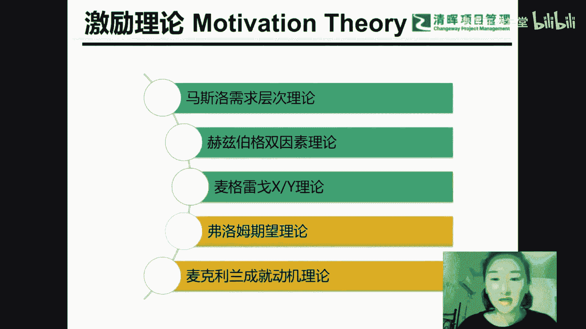

# 【PM进阶课程】如何做好进度管理 - P1：项目经理的命门：进度管理 - 清晖在线学堂 - BV1eF411y7Ec

那么首先自我介绍一下，我是爱丽丝熊岳老师，大家应该对我比较熟悉了，因为我估计轻微，每个参加偏僻考试的一些同学呢，应该都听过我的声音啊，所以对我的声音应该是非常熟悉的，我给大家讲过这个每日倾听的一个内容。

还给大家讲过这个偏僻的一个串讲，那有些同学呢可能是我的直播班和网络班的，或者是有些同学是我，上海建四面试班的一些同学啊，可能都对我比较熟悉了，那我就不多说我自己啦，那么我们今天的这个讲座的内容呢。

是进度的秘密，那么进度的秘密究竟是什么呢，搞定进度那么有多重要呢，以及项目经理如果要搞定进度，那通过什么样的方式去搞定，那么我们今天主要的直播大纲，会有这几个方面啊，首先第一个相机里的命门。

也就是在项目当中，大家觉得哪一个压力是最大的，虽然我们今天的直播内容是进度，那大家也可以撇开进度，也就是你觉得不是进度的压力最大，你也可以说其他什么内容压力是最大的，比如说范围或者是说质量还是需求。

还是干系人还是成本啊，成本你是搞不定的，成本是公司给的，发起人给的，你的老板给的，你怎么也搞不定的，整合好，有的人觉得整合的压力很大，也就是你权衡利弊，这个啊是压力最大的，还有的人呢觉得范围的压力最大。

还有的同学呢觉得需求和资源的压力最大，有的同学觉得变更的压力最大，就是需求变更的压力很大，其实你们都说的是没错的，都是对的，但是我个人感觉为什么进度的压力最大，我来解释一下啊。

因为进度当进度就是在一个截止期，什么时候一定要交付你的产品和你的工作内容，是你和客户当中所签的合同就已经约定的，就这个你不可能更改，有的同学说是需求，其实需求本质上还是进度啊，为什么啊。

那么需求是你和谁啊，需求是你从哪里来啊，来获取的，客户那里吧，客户那里获取，其实搞定进度本质上就是在搞定需求，为什么，因为进度它是范围加时间就变成了进度，那么范围本质上不就是不就是需求吗。

所以搞定需求其实本质上还是在搞定进度，需求很难搞定，因为需求可能会发生变化，而且呢范围也是会发生变化，因为范围和需求都是一样，很麻烦，特别麻烦的事情，需求和范围都很麻烦，因为它可能会发生变更。

可能会发生变化，所以搞定需求啊，搞定进度，它的前提本，它的必要条件就是要搞定范围和需求，那么压力最大的，比如说质量，那么质量有的同学也会说压力很大，那么质量你也是可以可商量的。

一般来说范围和质量我们都是可商量的，不会在这个合同当中约定定死，你是和客户是可以商量的，但是你的质量和你的范围，都是在合同当中明确规定你的内容，你的产品什么时候一定要提交，一定要交付。

所以质量和需求还有范围都是很麻烦的事情，成本是你搞不定的事情，成本是没得商量的事情，因为成本不是你决定的，又不是你出钱的，是老板出钱的，领导出钱的，那么其实我个人感觉最难的还是进度，压力最大的还是进度。

那么为什么呢，如果有一些项目不看重进度，我个人觉得就不是项目了，那为什么这么说呢，是因为我们项目本身的特点造成的，因为项目具有临时性啊，我们以前讲过，项目具有临时性，明确的开始和明确的结束。

那么这个就叫做临时性，也就意味着项目要做好进度管理，这是本身的特性，如果一个项目不看重进度，那么我可以说你做的就不是项目，你做的就只是普通的工作，只是一种日常工作，或者是说你只是在使用项目化的思维。

来做一些日常工作，所以只要是项目一定会看重进度，因为本身的特点就是临时性好，那么第二个内容呢，什么叫做进度，那为什么不叫做时间呢，其实在ping报告第五版的内容当中，我们有一个知识领域叫做时间管理。

只是在PINBOX第六版把它改成了进度管理，那么进度和时间有什么区别，范围加时间轴其实就变成了进度，也就是你该干的工作，该干的活，那么在一定时间内完成它就叫做进度，在固定的时间完成该干的工作。

所以叫做进度，所以你要搞定进度，首先搞定工作，搞定范围，那范围本质上就是需求，所以要做好进度，其实就是要搞定需求，搞定需求变更，那么一旦范围和需求确定了，那么你还要决定范围和需求谁来做呢。

并不是你项目经理一个人来做吧，要有组员来做，有团队成员来做，所以啊资源也需要你来进行搞定，那么你是在一个举证部门，也就是跨部门去合作，要在职能部门去要资源的，所以取决于项目经理的人际关系能力。

取决于项目经理要资源的能力，你要与职能经理打交道，与客户打交道啊，这些都是干系人管理的能力，所以搞定进度本质上就是要搞定资源，搞定需求，搞定范围以及搞定干系人，所以我们总结进度拖延的原因有哪些呢。

第一个范围不明确，第二个需求不明确，第三个这是客户本身定的就不合理，比方说这件事情原本就需要20天搞定，但是客户一拍脑袋觉得我十天必须让你交付，那你怎么样努力也是不可能交付的。

所以有可能这个时间就定的不合理，那么怎么样让他合理一些呢，那就得看你搞定客户，搞定干系人的一种能力了啊，那么第三个呢，进度拖延的原因也就是你的资源不卖力，就资源凭什么卖力，就凭什么帮你努力去工作。

为什么要提高效率去工作，资源为什么要帮你去工作呢，那你得有个人魅力去让他们开心，让他们起劲，让资源组员愿意帮你去工作，所以资源不卖力也可能会导致进度的一个拖延，所以我们总结了三条，第一个进度拖延的原因。

第一个本身定的不合理，你得去搞定客户，让他们拍脑袋拍的合理一些，第二个范围和需求不明确，经常发生变更，导致进度拖延，第三个资源提高效率，你才能够解决进度拖延的问题啊，所以啊最重要的压力最大的。

我个人感觉是进度，也就是项目经理最重要的一个内容，第二个呢是进度管理的本质，也就是要有资源管理，干系人管理和呃范围和需求的管理，那么既然我们要啊去搞定资源，搞定进度，搞定需求，搞定范围。

也就意味着我们向经理的全方面，能力的一个提升，所以项目经理很难做，既然项目经理很难做，就逼得我们必须去提升全方位的能力，而不仅仅是某些专业的技巧，也不仅仅是某一些管理上的技能，那么第四个呢。

我们今天还要介绍一些敏捷当中的一些，时间和的一些概念好，那么第一个是项目经理的命门，最重要的压力最大的也是进度管理，那么之前讲过，如果有一些项目它不重视进度，那么他做的根本就不是项目，为什么这么说呢。

我们还之前讲过啊，这个是偏僻当中的一个知识体系，也就是美国项目管理协会对资源，对这个项目的一个定义，他说项目是为创造独特的产品服务或成果，而进行的临时性的工作，临时性就说明有明确的开始，明确的结束。

那这个就叫做进度，也就是项目本身的特性，就是要有进度，在固定的时间内完成你该干的活，如果一个项目根本不考核你进度，无所谓进度，什么时间完成都可以，那它根本就不叫项目，或者你干的就是一些日常工作啊。

日常工作，那么这个就是啊进度的一个啊特点，项目的一个特点必须要重视它的进度，那么第二个项目啊，这进度管理就是刚才我们分析过的，进度管理就是要广泛为管啊，管需求，管资源和管干系人。

我们来看这个进度的进度计划的一个体现形式，停线形式呢我们最熟悉的就是甘特图，那么这张底下的这张甘特图呢，是我用project软件画出来的，对这个project软件感兴趣的话。

也可以再去看一下我们过去的一些讲座啊，那么这个进度计划是怎么画的呢，横坐标是时间轴，也就是这个是时间，那么纵坐标呢也就是各种任务了，各种工作啊，我们在这个project软件当中叫做任务在啊。

我们的偏僻知识体系，当中叫做活动，叫做工作，也就是把工作把你的范围放入时间轴，也就构成了我们的进度计划，所以进度第一个会受到范围的影响，也就是你要搞定范围，让你的范围明确，那么范围是怎么来的呢。

范围也就是来源于需求，需求需求是谁提的呢，是客户提的，是干系人提的，所以首先你做好的应该是干系人的管理，那么干系人怎么管呢，我们首先要识别我们要需要去啊，需要去了解你项目的水有多深，和哪些人有关系。

然后呢在了解他们的需求，但是需求很难去引导，很难去了解，而且需求也会发生变化，客户有时候自己都不知道自己为什么需要这个，为什么需要那个，他只是觉得我想要这个，我想要那个，那么你就要帮他去引导他。

去帮他梳理，让他了解你干嘛想要，如果你搞不定他，那么需求可能会发生变更，有的老板觉得一拍脑袋哇，我今天想要这个，过两天呢，一拍脑袋又说啊，我想要那个，这就是因为你没帮他梳理，你没帮他引导。

你没有搞定你的老板，所以很重要的一点叫做干系人管理，那么肝吸人管理呢我们怎么做呢，我们后面会举一个例子啊，如何进行干细管理，首先要识别人，找到你项目和哪些人有关系，然后呢再来对它进行分类。

然后呢投其所好，找到利益共同点，在与他们进行的沟通，然后再与他们打交道，好，那么我现在呢就来啊分享一个小小的这个视频，应该是一个小的短片吧，就几分钟，大家可以看看，对干洗人管理有没有什么样的帮助。

我想着你说陪领导打个球，就能成为领导身边的红人了，这不至于吧，不至于郝建，我现在拿你当自己人，我就让你看看我，马金金是怎么一步一步走到今天的，领导喜好图，我告诉你，我能清晰的说出每一位领导的喜好。

星座血型，生辰八字，这个喜欢钓鱼，我就潜到水底，往鱼钩上一条一条挂鱼，谁喜欢打麻将，我就把把拆镜给他点炮，这个喜欢文玩，我就把我太爷爷的舍利拿来给他穿串儿，这喜欢我，所以郝健身等等会等会等会。

这说到关键地方咋还给扣上了呢，唉我最想听的就是这组了，颜值啊，你现在知道我是怎么坐上这个位置的了吧，知道了，要么说你呢，说谁呢，你这个嘴呀，哎呀哎哎哎，你说我咋就这么不会聊天呢，我咋一说话就惹人生气呢。

我也纳闷了哈，我发现每次开会的时候啊，这领导就单单对你啊，又是点头，又是微笑的，难道这就因为你长得比较漂亮吗，不单单是这样，我告诉你，开会是讲究技巧，领导一发言，他刚一抛出他的观点，我马上给一个。

领导就想怎么的，你这是质疑我的意思啊，等他全说完了，我都不知道他说的是什么，马上就跟一个，我要让领导感受到我对他的话洗礼了，而且大彻大悟，最后我还和领导站到了一队，听君一席话颠覆人生观呐。

所以说耗电你不光是要陪领导打好球，你还要做到让领导只愿意跟你打，让他一想到球就想到你，一想到你，他手就痒痒啊，不就是让我树立一个欠揍的形象呗，好这个大家能稍微看见一点吗，我看有的同学说有点卡，是不是。

有点卡是不是啊，其实就是一个小的短片啊，其实就是中间穿插一个小短片，就是希望大家能对这个干洗人管理，稍微有一点帮助啊，其实肝纤管理就是投其所好，找到利益共同点，能够让别人帮你的忙。

讨别人喜欢的一种能力啊，这个就叫做干弦管理，比如说呃你要记住一些你客户的生日，或者是客户儿子的生日，客户妈妈的生日，然后呢在固定的一些假期啊，在固定的一些重要的一些日子啊。

让让他们对你留下一些重要的一些啊，重要的一些印象，那这个就是投其所好，好那么我们再来讲后面的一些内容，啊我的电脑今天有点卡啊，好刚才说了，我们进度管理本质上的就是要进行需求的管理，那么需求是什么呢。

需求是讲不清道不明的，需求可能会发生变化啊，今天要这个，明天要那个，本质上就是，因为客户连自己的东西都不知道想要什么，那么你先要去引导帮他梳理，那么你如果帮他引导梳理的话，我们使用一个什么样的工具呢。

叫做需求的分类表，那么这个需求的分类表啊，你平时做一次就可以了，你以后的项目还可以自己再用得上，比如说我这次用好了，下一次项目我直接拿个需求分类表出来，比如说你有业务的需求。

干系人的需求或者是项目的需求，功能需求，非功能需求等等，然后我就拿出需求分类表出来，看看到底需求会有哪些分类，房需求的遗漏，就是识别需求或者是记录需求的时候，那么你就拿出这张量表出来。

对它进行一个啊记录啊，这个是需求分类表，那么有了需求之后呢，就会定范围，那么什么叫范围呢，需求是指客户想要的，刚才我们不是已经引导了客户，提出了自己的想法吗，那么现在你要决定怎么做。

才能够实现客户的需求，实现客户想要的，我们该干的活，该做的工作，那么这个就叫做范围，范围，有两种，产品范围和项目范围，那么产品范围是指呃你干出的活，项目范围是指你该干的活，比如说我们到一个地方出去旅游。

那么我们的产品范围，指的就是你在旅游点买到的那些纪念品，买到的那些土特产，那么项目范围是指，你为了买到那些纪念品和那些零食，土特产，你干的活，比如说登山徒步划船，那么做的这些工作都叫做范围。

所以你该干的活，交付的产品做的一系列的工作，那么这些都叫做范围，因此呢先有需求，然后再定范围，我们要介绍一个在啊定义范围的时候，特别重要的一个工具，这个叫做WBS。

可以说在项目管理工具当中最重要的一种做法，它是最重要的一个利器，那么什么是WBS呢，工作分解结构，我们学过偏僻的同学，都应该对这个WBS非常的熟悉了，那么在这张图里面，也就是WBS当中，有的我跟客户说。

那我们来一起约定，一起来进行评审，有的我们就做，没有的我们就不做，如果有变更呢，我们就走流程，所以WPS可以给客户进行汇报，给客户进行讨论，那么在和客户讨论汇报的时候。

还能让客户一眼就能看出来我已经做了多少，还有多少没完成，正在做哪个阶段，哪些还没有开始，比如说我用不同的颜色，可以代表这个WBS是已完成还是进行中，还是没开始，比如说绿色绿色代表已完成，黄色代表进行中。

白色代表还没开始，红色代表有问题，那么一般客户和领导，他们比较关注的是什么颜色啊，是绿色，是黄色还是红色还是白色呢，一般都是红色吧，他最关心的是哪些有问题，我可以提供什么帮忙，所以他最关注的应该是红色。

那么红色就说明有问题，我需要进行进一步的讨论，所以呢WBS有什么作用呢，它是内外沟通的工具，也就是你和领导客户进行沟通汇报的时候，可以用它对它进行展示，那么还有什么作用呢。

WBS和我们平时使用的甘特图和工作列表，有什么区别呢，嗯我们工作列表是没有全局观的，而WBS可以看出全局观，也就是我大概一眼就能够看出来，我这个项目他们的包含和被包含的一个关系。

就是我大致每个阶段该干哪些活，谁包含了谁，谁包含了谁啊，这个是WBS当中的一个工具，那今天我们主要的内容不是介绍这个w vs啊，我们接着介绍的是进度，所以WPS呢我们就顺带提一下好。

我们讲完了这个WBS当中，也就是现在呃与客户打交道，搞定干系人，然后呢搞定干系人，也就意味着需求可以确定，需求确定下来，也就意味着范围能够确定，那么需求和范围确定了，也就意味着我们的工作能确定下来。

那工作并不是你一个人做的，而是你的组员，你的团队，你的资源要去做，所以呢进度什么决定了进度，还有活动资源决定进度，所以进度的流程当中有估算活动资源，但是很奇怪，并报告第六版，在第六章当中。

我们没有把估算活动资源放在第六章，放在进度流程当中，它放在的是第九章资源管理这个过程，那么为什么挪到第九章了呢，因为我们学习的时候，并不是按照实际做项目的顺序来学的，不是按照实战顺序来学，而是按照章节。

按照知识领域来学，他资源统一放在第九章资源管理当中讲，但是我们在实际做项目估算进度的时候，一定要考虑资源，因为资源不一样，所干的活的时间也是不一样的，比如说一个人干活和十个人干活，所花的时间是不一样的。

那么有些活儿是线性的关系，比如说人多力量大，又比方说呃这个一个人搬砖和五个人搬砖，时间不一样吧，人多可能力量大，但有的活不是人多力量大，比如说做开发，做研发并不是你工程师越多，你开发就会越容易啊。

不是的，它不是线性关系，因为比方说拔河，一个人和一个人拔河，两个人和两个人拔河，八个人和八个人拔河啊，八个人他的力量不一定等于八个，这个单独的个人，他的力量总和有的人偷懒，有的人效率不高。

或者有的人那他的方法错了，所以必定是人多力量大，因此呢资源资源呢决定了进度，所以我们需要搞定进度，那么如何搞定进度呢，首先啊如何搞定资源呢，首先我们应该是先估算活动资源，估算的资源。

也就是找到了这些资源之后，我们再帮助团队提高效率，那么有的同学就会说了，团队提高效率，那么应该使用什么样的方法或者是手段呢，其实资源是很难搞定的，为什么设备材料有钱就能搞定。

但是有时候人力资源非常难搞定，因为人是有情绪的，他有时候就是不想干活，或者是有时候他就觉得今天不想工作，或者是他自己有一些呃，比如说他自己小朋友的学习退步了，然后不想工作，心情不好。

或者是他今天起床的时候，就觉得天气阴沉沉的，心情不好，也不想工作，就因为各种各样的原因都会不想工作，也会因为看你这个项目经理不顺眼而不想工作，所以资源尤其是人力资源很难搞定。

那么我们如何能够提高人力资源的效率呢，有的同学又会说了，我能不能用绩效压死他，那么也就是给他打绩效分了，那么一般来说我们在偏僻的知识体系当中，不建议给他打绩效分，用KPI压死他，为什么呢，在我们第九章。

有一个工具叫做资源的认可与奖励，他这个工具不叫做资源的处罚，因为我们在举证团队当中，举证组织当中，我们是跨部门跨团队工作的，一般来说资源是只讲不罚的，我们这些资源都是借来的，如果你再去处罚他。

那人家不不给你干活了，我就回到我的职能部门当中去啊，所以一般来说我们是只讲步伐的，那么你有了这些资源之后，怎么样提高效率，让他能够更开心的起劲的愿意为你干活呢，那么你就要哄他们开心，那还有的同学就说了。

用钱不就能够哄他们开心吗，嗯但是最大的问题就在这了，钱你是搞不定的，钱不在你手上，有的公司他没有那么多的钱，或者是有的项目组钱是有限的，所以当我们能够除了有形的升职加薪，这些金钱的奖励之外。

还有什么一些内容，还有什么样的啊，一些东西能够让资源开心，让员工更愿意为你工作呢，那我们就会学习到很多激励理论，就是如何能够让别人开心，更加起劲地主动愿意为你干活，比如说你这个项目经理很有魅力。

比项目经理有独特的一些形式风格，能让这些组员愿意跟着你，让这些小兄弟能够愿意主动地跟着你干活，所以适用是以这个资源的开心为主，让他们高兴为主，哄他们高兴为主，并不是让他们开掉，干掉他们为主。

因此资源很少处罚的啊，所以这里讲了激励理论，那么我们就啊主要在偏僻的知识体系当中，介绍了很多很多激励理论，都是指没法用有形的金钱的奖励以外，我们还有一些什么内容能够哄他们开心，哄他们高兴。

比如说马斯洛的需求层次，马斯洛就认为人有五种需求，主要就看你缺失哪个需求，如果你缺的是安全需要，我就给你安全，你缺失的是尊重需要，我就给你尊重啊，他说的是人哪种缺失，缺失什么补什么，那么缺失的那个层次。

就能够激励这些组员工作动机，让他们效率更高一些，第二个呢是赫兹伯格双因素，那么赫兹伯格就说了，人也会有两种因素，两种需求，一种是叫做保健因素，一种叫做激励因素，保健因素有了也是应该的。

那么激励因素才能够激励员工工作的动机，那所以我们要搞清楚每个员工，他什么东西会受到刺激，有什么东西会激励到他们，能够让他们开心，因此你要了解你的组员，了解你的团队，那刚才我们也说了，每个人都缺钱。

但钱不是你能控制的，钱在领导手上，所以当你没法用钱，用升职加薪去吸引他们的时候，你还有哪些东西能够激励他们，让他们能够开心听你的话呢，所以我们的话题在这个地方，所以不要每次都说工资加钱啊。

用KPI去压死他啊，不要讲这些，因为有些内容我们没有办法去决定的，所以对于那些我们改变不了的，你就不要再去抱怨他，对于我们那些能够改变，能够改善。

能够优化的问题。