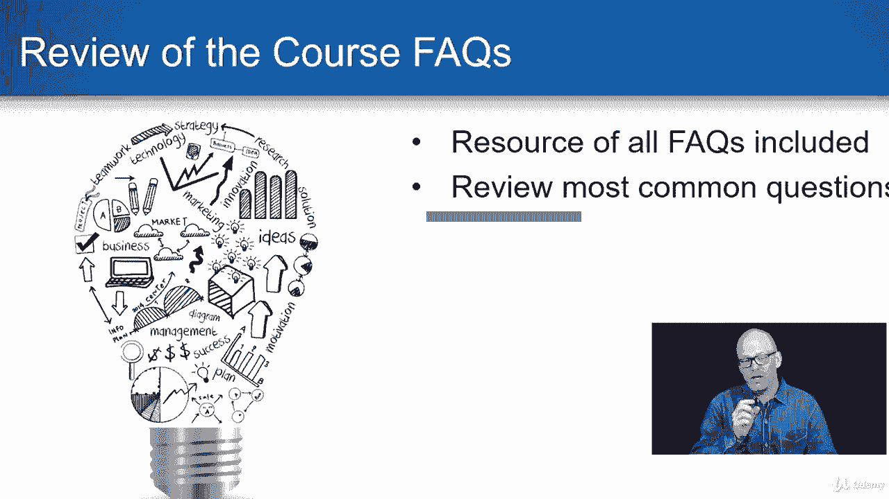
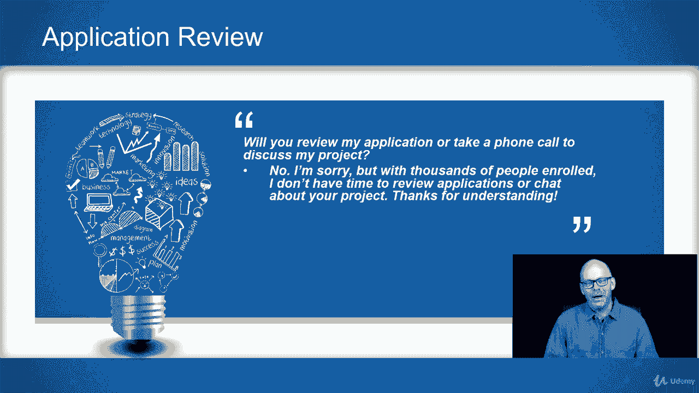

# 【Udemy】项目管理师应试 PMP Exam Prep Seminar-PMBOK Guide 6  286集【英语】 - P10：2. Frequently Asked Questions - servemeee - BV1J4411M7R6

在这节课中，我想和大家分享一些常见的常见问题，所以我要走过这些，如果你有其他问题，使用我们在前面的课程中看到的Q，你可以上去发个问题，然后变成这个，我们会在整个课程中做出适当的回应，所有的权利。

所以让我们在这里谈谈一些Q，我只想和你分享最常见的，资源，我包括一个FAQ文档，会经常更新，所以随着更多类似的问题进来，显然需要一些澄清，以便您可以检查资源中的当前常见问题解答。

申请详情，我收到很多关于P P申请的问题，所以人们想知道，他们是否必须完成这门课程才能完成申请，您可以启动应用程序，但是如果你在你的三个五个小时的接触中需要这门课，你需要完成整个课程。

然后你可以要求三个五个接触小时，所以要注意，你可以启动它并保存它，喜欢应用程序，你之前做的作业，然后你可以去更新它并提交给PMI，如果你还不是P和P，那么你的联系时间需要这门课程，这是你要完成的课程。

您不能输入将来的日期，就像下周要做的那样，你得等到下周才能做完，我还得到一些关于PDUS和接触时间的问题，所以PDUS是专业的开发单位，你在，你是P和P，你成为PP之前的联系时间，这门课程是联系时间是。

这就是你想要的，如果你还不是pp，我有很多问题，很多关于结业证书的问题，是呀，你会收到结业证书，这件事我再清楚不过了，你将收到的结业证书上有指示点，上面有COM有限责任公司的标志。

上面有PMI注册教育提供商的标志，你在课程结束时得到这个，你会看到有一个讲座，本课程的下一节课有一个网络链接，你要去哪里填写表格，你将证明你已经完成了整个课程，然后输入您的姓名和完成日期。

然后你可以下载PDF格式的，这是你给PMI的证明，如果你被审计，你不给PMI证书，当你递交申请时，他们不想要，在你被审计之前，他们不想要它，所以作为我们采购经理人指数的一部分，有一些真实和诚实。

你在申请中诚实的道德准则和专业行为，但你有可能被审计，如果你被审计，这是你要给PMI的证书，我们是注册教育提供者吗，是呀，我们是我的公司指导网络，LLC，我们是一家PMI注册教育提供商，第四名，零八二。

你可以跳到PM的继续认证注册表，它是CC r s PMI组织，你可以搜索指导点com，看看我们所有的课程和证书等等，包括PMI作为年度周期的一部分审查的这一类别，我们成为注册教育提供者的三年周期。

这是首相网站上的，你在屏幕上看到的是的，我们是一家PMI注册教育提供商，这门课被接受，另一个问题，你会审查我的申请吗，或者打个电话讨论我的项目，否，对不起。

我不能和成千上万的人一起上这门课和我的其他课程，只是不可能，我知道你说好，可能只需要五分钟或半小时，但如果我给每个人五分钟或半小时，我将无法支持这些课程或创建新的课程，我教直播课，我经常旅行，我在写。

所以我只是没有时间承担额外的努力，所以我很抱歉，我不能，但真的，如果你遵循我们在课程中讨论的内容，你的应用程序非常简洁，你会没事的，但是但是谢谢你的理解，但我不能做申请审查。

我只是我只是身体上，不能，一天中没有足够的时间，所有的权利，这又是最大的常见问题，你可以去资源，看看本课程开始后我们更新的所有其他内容，这些常见问题解答是基于其他PMP考试准备，我做了这么多年。

所以这些是最常见的问题，如果您有FAQ文档中没有的问题，或者这里没有地址，使用问答功能，这样其他人也可以看到，你也可以搜索Q和一个功能，因为有人可能有和你一样的问题，所以你可以去看看，所有的权利。

勇往直前。

