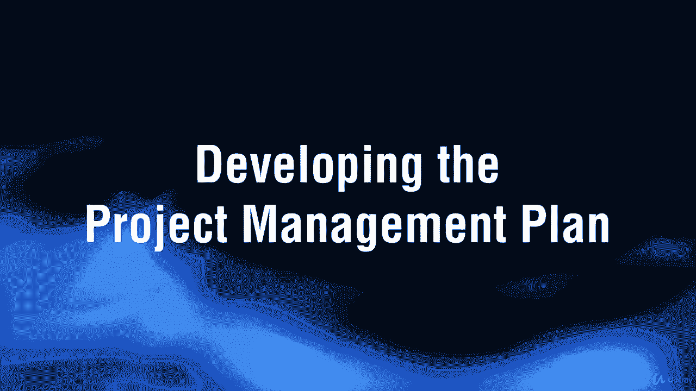
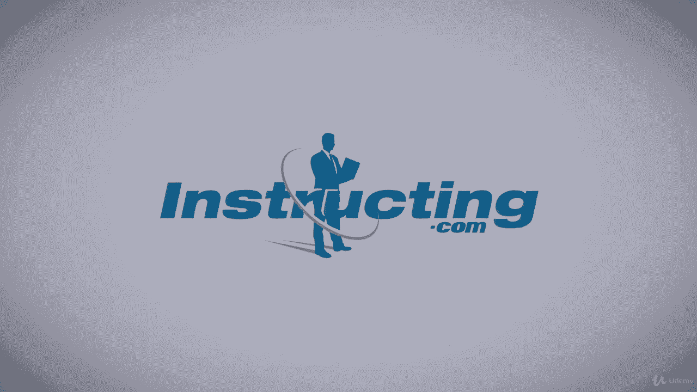

# 【Udemy】项目管理师应试 PMP Exam Prep Seminar-PMBOK Guide 6  286集【英语】 - P102：8. Developing the Project Management Plan - servemeee - BV1J4411M7R6

嗯。

Okay， we're still hanging out in project integration management。

 We have completed initiation as far as this knowledge area goes。

 and now we're going to go into planning。 So we're still in project integration management moving into planning Our process here is to develop the project management plan。

 One thing to be really clear about when it comes to developing the project management plan is this is an ongoing iterative activity on day one。

 you won't have a whole lot of information to plan from But as you go out and talk to customers and stakeholders and you examine requirements and you work with your team。

 You get some clarity。 This is part of progressive elaboration。 Remember。

 I'm going to build a house for you。 Well what kind of house。

 Tell me about the kitchen all the way down to what type of pools do you want of that cabinet door。

 So that's progressive elaboration。 As I know more information。😊，I can plan in more detail。

Let's look at the Es to develop the project management plan。 You have the project charter。

You get outputs from other processes that's a great example what I was just talking about day one。

 we're not going to have a lot of outputs from other processes as I go out and I do more and more processes that allows me to plan in more detail and then EEF and OPA。

Tools and techniques， expert judgment。Data gathering， so things like brainstorming using checklists。

 focus groups and interviews。There's our interpersonal and team skills because you're going to have conflict management。

 you have to do facilitation and meeting management， and of course we're going to have meetings。

The only output of developing the project management plan is the project management plan。

So what goes into the plan or why do we have a plan well the project management plan is a document that's fluid meaning it can be updated throughout the project。

It defines how will the project be executed， how will you monitor and control the project。

 and then how will you close out the different phases in the end of the project。

 so it's really a guide it's our prediction of what we're going to do。

As we move through the course you're going to see every knowledge area gets at least one plan。

 so those plans for each knowledge areas are part of this project management plan。

 they're part of this master plan， if you will， but we just call it the project management plan。

 they're called subsidiary plans that are specific to that knowledge area。So for example。

 in the next chapter， we're going to see we have a scope management plan and then we have a schedule management plan and a cost management plan and so on。

 those are subsidiary plans that are part of the project management plan。Once we have a plan created。

 once we have this project management plan created， what we want to do is to create a baseline。

 a baseline is kind of a capture of our intent today， so this is what we say we're going to do。

 this is locked in， we have approval and agreement on this plan。After we've got a baseline。

 if there are new changes or new additions to the project or any part of that plan wants to be changed。

 then we have to do change control。very important， so we have a project plan and a piece of paper。

Could be in Microsoft project or premeviera or Microsoft Word， but somewhere you have the plan。

 you've got a document here。When management approves it and we're all in agreement。

 this is what we are going to do any change to that plan requires a change request。

 very important to know that we're going to see that throughout the course。

 we're going to see that when the plan needs to be updated， you get a change request。

So what's the purpose of the plan， as I just mentioned it communicates our intent。

 it says why are we doing these activities？It serves as a guide for the project manager。

 It helps refresh memories。 It helps to direct and steer， gives us some structure。😊。

It documents our intent and it gives us a baseline。 We get baseline for the project。 remember。

 once you have a baseline after that， you have to do a change request if you want to change the plan。

Who contributes to the plan， not just the project manager， we have a lot of different participants。

 yes， the project manager， you have the project team because they're the people closest to the work。

 they're going to be able to help with the time， the estimating the schedule， risk assessment。

 things like that。Customers can be involved because they set things like objectives and key requirements。

 they can also have a lot of influence on your budget and your schedule。

Management's involve because they need approval， so they're going to direct us on things like the budget。

 the resources you can use， what's your PM methodology。

What's the quality requirements and then as I mentioned， they have approval on the plan。

When it comes to planning there is a skill set that we need to have as a PM。

 be familiar with these for your exam， so we need to be able to tailor some processes and we'll talk about tailoring in each knowledge area。

I want to be able to develop additional components， so those subsidiary plans。

 and there'll be some documents as well。I have to be able to determine which tools and techniques are most appropriate for the project。

What about technical and management details so like my project team， subject matter experts。

 so I need to understand the technology and then the management of that technology。

What resources and skills are needed？What level of configuration management is appropriate？

Configuration management is all about documenting and controlling the features and functions of the product scope。

What project documents have to go through formal change control so this is an important part as well we talked about that baseline so also in the project we'll create baseline for our scope for our schedule for our budget but you might have some other things in there so you might have like even the risk register you might have the stakeholder register that are baseline meaning that they're kind of locked in and if there's going to change there's a process to change those you have to follow。

So we'll see formal change control the big one of course， is scope and schedule and cost。

 some of those others may be a little bit more relaxed when it comes to change control。

And then prioritizing work， what's most important down to least important。

 so what should you focus on when it comes to project success？

In project planning we're going to do some data gathering， so brainstorming。

 we're going to use some checklist， remember those focus groups we talked about with the charter so we can do focus groups here for data gathering for planning and interviews。

 you got to get out and talk to people。You will have meetings。

 we do a lot of meetings in project management。So we want to discuss the project approach。

 how are we going to go about planning so a methodology for planning or exactly what needs to be planned and then we want to document things so we think about writing this up on a whiteboard taking photos of plans。

 making sure someone's keeping the minutes， so document what happens in the meeting and then of course we follow up with the minutes and action items very important to do that。

A kickoff meeting kickoff meetings are a real signal that we're done with planning and now we go into execution now I know some of you out there do a kickoff meeting way back as soon as the charter is done and I've been an organization that that's just the way we do it。

For your exam and in the Pimbaok guide the kickoff meeting is after the project plan is approved it's not when the charter is approved after the plan is approved。

 we do the kickoff meeting the kickoff meeting is a way to get everyone together。

 kind of get them excited， get some buy in here and really communicate what we aim to do and then we go around the room and we talk about the different stakeholders and what their roles and responsibilities are that everybody's clear everybody hears the same message about roles and responsibilities and what we're trying to do in this project。

Kickoff meetings and project size。 All right， so there is a little flex here when it comes to how formal this kickoff meeting needs to be a small project。

 you know， planning and execution。Our overlap pretty quickly in a smaller project。

 so the kickoff could occur after initiation in planning。 So I know I just said， you know。

 typically I've been in organizations where we have the charter and then we go into initiation。

 but a smaller project， I may not have to be so formal， so it could be。In the planning process。

 we kick it off now let's get to work。Larger projects， the project team does the planning。

And then the team is brought on when initial planning is complete。

 So what I'm saying here is you may have a project management team。

So like the PMO or a group of executives and business analysts that they plan everything out。

 so I work with the project manager， I work with business analysts。

 I work with these executives and the PMO and we plan out the whole project and then we bring on the project team and tell them this is our plan and how we're going to do it。

So you could imagine。You're building a house and you've got framers。

 the framers don't need to be there in the planning necessarily， so the project manager。

 you know the architect， the professional engineer and whomever they may create the plan why the framers are out working on another job right now so we have the plan created then we meet with the framers and we say this is what we're going to create this is what you're going to do so at a larger project the PM team。

 the project management team could do the planning。Now multiphase project。

 a really large multiphase project， you could do a kickoff at the start of each phase。

 so those are some things that could happen with kickoff meetings。

Let's look at what's in a typical project management plan。

 we've got a lot of things here in the project management plan。The scope management plan。

 How will you define the scope and develop it， Mon and control it and do scope validation。

 We'll see that plan in Chapter 5 in the Pimmbok。 The requirements management plan。

 How will you gather requirements， How will they be documented and managed。 Also。

 Chapter 5 in the Pimmbok。Schedule management plan。

 So how are you going to define and control the schedule， so that's chapter 6 in the Pimba guide。

Cost management plan。 How will cost be planned， structured， estimated， controlled。

 That's Chapter 7 of the Pibook。 The quality management plan。

 So how will this project adhere to our quality policies。

 What methodologies do you do for quality assurance and quality control And how are you going to implement those。

 And， of course， quality is Chaer 8 in the Pibaok。Resource management。

 so how will resources be categorized， how you get them on your team， how will you manage them。

 how will you release resources， remember resources are people， materials， tools， equipment。

 things like that， not only people so we have physical resources and that's chapter9 in the pinmbaok。

Communications Cha 10， our communications management plan。

 so how will you create the information and distribute it？How will it be disseminated。

 Who has rights to it？ So basically， you're saying who needs what information， When do they need it。

 What modality， How will you secure it， How will you archive and retrieve it？

 So that's all in Chapter 10 of the Pimbaok。Risk chapterpt 11， so how will you identify risk。

 how will you analyze risk， how will you create risk responses and track those risks。

Procurement management plan。Chapter 12 in the Pimbaok so how you acquire goods and services so what are you allowed to do a lot of enterprise environmental factors here when it comes to procurement and then also how will you do contract administration。

And the last thing that we see here in chapter 13 as far as the Pimbaok goes is stakeholder engagement plan。

 so how will you engage stakeholders and then improve their engagement or maintain their engagement so these are the typical parts of the project management plan。

Your project plan will also include some baseline。 remember a baseline is kind of a snapshot of where we are right now。

 so some baselines that we need to know we have a scope baseline。

 a scope baseline is really three different documents， so we have the scope statement。

 the work breakdown structure and the WBS dictionary and we'll really dive into that in the next section when we talk about scope management。

Then we have the schedule baseline， the schedule baseline is just our schedule model。

 it's what where we say this is how we get from the start all the way to the end。

So this is the flow of the work and how we get all these activities done to hit this target end date。

 so that's our schedule baseline。The cost baseline is a time phase project budget。

 so it's basically saying here's how much the project will cost to get from the start all the way to the end。

 but this is when you can expect to spend the monies to get to the end so it's not just 180，000。

 it would say this is how much you're going to spend for phase one。

 this is how much you'll spend for phase two， phase three， all the way to the end。

 which will equal $180，000， that's a cost baseline。Some other items that go into our project plan。

 we have a change management plan， so how are changes allowed and controlled。

 the configuration management plan， how will we control， document， review。

 and allow changes to the product scope， the features and functions of what we're delivering in this project？

The performance measurement baseline is really the three scope schedule and cost to show overall project performance。

 the performance measurement baseline。You also have a description of the project lifecycle。

 are you doing a predictive life cyclee where upfront you plan everything and these are the known phases or are you doing an adaptive life cyclee where you're using iterative or incremental or scrum or XP。

 so what's the process look like for that type of a life cycle？The development approach again。

 so describe your development approach with predictive， iterative， agile or some hybrid method。

Management reviews at what point throughout the project will management look at and review progress？

Project documents。 Okay， I'm not going to read all these to you。 That doesn't do you any good。

 but you can see there are a lot of project documents As we move through the course。

 we're going to see all of these。 So each knowledge area will create some project document。

 So just go ahead and。Think of any knowledge area。 Think of quality。 Well if you skim over this。

 you're going to see， okay， there are some documents related to quality。 Let's think about resources。

 So if you look， there's a resource breakdown structure and calendars and requirements。

 Every knowledge area， Chapters 4， the Pembaok guide， all the way to Chapter 13， the pembaok guide。

Create project documents。So you will need to know these， but it's really not just memorization。

 you're going to need to know how to apply them and what they're used for so they are part of the project management plan。

 but really it's about using those at the right place in the right time we're going to see as we go into each knowledge area。

 those EOs we'll be using different project documents Often we'll see as an output we'll see project document updates。

 so this is what we're updating the relevant project documents。🤢，All right。

 good job that was all about the project plan， keep moving forward， I'll see you in the next lecture。

