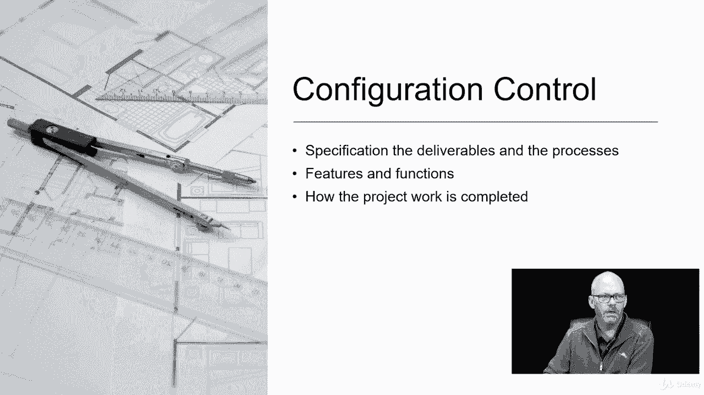

# 【Udemy】项目管理师应试 PMP Exam Prep Seminar-PMBOK Guide 6  286集【英语】 - P110：16. Performing Integrated Change Control - servemeee - BV1J4411M7R6

Performing integrated change control。Is probably the most important process。In this chapter。

 I'll say it's really up there， maybe the charter is the most important。

 but this is the one you're going to be working with probably the most as a project manager。

Perform integrated change control is all about when a change is introduced。

 it's how is that change managed and then how is it approved， so integrated change control。

 we're going to look at the whole flow of changes to approval being deferred or decline need to know this for your exam。

Let's look at the inputs first off， the EO， so inputs， we have the PM plan。

 you're going to look at your cost management plan， the configuration management plan。

 the scope baseline， schedule and cost baseline。The different project documents you'll need。

 your basis of estimates。 So cost time。Requirements， traceability matrix。The risk report。

Work performance reports， and then of course， the change request and EEF because there might be some rules or policies at OPA because you might have historical information。

Tools and techniques that do integrated change control， expert judgment。

 that's the primary tool and technique here。You're going to use some change control tools。

Data analysis， alternative analysis and cost benefits analysis。And then decision making。

 you can do voting， there's an autocratic decision making， multi criteria analysis， and meetings。

The outputs， you have the approved change request。You have PM plan updates， project document updates。

 and the change log。Integrated change control happens throughout the project。

 You're going to do integrated change control throughout the project as soon as the project is created the charter site off on integratedrated change control can come into play。

It's the responsibility of the project manager so you own integrated change control。

Anytime we have a baseline， so our scope， our schedule， our cost， our project management plan。

 anytime we have a baseline， if you want to change it， you have to do integrated change control。

Integrated change control examines the effect of the change on the entire project。

You can have verbal change request。But they should be documented。

If the CEO comes to you and they say， I want to change X，Y，Z in your project。You don't say sorry。

 It's not documented。 You can't do it。 You would take that change request， write it down。

 confirm it's correct， and then it would enter the change control system。

 So a verbal change request could happen， but it's really not recommended。

Integrated change request is all about capturing the change and then seeing what effect does this have on the project as a whole。

 So when a change is captured when it's documented， it enters the change control processes。

 the change management system， which is technically integrated change control。

 that's technically what it's called。The configuration management system is also involved because if there are changes to the features and functions like the blueprints or the house。

 we're going to move that wall to feet， that's obviously a feature in function that's being changed。

 so configuration management is involved。Changes are approved， they can be deferred till later。

 or they could simply be rejected。The change approval level is defined in the project plan。

What this means is part of your plan， particularly in scope management and cost and schedule。

 you could have a threshold for any change above that threshold is automatically rejected。

So for example， any change that would cost more than 10，000 that is rejected。

 any change that would take longer than two weeks， that's rejected。

Any change that would require a new permit is rejected。 So those are all change approval levels。

 In addition， you could say that those types of changes。

 the project manager can't make that decision。 That has to go to the sponsor or。

A change control board。 A change control board would look at certain types of changes or in some projects that could be all changes。

 and they would make the determination。 I this change allowed or should this change be rejected。

 So the change control board is typically a group of executives or key stakeholders。

 and they do the change approval， Deferment or rejection。And then as I mentioned。

 you have this concept of over under approval rejections。Let's look at change request as outputs。

So processes can create change requests， so a process could tell you this is a change that needs to happen based on poor quality。

 based on we're late or we're overrunning on time。Corrective and preventive actions a defect repair could be change request。

 typically they are and then any update to a formally controlled document baselines that those are always going to need a change request but in your organization you could say the stakeholder register is set so if there are any new stakeholders we're going to change that that has to go through change control or you could say that the contract is set or the agreement you have with another department in your company is set so any changes to those types of documents could require a change request。

Configuration control， like the blueprints we talked about earlier are any changes to the features and functions must go through configuration control this defines how the project works completed。

 so it has to be exact， it has to be an agreement because it's all about the deliverables that are being changed。

Generally， whenever you change the scope of a project， you need configuration control。

 the configuration management system。

Three terms you'd either know with configuration control， we have identification。

 status accounting and verification and auditing Ident is just the documentation of all of the components of the deliverable of the product。

Status accounting is a documentation about the product information。

 so give me the metrics and the specs on these different deliverables。

 and that's what we're going to measure against， that it's of quality that it's accepted and it's really what the customer will inspect against。

And then we have verification and auditing is are the features and functions I should say。

 are they performing as planned and what about the functional attributes are the functional attributes of quality are they acceptable will the customer sign off on it because we have met the requirements so that's configuration control identification。

 status and accounting， verification and an audit and auditing。

Managing project change right so it's still an integrated change control。

 we're talking about changes to the documents we've already talked about。

 but there's some other things here we need to address unapproved changes so an unapproved change can be things like you have a developer and they're going to add a field or they're going to add a button or a little tool they think is really nifty for the piece of software。

 but it wasn't in the original plan It wasn't in the requirements， so that's an unapproved change。

It happened， but we didn't approve it， so we need to deal with that unapproved change now。

Unapproved changes， we're also talking about changes that change request that goes through the process and then it's rejected just because it's rejected doesn't mean we throw it away。

 we put it in the change log， we document it， we also communicate why it was rejected and our condolences for that rejection。

Maybe maybe not， but you document it and you tell people why you just don't keep people wondering。

 well why didn't my change request get approved and why was it declined and we documented in the change log because when we get to scope validation。

The customer does an inspection at scope validation。 And they say， hey， where's that。

 where's that button， Where's that feel they asked for。

 You've got it the change log that it was already declined。

 It's been communicated that it was rejected。Scope creep is really important。

 Scope creep are these tiny little changes that bypass the change control system。

 So Spe creep is where you have a developer adding those little features just because they think they're cool or you have a stakeholder going to that developer and saying hey。

 I know you're working at this， but could you add a print button and could you do a saved a P feature and can you make this go to my phone。

 And so yeah， sure， I can make that happen and they work their magic。

 That's scope creep where it's bypassing our defined change control。

 And it's consider project poison because this is our scope right， let's say this is our scope Well。

 when that developer creating things that are not in scope， all this you know business over here。

 it's bypass change， we're not paying for that time。

We're paying for time for things that are in scope， so things that are out of scope。

 you're robbing time and money from what was approved。

 so you're creating things that aren't part of the project。

 but you're billing it to the project that is scopepe creep， project poison。

Gold plating is really bad Gold plating is where you get to the end of the project and let's say you have $125000 left in the project。

Well， a couple things here you might be thinking is， hey， I've got all this extra money。

 let's go add these cool features that you know we're really the stakeholders going to love。Okay。

 that might be good in theory， but the stakeholder might be able to use that money。

 which isn't yours， use that money somewhere else in the organization。

 they might have a project over here that's bleeding cash and they need that money to save this other project。

Or they want exactly what was requested。 They don't want all this other stuff。

 They want exactly what was requested。 So they might be really eager for the thing that you're creating。

 And then you you're taking time and money on things that were not in scope。

 So that's considered goal plaing。 It's like you're dipping things in gold just to spend the money。

 doesn't necessarily make it better。Track changes is a way that when a change is requested and approved。

 it has to get into the project plan。 It has to be executed。 It has to be verified。

 a good example of track changes here is defect repair。 remember defect repair。

 those tiles weren't installed properly。 So we have to do it over。 So we paid to do the work wrong。

 we paid for that waste of materials。 Now we have defect repair。 We got to pay for it again。

 we've got the time again。 So defect repair validation is where I have to go out and confirm that it's of quality and that it is in scope。

Let's look at the entire integrated change control workflow， so a lot of stuff happening here。

 but this is the big picture， know this for your exam。A change request comes in。

 it's the first column here in blueop， a change request comes in， Change generally come from scope。

 cost， schedule， procurement， but you might have corrective action， preventive actions， policies。

 procedures， or resources that need to be changed so but it's from the most likely to the least likely okay。

Well， when a change comes in， if it's a scope change or changing features or functions。

 it will go into configuration management。And into a change management。

 if it doesn't touch features or functions， it's just going to go into change management。

Recall configuration management is all about documenting and controlling changes to features and functions of the product。

 so generally scope are going into configuration management。Everything， including scope。

 that's a change request， will go through the change management system。

The change management system then will determine how that change is managed。

So the change management system will say。Is this need to go onto the change control board if one exists。

 is this beyond our threshold so the change is rejected， so what do we do with this change？

Most likely， the change is going to go right into integrated change control。

Integrated change control will examine each change， and they will say。

 what effect does this change have in the remainder of the project？

So the customer wants to move that wall in the kitchen over 2 feet。 We've already framed it out。

 So let's look at the changes that could happen here。 What would it do to our scope。

 Definitely a scope change。It's going to take more time。 It's going to take more money。

Could be a quality issue because now the living room is different。

 it doesn't match up with the other walls in the living room。Resources are needed。

 I have to talk to the architect and the engineer and the draftsman and might need some more permits。

 So resources， communications， I have to talk to all those people。 Oh， back to resources。

 Don't forget， you have to buy the material to frame the wall in the new spot。

Could introduce some risk， there's some electrical issues that happen there。

 there might be a risk of a delay because we have to get approval on these permits to move the wall。

Procurement could happen。 You have to buy new stuff。 You have to hire the electrician again。

 You have to pay for the architect's time。 so procurement could be an issue。

 And obviously stakeholders， there's a lot of stakeholders involved there。

 all those different resources， human resources， the customer， the project team， the inspector。

 so a lot of stakeholders are involved。So integrated change control happens。

From integrated change control or through the change control board。

 we're going to have one of these four items over here on the right， These one on the green。

 So what's going to come out of it will be。The change will be approved， decline or deferred， Def。

 meaning， well， not now， maybe later。 Sometimes that's a nice way of saying no。

The PM plan could be updated if it's approved。 you've got to change to your scope。

 there's lots of things that are going to be updated in your project management plan。

You may have to update project documents like your scope and requirements documents could be the risk register。

 stakeholder register， your schedule， your cost， so lots of project documents could be updated。

Regardless of if it a change is approved， deferred or rejected。

 it will be updated in the change log because you want a history of the outcome。

Be very familiar with this for your exam。 I guarantee you you're going to see questions about integrated change control。

Sometimes an integrated change control。The change control board or the project team or a group of stakeholders in SMmes need to get together and vote on should we do this change So when it comes to voting。

 you can be unanimous， you can have the majority or you could go at the plurality and recall the plurality is we're talking about the biggest block is who gets the decision So you could have a change request and you could have no yes def。

 and if there's more peoples say with no10 people say no and 15 people say yes， and then you have。

 you know maybe 30 people that are voting， they say let's just wait till later， they defer it。

 the decision will be to defer it even though there's you know yes and no over here that's like they don't count Autocratic is one person decide So yes or no。

 we're not doing it。 We will be doing it。Multi criteria decision analysis we're going to see this a lot This is just a real fun way of saying you consider every factor for making a decision so multi criteria there's a lot different criteria。

 time cost scope， what resources， those are different criteria that you would look at。

So should we do this or not， So it's a decision matrix a lot of times it's predefined where you can say we have to look at how big of a scope。

 how much will it cost， how much time does it introduce risk and what's quality just for example。

 it doesn't have to be that every time My point being it' you have lots of factors to consider so you kind of package them up you see these are the most important that will weigh this change request against to make a decision if we should approve this change or not。

Al right， lot of information here on integrated change control。

 really know this material for your exam。 Very important。

 Probably our most important process in this chapter。

