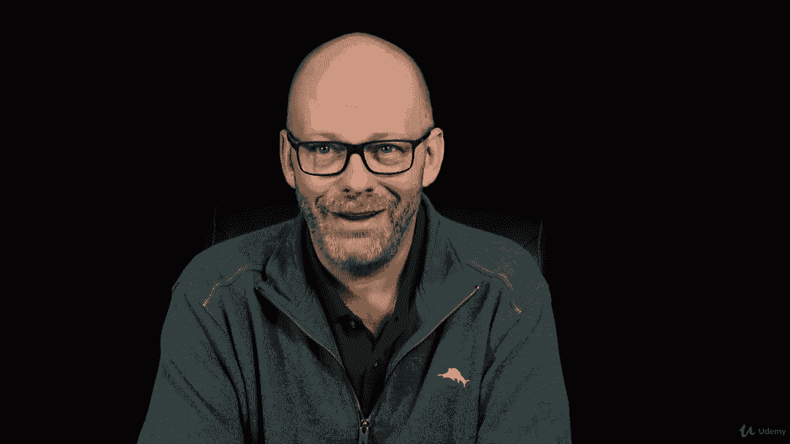
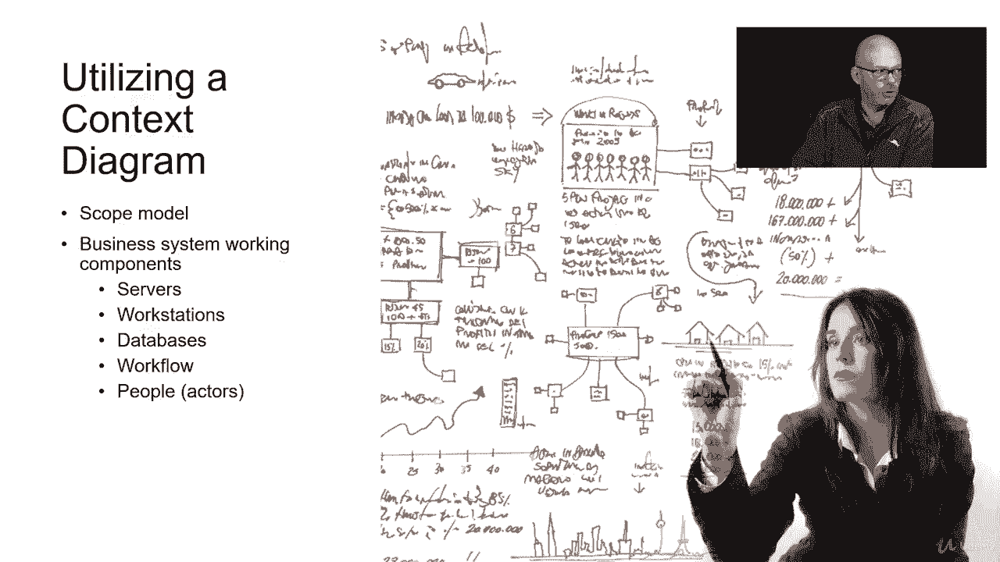

# 【Udemy】项目管理师应试 PMP Exam Prep Seminar-PMBOK Guide 6  286集【英语】 - P119：6. Collecting the Project Requirements - servemeee - BV1J4411M7R6

It's important to collect the project requirements because that tells you what you have to create in your project。

So this is a project management process which is collecting project requirements it's how do you determine document and manage requirements throughout your project Now you may be doing this as the project manager you might also be doing this with a business analyst so collecting the project requirements help you define the project scope and the project scope。

Typically in a predictive environment， we're collecting requirements up front。

 you might be collecting requirements at each phase， or if you're in an adaptive environment。

 those requirements are going to fluctuate based on the product backlog。

Let's check out the EOs for collecting project requirements。

Our inputs the charter because that's our high levelve requirements， someplace to start。

 The project management plan We't need the scope management plan， requirements management plan。

 our stakeholder engagement plan。 Project documents， the assumption log， lessons learned register。

 stakeholder register All of that business was helping us to gather requirements。

 So these are places that we would look that we're going to get requirements from。

 same with our business case。 remember the business case defines business value and how does this project meet business value。

 That's a good place to look for requirements。And then EEF and OPA， as always。

 we see that over and over。Lots of tools and techniques to gather requirements。Expert judgment。

Data gathering， we're going to do things like brainstorming interviews， focus groups。

 doing surveys and benchmarking new term for you will see coming up。Data analysis。

Look at your documents， look at all the documents you have so far that's a great place to collect requirements。

Doing some decision making with voting， multi criteria analysis。

Data representation are a way of making charts or visualizations of our requirements。

 so affinity diagrams， mind maps， having some interpersonal and team skills。

 the nominal group technique， observation and conversation， facilitation。

 using a context diagram and prototypes， and don't worry we're going to see that business coming up in detail。

The outputs of collecting requirements will be the requirements documentation and that Re traceability matrix。

One of the best tools and techniques for gathering requirements is to do interviews with stakeholders。

 so you use the stakeholder register because that identifies who our stakeholders are and we'll do a one to one conversation。

 it could be a one to many where it's you and three or four stakeholders or many to many where it's you and your project team and three or four stakeholders and you all are talking about the requirements。

 so asking questions and really understanding and learning about the requirements。

A focus group is a moderated event， we're going have six to 12 people。

 we have that neutral moderator that will come in and kind of facilitate the conversation so it's not leading participants to a solution。

One thing that we want to consider with requirements and focus groups is what's the participant composition？

If we are doing a new project and we're gathering requirements。

 do we only bring in participants from the sales group and then only participants from marketing and then only people from manufacturing and then only IT so we kind of isolate these groups of stakeholders to ask them specific questions about their area。

Or do we mix and match， we bring in people from all of these groups， mash them all up together。

 and then they can interact with one another， so that's the idea of participant composition。

 like who should be involved in this and what's the distribution of stakeholders。Of course。

 you can do questionnaires and surveys， you know， use Webmonkey or some survey tool or whatever you want to create surveys that are fast。

 especially when you have a lot of stakeholders， allows you to ca up results or people are distributed around the world。

Not anything shaing there， right？Benchmarking the requirements is when we compare two or more systems or solutions or even businesses。

 so I want to compare agile to SQL， or I've got soundproofing material for this house。

 so I want to do some tests I' want to build a booth and test the decibels of one and the other。

 so I'm benchmarking where I'm setting my requirements based on an external basis for performance。

So the how well they perform tells me how well this material should be in my project and that's the one I'm going to select。

And then comparing organizations， so I can look how did they do it in IT。

 that's how we can do it here in manufacturing， or how did a public company do it and there's an article we read or a white paper and that will set some goals for how we can do it in our organization。

One of the best places to begin gathering requirements is through documentation。

 all of those brochures and proposals and blueprints and those early specs that you have。

 that's great places to do requirements identification， so analyze project documents。

When you have all those folks together and they're going to vote on requirements。

 you can do group decisions， remember unanimous， the majority， more than 50%， that's the way we go。

 the plurality， the largest block agrees。So you might have0100 people and you have 40 people are in favor of。

Requirement A。And then 30 people are in favor of requirement B and then you know maybe there's 20 people and some people didn't vote or they're just mad and they don't want to participate so you get some other people down here they want a requirement A there's more people against。

What the largest block is for， so that's plurality so even though more people may be not in agreement with what's wanted。

 this is the group that wins because they're the largest block when there's multiple choices and then dictatorship。

 one person decides。Multi criteria analysis， we've seen this a couple of times already。

 and we're going to see it some more。 It's just where I have different factors to rank or prioritize or even eliminate project criteria so we could say things like performance metrics in our testing what risk were introduced just the requirements themselves based on priority and the amount of time and money we have。

 So this is a decision matrix， this little table down here where we can give different scores and then you know do some math here as to how many points you get and then from that we would choose the requirements that have the most points or any requirements you know above 50 points or whatever。

But that's a multi criteria analysis， a decision matrix to measure and score。

An affinity diagram is is very similar to brainstorming。

 but what we do is we group ideas into these different clusters so we could say， all right。

 we want to do a project with social social networking so on Facebook basically we want to have some little tips and tricks and create some publicity about our project so we could say。

 well， what are some different ideas that we can do and how does that help our project and how does that help communication And then as we brainstorm we。

Put little postlet notes up into these different ideas。 so it's an affinity。

 affinity like ideas like minded that those go into these different categories。

 So with requirements gathering it's a way to decompose and to organize your different ideas。

 So in I we can always say you have hardware software data network。

 So it's going to fit into one of those four。And then as we brainstorm， we would focus on hardware。

 software， network and data。Mind mapping is kind of fun to do it's a way of when you're trying to generate ideas or brainstorm ideas you just kind of draw it out as you can see in this picture here one thing leads to another to another to another so it's a way to visualize the brainstorming process and it's a way to generate new ideas and to consolidate ideas and you've got a lot of people participating you can have all these crazy branches and how do they touch each other and it's just a way to visualize ideas。

A term that we saw one of our tools and techniques was the nominal group technique。

 There's five steps here for the nominal group technique。First off， you want to generate ideas。

 you kind of brainstorm ideas， and then you vote and you'll rank these ideas。

Then each participant will brainstorm the problem or opportunity with their ideas so everyone does this on their own。

And then the facilitator will add each person's ideas on a whiteboard。

And then you talk about each idea so everyone has a clear understanding and then you will privately vote on each idea from one to five and then you whoever gets the most points。

 you can reprioritize and start the process over or that'll be the requirements you go with So there is a sense of anonymous here as to do I like the idea or do I hate the idea。

 even though it's my boss， he gets a one so it's a nominal group technique is a way of having these rounds of voting and brainstorming on ideas。

Larger projects， you might do a facilitated workshop and I say larger projects because generally you leave。

 you go off site somewhere and you're going to spend two or three days and you're just going to dig in and just hammer out all of the requirements that are unavailable for that time。

So in IT you might call it a joint application design， that's a software development。

 so SMmes and the developers meet and they just hammer out the requirements。

 but it's a long process it's a workshop could be facilitated by a neutral moderator。

 probably have a very intense outline to follow or an agenda to follow。

In manufacturing you might have a similar approach called the quality function deployment。

 It's also known as the voice of the customer and this is a workshop typically in manufacturing where you identify these characteristics and then you prioritize them based on what the customers are saying they want and so that's used for product development。

In an agile environment， we also have some requirements gathering。 So we have these user stories。

 Use stories are the entries in our product backlog。 Well， the user story is a way of describing。

What happens with that event or with that requirement？

And there's typically three features in a user story that you have the user， which will be the role。

 that's the person who benefits from the feature。The goal。

 what is the stakeholder trying to accomplish， Why do we need。That。Requirement。

 Why do we need this thing， What's the end result of what we are creating。

And then the motivation is the why， what's the benefit， why did we need that。

 why is the stakeholder interested in doing this， so you have the role， the goal and the motivation。

 and those are the user stories in the backlog and that's how we can move through to create our requirements or to gather requirements。

Stakeholder observation is we have job shadowing， we have passive and active。

 passive is where I just follow you around and observe， I don't say anything。

Active is where I follow you around and not only do I reserve。

 but I might try to do some of the work， you might allow me to do some of the work or to try it out。

 or I could interact and have a conversation with you and ask questions and so on， so job shadowing。

A context diagram shows the flow of data through a system or the flow of a process through a system。

So an example here in the scope model is we're looking at the different working components。

 so it would show all the servers。What are the workstations or laptops， where are the databases。

 where's the data stored， what's the workflow， how does data get in， how do people retrieve it。

 how is it secured， and then who are the people and the people are sometimes called actors。

 so a context diagram takes a requirement and it puts it in context of how people will interact with that solution。

Prototypes or another thing that we have prototypes。

 we have a throwaway prototype like this sketch here it's not really doesn't do anything for us。

 we sketch it up and we show a picture and people okay， I get it， let's go with that。

A functional is where I actually create something that if you agree to it。

 it can become part of the solution， so sometimes like a web mock up。

 I'm going to create a new website， you just kind of mock it up and test the colors and the look and feel。

 you don't really put a whole lot of time into it， but if they like that one you've already got it set up and you can begin building it out。

Storyboarding is kind of like a throwaway prototype。

 but actually draw the story of how the requirement works in the solution。

 so it's just like in the movies where you see like the storyboard of how Batman and Superman are going to fight。

I watched that movie。 So a storyboards what happens there， those little cartoons。

 It's a storyboard or in a movie， it shows the flow of the story or their narrative。

 So the prototype would be the same thing。 It shows how do you interact with it and what happens。

All right， good job， a lot of terms here about prototypes and about requirements and the requirements management plan as it relates to scope great job keep moving forward。

