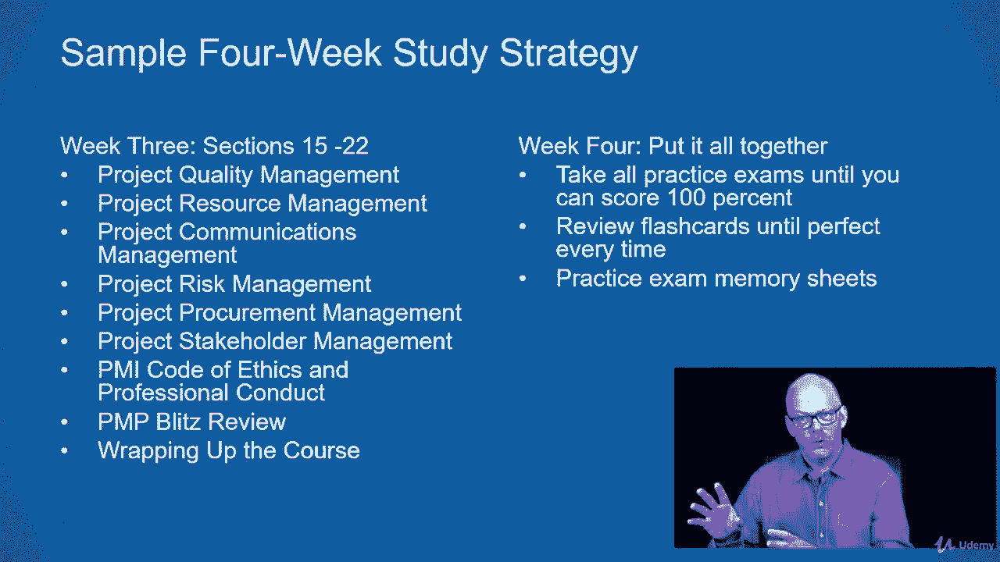

# 【Udemy】项目管理师应试 PMP Exam Prep Seminar-PMBOK Guide 6  286集【英语】 - P12：4. Create a Study Strategy - servemeee - BV1J4411M7R6

我认为对你来说，制定一个何时的策略真的很重要，你要学习，你现在要怎么学习，不要在计划中陷得太深，细节见，当我有一点弯曲，但这里的想法是你想为你的计划创建一个大致的想法，你将如何学习，这样你就有一口井。

基本上是一个时间表，就像你会有一个项目，什么时候你要花时间学习，所以我认为这是一个重要的练习，但不要花几个小时来创造它，让我们谈谈你需要什么来制定一个好的学习策略。

首先，你想创造一个学习的地方，所以你想模拟考试环境，就在考试要安静的时候，没有中断，你会把你的手机放在那里，所以抛开一切杂念，所以关掉你的电子邮件，把你的手机扔掉，告诉别人你没空，所以没有访客。

所以你不想分心，就像你在考试环境中一样，我建议你花两个小时的时间沉浸在学习中，更重要的是，它真的开始打你，所以大约两个小时的安静时间，沉浸在学习中，所以你真的想只关注PP。

所以只有在我们讨论过的那些目标上，你将接受考试测试，我也想让你，当然完成课程，你必须完成这里的材料，为了申请你的结业证书，也可以看到你在考试中将要看到的一切，所以是的，按你喜欢的任何顺序上这门课。

去做最重要的事，你可以一遍又一遍地拿着这些，我建议你们在学习这门课的时候做笔记，但不要把一切都写下来，写下什么是最重要的，在离开模块之前检查笔记，所以你做笔记，例如，当我们进入项目集成管理时。

在您继续进行范围管理之前，暂停，你要做个小测验，也许在你参加测验之前复习一下你的笔记，这对你有帮助，等课程结束再回来看你的笔记，有机会复习一下你写的东西，为什么你认为这很重要，然后在这门课上。

正如我提到的，我们有一个问答功能，所以花点时间使用Q和一个功能，阅读其他人写的东西，在那里提问，这是一个很好的方式来与你的同龄人和我自己互动，我有一些助教，他们也会在课程中提供帮助。

所以使用讨论功能与其他PP候选人交谈，并发布问题和阅读问题，别人发的，知道要学什么，你有十四章，这就是我们在本课程的大部分内容中所涉及的内容，所以我们会把针盒里的东西都盖住，还有一些额外的事情。

但是学习Pinbot指南，作为参考，所以PMP考试的重点是，记住它正在启动，规划，正在执行，监测，控制和关闭，但它分布在这些知识领域，十大知识领域，所以项目集成管理是第四章，在针背里，所以集成管理。

然后范围，时间表，成本，优质资源，通信，风险采购和利益攸关方，相信我，你会把那些嘎嘎作响的，一旦你越来越深入PMP，所以知道要学什么，知道什么是重要的，就是这些知识领域，创建你的学习策略。

所以这真的很重要，但我希望你花时间看看考试内容，您可以从pmi。org下载pp手册并查看其内容，我已经完成了这些任务，那就是它的来源，考试内容是，我想让你制定一个适合你的计划，所以不要不切实际。

在接下来的四个星期里，你要每天学习八个小时，对大多数人来说，这可能不会发生，所以现实一点，所以你怎么能放弃一些时间，在其他地方投资时间，所以在我的资源中建立一个对你有效的计划，为了这次讲座。

有一个叫做分数跟踪器的电子表格可以跟踪你，你输入你的考试成绩，那会让你看得很清楚，你需要在哪些章节上花更多的时间，它会为你生成一个平均值，当你在课程中移动时，做一些SWOT分析，swot。

我们会在课程中看到几次，但这是在看你的长处，弱点，机会和威胁，如果你真的有很强的素质，并且你在那次考试中得了100分，你不需要一直学习质量，所以，但如果你真的不这么热，风险很好，那就是弱点。

你需要在那里多花点时间，然后机会是我们观察问题的分布，从开始结束，像启动这样的过程的问题有两个过程，关闭有两个过程和执行，这是你考试中很重要的一部分，就像你考试的一大堆问题。

所以在问题的过程中有一些机会和威胁，根据考试目标学习，不要研究东西，你不会接受测试，研究你将要测试的东西，这是一个为期四周的学习策略样本，我不是说，拥抱这个，把它变成你的，我只是告诉你一个想法。

你可以用这门课程和你的时间来组织你的学习习惯，所以这不是你要做的，我不是说这对每个人都是完美的，但这是一个很好的模型，您可以在创建计划时效仿，所以第一周你可能会看一到七个模块，我说的是这门课程中的模块。

讲座和部分，所以本周第一到第七部分，也许你做得更多，也许你做得更少，做对你有效的事，所以准备通过PP，从课程中获得最大的收获，查看PMP考试域，概览，然后进入地基，项目管理的相关领域和PM组件的介绍。

所以现在你在第二区，这样你就可以看到你还有什么要做的，如果你下周把这个计划放在第八到十四节，项目环境，PM集成管理卷，第四章在针盒里，现在我们正在进入这些知识领域，工程进度表和成本管理。

可能是第二周第三周你要做第15到第22节，这将是优质资源，通信，风险采购与利益攸关方，剩下的桃子，然后我在这门课程或部分中有一些额外的模块，道德守则，闪电战评论，然后结束课程，所以那可能是。

第三周和第四周把所有的东西放在一起，回去一遍又一遍地参加练习考试，直到你每次考试都百分之百，然后知道你为什么失踪，你错过的问题类型，所以给一些特警，检查你的抽认卡。

直到完美每次我还没有谈论很多关于抽认卡，但这是本课程的一个资源，所以浏览一下抽认卡，所有的术语，然后练习创建内存表，等到学习结束才能真正专注于记忆表，先真正了解内容，以及事情的原因，并有一个理解。

然后担心创建内存表，我认为理解比单纯的回忆更重要。

这是一个示例策略，我不是说你又要用这个，但创造一个适合你的策略，勇往直前。