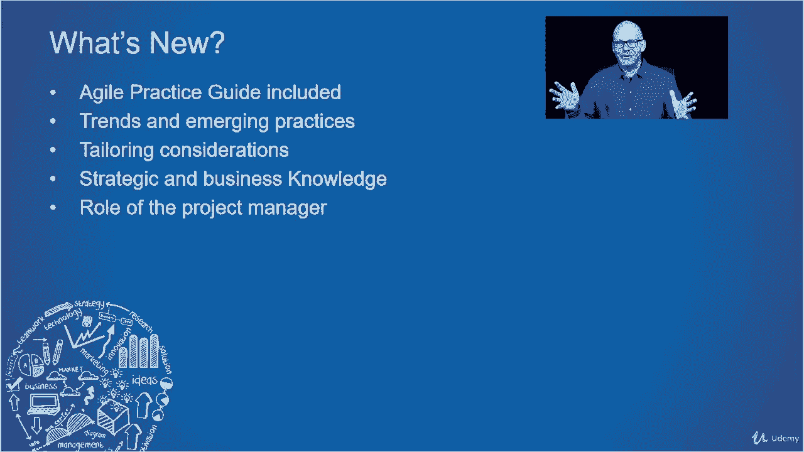

# 【Udemy】项目管理师应试 PMP Exam Prep Seminar-PMBOK Guide 6  286集【英语】 - P13：5. Explore the PMBOK Guide, Sixth Edition - servemeee - BV1J4411M7R6

你的PMP考试很大程度上是基于Pinback指南第六版，所以了解弹球导轨的结构是很重要的，内容和你要测试的东西，所以在这堂课中，我想通过弹球指南，并指出一些你应该注意的事情。

这也将为我们剩下的课程做好准备，当我们探索弹球指南和这些过程和知识小组时，所以我们现在来看看，Pinback Kesix版本有十个你已经看到的项目管理知识领域，在这门课上的几次，桃胶六版有四个九道工序。

它还描述了项目管理的最佳实践，那么平背六版有什么新的，弹球指南最大的变化之一，第六版是敏捷实践或自适应环境的补充，所以你会看到这是整个别针盒的主题，在整个课程中，现在它不是一个巨大的压倒性版本。

这是每个知识领域中的一个小添加，所以如果你不是来自一个适应性或敏捷的环境，随着课程的进行，我会解释其中的一些内容，尤其是当我们以后讨论项目生命周期时，但是为了你的考试，你必须了解一些敏捷实践。

以及自适应和迭代的生命周期，所以不难，只是和你可能习惯的有点不同，如果你在一个预测性的环境中，在每个知识领域也增加了趋势和新出现的做法，例如，我们谈论风险，风险会有趋势和新出现的做法。

所以我们将在每个知识领域讨论这一点，当我们穿过法庭，每个过程组都可以根据组织的项目规模进行定制，你需要在多大程度上定制这个过程，所以剪裁意味着，您可以根据项目中最需要的内容调整流程，例如，如果你不买。

你不会做任何采购过程，如果你在做一个很小的项目，也许你正在用无线键盘替换所有的键盘，那是你的项目，嗯，我们不需要为那种类型的项目进行大量的研究，因此，过程的定制将适合项目的规模，以及组织中的要求。

我们将讨论战略和业务知识，我们来谈谈商业价值，实现组织目标或业务目标，也是这种商业知识识别知识管理的新过程，并拥有知识库，我们如何管理它，组织它，回忆它，所以这是一个非常重要的过程，我们会看看接下来。

弹球指南的新篇章是项目经理的角色，只是一个非常清楚的，对你作为项目经理的期望的研究，我们将在第三章中讨论这一点，所以在平背指南第六版中，什么覆盖得好，第一章有点像这门课。

这是基本信息，然后我们将进入项目环境，我们要谈谈项目经理的角色，正如我刚才在第三章提到的，然后你可以从第四章到第十三章看到这些知识领域，这十个知识领域，所以集成管理，资源管理，通信。

风险采购和利益攸关方管理，那是针后眼，你可以看到这个过程遵循同样的轨迹，就像我们在PIN机器人中看到的那样，所以现在你知道你前面是什么了，不仅在这门课上，而且当你打开Pinboi的时候。

伟大的工作继续前进。

