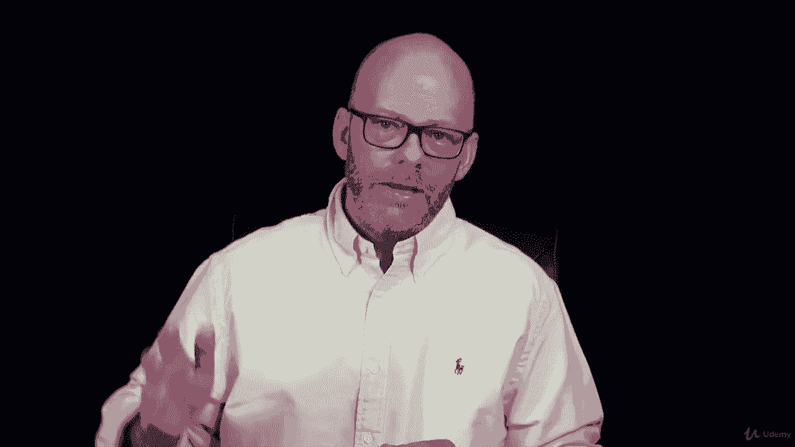

# 【Udemy】项目管理师应试 PMP Exam Prep Seminar-PMBOK Guide 6  286集【英语】 - P132：6. Rolling Wave Planning - servemeee - BV1J4411M7R6

Rolling wave planning is where we have iterations of planning and doing and planning and doing and this is a concept we'll see throughout the Pibaok and I've already mentioned it a couple of times in this course so let's have a good clear definition of rollinging wave planning The idea is that the imminent work I can plan in detail stuff that's way out in the future I can plan at a high level we already do this in your life what plans do you have for next weekend but you have a pretty good idea what plans do you have a weekend a year from now it's probably a bit more hazy so as we get closer to the work in our project we can plan much more precisely and accurately。

Future work approaches we do more planning， so we always focus on what's most important。

 what's most imminent， and this is an example of progressive elaboration remember I start very broad and I get very specific。

To visualize rolling wave planning， it looks like a way plan， do， plan， do， planning and executing。

It's possible we could do rolling wave planning with phase gates， we have phase gate planning。

 so this curve that you see over here， each of those green dots。

 those represent a milestone in a phase gate。So we start off the project at that green dot。

 that's the initiation or the kickoff meeting， and then we do planning for the next phase of the project from now until the next green dot。

 the next phase gate， we get to the next green dot。

We pause and do planning for the next chunk of the work， and then we get to the next phase gate。

 you do planning for the next chunk of the work and so on。

 so you could see you have this idea that you're planning for each phase as you enter the phase。

 you know what your milestones are but need to define how will I get to those milestones。

In adaptive environments we also have rolling wave planning。

 so we have this idea of a sprint backlog planning。

 what goes into the sprint backlog that we create deliverables through these short cycles of work。

 and then we do some quick planning， we reorder or prioritize our product backlog and then we go back and do execution so plan do。

 plan do and this is all creating deliverables in each iteration and then the team starts the cycle all over again。

So you will see some questions on rollingway planning， maybe one or two。

 It's a pretty easy concept to grasp， and I'm sure you're doing fine。 All right， keep moving forward。

 I'll see you in the next lecture。