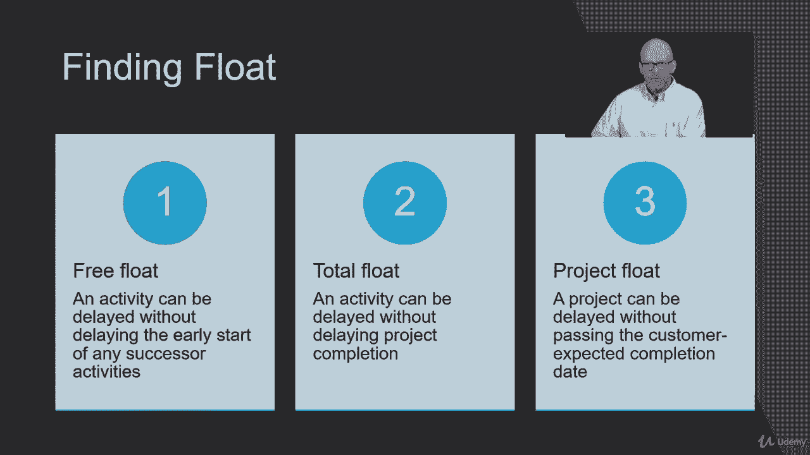

# 【Udemy】项目管理师应试 PMP Exam Prep Seminar-PMBOK Guide 6  286集【英语】 - P146：20. Performing Schedule Network Analysis - servemeee - BV1J4411M7R6

🎼。Schedule network analysis is a tool and technique to find the earliest and the latest project completion date we're looking for opportunities to delay。

 we're looking for opportunities to shift resources and also doing some sWAT， some strengths。

 weaknesses， opportunities and threats analysis， so let's take a look at that now。

What we're talking about in this lecture is finding float。

 There are three types of float you need to be familiar with for your exam。 We have free float。

 And that's when an activity can be delayed without delaying your early start。

Of any success or activities。Total float is an activity can be delayed without delaying project completion。

And then project F is a whole project can be delayed without missing your deadline。

 so for example project F your project takes 30 days to do all the work。

 but you have a year to get it done， so you have a big window there for project float What we're primarily interested in is free float and total float。

Free float， we're looking at one individual activity and the successor。

Total float is what's the total amount of duration I can have on a task without affecting the end date。

Now， let's look at how to find float。

So this is a project network diagram， so you can see at these different nodes。

 each one of these nodes represents an activity。The little number you see in the middle that represents the duration。

So what we want to do first when you get one of these questions on your exam is you want to draw it out on a piece of paper。

 don't just stare at the screen， it's too complex， you want to draw this out。

Then the next step that we want to do is find all of the paths and their duration in the project。

So in this example， we can go A， B， E， H， JK。And if we add that up，3 and6 is9。

 I'm adding the duration here， A is 3， B is 6，3 and 6 is 9， plus 2 is 11。

 plus3 is 14 plus3 is 17 plus2 is 19。So in the lower right hand corner， we see A， B， E， H， J，K。

 and that's 19 days。Then we have the path of A，F， H， JK， and that one takes 22 days。

And then we have the path of AD， D， G， IK， and that takes 21 days。

So it's important to find each one of your paths in the duration。

Because this shows you the critical path。The critical path is the longest path。

 meaning it's the longest in duration in our project。

So the critical path doesn't mean those activities are more important than the other activities。

 it just means that those are activities that cannot be delayed。So are。Critical path here is ACFH JK。

 There will be no float on the critical path because remember， float is an opportunity to delay。

 We can't delay any of those activities or our projects going to be late。On B。

And E and D and G and I， there is an opportunity to delay。

 So that's what we need to do next is find the float on each one of our activities。To do this。

 we'll do a technique that's called the forward pass。The forward pass， if you look at activity A。

 begins with the early start。Plus the duration， which is represented by D。

inus1 will tell you the early finish Now y minus1， well， here's why if you take one plus3。

That will be four， right， but if you start work on Monday and you work all day， Monday。And all day。

 Tuesday， and all day Wednesday， you've actually worked three days， not four。So1 plus3 is4。

 minus1 is3。So that's our forward past， now where do we get one from？

The first day of the project is day one。Now I know some of you know a different way to do this and that's fine use what works。

 the goal here isn't to use my way， the goal is to answer these questions correctly and pass the exam。

But I prefer this approach， so that's the way I'm going to teach it。

 I think it makes more sense because you always start on day one in a project。

So I'll give a little wink there some of you others though what I'm talking about。

 this is the way you want to do it though so once you do it a couple times you'll be a wizard at this。

So let's look at activity A and we'll follow our formula through here， so we start on day one。

 one in3 is4， minus1 is 3， the earliest you can finish A is day three。Now activity B。

 C and D can all start win。As soon as A is done， so the next day， so that's why we see for B。

 C and D， they all have their early start as day four because you can start as soon as A is done。

Let's go to activity B。4。Plus 6 is 10。-1 is 9。 That's the early finish for being。Activity C。

4 plus seven days of duration puts us at day 11， minus-1 is day 10。Now activity D。

4 plus 9- 13-1 is 12。 so what we've done is we aren't taking one path and just blowing all the way through to the end。

 You have to follow this logical methodical approach because you're only looking at the next successor。

 one successor at a time you can't blow through the whole path and complete it and then come back and say。

 we'll do the next one and the next one。You do one successor at a time。So now let's go to activity E。

Activity E can start as soon as B is done， right？So B ends on day9， E can start on day 10。

10 and2 is 12， minus1 is 11。Activity F can start as soon as C is done。So it also。

 it can start on day 11， not also， so C finishes on 10， F can start in 11。

11 plus four days of duration is day 15， minus1 is 14。

And then drop down to activity G G then can begin as soon as D is done， so D will end on day 12。

 G can start on day 13。There's only one day of duration for activity G， so 13 and1 is 14。

 you'll also finish on day 13。Let's go up now to activity H。When can activity H start。

 what's its early start？Day 15。Not day 12。Because what must be true for H to start？E has to be done。

And F has to be done。So that's where I was saying you can't just blow through the path because if you started at the top and just went all the way through all of those nodes。

 you would probably put activity H could start on day 12 without considering when F would actually finish。

So， H。Can begin on day 15。 E and F have to be done。 So the greater of the two is day 14。

 which tells me H can start on day 15。15 plus three days of duration is 18 minus1 is 17。

J can begin as soon as H is done， so its early start is 18。18 and3 is 21， minus1 is 20。

We go back down to I， I think I skipped I here， so G is done on 13， we go the next day is day 14。

 14 and 6 is 20 minus1 is 19。Now look at activity K our last activity。

K cannot start until J and I are complete。So the earliest it can begin is day 21 because J finishes on 20。

 I finishes on 19。So K21。Plus2 is 23，-1 is 22。Now look at our path duration ACFHJK is 22 days K ends on day 22 if those two numbers don't match if somehow in your math here you came up on day 20 as the last day or day 28。

 you made a math air somewhere。The last number， the early finish for k has to equal the same duration as the critical path if they don't did some math wrong。

 so double check your math。That's the first part of the equation， all right， the forward pass。

Now we do the backward pass， it's very similar， very similar。

 but now we're going to be minus the duration and adding one day。So we start at the end。

 very similar， we start at the end with K。K， our late finish will equal our early finish。

 so our late finish is day 22。 if we follow our formula， late finish minus the duration plus1。

 so 22 minus2 is 20 plus 1 is 21。 that's our late start。Jay has to finish by day 20。So， if we。

Look at day 21 on K。That's the latest it could start to finish the whole project。

So J has to be done by day 20， but what else is true？I has to be done by day 20。So J and I。

 the predecessors decay K， can only take day 20 without affecting K。

So Jay's late finishish will be 20 and I's late finish will be 20。On Act J。

 if we do our formula our late finish， minus the duration plus 1， 20 minus3 is 17 plus 1 is 18。

On activity I， 20 minus6 is 14 plus 1 is 15。Let's go to activity H。

 activity H can take all the way out to day 17。Without affecting the late start for J day 18。So H。

 itss late finish is 17，17-3 is 14 plus 1 is 15。Activity E and activity F。

 they can both take out to day 14 without affecting H， so their late finish will both be 14， 14 on F。

 14 on E on F。14 minus4 is 10 plus 1 is 11。On E， 14 minus2 is 12， plus 1 is 13。Look at activity B。

 you can take all the way out to day 12 without affecting the late start for E。

 so it's one day prior， will be 12。12-6 is 6 plus 1 is 7。Activity G， let's hop down the bottom G。

 I can take to 14， 14 minus-1 is 13。 and so its late start will be day 14。In activity D。

I can take out to date 13，13-9 is4 plus1 is 5。Now activity F， I think we did。

 14 minus4 is 10 plus 1 is 11， and C will be day 10， 10 minus 7 is 3 plus 1 is 4。

Now look at activity A， Act A has to be done by what day without affecting the successor activities。

Day three， because it has to finish by day three because C can start no later。

 its late start is day four。So 3 minus3 is0。 There's no such thing as day 0。

 so 3 minus3 is 0 plus1 is1。And that is the backward pass。Now。

 I want you to notice something here on our critical path， those that have are in blue。

Notice that the late finish。Is the same number as the early finish。

And the late start will be the same number or value as the early start。So on the critical path。

 once you know it， a little shortcut you can do on the backward path are just drop those values down。

 they will be the same。Because the difference of our late finish and early finish。

Will will be float and there's no float on the critical path。So let's look at that。

 how do you find float？You can take the late finish minus the early finish， and that will show float。

Or you can do the other side， which will be the late start minus the early start and if you're not a math person。

 that's a great way to check your math is to do both sides。 What I mean by both sides is。

 for example， on activity E。14-11， my late finish， minus my early finish，14-11 is 3。

On the other side of the box， we have our late start， the early start，13-10 is also 3。

 If those two numbers match， you know， your math correct。 If they don't match。

 then somewhere there's a mistake。 So it'll be the same number on either side。

 whether you're doing the late finish。Early finish or the start side of our node。

So if we plug in that formula that we find our float。

 so let's go through and do this we know on AFH JK is0。

 so if you look at any one of those in blue the difference will always be0 on activity B 12 minus93 so you see the middle node there on the bottom between we have 7312 that three represents float that's where you write in your float。

So 12-9-3 or 7-4 is 3 on activity E，14-11 is 3。On activity D， we have one day afloat on activity G。

 we have one day afloat and on activity I， we have one day afloat。So that's it。

 that's how you find float， take some practice， so what type of exam questions will you have here when it comes to float？

You will likely see a network diagram。Not unlike this I mean it's very possible。

 it would be like this， and then they will ask you if activity D were to take two days of float。

 how much float could you have on activity I。So now you have to do the math to figure out how much float is there and what would it do to the total float for the whole project？

If you follow this sequence， we just walk through a lot of times as soon as you find the critical path。

 you can look at the question and then from that you can deduce the amount of float you would have。

 for example， how much float could you have on activity F where you could see it's on the critical path so you get zero float。

 but if we look at activities A， D， G， I or K。I only have one day afloat on D， G and I。

Right each day has one day afloat Can I really use one day afloat on D，1 on G and1 on I？I cannot。

 because that path of A， D， G， I and K takes 21 days， what's the maximum duration for our project？

22 days。So D， G and I， I can only use one day afloat。 so if I use the one day afloat on activity D。

G and I， I can't touch。 that's a near critical path。 It doesn't mean that it's critical。

 it's near critical。 I only have one day afloat， it's really tight here。So on G and I。

 I won't have any float left if I use it on D。So those are the types of questions you'll have let's look at activity B and E here on B you have3 and on E you have three Do you really get six days afloat。

 No， you have three。A quick way you can do this if you find your paths like our very first step。

 so I know you're going to do that。You can very quickly deduce on the activities that are not on the critical path。

 what's them a maximum amount of float you could use？You have to be careful though。

 because it's the branching like E and F that can affect how much float。

 it won't always be you have3 on B and3 on E。 if there was some branching going on here between B and E。

 then that could affect。How much float you get on B。

So you can't just always assume it'll be the same for every activity often it is， but not always。

 so you have to do this float， so it take some practice， I know it's tedious。Also。

 know you're not going to have 20 questions on this。 You're not going to have 200 questions on this。

 You'll have a few questions about float， so you need to know how to do it。

 but I wouldn't spend an hour trying to figure this out on your exam。

 Hard questions are worth the same amount as easy questions。 All right， keep going。

 I'll see you in the next lecture。

