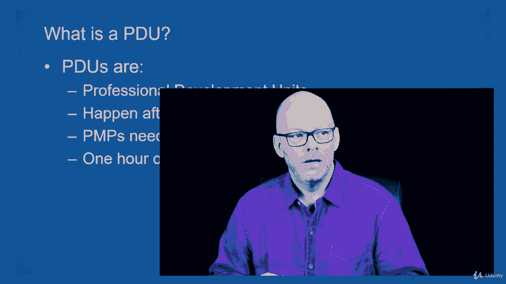
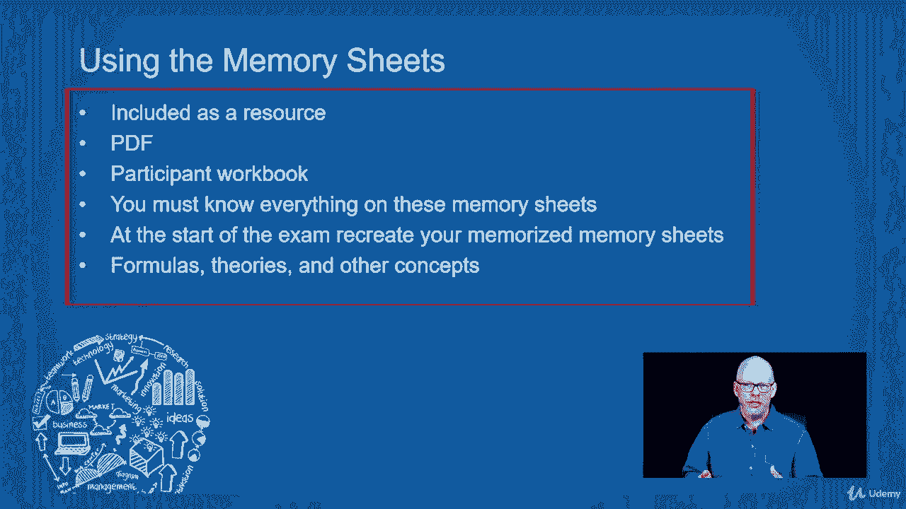

# 【Udemy】项目管理师应试 PMP Exam Prep Seminar-PMBOK Guide 6  286集【英语】 - P15：8. Maintaining Your PMP - servemeee - BV1J4411M7R6

我确实得到了很多关于我在PP后做什么的问题，我永远是个pp吗，还是有什么我必须做好的，你必须保持你的P和P，所以现在，如果你不是P和P，这真的没什么好担心的，只要知道它是在你通过考试后到来的。

你现在会通过考试的，你们中的一些人是PNPS，你修这门课是为了复习，或赚取PTO使用，就像我们之前说的，我们把话说清楚，PM的要求是维护您的P和P。

所以一个Pdu，我们知道PDUS是在，你是一个P P一个PDU是一个专业的发展单位，你必须每三年得到60个PDUS，这叫做你的认证周期，一个小时的教育相当于一个PDU，所以你是P和P，然后你接受训练。

比如说，还有一些其他的方法，但培训会给你每小时一个Pdu的教育，PMI创建了这个人才三角来描述教育的细节，我们必须有三个不同的类别，我们有领导，业务、战略和技术，所以在你每三年必须赚的60个PDUS中。

其中至少35人必须来自继续教育，在3个5个最低教育学时的分配范围内，你必须有八个PDUS在领导中，你必须有八个PTO在技术项目管理中使用，和八个PTO在商业和战略管理中的使用。

所以你可以看到这是三个五个PTO中的两个，然后你可以从剩下的三个区域中选择任何组合来获得11个额外的pduse，现在你不再局限于三到五个小时的最低教育时间，你可以从教育中得到你所有的60岁。

但它必须与至少八个技术，在商业和战略方面，如果你是PMP，这门课，你在寻找你的PTO使用，你会得到八个，你得有八个，你会得到5个PTO我们在领导，商业和战略5名，在这门技术课程中有两个五个。

所以通过选修这门课，你总共赚了三五英镑，但请注意，领导只有五个，商业只有五个，所以你得安静下来，除了这门课之外，还有三个领导职位和三个商业职位，但是三个五都可以数到你的六十，这在2015年生效。

我们所有PNPS的三五最低教育，25是你通过回馈能赚到的最大PTO使用量，所以回馈是志愿服务或作为项目经理工作，所以你最多只能有两个五个，回馈PTO使用所以，如果你在创造新的知识，就像我写书一样。

所以我得到了一些PDUS，或者如果你在不同的章节活动中发言，或者你在分会活动中做志愿者，你可以为此赚PDUS，但你总共只能赚两个五，所以你必须在教育方面有三个五个，然后你可以通过回馈来给两个五。

现在这里有一个很多人不知道的小金块，你会得到八个P来使用，仅仅通过做项目经理，所以你最多可以使用八个PTO，就靠当首相，所以你去那里，这是一个很好的方法得到八个PTO立即使用，我们在这门课程中的目标。

尽管我不会再谈论PDUS了，我们的目标是专注于通过考试，不是Puse，所以我真的要把pto使用的想法抛在脑后，所以如果在这个课程之后你想用PTO，我有其他在线培训，这将帮助你赚取你的PTO使用。

所有来自教育的PTO用户都很好，但首先要做的是，让我们把注意力集中在通过p np上，然后我们以后再担心pduse，我想让你用记忆表，这是本课程的一部分，它有你需要知道的一切，所以使用内存表。

这是一个很好的方法来跟随课程。

只是引用过程的一种快速方法，诸如此类，如果您没有下载该资源，然而，我鼓励你做这件事，勇往直前。

