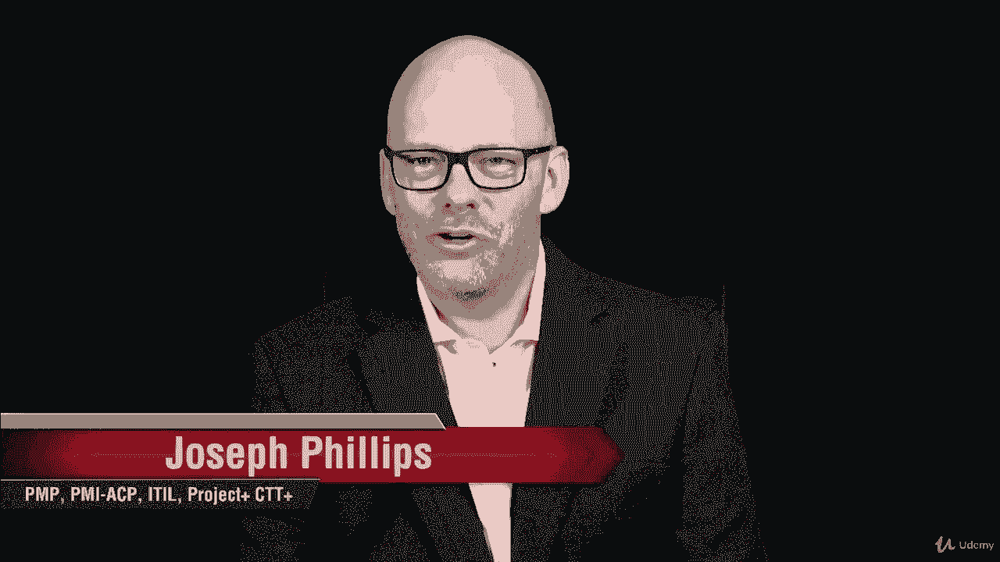
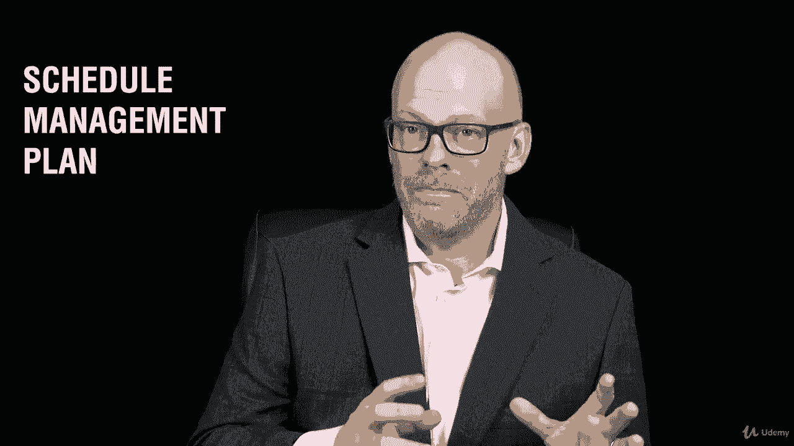

# 【Udemy】项目管理师应试 PMP Exam Prep Seminar-PMBOK Guide 6  286集【英语】 - P153：29. Section Wrap Project Schedule Management - servemeee - BV1J4411M7R6

🎼。

Great job finishing this section on project schedule management covered a lot of information and this section I know the big thing that you learned about was float about network analysis and so that's the question that I get from people all the time is does this course cover float when now you know that it does and you've got a good grasp on what is float and how do you do the forward paths and the backward path and that helps you find float in the critical path and so on so you've got that mastered now if you don't go back and watch that section a couple more times。

 do some more assignments or exercises create up your own but you can do it I have confidence in you that you can do it。

That's not the only thing we talked about in this section， though， It's just the most popular。

 We also looked at adaptive environments， trends and emerging practices。

 creating a schedule management plan。 And we talked about defining those activities And once we have those activities defined that we can sequence the activities to create a network diagram。

 we looked at leads and lags。 Once we have that network diagram created。

 we also need to know the activity durations， how long will things last so that that tells us how long our project is the last。

 that also helps us to develop the schedule and consider any constraints or assumptions that will affect our scheduling。

😊。

And then we looked at F network analysis。 we talked about controlling the project schedule。

And then we talked about measuring project performance。

 and that I gave you a little coach here about controlling your schedule that you want to be。Smart。

 but to some extent， may be a little aggressive。 Don't wait too long。Okay。

 great job finishing this really big section here about project schedule management。

 keep moving forward， I have confidence that you can do it and I'll see you in the next section。😊。

