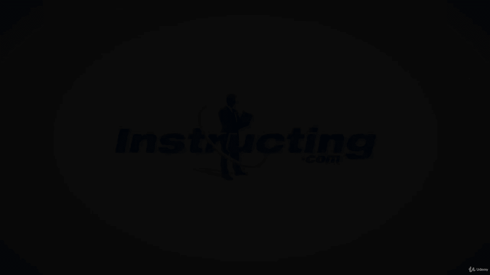

# 【Udemy】项目管理师应试 PMP Exam Prep Seminar-PMBOK Guide 6  286集【英语】 - P157：4. Estimating the Project Costs - servemeee - BV1J4411M7R6

。Now let's talk about estimating how much the project is going to cost that's always one of the first questions we hear right from stakeholders how much is this thing going to cost the second question is when can you have it done？

Well， estimating the project cost is where we take and make a prediction based on the information that we have right now。

 the more reliable the information is that we have， the more accurate our cost estimate will be。

We also want to consider some cost trade offs， so cost trade offs of what risk may be introduced。

 so things like cost out of pocket to build it versus buy it。

 what's the cost of owning it versus leasing it， and then can I share resources with other projects？

The level of accuracy， what about the rough order of magnitude to my raw estimate。

 that is a very wild estimate。A budget estimates typically based on the scope。

 it's a little bit more precise and the definitive estimate。

 this is a bottom up estimate like we saw in time that I account for the cost of every deliverable and add that up。

 it's the aggregate of my cost。I also defined all categories of cost。

 so do I have to account for labor or not？In some projects。

 you have to account for the labor as the PM and other organizations。

 the labor is just considered an indirect cost， it's part of the cost of doing business and it doesn't affect the project budget。

 so we need to know up front though when it comes to estimating what am I expected to estimate as the PM。

Our EOs here for estimating costs， we have our inputs， the project management plan。

 the cost management plan， the quality management plan， and the scope baseline。

Some documents you'll need， lessons learned register， your schedule， your resource requirements。

 and the risk register， and of course you have EEF at OPA。Tools and techniques for estimating cost。

 expert judgment， and then you've seen these already analogous， parametric。

 bottom up and three point estimates， we did those in time for a schedule Now we can do the same approach for cost so we'll look at these again。

 but it's exactly the same approach。Data analysis， so doing some alternative analysis and how alternatives may affect cost。

Reserve analysis and a cost of quality。Project management Information system。

Doing some decision making and voting。Our outputs of estimating costs， well。

 you get the cost estimate and the basis for how were these estimates created。

You have project document updates， so you might be updating your As log。

 your lessons learned register， and the risk Reg。There are four types of cost you need to know when we think about resources in our project。

We have a direct cost which means this is an expense that's only for your project。

 so you need to purchase some drywall material， the drywall project you're working on a house that you're building or whatever that's only for that project right you can't use that drywall anywhere else it's only for your project。

An indirect cost is it's shared to more than one project。

 so you have to purchase a piece of equipment， so this piece of equipment can be used on multiple projects so it's not just yours。

 but there's other projects that can share it and use that piece of equipment as well。

 so that's an indirect cost。A variable cost is where the price varies based on how much you order and when you order it so a variable cost could be you're going to have a workshop and you need to have it catered。

 the more people that attend the workshop then the price goes up another variable cost is like travel every time you book a flight。

 even if it's the same flight over and over， the cost of that varies based on the marketplace conditions。

A fixed cost is any cost that's uniform through the project。

 so you're going to rent a large piece of equipment and it's $1500 a month and you're going to have it for six months。

 so it's uniform $1，500 for six months。Or you have a consultant and that consultant is X amount of dollars per month。

 so it's uniform through the project。There are times where you can mix and match these costs。

 so for example， you could have a direct cost like the consultant， it's your project only。

 but it's also a fixed cost that is' uniform through the project。

 but these are just different attributes of cost that we want to think about when we go into cost estimating。

When we create a cost estimate， there are three types of estimates。

 we have a roM or a rough order of magnitude， a budget， and a definitive。

These percentages that we see here are approximate ranges of variances。

 so you can make these tighter or bigger， whatever your enterprise environmental factors allow。

So a roM is very unreliable， it's kind of your first understanding of what the project may be。

 so it's a hallway estimate or an elevator estimate。

 you know where a stakeholder they stop you and they say how much did it do X， Y Z。

Well that's the rom， so it's negative 25 to plus 75， pretty big swing there on its reliability。

 not very reliable。A budget estimate is typically based on the scope。

 so we have a lot more information， so now we could give a price。

 but our range of variance or tolerance level would be negative 10% all the way up to plus 25%。

 so still a pretty big swing there on cost。The definitive estimate is based on our work breakdown structure。

 and that's the most reliable and the most accurate， but it takes the longest to create。

 so a definitive could be from negative 5% to plus 10%。 Now again。

 those ranges are just a standard your organization may say no。

 it's negative3 to plus3 right so they could have a very tight cost estimate and often it's based on how much information do you have So if you're doing the same types of project over and over and over。

 you can take a similar project。 you've got a good idea of what it's going to cost based on this past historical information。

And then you could apply the estimate based on it historical information。

 so your estimates may vary but these are just some standard ranges of variance。

The risk register is considered because risk can have a financial impact。

 I also want to think about opportunities versus threats。

 and opportunity and opportunity is a positive risk， it can bring an income， it can save time。

A threat is a negative event that can cost money， that can cost time， so often we think about risk。

 we only think about negative， but maybe there's a cost savings or time savings。

 so that's a positive risk event。Now management reserves and contingency reserves we' talked about these a little bit management reserves。

 these are for unknown unknowns like a task goes over。

 you couldn't predict that was going to happen or some risk came out of nowhere so an unknown unknown is a risk event that you could not identify it's used for time and risk。

A contingency reserve， this is money set aside for known risk events。

 so we've done risk identification， we've done quantitative analysis。

 and we have found our risk exposure We will look at contingency reserves in Cha 11 in the pin box so just a few sections from now。

For right now， just know contingency reserves are for known risk events。

We need our scope baseline in order to create a cost estimate。

 The scope baseline is needed because it is the scope statement， the WbsS and the WB S dictionary。

 If I have that information， then I can make a very accurate cost estimate。

The scope statement needed because it first has a high level estimate of what the project funding requirements are。

The WBS shows the relationship among deliverables， and the WB dictionary identifies each of those deliverables and provides a description of the work。

 So those two documents will give me some really clear insight into what we have to create and deliver。

 and that will help me create a much more accurate cost estimate。As far as the project schedule goes。

 we want to think about cost estimating what's the availability of resources and if I use the resource as a later time or an earlier time。

 will that affect the price for that resource？What about the timing of procurement。

 so we've already seen this idea of lead time for procurement。

 so how does that affect my resources and how will that affect cost estimating？

What about the cost of project financing， do you have to consider the time value of money or interest rates or inflation？

Probably just topically aware that for your exam， you won't have to calculate interest rates or inflation。

 you might have to calculate future value and present value。

 but maybe just one or two questions there。What about the cost of financing so the interest rate time sensitive cost that if you purchased after this particular date。

 costs are going to go up so there's an urgency associated with when you purchase and then there might also be seasonal I think about travel if you're traveling over some holidays。

 the cost of travel goes up because the supply and demand。

So seasonal cost variations can come into play as well。

So these are all things golf factors that we have to consider for cost estimating and there's definitely some differences here than what we saw in schedule and activity duration estimating。

 so it's a lot more often a lot more sensitivity with cost than time。Okay， good job。

 keep moving forward， you're doing great。

