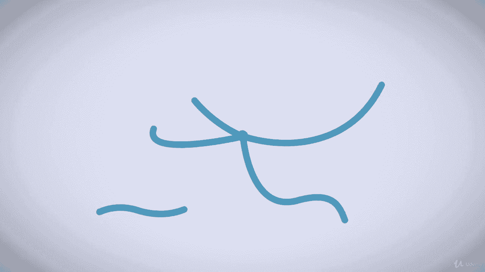

# 【Udemy】项目管理师应试 PMP Exam Prep Seminar-PMBOK Guide 6  286集【英语】 - P161：8. Creating a Three-Point Cost Estimate - servemeee - BV1J4411M7R6

A three point estimate is an average of the cost now we did the same estimate back in scheduling where we had optimistic。

 most likely and pessimistic， also known as triangular distribution you could do the same thing for cost so if you remember we had that 25 plus 45 plus 75 and it was an average 48。

33 hours， so instead of time just imagine that that were money exactly the same。

Pert can also be used when it comes to predicting cost， so Pert would take it optimistic。

 most likely and pessimistic with dollars instead of hours。

 and then remember it's weighted towards most likely。

 so the formula is optimistic plus  four times the most likely plus pessimistic and then that's divided by6。

 so earlier we said it was $46。66 hours。 if those were dollars， it would be the exact same $46。

66 instead of hours。So when it comes to three point estimates。A triangular in beta。

You might see them with a C in front of the most likely the optimistic or pessimistic。

 and that signals to you that this is time， so time in a three point estimate。

 whether it's beta or if it is triangular is the same approach。Let's do an example here。

 optimistic $4，000， most likely is $18，000， and the pessimistic is 15，000。

So if we use a three point estimate。What we're going to do the average， the average would be $9，000。

If we go over to pert and we do the weighted average that weighted most likely， it would be 4。

000 plus 32，000 plus 15，000 divided by 68500， so it's trending a little closer to our most likely because we are weighted we're skewing things towards the most likely estimate。

 so that's just a quick compare in contrast of three point in pert works the same way with time or money。

Data analysis is where we have to take a look at there alternatives we could use to bring cost down or to have a cost savings。

What about reserve analysis， recall that the reserve is an amount of funds set aside for unknown unknowns and for known risk events。

 so if risk events start happening or if we're start experiencing lateness on our project。

The amount of monies that we have set aside for lateness or risk events that begins to diminish。

The sooner that we eat into our reserves， the more danger it represents for the project。

 because we may not have enough funds that cover the distribution of risk and the remainder of the project。

So our goal in risk analysis will be to identify risk and to combat those early risk as much as possible so we don't dip into our reserves if I consume all of my reserves early。

 I have a lot of trouble in the project now you can do some real quick forecasting that I have consumed my reserves so these risks that are later in the project。

 I don't have money to pay for those risks。The cost of quality we've not talked about。

 this will be in chapter 8 coming up， but the cost of quality describes the monies that you have to pay to ascertain the expected level of quality so things like training。

 having the right tools and equipment， paying for the right resources that's all part of the cost of quality and there's a couple variations you'll see in the next section。

For now， know that the cost of quality can affect my cost estimates。All of this business。

 all of these cost estimating approaches are supporting detail for how do we arrive at the cost estimate。

 so what was the documentation， how did we create it， What assumptions did we make。

 what constraints are we working with like a predetermined budget or a particular resource we have to use。

What risk have you identified？What's your range of variance。

 What's your range of possible estimates here so that plus or minus 10%。

What's the confidence level of your estimate， how confident are you that your estimate is good？

All right， that's all of our supporting detail and our approaches for cost estimating keep moving forward。

 I'll see you in the next lecture。

