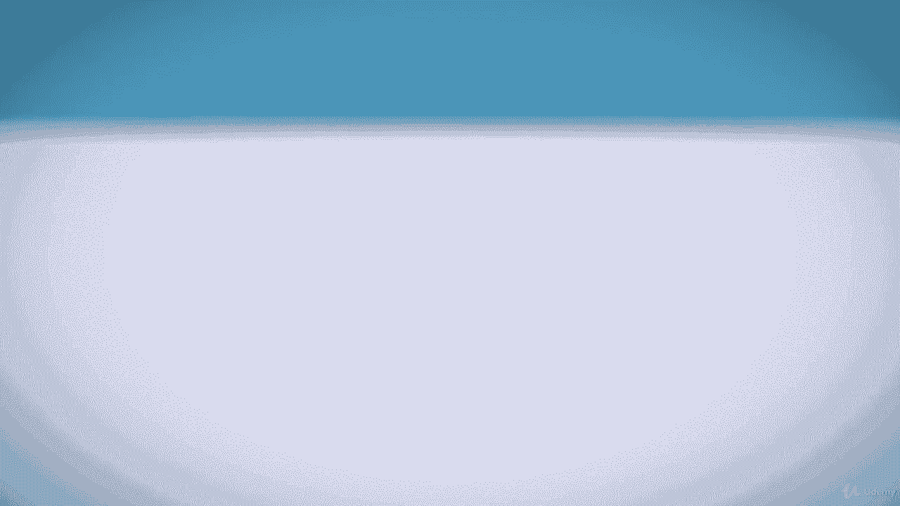

# 【Udemy】项目管理师应试 PMP Exam Prep Seminar-PMBOK Guide 6  286集【英语】 - P163：10. Creating the Cost Baseline - servemeee - BV1J4411M7R6

A cost baseline shows the predicted cost and when we have those costs throughout the project。

The cost baseline we use to measure performance， it predicts the total cost。

 the total expenses for our project in its lifeline。Typically we see a cost baseline as an S curve。

 so we see this nice S that's stretched out where the closer we get to the top of the S。

 that means we're out of time and we're out of money and that represents the end of the project。

This will also predict when you can expect to spend money in the project。

Discrepancies early are a pretty good sign that you're going to be off on your budget。

 that your cost baseline isn't very accurate， so you had some big problems early on。Now。

 really big projects may have multiple cost baselines。

 so you can have a cost baseline for each phase of your project。

These also help predict spending plans， so when will you have capital expenses or very large expenses？

That will show the cash flow of the project， so you may have some deliverables that also will bring cash back into the project。

 so when will those happen and a cost baseline or multiple cost baselines can show overall project performance。

This is a cost baseline or a pretty typical insight into a cost baseline again， on the Y axis。

 we have our cumulative cost and on the X axis we have our time。

The solid blue line represents our cost baseline， that's our prediction。

The red line represents our actual cost， and then if you notice there's a very thin black line。

 that's our expenditures when we expect to spend money at different points in the project。

So we can look at this one， notice our red line。At the beginning is not hitting our cost baseline it's below。

 things aren't costing as much as what we planned。And then you can notice it begins to trend up up up as we move later in the project。

 So probably I'm just guessing what happened here is we had a low we had a slow start spending or we had a slow start to getting the work done。

 so maybe we have crashed the project to hit our timeline。

 but that's caused our cost to increase or we had a pretty big expenditure you can see it begins to trend up our expenditures and it costs more than we thought or we had waste or who knows but just looking at this you can see early on there's some reason why our costs were so far away from what we predicted and then at the end of the project there's so much greater So there's definitely a problem here in this project。

 but this is an S curve of when we expect to spend money our cost baseline and the overall actual cost。

