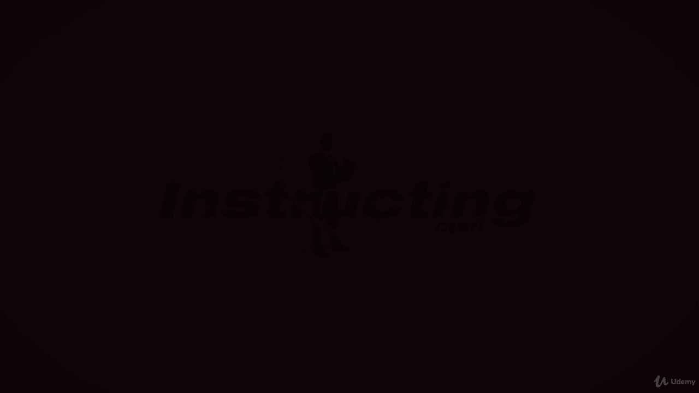
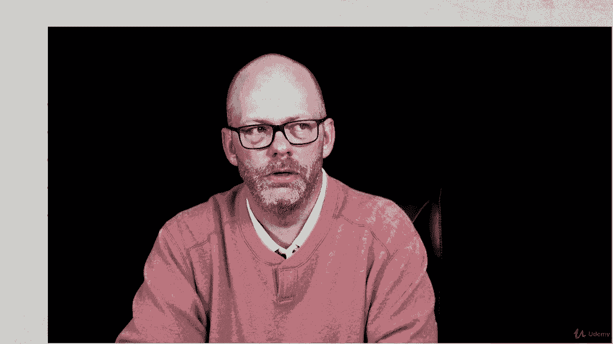

# 【Udemy】项目管理师应试 PMP Exam Prep Seminar-PMBOK Guide 6  286集【英语】 - P180：13. Manage Quality - servemeee - BV1J4411M7R6

。Our next process to discuss is manage quality manage quality is ensuring that the work is done properly。

 so this is an executing process that we do the work correctly we have quality built into our approach so manage quality it's really all of our planning and the implementation it's sometimes we call it QA for quality assurance the technical process name is manage quality。

QA or manage quality happens before and during project execution。

Continuous process improvement is part of managing quality。

 We want our processes to be executed properly。Mananaage quality is everyone's responsibility。

 that's a good exam question。You might have a QA department and they will tell you or they will do the QA activities for your project。

Let's look at the Es for manage quality。The inputs， the project management plan。

 specifically the quality management plan。We have project documents， the lessons learned register。

Quality control measurements， quality metrics in the risk report。And organizational process assets。

Now tools and techniques here for managing quality， we have data gathering， specifically checklist。

 we have data analysis， so we're talking about alternatives analysis， document analysis。

 process analysis， and root cause analysis。We have decision making once again。

 that multi criteria decision analysis。Data representation， so affinity diagrams。

 we'll see a cause and effect diagram， flow charts， hist diagrams， matrix diagrams。

 and scatter diagrams。We'll do audits to ensure that we're adhering to our QA policy。

Will design for X， a new term。We'll do problem solving and quality improvement methods。

Our outputs of managed quality will have quality reports。

We'll have our test and evaluation documents。Change request， you'll have updates to the PM plan。

Specifically， your quality management plan， the scope baseline。

 the schedule baseline of the cost baseline， and then we have updates to our project documents like the issue log。

 lessons learned， and the Ri registerister。Let's look at some key tools and techniques here。

 a checklist， we're doing the same type of work over and over。

 so let's develop a checklist so the work is executed properly。Again， alternatives analysis。

 documents， analysis， it's a good way of understanding what our quality requirements are。

 What about process analysis， Are we doing our 49 processes correctly， and our internal processes。

 Are they holding us back， Are they a constraint。Root cause analysis willll see this again with control quality。

 but it's a way of studying what causal factors are contributing to the effect to the problem。

A matrix diagram just a table， a scatter diagram is a way of tracking two or more variables。

 and the closer they trend， the more likely there's a relationship between the two。

 we'll see that in quality control as well。And then a cause and effect diagram is a way to visualize our root cause analysis。

 flow charts， It's just order in order out。 It's a flow of data， a flow of information。

 how things interact with one another and move through a system。

 And a histogram is just a bar charts。 All a histogram is。

You may have to complete a quality audit in your project。

 A quality audit is a way to document the best practices that were used and what you need to improve upon so any variances what needs to be improved so recommend of best practices。

 and then we document the quality audit in lessons learned， so completing a quality audit。

🎼Okay， great job， keep moving forward， I'll see you in the next lecture。

