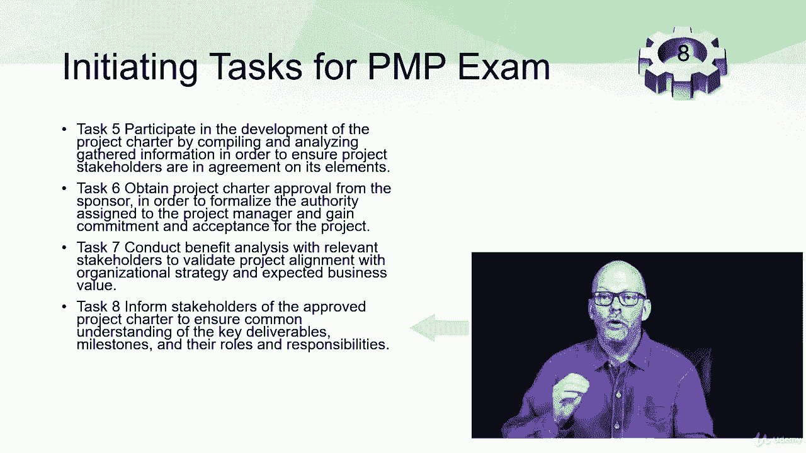

# 【Udemy】项目管理师应试 PMP Exam Prep Seminar-PMBOK Guide 6  286集【英语】 - P19：2. Initiate the Project - PMP Exam Domain I - servemeee - BV1J4411M7R6

你的目标和我的目标都是疯狂的，是你在传递P，为了通过PP，我们真正需要看的是你会测试什么，我是说，这么多人不花时间考虑，PMI给我们的非常具体的细节，将在上面测试，所以在这一节，正如我提到的。

我们将遍历所有这些不同的领域，从启动项目开始，所以启动这个项目，这是PMP考试领域一，这是考试的百分之十三，所以大约是两个六个问题，它基于两个引脚机器人引导过程，章程并确定利益攸关方。

所以你会有两个六个问题对两个过程，所以知道这一点真的很重要，注意这些过程，有八项任务你要做，您创建一个章程并启动项目，基本上创建一个章程并确定利益相关者，所以在PMP手册中，这些是任务，我们要完成这些。

所以这些有八个任务，占两个的两个过程，你考试的6%，一两个，六个问题，好的，所以第一个任务是执行项目评估，所以记住这是启动，因此，根据现有资料，教训，学习过去的项目。

所以你的组织过程资产的一部分将帮助你启动项目，你将会见利益相关者，你会感觉到这是多么可行，创造这些新产品或服务，所以这是你认为开始一些开始工作的第一个任务，你所做的。

第二个任务是你要寻找关键的可交付成果，所以为了创造宪章权利而发起，我们对这个项目将要创造的东西有一个很大的了解，那么关键的可交付成果是什么，什么是业务需求和业务需求我们所说的价值，什么是成功。

我们怎么知道我们做完了，我们怎么知道我们成功了，这里的第三个任务是做一些利益相关者分析，当我们谈到利益相关者时，我们将详细讨论这一点，平波第十三章，但在这里我们正在发起，因此。

您将使用一些工具和技术进行利益相关者分析，因此，当您开始为您的项目确定涉众时，你也在做一些分析，你想了解他们的恐惧或威胁是什么，甚至感知到的恐惧和威胁，启动的第四个任务是看看什么是高级需求。

因为你在创建一个宪章，你的假设和限制是什么，比如团队是否支持融资限制，也许是最后期限，这样你就明白了你必须处理什么，这将帮助你提出如何完成这个项目，你们的实施策略是什么？所以这都是一个倡议。

这是我们八项任务中的四项，让我们来看看这里的第二批，所以我们的第二组四个任务，第五项任务是参与制定好项目章程，这与我们将要看到的直接相关，在项目集成管理中，你必须创建一个宪章。

第六项任务是你希望宪章得到批准，所以你需要合适的赞助商在你的章程上签字，需要一个有正确权威的人，可以在项目中做出决定，第七项任务是你要做一个效益分析，那么这个项目将创造什么，它为组织创造了什么商业价值。

并注意到它与相关的利益相关者一起说，这里有一点线索，我们说的是业务分析师，所以还有另一个采购经理人指数认证，采购经理人指数，所以一点提示，有一些商业分析师，我们将在稍后讨论项目集成管理时讨论这个问题。

但我们会经常看到业务分析师，当我们在课程中深入时，尤其是在这里范围和需求聚集得很好的情况下，在发起，这一切都是为了了解我们试图创造什么，这是否符合我们的组织战略和业务价值的目标。

最后一项任务是向利益相关者通报已批准的章程，然后在利益相关者之间取得一些共识，我们要创造的东西，好的。

这就是从PMI，那不是我编的，这就是从pnp手册中的pmi中得到的，在接下来的一个作业中，我要你下载这本手册，但这正是你被测试的PP，就开始而言好吧，干得好，勇往直前。

