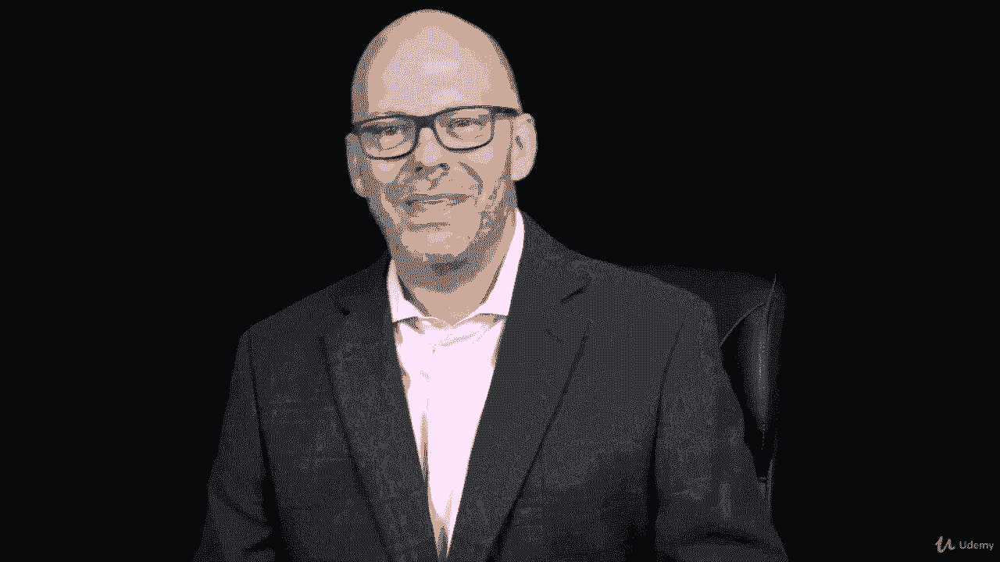

# 【Udemy】项目管理师应试 PMP Exam Prep Seminar-PMBOK Guide 6  286集【英语】 - P191：1. Section Overview Project Resource Management - servemeee - BV1J4411M7R6

。

In this section we're going to talk about project resource management。

 This is Cha 9 in the Pimba guide on project resource management。

 This used to be called human resource management but now it's all resources so people and physical resources like equipment and materials and things like that So in this section a lot of business to discuss we're going to look at some trends in emerging practices and how does this work in a predictive life cycle or an adaptive environment So we'll talk about agile a little bit preparing for resource planning and then some organizational theories you need to be familiar with So some different theories that you'll want to nail down and be able to recognize the characteristics of these for your PMP exam we're talk about acquiring resources and negotiating for resources and developing the project team。

Versus creating team building activities。 How do those two go together， Well they do。

 and we'll talk about naturally developing the project team。

 relying on some general management skills， rewarding the project team， completing assessments。

 managing the project team。Controlling those resources and then I have an activity for you about managing your project team So you can see there's a lot of information here。

 but really we're talking about planning for team development and bringing your team together and building that team and then developing the team and managing the team The whole goal here is that we need the team because they are experts to do the work so we need to be able to have experts that can get the job done。

 And so we need to stand of the way as project managers yet lead and manage what they do。 All right。

 let's hop in here and talk about this in more detail。😊。

