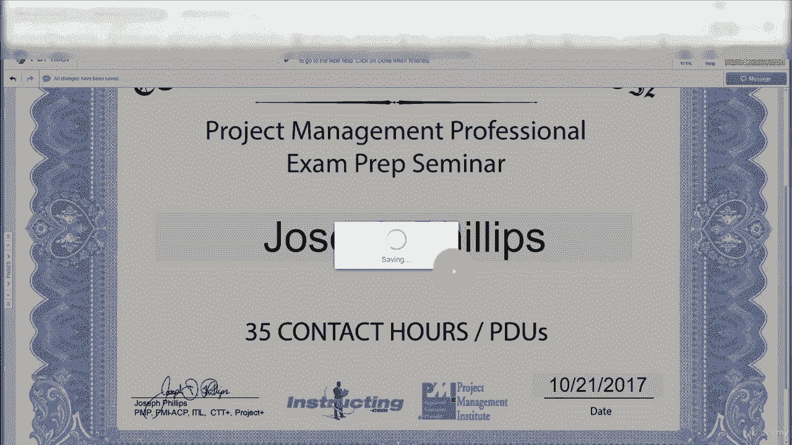
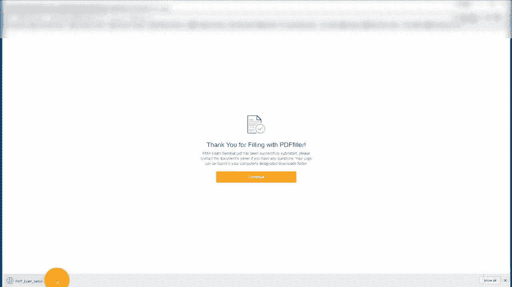
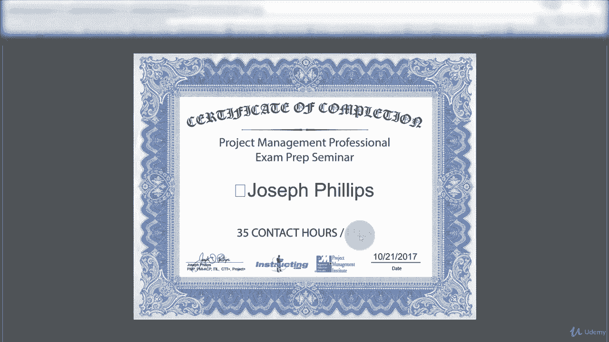

# 【Udemy】项目管理师应试 PMP Exam Prep Seminar-PMBOK Guide 6  286集【英语】 - P2：2. Certificate of Completion - servemeee - BV1J4411M7R6

你确实获得了这门课程的结业证书，正如我多次提到的，你只需要结业证书就可以交给PMI，如果你被审计得很好，你可能想去拿结业证书，也许你想把它挂在你的办公室里，或者留作纪念。

提醒你在这门课中所获得的所有乐趣，但你想要它的主要原因是如果你被审计了，你把它给PMI，那么你怎么拿到这份结业证书呢？你想要本课程最后一节课的结业证书，所以你已经完成了整个课程，下一节课是如何获得证书。

你必须证明课程完成，你必须发誓你已经完成了整个课程，您的完成情况将在此学习管理服务器中跟踪，所以如果你被审计，PMI会查看该证书，如果他们问我们，你完成这门课了吗，我们可以看看你有没有。

所以你必须完成每一项活动，每次任务，每次讲座，整个课程，你不能留一些以后用，一切都必须完成才能真正获得完成证书，正如我提到的，PMI可以审计你，如果他们这样做了，他们会想看结业证书的，嗯。

我要向你们展示这个过程是什么样子的，你怎么拿到证书，所以我们这里很清楚，你就不会对结业证书有任何疑问了，现在，我要给你看，让我跳过去，我要给你们看这是以前的课程，所以在这道菜中看起来会略有不同。

但过程是一样的，好的，这是下一节课你们会看到的，采购经理人指数结业证书，我要表达一点谢意，然后你会在这里看到这个说明，在这个地址填写表格好的，所以我们现在要点击它，它会带我们去一个网站。

你要在那里填写表格，所以恭喜你完成了，您将输入您的姓名和完成日期，然后我证明我已经成功地完成了上面的名字课程，您将单击继续，好的，所以这就是你拿到证书的地方，这是您想要的证书。

所以你在这里有几个弹出窗口，所以你必须输入你的名字，所以输入你的名字和你身份证上的一样，并且您已经在PNP应用程序中输入了它，然后如果你向下滚动一点，所有的权利，你完成它的日期，所以我今天的约会。

然后做得很好，然后是的，去就好了。

所以当你完成这个的时候会很相似，好吗，然后它准备完成的PDF格式，然后当它准备好这个，然后你可以下载并打印出来，或者保存，或者你需要做的任何事情，所以在这里，我会继续下载它。

如果我们看看，有什么的PDF，我只是做了我刚刚完成的事情，好的，所以上面有我的签名，我教这门课，这是我们的标志，PMI注册教育提供商标识等，它是三五个接触小时或PTO使用。

如果您目前是P P，这就是你获得结业证书的过程，所以是的，你会在课程结束时得到一个，所有的权利。

