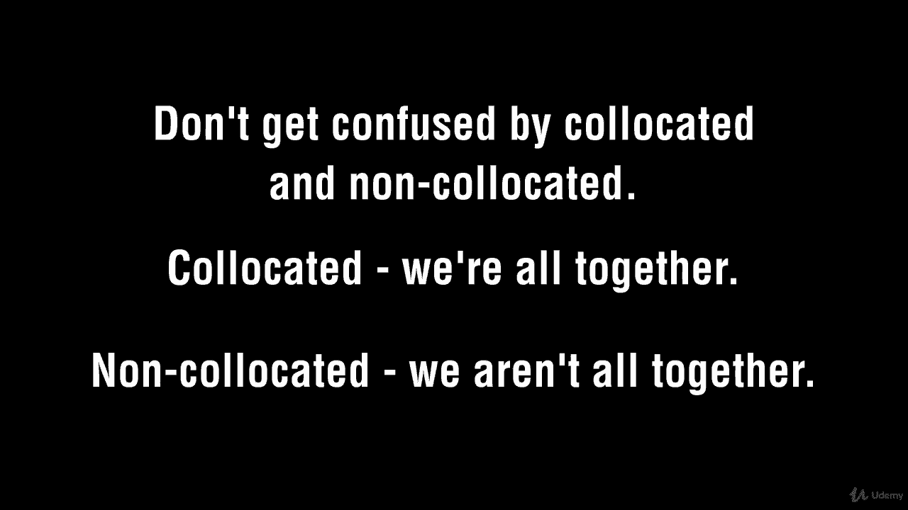
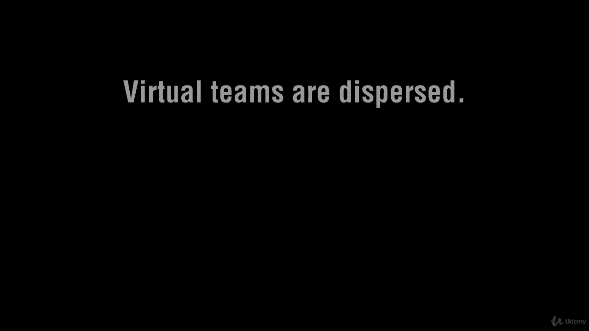
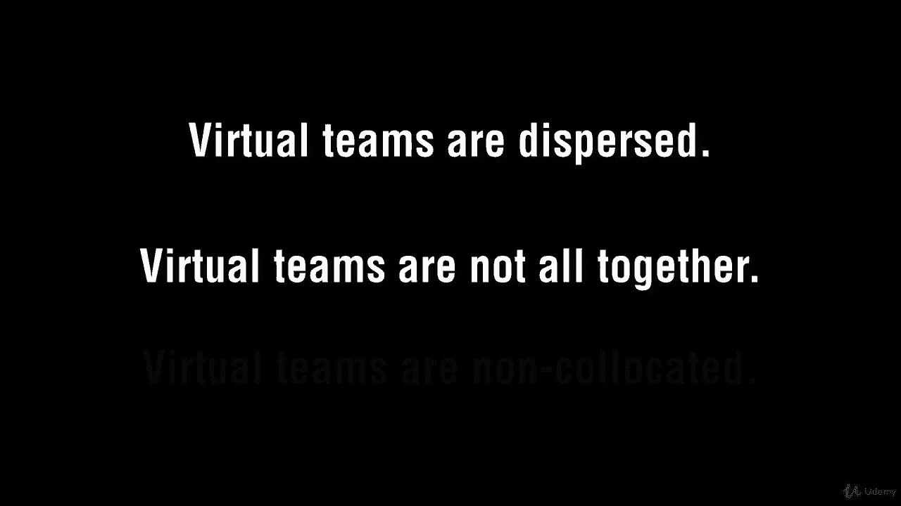
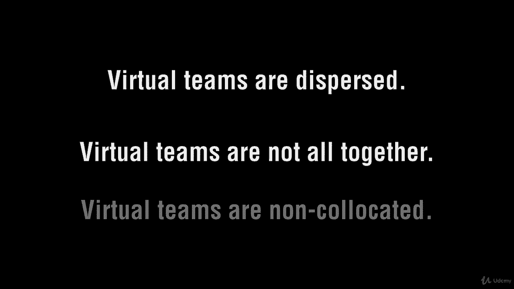

# 【Udemy】项目管理师应试 PMP Exam Prep Seminar-PMBOK Guide 6  286集【英语】 - P202：12. Working with Virtual Teams - servemeee - BV1J4411M7R6

。I guarantee you， you're going to have a question or more about virtual teams on your exam。

So you're going to be working with virtual teams for your exam。

 whether you do out in real life or not， so you need to know some characteristics and challenges of virtual teams A virtual team is also known as a non colocated team we're not all in one spot if we're in a virtual team so we are non colocated。

Communication is paramount with virtual teams because we lose that face to face communication and people are dispersed。

 so we want to make certain we are effectively communicating with virtual teams。

There are plenty of technological solutions so you can do web meetings and audio conferences and using some collaborative software so that not only you but the other project team members can communicate with one another。

 so obviously virtual teams introduce some challenges。

A quick review of the headlines of virtual teams you have again people from all over the world people can work in different geographical areas all over the world。

 People can work from home and with different hours。

 mobility issues can still be included and then travel expenses can be reduced。 Okay。

 we have seen that over and over and over right so you've got virtual teams now so when you get those questions on your exam。

 you've got it repetitions the mother of learning。 so now you know all about virtual teams。

 All right， keep moving forward。