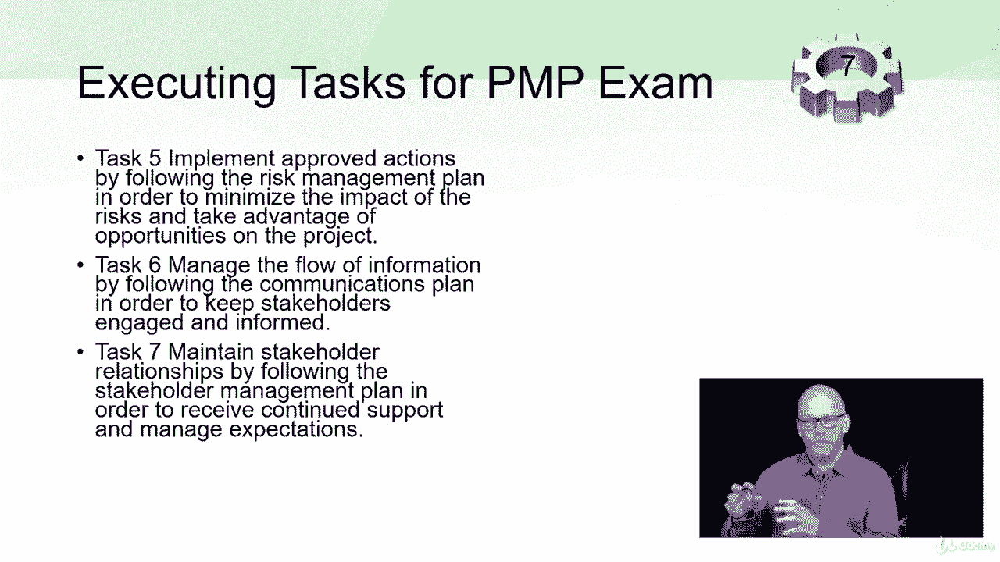

# 【Udemy】项目管理师应试 PMP Exam Prep Seminar-PMBOK Guide 6  286集【英语】 - P21：4. Execute the Project - PMP Exam Domain III - servemeee - BV1J4411M7R6

我们对您的PMP考试的下一个任务领域是项目执行，这占PMP考试的31%，所以在执行过程中大约有62个问题，有七个任务，有十个针BokeProcess，这样你就可以看到，这确实是你要注意的部分。

项目管理是把事情做完，所以说，如果你想把事情做完，你必须执行，所以真正了解你考试的这些任务，现在我们来看看这七个任务，第一项任务是获取和管理资源，所以你想在你的团队中获得资源，所以我们说的是人。

但我们也需要获取和管理物理资源，所以这里也涉及采购，材料和设备，我们的第二个任务是根据您的项目管理计划管理任务执行，所以你需要工作授权，你将领导和发展项目团队，以便他们能够实现项目交付品。

所以我们第九章的资源管理计划也会回到这里，实施质量管理计划，所以我们说的是质量保证和质量控制，在这里执行，我们担心质量保证或保证和管理质量，质量被计划到项目中，在质量控制中没有检查的在下一个工艺组中。

现在它是确保或管理质量任务4是实施批准的更改，以便当涉众提出更改请求时，或者当我们有纠正措施或预防措施时，这些变更请求将通过集成的变更控制流动，我们将在第四章看到确切的过程。

但是当我们做集成的变更控制时，如果我们批准了更改，然后那些被允许进入项目，所以我们必须让这些经过批准的改变回到我们的计划中，一旦我们把它放在这里执行，例如：我们保证这项工作正在进行中。

所以这一切都是为了实现那些批准的更改，在执行任务五的过程中还有三项任务是执行经批准的风险管理行动，所以我们说的是最低限度，尽量减少影响，可能是一个机会，所以概率和影响风险事件的概率来利用项目中的机会。

现在一个机会是一个积极的风险事件，所以你有机会节省成本，或者为了早点完成或者为了节省时间，这些都是我们通常希望发生的机会，风险是一种威胁，我们希望不允许这些事情发生。

我们会在关于风险管理的第11章讨论这个问题，但它与执行有关，因为我们必须做那些活动，任务六是管理信息流，所以我们在讨论通信管理计划，你有一个沟通的计划，所以现在你必须交流。

第七项任务是保持利益相关者的关系，因此，让利益相关者参与进来，创造协同效应，并参与进来，并让人们对你的项目感到兴奋，所以这都是利益相关者管理，我们会在第十三章的针盒里看到。

这是我们为PMP考试执行的七项任务，所有的权利，勇往直前。

