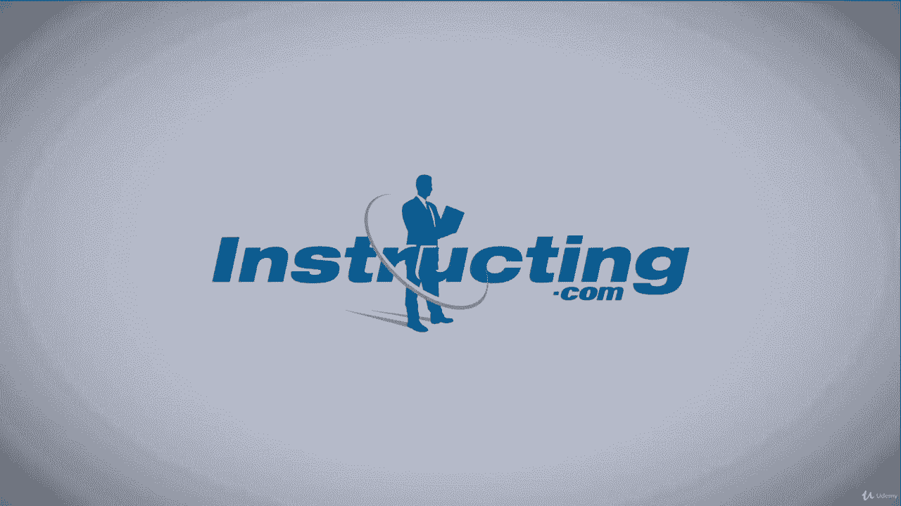

# 【Udemy】项目管理师应试 PMP Exam Prep Seminar-PMBOK Guide 6  286集【英语】 - P221：12. Managing Project Communications - servemeee - BV1J4411M7R6

Of course throughout your project you'll also manage project communications this means that you're gathering project information and you are distributing information。

 working with those different stakeholders， archiving any communication you have。

 giving an actual distribution of the information and then the proper stakeholders get the appropriate information at the right time let's look at our EOs for managing project communications。

Our Es here， we have our inputs， our project management plan， like the resource management plan。

 the communications management plan， and the stakeholder engagementage plan。

 project documents like the change log， the issue log， lessons learned， quality reports。

 risk reports， the stakeholder register。You'll also use work performance reports to manage communications。

 this is an input。An EEF and OPA。Tools and techniques here to manage communication。

 communication technology， methods and skills， now skills we're talking about communication's competence。

 the ability to communicate and to communicate well in accurately and with precision。Feedback。

 nonverbal communications， presentations， your PMIS。

 interpersonal and team skills like active listening， conflict management， cultural awareness。

 meeting management， networking， political awareness and meetings。

My outputs will be project communications， the project management plan updates。

 communications management plan updates， and the stakeholder engagement plan。

Project document updates here the issue log， lessons Learn， the schedule。

The registerister for risk and the register for stakeholders and OPA updates。

So what does it mean to do communications management where we're talking about being effective when we communicate。

 talking about having the right centered receiver model and working with stakeholders and working with the team to communicate to the right people at the right time？

Choosing the right media， emails， texts， a report， presentation， a website。

 like a pool communication， having appropriate writing style。

Meeting management is part of communications management we know how important that is giving presentations and giving a good facilitation of meetings being a facilitator and active listening。

Some tools for communication management， think about the technology that we all use。

 the agreed upon technology， the different methods you can communicate。

 the skills it takes to communicate， being able to communicate。

 remember those five Cs we talked about earlier in this section。

 offering feedback and receiving feedback， paying attention the nonverbal communication。

 and your project management information system can help as well。A few other tools。

 project reporting。Interpersonal and team skills， we've seen that a lot and of course。

 meeting management， no one wants to go to a meeting that's a WOT meeting。All right， great job。

 way to finish this concept here about communications management I'll see you in the next lecture。

