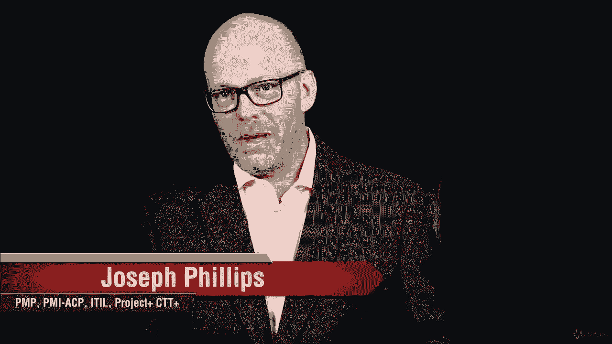
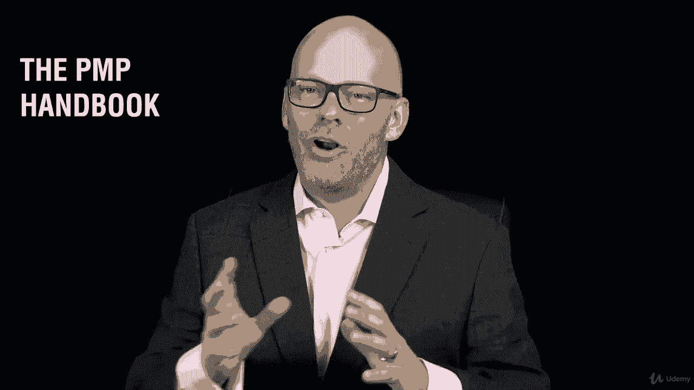
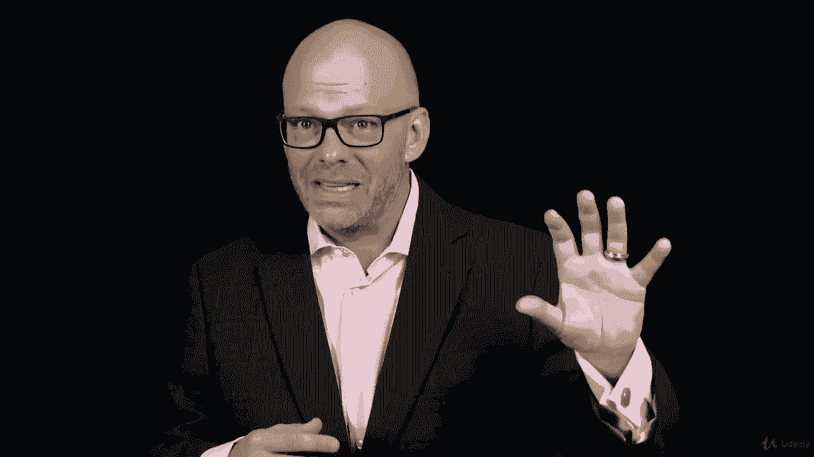

# 【Udemy】项目管理师应试 PMP Exam Prep Seminar-PMBOK Guide 6  286集【英语】 - P24：8. Review the PMP Exam Domains - servemeee - BV1J4411M7R6

完成关于PMP考试域的这一节做得很好。

我知道这一节有很多信息，其中一些真的很乏味和枯燥，但对我们来说，回顾这一点很重要，我鼓励你回到这个问题上，或者回到你定期下载的P和P手册，因为你真的需要知道这些信息，当你进去准备通过考试的时候。

这真的很重要，因为这是你被测试的东西，不要忽视这堂课的内容，所以我们谈到了我们谈到的发起的五个领域，所以这五个领域和其中的任务是你真正测试的，在接下来的课程中，我们将把这些业务联系起来。

就像我们要看所有这些过程组，那么这与测试材料有什么关系，所以你们的任务是下载并阅读P和P手册。

你可以随时参考PP手册。

说这是我真正知道怎么做的事情吗，还是我应该多花点时间学习，所以当我们在课程中讨论这些话题时。

我们也在讨论与平背指南第六版有关的那些，这些应该是网格的，和你的学习努力，你知道你不是为了参加PMP考试而学习的吗，你在为通过考试而学习，我相信在心态上，我在学习准备考试，我正在努力学习以通过考试。

我认为让PM A对我们来说很重要，当我们学习时，我正在学习，我在做这项工作，因为我在研究过去，因为我得去拿，有区别的，我认为在必须做某事和想做某事之间你必须学习，就像家庭作业一样，对呀。

你在那里有负面的内涵，但如果我想做，然后我很兴奋，我可以做这件事，这是一个很好的机会，所以PMMA的一部分是考虑，我没必要这么做，这是我想做的事情，我选择那样做，你知道这对你的事业有好处。

会对你有好处的，作为项目经理，这对你的组织有好处，它会给你机会，我知道这很难，这是艰苦的工作，就像在说，你想去减肥，或者你想去跑马拉松，你必须放弃一些东西，比如馅饼、蛋糕和披萨，我喜欢的三件事。

但你必须放弃，为了能够减肥，跑马拉松，或者你有什么，这里也是如此，在我们努力通过PP的过程中，我知道你在放弃生活中的其他东西，我知道你可能是，你知道吗，去看电影，或者去看棒球比赛，或者看电视。

或者只是在周末放松一下，但你在做一个选择，你选择这样做，因为你意识到这是一种投资，这是奥巴马的一部分，我希望你们能做到这一点并在我们完成课程的过程中继续这样做，我会在这里提醒你这一点，所以PM一个PM。

积极的心态，干得好，保持下午马。

