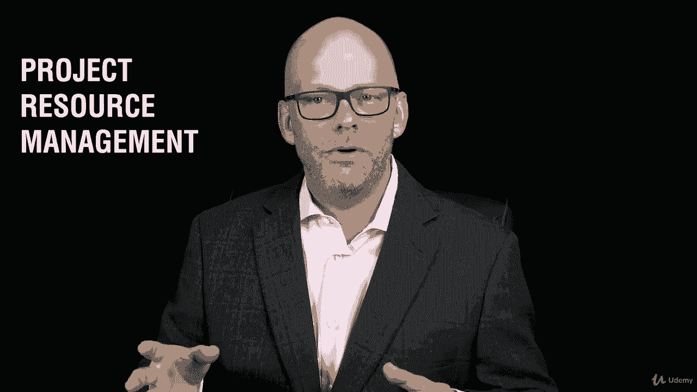

# 【Udemy】项目管理师应试 PMP Exam Prep Seminar-PMBOK Guide 6  286集【英语】 - P25：1. Section Overview PMBOK Guide, Sixth Edition - servemeee - BV1J4411M7R6

当引脚波导改变时，大约每三到五年。

在那里的某个地方总是有一系列的关心和担忧。

尤其是当人们处于，嗯，哪个版本的针盒，我应该为考试复习吗？

你当然在研究Pinboke的第六版。

在第六版中，有一些新的东西被引入，你在考试中需要注意的。

所以在这一节，我们要往下钻一点，深入针背。

第六版，所以如果你有一个平背指南。

我鼓励你有一个，现在是把它拿出来的好时机，你可以把什么。

我们将在本节中讨论桃子I。

所以我们要仔细看每一章，如果你没有平背指南，你可以沿着这里走，然后也许以后你想得到它，请记住，您可以获得豌豆指南作为您的PMI会员资格的一部分。

好的，所以我们要看看针背。

第六版，我们先来介绍一下，什么是针背指南，我们为什么需要它。

它是如何创建的，它是干什么用的？然后我们将看到平背指南第六版的新篇章，描述项目运作的环境。

所以我们看看环境的概念，然后我们会讨论项目经理的角色。

清楚地了解你作为项目经理要做什么。

你可以看到这两者是如何结合在一起的，你所处的不同环境会影响你作为项目经理的运作方式。

然后我们将进入知识领域。

所以这将在第四章的针盒中讨论，我们将讨论项目集成，管理。

然后我们来看看现在所说的项目进度管理，它不再被称为项目时间管理。

它的项目进度管理，成本管理是。

第七章在针盒里，第八章质量管理，然后我们看第九章和项目资源管理。

曾是HR人力资源管理。

但是现在Pinbois项目资源管理的第九章。

但这里有一些相关性，我们还有人力资源业务。

但现在我们也在谈论物质资源，材料和设备。

你有什么，所以我们将在接下来的比赛中看到这一点，然后我们进入第十章，关于项目沟通管理。

然后是M Pinboon项目风险管理的第十一章，关于采购的第12章。

然后是利益相关者管理，这些都是我们在本节要讨论的内容。

我确实有一个任务给你，你可能想看看。

是如何获得Pinback的电子副本。

所以我鼓励你们看看作业，如果你是PMI的成员。

你会得到一份Pinback指南，这是一种电子格式，我个人很喜欢。

因为这样我就可以搜索关键字，所以你一定要做那个作业。

尤其是如果你已经是PMI的成员，好的，让我们跳到这里，在Pinback指南中讨论这些组件。

这对我们剩下的课程也有帮助。

