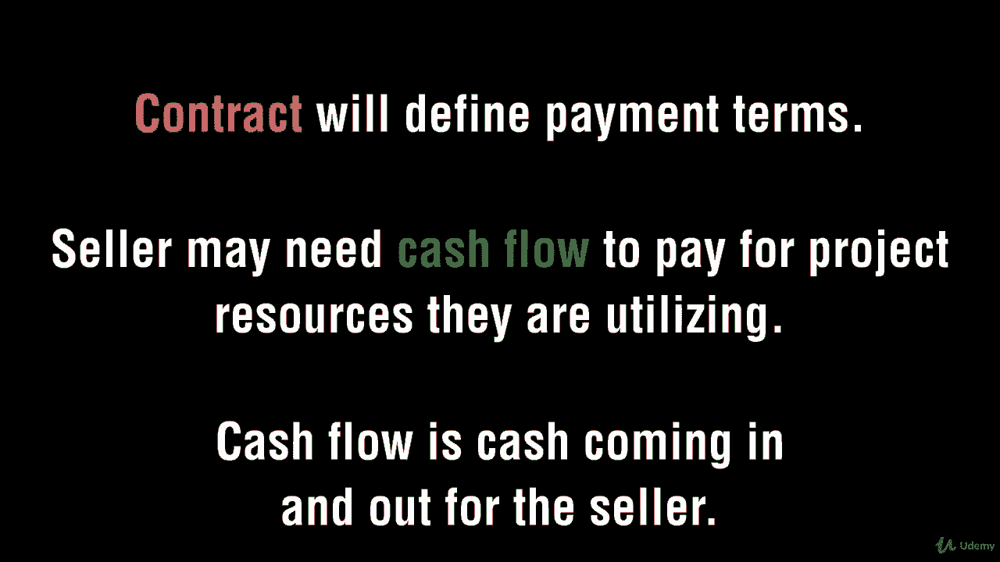
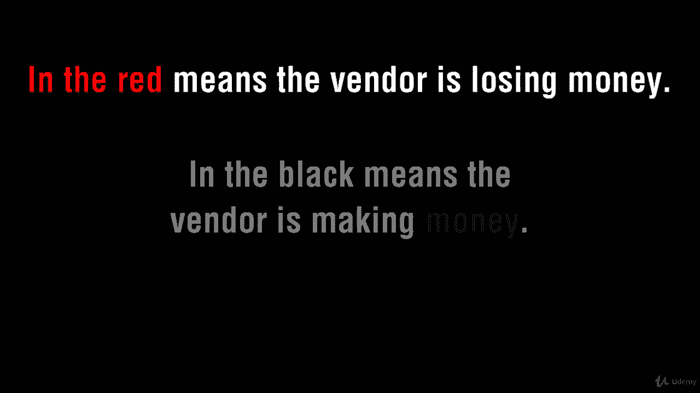
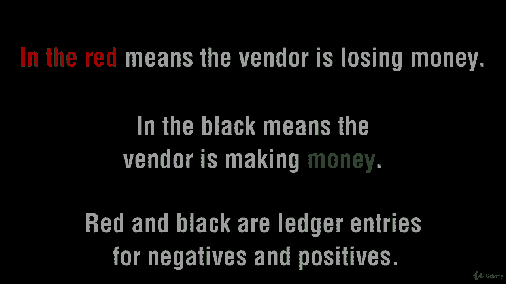

# 【Udemy】项目管理师应试 PMP Exam Prep Seminar-PMBOK Guide 6  286集【英语】 - P259：14. Preparing for Contract administration - servemeee - BV1J4411M7R6

。Let's talk about procurement administration when we get into procurement administration。

 it's things like making sure people are being paid on time and invoicing properly and using the right system to do a request for payment。

The seller's compensation might be linked to progress so they hit these milestones then they get paid if that's the case as the buyer I can't stall if they hit their milestones and it requires a review then I need to get out there and review it and make sure they're paid so it's both people have obligations here both organizations。

You might have to do a seller performance review as part of your EEF， that seller rating system。

 so if I'm working with the ABC electriclectric Company。

 then I need to review their work and put that in the seller rating system so then other PMs in the group in the organization can look at that and make a determination to buy from the ABC Eric company or not。

It's also a consideration for future assignments based on what happens in the current project。

Thank you very much performingform contract administration， we think about contract change control。

 do we need a new contract an addendum， is there an allowance for change in the contract？

Buyer conducted performance reviews so you build a house for me I'm going to go inspect it or the city inspector is going to do it on my behalf。

 It's kind of like scope validation， but it allows me to close out the contract rather than the project。

Performance reporting。Is there a payment system and records management system？ All right， good job。

 Keep moving forward。