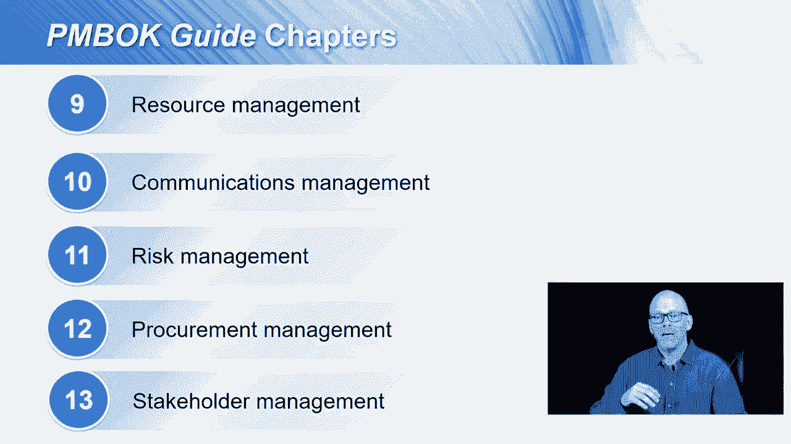

# 【Udemy】项目管理师应试 PMP Exam Prep Seminar-PMBOK Guide 6  286集【英语】 - P26：2. Introduction to the PMBOK Guide - servemeee - BV1J4411M7R6

在我们一起的时候，我已经经常提到别针指南了，你当然知道，Pinback指南是你大部分PP考试的基础，Pinback指南是PMI的出版物，它描述了公认的项目管理方法，它是项目管理知识指南的主体。

它不仅仅是项目管理知识的主体，项目管理知识体系真的要大得多，这是世界上关于项目管理的一切，所以这是一个普遍接受的做法的指南，世界上所有的信息，Pinback指南描述了项目管理的良好实践。

这些是在任何组织中如何做项目的普遍接受的方法，医疗保健，IT制造，你有什么，这些是普遍接受的做法，它还建立了一个通用的术语词典，我们称之为集成管理，无论学科是集成、管理、质量、沟通还是风险。

或者你有什么，这就是这个术语的意思，这是PMI考试的基础，正如我提到的PMP考试，也是为了C P，m，PGP，在某种程度上，ACP，风险管理专业人员和调度专业人员，所以它是一个，这将是一个指南。

对所有这些PMI认证都有一定的影响，让我们来谈谈平背指南，正如我提到的，它是项目管理知识体系的指南，压倒性地，你的PMP考试将基于针背，i，本课程以弹球指南为基础，第六版，正如您已经看到的。

有五个过程组，里面有四个九个过程，这五个过程组，这五个过程组分布在十个知识领域，第四章到第十三章和PinboGuide，让我们谈谈皮马指南的章节，所以第一章、第二章和第三章是一个高水平的概述。

让我们对项目管理有了很好的了解，以及Pinbuck指南如何适应项目管理的世界，首先，第一章只是一个介绍，这只是一个快速的开始，为什么我们需要钉回指南，以及它的作用，第二章是关于项目运作的环境。

对您的组织如此独特，您操作的环境，我们接下来会讨论这个，第三章是项目经理的角色，作为项目经理，你普遍接受的角色和责任是什么，第四章是项目集成管理，我喜欢把这一章叫做齿轮，这是唯一的知识领域。

集成管理是一个知识领域，每个流程组中至少有一个流程，所以开始规划，正在执行，监测，控制和关闭，集成管理跨越所有这些流程组，所以这是一个相当大的章节，因为在集成管理的知识领域中有很多过程。

第五章是范围管理，然后调度成本质量，第九章资源管理，关于来文的十条，关于风险的十一点，采购问题，利益攸关方管理，那就是那个针背男，只是快速参观一下。

随着我们越来越深入课程，我们将详细研究这些章节中的每一章，所以这是在陷害我们，这都是基础和一砖一瓦，我们快到了，打好基础是，我们进入每一章的细节。

