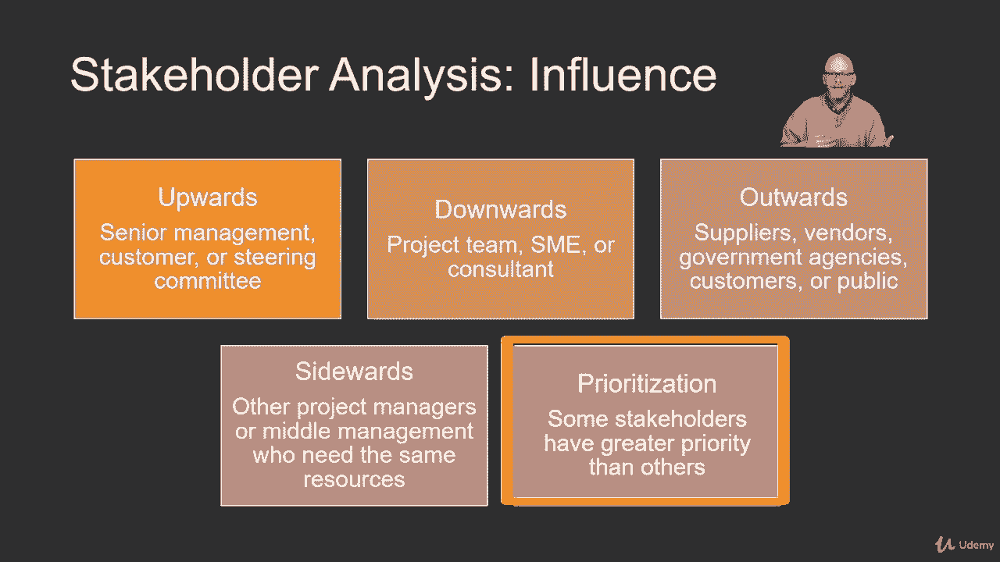

# 【Udemy】项目管理师应试 PMP Exam Prep Seminar-PMBOK Guide 6  286集【英语】 - P266：4. Performing Stakeholder Analysis - servemeee - BV1J4411M7R6

Stakeholder analysis is an activity that you'll do to really study and understand stakeholders in your project。

You want to understand what are stakeholders concerns。

 how do they feel threatened or excited about the project。

 and even what are their perceived threats so you can combat those or put those at ease。

So stakeholder analysis is we're identifying stakeholders。

 but we're also understanding their information， we're understanding where they're coming from。

Throughout the course in the Pimbaok you'll see this phrase of key stakeholders key stakeholders are really people in a decision making role。

 so you're project sponsor or functional manager or a representative from a stakeholder group。

 those are key stakeholders， they make decisions。We want to interview stakeholders to identify stakeholders so what I mean by this is sometimes one of the best ways to find new stakeholders is to just ask an existing stakeholder who else should be involved in this project or who else should I talk to about this and then they can ponder it and then give you some ideas of who else as a stakeholder。

A phrase that I like to use is to describe stakeholder stakes。

 a way of seeing where stakeholders are staking out opinions or feelings about your project。

So their interest level， how are they affected by the project， that's what people are interested in。

 whether they're for it or against it， they see how the project affects them in their work life or even their personal life。

Then what about their rights， do they have legal rights in your project or even moral rights？

The ownership， you have a stakeholder that owns an asset like a piece of equipment or a property that's going to be affected by your construction project。

Knowledge stakeholders are often seen as subject matter experts。

 especially when it comes to requirements gathering and really understanding the requirements for the project。

How do they contribute to the project， what's their stake there， that they provide money， resources。

 or they may just have some general support and they're telling others why this project is good and needs to happen。

There are three steps that you should know for stakeholder identification。

You identify the project stakeholders and what is their interest， their influence。

 their contributions， their contact information， always important。

 and their expectations we prioritize the stakeholders based on power。Influence and impact。

And if we want to anticipate and then plan for how these stakeholders are going to act based on different project scenarios so you're thinking about as you do different key activities or milestones or what if scenarios。

 how will that affect different stakeholders like a delay or an increase in cost or an activity that may disrupt their work。

 so I want to anticipate that and engage the stakeholder about that potential issue？

Stakeholder analysis， we can use a grid like we see here to determine the stakeholders and how we manage or engage those different stakeholders so there's three different types of grids they're all very similar。

 you have a power interest grid and that's what I'm showing here。

A power influence or an influence impact。So on the Y axis。

 you can see we have power and on the X axis， you see that we have interest。

So you take your stakeholders and then you plot them out in these different squares based on the high to low amount of power and then you cross that with the low to high amount of interest so for example。

 you might have someone that has a high power in the project or the organization but they have a low amount of interest in your project。

 so you might put them down in the monitor square。A stakeholder that has a high amount of power and a high amount of interest you would manage closely。

And so you do this for power influence or influence impact， it works the same way。

There's also what's called the salience model where you gauge stakeholders on power。

 urgency and legitimacy， so how much power do they have？

Is it an urgent request or they urgent it for the project to get done or a particular requirement or are they even legitimate。

 though do they even belong in the project or is there demand even legitimate so this is something you should know for your exam you'll probably see something like this or mapping stakeholders out so this is stakeholder analysis in a power interest grid。

When we think about stakeholder analysis， we're really thinking about influence。

 so how does stakeholders influence the project and how does the project manager and the project team and just the project itself。

 how does it influence stakeholders？So we think about influence， you think about upward influence。

 so how do we influence senior management or a customer or even a project steering committee。

Downward， think about the project team， a SM or a consultant。Outward influence。

 the project manager can influence suppliers， vendors， government agencies， customers or the public。

Sidewards is where I am working with other project managers or even middle management for the same resources that my project needs。

And then we do prioritization， so some stakeholders are more important than others。

 so how do we influence those？

The stakeholder register is a document which has the stakeholder name and classification。

 we give the geographical location where we can find those people。

 what's their role and contribution and what about their particular requirements and expectations？

The stakeholder register also documents what's their influence over the project and how the project aimed to influence them。

Which phase of the project will that stakeholder be most interested in and then give some details about the stakeholders's role so are they an internal or external stakeholder。

 are they supportive of the project or they neutral or negative or whatever the case may be。

So the stakeholder register is a document you'll use throughout the project。

 so this is one of those examples where here we are at the end of the Pimbaok guide and this is a document that we've used at every one of our knowledge areas as stakeholders interact with the project and we interact with stakeholders so the stakeholder registers are really important document and it's integrated like we saw way back in chapter4 the Pimbaok guide with project integration management。

So know the stakeholder register in stakeholder analysis。

