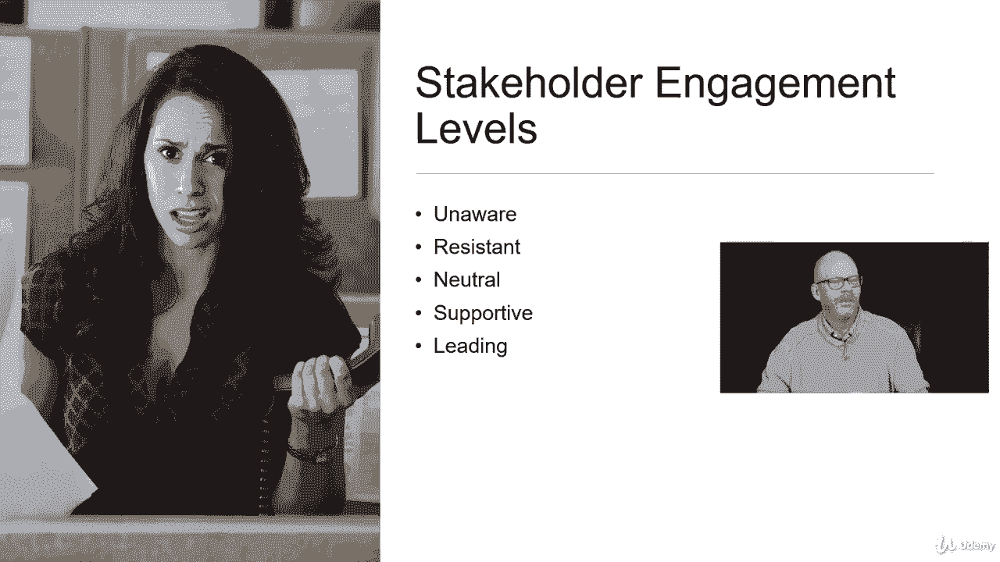

# 【Udemy】项目管理师应试 PMP Exam Prep Seminar-PMBOK Guide 6  286集【英语】 - P268：6. Planning Stakeholder Management - servemeee - BV1J4411M7R6

🎼。Now that we've identified stakeholders， we want to go ahead and talk about how will we plan stakeholder management。

 how will we create a plan to engage our stakeholders。

 so we want to develop a strategy for stakeholder engagement。

 so what will be our approach and our plan， what techniques will we use to engage stakeholders and keep them engaged throughout the project。

So we need an analysis of stakeholder needs， we want to create a plan for managing stakeholders and when I say managing stakeholders。

 we're not talking about telling them what to do， we're talking about engagement。

 that sense of ownership and participation and buy in in our project。So we're creating this strategy。

 it's an analysis of what stakeholders want in the project。

 what's important to stakeholders in engaging them in the project。

It's an alignment with other stakeholders， so we think about all the different stakeholder groups that may have competing objectives。

 but we need to create some management there and a strategy of how do we align these objectives for the best interest of all stakeholders and the organization。

We also prioritize stakeholders based on a lot of different factors， their power， their influence。

 their impact on the project， who's paying for the project。

 so those are all things that we talk about here in planning stakeholder engagement。

Our es to plan stakeholder engagement， the charter， your project management plan。

 we're going to be looking at the resource management plan。

 communications plan and our risk management plan。 some documents that will need the assumption log。

 change log issue log， the schedule， the risk register， the stakeholder register。

 agreements with our vendors and between departments。

EEF and OPA so a lot of those inputs we've seen over and over as inputs。

 so it's no different here we're just taking it in light of the stakeholder engagement。

Tools and techniques， expert judgment， stakeholders are experts， data gathering， so benchmarking。

 data analysis， assumptions and constraint analysis， decision making。

 so doing some prioritization or ranking， and then we'll do some data representation like mind mapping。

 we'll create one of those stage stakeholder engagement assessment matrix。

 a table of how engaged stakeholders are in our project and then create goals for stakeholder engagement。

 and of course we have meetings。The only output of plan stakeholder engagement is the stakeholder engagement plan。

You may have to update this plan periodically based on what's happening in the project。

 so we start a new phase， we may have a new group of stakeholders that we have to address now。

 you might have changes that happen in your organization or industry that would introduce new stakeholders and change the way you engage stakeholders or include those new stakeholders in engagement。

So we also want to consider that the process outputs can trigger a review of stakeholder engagement strategies。

So what this means is the results of any of our 49 processes could cause us to have to go back and look at stakeholder engagement。

 so a good example is risk， you have an output of risk。

 you've identified a new risk where you have to do a risk response that may cause some stakeholder engagement or a change in our strategy。

 same thing with a quality issue and scope validation。

 so the output of a risk can cause us to go back and think about how do we better engage our stakeholders。

All right， there are five levels you need to know when it comes to stakeholder engagement。

 so we do an analysis of where the stakeholder is now。

 and then that helps us create goals of maintaining or improving engagement。

So an unaware stakeholder， they don't know your project even existence。

 so we've missed them in initiation， so they're completely unaware they're not engaged obviously because they don't know about it and typically those aren't going to be very happy people when they find out about your project and what it's going to do to them。

You might have a stakeholder that's resistant， they really don't want your project around。

 they feel like it's getting in the way it's not needed and they're not a big fan of your project。

You have a stakeholder who's neutral， like those people in procurement， they're just neutral。

 they're doing their job to help procure。They're supported that they're in favor of your project。

 that's a great project， go up。Or they're leading， they're very excited about your project and they want it to be successful and they're acting like a champion for your project and those are always great stakeholders to have unless they start getting a little too leading or a little too excited and then they kind of get in the way。

So you've got a balance， we want that， but we have to balance。So the stakeholder engagement plan。

 the stakeholder engagement plan， as we say what's the desired level of engagement and the current engagement level。

 what's the scope and the impact of change to stakeholders we want to look for interrelation and overlap among our stakeholder groups。

What are our communication requirements what information will be distributed so back to our communications management plan。

 why are we distributing that information and what's the timeframe and the cadence for distribution of that information so you can see that the stakeholder management plan really has a lot of overlap with the communications management plan so the stakeholder engagement plan I should say has overlap with our communications management。

All right， great job。🎼。