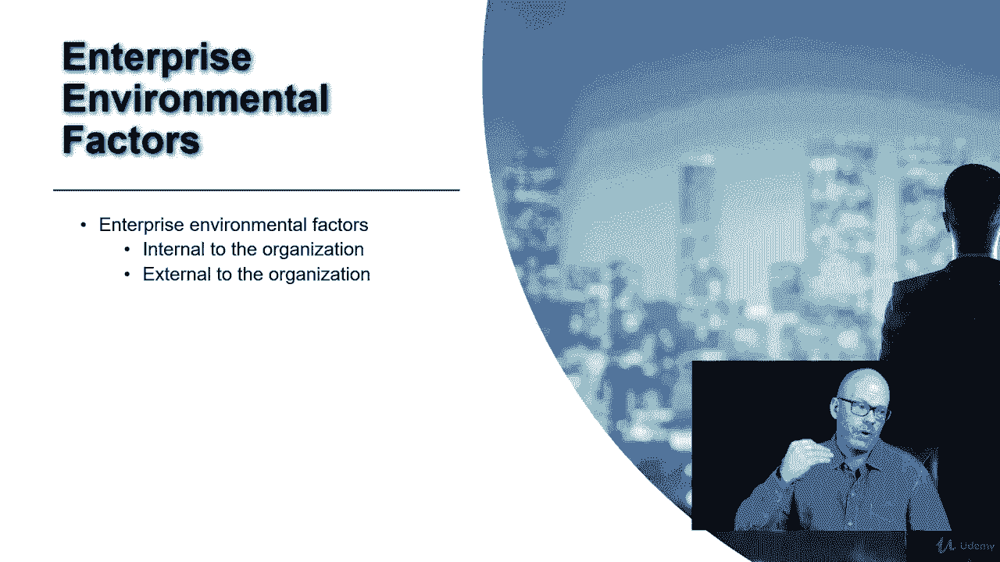
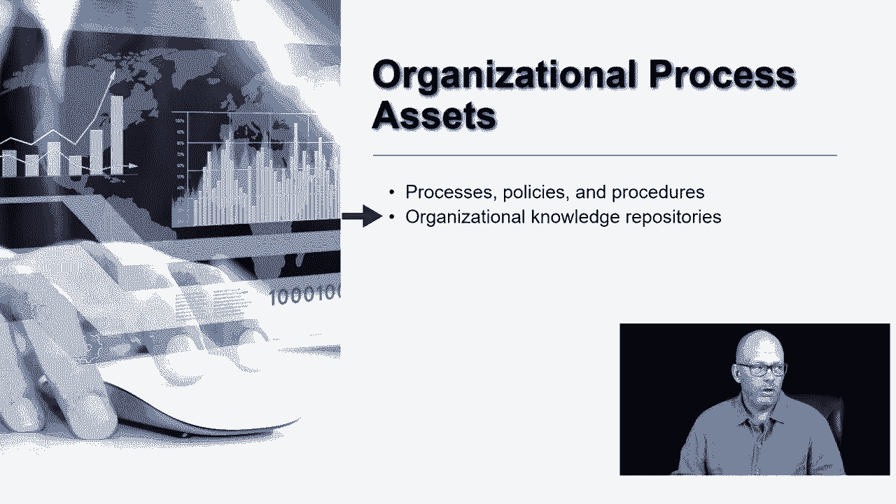

# 【Udemy】项目管理师应试 PMP Exam Prep Seminar-PMBOK Guide 6  286集【英语】 - P27：3. Environments in Which Projects Operate - servemeee - BV1J4411M7R6

Pinboi中的第二章描述了项目运行的环境，所以这是一个项目运作良好的环境，项目存在于不同的组织中，所以它可能不是为了盈利，一个以营利为目的的社区可以是一个社区，可能是一个政府实体。

所以一个项目运行的环境会有所不同，根据项目发生的地点，没有两个环境是相同的，就像没有两个项目是相同的，有一些因素或术语你需要知道，我们将在剩下的课程中看到，描述项目首先运行的环境，我们有企业环境因素。

这些有点像你必须遵循的规则和政策，然后我们有OPA组织流程资产，OPA描述了为您创建的好处或事情，你可以作为项目经理使用，因此，为您创建的历史信息表单或组织使用的软件，这些都是像OPA这样的东西。

然后组织系统描述了这个结构以及在这个结构中工作是如何完成的，所以你可以想象一个非常大的组织，在那个大组织中，采购过程是如何工作的，与一个非常小的初创公司相比，那里的采购是什么样的。

所以组织系统就是你如何在组织中完成事情，但它也描述了层次结构和框架，以及随之而来的成熟度，但他们并不总是像较小的组织那样灵活，他们有更多的灵活性，让我们来看看企业环境因素，我称之为E和组织流程资产。

它们是OPAS和组织系统，所以这里有些事情要考虑，首先，企业环境因素与OPAS，它们确实影响了项目管理方法，OPAS是根据过去的经验为项目创建的，所以歌剧是，正如我提到的，历史信息，类似项目。

UM软件表单，在某种程度上为你创造的东西，虽然你可能会说嗯，历史信息不是为我创造的，我只是利用它，所有的权利，很公平，但是OPAS，然而，在你之前发生的事情，你可以用，企业环境因素，来自项目之外的。

而且往往在企业之外，所以你们公司的一项政策，关于你如何获得，那是个EEF，那不在你的项目范围内，你必须遵守的法律或规定，那是在企业之外，你必须坚持，组织系统也会影响你如何做项目，所以在你的组织里。

你可能有来自各地的团队成员，所以你必须等到团队成员有空才能做项目工作，所以这对你如何管理有影响，以及如何调度资源，相对于一个小组织，每个人都为工作做出贡献的地方，所以它是不同的，使组织系统。

还有你如何交流，你可能有一个正式的沟通部门，或者你可能有一个质量保证部门或风险管理部门，如果一个较小的或不同的公司没有，所以仅仅是你公司的框架和结构就会影响你如何管理你的项目。

关于企业环境因素的更多信息，我只想说清楚这里有两种类型，组织内部的，或外部、内部就像作为项目经理必须遵循的政策、规则和程序，一般来说，如果你被要求在你的项目中表现出某种方式，它是一个企业环境因素。

组织外部，像安全或OSHA的担忧或关于你如何做事的法律，或者如果你和工会有合同，所以你在那里有一段关系，你必须遵守他们的规则，就安排其资源而言，或者那些可能是外部的员工，但通常是外部的。

我们说的是法律法规，内部，或者控制你如何操作的东西。

或者你在那个组织里的行为，也是过程，但这些可能是你如何完成事情的过程，我不会说他们限制你的选择，它们可能是关于项目团队如何与项目经理沟通的政策，所以过程和政策，大家可以看到，有一些重叠。

并不总是企业环境因素，当然也不总是OPA，组织知识库，这是一个新学期，我们将把知识管理看作是一个过程，后来在课程中，后来在Pinbox中，但是组织知识库，我们说的是历史信息，你可以去看看并做一些分析。

做出最好的决定，并为您的项目利用这些信息，所以知道组织知识库这个术语，我们会再看到的，它是OPA的一部分，然后是组织系统。

这就是你公司的结构，你们公司的规定，贵公司的框架，我们称之为治理框架，所以你怎么把事情做完，以及你为了在那个组织中取得成功或运作而必须遵循的规则，报告的管理部门，对谁来说等级制度是什么样的。

然后组织结构是我们接下来会看到的，但我们谈论的是项目团队成员如何参与你的项目，如果他们在其他项目上，并在运作，还有谁负责项目预算项目团队和决策，是项目经理还是职能经理，所以基本上，当你看到组织系统时。

你只考虑结构，治理，然后群体是如何排列的，或不同的业务范围，它们是如何排列的，所以你考虑销售，市场营销，金融，这些人是如何走到一起并相互运作的，影响你如何完成工作的说出来的或未说出来的规则是什么。

所以这肯定会影响你如何管理你的项目，所有的权利，干得好。