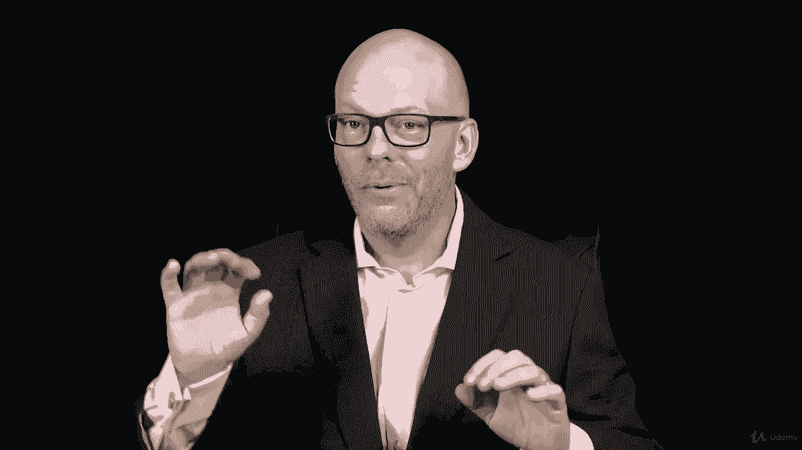
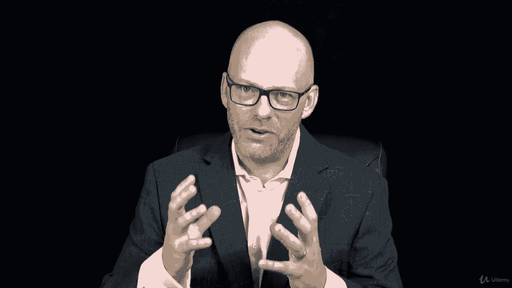

# 【Udemy】项目管理师应试 PMP Exam Prep Seminar-PMBOK Guide 6  286集【英语】 - P270：10. Section Wrap Project Stakeholder Management - servemeee - BV1J4411M7R6

🎼。Great job reaching this point in the course on stakeholder management。

Stakeholder management is a relatively new knowledge area in the history of the Pimbaok。

 It's pretty established here in Pembaok Guide 6 edition。 It was introduced in the fifth edition。

 so it's still relatively young in the history of the Pimbaok guide。 But of course。

 stakeholder engagement and stakeholder management has always happened that you want to engage stakeholders and keep stakeholders involved and excited about your project。

 So stakeholder engagement is closely related to communications。

 So communications and stakeholder engagement overlap。😊，Now， in light of your PMP exam。

 who are your stakeholders as you prepare to pass the PMP？So you think about your colleagues。

 your family， your friends that you've had to make some decisions to not participate in some things to take that time to focus on the PMP and maybe you have some stakeholders in your life who are like。

 oh you don't need that the PMP that's not for you。

 it's too much it's overrated or whatever the case may be。But you've made a decision。

To go towards the PMmpP， you may have some other stakeholders。

 and I know you have at least one that they're cheering you on。

 that they want you excited and they want you to be successful and they want you to study and to learn and to pass this test。

 So you have at least one stakeholder that is a leading stakeholder， but I hope you have a lot more。

At the end of a project， we want to thank the stakeholders and want to thank them for their participation。

 their support， their cheer， and we want to show them what's come out of our project so in your PMP project don't forget to thank those stakeholders who have given you the space and the time to study and have been supportive of your effort to pass the PMP so go to those family members and friends that have cheered you on and show them that you've passed and show them you have succeeded in reaching your goal and of course you can go to those negative stakeholders and show them as well。

Great job finishing this section on project stakeholder management I told you it was a fun section right I think it's enjoyable that it's all about keeping our stakeholders engaged if you have engaged stakeholders then generally your projects are more successful not always。

 but generally we talked about creating a stakeholder management plan doing some analysis on our stakeholders。

 managing that engagement of our stakeholders and maintaining engagement and then we did an exercise about mapping stakeholder engagement with one of those power influence grids about mapping out where these different stakeholders are on their level of authority or interest or power or whichever grid is most appropriate for your project。

😊。

This was the last chapter in the Pimbaok guide， but we're not done yet with the courts。

 We have some more things to talk about to really concrete your learning and your understanding and to keep working towards your goal。

 Our goal of you passing the PMP。 So let's keep moving forward。

 You're almost there I have confidence in you keep pressing on。

