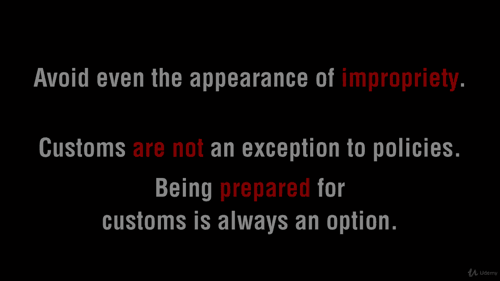
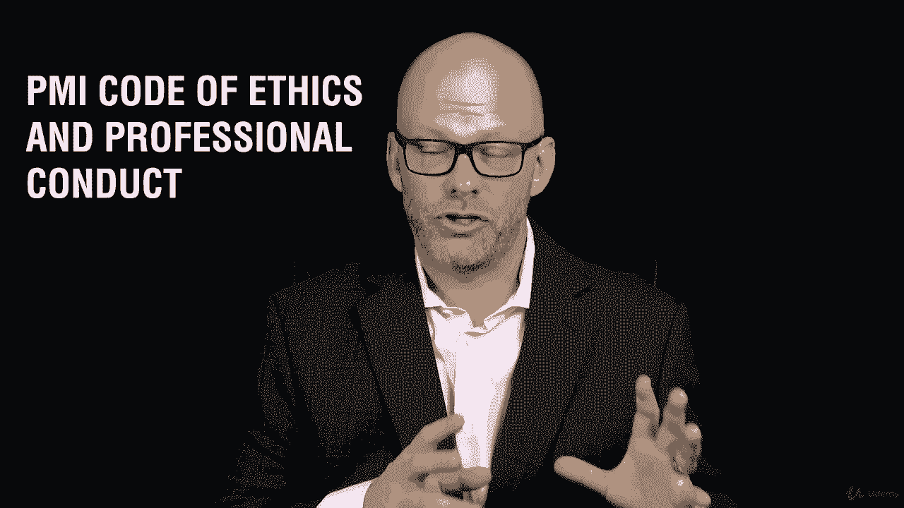

# 【Udemy】项目管理师应试 PMP Exam Prep Seminar-PMBOK Guide 6  286集【英语】 - P271：1. Section Overview Code of Ethics and Professional Responsibility - servemeee - BV1J4411M7R6

Welcome to this section on the PMI Code of Ethics and Professional Conduct。

You will have questions on your exam about ethics that are related to this PM I code of ethics and professional conduct。

 In the past， this was its own category of questions。 Not anymore。 Now。

 these questions are integrated into the different knowledge areas。

 So it's not as clear cut that this may be an ethics question on the code of conduct that it's integrated just like in your role as a project manager。

 you make ethical choices So the exams the same way。 It's not a separate category。

Very muchWe're going to talk about this PMI code of ethics and professional conduct。

 not a terribly long section， but it's an important section that we need to understand the responsibilities to the profession about comply with PMI's rules and policies and being honest。

 advancing the profession， we have responsibilities to the customer and the public。

 we'll talk about truth and honesty about eliminating inappropriate actions and then respecting others and the works of others so that we don't。

 for example， copy someone's test questions directly out of their book and then claim it as their own。

And then we'll talk about downloading the PMI code of ethics and professional conductduct。

So a lot of things here， it's a pretty straightforward assignment though。

 in a pretty straightforward section， so let's hop in and knock this out now。

