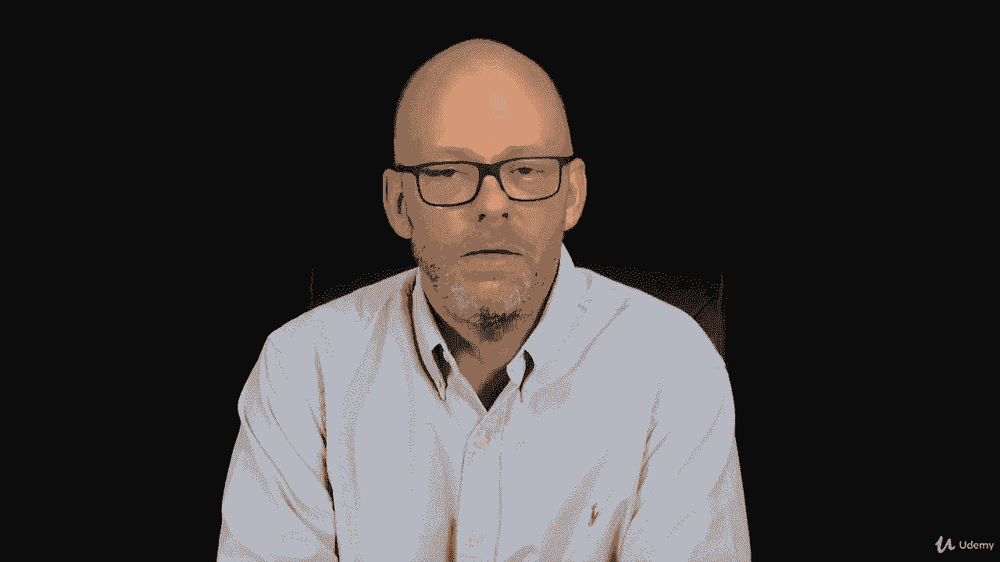
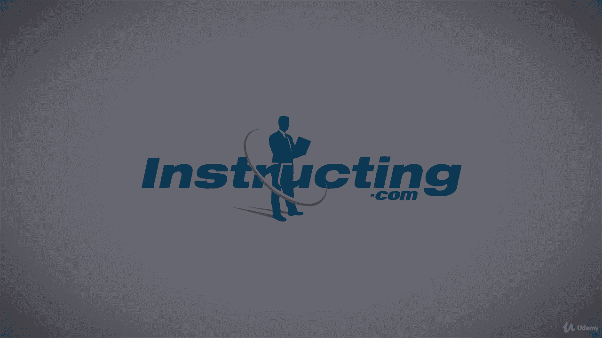

# 【Udemy】项目管理师应试 PMP Exam Prep Seminar-PMBOK Guide 6  286集【英语】 - P272：2. Responsibilities to the Profession - servemeee - BV1J4411M7R6

。

When you apply to pass the PMP exam， you'll fill out the PMP exam application as part of this application you must agree to abide by the PMI code of ethics and professional conduct。

 so this is a document it' part of all PMI certification applications， the PMP and the CAPM。

 the PMI ACP， it's universal to all of the certifications。

You have to agree to its terms and we'll walk through those in a moment if you'd like to read this。

 you can hop out to pmi。org and then you can search for the PMmiI code of Eths and professional conduct it's a PDF document and you can download it or we can just walk through it right now。

The first part is the responsibilities to the profession。As project managers and members of PMI。

 we have a responsibility to the profession of project management。

 we need to abide by the organizational rules and policies and we're talking about PMI right now so on exam applications you must be honest and truthful in what you put down in your exam application as far as test items go you can't tell people what test items are so you can't write down things and sneak out answers or share with others what the test items are。

The answer sheets， talking about the six sheets of scratch paper that you're given at the Prometric center。

 you have to return all six sheets， you can't sneak one out right。

 you have to leave it with the proctor。And then continuing certification reporting are PDUs once you're a PP。

There's honesty in the reporting of your PDUs that you can't claim a PDU if you didn't actually do it。

There also needs to be responsibilities to the profession。

 so as a project manager and as a PMP or a CAPM we have some responsibilities here that we will report violations when there is clear and factual evidence when you have clear and factual evidence so suspecting that someone cheated or suspecting that you have these questions from the testing center and someone says they're real live doesn't mean that they're exactly real live you need to have clear and factual evidence。

If PMI audits you or they ask about a colleague that's being audited。

 you must cooperate with PMI on their queries， it's part of our responsibility as a member of PMI。

We always disclose the appearance of the conflict of interest， so a great example would be。

I have a company and I sell a hardware， I sell different video hardware and different audio visual hardware。

 and my organization where I work， this is kind of my moonlight gig selling this hardware over here。

 but my primary job， they need to buy some of that type of hardware。Well。

 my organization has it no conflict of interest， so even if I get a tiny little margin on it。

 or even if I say I'll sell it to you at cost， that could be a conflict of interest。

 so I must disclose the appearance， even the appearance of a conflict of interest so I could say hey。

 you could buy this from my organization I'll sell it to you at cost。

 no profit margin from me we just pass it through。Well， the other people。

 if they know that's through me， they may say， oh， Joe's making a profit on that。

 It's a real conflict of interest。 He's influenced that decision to help himself。

 So even the appearance of the conflict of interest has to be disclosed。

In our role as a professional， the professional practice here。

 we have to have truth in advertising and sales， we can't say that I've been doing project management since 1945。

 if obviously if not， so we need truth in advertising and truth in advertising in our sales and this includes when we make cost estimates for schedule estimates that we don't sandbag。

 we don't give a very low price and then get the project and once we're in it and the price keeps ratcheting up that we want to be truthful and honest and be fair and ethical。

We have to comply with the laws and the regulations and the ethical standards of the country where that projects being held。

 so if I'm working in France， I adhere to those laws and regulations and even to some extent the ethics in the customs。

But there's a rule of precedence here， if I'm working in the US， again， the laws。

 the regulations and the ethics， in Japan， they have a different set of laws and regulations and so on。

 so each countrys a point of making， you have to understand you need to do research and understand what are the laws。

 the regulations and the ethics of that company， so that helps me behave there。

I also want to have an advancement of the profession。

 so I disperse the code to other project managers and my project team members。

 and I respect the intellectual property of others。So this means。

If an individual were to blatantly plagiarize the questions from my book and publish them as their own。

 they would be violating the code of ethics and professional conduct， so we don't do that。

So intellectual property is to be respected。So you can pick up on that if you want。

 maybe that happened to me， maybe it didn't， I don't know。

 but advanced from the profession is we respect the rights of others。

We have a responsibility the customers to the public that we need to be truthful in our experience and as I mentioned a moment ago。

 truthful in our estimating。The customer is considered to be in charge。

 The customers the most important person in the project。

 and if they want to make additions to the project and they're willing to pay for it and willing to give us time and it's reasonable then they're in charge。

 There's also a confidentiality relationship between a client vendor or the project manager and the stakeholders and some of the information that a project manager is privy to。

 So pity describes the confidentiality that I don't go blab everybody what this confidential information is that I need to keep some of that to myself or keep all of it to myself and not communicate and share things that is not for the public。

 It's not for the whole organization to note。We also have a responsibility to customers and to the public about avoiding the conflict of interest of kind of that same idea of can I buy or purchase for myself？

I want to refrain from accepting inappropriate compensation， so I always follow the laws。

And then the customs of the country， so you want to understand。

 you have to do some research here to understand what are the laws， the regulations， the ethics。

 and the customs， but I follow that order of precedence there。

Some terms you need to know a few extras here for you。

The Su wararf hypotheses is an hypotheses that basically says the language that you speak affects how you think。

 so we may both come to the same conclusion， but if you speak German and I speak English then we have two different ways of thinking to get to the same conclusion。

 so this was the su whf hypotheses and by understanding the language I'm better to understand how people think and operate and act in that culture。

Culture shock is that initial reaction to a forward environment so the first time you go to a new place。

 whether it's a huge city like New York or Paris or a very tiny city like Bshoels。

 Arkansas which is in the middle of nowhere you kind of have that culture shock you're not really used to what's happening there's a lot of moving things or not moving things so you have this culture shock it's that initial where you just feel disoriented and kind of overwhelmed。

So we want to combat culture shock by doing research and understanding what to expect when we get to that forward environment。

Ethnocentrism is where I measure other cultures by my own。

 usually with the attitude that my culture is better than that culture。

 so I mentioned this place in Arkansas so you go to this little tiny town in Arkansas and you might become a big city and you think oh。

 it's kind of kind of backwards here it's like 1950s here it's so slow here。

With the attitude that where you're from is better， it's not better or worse， it' is different。

 but afterocs citricism is just that measurement where you put down other people's culture based on your own culture。

The universeverse of that can be true as well。 Maybe you are from a small town and you go to Paris。

 And the first time you're in Paris， it can be just overwhelming。

 It's beautiful and everyone's so sophisticated。 And you know。

 it's Paris The Eiffel Tower and the Louvre。 and it's just it's a fabulous city。

 but it can be kind of overwhelming。 And then you think oh， you know。

 I'm really backwards in these people are so far advanced to me， how can I possibly work here。

 contribute here。 you're measuring your culture by others。 That's also ethnocentrism。😊。

Some exam tips for you， if you don't know what to do。

 you get one of these ethical questions so there's five things you can do when you think about these questions first off。

 you always follow the laws of the country， no bribes， no inappropriate compensation。

 nothing illegal， follow the laws of the company。I'm sorry of the country。

The second thing is then you follow the company policies。

 so it may be perfectly fine in the country you're in to accept a gift。You know。

 for two to $300 or as much as you want， but your company has a policy that no gifts over $25 or no gifts period。

 so you would have to say I know it's legal， but I know I can't accept that so you have to politely turn down that gift because you can't。

Break the company policy。Then customs， if it's not illegal and it's not against your company policy。

 then you can follow the customs， so the customs may you get a little gift at the end of the project。

And that's fine as long as it's not illegal and it's not against your company policy。

 if your company policy says no gifts and they want to give you a gift at the end of the project。

 you have to politely decline it， you can't accept it and then donate it or can't accept it and give it back later。

You can't accept it because then it's the appearance of impropriety so your customs have to be in alignment with the company and the laws of the country and then your own personal ethics if there is no law against it there is no company policy。

 but it's not really a custom but they want to give you a new sports car with your project decision you might ethically feel like well。

 this is a bribe so then you go by your ethics and if you still don't know what to do you say what would an angel do in this scenario so a little you know sometimes you choose the most restrictive will help you with these ethical questions。

All right， so that is our review of the exam tips for the PMI Code of Eics and Professional conductduct。

