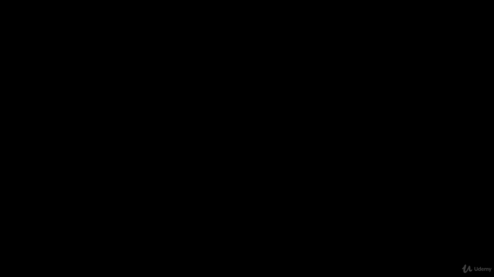
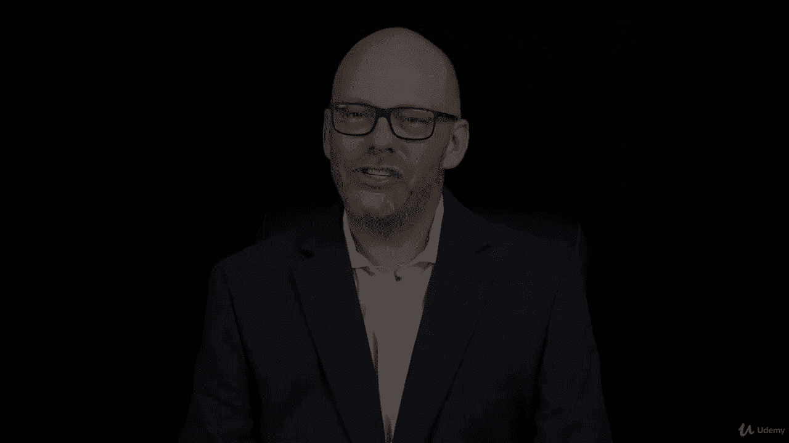

# 【Udemy】项目管理师应试 PMP Exam Prep Seminar-PMBOK Guide 6  286集【英语】 - P273：5. Section Wrap Code of Ethics and Professional Responsibility - servemeee - BV1J4411M7R6

🎼。In this section we talked all about the PMI code of ethics and Pro responsibility you went out to PMI's website and downloaded a copy of this document and you printed it out and read it。

When you think about the PMP exam。It's a pretty scary exam。

 and it's real tempting to search the web or to go into some Reddit groups or to even purchase some less than scrupulous products to help you。

Earn the PMP。My only advice here is you want to be very careful about where you get your questions from and sharing questions because you don't want to be in violation of the PMP of the PMI code of ethics and professional conduct that you want to make certain that you aren't sharing things that someone has stolen and so that breaks even if you don't know it。

 that breaks the PMI code of ethics and professional conduct you also want to be very careful in your news groups and your Facebook groups and whatnot that you don't share particulars about the exam。

 Well I had this one question with this term and yadida that's you know pretty much a violation of the code of ethics and professional responsibility so you want to use caution and use some common sense here I'm not going to give you a big warning I don't think he was going come chase after you but we want to just be careful of what we share online that we don't accidentally put ourselves in an uncomfortable position with PMI。

All right， so that's a little coach to you， just a tiny little worry， I wouldn't ft over it too much。

Great job finishing this section on the PMI Code of Es and Profession conduct。

 We discussed this document， which you can download from PMorg。 In fact， you did in the assignment。

 and then you read through that document。 But we talked about the responsibilities to the profession and the rules and the policies and about being honest and ethical and advancing the profession。

 We talked about our responsibilities to our customers and to the public and how that aligns with these code of ethics。

 talked about eliminating inappropriate actions in respecting others in the work of others。

 including questions in their book。😊。

And then we talked about as a PMP candidate that you want to be careful that you want to respect others and adhere to the code of ethics and professional conduct。

 so a really important section， albeit a small section， but great job， you knocked it out。

 let's keep moving forward。