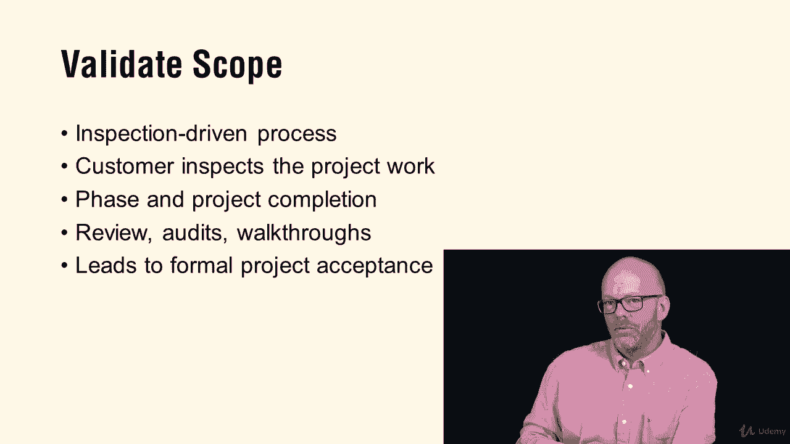

# 【Udemy】项目管理师应试 PMP Exam Prep Seminar-PMBOK Guide 6  286集【英语】 - P276：3. Project Scope Management - servemeee - BV1J4411M7R6

When we talk about a predictive life cycle versus an agile or adaptive life cycle。

 we need to go back and look at the idea of the triple constraints and predictive versus the agile triangle of constraints in a predictive the scope is typically fixed this is what you have to create these are the requirements where in an agile the scope varies because of that product backlog it can shift and priorities change time and cost typically vary in triple constraints for the scope remains constant。

Time and cost in agile is fixed， so it's considered an inverted triangle when we talk about the agile triangle of constraints。

 so just be familiar with that idea that an agile time and cost is fixed and the scope varies versus triple constraints where time and cost can vary and the scope should remain constant。

The difference between the charter and the scope， so we go back to the idea of the charter。

 the charter is all about high level， the project or purpose or justification。

The measurable project objectives， what are the high level requirements， the description。

 what's the overall project risk and our milestones？Do we have preapproved financial resources。

 so how much what's the summary budget here？Stakeholder list。

 you have some requirements to start with， you have the project manager。

 what's the roles and responsibilities for the PM and the name and authority of the sponsor so the charter is all about authorizing the work and authorizing the project manager the scope is all about what we will create。

So we have the authority now we create it in the scope so what is the project scope description。

 what are the deliverables， how do we know we're done so what's the acceptance criteria and are there any project exclusions so things that are out of scope so that's very important to know。

Another scope management process you must be familiar with is validate scope。

 Valate scope is about the customer receiving， signing off， accepting what we've created。

It is an inspection driven process and our goal is the customer to accept the work to have formal acceptance remember this could happen at the end of a phase。

 always at the end of a project， or when you create a major deliverable you could validate scope so those are some key things you want to know from chapter5 in the Pibaok on scope management。

