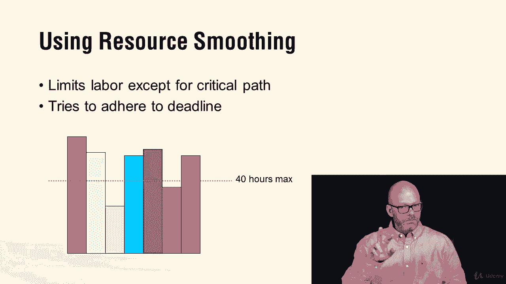

# 【Udemy】项目管理师应试 PMP Exam Prep Seminar-PMBOK Guide 6  286集【英语】 - P277：4. Project Schedule Management - servemeee - BV1J4411M7R6

🎼。🎼，A term or theory you want to be familiar with is the theory of constraints remember this theory goes to what's the most limiting factor。

 what's the most important limiting factor and then we work to eliminate that factor or reduce its impact the constraintss often the bottleneck in your schedule so it's a scientific method to improvement and this is used in lean manufacturing and of course is based on the book the goal so the theory of constraints think of the bottleneck and you're trying to improve the bottleneck。

Then we have some dependency determination， you should know。

Mandatory dependencies ABC has to be done in that order。 that's hard logic。

 Disctionary dependencies is soft logic。 you can do it in any particular order that you want。

External dependencies are an external constraint， I'm waiting for the vendor to deliver the materials。

 I can't get to work till I have the materials， so I have a constraint that's outside of my control。

Internal dependencies are also a type of hard logic。

 so my project is dependent on your project and until you complete that deliverable from your project。

 my project's kind of stalled out so we have an internal dependency， some hard logic。In chapter 6。

 you want to go back and make sure you're familiar with the scheduleedule network diagram you want to know the forward pass and the backward pass。

 so some tips here to remember。When you get a network diagram。

 the first thing you want to do is to write down all the paths to completion and their duration and that alone will show you the critical path。

 remember the critical path is the longest path to completion we also want to be certain that we look at forward path and backward path and on the forward path we look at when we have two activities feeding into like activity C there so you can see B and F both feed into C。

 you can't start C until both of the predecessors are complete so you don't want to just go all the way through one path on your forward path you have to do it methodically that you have to pay attention when you have two tasks that feed into it and in this example you can see that C the early start for C is 12 that even though activity B ends on day 8 F ends on day 11 so B and F both have to be done before C can。

So our forward pass， our backward pass and then you find the float so if you're still sketchy on this I encourage you to go back to chapter 6 in the pinbook back to our course in that section on schedule management and dig in and look at the float scenario in the videos there。

Some other terms with schedule leads and lags member lead is accelerated time lead allows activities to overlap。

 you bring them closer together and overlap lag is always waiting time You' moving。

 you are purposely moving things apart and your network diagram lag two days of lag would be like plus two on this downstream activity lead two days of lead would be negative to that you bring it back two days off of its start date。

So lag is a way lead is negative， you're bringing it closer to the project start date。

A couple of terms here on float， remember we have free float。

 that's how long an activity can be delayed without affecting the successor activity。

Total float is how long an activity can be delayed without affecting the project end date and project float means you've got a big window to get this project done and so you can pick up and put down the project as you want so it's a 30 day project but you have 90 days to complete it you have a lot of project float there。

So those are some terms with finding float。Two terms you want to know also when it comes to managing resources and how many hours they can work per week。

 we have resource leveling resourceleing remembers is that all resources regardless of who they are and what they're doing there's a cap on how many hours they can work in a given time period so for example here you can see we have each one of these bars represents a different team member so anything above 40 hours they have to do next week。

 so it could cause the project to take longer because you're limited to the amount of hours you can do in one work week that's resource leveling。

Now， resource smoothing means that。We limit the labor as well，40 hours max。

 unless you have activities that are on the critical path。

 those we will allow those individuals to continue to work more than the 40 hours max because smoothing is it smooths it out。

 It doesn't just slice it off where leveling is level smoothing is okay we're going to generally smooth this out people can only get over time if they're on a critical path activity so that's smoothing and leveling don't get tricked on those smoothing is you're smoothing it down leveling is like you just slice it off。

 It's level， don't care what type of activity you're on。

Alright， great job。 Those are some terms for schedule management。 Keep moving forward。

